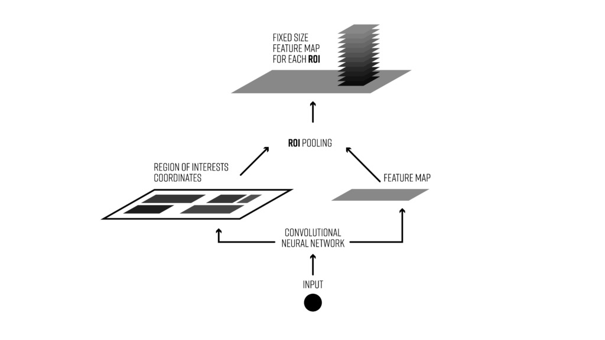
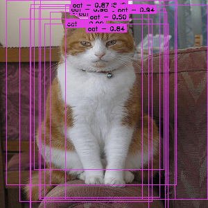
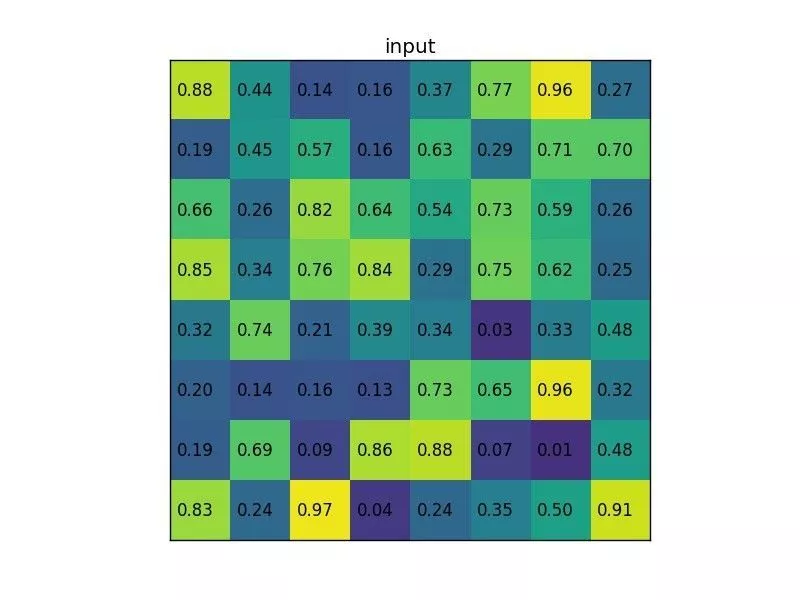
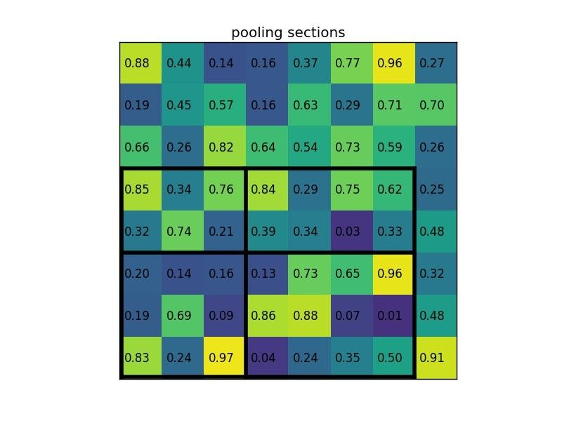
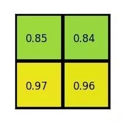

# 1 简介

文章翻译自：https://deepsense.ai/region-of-interest-pooling-explained/

**感兴趣区域池化（Region of interest pooling）**（也称为**RoI pooling**）是使用卷积神经网络在目标检测任务中广泛使用的操作。例如，在单个图像中检测多个汽车和行人。其目的是对非均匀尺寸的输入执行最大池化以获得固定尺寸的特征图（例如7×7）。

我们刚刚发布了 TensorFlow 的 RoI 池化层的开源实现（ [here](https://github.com/deepsense-ai/roi-pooling)）。在这篇文章中，我们将简单介绍一下这个有趣的神经网络层。但首先，让我们从一些背景开始。

计算机视觉的两个主要任务是对象分类和对象检测。在第一种情况下，系统应该正确标记图像中的主要对象。在第二种情况下，它应该为图像中的所有对象提供正确的标签和位置。当然，计算机视觉还有其他有趣的领域，例如图像分割，但今天我们将重点关注检测。在此任务中，我们通常应该在先前指定的一组类别中的任何对象周围绘制边界框**bounding boxes**，并为每个对象分配一个类。例如，假设我们正在开发一种自动驾驶汽车算法，我们想使用摄像头来检测其他汽车、行人、骑自行车的人等——我们的数据集可能如[this.](https://www.youtube.com/watch?v=KXpZ6B1YB_k)所示。

在这种情况下，我们必须在每个重要对象周围画一个框并为其分配一个类。该任务比 MNIST 或 CIFAR  等分类任务更具挑战性。在视频的每一帧上，可能有多个对象，其中一些对象重叠，一些对象不可见或被遮挡。此外，对于这样的算法，性能可能是一个关键问题。特别是对于自动驾驶，我们每秒必须处理数十帧。

# 2 经典架构

我们今天要讨论的目标检测架构分为两个阶段：

* **Region proposal** 区域提议：给定输入图像，找到可以放置对象的所有可能位置。此阶段的输出应该是对象可能位置的边界框列表。这些通常称为区域提案或感兴趣区域。有很多方法可以完成此任务，但我们不会在本文中讨论它们。
* **Final classification** 最终分类：对于前一阶段的每个区域提案，决定它是属于目标类还是背景类。这里我们可以使用深度卷积网络。

Object detection pipeline with region of interest pooling 具有感兴趣区域池化的目标检测流程

# 3 为什么需要ROI pooling

通常在提案阶段(proposal)我们必须生成很多感兴趣的区域(regions of interest)。为什么？如果在第一阶段（区域提议 **region proposal**）期间未检测到对象，则无法在第二阶段对其进行正确分类。这就是为什么区域提案(region proposals)具有高召回率极其重要。这是通过生成大量提案(proposals)（例如每帧几千个）来实现的。其中大多数将在检测算法的第二阶段被归类为背景。

这种架构存在一些问题：

* 生成大量感兴趣区域可能会导致性能问题。这将使实时对象检测难以实现。
* 就处理速度而言，它不是最佳的。稍后会详细介绍这一点。
* 您无法进行端到端训练，即您无法在一次运行中训练系统的所有组件（这会产生更好的结果）

这就是感兴趣区域池化(region of interest pooling)发挥作用的地方。

# 4 什么是ROI pooling

感兴趣区域池（Region of interest pooling ）是用于对象检测任务的神经网络层。它由 Ross Girshick 于 2015 年 4 月首次提出（文章可以在[here](https://deepsense.ai/wp-content/uploads/2017/02/1504.08083.pdf)找到），它实现了训练和测试的显着加速。它还保持了较高的检测精度。该层有两个输入：

* 从具有多个卷积层和最大池化层的深度卷积网络获得的固定大小的特征图。
* 表示感兴趣区域列表的 N x 5 矩阵，其中 N 是 RoI 的数量。第一列表示图像索引，其余四列是该区域的左上角和右下角的坐标。

一张来自Pascal VOC数据集的图像，标注有区域提议（粉色矩形）。

RoI pooling 实际上有什么作用？对于输入列表中的每个感兴趣区域，它会获取与其对应的输入特征图的一部分，并将其缩放到某个预定义的大小（例如，7×7）。缩放是通过以下方式完成的：

* 将候选区域划分为大小相等的部分（其数量与输出的维度相同）
* 找出每个部分中的最大值
* 将这些最大值复制到输出缓冲区

结果是，从不同大小的矩形列表中，我们可以快速获得具有固定大小的相应特征图列表。请注意，RoI  pooling输出的维度实际上并不取决于输入特征图的大小，也不取决于区域提案的大小。它仅取决于我们将提案划分为的部分数量。  RoI pooling有什么好处？其中之一是处理速度。如果帧上有多个对象提案（通常会有很多），我们仍然可以对所有对象使用相同的输入特征图。由于在处理的早期阶段计算卷积非常昂贵，因此这种方法可以节省我们大量时间。

# 5 ROI pooling 例子

让我们考虑一个小例子来看看它是如何工作的。我们将在单个 8×8 特征图、一个region of interest和 2×2 输出大小上执行region of interest pooling 。我们的输入特征图如下所示：

假设我们还有一个区域建议（region proposal）（左上、右下坐标）：(0, 3), (7, 8)。在图片中它看起来像这样：

通常情况下，每个特征图都会有多个特征图和多个提案，但我们在示例中只是一个简单的例子。

通过将其分为 (2×2) 个部分（因为输出大小为 2×2），我们得到：

请注意，感兴趣区域的大小不必完全被池化部分的数量整除（在本例中，我们的 RoI 为 7×5，并且我们有 2×2 池化部分）。

每个部分的最大值为：

这就是兴趣区域汇集层的输出结果。下面是我们以动画形式展示的示例：

关于 RoI Pooling，最重要的事项是什么？

* 这是用于目标检测任务的
* 它允许我们重用卷积网络的特征图
* 它可以显著加速训练和测试时间
* 它允许以端到端的方式训练目标检测系统

如果您需要 TensorFlow 中 RoI 池化的开源实现，您可以在[here](https://github.com/deepsense-io/roi-pooling).找到我们的版本。

# 附录：

https://deepsense.ai/region-of-interest-pooling-explained/

