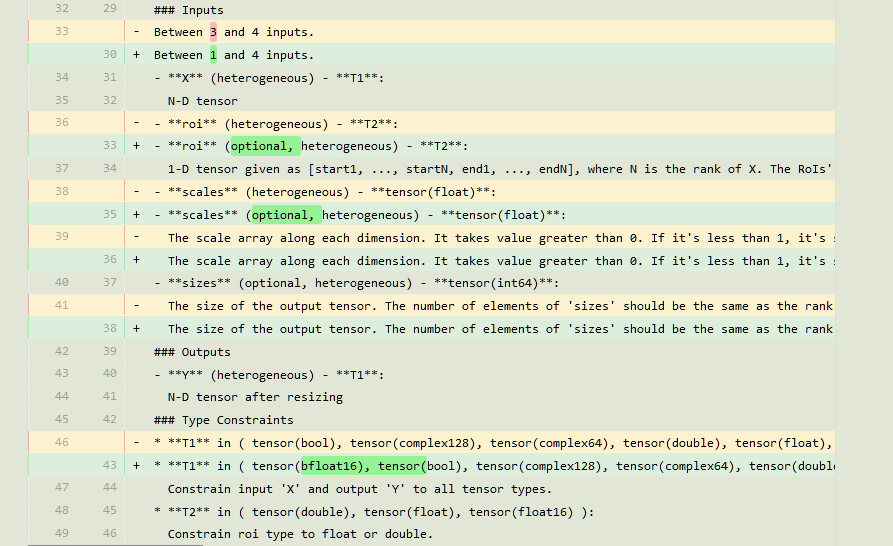

# 1 resize层多出了一个roi输入

我使用下面的代码编写一个简单的网络，包含conv、relu、resize层，并保存为onnx文件。

```python
import torch
import torch.nn as nn
import torch.onnx

class SimpleModel(nn.Module):
    def __init__(self):
        super(SimpleModel, self).__init__()
        self.conv1 = nn.Conv2d(in_channels=3, out_channels=3, kernel_size=3, stride=1, padding=1)
        self.relu = nn.ReLU()
        self.upsample = nn.Upsample(scale_factor=(1, 1, 2, 2), mode='bilinear', align_corners=True)

    def forward(self, x):
        x = self.conv1(x)
        x = self.relu(x)
        x = self.upsample(x)
        return x

# 创建模型实例
model = SimpleModel()

# 创建一个虚拟输入
dummy_input = torch.randn(1, 3, 224, 224)

# 导出模型为 ONNX 文件
torch.onnx.export(
    model,                    # 模型
    dummy_input,              # 输入
    "simple_model.onnx",      # 导出路径
    opset_version=11,         # ONNX opset 版本
    input_names=['input'],    # 输入名称
    output_names=['output']   # 输出名称
)

print("Model has been exported to simple_model.onnx")

```

使用netron打开发现其中的resize层有点不对劲，如下面的左半部分

可以看到resize层有三个输入，分别是 X、roi、scales。其中roi是空值。但是我在构建模型没有这个roi参数啊？哪里来的roi参数？


## 2 分析

原来这是和onnx的版本有关系。ONNX（Open Neural Network Exchange）是一个开放格式，用于表示深度学习和机器学习模型，使得模型可以在不同的框架之间共享。

上面代码的最后导出onnx时，就有一个参数指定这个版本。

```python
torch.onnx.export(
    model,
    args,
    f,
    export_params=True,
    verbose=False,
    training=torch.onnx.TrainingMode.EVAL,
    input_names=None,
    output_names=None,
    operator_export_type=torch.onnx.OperatorExportTypes.ONNX,
    opset_version=None,
    do_constant_folding=True,
    dynamic_axes=None,
    keep_initializers_as_inputs=None,
    strip_doc_string=True,
    custom_opsets=None,
    enable_onnx_checker=True,
    use_external_data_format=False,
    dynamic_axes_input_output=None,
    export_modules_as_functions=False
)

```

`opset_version` 参数指定了 ONNX 运算符集的版本。每当 ONNX 发布新版本时，它可能会引入新的运算符、更新现有运算符的行为或者移除旧的运算符。因此，不同版本的 ONNX 可能支持不同的运算符集。

当你使用 `torch.onnx.export` 函数时，`opset_version` 参数决定了导出的 ONNX 模型所使用的运算符集版本。较高的 `opset_version` 值通常意味着你可以利用更多的 ONNX 运算符和更现代的特性，但这也意味着你可能需要确保目标 ONNX 运行时环境支持相同的 opset 版本。

下面时onnx的官网介绍不同的运算符集版本的resize层的特性，https://onnx.ai/onnx/operators/text_diff_Resize_11_13.html


从上面可以看出resize层在11和13版本的区别就是输入inputs数量的修改了。

因此修改一下上面代码中 opset_version = 14 就可以得到右侧图的正常的resize层了。也就是只有两个输入 x 和 scales。