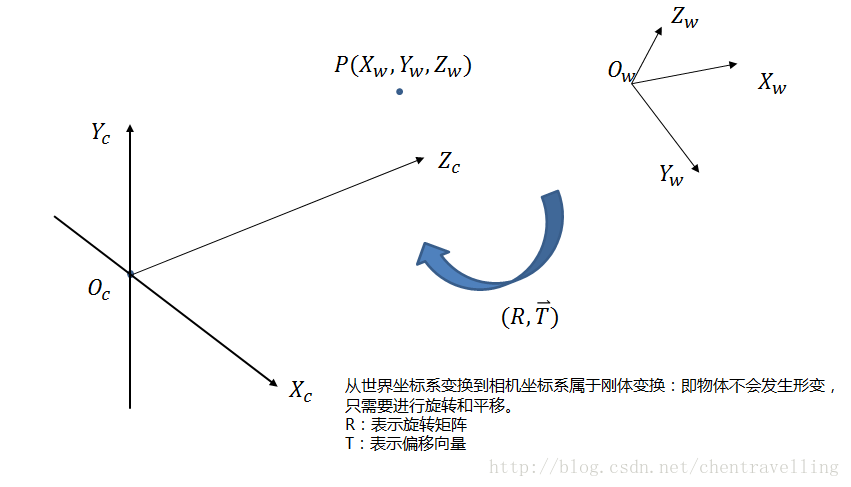

# 1 针孔模型Pinhole mode

在科学研究中，一个现象内部的过程总是复杂而难以清晰看透，而聪明的学者们总会用最简单的模型去做初始描述，提出一个相对简单的模型。成像过程亦不例外，他们将三维世界中的坐标点映射到二维图像平面的过程用一个几何模型进行描述，这个模型有很多种，其中最简单的称为针孔模型。

针孔成像的原理大家都学过，现实世界中源于某个物体的光线穿过针孔，会在底板上投影成一幅倒立的图像。如图1所示：

图1 针孔模型1

将针孔模型对应到成像过程中，现实世界的物体即为三维空间的成像目标，针孔为摄像机中心，倒影成像平面则为二维影像平面。如图二（左）所示，我们用简单的线条来绘制这样的关系，摄像机中心到成像平面之间的距离我们称之为焦距 f f f。但是倒立的成像总感觉别扭，因此转换一下，将成像平面拿到相机前方来，保持焦距为 f f f，由成像过程可知，图像此时不再是倒立的了，解放了大家的脖子，见图2（右）所示。

	
图2 针孔模型2

从针孔模型中，我们可以找到一个特征，那就是现实世界的任一点、其在成像平面上的投影点、相机中心在一条直线上，这种特征称为中心投影或者透视投影，也是做成像分析的基础。透视投影将三维空间投影到二维平面上，是一种降秩空间透射变换（三维空间降成了二维空间）。

# 2 四个坐标系

相机模型中，三维世界中的某一点和其对应的像素点是通过坐标系的转换得到的。这个过程中会涉及到四个坐标系，即世界坐标系、相机坐标系、图像坐标系、像素坐标系。下面将详细介绍四个坐标系的转换过程。

**首先看下几个坐标系在放在一块的样子：**

1. **世界坐标系：**根据情况而定，可以表示任何物体，此时是由于相机而引入的。单位m。
2. **相机坐标系：**以**摄像机光心**为**原点**（在针孔模型中也就是针孔为关心），z轴与光轴重合也就是z轴指向相机的前方（也就是与成像平面垂直），x轴与y轴的正方向与物体坐标系平行，其中上图中的f为摄像机的焦距。单位m
3. **图像物理坐标系**（也叫平面坐标系）：用物理单位表示像素的位置，**坐标原点**为**摄像机光轴与图像物理坐标系的交点位置**。坐标系为图上o-xy。单位是mm。单位毫米的原因是此时由于相机内部的CCD传感器是很小的，比如8mm x 6mm。但是最后图像照片是也像素为单位比如640x480.这就涉及到了图像物理坐标系与像素坐标系的变换了。下面的像素坐标系将会讲到。
4. **像素坐标系：**以像素为单位，**坐标原点**在**左上角**。这也是一些opencv，OpenGL等库的坐标原点选在左上角的原因。当然明显看出CCD传感器以mm单位到像素中间有转换的。举个例子，CCD传感上上面的8mm x 6mm，转换到像素大小是640x480. 假如dx表示像素坐标系中每个像素的物理大小就是1/80.  也就是说毫米与像素点的之间关系是piexl/mm.

## 2.1 图像物理坐标系到像素坐标系

**图像像素坐标系**：是一个二维直角坐标系，反映了相机CCD芯片中像素的排列情况。其原点 O 位于图像的左上角， u 、 v 坐标轴分别余图像的两条边重合。像素坐标为离散值（0，1，2，…），以像素（pixel）为单位。
**图像物理坐标系**：为了将图像与物理空间相关联，需要将图像转换到物理坐标系下。原点 O位于图像中心（理想状态下），是相机光轴与像平面的交点（称为主点）。 X 、Y 坐标轴分别与 u 、v轴平行。两坐标系实为平移关系，平移量为 (u0,v0)。

假设相机感光器件中单个像素的物理尺寸为 `dx*dy`

完成了图像物理坐标系到图像像素坐标系的转换。

## 2.2 相机坐标系到图像物理坐标系

从相机坐标系到图像坐标系，属于**透视投影**关系，从3D转换到2D。 也可以看成是针孔模型的改变模型。满足**三角形相似定理**。

下图中 P(Xc,Yc,Zc)是相机坐标系的一个点 p(x,y)是投影到图像物理坐标系

## 2.3 世界坐标到相机坐标系

物体之间的坐标系变换都可以表示坐标系的**旋转变换**加上**平移变换**，则世界坐标系到相机坐标系的转换关系也是如此。绕着不同的轴旋转不同的角度得到不同的旋转矩阵。如下：

那么世界坐标系到相机坐标系的变换如下：

**综上所述，大家可以看出四个坐标系之间存在着下述关系 ( 矩阵依次左乘 )**

其中相机的内参和外参可以通过张正友标定获取。通过最终的转换关系来看，一个三维中的坐标点，的确可以在图像中找到一个对应的像素点，但是反过来，通过图像中的一个点找到它在三维中对应的点就很成了一个问题，因为我们并不知道等式左边的Zc的值。

# 3 畸变参数

畸变主要分为径向畸变和切向畸变。

## 3.1 径向畸变

**径向畸变**：沿着透镜半径方向分布的畸变；

产生原因：是由透镜质量引起的，光线在远离透镜中心的地方比靠近中心的地方更加弯曲。

径向畸变主要包括桶形畸变和枕形畸变两种。

一般来讲，成像仪中心的径向畸变为0，越向边缘移动，畸变越严重。不过径向畸变可以通过下面的泰勒级数展开式来校正：

   这里`(x, y)`是畸变点在成像仪上的原始位置，r为该点距离成像仪中心的距离，`(xdr ，ydr)`是校正后的新位置。

对于一般的摄像机校正，通常使用泰勒级数中的前两项k1和k2就够了；对畸变很大的摄像机，比如鱼眼透镜，可以使用第三径向畸变项k3

## 3.2 切向畸变

**切向畸变：**切向畸变是由于透镜本身与相机传感器平面（像平面）或图像平面不平行而产生的。也就是说，如果一个矩形被投影到成像仪上时，可能会变成一个梯形。切向畸变可以通过如下公式来校正：

 切向畸变主要发生在相机传感器和镜头不平行的情况下；因为有夹角，所以光透过镜头传到图像传感器上时，成像位置发生了变化。

切向畸变的矫正公式如下

## 3.3 畸变矫正

通过上面介绍的径向畸变和切向畸变模型，可以得到两个模型最终作用于真实图像后的矫正模型。

为什么是相加呢，可以这样理解，畸变就是距离的变化，而距离的变化反映到坐标值上就是加减的关系。

# 4 相机标定参数的含义

1. **fx** 和 **fy**：
   - `fx` 表示相机的焦距在图像水平方向上的分量。
   - `fy` 表示相机的焦距在图像垂直方向上的分量。
   - 通常，这两个值相等，表示相机的焦距在水平和垂直方向上是一致的。
2. **cx** 和 **cy**：
   - `cx` 表示图像的主点（principal point）在图像水平方向上的坐标。
   - `cy` 表示图像的主点在图像垂直方向上的坐标。
   - 主点是图像中心点，它是光学轴（光线）与图像平面的交点。
3. **k1** 和 **k2**：
   - `k1` 和 `k2` 是径向畸变系数。
   - `k1` 表示一阶径向畸变系数，`k2` 表示二阶径向畸变系数。
   - 畸变系数用于校正由于透镜形状不完美而引起的径向畸变。
4. **p1** 和 **p2**：
   - `p1` 和 `p2` 是切向畸变系数。
   - `p1` 表示一阶切向畸变系数，`p2` 表示二阶切向畸变系数。
   - 切向畸变系数用于校正由于透镜的装配误差而引起的切向畸变。
5. **rx** 和 **ry**：
   - `rx` 和 `ry` 是相机的像素宽度和高度的倒数。
   - 通常，它们等于图像的水平像素数和垂直像素数的倒数。
   - 用于将相机坐标系中的点映射到图像坐标系中。

# 附录：

* [机器视觉——相机标定（四个坐标系的关系）](https://blog.csdn.net/zxf1314ll/article/details/115654320)

* [立体视觉入门指南（1）：坐标系与相机参数]( https://blog.csdn.net/rs_lys/article/details/113248118?spm=1001.2014.3001.5501)

* [**一、相机标定基本理论**](https://www.cnblogs.com/uestc-mm/p/10527799.html) 

* [相机标定的来龙去脉（详解标定原理、畸变矫正原理、使用经验）](https://blog.csdn.net/sinat_38737592/article/details/109706380)

*  

  