# 1 什么是mAP

mAP（mean Average Precision 平均精度），是一个经常被用来衡量目标检测模型是否具有较好性能的指标。

推荐一个github上的解释和代码实现 https://github.com/rafaelpadilla/Object-Detection-Metrics

上面讲的很清楚。

# 2 基本概念

目标检测问题不同于一般的分类问题，不仅要检测出目标，输出目标的类别，还要定位出目标的位置。而mAP是目标检测算法中最常用的评估指标。
 1）AP(Average Precision)是PR曲线围成的面积，用来衡量对一个类检测的好坏。
 2）mAP(mean Average Precision)是所有类AP的平均值，衡量多类别目标检测的好坏。

## 2.1 交并比 IoU(Intersection over Union)

交并比（IOU）是度量两个检测框（对于目标检测来说）的交叠程度，IOU由预测边界框和地面真实边界框之间的重叠面积除以它们之间的结合面积得出：公式如下：

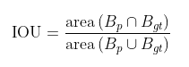

B_gt 代表的是目标实际的边框（Ground Truth，GT），B_p 代表的是预测的边框。

下图说明了地面真实边界框（绿色）和检测到的边界框（红色）之间的IOU。

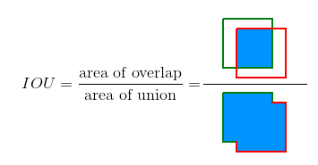

## 2.2 GT

**GT**：Ground Truth，也就是标签，对应了真实框的大小位置以及分类。

## 2.3 score或confidence

**score或confidence**：每个预测框的置信度，表示这个预测框包含某个目标的可能性，score或者confidence越高，表示模型认为其包含某种目标的可能性越大。

## 2.4 IoU threshold

IoU threshold：人工设定的IoU阈值。如果预测框与GT框的IoU大于此阈值，则认为预测框与GT框非常相似，否则就认为预测框与GT差别很大。针对不同数据集，这个取值会不一样，因为针对不同数据集有不同的评价标准，比如说Pascal VOC数据集的设定是0.5，而COCO数据集设定了多个标准，从而会参考在多个IoU threshold下的mAP来评判模型的好坏。

## 2.5 score threshold

score threshold：人工设定的score或confidence的阈值，对于某一类来讲，预测框的分类置信度大于此阈值则认为这个框检测到了这类物体，保留预测框，小于这个值则认为这个框中没有检测到这类物体，舍弃预测框。针对这一步筛选出的预测框，通常会再进行一次NMS，消除冗余的框，然后将剩下的边界框参与TP、FP、FN、TN的计算。

## 2.6 TP FP FN TN

* **True Positive (TP)**: A correct detection. Detection with IOU ≥ *threshold*。针对所有经过score threshold筛选出的预测框，针对一个预测框来讲，如果边界框位置大小与某个GT非常相似（检测框与GT的IoU ≥ IoU threshold），那么我们就认为这个框就是一个正确的检测结果，并将其与该GT配对，TP即为这类检测框的数量。注意，在实际预测中，经常出现多个预测框和同一个GT的IoU都大于阈值，这时通常只将这些预测框中score最大的算作TP，其它算作FP。
* **False Positive (FP)**: A wrong detection. Detection with IOU < *threshold*。
* 边界框位置大小不达标（检测框与GT的IoU < IoU threshold）又或者这个预测框是多余的预测框（即这个框对应的GT的已经存在一个TP与之对应）的数量。在计算的时候，一般将检测出的所有边界框数量减去所有预测正确边界框的数量，也就是所有经过score threshold筛选出的预测框除去TP，剩下的边界框的数量就是FP。

* **False Negative (FN)**: A ground truth not detected。没有检测到的 GT 的数量。即对于所有GT，除去所有被预测正确的边界框（也就是TP）对应的GT，剩下的没有被检测到的GT的数量。又称为被模型检测为负的正样本。
* **True Negative (TN)**: Does not apply（在mAP中用不到，通常在分类任务中会用到）. It would represent a corrected misdetection. In the object detection task there are many  possible bounding boxes that should not be detected within an image.  Thus, TN would be all possible bounding boxes that were corrrectly not  detected (so many possible boxes within an image). That's why it is not  used by the metrics.

*threshold* 阈值：根据指标，通常设置为50%、75%或95%。

## 2.5 Precision 查准率 和Recall 查全率

**Precision（准确率）**准确率是模型给出的所有预测结果中，正确预测的结果所占的比例。其中TP+FP就是根据score threshold筛选出来的候选框的数量。

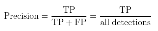

**Recall（召回率）**召回率是模型预测的正确结果最多能覆盖多少GT。这也解释了为什么在计算TP时，同一个GT只对应一个正确的检测框TP，如果允许一个GT对应多个正确的预测框，假如对于每个GT都存在大于一个的正确预测框数，那么最终得到的召回率很明显会大于1，这是不符合常理的。其中TP+FN就是GT的数量。
			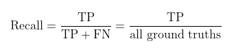

## 2.6 PR曲线

一般来说， P 和 R是相互制约的，一个越高另一个就越低，统计上用 PR 曲线来描述二者的关系。PR曲线越往往右上角越好。

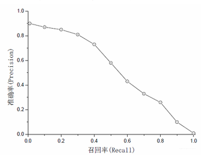

从以上定义中可以得到，score threshold影响着每个类别中TP,FP,FN的数量，从而影响了precision和recall的计算结果。那么threshold到底是怎么影响precision和recall的呢？ 我们用知乎上一个例子来理解：

1、如果score threshold太高， 模型认为是鸭子的物体基本上都是真的鸭子，precision就高了；但也因为筛选太严格， 我们也放过了一些score比较低的预测框，但是可能这个框中的物体确实是鸭子，所以recall就低了。
2、如果score threshold太低， 那么任何物体都会被当成鸭子， 比如说兔子，鸡，鹅都被当作是鸭子，那么precision就会很低， recall就会很高（recall高是因为他几乎把所有鸭子、鸡、鹅、兔子都当作鸭子，所以对于鸭子这一类别的TP值就很大）。

这样我们就明确了score threshold确实对物体的precision和recall产生影响和变化的趋势， 也就带来了思考， precision不是一个绝对的东西，而是相对score threshold而改变的东西， recall同理， 那么单个用precision来作为标准判断， 就不合适。 这是一场precision与recall之间的平衡， 用一组固定值表述不够全面， **因为我们根据不同的score threshold， 可以算出不同（也可能相同）的precision、recall值**。 这样的话，对于每个score threshold，我们都有（recall，precision）的对应关系，**将所有score threshold得到的（recall，precision）点按照recall值的大小从小到大依次连在一起， 也就有了recall和precision之间的curve关系，这个curve关系就是PR曲线。**

**举例**

假设现在数据集中一共有5张图片

* 第1张图片中有2个A类别的gt，有三个A类别的预测框，score分别为(0.3, 0.5,  0.9)，按照上述计算TP的方法(按score从大到小的顺序匹配)发现score为0.3和0.9的与gt相匹配，则将这两个记为TP。建立用于计算PR曲线的数组metric和记录A类别gt总数的变量n_gt，向数组中加入(0.3, 1), (0.5, 0), (0.9,  1)三组数据（每组数据的第一个代表预测框的score，第二个代表这个预测框是否是TP），并将n_gt+=2；使用相同的方法计算接下来的几张图片

  | GT 实际框个数        | 2                                                            |
  | -------------------- | ------------------------------------------------------------ |
  | detection 预测框个数 | 3                                                            |
  | score 预测的score    | (0.3, 0.5,  0.9)；其中0.9和0.3的是TP                         |
  | 记录数组metric       | (0.3, 1), (0.5, 0), (0.9,  1) ； 第一个代表预测框的score，第二个代表这个预测框是否是TP |
  | n_gt                 | n_gt+=2                                                      |

* 第2张图片中没有A类别的物体(gt数量为0)，则n_gt+=0，但有一个关于A类别的预测框，score为0.45，则向metric中加入(0.45,  0)；

  | GT 实际框个数        | 0                                                            |
  | -------------------- | ------------------------------------------------------------ |
  | detection 预测框个数 | 1                                                            |
  | score 预测的score    | (0.45)                                                       |
  | 记录数组metric       | (0.45,0) ； 第一个代表预测框的score，第二个代表这个预测框是否是TP |
  | n_gt                 | n_gt+=0                                                      |

* 第3张图片中有1个A类别的物体，但没有预测框，则n_gt+=1；

  | GT 实际框个数        | 1       |
  | -------------------- | ------- |
  | detection 预测框个数 | 0       |
  | score 预测的score    |         |
  | 记录数组metric       |         |
  | n_gt                 | n_gt+=1 |

* 第4张图片中有3个A类别的物体，有5个预测框，其中有3个与gt相匹配，最终n_gt+=3，metric中加入(0.85, 1), (0.8, 1), (0.7, 1), (0.35, 0), (0.1, 0)；

  | GT 实际框个数        | 3                                                  |
  | -------------------- | -------------------------------------------------- |
  | detection 预测框个数 | 5                                                  |
  | score 预测的score    | 0.85,0.8,0.7,0.35,0.1                              |
  | 记录数组metric       | (0.85, 1), (0.8, 1), (0.7, 1), (0.35, 0), (0.1, 0) |
  | n_gt                 | n_gt+=3                                            |

* 第5张图片中没有A类别的物体，也没有A类别的预测框。

  | GT 实际框个数        | 0       |
  | -------------------- | ------- |
  | detection 预测框个数 | 0       |
  | score 预测的score    |         |
  | 记录数组metric       |         |
  | n_gt                 | n_gt+=0 |

* 汇总

  | GT 实际框个数        | 6                                                            |
  | -------------------- | ------------------------------------------------------------ |
  | detection 预测框个数 | 9                                                            |
  | score 预测的score    | 0.9, 0.85, 0.8, 0.7, 0.5, 0.45, 0.35, 0.3, 0.1,              |
  | 记录数组metric       | (0.9, 1), (0.85, 1), (0.8, 1), (0.7, 1), (0.5, 0), (0.45, 0), (0.35, 0), (0.3, 1), (0.1, 0) ;共9个预测框，也就是可以得到9组PR值 |
  | n_gt                 | n_gt=6                                                       |

* 计算PR值

  | score阈值 | TP   | Precision = TP/ all detection                 | Recall = TP/GT |
  | --------- | ---- | --------------------------------------------- | -------------- |
  | 0         | 5    | 5/9                                           | 5/6            |
  | 0.1       | 5    | 5/8（依次去掉最后一个metric，因为没有到阈值） | 5/6            |
  | 0.3       | 4    | 4/7（依次去掉最后一个metric，因为没有到阈值） | 4/6            |
  | 0.35      | 4    | 4/6                                           | 4/6            |
  | 0.45      | 4    | 4/5                                           | 4/6            |
  | 0.5       | 4    | 4/4                                           | 4/6            |
  | 0.7       | 3    | 3/3                                           | 3/6            |
  | 0.8       | 2    | 2/2                                           | 2/6            |
  | 0.85      | 1    | 1/1                                           | 1/6            |

# 3 AP Average Precision

顾名思义AP就是平均精准度，简单来说就是对PR曲线上的Precision值求均值。PR曲线围成的面积。在实际应用中，我们并不直接对该PR曲线进行计算，对于AP的计算有不同的方式

## 3.1 11-point interpolation

Pascal VOC 2008中设置IoU的阈值为0.5，如果一个目标被重复检测，则置信度最高的为正样本，另一个为负样本。在平滑处理的PR曲线上，取横轴0-1的10等分点（包括断点共11个点）的Precision的值，计算其平均值为最终AP的值。

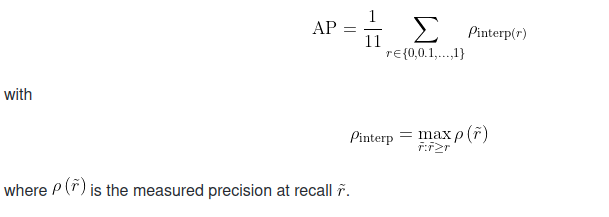

AP不是使用在每个点上观察到的精度，而是通过仅在11个级别上对精度进行插值来获得，其中取召回值大于的最大精度。

## 3.2 Interpolating all points

可以通过以下方式插值所有点，而不是仅在 11 个等间距的点中进行插值：

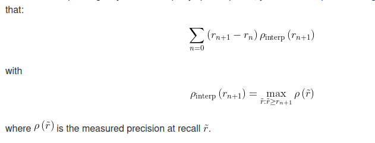

在这种情况下，不再使用仅在几个点上观察到的精度，而是通过在每个级别内插精度来获得AP，取召回值大于或等于的最大精度。这样我们就可以计算曲线下的估计面积。

为了使事情更清楚，我们提供了一个比较两种插值的示例。

## 3.3 两种AP计算的对比

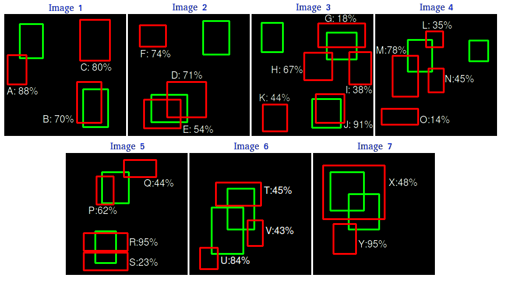

共有 7 个图像，其中 15 个真实对象由绿色边界框表示，24 个检测到的对象由红色边界框表示。每个检测到的对象都有一个置信度，并由字母 （A，B,...,Y） 标识。

下表显示了边界框及其相应的置信度。最后一列将检测识别为TP或FP。在本例中，如果IOU>=30%，则考虑TP，否则为FP。通过查看上面的图像，我们可以大致判断检测是TP还是FP。

| Images | Detections | Confidences | TP or FP |
|:------:|:----------:|:-----------:|:--------:|
| Image 1 | A | 88% | FP |
| Image 1 | B | 70% | TP |
| Image 1 | C   | 80% | FP |
| Image 2 | D   | 71% | FP |
| Image 2 | E   | 54% | TP |
| Image 2 | F   | 74% | FP |
| Image 3 | G   | 18% | TP |
| Image 3 | H   | 67% | FP |
| Image 3 | I   | 38% | FP |
| Image 3 | J   | 91% | TP |
| Image 3 | K   | 44% | FP |
| Image 4 | L   | 35% | FP |
| Image 4 | M   | 78% | FP |
| Image 4 | N   | 45% | FP |
| Image 4 | O   | 14% | FP |
| Image 5 | P   | 62% | TP |
| Image 5 | Q   | 44% | FP |
| Image 5 | R   | 95% | TP |
| Image 5 | S   | 23% | FP |
| Image 6 | T   | 45% | FP |
| Image 6 | U   | 84% | FP |
| Image 6 | V   | 43% | FP |
| Image 7 | X   | 48% | TP |
| Image 7 | Y   | 95% | FP |

在某些图像中，有多个检测与地面真相重叠（图像2，3，4，5，6和7）。对于这些情况，具有最高IOU的预测框被视为TP（例如，在图像1中，“E”是TP，而“D”是FP）。此规则由 PASCAL VOC 2012 指标应用：“例如，单个对象的 5 次检测 （TP） 计为 1 次正确检测和 4 次错误检测”。

通过计算累积TP或FP检测的精度和召回值，绘制Precision x  Recall曲线。为此，首先，我们需要根据其置信度对检测进行排序，然后我们计算每个累积检测的精度和召回率，如下表所示（注意，对于召回率计算，分母项（“Acc TP+Acc FN”）恒定为15，因为无论检测结果如何，GT框都是恒定的）：

| Images | Detections | Confidences |  TP | FP | Acc TP | Acc FP | Precision | Recall |
|:------:|:----------:|:-----------:|:---:|:--:|:------:|:------:|:---------:|:------:|
| Image 5 | R   | 95% | 1 | 0 | 1 | 0 | 1       | 0.0666 |
| Image 7 | Y   | 95% | 0 | 1 | 1 | 1 | 0.5     | 0.6666 |
| Image 3 | J   | 91% | 1 | 0 | 2 | 1 | 0.6666  | 0.1333 |
| Image 1 | A | 88% | 0 | 1 | 2 | 2 | 0.5     | 0.1333 |
| Image 6 | U   | 84% | 0 | 1 | 2 | 3 | 0.4     | 0.1333 |
| Image 1 | C   | 80% | 0 | 1 | 2 | 4 | 0.3333  | 0.1333 |
| Image 4 | M   | 78% | 0 | 1 | 2 | 5 | 0.2857  | 0.1333 |
| Image 2 | F   | 74% | 0 | 1 | 2 | 6 | 0.25    | 0.1333 |
| Image 2 | D   | 71% | 0 | 1 | 2 | 7 | 0.2222  | 0.1333 |
| Image 1 | B | 70% | 1 | 0 | 3 | 7 | 0.3     | 0.2    |
| Image 3 | H   | 67% | 0 | 1 | 3 | 8 | 0.2727  | 0.2    |
| Image 5 | P   | 62% | 1 | 0 | 4 | 8 | 0.3333  | 0.2666 |
| Image 2 | E   | 54% | 1 | 0 | 5 | 8 | 0.3846  | 0.3333 |
| Image 7 | X   | 48% | 1 | 0 | 6 | 8 | 0.4285  | 0.4    |
| Image 4 | N   | 45% | 0 | 1 | 6 | 9 | 0.7     | 0.4    |
| Image 6 | T   | 45% | 0 | 1 | 6 | 10 | 0.375  | 0.4    |
| Image 3 | K   | 44% | 0 | 1 | 6 | 11 | 0.3529 | 0.4    |
| Image 5 | Q   | 44% | 0 | 1 | 6 | 12 | 0.3333 | 0.4    |
| Image 6 | V   | 43% | 0 | 1 | 6 | 13 | 0.3157 | 0.4    |
| Image 3 | I   | 38% | 0 | 1 | 6 | 14 | 0.3    | 0.4    |
| Image 4 | L   | 35% | 0 | 1 | 6 | 15 | 0.2857 | 0.4    |
| Image 5 | S   | 23% | 0 | 1 | 6 | 16 | 0.2727 | 0.4    |
| Image 3 | G   | 18% | 1 | 0 | 7 | 16 | 0.3043 | 0.4666 |
| Image 4 | O   | 14% | 0 | 1 | 7 | 17 | 0.2916 | 0.4666 |

Example computation for the 2nd row (Image 7):  Precision = TP/(TP+FP) = 1/2 = 0.5 and Recall = TP/(TP+FN) = 1/15 = 0.066

绘制精度和召回率值，我们有以下精度 x 召回率曲线：

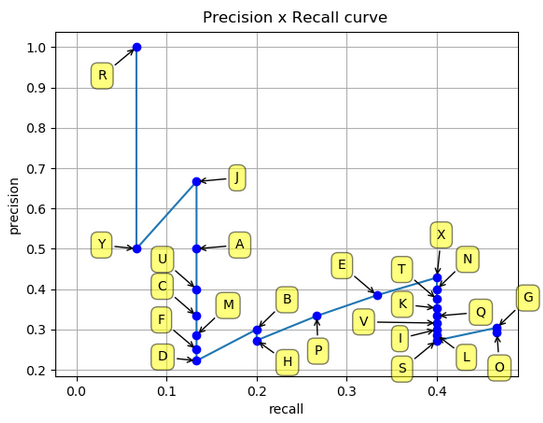

如前所述，有两种不同的方法来测量AP 插值平均精度：11 点插值和插值所有点。下面我们在它们之间进行比较：

### 3.3.1 计算11-point interpolation

11 点插值平均精度的想法是在一组 11 个召回率水平 （0，0.1,...,1） 处平均精度。内插精度值是通过取召回率值大于其当前召回率值的最大精度获得的，如下所示：

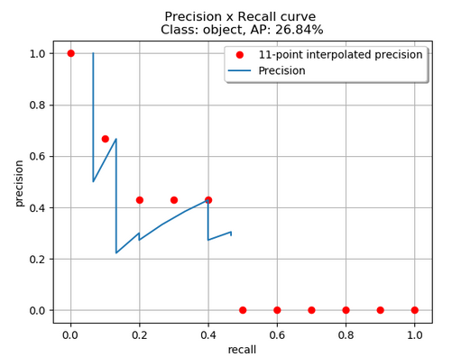

通过应用 11 点插值，红色点为取值。我们得到：

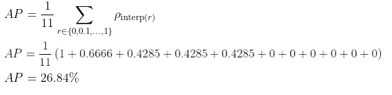

### 3.3.2 计算Interpolating all points

通过插值所有点，平均精度（AP）可以解释为精度x召回曲线的近似AUC。其目的是减少曲线中摇摆的影响。通过应用前面给出的方程，我们可以获得此处将演示的面积。我们还可以通过查看从最高（0.4666）到0（从右到左查看图）的召回率，直观地获得插值精度点，随着召回率的降低，我们收集了最高的精度值，如下图所示：

其实就是取一定范围的最大值

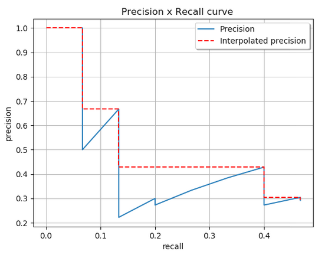

查看上图，我们可以将AUC分为4个区域（A1、A2、A3和A4）：

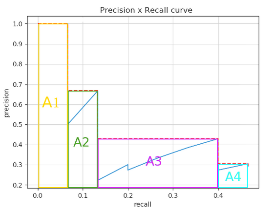

计算总面积，得到AP

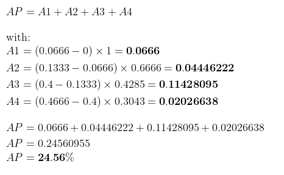

两种不同插值方法的结果略有不同：每点插值和11点插值的结果分别为24.56%和26.84%。

# 4 其他

* mAP@0.5: mean Average Precision（IoU=0.5）即将IoU设为0.5时，计算每一类的所有图片的AP，然后所有类别求平均，即mAP。
* mAP@.5:.95（mAP@[.5:.95]）表示在不同IoU阈值（从0.5到0.95，步长0.05）（0.5、0.55、0.6、0.65、0.7、0.75、0.8、0.85、0.9、0.95）上的平均mAP。
  

# 附录

参考 https://blog.csdn.net/qq_41427568/article/details/105733838

https://github.com/rafaelpadilla/Object-Detection-Metrics