对计算机而言，能够“看到”的是图像被编码之后的数字，但它很难理解高层语义概念，比如图像或者视频帧中出现的目标是人还是物体，更无法定位目标出现在图像中哪个区域。目标检测的主要目的是让计算机可以自动识别图片或者视频帧中所有目标的类别，并在该目标周围绘制边界框，标示出每个目标的位置，如 **图1** 所示。 

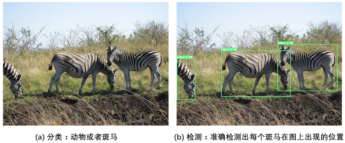


图1：图像分类和目标检测示意图

- 图1（a）是图像分类任务，只需识别出这是一张斑马的图片。
- 图1（b）是目标检测任务，不仅要识别出这是一张斑马的图片，还要标出图中斑马的位置。

# 1 目标检测发展历程

在上一节中我们学习了图像分类处理基本流程，先使用卷积神经网络提取图像特征，然后再用这些特征预测分类概率，根据训练样本标签建立起分类损失函数，开启端到端的训练，如 **图2** 所示。 


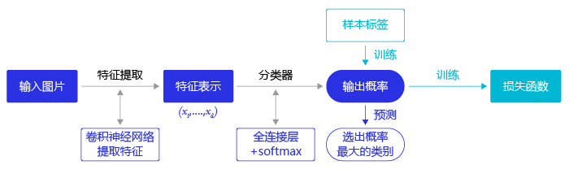


图2：图像分类流程示意图

但对于目标检测问题，按照 **图2** 的流程则行不通。因为在图像分类任务中，对整张图提取特征的过程中没能体现出不同目标之间的区别，最终也就没法分别标示出每个物体所在的位置。

为了解决这个问题，结合图片分类任务取得的成功经验，我们可以将目标检测任务进行拆分。假设我们现在有某种方式可以在输入图片上生成一系列可能包含物体的区域，这些区域称为候选区域，在一张图上可以生成很多个候选区域。然后对每个候选区域，可以把它单独当成一幅图像来看待，使用图像分类模型对它进行分类，看它属于哪个类别或者背景（即不包含任何物体的类别）。

上一节我们学过如何解决图像分类任务，使用卷积神经网络对一幅图像进行分类不再是一件困难的事情。那么，现在问题的关键就是如何产生候选区域？比如我们可以使用穷举法来产生候选区域，如图3所示。 


图3：候选区域

A为图像上的某个像素点，B为A右下方另外一个像素点，A、B两点可以确定一个矩形框，记作AB。

- 如图3（a）所示：A在图片左上角位置，B遍历除A之外的所有位置，生成矩形框A1B1, …, A1Bn, …
- 如图3（b）所示：A在图片中间某个位置，B遍历A右下方所有位置，生成矩形框AkB1, …, AkBn, …

当A遍历图像上所有像素点，B则遍历它右下方所有的像素点，最终生成的矩形框集合{AiBj}将会包含图像上所有可以选择的区域。

只要我们对每个候选区域的分类足够的准确，则一定能找到跟实际物体足够接近的区域来。穷举法也许能得到正确的预测结果，但其计算量也是非常巨大的，其所生成的总候选区域数目约为${W^2H^2}\over{4}$，假设H=W=100，总数将会达到$25*10^7$个，如此多的候选区域使得这种方法几乎没有什么实用性。但是通过这种方式，我们可以看出，假设分类任务完成的足够完美，从理论上来讲检测任务也是可以解决的，亟待解决的问题是如何设计出合适的方法来产生候选区域。

科学家们开始思考，是否可以应用传统图像算法先产生候选区域，然后再用卷积神经网络对这些区域进行分类？

- 2013年，[Ross Girshick](https://arxiv.org/abs/1311.2524) 等人于首次将CNN的方法应用在目标检测任务上，他们使用传统图像算法[Selective Search](https://link.springer.com/article/10.1007/s11263-013-0620-5)产生候选区域，取得了极大的成功，这就是对目标检测领域影响深远的区域卷积神经网络(R-CNN)模型。
- 2015年，[Ross Girshick](https://arxiv.org/abs/1504.08083) 对此方法进行了改进，提出了Fast R-CNN模型。通过将不同区域的物体共用卷积层的计算，大大缩减了计算量，提高了处理速度，而且还引入了调整目标物体位置的回归方法，进一步提高了位置预测的准确性。
- 2015年，[Shaoqing Ren](https://arxiv.org/abs/1506.01497) 等人提出了Faster R-CNN模型，提出了RPN的方法来产生物体的候选区域，这一方法不再需要使用传统的图像处理算法来产生候选区域，进一步提升了处理速度。
- 2017年，[Kaiming He](https://arxiv.org/abs/1703.06870) 等人提出了Mask R-CNN模型，只需要在Faster R-CNN模型上添加比较少的计算量，就可以同时实现目标检测和物体实例分割两个任务。

以上都是基于R-CNN系列的著名模型，对目标检测方向的发展有着较大的影响力。此外，还有一些其他模型，比如[SSD](https://arxiv.org/abs/1512.02325)、YOLO([1](https://arxiv.org/abs/1506.02640v5), [2](https://arxiv.org/abs/1612.08242), [3](https://arxiv.org/abs/1804.02767))、[R-FCN](https://arxiv.org/abs/1605.06409)等也都是目标检测领域流行的模型结构。

R-CNN的系列算法分成两个阶段，先在图像上产生候选区域，再对候选区域进行分类并预测目标物体位置，它们通常被叫做两阶段检测算法。SSD和YOLO算法则只使用一个网络同时产生候选区域并预测出物体的类别和位置，所以它们通常被叫做单阶段检测算法。由于篇幅所限，本章将重点介绍YOLOv3算法，并用其完成林业病虫害检测任务，主要涵盖如下内容：

- 图像检测基础概念：介绍与目标检测相关的基本概念，包括边界框、锚框和交并比等。
- 林业病虫害数据集：介绍数据集结构及数据预处理方法。
- YOLOv3目标检测模型：介绍算法原理，及如何应用林业病虫害数据集进行模型训练和测试。

# 2 目标检测基础概念

在介绍目标检测算法之前，先介绍一些跟检测相关的基本概念，包括边界框、锚框和交并比等。

## 2.1 边界框（bounding box）

检测任务需要同时预测物体的类别和位置，因此需要引入一些跟位置相关的概念。通常使用边界框（bounding box，bbox）来表示物体的位置，边界框是正好能包含物体的矩形框，如 **图4** 所示，图中3个人分别对应3个边界框。 

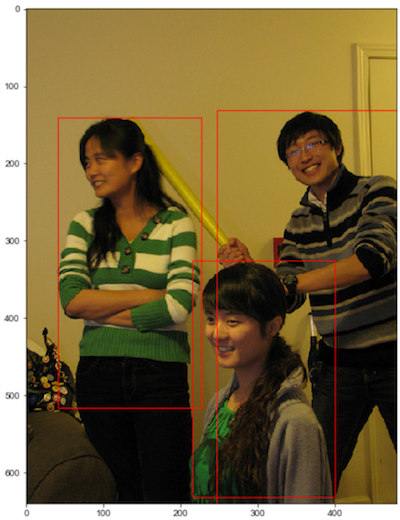


图4：边界框

通常有两种格式来表示边界框的位置：

1. $xyxy$，即$(x_1, y_1, x_2, y_2)$，其中$(x_1, y_1)$是矩形框左上角的坐标，$(x_2, y_2)$是矩形框右下角的坐标。图4中3个红色矩形框用$xyxy$格式表示如下：

- 左：$(40.93,141.1,226.99,515.73)$。
- 中：$(214.29,325.03,399.82,631.37)$。
- 右：$(247.2,131.62,480.0,639.32)$。

1. $xywh$，即$(x,y,w,h)$，其中$(x,y)$是矩形框中心点的坐标，$w$是矩形框的宽度，$h$是矩形框的高度。

在检测任务中，训练数据集的标签里会给出目标物体真实边界框所对应的$(x_1, y_1, x_2, y_2)$，这样的边界框也被称为真实框（ground truth box），如 **图4** 所示，图中画出了3个人像所对应的真实框。模型会对目标物体可能出现的位置进行预测，由模型预测出的边界框则称为预测框（prediction box）。


**注意：**

1. 在阅读代码时，请注意使用的是哪一种格式的表示方式。
2. **图片坐标的原点在左上角，x轴向右为正方向，y轴向下为正方向。**


要完成一项检测任务，我们通常希望模型能够根据输入的图片，输出一些预测的边界框，以及边界框中所包含的物体的类别或者说属于某个类别的概率，例如这种格式: $[L, P, x_1, y_1, x_2, y_2]$，其中L是类别标签，P是物体属于该类别的概率。一张输入图片可能会产生多个预测框，接下来让我们一起学习如何完成这项任务。

## 2.2 锚框（Anchor box）

锚框与物体边界框不同，是由人们假想出来的一种框。先设定好锚框的大小和形状，再以图像上某一个点为中心画出矩形框。在下图中，以像素点[300, 500]为中心可以使用下面的程序生成3个框，如图中蓝色框所示，其中锚框A1跟人像区域非常接近。

```python
# 画图展示如何绘制边界框和锚框
import numpy as np
import matplotlib.pyplot as plt
import matplotlib.patches as patches
from matplotlib.image import imread
import math

# 定义画矩形框的程序    
def draw_rectangle(currentAxis, bbox, edgecolor = 'k', facecolor = 'y', fill=False, linestyle='-'):
    # currentAxis，坐标轴，通过plt.gca()获取
    # bbox，边界框，包含四个数值的list， [x1, y1, x2, y2]
    # edgecolor，边框线条颜色
    # facecolor，填充颜色
    # fill, 是否填充
    # linestype，边框线型
    # patches.Rectangle需要传入左上角坐标、矩形区域的宽度、高度等参数
    rect=patches.Rectangle((bbox[0], bbox[1]), bbox[2]-bbox[0]+1, bbox[3]-bbox[1]+1, linewidth=1,
                           edgecolor=edgecolor,facecolor=facecolor,fill=fill, linestyle=linestyle)
    currentAxis.add_patch(rect)

    
plt.figure(figsize=(10, 10))

filename = '/home/aistudio/work/images/section3/000000086956.jpg'
im = imread(filename)
plt.imshow(im)

# 使用xyxy格式表示物体真实框
bbox1 = [214.29, 325.03, 399.82, 631.37]
bbox2 = [40.93, 141.1, 226.99, 515.73]
bbox3 = [247.2, 131.62, 480.0, 639.32]

currentAxis=plt.gca()

draw_rectangle(currentAxis, bbox1, edgecolor='r')
draw_rectangle(currentAxis, bbox2, edgecolor='r')
draw_rectangle(currentAxis, bbox3,edgecolor='r')

# 绘制锚框
def draw_anchor_box(center, length, scales, ratios, img_height, img_width):
    """
    以center为中心，产生一系列锚框
    其中length指定了一个基准的长度
    scales是包含多种尺寸比例的list
    ratios是包含多种长宽比的list
    img_height和img_width是图片的尺寸，生成的锚框范围不能超出图片尺寸之外
    """
    bboxes = []
    for scale in scales:
        for ratio in ratios:
            h = length*scale*math.sqrt(ratio)
            w = length*scale/math.sqrt(ratio) 
            x1 = max(center[0] - w/2., 0.)
            y1 = max(center[1] - h/2., 0.)
            x2 = min(center[0] + w/2. - 1.0, img_width - 1.0)
            y2 = min(center[1] + h/2. - 1.0, img_height - 1.0)
            print(center[0], center[1], w, h)
            bboxes.append([x1, y1, x2, y2])

    for bbox in bboxes:
        draw_rectangle(currentAxis, bbox, edgecolor = 'b')

img_height = im.shape[0]
img_width = im.shape[1]        
draw_anchor_box([300., 500.], 100., [2.0], [0.5, 1.0, 2.0], img_height, img_width)


################# 以下为添加文字说明和箭头###############################

plt.text(285, 285, 'G1', color='red', fontsize=20)
plt.arrow(300, 288, 30, 40, color='red', width=0.001, length_includes_head=True, \
         head_width=5, head_length=10, shape='full')

plt.text(190, 320, 'A1', color='blue', fontsize=20)
plt.arrow(200, 320, 30, 40, color='blue', width=0.001, length_includes_head=True, \
         head_width=5, head_length=10, shape='full')

plt.text(160, 370, 'A2', color='blue', fontsize=20)
plt.arrow(170, 370, 30, 40, color='blue', width=0.001, length_includes_head=True, \
         head_width=5, head_length=10, shape='full')

plt.text(115, 420, 'A3', color='blue', fontsize=20)
plt.arrow(127, 420, 30, 40, color='blue', width=0.001, length_includes_head=True, \
         head_width=5, head_length=10, shape='full')

#draw_anchor_box([200., 200.], 100., [2.0], [0.5, 1.0, 2.0])    
plt.show()

```

```shell
300.0 500.0 282.84271247461896 141.4213562373095
300.0 500.0 200.0 200.0
300.0 500.0 141.42135623730948 282.842712474619
```

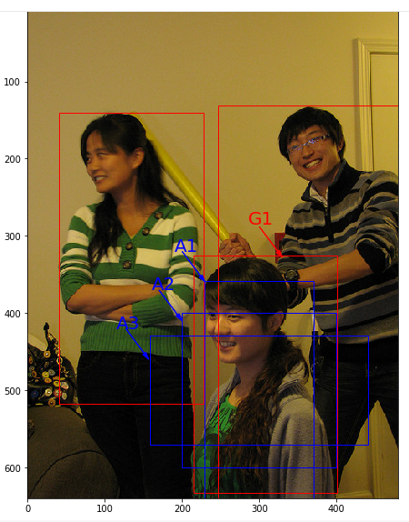

在目标检测任务中，通常会以某种规则在图片上生成一系列锚框，将这些锚框当成可能的候选区域。模型对这些候选区域是否包含物体进行预测，如果包含目标物体，则还需要进一步预测出物体所属的类别。还有更为重要的一点是，由于锚框位置是固定的，它不大可能刚好跟物体边界框重合，所以需要在锚框的基础上进行微调以形成能准确描述物体位置的预测框，模型需要预测出微调的幅度。在训练过程中，模型通过学习不断的调整参数，最终能学会如何判别出锚框所代表的候选区域是否包含物体，如果包含物体的话，物体属于哪个类别，以及物体边界框相对于锚框位置需要调整的幅度。

不同的模型往往有着不同的生成锚框的方式，在后面的内容中，会详细介绍YOLOv3算法里面产生锚框的规则，理解了它的设计方案，也很容易类推到其它模型上。

## 2.3 交并比

上面我们画出了以点(300,500)(300, 500)(300,500)为中心，生成的三个锚框，我们可以看到锚框A1 与真实框 G1的重合度比较好。那么如何衡量这三个锚框跟真实框之间的关系呢？在检测任务中，使用交并比（Intersection of Union，IoU）作为衡量指标。这一概念来源于数学中的集合，用来描述两个集合AAA和BBB之间的关系，它等于两个集合的交集里面所包含的元素个数，除以它们的并集里面所包含的元素个数，具体计算公式如下：

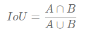

我们将用这个概念来描述两个框之间的重合度。两个框可以看成是两个像素的集合，它们的交并比等于两个框重合部分的面积除以它们合并起来的面积。下图“交集”中青色区域是两个框的重合面积，图“并集”中蓝色区域是两个框的相并面积。用这两个面积相除即可得到它们之间的交并比，如 **图5** 所示。

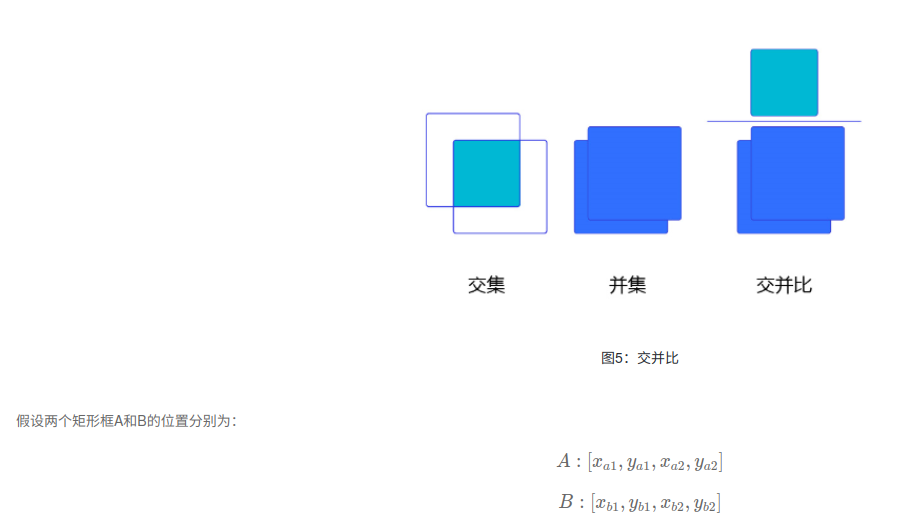

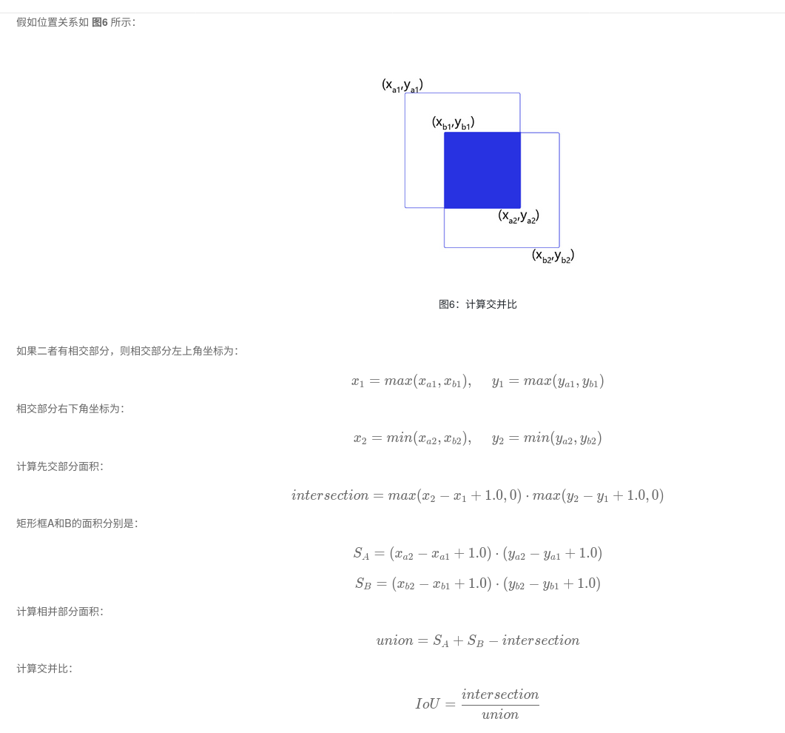

交并比计算程序如下：

```python
# 计算IoU，矩形框的坐标形式为xyxy，这个函数会被保存在box_utils.py文件中
def box_iou_xyxy(box1, box2):
    # 获取box1左上角和右下角的坐标
    x1min, y1min, x1max, y1max = box1[0], box1[1], box1[2], box1[3]
    # 计算box1的面积
    s1 = (y1max - y1min + 1.) * (x1max - x1min + 1.)
    # 获取box2左上角和右下角的坐标
    x2min, y2min, x2max, y2max = box2[0], box2[1], box2[2], box2[3]
    # 计算box2的面积
    s2 = (y2max - y2min + 1.) * (x2max - x2min + 1.)
    
    # 计算相交矩形框的坐标
    xmin = np.maximum(x1min, x2min)
    ymin = np.maximum(y1min, y2min)
    xmax = np.minimum(x1max, x2max)
    ymax = np.minimum(y1max, y2max)
    # 计算相交矩形行的高度、宽度、面积
    inter_h = np.maximum(ymax - ymin + 1., 0.)
    inter_w = np.maximum(xmax - xmin + 1., 0.)
    intersection = inter_h * inter_w
    # 计算相并面积
    union = s1 + s2 - intersection
    # 计算交并比
    iou = intersection / union
    return iou


bbox1 = [100., 100., 200., 200.]
bbox2 = [120., 120., 220., 220.]
iou = box_iou_xyxy(bbox1, bbox2)
print('IoU is {}'.format(iou))  
```

```shell
IoU is 0.47402644317607107
```

```python
# 计算IoU，矩形框的坐标形式为xywh
def box_iou_xywh(box1, box2):
    x1min, y1min = box1[0] - box1[2]/2.0, box1[1] - box1[3]/2.0
    x1max, y1max = box1[0] + box1[2]/2.0, box1[1] + box1[3]/2.0
    s1 = box1[2] * box1[3]

    x2min, y2min = box2[0] - box2[2]/2.0, box2[1] - box2[3]/2.0
    x2max, y2max = box2[0] + box2[2]/2.0, box2[1] + box2[3]/2.0
    s2 = box2[2] * box2[3]

    xmin = np.maximum(x1min, x2min)
    ymin = np.maximum(y1min, y2min)
    xmax = np.minimum(x1max, x2max)
    ymax = np.minimum(y1max, y2max)
    inter_h = np.maximum(ymax - ymin, 0.)
    inter_w = np.maximum(xmax - xmin, 0.)
    intersection = inter_h * inter_w

    union = s1 + s2 - intersection
    iou = intersection / union
    return iou

bbox1 = [100., 100., 200., 200.]
bbox2 = [120., 120., 220., 220.]
iou = box_iou_xywh(bbox1, bbox2)
print('IoU is {}'.format(iou))  
```

```shell
IoU is 0.6902485659655831
```

为了直观的展示交并比的大小跟重合程度之间的关系，**图7** 示意了不同交并比下两个框之间的相对位置关系，从 IoU = 0.95 到 IoU = 0.

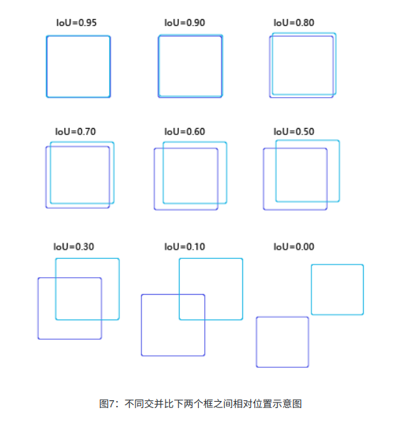

# 3 NMS

非极大值抑制，简称为NMS算法，英文为Non-Maximum Suppression。其思想是搜素局部最大值，抑制极大值。NMS算法在不同应用中的具体实现不太一样，但思想是一样的。非极大值抑制，在计算机视觉任务中得到了广泛的应用，例如边缘检测、人脸检测、目标检测（DPM，YOLO，SSD，Faster R-CNN）等。

## 3.1 为什么要用非极大值抑制

以目标检测为例：目标检测的过程中在同一目标的位置上会产生大量的候选框，这些候选框相互之间可能会有重叠，此时我们需要利用非极大值抑制找到最佳的目标边界框，消除冗余的边界框。Demo如下图：

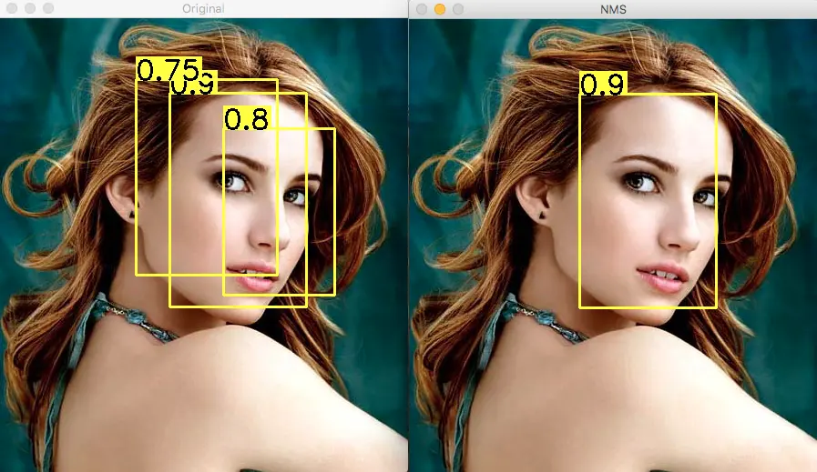

左图是人脸检测的候选框结果，每个边界框有一个置信度得分(confidence score)，如果不使用非极大值抑制，就会有多个候选框出现。右图是使用非极大值抑制之后的结果，符合我们人脸检测的预期结果。

## 3.2 如何使用非极大值抑制

目标边界框列表及其对应的置信度得分列表，设定阈值，阈值用来删除重叠较大的边界框。
 **IoU**：intersection-over-union，即两个边界框的交集部分除以它们的并集。

非极大值抑制的流程如下：

- 根据置信度得分进行排序
- 选择置信度最高的比边界框添加到最终输出列表中，将其从边界框列表中删除
- 计算所有边界框的面积
- 计算置信度最高的边界框与其它候选框的IoU。
- 删除IoU大于阈值的边界框
- 重复上述过程，直至边界框列表为空。

## 3.3 python代码实现

源码下载地址：[https://github.com/SnailTyan/deep-learning-tools/blob/master/nms.py](https://link.jianshu.com?t=https://github.com/SnailTyan/deep-learning-tools/blob/master/nms.py)

```python
#!/usr/bin/env python
# _*_ coding: utf-8 _*_


import cv2
import numpy as np


"""
    Non-max Suppression Algorithm

    @param list  Object candidate bounding boxes
    @param list  Confidence score of bounding boxes
    @param float IoU threshold

    @return Rest boxes after nms operation
"""
def nms(bounding_boxes, confidence_score, threshold):
    # If no bounding boxes, return empty list
    if len(bounding_boxes) == 0:
        return [], []

    # Bounding boxes
    boxes = np.array(bounding_boxes)

    # coordinates of bounding boxes
    start_x = boxes[:, 0]
    start_y = boxes[:, 1]
    end_x = boxes[:, 2]
    end_y = boxes[:, 3]

    # Confidence scores of bounding boxes
    score = np.array(confidence_score)

    # Picked bounding boxes
    picked_boxes = []
    picked_score = []

    # Compute areas of bounding boxes
    areas = (end_x - start_x + 1) * (end_y - start_y + 1)

    # Sort by confidence score of bounding boxes
    order = np.argsort(score)

    # Iterate bounding boxes
    while order.size > 0:
        # The index of largest confidence score
        index = order[-1]

        # Pick the bounding box with largest confidence score
        picked_boxes.append(bounding_boxes[index])
        picked_score.append(confidence_score[index])

        # Compute ordinates of intersection-over-union(IOU)
        x1 = np.maximum(start_x[index], start_x[order[:-1]])
        x2 = np.minimum(end_x[index], end_x[order[:-1]])
        y1 = np.maximum(start_y[index], start_y[order[:-1]])
        y2 = np.minimum(end_y[index], end_y[order[:-1]])

        # Compute areas of intersection-over-union
        w = np.maximum(0.0, x2 - x1 + 1)
        h = np.maximum(0.0, y2 - y1 + 1)
        intersection = w * h

        # Compute the ratio between intersection and union
        ratio = intersection / (areas[index] + areas[order[:-1]] - intersection)

        left = np.where(ratio < threshold)
        order = order[left]

    return picked_boxes, picked_score


# Image name
image_name = 'nms.jpg'

# Bounding boxes
bounding_boxes = [(187, 82, 337, 317), (150, 67, 305, 282), (246, 121, 368, 304)]
confidence_score = [0.9, 0.75, 0.8]

# Read image
image = cv2.imread(image_name)

# Copy image as original
org = image.copy()

# Draw parameters
font = cv2.FONT_HERSHEY_SIMPLEX
font_scale = 1
thickness = 2

# IoU threshold
threshold = 0.4

# Draw bounding boxes and confidence score
for (start_x, start_y, end_x, end_y), confidence in zip(bounding_boxes, confidence_score):
    (w, h), baseline = cv2.getTextSize(str(confidence), font, font_scale, thickness)
    cv2.rectangle(org, (start_x, start_y - (2 * baseline + 5)), (start_x + w, start_y), (0, 255, 255), -1)
    cv2.rectangle(org, (start_x, start_y), (end_x, end_y), (0, 255, 255), 2)
    cv2.putText(org, str(confidence), (start_x, start_y), font, font_scale, (0, 0, 0), thickness)

# Run non-max suppression algorithm
picked_boxes, picked_score = nms(bounding_boxes, confidence_score, threshold)

# Draw bounding boxes and confidence score after non-maximum supression
for (start_x, start_y, end_x, end_y), confidence in zip(picked_boxes, picked_score):
    (w, h), baseline = cv2.getTextSize(str(confidence), font, font_scale, thickness)
    cv2.rectangle(image, (start_x, start_y - (2 * baseline + 5)), (start_x + w, start_y), (0, 255, 255), -1)
    cv2.rectangle(image, (start_x, start_y), (end_x, end_y), (0, 255, 255), 2)
    cv2.putText(image, str(confidence), (start_x, start_y), font, font_scale, (0, 0, 0), thickness)

# Show image
cv2.imshow('Original', org)
cv2.imshow('NMS', image)
cv2.waitKey(0)

```

实验结果：

- 阈值为0.6

  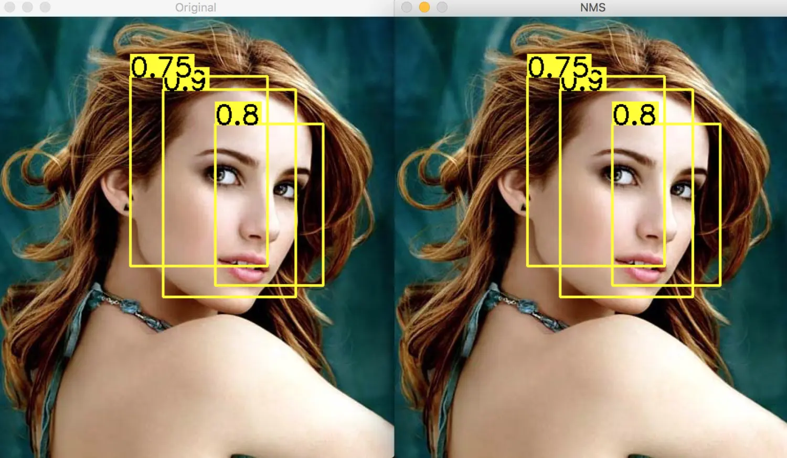

- 阈值为0.4

  

## 3.4 c++代码实现

源代码地址：https://github.com/pprp/CUDA_NMS/blob/master/CPU/nms.cpp

注意下面的代码box是多个分类的，并且box没有按照score进行排序。

```c++
#include <iostream>
#include <stdio.h>
#include <stdlib.h>
#include <string.h>
#include <opencv2/core/core.hpp>
#include <opencv2/highgui/highgui.hpp>
#include <sstream>
#include "opencv2/imgproc/imgproc.hpp"
#include <fstream>
#include <iomanip>
#include <math.h>
#include <time.h>
#include <stdbool.h>

using namespace cv;
using namespace std;
const int N = 19;

typedef struct
{
	float x,y,w,h;
  char s[100];
  char cls[100];
	float cmps;
}box;

float IOUcalc(box b1,box b2)
{
	float ai = (float)(b1.w + 1)*(b1.h + 1);//确保在计算交并比时分母不为零
	float aj = (float)(b2.w + 1)*(b2.h + 1);//确保在计算交并比时分母不为零
	float x_inter, x2_inter, y_inter, y2_inter;

	x_inter = max(b1.x,b2.x);
	y_inter = max(b1.y,b2.y);

	x2_inter = min((b1.x + b1.w),(b2.x + b2.w));
	y2_inter = min((b1.y + b1.h),(b2.y + b2.h));

	float w = (float)max((float)0, x2_inter - x_inter);
	float h = (float)max((float)0, y2_inter - y_inter);

	float inter = ((w*h)/(ai + aj - w*h));
	return inter;
}

bool* nms(box *b, int count)
{
	float w,h,a;
	float theta = 0.1;
	bool* res = new bool(count);
	for(int i = 0 ; i < count ; i++)
		res[i]=true;

    /*外层循环（i）： 该循环迭代所有的检测框，用于选择一个参考框（b[i]）。
    内层循环（j）： 该循环与外层循环一同迭代所有的检测框，用于与参考框（b[i]）比较。
    内循环中的 if 语句检查是否当前框（b[i]）的分数较低于另一个框（b[j]）。如果是，就继续检查它们之间的IOU。*/
    for(int i=0; i<count; i++)
    {
    	for(int j=0; j<count; j++)
    	{
    		if(b[i].cmps < b[j].cmps)
		 		{
						if(IOUcalc(b[j],b[i])>theta)
						{
			 				//printf("!!%d--%d\n",i,j);
			 				res[i] = false;
			 			}
				}
    	}
    }
   return res;
}

int main()
{
	Mat temp = imread("/home/learner/cuda-workspace/Parallel_NMS/Cow_45.jpg",1);

	int count =N;
	box b[count];
	b[0].x = 996.000000;b[0].y = 2566.420000;b[0].w = 170.793000;b[0].h=172.580000;
  strcpy(b[0].cls,"nose");strcpy(b[0].s,"0.983194");b[0].cmps=0.983194;
  b[1].x = 4238.937000;b[1].y = 1594.513000;b[1].w = 160.063000;b[1].h=148.487000;
  strcpy(b[1].cls,"eye");strcpy(b[1].s,"0.992166");b[1].cmps=0.992166;
  b[2].x = 4656.389000;b[2].y = 2175.186000;b[2].w = 316.180000;b[2].h=221.552000;
  strcpy(b[2].cls,"nose");strcpy(b[2].s,"0.994816");b[2].cmps=0.994816;
  b[3].x = 4316.000000;b[3].y = 1660.000000;b[3].w = 127.474000;b[3].h=113.452000;
  strcpy(b[3].cls,"eye");strcpy(b[3].s,"0.990833");b[3].cmps=0.990833;
  b[4].x = 997.013000;b[4].y = 2664.408000;b[4].w = 222.214000;b[4].h=229.068000;
  strcpy(b[4].cls,"nose");strcpy(b[4].s,"0.985067");b[4].cmps=0.985067;
  b[5].x = 666.069000;b[5].y = 2029.219000;b[5].w = 135.689000;b[5].h=160.833000;
  strcpy(b[5].cls,"eye");strcpy(b[5].s,"0.993240");b[5].cmps=0.993240;
  b[6].x = 4653.547000;b[6].y = 2324.000000;b[6].w = 338.125000;b[6].h=133.902000;
  strcpy(b[6].cls,"nose");strcpy(b[6].s,"0.982858");b[6].cmps=0.982858;
  b[7].x = 4476.556000;b[7].y = 2131.557000;b[7].w = 253.402000;b[7].h=273.601000;
  strcpy(b[7].cls,"nose");strcpy(b[7].s,"0.959098");b[7].cmps=0.959098;
  b[8].x = 754.326000;b[8].y = 2571.066000;b[8].w = 324.674000;b[8].h=161.605000;
  strcpy(b[8].cls,"nose");strcpy(b[8].s,"0.993699");b[8].cmps=0.993699;
  b[9].x = 729.962000;b[9].y = 2658.741000;b[9].w = 349.038000;b[9].h=192.046000;
  strcpy(b[9].cls,"nose");strcpy(b[9].s,"0.986209");b[9].cmps=0.986209;
  b[10].x = 1271.863000;b[10].y = 2058.679000;b[10].w = 138.781000;b[10].h=137.553000;
  strcpy(b[10].cls,"eye");strcpy(b[10].s,"0.989965");b[10].cmps=0.989965;
  b[11].x = 4316.000000;b[11].y = 1601.751000;b[11].w = 134.204000;b[11].h=141.249000;
  strcpy(b[11].cls,"eye");strcpy(b[11].s,"0.988307");b[11].cmps=0.988307;
  b[12].x = 650.901000;b[12].y = 2032.621000;b[12].w = 91.484000;b[12].h=42.112000;
  strcpy(b[12].cls,"eye");strcpy(b[12].s,"0.969982");b[12].cmps=0.969982;
  b[13].x = 1328.000000;b[13].y = 2058.692000;b[13].w = 103.849000;b[13].h=136.518000;
  strcpy(b[13].cls,"eye");strcpy(b[13].s,"0.987316");b[13].cmps=0.987316;
  b[14].x = 214.809000;b[14].y = 1599.809000;b[14].w = 1553.705000;b[14].h=1319.679000;
  strcpy(b[14].cls,"head");strcpy(b[14].s,"0.997623");b[14].cmps=0.997623;
  b[15].x = 3826.177000;b[15].y = 1072.206000;b[15].w = 1254.063000;b[15].h=1412.903000;
  strcpy(b[15].cls,"head");strcpy(b[15].s,"0.997487");b[15].cmps=0.997487;
  b[16].x = 729.632000;b[16].y = 2578.523000;b[16].w = 442.495000;b[16].h=302.378000;
  strcpy(b[16].cls,"nose");strcpy(b[16].s,"0.960093");b[16].cmps=0.960093;
  b[17].x = 655.430000;b[17].y = 2031.151000;b[17].w = 91.570000;b[17].h=148.691000;
  strcpy(b[17].cls,"eye");strcpy(b[17].s,"0.993275");b[17].cmps=0.993275;
  b[18].x = 4251.712000;b[18].y = 1660.000000;b[18].w = 147.288000;b[18].h=105.309000;
  strcpy(b[18].cls,"eye");strcpy(b[18].s,"0.992576");b[18].cmps=0.992576;

	//timing the cpu
	clock_t start, end;
	float cpu_time;
	start=clock();
	bool *res = nms(b,N);
	end=clock();
	cpu_time = (float)(end-start);
	printf("CPU Time: %.5f(ms)\n",cpu_time);
	//for(int i = 0 ; i < N ; i++)
			//cout << res[i] << ",";
	for(int i =0; i<N ; i++)
	{
		if((res[i]))
		{
			printf("CPU Draw: %d\n",i);
			putText(temp,b[i].cls,Point(b[i].x,b[i].y-5),cv::FONT_HERSHEY_SIMPLEX,1.7,Scalar(255,255,255),5,8,0);
			putText(temp,b[i].s,Point(b[i].x+120,b[i].y-5),cv::FONT_HERSHEY_SIMPLEX,1.7,Scalar(255,255,255),5,8,0);
			rectangle(temp,Point(b[i].x,b[i].y),Point(b[i].x + b[i].w,b[i].y + b[i].h),Scalar(92.185,194),8,8,0);
		}
	}
	namedWindow("Window",0);
	resizeWindow("Window",1333,1000);
	imshow("Window",temp);
	imwrite("hello.jpg",temp);
	waitKey(0);

	return 0;
}
```

如果box已经按照socre降序排序了，修改如下

```C
bool* nms(box *b, int count) {
  float w,h,a;
  float theta = 0.1;
  bool* res = new bool(count);
  for(int i = 0 ; i < count ; i++) res[i]=true;

  // 对边界框按score排序
  std::sort(b, b + count, [](box a, box b) { return a.cmps > b.cmps; });

  //修改后的代码将内层循环从 i+1 开始遍历，这样，当前框之前的框都已经被比较过了，因此内层循环只需要比较当前框之后的框。这样可以减少不必要的比较，提高性能。
  for(int i=0; i<count; i++) {
    for(int j=i+1; j<count; j++) {
      if(IOUcalc(b[j],b[i])>theta) {
        res[i] = false;
        break;
      }
    }
  }
  return res;
}
```

## 3.5 cuda实现

注意下面的代码box是多个分类的，并且box没有按照score进行排序。

```c
#include <stdio.h>
#include <cuda_runtime.h>
#include <iostream>
#include <opencv2/core/core.hpp>
#include <opencv2/highgui/highgui.hpp>
#include "opencv2/imgproc/imgproc.hpp"
#include "device_launch_parameters.h"
#include <stdlib.h>
#include "string"

using namespace cv;
using namespace std;

const int N = 19;
#define gpuErrchk(ans) { gpuAssert((ans), __FILE__, __LINE__); }

inline void gpuAssert(cudaError_t code, const char *file, int line, bool abort=true)
{
	if (code != cudaSuccess)
	{
		fprintf(stderr,"GPUassert: %s %s %d\n", cudaGetErrorString(code), file, line);
		if (abort) exit(code);
	}
}


typedef struct
{
	double x,y,w,h;
	char s[100];
	char cls[100];
	double cmps;
}box;

__device__ float IOUcalc(box b1, box b2)
{
	float ai = (float)(b1.w + 1)*(b1.h + 1);
	float aj = (float)(b2.w + 1)*(b2.h + 1);
	float x_inter, x2_inter, y_inter, y2_inter;

	x_inter = max(b1.x,b2.x);
	y_inter = max(b1.y,b2.y);

	x2_inter = min((b1.x + b1.w),(b2.x + b2.w));
	y2_inter = min((b1.y + b1.h),(b2.y + b2.h));

	float w = (float)max((float)0, x2_inter - x_inter);
	float h = (float)max((float)0, y2_inter - y_inter);

	float inter = ((w*h)/(ai + aj - w*h));
	return inter;
}

__global__ void NMS_GPU0(box *dev_b, bool *d_res)
{
	int abs_y = blockIdx.y * blockDim.y + threadIdx.y;
	int abs_x = blockIdx.x * blockDim.x + threadIdx.x;

	float theta = 0.1;
	if(dev_b[abs_x].cmps < dev_b[abs_y].cmps)
	{
		if(IOUcalc(dev_b[abs_y],dev_b[abs_x])>theta)
		{
			d_res[abs_x] = false;
		}
	}
}

__global__ void NMS_GPU1(box*dev_b,bool * d_res)
{
	__shared__ box blocka[N];
	//__shared__ box blockb[N];

	unsigned int xIndex = blockIdx.x * blockDim.x + threadIdx.x;

	if(xIndex < N)
	{
		blocka[threadIdx.x] = dev_b[xIndex];
	}

	__syncthreads();

	xIndex = blockIdx.x * blockDim.x + threadIdx.x;

	float theta = 0.1;
	for(int i = 0 ; i < N ; i++)
	{
		if(i != xIndex)
		{
			if(blocka[i].cmps < blocka[xIndex].cmps)
			{
				if(IOUcalc(blocka[i],blocka[xIndex]) > theta)
				{
					d_res[i] = false;
				}
			}
		}
	}
}

__global__ void NMS_GPU2(box*dev_b,bool * d_res)
{
	unsigned int xIndex = blockIdx.x * blockDim.x + threadIdx.x;

	float theta = 0.1;
	for(int i = 0 ; i < N ; i++)
	{
		if(i != xIndex)
		{
			if(dev_b[i].cmps < dev_b[xIndex].cmps)
			{
				if(IOUcalc(dev_b[i],dev_b[xIndex]) > theta)
				{
					d_res[i] = false;
				}
			}
		}
	}
}


int main()
{
	int count = N;
	Mat temp = imread("/home/learner/cuda-workspace/Parallel_NMS/Cow_45.jpg",1);

	bool *h_res =(bool*)malloc(sizeof(bool)*count);

	for(int i=0; i<count; i++)
	{
		h_res[i] = true;
	}

	box b[N];
	b[0].x = 996.000000;b[0].y = 2566.420000;b[0].w = 170.793000;b[0].h=172.580000;
	strcpy(b[0].cls,"nose");strcpy(b[0].s,"0.983194");b[0].cmps=0.983194;
	b[1].x = 4238.937000;b[1].y = 1594.513000;b[1].w = 160.063000;b[1].h=148.487000;
	strcpy(b[1].cls,"eye");strcpy(b[1].s,"0.992166");b[1].cmps=0.992166;
	b[2].x = 4656.389000;b[2].y = 2175.186000;b[2].w = 316.180000;b[2].h=221.552000;
	strcpy(b[2].cls,"nose");strcpy(b[2].s,"0.994816");b[2].cmps=0.994816;
	b[3].x = 4316.000000;b[3].y = 1660.000000;b[3].w = 127.474000;b[3].h=113.452000;
	strcpy(b[3].cls,"eye");strcpy(b[3].s,"0.990833");b[3].cmps=0.990833;
	b[4].x = 997.013000;b[4].y = 2664.408000;b[4].w = 222.214000;b[4].h=229.068000;
	strcpy(b[4].cls,"nose");strcpy(b[4].s,"0.985067");b[4].cmps=0.985067;
	b[5].x = 666.069000;b[5].y = 2029.219000;b[5].w = 135.689000;b[5].h=160.833000;
	strcpy(b[5].cls,"eye");strcpy(b[5].s,"0.993240");b[5].cmps=0.993240;
	b[6].x = 4653.547000;b[6].y = 2324.000000;b[6].w = 338.125000;b[6].h=133.902000;
	strcpy(b[6].cls,"nose");strcpy(b[6].s,"0.982858");b[6].cmps=0.982858;
	b[7].x = 4476.556000;b[7].y = 2131.557000;b[7].w = 253.402000;b[7].h=273.601000;
	strcpy(b[7].cls,"nose");strcpy(b[7].s,"0.959098");b[7].cmps=0.959098;
	b[8].x = 754.326000;b[8].y = 2571.066000;b[8].w = 324.674000;b[8].h=161.605000;
	strcpy(b[8].cls,"nose");strcpy(b[8].s,"0.993699");b[8].cmps=0.993699;
	b[9].x = 729.962000;b[9].y = 2658.741000;b[9].w = 349.038000;b[9].h=192.046000;
	strcpy(b[9].cls,"nose");strcpy(b[9].s,"0.986209");b[9].cmps=0.986209;
	b[10].x = 1271.863000;b[10].y = 2058.679000;b[10].w = 138.781000;b[10].h=137.553000;
	strcpy(b[10].cls,"eye");strcpy(b[10].s,"0.989965");b[10].cmps=0.989965;
	b[11].x = 4316.000000;b[11].y = 1601.751000;b[11].w = 134.204000;b[11].h=141.249000;
	strcpy(b[11].cls,"eye");strcpy(b[11].s,"0.988307");b[11].cmps=0.988307;
	b[12].x = 650.901000;b[12].y = 2032.621000;b[12].w = 91.484000;b[12].h=42.112000;
	strcpy(b[12].cls,"eye");strcpy(b[12].s,"0.969982");b[12].cmps=0.969982;
	b[13].x = 1328.000000;b[13].y = 2058.692000;b[13].w = 103.849000;b[13].h=136.518000;
	strcpy(b[13].cls,"eye");strcpy(b[13].s,"0.987316");b[13].cmps=0.987316;
	b[14].x = 214.809000;b[14].y = 1599.809000;b[14].w = 1553.705000;b[14].h=1319.679000;
	strcpy(b[14].cls,"head");strcpy(b[14].s,"0.997623");b[14].cmps=0.997623;
	b[15].x = 3826.177000;b[15].y = 1072.206000;b[15].w = 1254.063000;b[15].h=1412.903000;
	strcpy(b[15].cls,"head");strcpy(b[15].s,"0.997487");b[15].cmps=0.997487;
	b[16].x = 729.632000;b[16].y = 2578.523000;b[16].w = 442.495000;b[16].h=302.378000;
	strcpy(b[16].cls,"nose");strcpy(b[16].s,"0.960093");b[16].cmps=0.960093;
	b[17].x = 655.430000;b[17].y = 2031.151000;b[17].w = 91.570000;b[17].h=148.691000;
	strcpy(b[17].cls,"eye");strcpy(b[17].s,"0.993275");b[17].cmps=0.993275;
	b[18].x = 4251.712000;b[18].y = 1660.000000;b[18].w = 147.288000;b[18].h=105.309000;
	strcpy(b[18].cls,"eye");strcpy(b[18].s,"0.992576");b[18].cmps=0.992576;

	box *dev_b;
	bool *d_res;

	//gpu start time
	cudaEvent_t start, stop;
	gpuErrchk(cudaEventCreate(&start));
	gpuErrchk(cudaEventCreate(&stop));
	gpuErrchk(cudaDeviceSynchronize());
	float gpu_time = 0.0f;
	cudaEventRecord(start,0);

	gpuErrchk(cudaMalloc((void**)&d_res, count*sizeof(bool)));
	gpuErrchk(cudaMemcpy(d_res, h_res,sizeof(bool)*count, cudaMemcpyHostToDevice));

	gpuErrchk(cudaMalloc((void**)&dev_b,sizeof(box)*count));
	gpuErrchk(cudaMemcpy(dev_b, b,sizeof(box)*count, cudaMemcpyHostToDevice));

	NMS_GPU2<<<dim3(1,count,1),count>>>(dev_b,d_res);

	cudaThreadSynchronize();

	gpuErrchk(cudaMemcpy(h_res, d_res, sizeof(bool)*count, cudaMemcpyDeviceToHost));

	//gpu end time
	cudaEventRecord(stop,0);
	unsigned long int counter = 0;
	while(cudaEventQuery(stop) == cudaErrorNotReady)
	{
		counter++;
	}
	gpuErrchk(cudaEventElapsedTime(&gpu_time, start, stop));
	printf("GPUִ Time: %.5f (ms)\n", gpu_time);
	printf("CPU executed %lu iterations while waiting for GPU to finish\n", counter);
	cudaEventDestroy(start);
	cudaEventDestroy(stop);


	for(int i =0; i<N ; i++)
	{
		if(*(h_res+i) == true)
		{
			printf("GPU Draw: %d\n",i);
			putText(temp,b[i].cls,Point((int)b[i].x,(int)b[i].y-5),cv::FONT_HERSHEY_SIMPLEX,1.7,Scalar(255,255,255),5,8,0);
			putText(temp,b[i].s,Point((int)b[i].x+120,(int)b[i].y-5),cv::FONT_HERSHEY_SIMPLEX,1.7,Scalar(255,255,255),5,8,0);
			rectangle(temp,Point((int)b[i].x,(int)b[i].y),Point((int)b[i].x + (int)b[i].w,(int)b[i].y + (int)b[i].h),Scalar(92.185,194),8,8,0);
		}
	}
	namedWindow("Window",0);
	resizeWindow("Window",1064,800);
	imshow("Window",temp);
	waitKey(0);
	return 0;
}
```

如果box是按照socre降序排序的，那么修改kernel如图下
```c
__global__ void NMS_GPU0(box *dev_b, bool *d_res)
{
    int abs_y = blockIdx.y * blockDim.y + threadIdx.y;
    int abs_x = blockIdx.x * blockDim.x + threadIdx.x;

    float theta = 0.1;
    
    // Check if the score of the current box is lower than the score of the box with higher index
    // No need to compare with lower index as boxes are sorted by score
    if(abs_x > abs_y && dev_b[abs_x].cmps < dev_b[abs_y].cmps)
    {
        if(IOUcalc(dev_b[abs_y],dev_b[abs_x]) > theta)
        {
            d_res[abs_x] = false;
        }
    }
}
__global__ void NMS_GPU1(box* dev_b, bool* d_res)
{
    __shared__ box blocka[N];

    unsigned int xIndex = blockIdx.x * blockDim.x + threadIdx.x;

    if(xIndex < N)
    {
        blocka[threadIdx.x] = dev_b[xIndex];
    }

    __syncthreads();

    float theta = 0.1;
    
    // Iterate over boxes with higher index in the shared memory
    for(int i = threadIdx.x + 1; i < N; i++)
    {
        if(blocka[i].cmps < blocka[xIndex].cmps)
        {
            if(IOUcalc(blocka[i], blocka[xIndex]) > theta)
            {
                d_res[i] = false;
            }
        }
    }
}
__global__ void NMS_GPU2(box* dev_b, bool* d_res)
{
    unsigned int xIndex = blockIdx.x * blockDim.x + threadIdx.x;

    float theta = 0.1;
    
    // Iterate over boxes with higher index in the global memory
    for(int i = xIndex + 1; i < N; i++)
    {
        if(dev_b[i].cmps < dev_b[xIndex].cmps)
        {
            if(IOUcalc(dev_b[i], dev_b[xIndex]) > theta)
            {
                d_res[i] = false;
            }
        }
    }
}

```


# 4 目标检测网络概念

## 4.1 Backbone

通常，为了实现从图像中检测目标的位置和类别，我们会先从图像中提取出些必要的特征信息，比如HOG特征，然后利用这些特征去实现定位和分类。而在在深度学习这一块，backbone部分的网络就是负责从图像中提取特征，当然，这里提出的是什么样的特征，我们是无从得知的，毕竟深度学习的“黑盒子”特性至今还无法真正将其面纱揭开。

那么，如何去设计一个backbone去提取图像中的特征呢？

从某种意义上来说，如何设计好的backbone，更好地从图像中提取信息，是至关重要的，特征提取不好，自然会影响到后续的定位检测。在目标检测任务之前，深度学习技术在图像分类领域中发挥了重大的作用，起到了非常好的效果，尤其是在ResNet系列的工作问世后，图像分类任务几乎达到了一个顶峰。虽然后续这个领域还在陆陆续续地出现些新工作，但大多数都只是换汤不换药，涨涨点罢了。

深度学习技术之所以能够这么出色地完成图像分类任务，基本上体现出了其在图像特征提取这一块的出色表现。另外，考虑到目标检测任务中，也需要对图像中的物体进行类别的识别，因此，一个很直接的想法就是将图像分类的网络直接拿来做目标检测的任务。但目标检测除了需要分类，更重要的一点是在于定位，而这一点恰恰是做分类任务的网络所不具备的。

随着迁移学习概念的兴起和普及，通过在检测任务中的数据集上对分类网络进行微调似乎是一个很不错的想法，所谓的“ImageNet pretrained model”概念就诞生了。简单地来说，就是目标检测和图像分类这两个任务具有一定的相似性，因为可以将分类的网络，比如VGG、ResNet等，用来做特征提取器。这一部分，我们就称其为backbone。

所谓的backbone，直接翻译过来就是“骨干网络”，很明显，这个单词的含义就表明了它并不是整体的网络。既然两个任务具有相似性，再加之迁移学习思想的普及，为什么还会要用这么个单词来描述它呢？事实上，尽管目标检测和图像分类两个任务具有相似性，但不完全是等价的，目标检测的目标是实现对物体的定位和分类，而图像分类仅仅是对图像中的物体进行分类，而不会去定位。于是，就在“定位”这一点上，完全将分类网络搬过来使用显然是不恰当的。

从优化目标上来看，分类任务只做分类，而目标检测还需要做定位，因此，任务驱动不同，目标不同，因此，完全有理由相信二者的优化空间有很大的差异。所以，仅仅是微调网络是无法完成目标检测任务的，当然，这一点，我们会在后续的实践来验证的。

## 4.2 Detection head

解决的办法相当简单，既然仅仅靠分类网络是不行的，那么我们就在后面加一些网络层，让这些额外加进来的网络层去弥补分类网络无法定位的先天缺陷。于是，这条脉络就非常清晰了：分类网络迁移过来，用作特征提取器（通过在目标检测数据集上进行微调，并且与后续的网络的共同训练，使得它提取出来的特征更适合目标检测任务），后续的网络负责从这些特征中，检测目标的位置和类别。那么，我们就将分类网络所在的环节称之为“Backbone”，后续连接的网络层称之为“Detection head”。

随着技术的发展，除了backbone和head这两部分，更多的新奇的技术和模块被提了出来，最著名的，莫过于FPN了——《Feature Pyramid NetworksforObject Detection》提出的FPN结构，在不同的尺度（实际上就是不同大小的feature map）上去提取不同尺度的信息，并进行融合，充分利用好backbone提取的所有的特征信息，从而让网络能够更好地检测物体。有了FPN，backbone提取出的信息可以被利用的更加充分，使得detector能够很好地应对多尺度情况——图像中，目标的大小不一，大的、中等的、小的，都有，尤其是小物体，几乎成为了目标检测这一块的单独研究点。

## 4.3 Neck

由于目标检测任务的特殊性，其具有多尺度的信息（大小维度不同的目标），所以使用单一维度的特征（RCNN等）有欠缺，这时，neck就被引出使用连接检测头head与身体backbone，完成特征增强的任务（多尺度特征融合等），常见的有FPN等。除了FPN这种新颖的结构，还有诸如ASFF、RFB、SPP等好用的模块，都可以接在backbone后面，而这一部分，我们称之为“neck”，有些文章中直接把它翻译成“瓶颈”或“脖子”，neck这部分的作用就是更好地融合/提取backbone所给出的feature，从而提高网络的性能。

通过以下示意图就可以直观了解到三个模块之间的联系与信息的传递

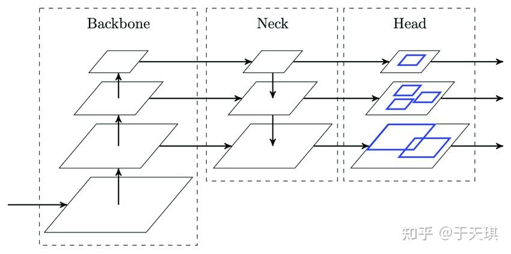

## 4.4 detector=backbone+neck+head

neck:提出一个好的结构或模块，更好适应feature

head:分类+定位

backbone:提取基础特征网络

- Backbone, 译作骨干网络，主要指用于特征提取的，已在大型数据集(例如ImageNet|COCO等)上完成预训练，拥有预训练参数的卷积神经网络，例如：ResNet-50、Darknet53等
- Head，译作检测头，主要用于预测目标的种类和位置(bounding boxes)
- 在Backone和Head之间，会添加一些用于收集不同阶段中特征图的网络层，通常称为Neck。

简而言之，基于深度学习的目标检测模型的结构是这样的：输入->主干->脖子->头->输出。主干网络提取特征，脖子提取一些更复杂的特征，然后头部计算预测输出


# 附录：

* [零基础实践深度学习第四章：目标检测YOLOv3（上）目标检测基础介绍](https://www.paddlepaddle.org.cn/tutorials/projectdetail/3796400)
* [目标检测 Backbone、Neck、Detection head](https://blog.csdn.net/qq_19707521/article/details/109379072)
*  