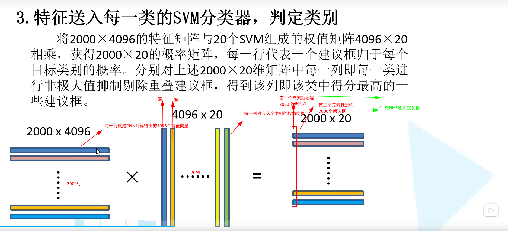

# 1 前言

最近在b站发现了一个非常好的 计算机视觉 + pytorch实战 的教程，相见恨晚，能让初学者少走很多弯路。
因此决定按着up给的教程路线：图像分类→目标检测→…一步步学习用pytorch实现深度学习在cv上的应用，并做笔记整理和总结。

up主教程给出了pytorch和tensorflow两个版本的实现，我暂时只记录pytorch版本的笔记。

参考内容来自：

* up主的b站链接：https://space.bilibili.com/18161609/channel/index
* up主将代码和ppt都放在了github：https://github.com/WZMIAOMIAO/deep-learning-for-image-processing
* up主的CSDN博客：https://blog.csdn.net/qq_37541097/article/details/103482003

# 2 RCNN

1. R-CNN (Region with CNN feature)

Faster-RCNN 是从 R-CNN 到 Fast R-CNN，再到的 Faster R-CNN。R-CNN 可以说是利用深度学习进行目标检测的开山之作。其原始论文：Rich feature hierarchies for accurate object detection and semantic segmentation。

**R-CNN 算法流程分四个步骤**：

* 一张图像生成1k～2k个候选区域（使用 Selective Search 方法,SS算法)
* 对每个候选区域，使用深度网络（图片分类网络，例如VGG或者ResNet）提取特征
* 特征送入每一类SVM分类器，判断是否属于该类
* 使用回归器精细修正候选框位置。（使用 Selective Search 算法得到的候选框并不是框得那么准）

## 2.1 候选区域的生成

利用 Selective Search 算法通过图像分割的方法得到一些原始区域，然后利用一些合并策略将这些区域合并，得到一些层次化的区域结构，而这些结构就包含着可能需要的物体。这里的 SS 算法可以详见  [此处](https://zhuanlan.zhihu.com/p/39927488)，算法原始论文[Selective Search for Object Recognition](https://link.zhihu.com/?target=https%3A//link.springer.com/article/10.1007/s11263-013-0620-5)。。（初始区域的获取是引用另一篇论文的：Efficient Graph-Based Image Segmentation）

## 2.2 对每个候选区域使用深度网络提取特征

将2000个候选区域缩放为 227 × 227 227 \times 227 227×227 pixel，接着将候选区域输入事先训练好的 AlexNet CNN 网络获取 4096 维的特征得到 2000 × 4096 2000 \times 4096 2000×4096 的特征矩阵。（将后面的全连接层去除就得到了特征提取网络）

下图中的CNN就是之前降到的图像分类网络，只不过将最后的全连接层去掉。得到的是特征向量。

## 2.3 特征送入每一类的SVM分类器，判定类别

将得到 2000×4096 维特征与20个（数据集是20分类的）SVM组成的权值矩阵  4096×20 相乘，获得 2000×20 维矩阵表示每个建议框是某个类别的得分。对上述 2000×20 维矩阵中每一列即每一类进行非极大值抑制剔除重叠建议框，得到该列即该类中得分最高的一些建议框。

非极大值抑制的实现可见下图，首先找到得分最高的候选框，然后计算其他同类候选框与之的iou，删除所有iou大于阈值的候选框，然后下一个目标等等（**极大值对应着重叠区域**）：

对 2000×20 维矩阵中每一列即每一类进行非极大值抑制，则可以剔除重叠建议框，保留高质量的建议框！

## 2.4 使用回归器精细修正候选框位置

对 NMS（非极大值抑制）处理后剩余的建议框进行进一步筛选。接着分别用 20 个回归器对上述 20 个类别中剩余的建议框进行回归操作，最终得到每个类别的修正后的得分最高的 bounding box。回归器得到四个值：x和y方向的偏移量，高度和宽度的缩放值。 回归器的具体训练方法在这里就没讲了，在讲Faster-RCNN的时候会进行讲解。我想应该是有预测框，有ground-truth然后训练得到的。

## 2.5 小结

总结起来，R-CNN 包括以下四部分：

在后面讲 Fast-RCNN 和 Faster-RCNN 的时候这四部分会逐步融合，最终生成一个端对端的完整的网络。

R-CNN 存在的问题：

* 测试速度慢
  * 测试一张图约需要 53s (多核CPU)，用SS算法提取候选框用时约 2s，一张图像内候选框之间存在大量的重叠，**提取特征操作冗余**（Fast RCNN将会对其进行优化）。
* 训练速度慢
  * 过程及其繁琐
* 训练所需空间大
  * 对于 SVM 和 bbox 回归训练，需要从每个图像中的每个目标候选框提取特征，并写入磁盘。对于非常深的网络如 VGG16，从 VOC2007 训练集上的 5k 张图像上提取的特征需要上百GB的存储空间。

