# 1 前言

最近在b站发现了一个非常好的 计算机视觉 + pytorch实战 的教程，相见恨晚，能让初学者少走很多弯路。
因此决定按着up给的教程路线：图像分类→目标检测→…一步步学习用pytorch实现深度学习在cv上的应用，并做笔记整理和总结。

up主教程给出了pytorch和tensorflow两个版本的实现，我暂时只记录pytorch版本的笔记。

参考内容来自：

* up主的b站链接：https://space.bilibili.com/18161609/channel/index
* up主将代码和ppt都放在了github：https://github.com/WZMIAOMIAO/deep-learning-for-image-processing
* up主的CSDN博客：https://blog.csdn.net/qq_37541097/article/details/103482003

## 2 Fast RCNN

Fast R-CNN 是作者 Ross Girshick 继 R-CNN 后的又一力作，论文名就叫做 Fast R-CNN，2015年发表的。同样使用 VGG16 作为网络的 backbone，与 R-CNN 相比训练时间快了 9 倍，测试推理时间快了 213 倍，准确率从 62% 提升至了 66% （在 Pascal VOC 数据集上）

Fast R-CNN 算法流程分三个步骤：

* 一张图像生成1k～2k个候选区域（使用 Selective Search 方法）
* 将图像输入网络得到相应的特征图，将 Selective Search 算法生成的候选框**投影到**特征图上获得相应的特征矩阵
* 将每个特征矩阵通过 ROI pooling 层（可以看做是SPPNet的[SPPNet](https://www.jianshu.com/p/90f9d41c6436)的简化版本，了解可参考 [此处](https://blog.csdn.net/u011436429/article/details/80279536)）缩放为 7×7 大小的特征图，接着将特征图展平通过一系列全连接层获得预测结果。

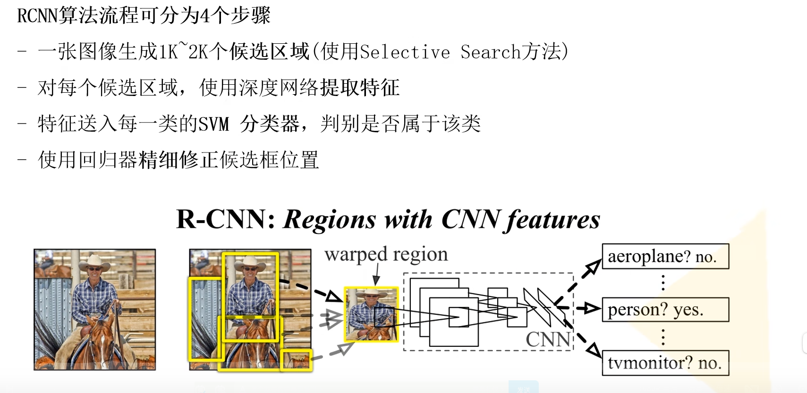

第二步就已经和 R-CNN 完全不同了，第三步中 ROI 就是 Region of interest，即感兴趣区域。**边界框和目标所属类别同时进行预测**。不需要训练回归器，Fast R-CNN 关键在于如何生成候选框的特征？

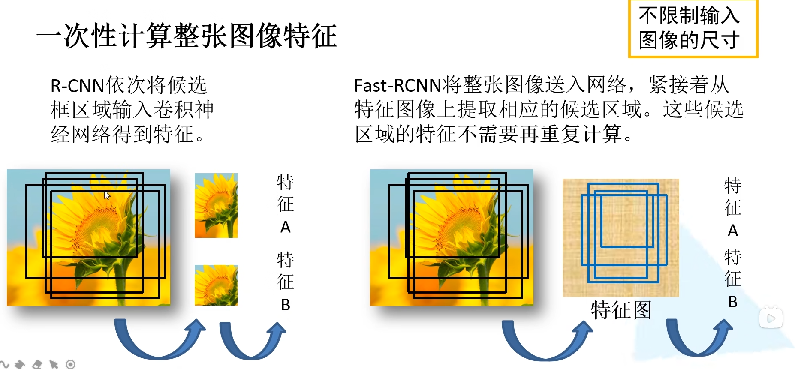

带重复的候选框内的特征不需要重复计算了。训练过程中并不是使用 SS 算法提供的所有的候选区域，训练过程其实只需用使用 2000 个中的一小部分就可以了。

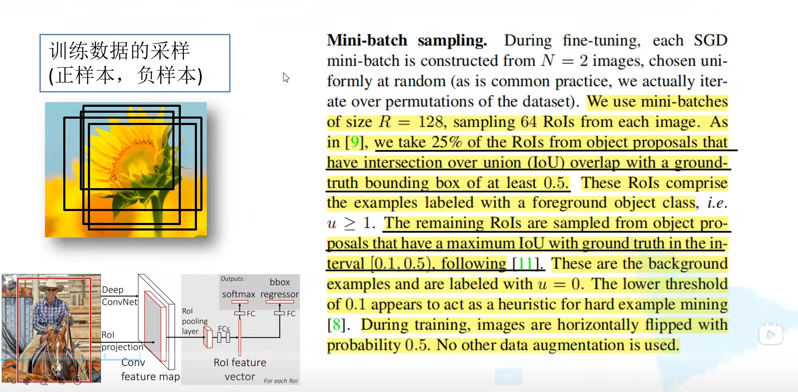

## 2.1 ROI polling

ROI pooling 层如何实现的呢？假设左边的图是一个候选区域在我们特征图上对应的特征矩阵。得到的特征矩阵讲他化为 7 × 7 7 \times 7 7×7 的 49 等份，对于每个区域执行最大池化下采样。无论特征矩阵是什么尺寸的，就可以都统一缩放为 7 × 7 7 \times 7 7×7 大小，这样就可以不限制输入图像的尺寸了。下面示意图是对于一个channel进行操作，其余channel操作相同。

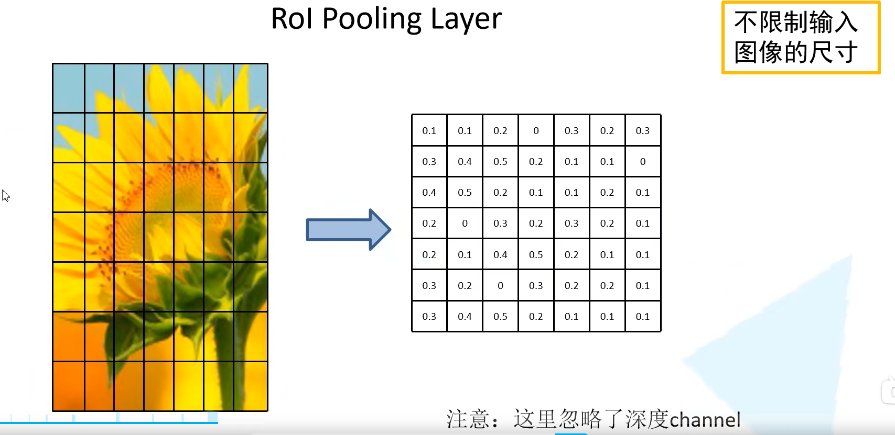

## 2.2 分类器

最后的 Fast R-CNN 网络结构如下所示，最后是**并联**了两个全连接层分别对分类和bbox进行预测。分类结点数为 N+1，因为需要增加上背景。bbox预测的全连接层则是 4×(20+1)=84 个结点，对每一类都要预测出来边界框参数。

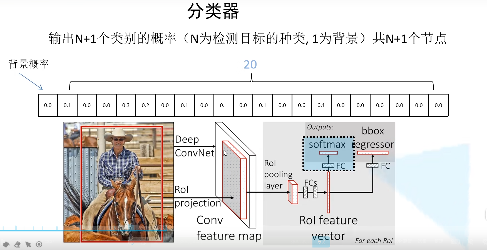

## 2.3 边界框回归器

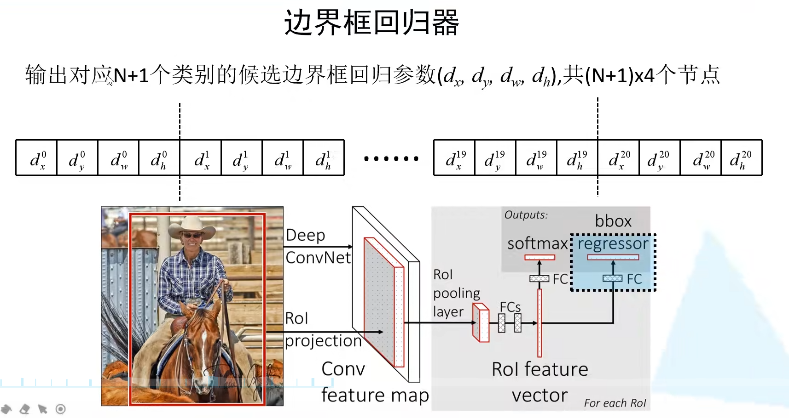

怎么得到预测框呢？从下图可见， dx 和 dy 是用来调整候选框中心坐标的参数， dw 和 dh 是用来调整候选框大小的参数。通过这个公式我们也可以计算 ground-truth 的 vx,vy,vw,vh 四个候选框参数。

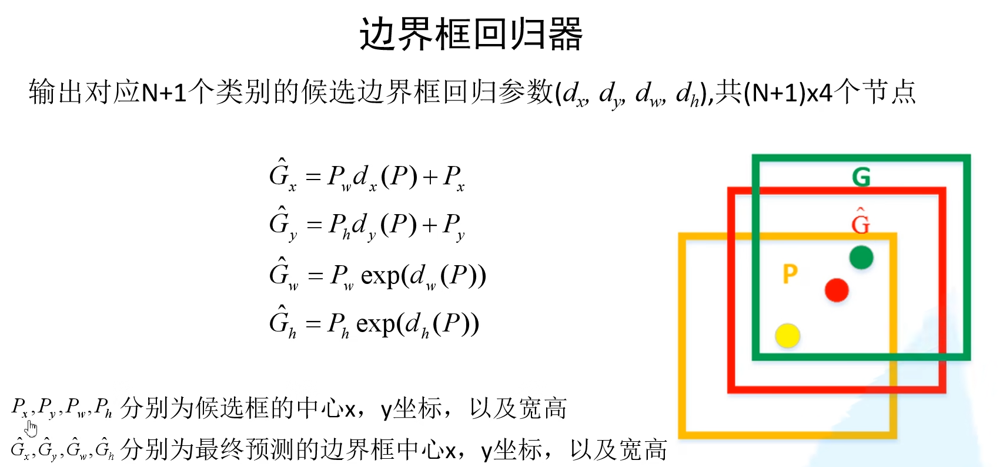

## 2.4 损失函数

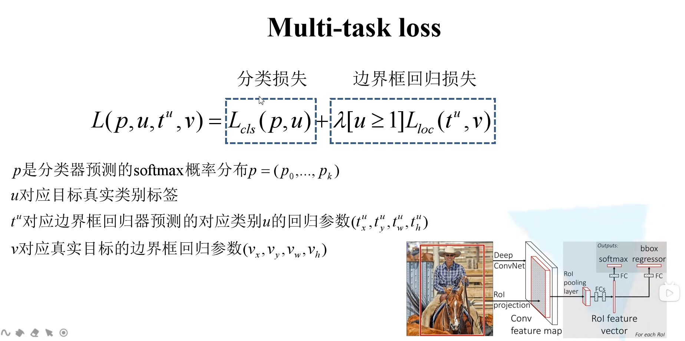

### 2.4.1 分类损失

分类损失其实是交叉熵损失，在交叉熵中 ${o_i}^*$ 只有在真实类别处为1，其余为0（one-hot code），所以 $Loss_{cls}=−log(p_u)$。

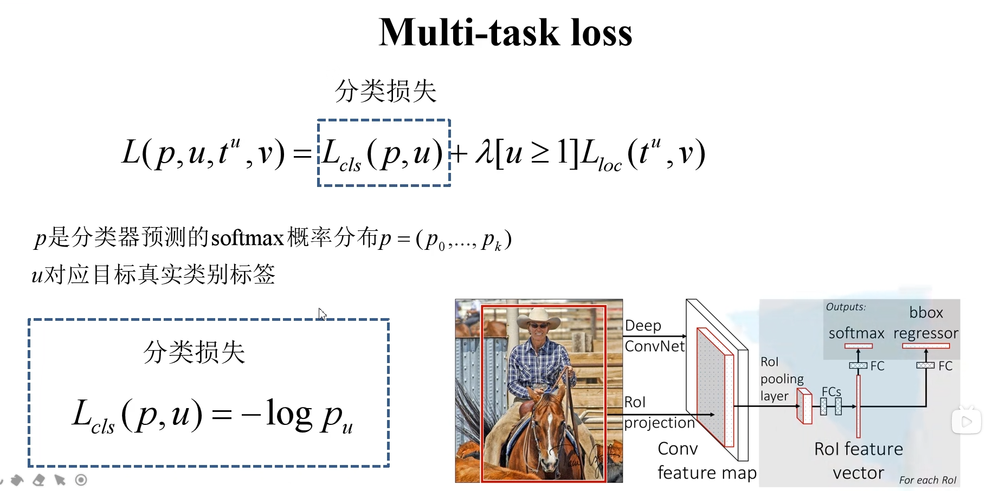

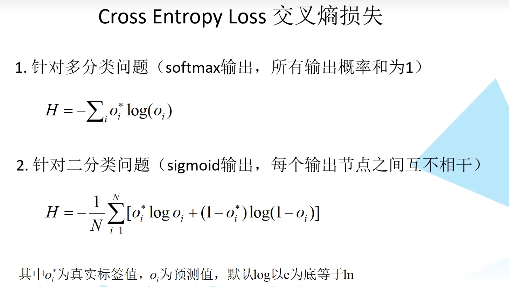

### 2.4.2 边界框损失

边界框回归损失由四部分组成，四个预测参数的$ Smooth_{L1} $损失构成的，λ 是一个平衡系数，第二项中括号表示当 u≥1 时为1，否则为 0。u 是目标的真实标签。这个部分说明候选区域确实是我们需要检测的部分，对应着正样本。当  u=0 对应着负样本，就没有边界框损失了。

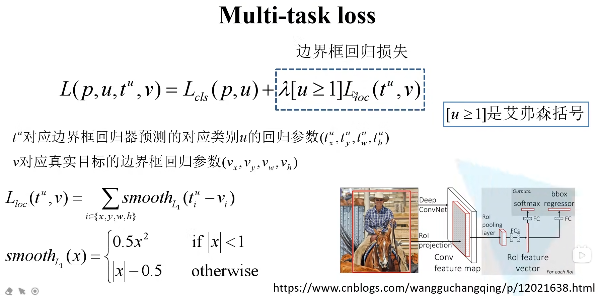

## 2.5 总结

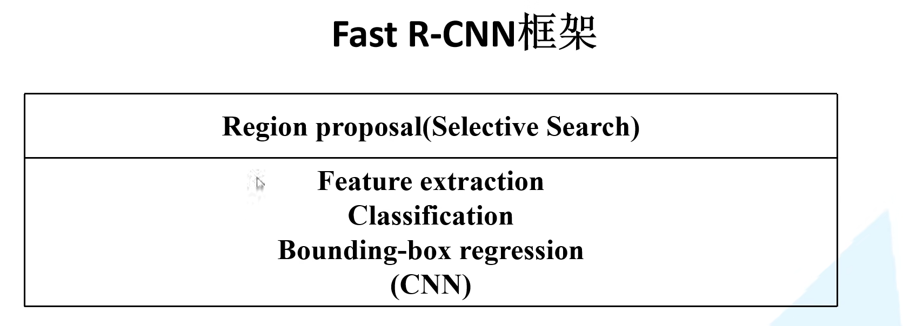

速度的瓶颈还是在SS算法上。