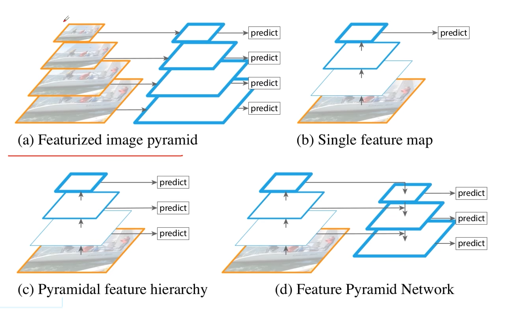
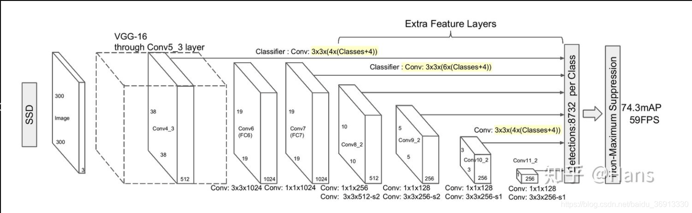
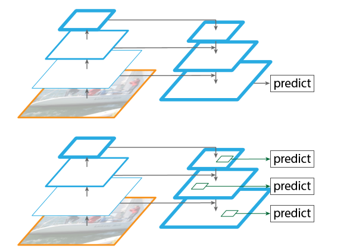
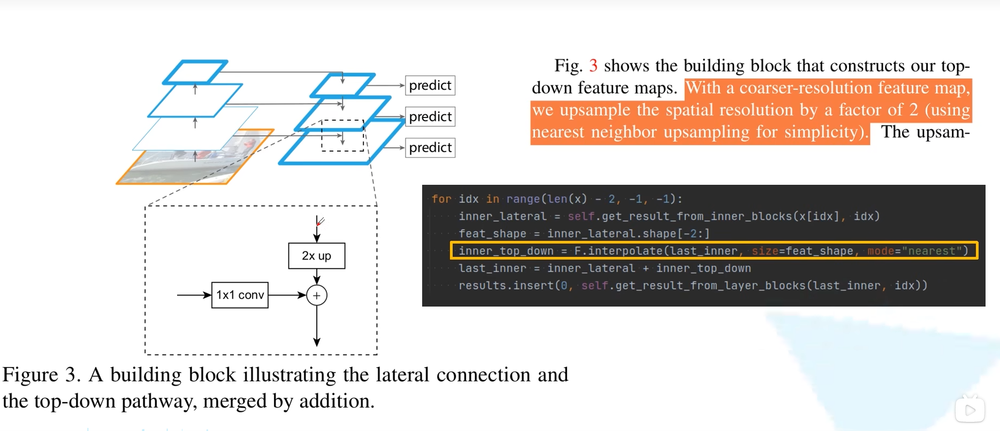
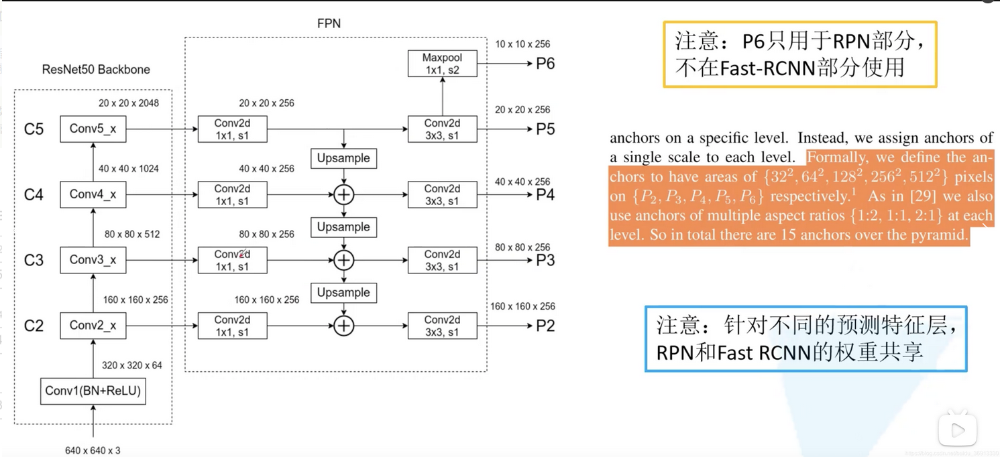
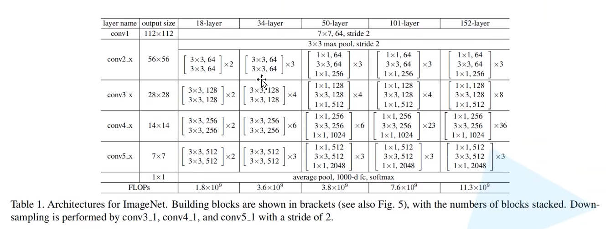
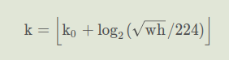
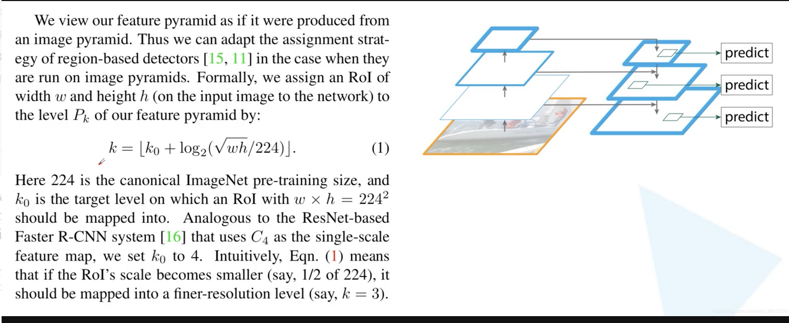

# 1 前言

最近在b站发现了一个非常好的 计算机视觉 + pytorch实战 的教程，相见恨晚，能让初学者少走很多弯路。
因此决定按着up给的教程路线：图像分类→目标检测→…一步步学习用pytorch实现深度学习在cv上的应用，并做笔记整理和总结。

up主教程给出了pytorch和tensorflow两个版本的实现，我暂时只记录pytorch版本的笔记。

参考内容来自：

* up主的b站链接：https://space.bilibili.com/18161609/channel/index
* up主将代码和ppt都放在了github：https://github.com/WZMIAOMIAO/deep-learning-for-image-processing
* up主的CSDN博客：https://blog.csdn.net/qq_37541097/article/details/103482003

# 2 FPN 特征金字塔

FPN 原始论文为发表于 2016 CVPR 的 Feature Pyramid Networks for Object Detection。针对目标检测任务，主要解决的问题是目标检测在处理多尺度变化问题时的不足，最终在COCOAp 提升 2.3 个点，pascalAP 提升3.8 个点。

经典的two stage检测网络有：faster RCNN和SSD，它们用于做bbox regression的模型各有不同，faster  RCNN是VGG，feature map经过不断地下采样，最后的feature  map送入RPN层，这样不断地下采样使得小检测框的像素非常小，无法进行训练的到，得到很好的结果。而SSD则是分别对不同尺寸的feature  map进行bbox regression，这就导致尺寸较大的feature  map没有高级语义，对于全局语义没有很好地提取，无法判断出物体的位置和大小，同样对小检测框没有很好的检测效果。FPN则解决了这个问题。

下图是原论文中给出的四幅结构对比图：

* 图( a )是特征图像金字塔结构，在传统的图像处理中很常见（为了处理物体大小差异十分明显的检测问题，经典的方法是利用图像金字塔的方式进行多尺度变化增强，但这样会带来极大的计算量）。生成多少个不同的尺度就会重新预测多少次，这样效率是很低的。

* 图( b )是 Faster RCNN 采用的一种方式，由 backbone 得到最终的特征图。在最终的特征图上进行预测。这种方法针对小目标的预测结果并不是很好。

* 图( c )和之后要讲的SSD算法很类似。首先还是将图片输入给 backbone，会在 backbone 得到的不同特征图上分别进行预测。SSD真实网络结构如下：

  

* 图( d )是FPN结构，不是简单的在 backbone 的不同特征图上进行预测，**会将不同特征图上的特征进行融合，在融合之后得到的特征图上再进行预测**。实现能在增加极小的计算量的情况下，处理好物体检测中的多尺度变化问题。

 上图上半部分并不是FPN，他只是用最后一张合成的feature map做预测，真实的feature map是每一层都用anchor做预测。事实证明，FPN的效果更好，**因为在不同层使用anchor可以增加对于尺寸变化的鲁棒性**。当然第一个也有anchor，它的数量即使远远大于FPN，效果也不如FPN，因为缺少鲁棒性。

## 2.1 特征融合的实现

原论文中细节部分如下所示，针对每一个 backbone 上的特征图，先使用 1×1 的卷积核进行处理。原始论文中 1×1 卷积核的个数为 256，即最终得到的特征图的 channel 都是 256。

* 1×1 卷积核的主要目的是为了调整 backbone 上不同特征图的 channel，因为后面能够融合需要保证相同的 shape。
* 2 倍上采样的具体实现方法则是简单的最近邻插值算法。pytorch 官方实现的代码就是使用插值算法，模式是最近邻算法。

## 2.2 完整FPN结构示例

更完整的FPN结构图如下所示，resNet50 的结构也展现在下方。从下图可见，得到的新的融合特征图还需要经过一个 3×3 的卷积对融合后的特征图进行进一步融合。在原论文描述中，将在 P5 的基础上进行一个下采样（pytorch 官方直接使用的是 maxpooling，但是是 1×1 的，通过步距为 2 实现的下采样）。

回顾一下ResNet的网络结构如下

值得注意的是，P6 仅用于 RPN 部分，不用于 Fast R-CNN 部分。即 RPN 在 P2～P6 上给出 proposal，然后将 proposal 映射到 P2～P5 上输入 Fast R-CNN。

还需要强调的点是，由于我们在 FPN 网络中生成了多个预测特征层，所以可以在不同的预测特征层上去分别针对不同尺度的目标进行预测。之前在讲 Faster R-CNN 的时候，我们只有一个预测特征层，所以在一个预测特征层上去生成不同面积以及不同比例的 anchor。**但是在 FPN 中，对于不同的预测特征层会针对不同的面积**。例如对于 P2，他是相对较低层的预测特征层，会保留更多的底层细节信息，更适合预测小型的目标，所以会将面积为 $ 32^2$，比例为 1:2，1:1，2:1 的 anchor 在 P2 上进行生成。同理在 P3 上生成 $64^2$ 面积的不同比例的 anchor… 最后面积为 $512^2$  的anchor 在 P6 生成（这也是和 Faster R-CNN稍微有点不同的地方）。

我们有多个不同的预测特征层，**是否需要对不同的预测特征层都去使用一个不同的 RPN 和一个不同的 Fast R-CNN 的模块呢**？作者其实做了实验。原论文提到，使用同一个 RPN 和 Fast R-CNN 和 分别在不同的预测特征层上使用不同的 RPN 和不同的 Fast R-CNN 在最终的检测精度上其实并**没有什么差异**。所以去共享权重是最好的，这样就可以减少网络训练参数，也能减少网络的大小，提升训练速度。

**也就是P2-P6使用同一个RPN，P2-P5使用相同的FasteRCNN结构。**

至此我们能看到，相较于 Faster R-CNN，增加 FPN 后实际增加的计算量很小。

**最后还有一个问题：如何知道预测的 proposal 应该映射到哪一个特征图上呢？**

作者将特征金字塔视作图像金字塔生成出来的，并给出了一个公式：

其中 k k k 是计算得到的最终在哪一个预测特征层上， k 对应着 P2～P5，所以数值就是 2，3，4，5。 $k_0$ 的设置是为 4 的。 w 和h 是 RPN 预测得到的一系列 proposal 在原图上的宽度和高度。如果  w 和 h 在原图上都等于 224 的一半，也就是 112 的话，此时 k 计算出来就是 4-1=3。也就是越小的目标， k 越小。

使用同一个 RPN 和 Fast R-CNN 和 分别在不同的预测特征层上使用不同的 RPN 和不同的 Fast R-CNN 在最终的检测精度上其实并没有什么差异，这也说明不同层级之间的特征有相似的语义层次。这和特征金字塔网络的初衷一致。我想这也是为什么作者将特征金字塔视作图像金字塔生成出来的，从而回答了如何知道预测的 proposal 应该映射到哪一个特征图上这一问题。