# 1 前言

最近在b站发现了一个非常好的 计算机视觉 + pytorch实战 的教程，相见恨晚，能让初学者少走很多弯路。
因此决定按着up给的教程路线：图像分类→目标检测→…一步步学习用pytorch实现深度学习在cv上的应用，并做笔记整理和总结。

up主教程给出了pytorch和tensorflow两个版本的实现，我暂时只记录pytorch版本的笔记。

参考内容来自：

* up主的b站链接：https://space.bilibili.com/18161609/channel/index
* up主将代码和ppt都放在了github：https://github.com/WZMIAOMIAO/deep-learning-for-image-processing
* up主的CSDN博客：https://blog.csdn.net/qq_37541097/article/details/103482003

# 2 FasterRCNN

Faster R-CNN 是作者 Ross Girshick 继 Fast R-CNN 后的又一力作，同样使用 VGG16 作为 backbone，推理速度在 GPU 上达到 5fps（每秒检测五张图，包括候选区域生成），准确度也有一定的进步。核心在于 RPN 区域生成网络（Region Proposal Network）。

Faster R-CNN 算法流程分三个步骤：

* 将图像输入网络得到相应的特征图
* 使用RPN结构生成候选框，将 RPN 生成的候选框投影到特征图上获得相应的特征矩阵。**也就是使用RPN代替之前的SS生成候选框**。
* 将每个特征矩阵通过 ROI pooling 层（可以看做是SPPNet的简化版本，了解可参考 此处）缩放为 7×7 大小的特征图，接着将特征图展平通过一系列全连接层获得预测结果。

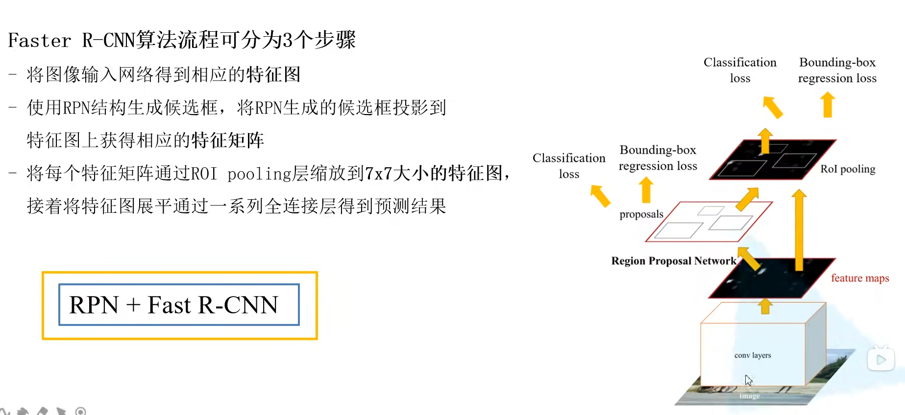

## 2.1 RPN网络结构

Region Proposal NetWork

相比与fastRCNN只是候选框的生成方式不一样，这里就之是将一下RNP就可以了。

在特征图上使用滑动窗口，每滑动到一个位置生成一个一维的向量， 在向量的基础上通过两个全连接层去输出目标概率和边界框回归参数。2k 中的 k 指的是 k 个 anchor boxes，2是指为背景的概率和为前景的概率。每个 anchor 有 4 个边界框回归参数。这里一维向量（256-d）的维度是根据使用**backbone的通道数来定的**，比如VGG16为512个通道，而使用ZF网络则是256个通道。

对于每个3×3 的滑动窗口计算中心点在原图中的位置（根据比例计算）。然后特征图点的k 个 anchor boxes 对应着原图对应点为中心计算 k 个（下图是给出了3个） anchor boxes。每个都给定了大小和形状，例如下图中给出来了三个示例。

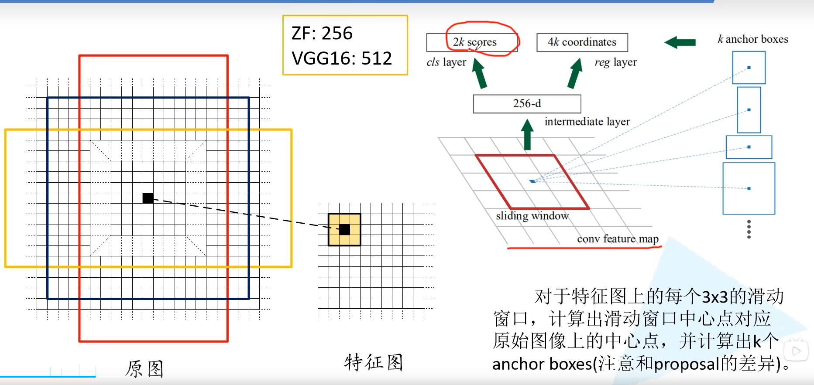

注意这里只预测每个 anchor boxes 是前景还是背景，没有具体的类别。因为是滑动窗口，所以 anchor boxes 中可能有目标物体也可能没有。然后给出了中心位置的偏移量和大小调整，训练希望能够尽可能准确的框选出目标。所检测物体的大小和长宽比都可能是不同的，所以给出了一系列的 anchor 来预测目标的位置。

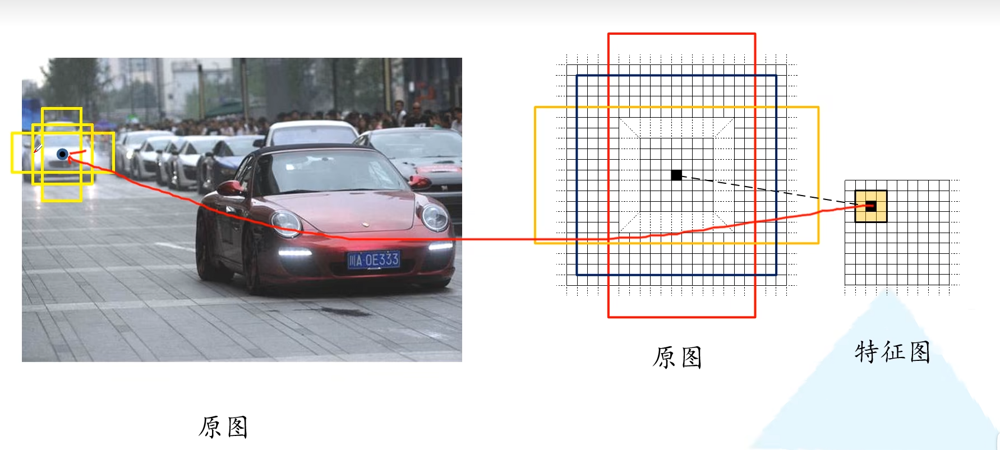

如下图第一组cls是0.1 0.9 就代表这一个anchor预测是背景的概率是0.1,预测是前景的概率是0.9（注意并没有分类）

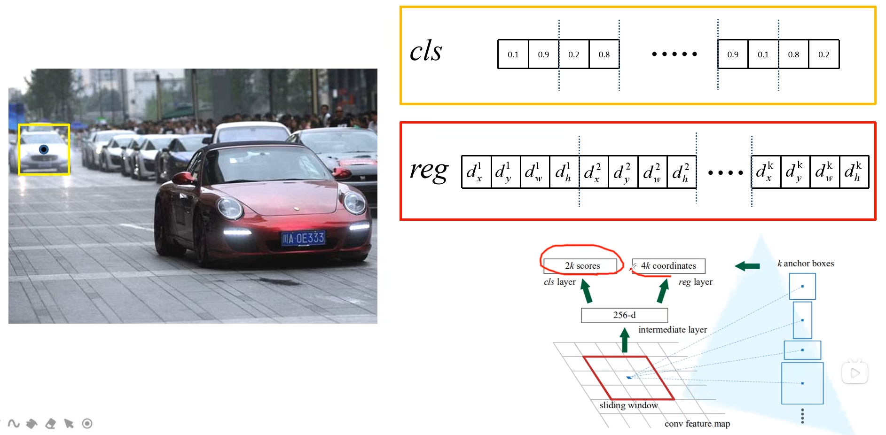

接下来讲讲 Faster R-CNN 中给出了哪些尺度和比例的 anchor boxes。不同尺度不同比例对应着蓝色，红色，绿色的九个 anchor。也就是实际上每个地方都会生成 2×9=18 个类别分数和 4×9=36 个边界框回归参数。 3×3 的滑动窗口在 ZF 网络中感受野为 171，而在 VGG16 中为 228。为什么还能预测 256 甚至 512 感受野呢？作者在论文中提出的观点是通过小感受野预测比他大的感受野是有可能的。例如通过经验我们看到物体的一部分就大概猜出了全貌。实际使用中这个也是有效的。

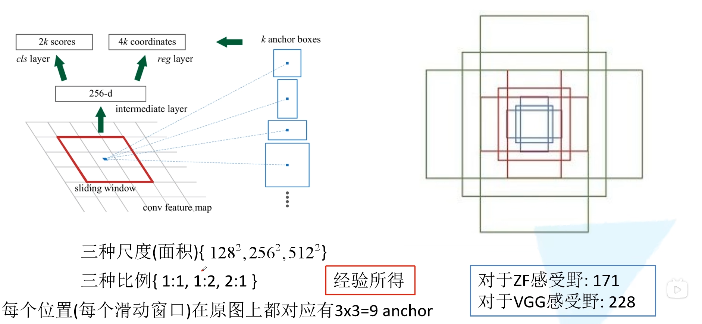

下图给出了ZF网络如何计算感受野的：

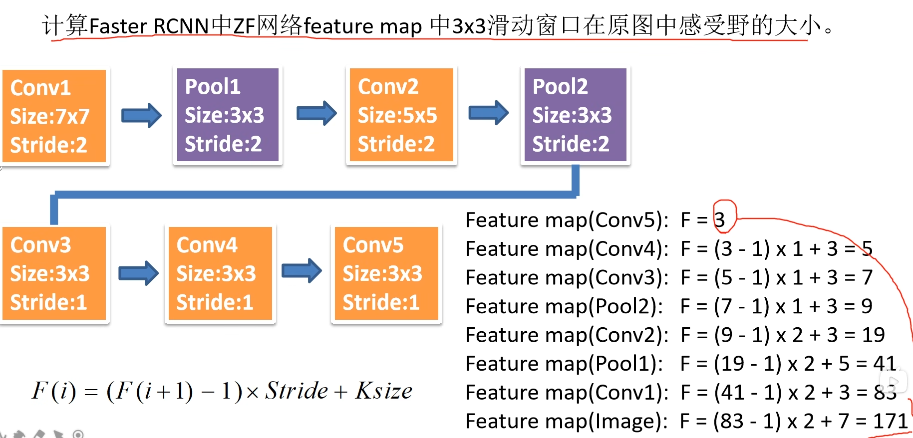

对于一个1000×600×3 的图像，特征图大约就是 60×40 大小。获得大量的候选框有很多的重叠，基于候选框的cls得分，采用非极大值抑制，设定 iou 为 0.7（也就是说找到最大cls的，删除和它iou大于等于0.7的候选框，然后找下一个…），就获得近似原始 SS 算法个数的 2k 个候选框。注意：**anchor 和候选框不一样，anchor 加上四个边界框回归参数才能成为候选框**。

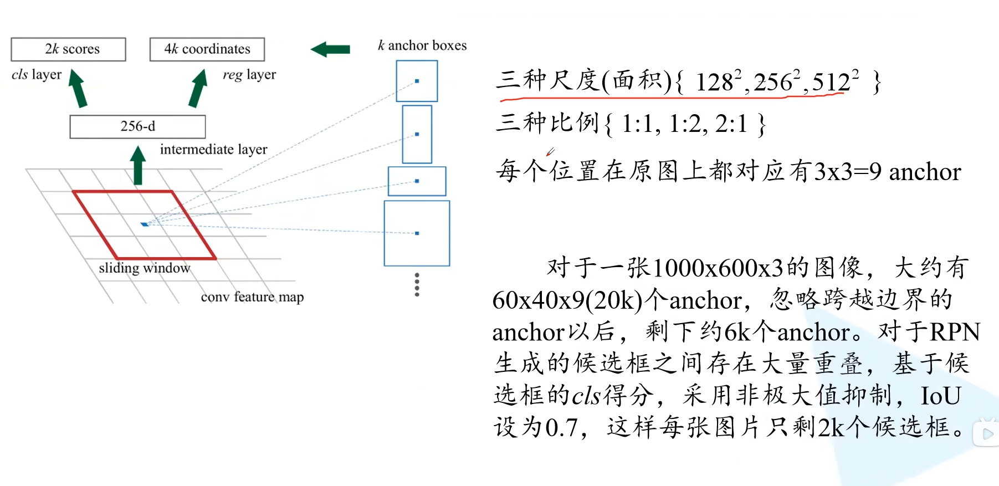

多说一下滑动窗口怎么实现的？其实就是使用步长为1，padding也为 1 的 3×3 卷积。卷积后得到的和特征图尺寸深度都是一样的。得到的特征矩阵上并联两个 1×1 的卷积层，就能得到类别回归的预测和边界框回归的预测。

实际上生成的这么多 anchor 并不是每个都用来训练 RPN 网络。对于每张图片我们从上万个 anchor 当中采样 256 个 anchor，这些 anchor 由正样本和负样本 1:1 组成的。如果正样本不足 128，就用负样本进行填充。两种定义正样本的方式：（1）anchor 与 ground-truth 的 iou 超过 0.7，（2）某个 anchor 与 ground-truth 拥有最大的 iou。负样本是与所有的 ground-truth 的 iou 都小于 0.3 的。

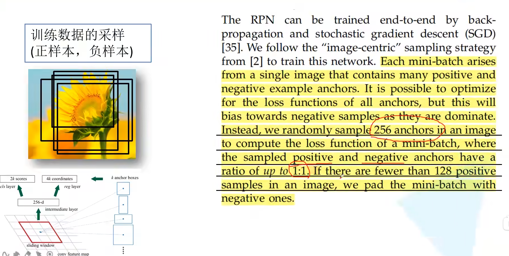

## 2.2 RPN损失

RPN的损失也分为两个部分，分类损失和边界框回归损失。其中注意，anchor 位置的个数其实就是特征图大小，也就是 60×40 近似于 2400。 λ 是一个平衡系数，论文中取 10。

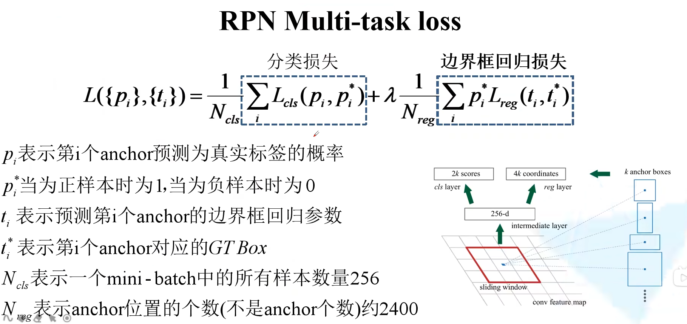

注意分类损失这里其实用的是类似多分类的 softmax cross-entropy，而不是二分类的 sigmoid cross-entropy。在下图中，第一项损失为 −log0.9，第二项因为真实标签为 0，所以为  −log0.2，依此类推。

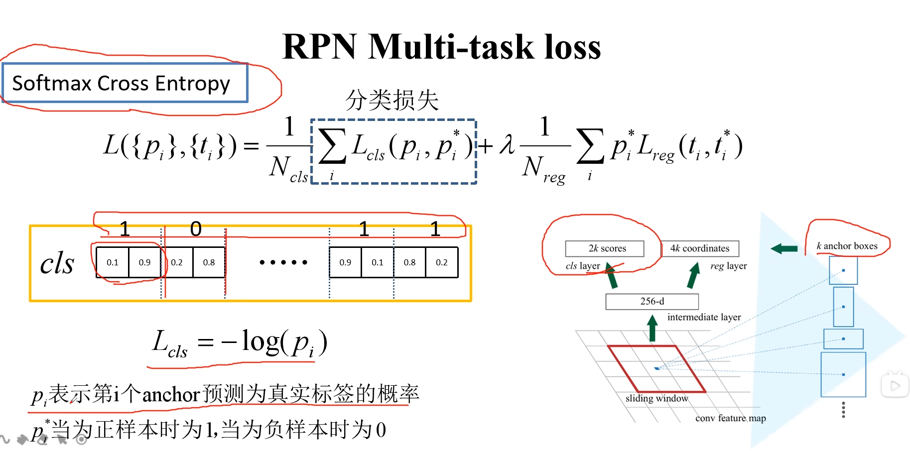

如果使用二分类的交叉熵损失，就是 k 个预测得分，而不是 2k 了。经过 sigmoid 输出后，如果是接近 1 则是前景，如果是接近 0 则是背景。此时 loss 依然是 −(log0.9+log0.8+...)。pytorch 官方实现的 Faster R-CNN 就是使用的二分类的交叉熵损失

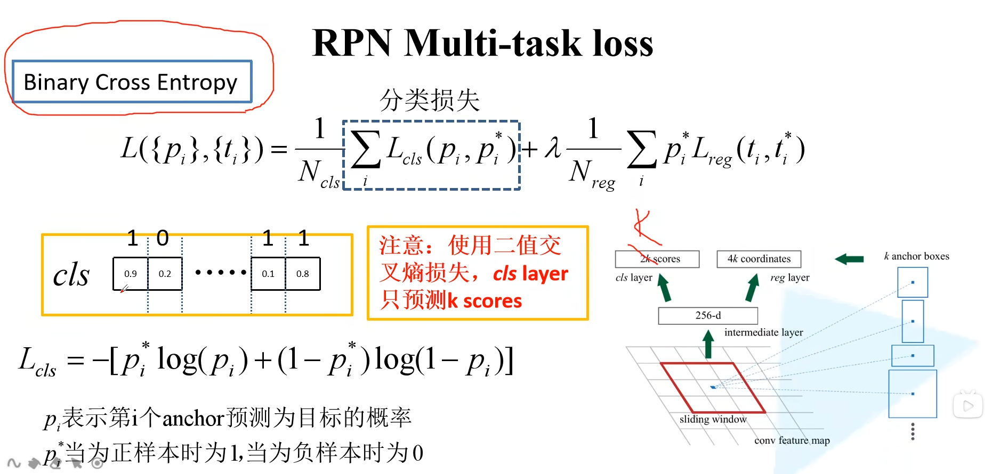

边界框回归损失和 Fast R-CNN 是一样的。 $p_i^*$  保证只对真实的边界框才计算损失。 t 是直接预测出来的， $ t^* $ 则要根据 ground-truth 计算出来。

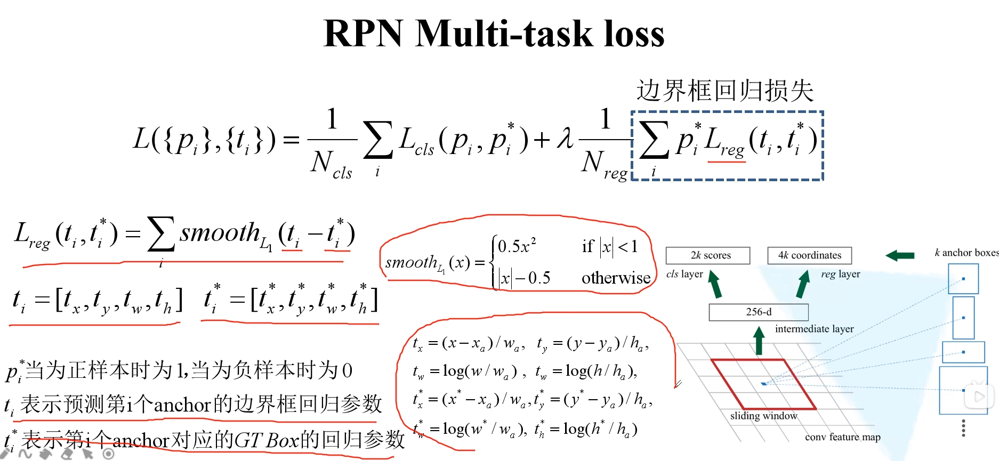

## 2.3 Faster R-CNN 训练

现在是联合训练（pytorch官方实现的方法也是联合训练），原来论文是分别训练。

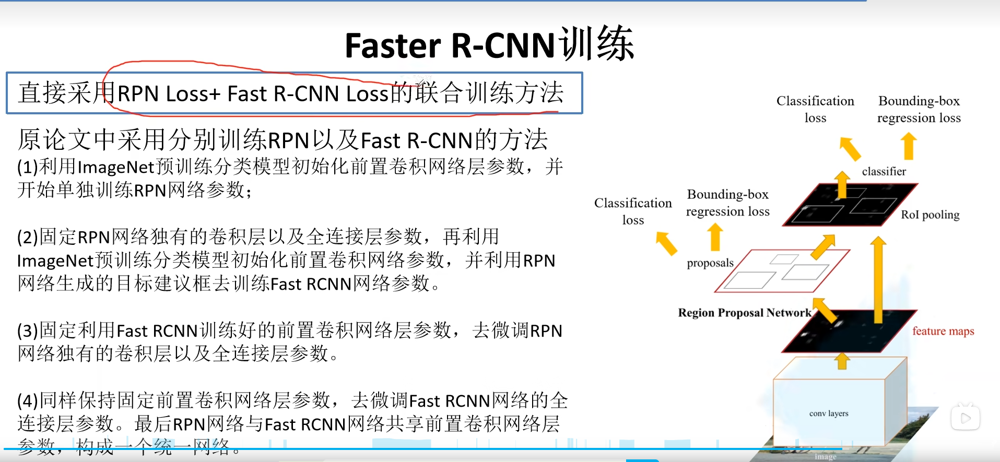

# 3 总结

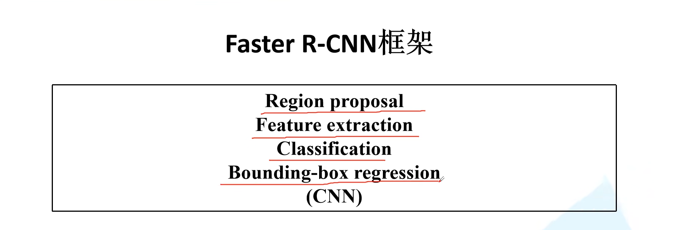

对比如下

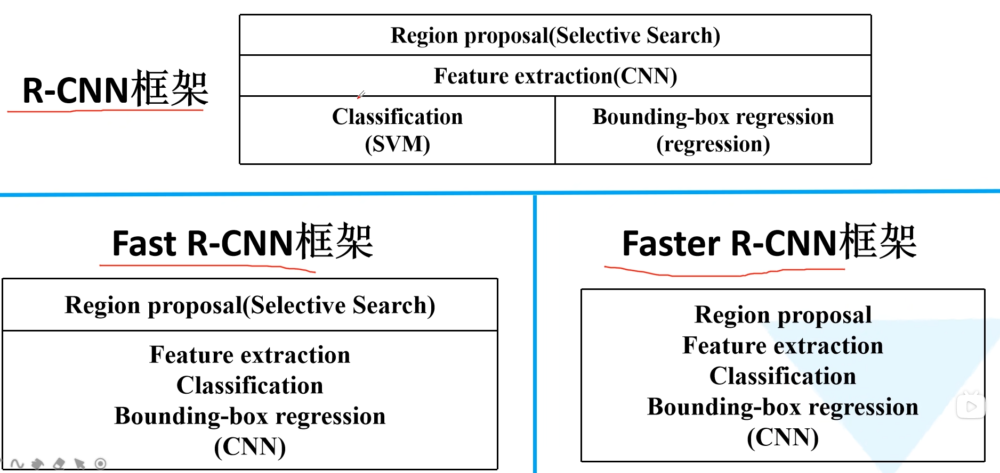