# 简介

根据B站的视频30天学会fusion 360 .这里针对每一个图纸的重点做一个记录。

参考https://www.bilibili.com/video/BV1UL4y177r8?spm_id_from=333.788.videopod.sections&vd_source=cde2e7b9bca1a7048a13eaf0b48210b6

# 乐高

主要的操作：

* 创建草图
* 完成草图
* 拉伸
* 草图尺寸（准确定位）
* 抽壳
* 参考线
* 偏移
* 圆角

## 软件设定

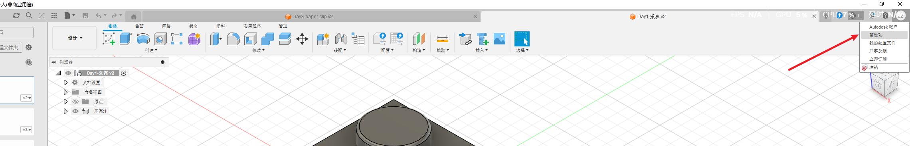

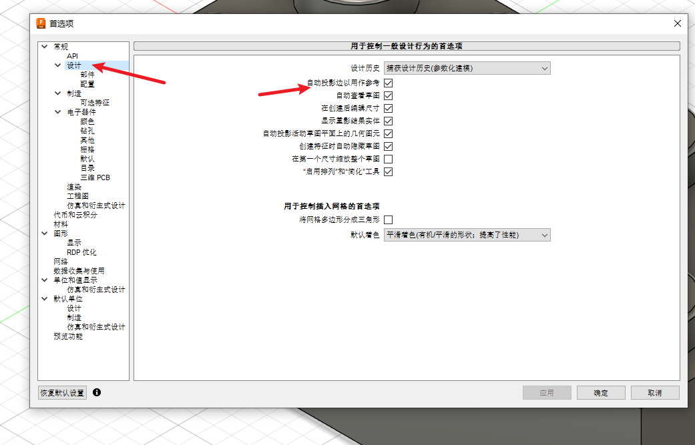

## 重要步骤

绘制矩形-完成草图

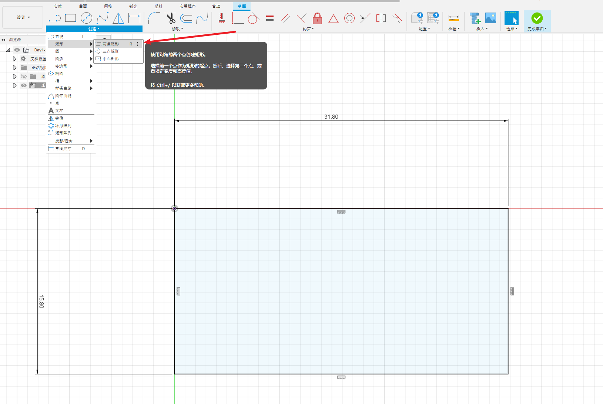

拉伸

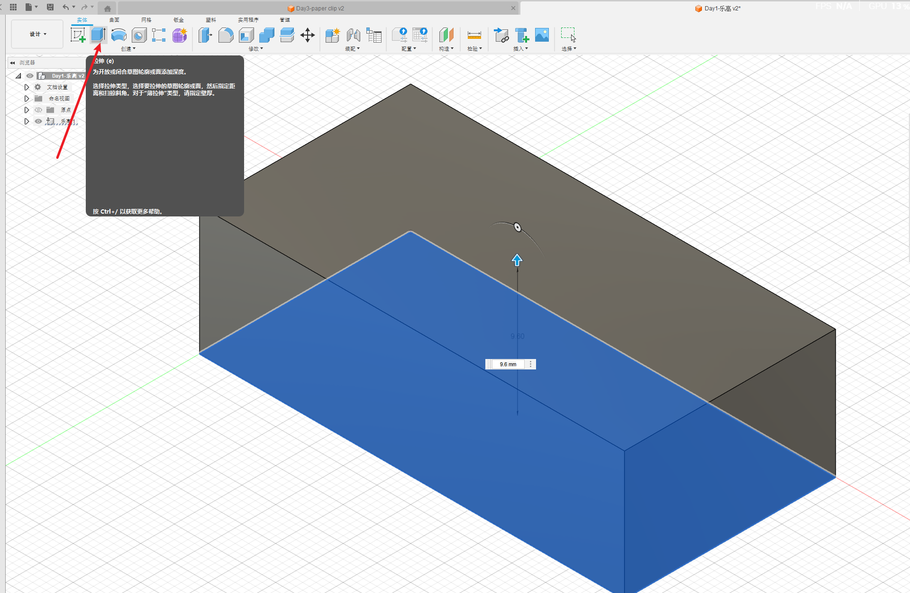

拉伸后，重新创建草图-选择面-绘制圆形

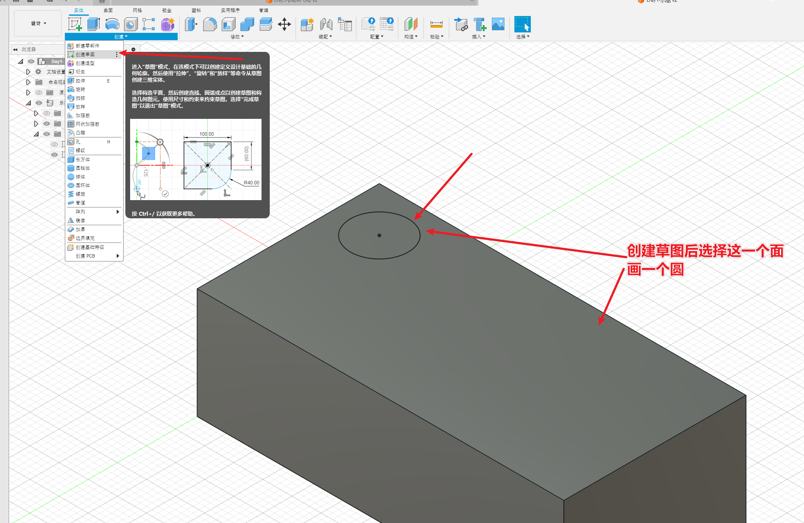

创建草图尺寸，定位圆的位置-完成草图

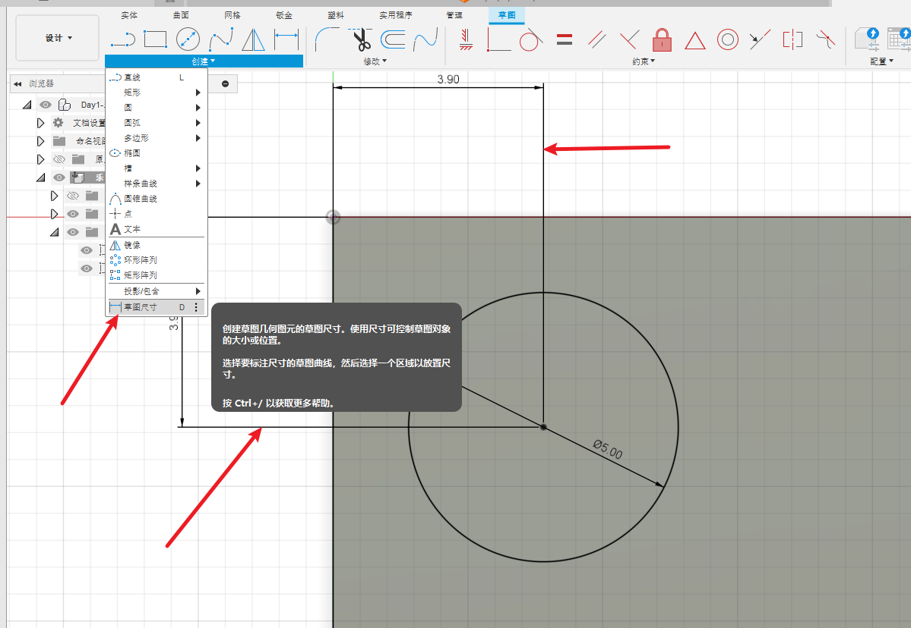

矩形阵列

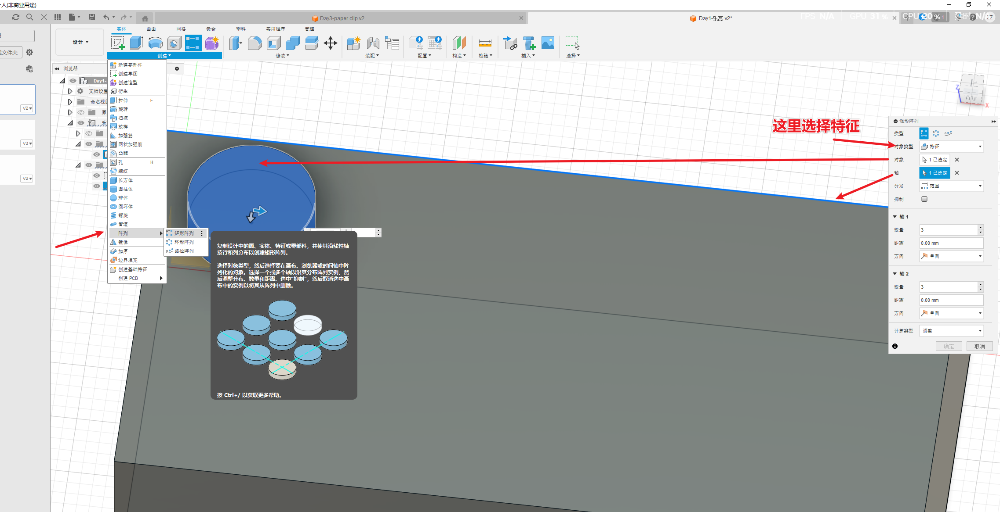

抽壳

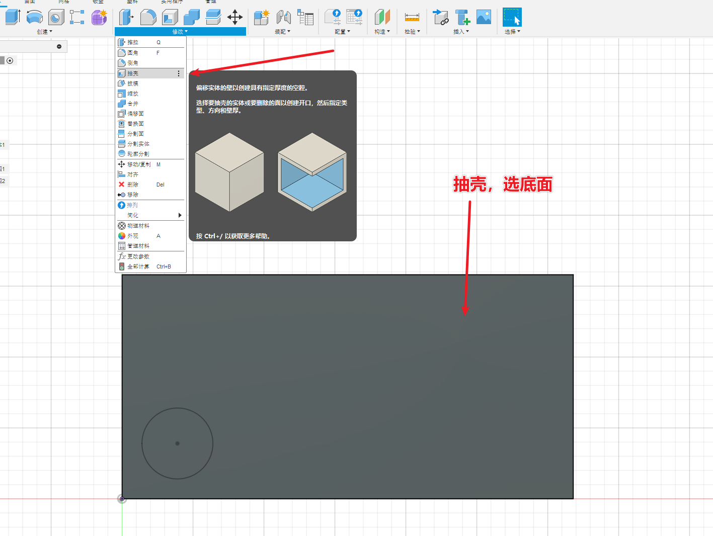

参考线

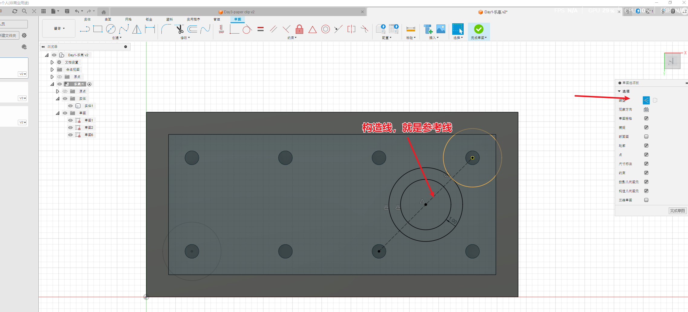

偏移

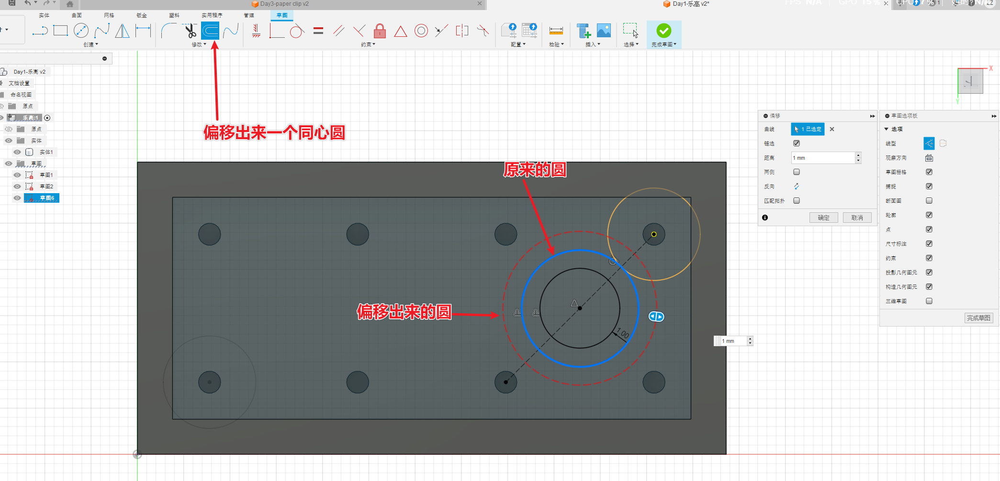

设置圆角

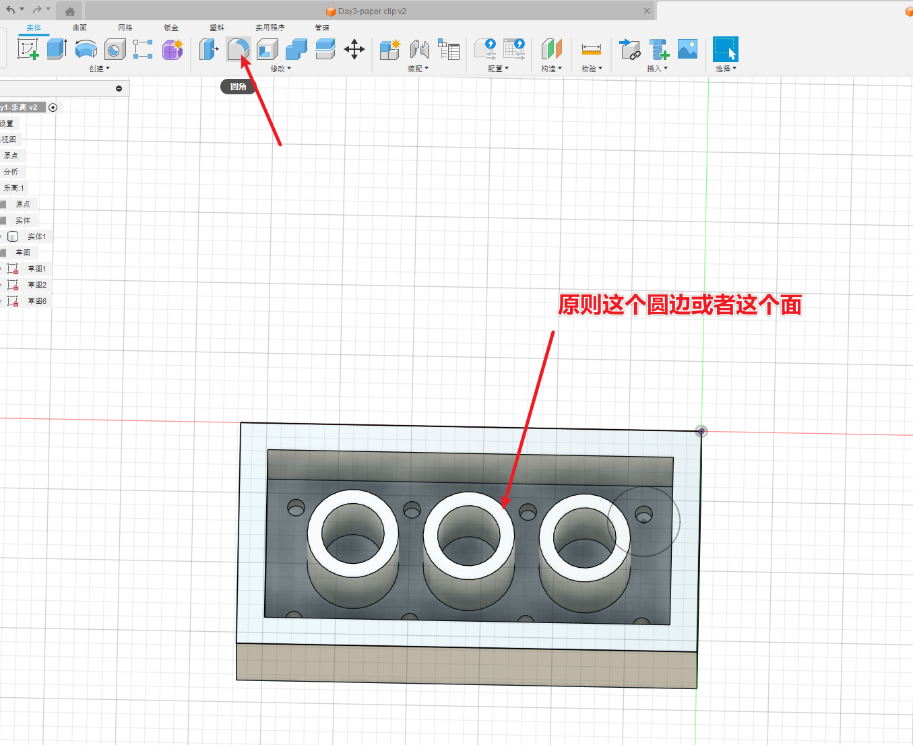

截面分析

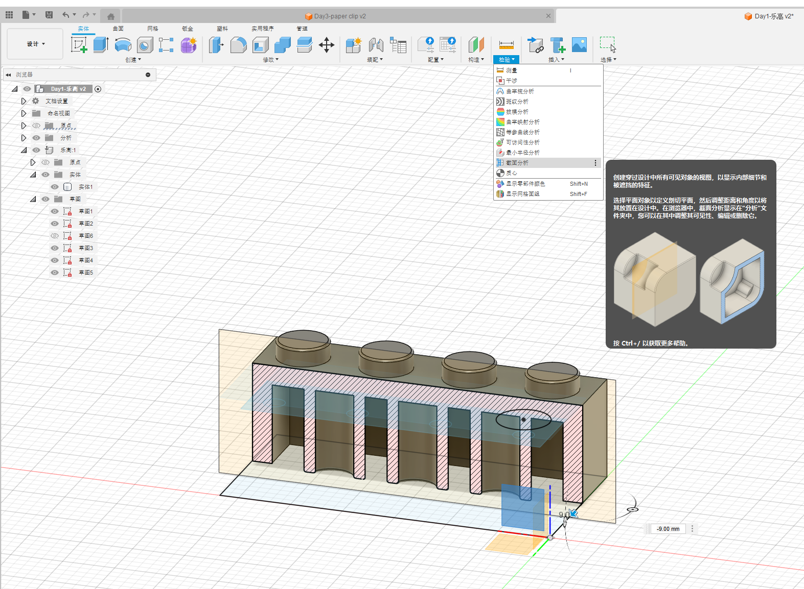

历史记录修改

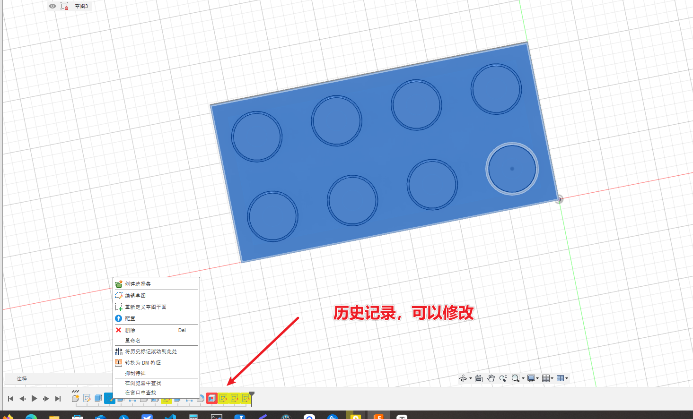

# 成品图

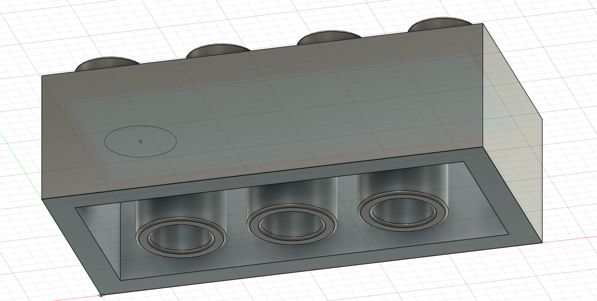