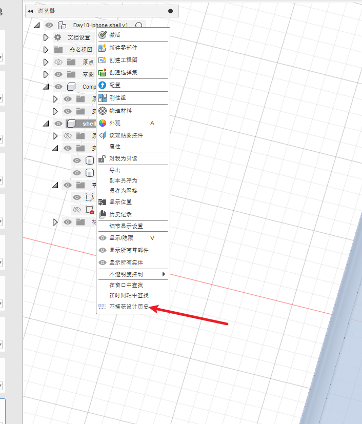
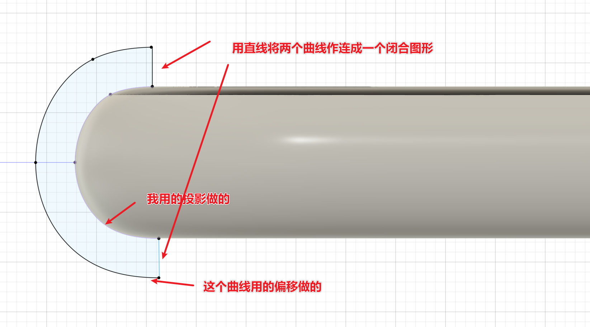
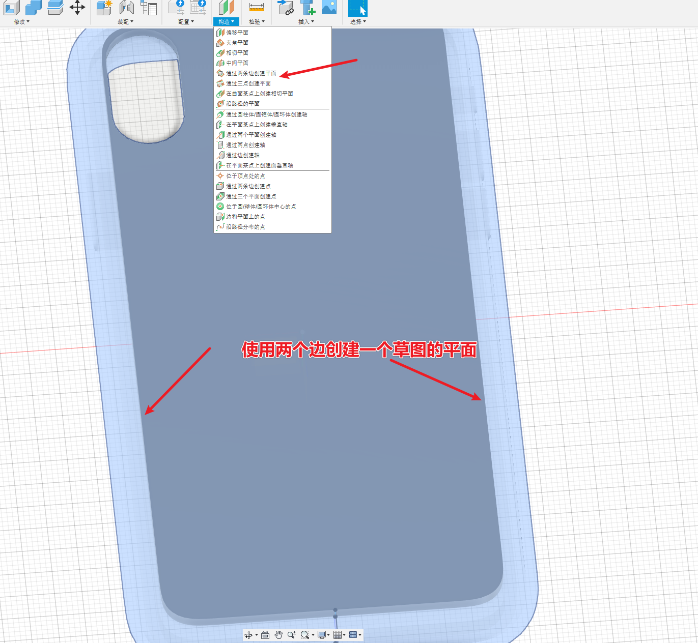
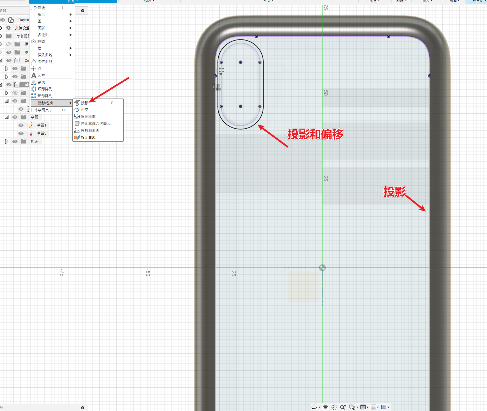
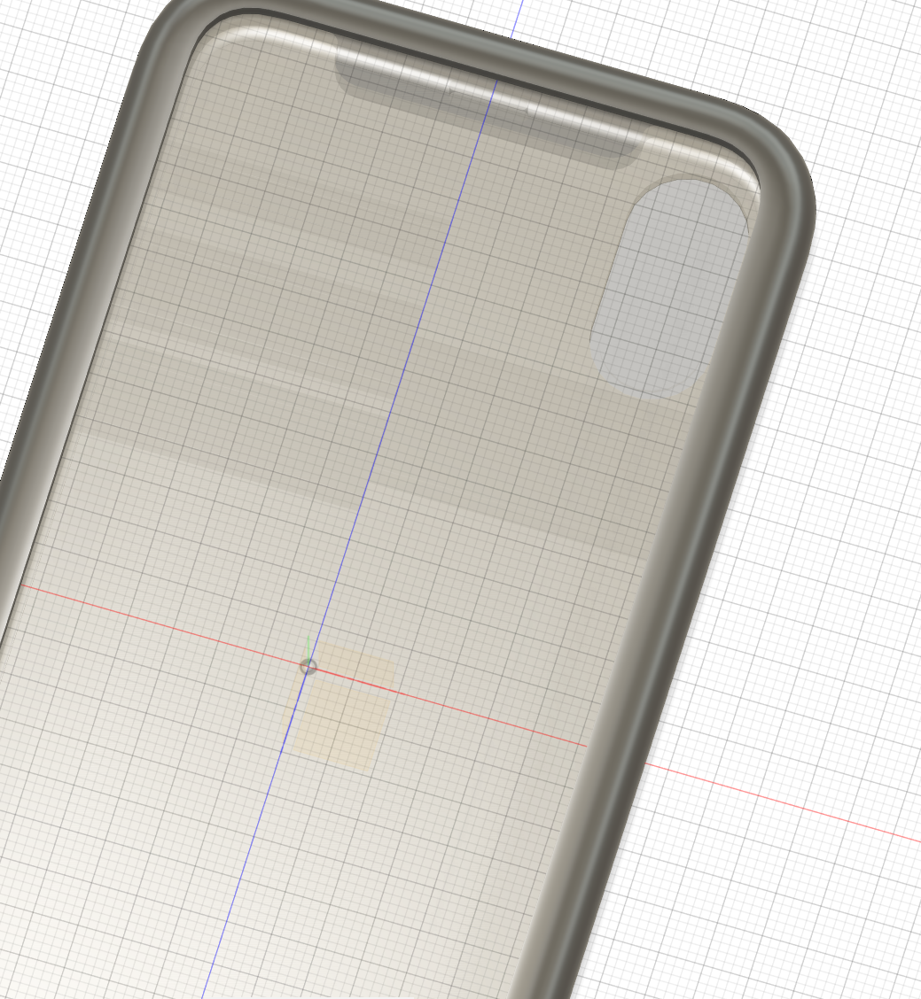

# 简介

根据B站的视频30天学会fusion 360 .这里针对每一个图纸的重点做一个记录。

参考https://www.bilibili.com/video/BV1UL4y177r8?spm_id_from=333.788.videopod.sections&vd_source=cde2e7b9bca1a7048a13eaf0b48210b6

# 手机壳

是根据手机的模型来做。

重要的步骤如下：

* 导入已有的手机模型
* 投影-偏移
* 扫掠
* 

## 导入手机模型

https://a360.co/3lDIDDh

导入后需要在零件中打开“捕获设计历史”。否则新建的零部件都没有历史记录

参考https://www.autodesk.com.cn/support/technical/article/caas/sfdcarticles/sfdcarticles/CHS/How-to-turn-on-Design-History-in-Fusion-360.html

## 扫掠

用到了投影和偏移

沿着手机外围曲线扫掠后得到手机壳外围的边框。

## 通过两条边创建平面

## 投影

## 拉伸

# 成品图

# 附录

* [如何在 Fusion 中打开时间轴以捕获设计历史](https://www.autodesk.com.cn/support/technical/article/caas/sfdcarticles/sfdcarticles/CHS/How-to-turn-on-Design-History-in-Fusion-360.html) 