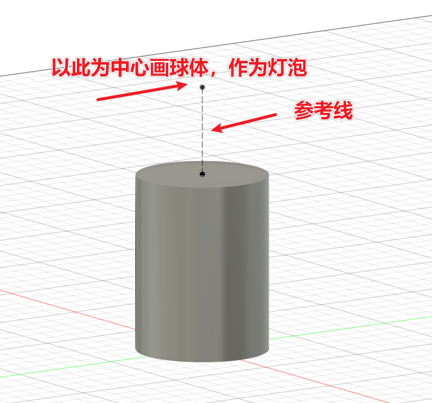
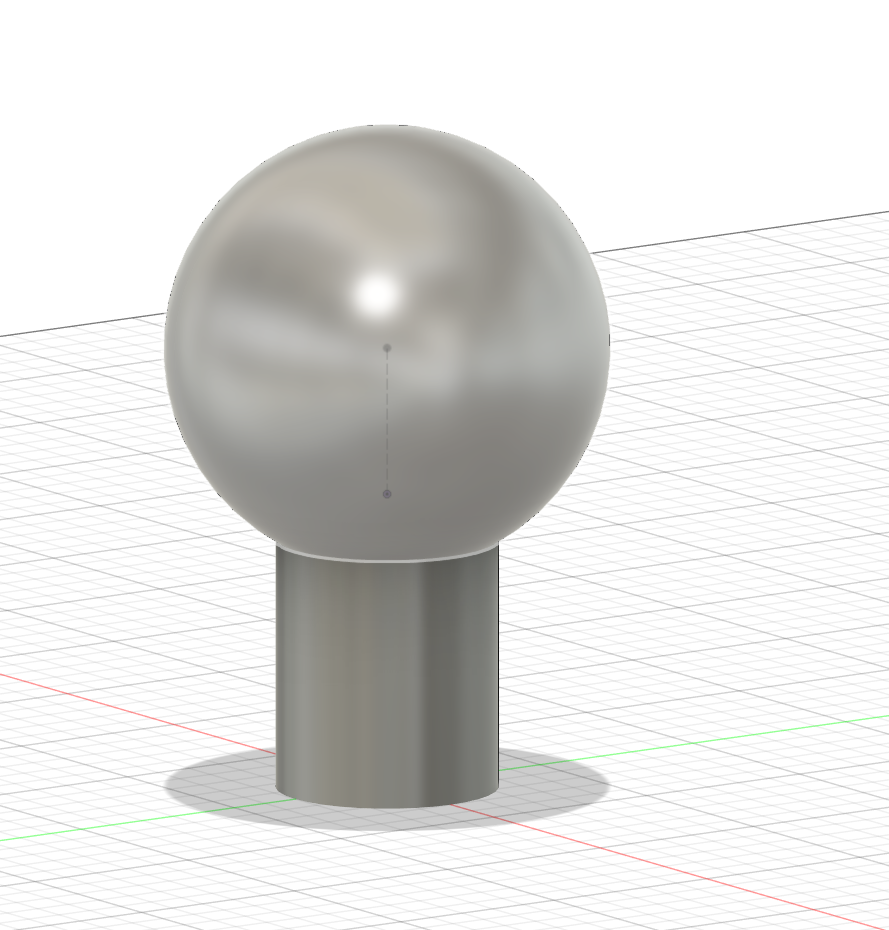
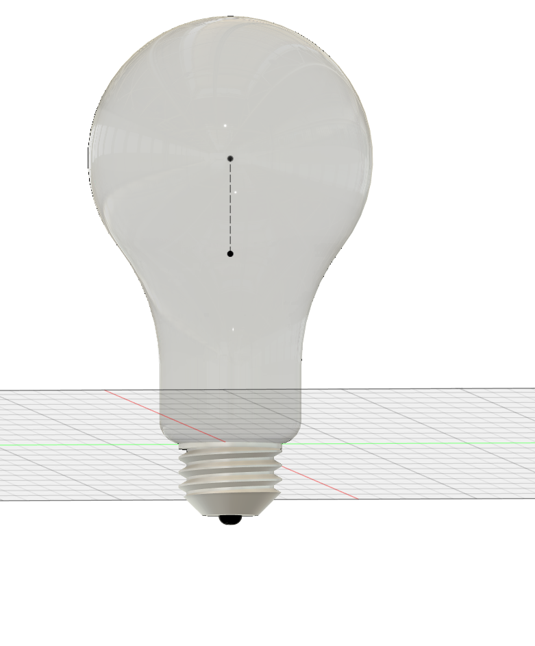
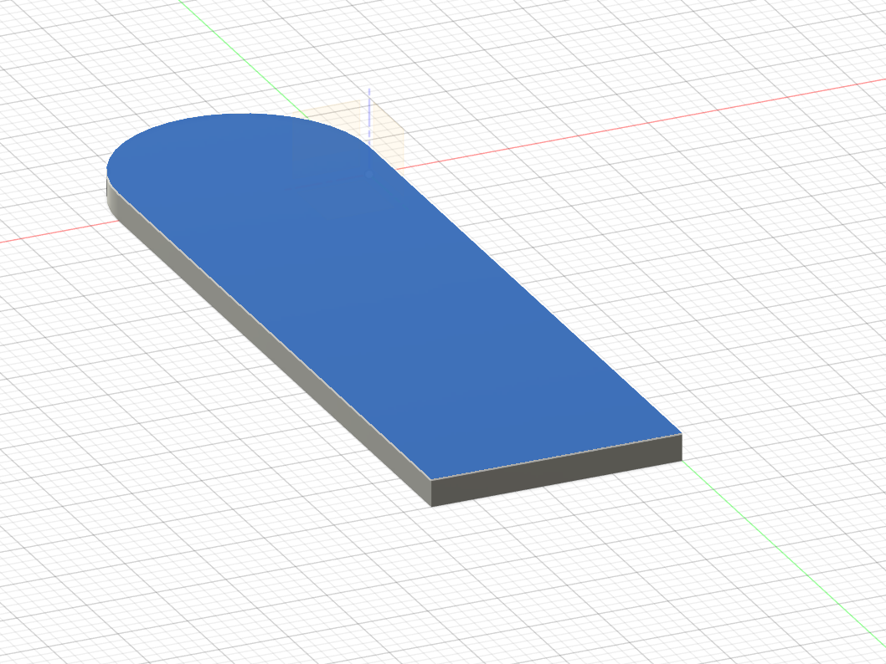
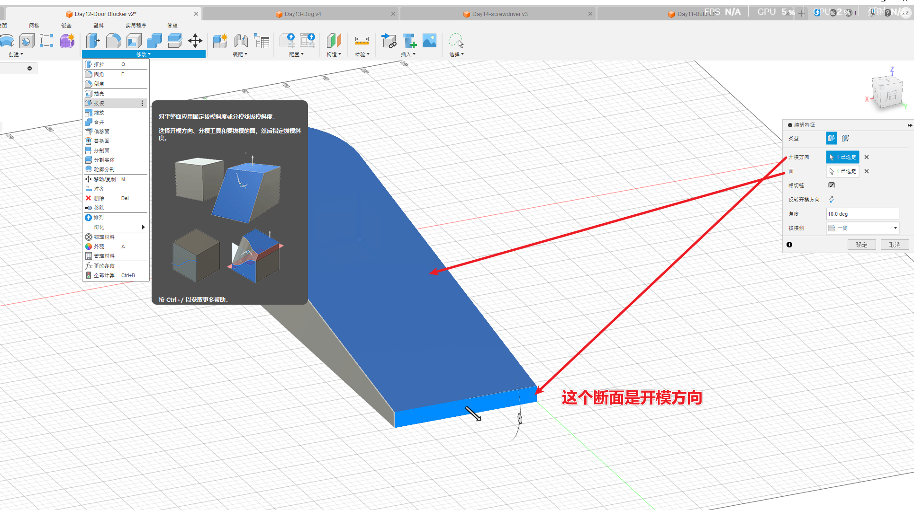
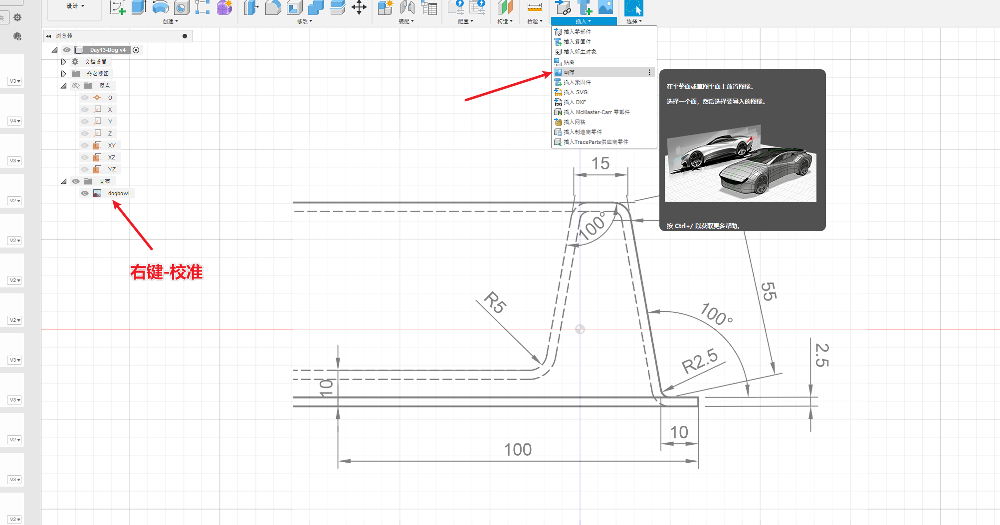
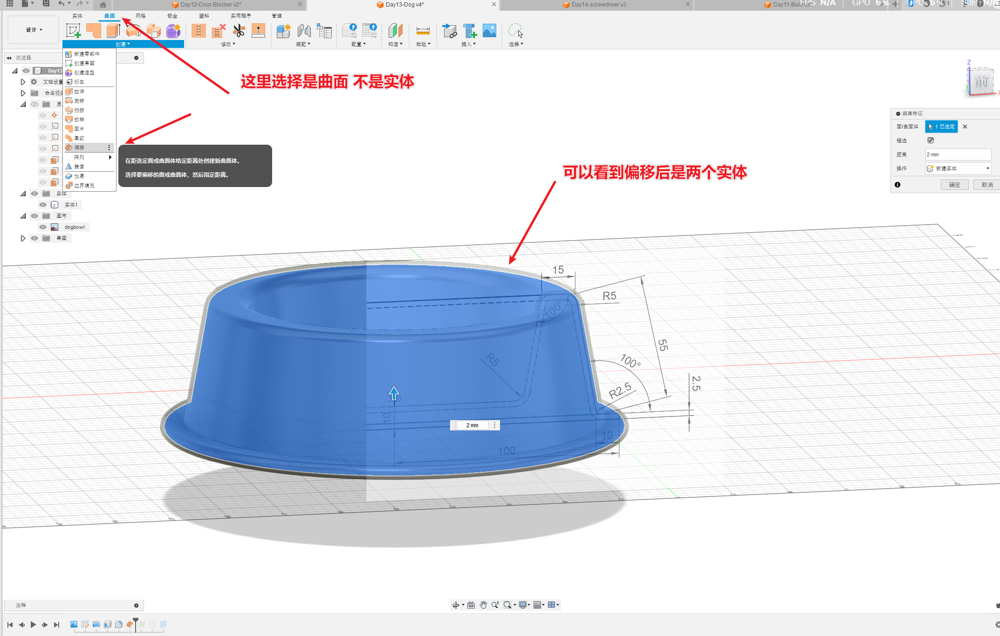
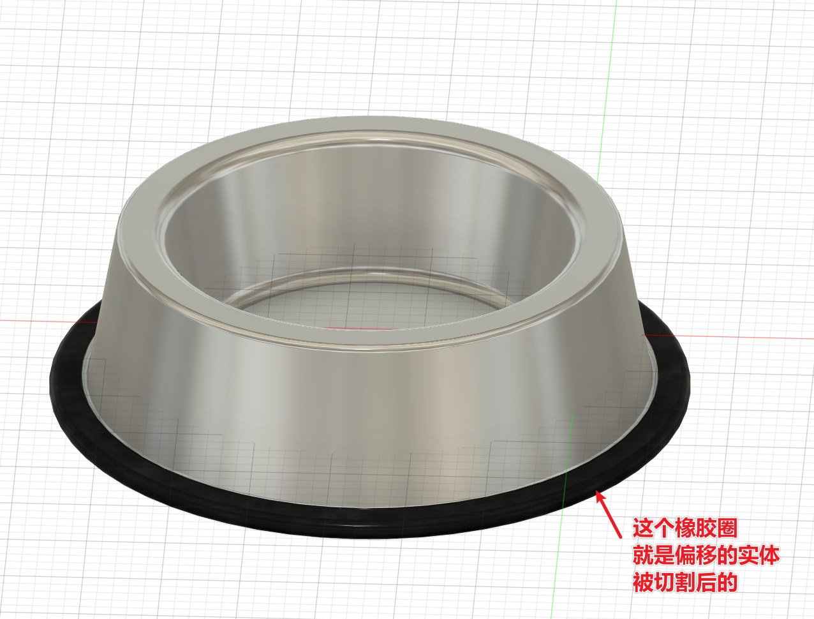
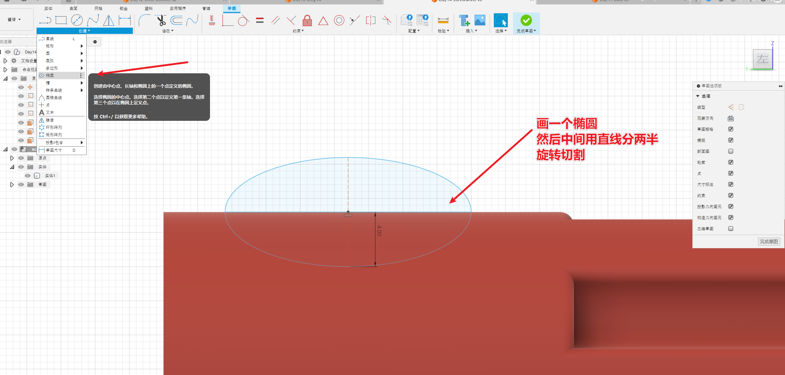
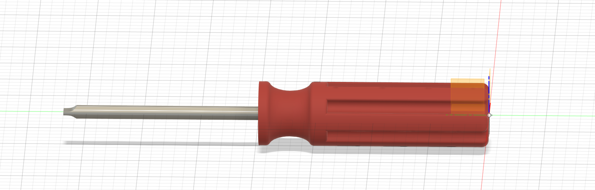

# 简介

根据B站的视频30天学会fusion 360 .这里针对每一个图纸的重点做一个记录。

参考https://www.bilibili.com/video/BV1UL4y177r8?spm_id_from=333.788.videopod.sections&vd_source=cde2e7b9bca1a7048a13eaf0b48210b6

因为这几天的内容相对简单一些，对软件也有了一定的认识了，因此只记录没使用过的功能部分

# Day11 灯泡

这次新使用的功能就是使用参考线作为绘制草图的一个基准。

其他的都比较简单了 

看成品

# Day12 阻门器

这一节主要新学了一个 拔模

## 修改-拔模

# Day13 狗盆

这一节主要是新学一个 曲面-偏移

首先插入图纸  插入-画布  右键校准

# Day14 螺丝刀

这一节新学的是草图中的椭圆

