# 简介

根据B站的视频30天学会fusion 360 .这里针对每一个图纸的重点做一个记录。

参考https://www.bilibili.com/video/BV1UL4y177r8?spm_id_from=333.788.videopod.sections&vd_source=cde2e7b9bca1a7048a13eaf0b48210b6

同样只记录之前没有学到的问题

# 三角体

新的内容是 

* 修改-更改参数：主要的作用是如果构建的实体都是和这个自定义的参数有关的话，可以直接修改这个参数对整体的进行缩放修改。一次修改到位
* 约束：如果草图中都是蓝色线，那么就是没有约束（有约束就是需要使用尺寸来修改，不能随便拖动修改），如果是黑色线就是约束了。如果草图中都是约束的，那么草图会显示一个🔒的图标。
* 抽壳-目标对象。可以不使用距离，使用目标对象 来决定抽壳多少

## 修改-更改参数

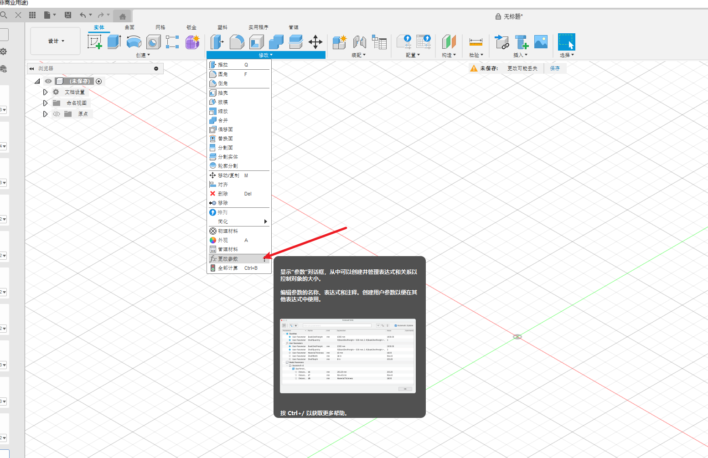

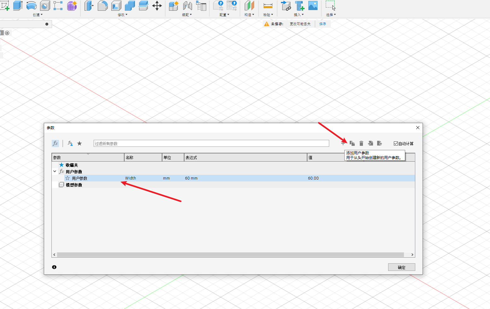

使用直线工具画一个三角形

使用约束-相等  选三条边

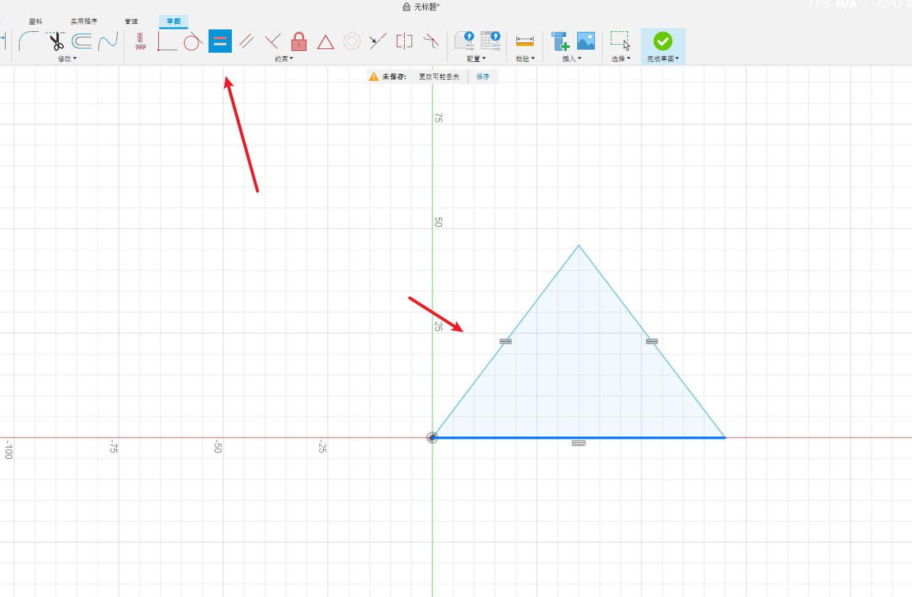

使用草图尺寸固定一条边长为刚才的自定义参数 width  那么三角形就会全部变为黑色，草图都已经约束如下

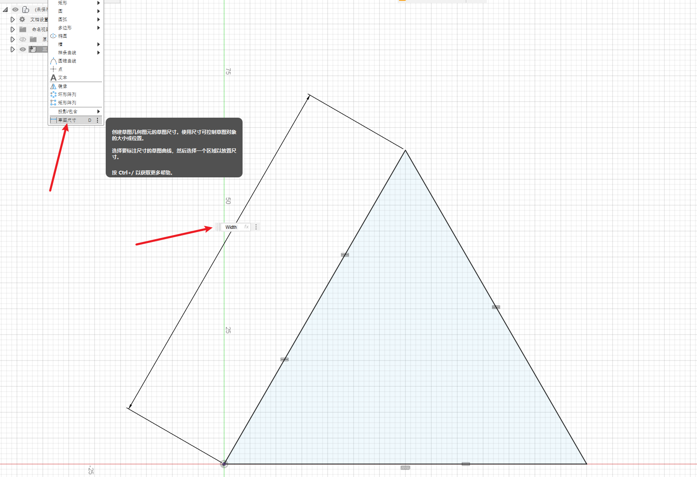

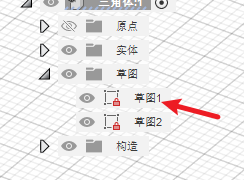

偏移平面为width  绘制参考线 绘制点 ，放样

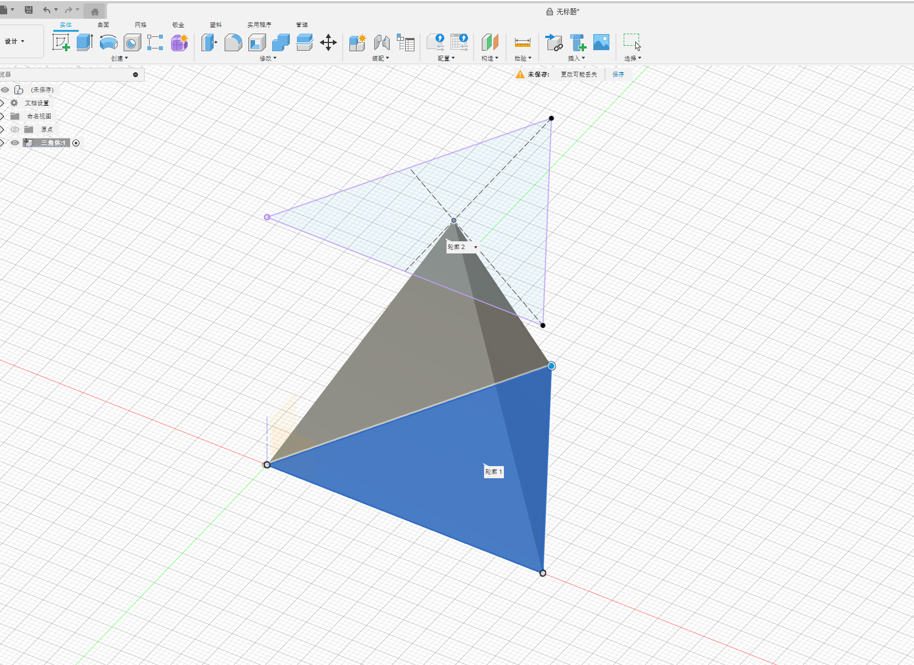

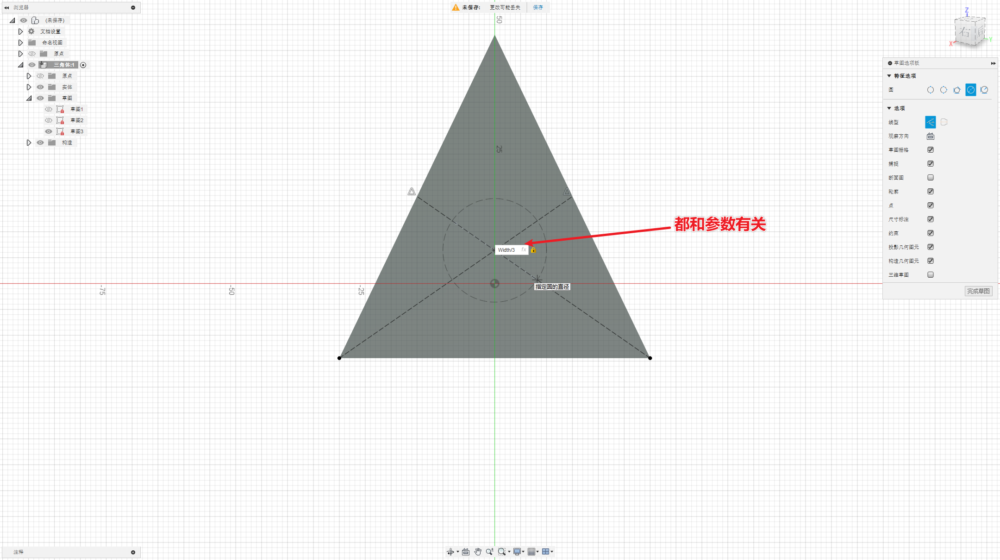

## 抽壳-目标对象

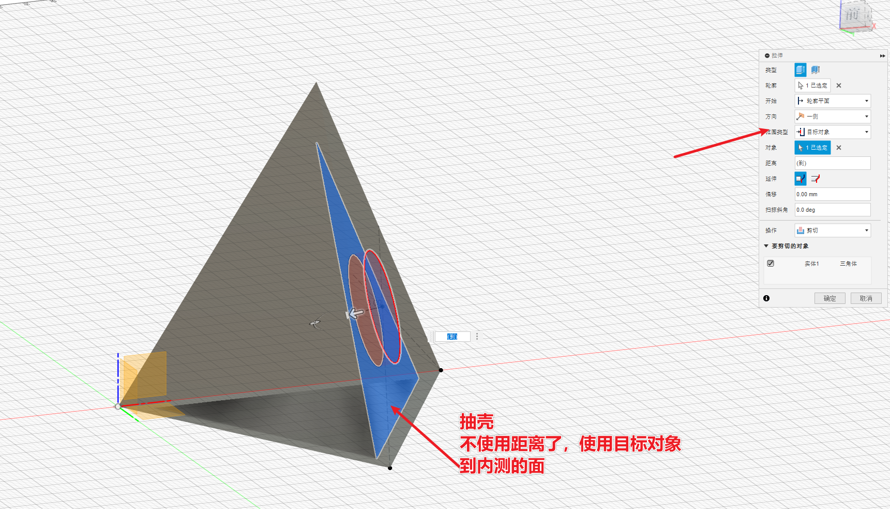

## 构造-中间平面

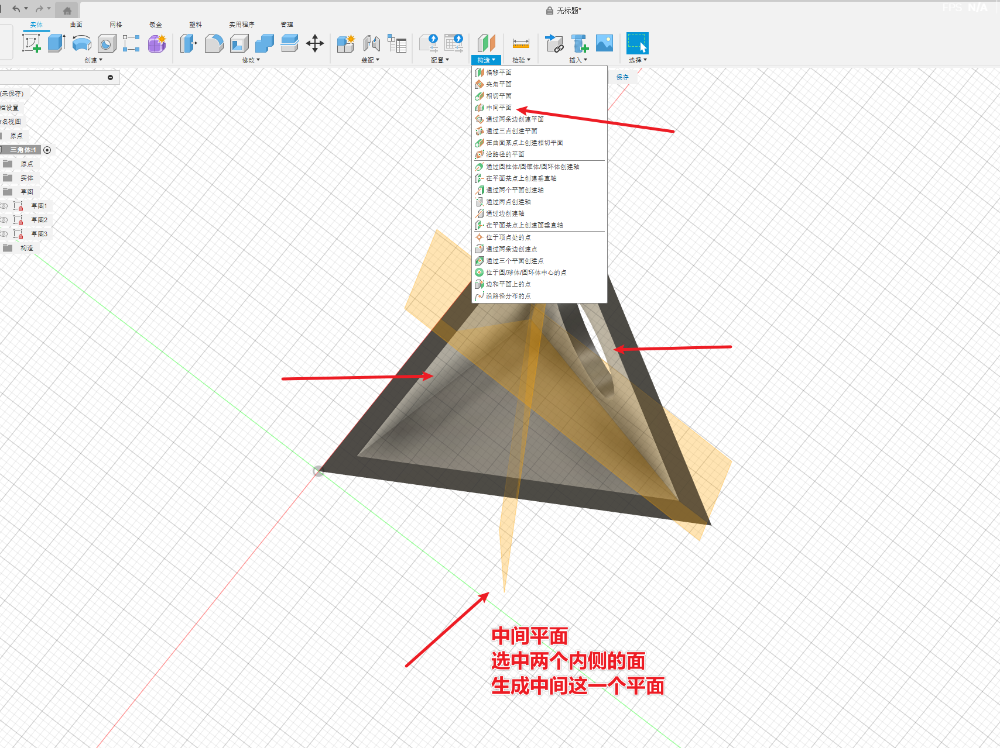

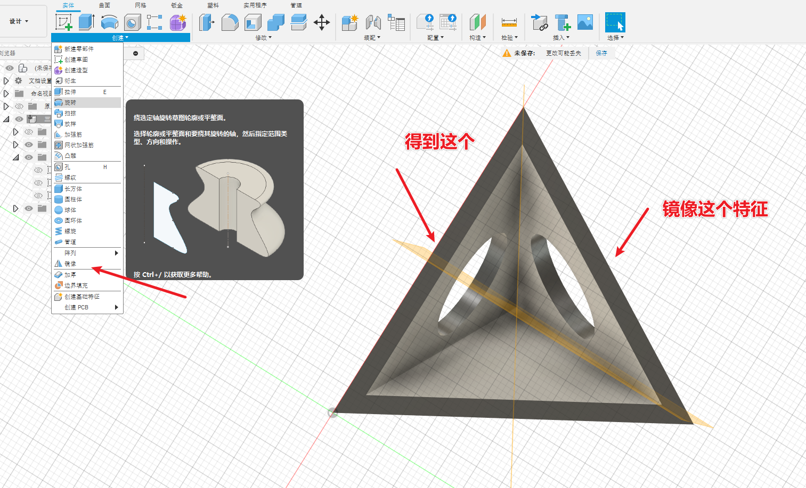

# 成品图

可以修改-更改参数 来缩放整体的大小了

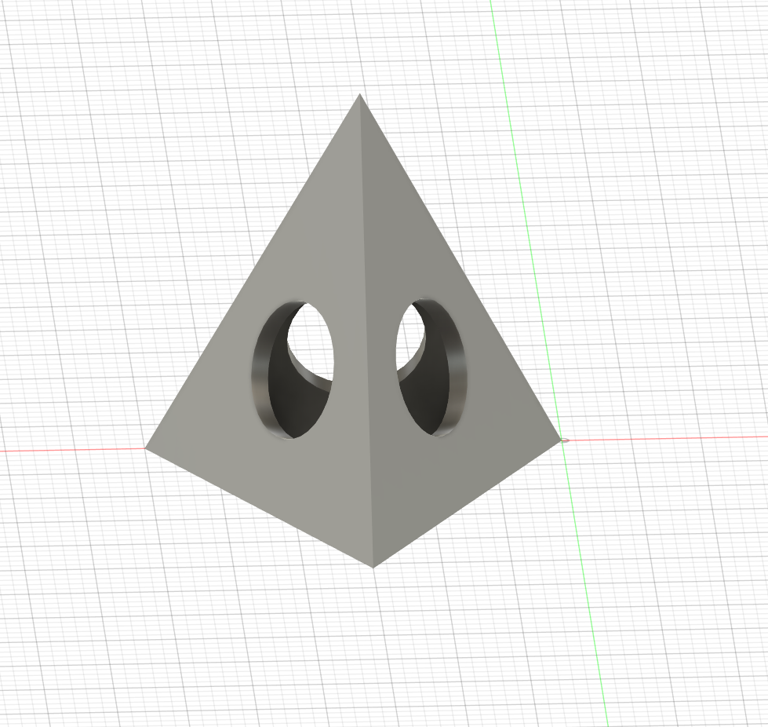