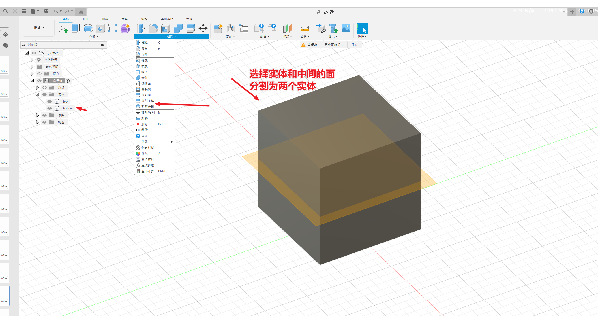
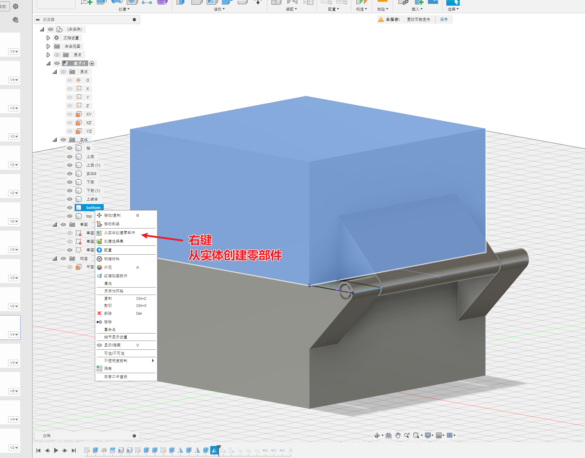
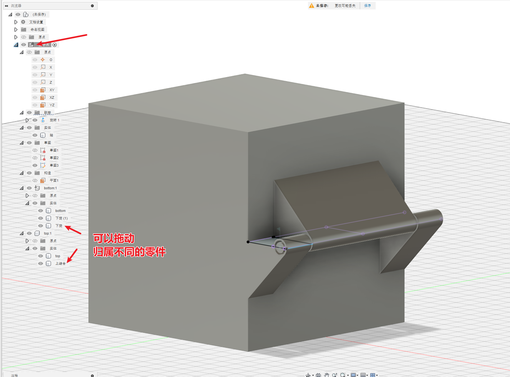
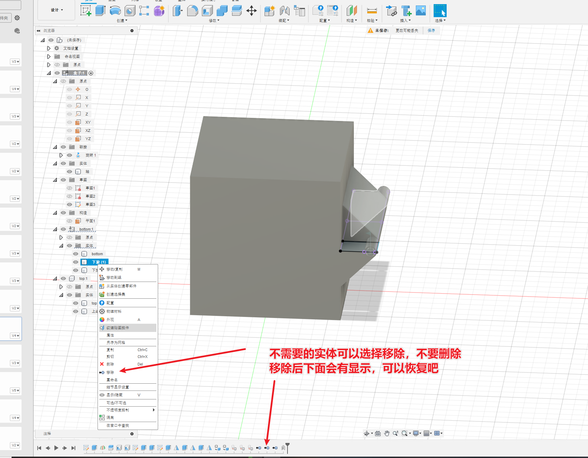
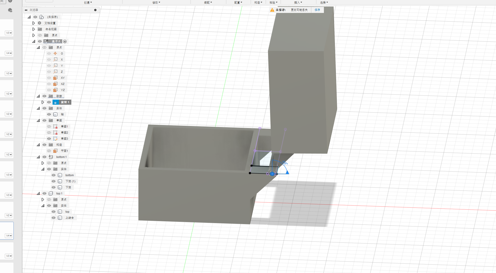

# 简介

根据B站的视频30天学会fusion 360 .这里针对每一个图纸的重点做一个记录。

参考https://www.bilibili.com/video/BV1UL4y177r8?spm_id_from=333.788.videopod.sections&vd_source=cde2e7b9bca1a7048a13eaf0b48210b6

同样只记录之前没有学到的问题

# 盒子

* 修改-分割实体：将一个实体分为两个
* 从实体创建零部件：创建零部件是为了区分上下盒子是不同的零件。不同的零件才能做联接动画
* 实体可以有多个零件组成
* 实体-移除：可以不删除，但是移除实体

## 修改-分割实体

## 从实体创建零件

## 实体-移除

# 成品图

