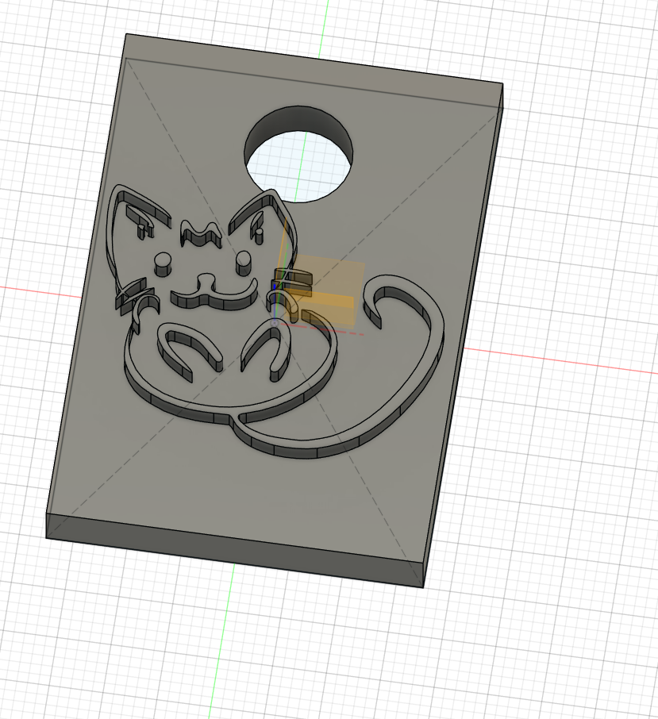
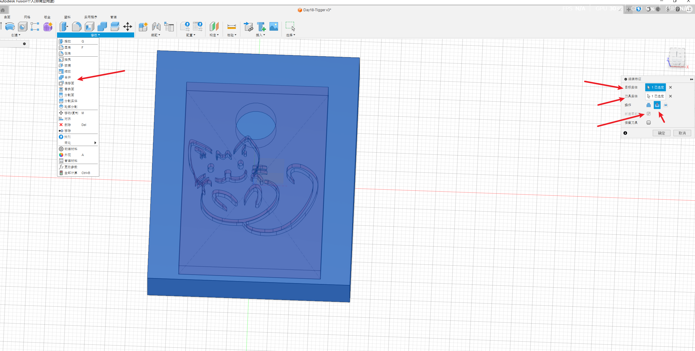
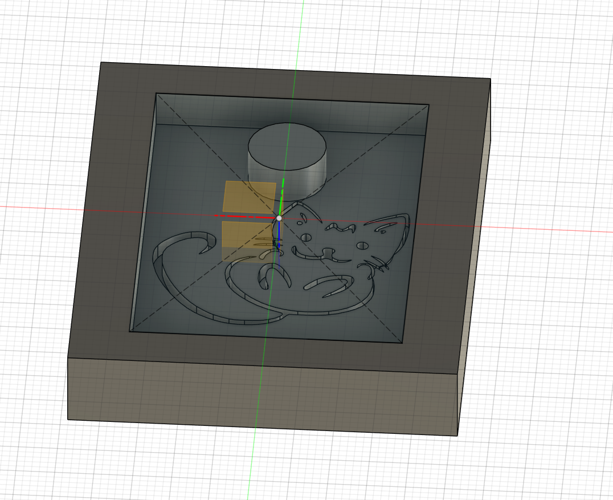

# 简介

根据B站的视频30天学会fusion 360 .这里针对每一个图纸的重点做一个记录。

参考https://www.bilibili.com/video/BV1UL4y177r8?spm_id_from=333.788.videopod.sections&vd_source=cde2e7b9bca1a7048a13eaf0b48210b6

同样只记录之前没有学到的问题

# 虎符

主要是制作一个模具

* 修改-合并

先制作一个虎符，然后制作虎符的模具

制作虎符比较简单，拉一个长方体，插入svg，拉伸

## 修改-合并

拉一个比上图大一点的长方体，使用修改-合并 制作一个模具

# 实体图

