# 简介

根据B站的视频30天学会fusion 360 .这里针对每一个图纸的重点做一个记录。

参考https://www.bilibili.com/video/BV1UL4y177r8?spm_id_from=333.788.videopod.sections&vd_source=cde2e7b9bca1a7048a13eaf0b48210b6

同样只记录之前没有学到的问题

# 甜甜圈

这一节主要是从别人的3d设计生成一个模具

* 导入别人的设计-右键-捕获设计历史
* 不透明度

## 捕获设计历史

如果是修改别人的设计，需要 右键-捕获设计历史。这样才能在下方有设计的历史

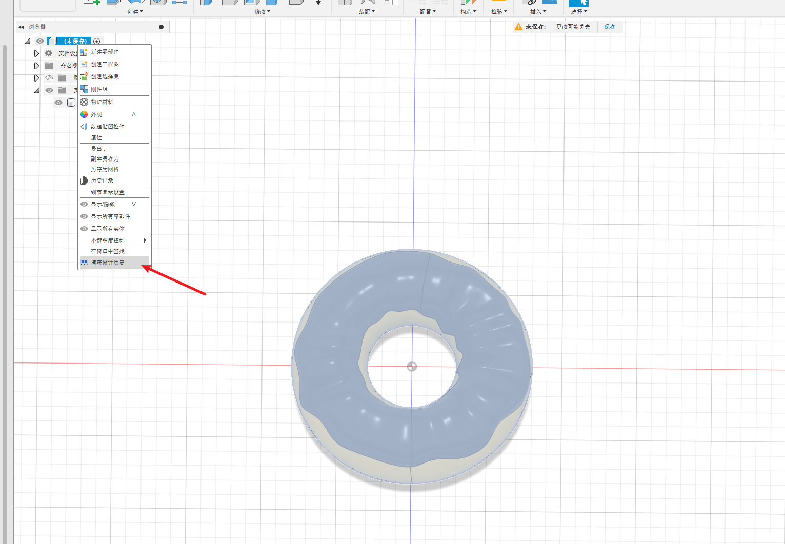

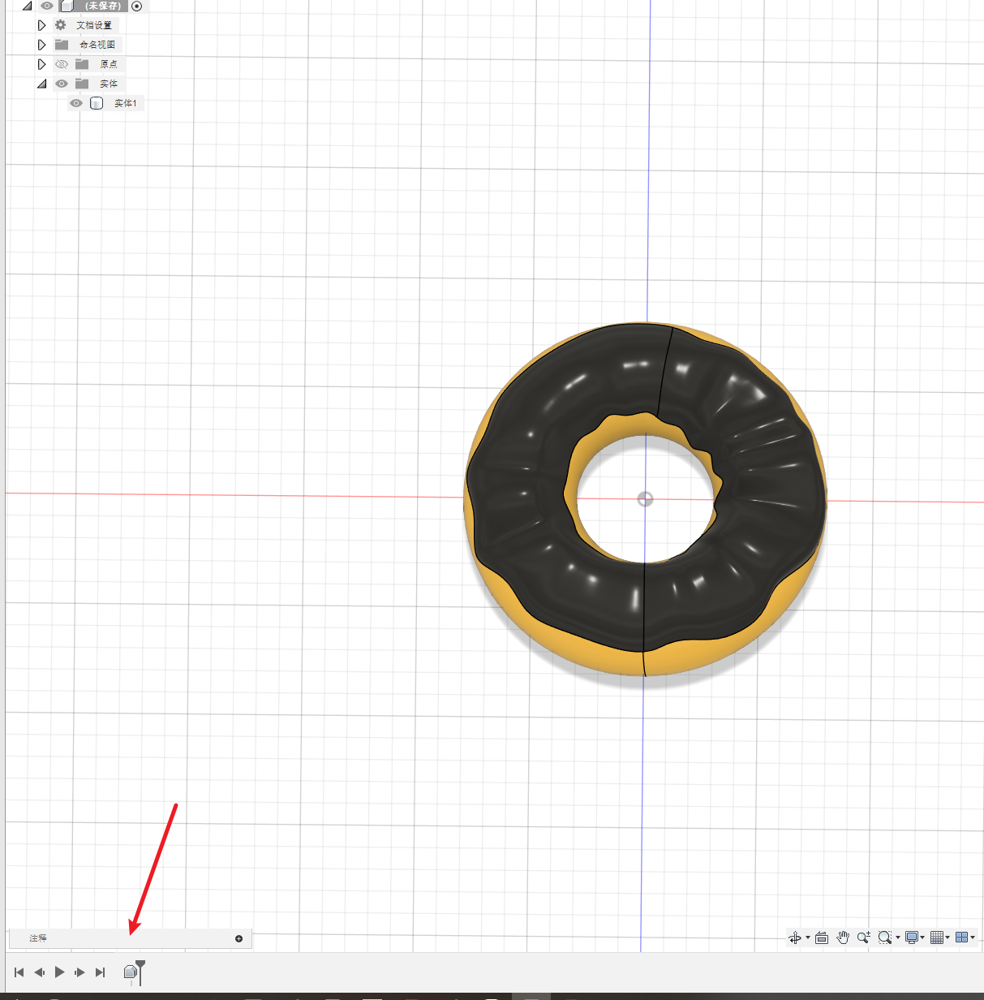

## 不透明度

可以方便查看两个重合的实体

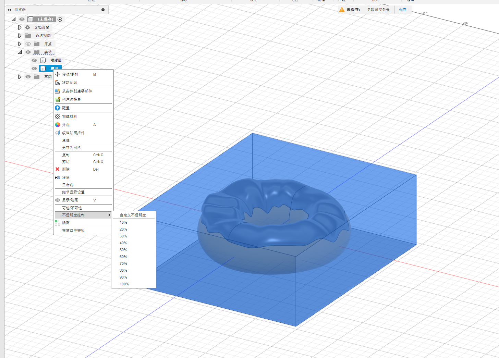

## 修改-合并

和上一节一样，使用这个命令来做模具

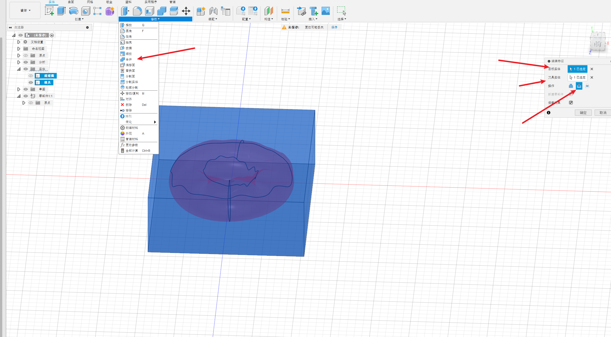

## 截面分析

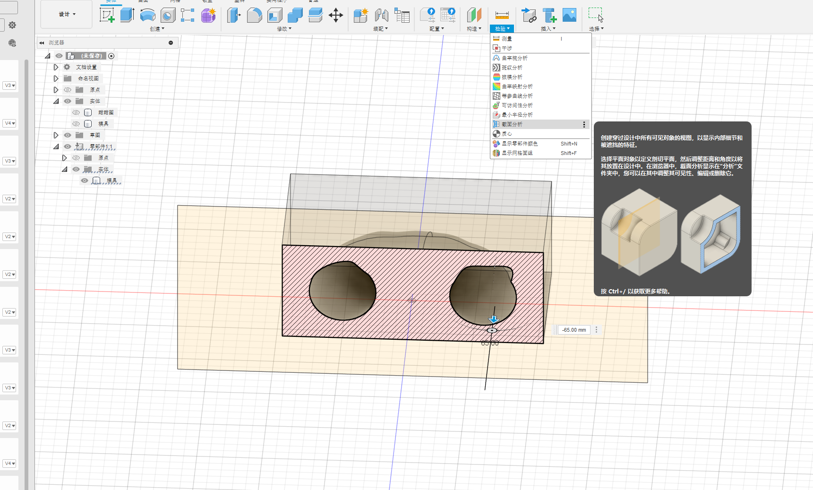

## 分割实体

将这个分为上下两半

先做一个参考面 

构造-中间平面。

然后

修改-分割实体

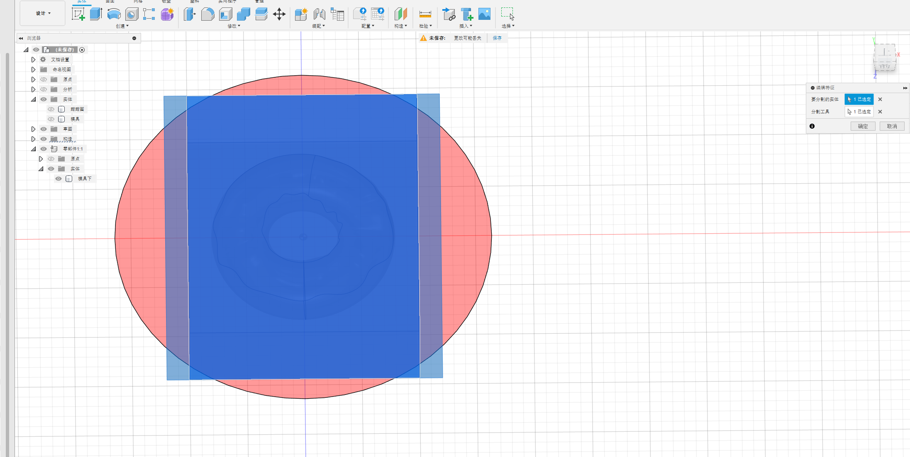

## 添加定位孔

为了上下模具可以对齐，添加定位孔。还是用到修改-分割

在下main的模具上添加两个圆

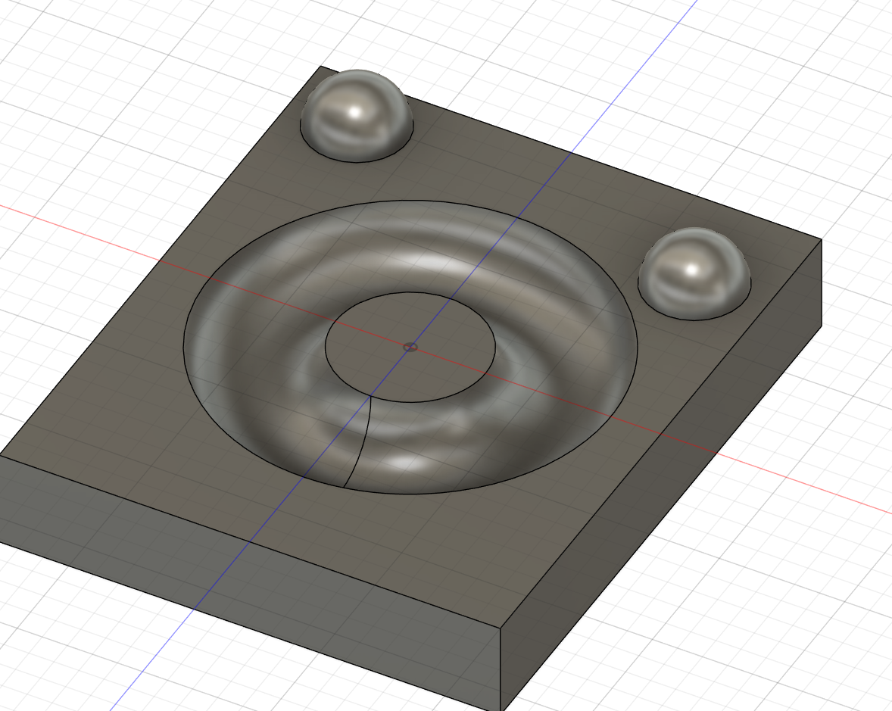

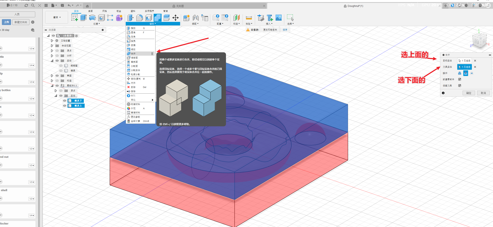

截面分析如下

但是怎么引入误差我还不清楚，上下都是相同的尺寸的话3D打印的误差存在，肯定是对不上的。

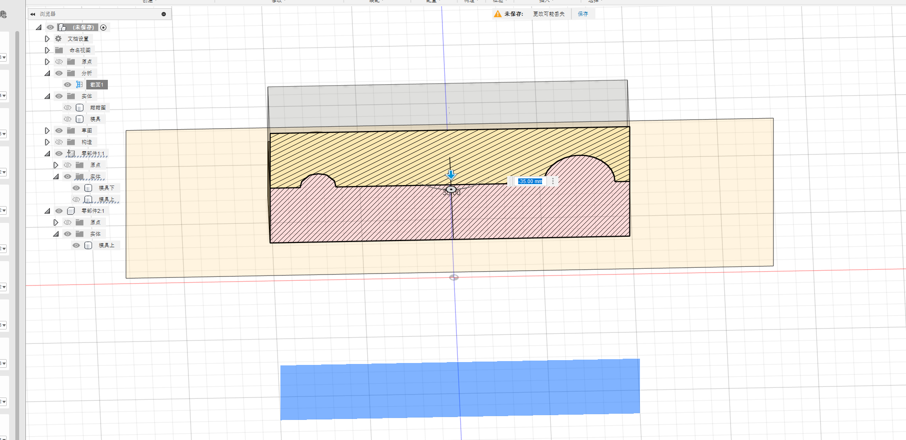

## 偏移

我在网上看到的，不知道对不对，如果使用偏移来控制装配的误差

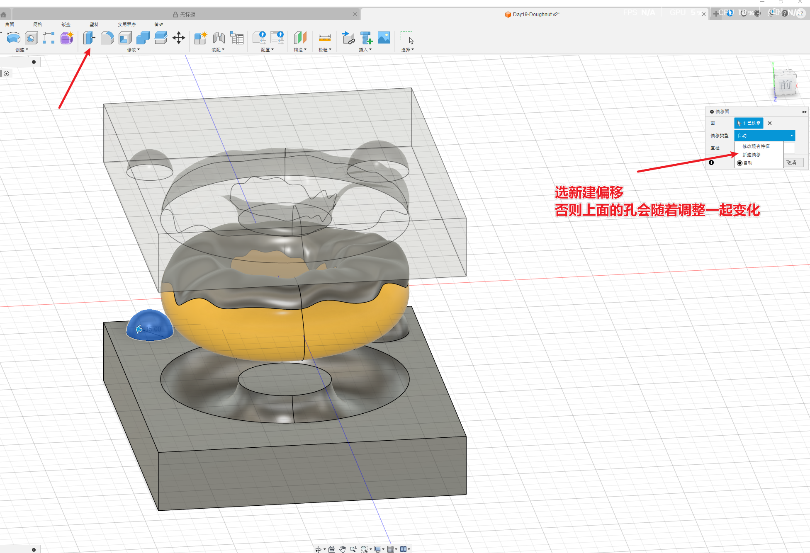

### 成品图

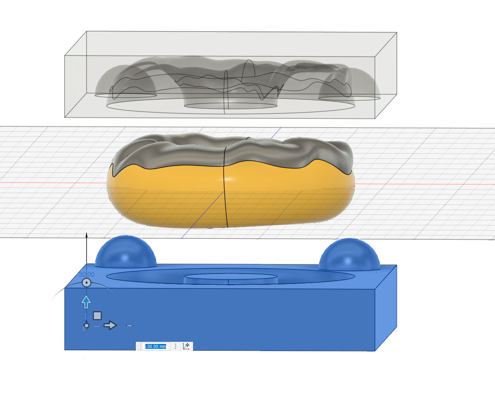