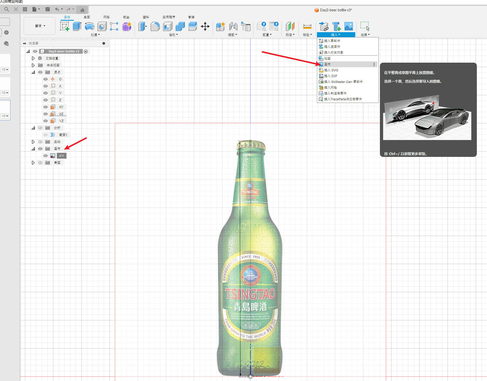
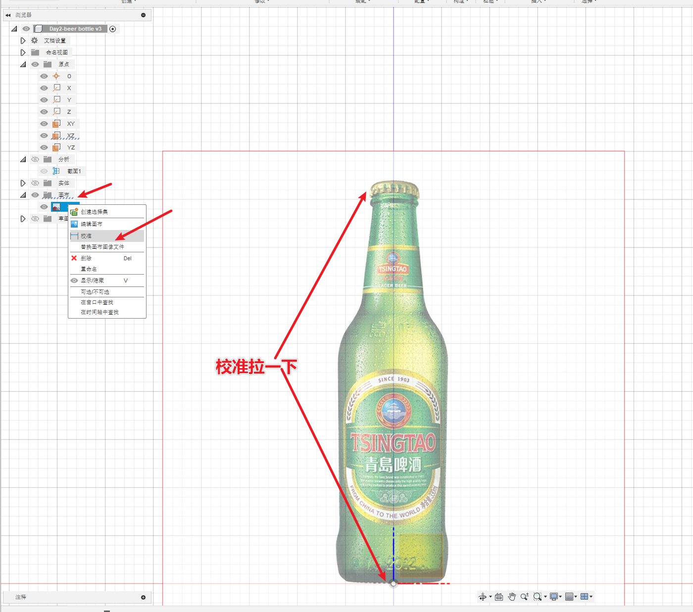
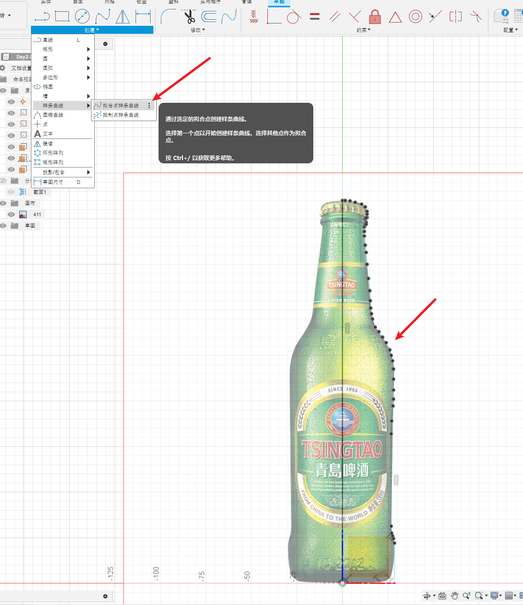
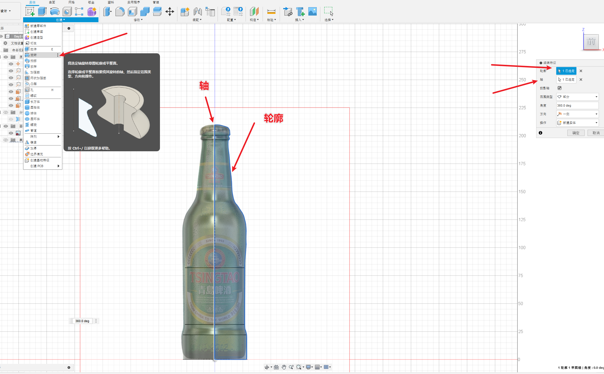
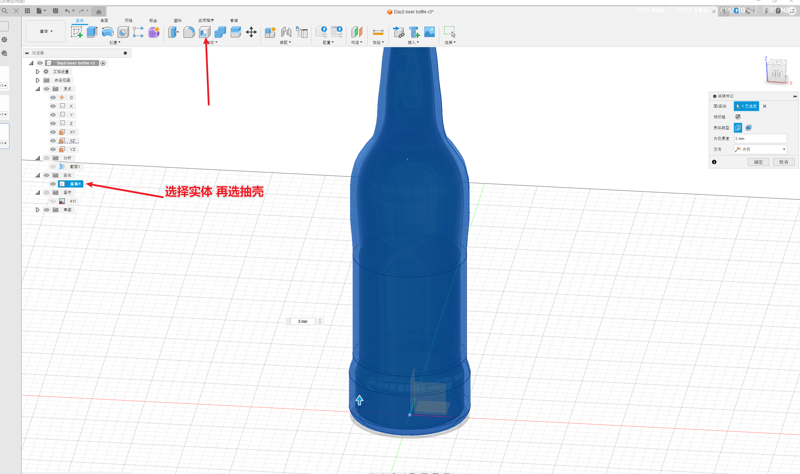
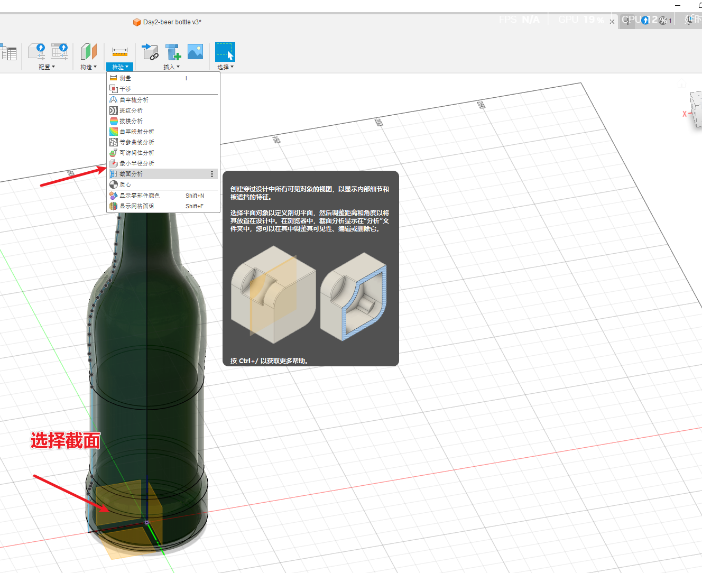
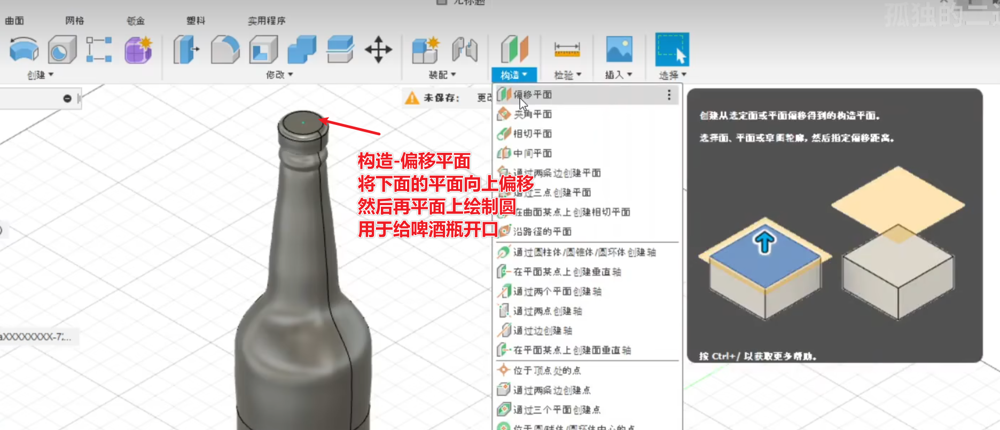
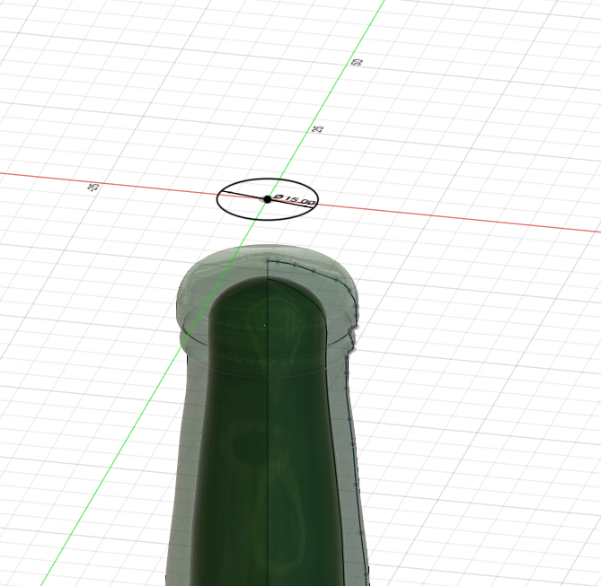
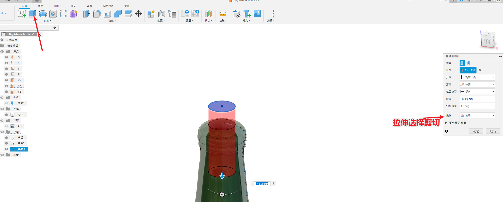
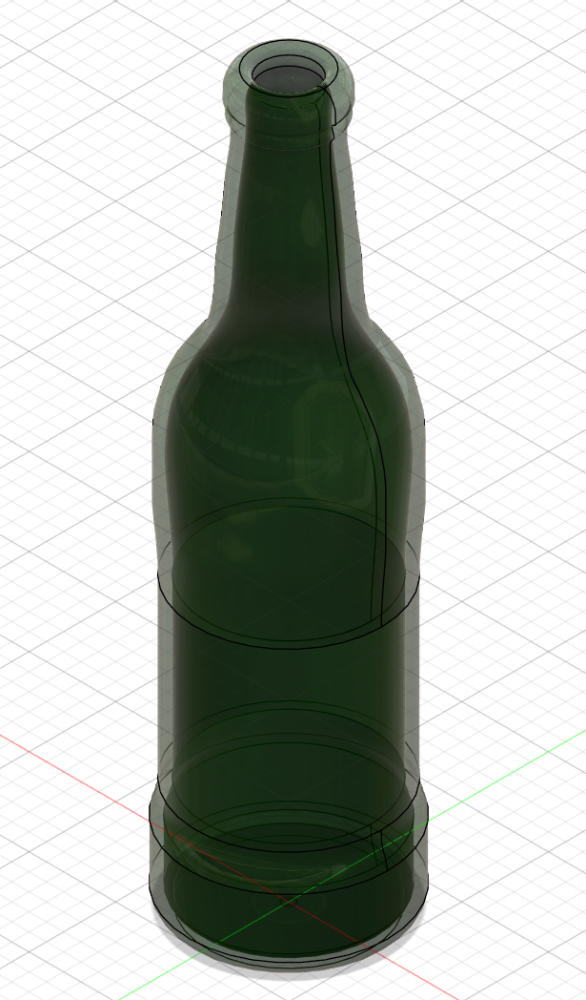

# 简介

根据B站的视频30天学会fusion 360 .这里针对每一个图纸的重点做一个记录。

参考https://www.bilibili.com/video/BV1UL4y177r8?spm_id_from=333.788.videopod.sections&vd_source=cde2e7b9bca1a7048a13eaf0b48210b6

# 啤酒瓶

主要是根据现有的图片来绘制

重要的步骤：

* 插入画布
* 画布的校准
* 旋转
* 实体的抽壳
* 偏移平面
* 拉伸剪切

插入画布

画布校准

创建直线

创建拟合样条曲线，和直线一起围成一个封闭的面

旋转

实体的抽壳

检查抽壳是否成功，截面分析

偏移平面

拉伸剪切

# 成品图

