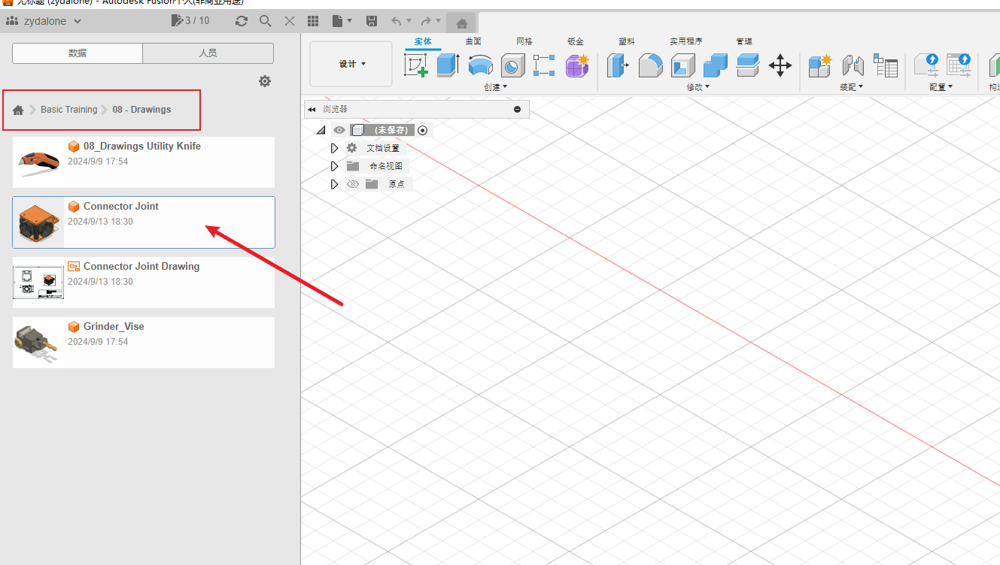
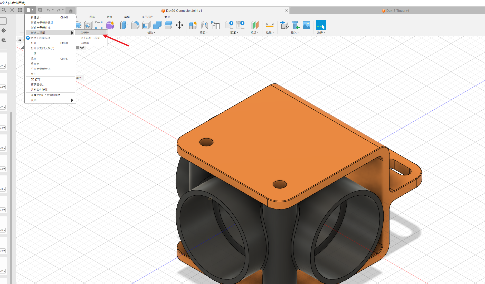
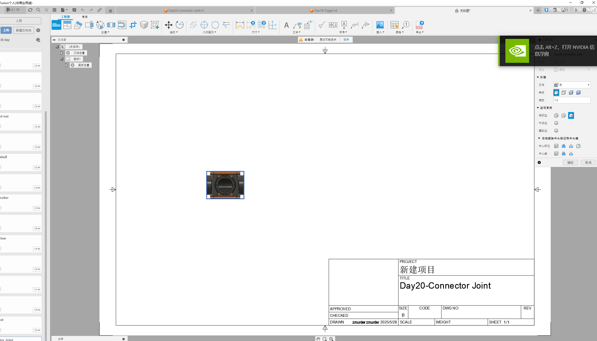
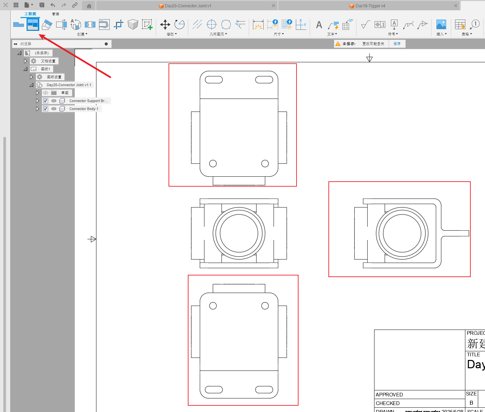
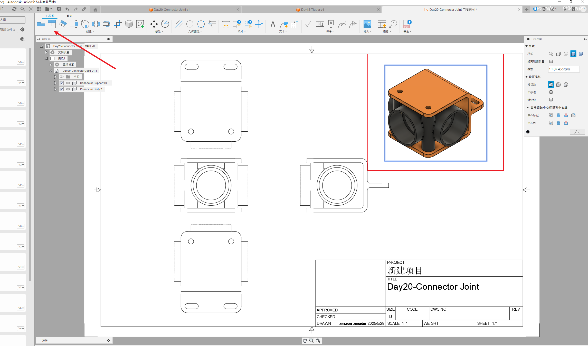
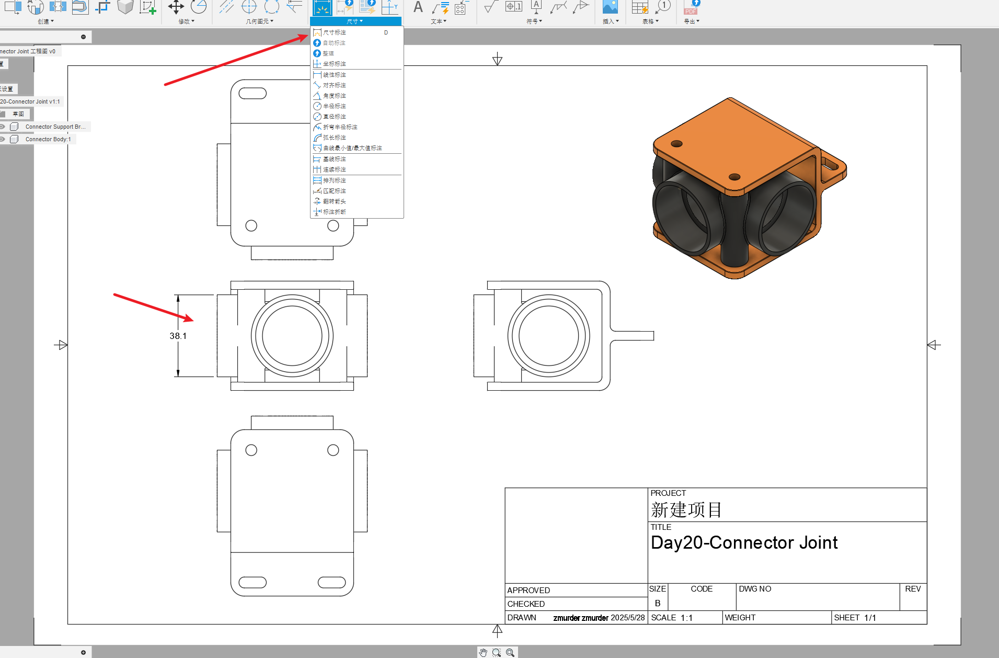
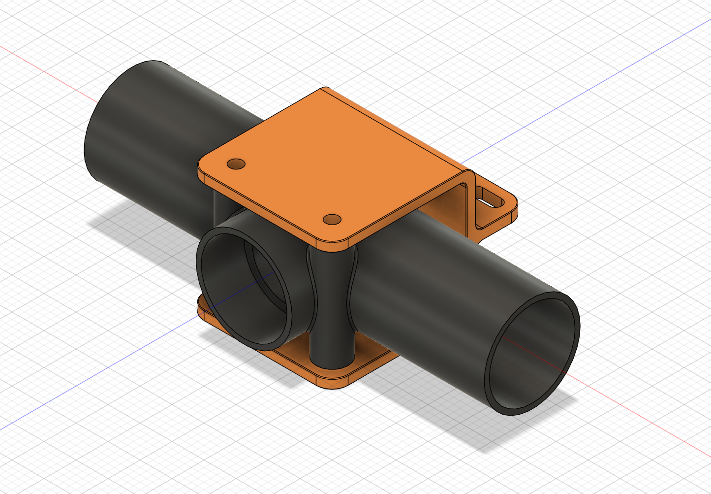
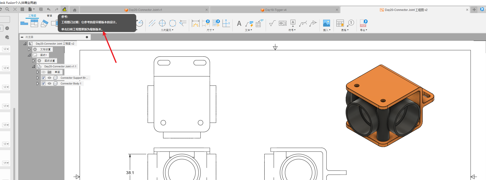
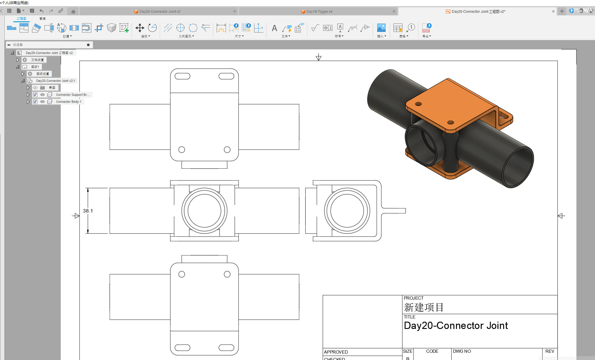

# 简介

根据B站的视频30天学会fusion 360 .这里针对每一个图纸的重点做一个记录。

参考https://www.bilibili.com/video/BV1UL4y177r8?spm_id_from=333.788.videopod.sections&vd_source=cde2e7b9bca1a7048a13eaf0b48210b6

同样只记录之前没有学到的问题

# 工程图

这一节主要是从一个现有的3D设计生成对应的2D工程图，就像工程制图那样的

* 打开fusion 360 自带的一个例子
* 文件-新建工程图-从设计
* 投影视图
* 尺寸标注
* 3D模型与图纸的联动

## 打开fusion 360 自带的一个例子

为了可以编辑我们需要存备份到自己的学习目录中。

## 新建工程图

## 投影视图

就像工程制图一样，可以画出三视图

也可以拉一个侧面的实物，看着方便

## 尺寸标注

这里面可以选择 标注圆啊什么的，方便选取

## 3D模型与图纸的联动

如果3D模型修改了，是可以联动到2D工程视图的

例如我修改了3D如下

那么在工程图中会提示，双击即可更新

