# 新的操作

* 打开stl格式的文件：插入-插入网格
* 网格选项中：修改-转换网格-操作：基础特征

# mash file

MESH 文件是一种 3D 模型文件格式，通常用于存储 3D 对象，包括曲面和体积网格，以及非均匀有理 B 样条 (NURBS) 曲面。MESH 文件格式通常用于科学和工程应用，因为它非常适合存储具有高度细节的复杂 3D 模型。

## STL 文件格式

**STL（Stereolithography 或 Standard Triangle Language/Format）** 是一种广泛用于3D打印、快速原型制作和计算机辅助制造的文件格式。**它通过三角形表面网格**来表示三维对象，非常适合描述复杂形状。

### 特点：

- **简单性**：STL文件主要由一系列三角形面片组成，每个面片定义了三个顶点的位置以及一个法向量，用来指示该面的方向。
- **无颜色或材质信息**：原始的STL格式不支持存储颜色、纹理或其他高级材质属性。
- **两种格式**：ASCII（文本格式）和二进制格式。ASCII格式更易于阅读但文件较大；二进制格式则更加紧凑，适合存储较大的模型。

### 应用场景：

- 广泛应用于3D打印领域，因为它能够准确地描述物体的外形。
- 也用于CAD软件中进行模型交换，尤其是在需要将设计转换为可打印对象时。

------

## OBJ 文件格式

**OBJ（Object File Format）** 是另一种流行的3D模型文件格式，最初由Wavefront Technologies开发。相比STL，OBJ文件可以存储更多的信息，如顶点坐标、面信息、纹理坐标和材质属性等。

### 特点：

- **丰富的几何描述**：除了顶点位置外，OBJ还支持法线、纹理坐标等数据，使得它可以更好地表示具有细节的对象。
- **多边形支持**：虽然最常见的是三角形，但是OBJ也可以包含四边形或多边形面。
- **外部材质文件**：通常与MTL（Material Template Library）文件一起使用，后者定义了模型使用的材质属性，包括颜色、透明度、反射率等。
- **文本格式**：OBJ文件是基于文本的格式，这使得它们相对容易阅读和编辑，但也可能导致文件体积较大。

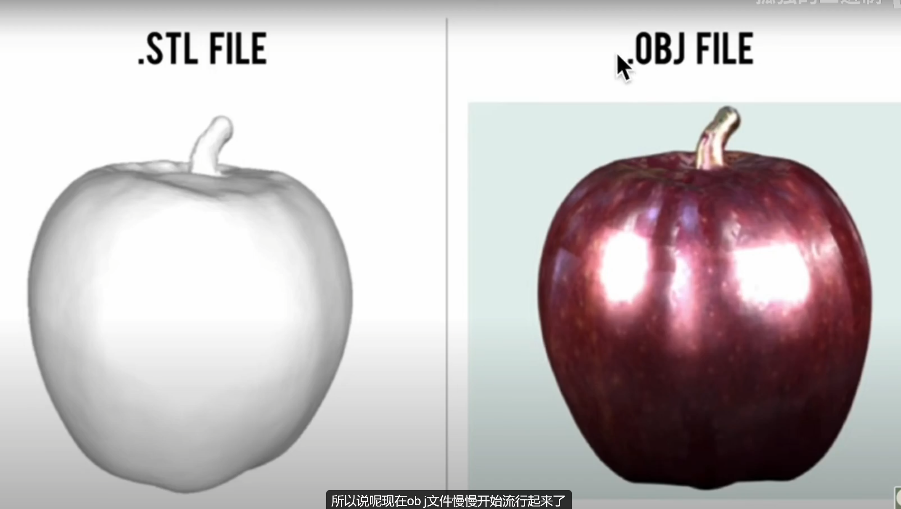

## fusion360支持的文件

假如网上有一个我们需要的stl文件，但是需要我们导入到fusion 360中进行修改编辑，是不能直接编辑的，因为是网状的文件.需要转换为一个实心的。

fusion 360支持的不是空心的模型，防水的（就是没有洞，不能进水）。我们下载的文件需要转换一下才能使用。

例如我们在网站下载一个stl文件（网状的，需要转换），

https://www.thingiverse.com/thing:2672188/files

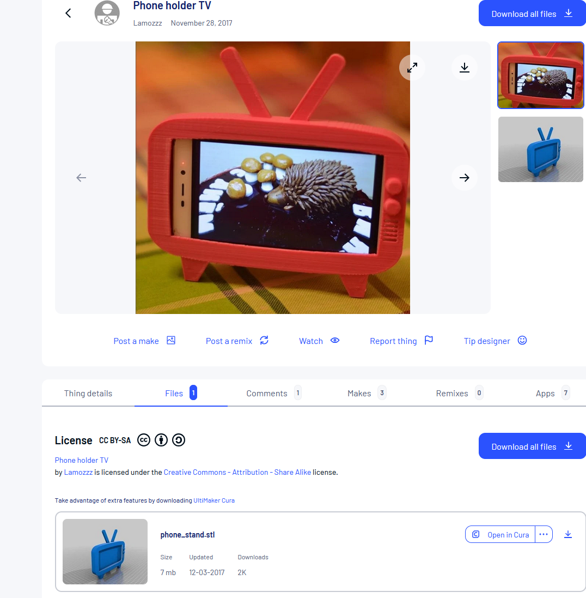

## 打开stl文件

插入-插入网格

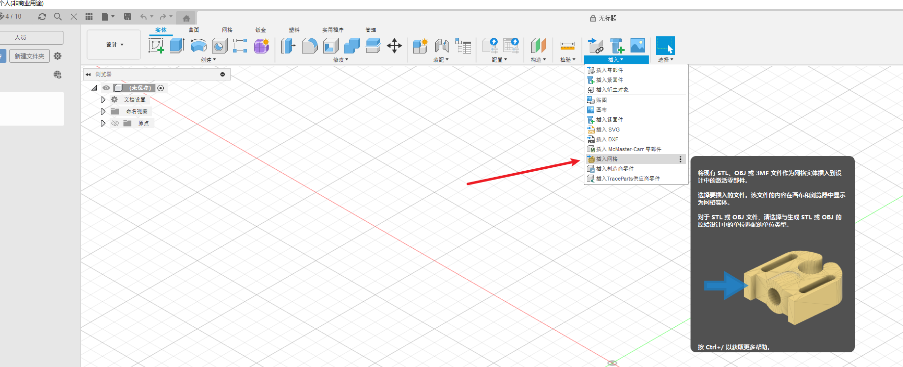

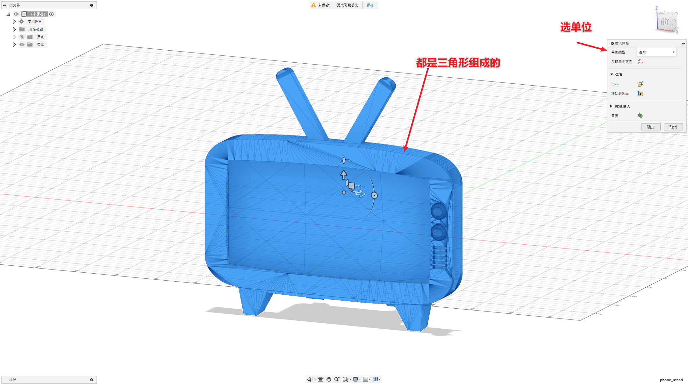

### 修改-转换网格

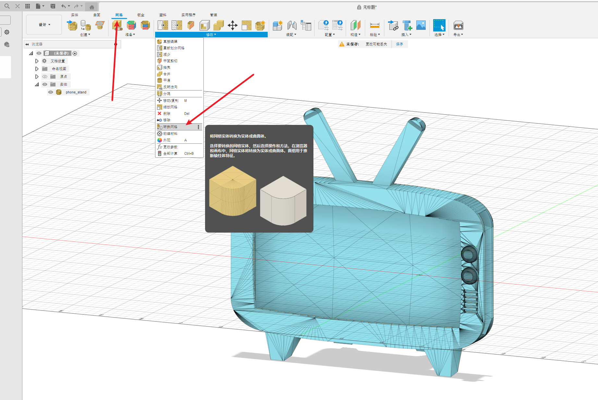

这时提示了一个警告，三角形超过了1w个。

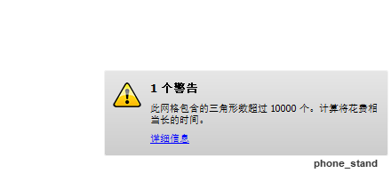

参数化：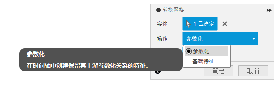

基础特征：不保留原始的，更快，我们选择这个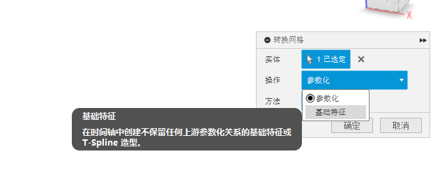

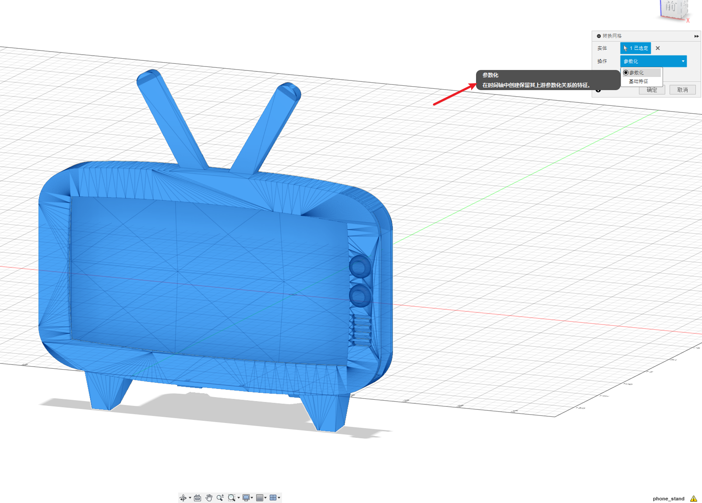

转换完成后会有一个实体，但是还有很多的三角面，没有组合到一个面中。因为我们是免费版本的。

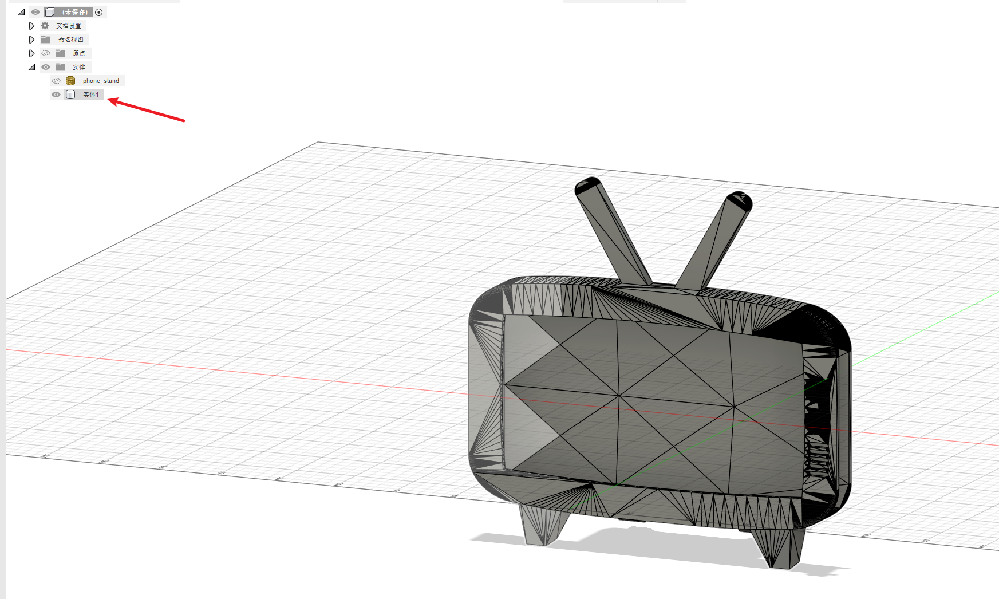

需要手动修复一下。选择一个面，删除

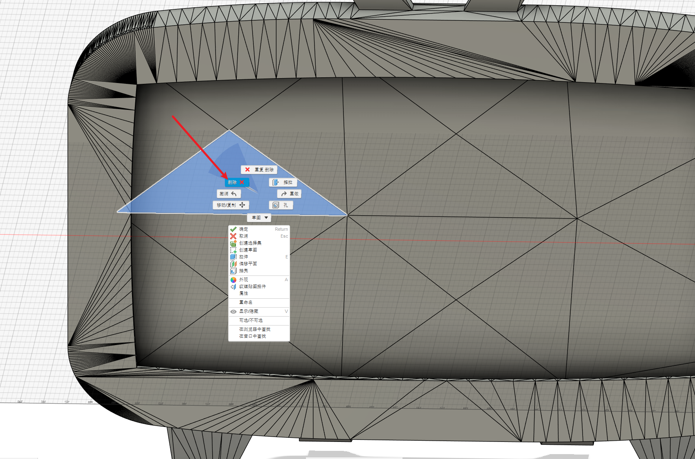

就会自动删除其他的

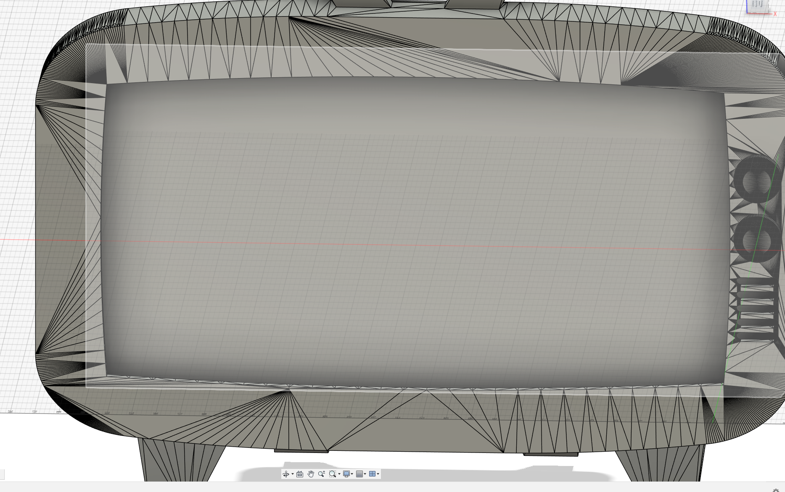

全部完成后就可以编辑了。

