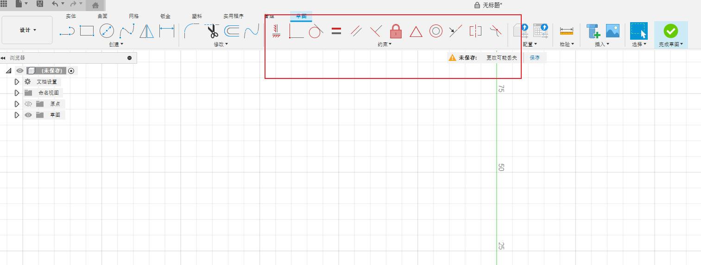
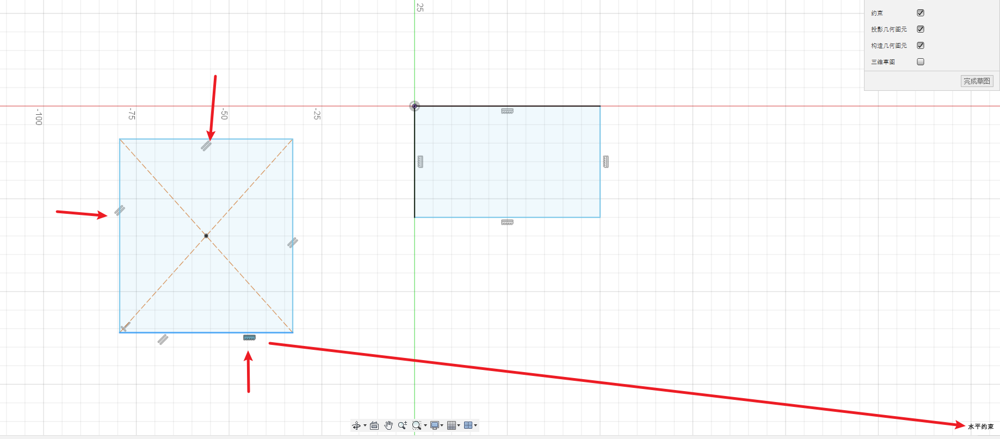
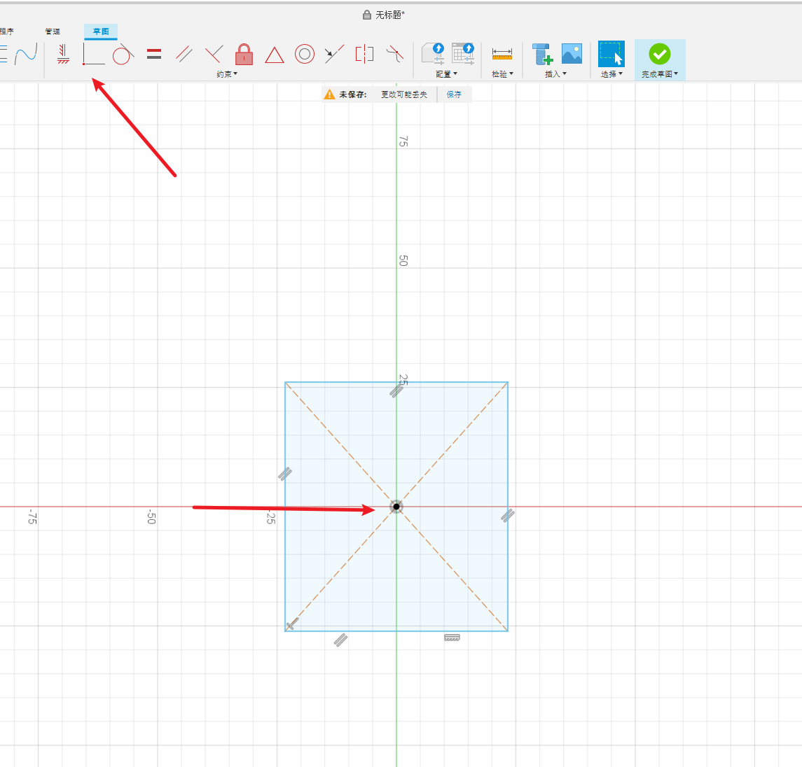
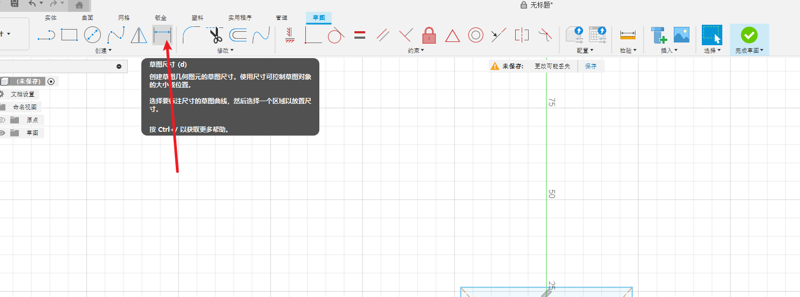
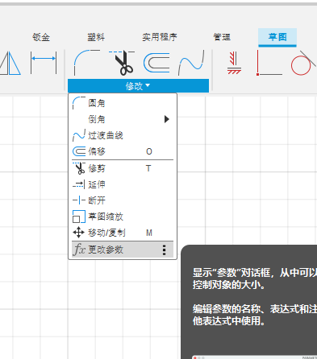
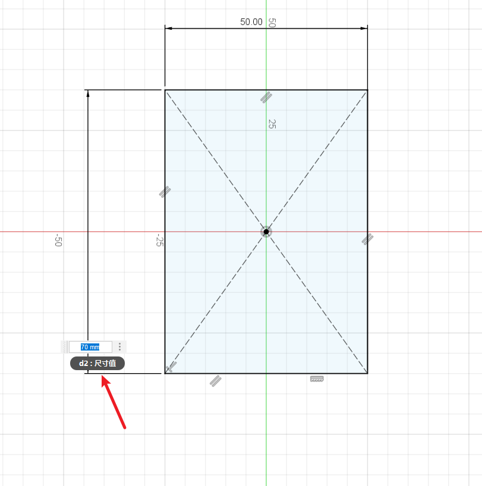
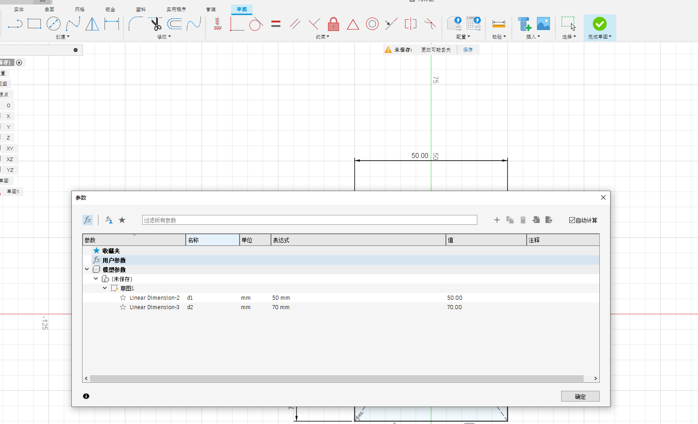
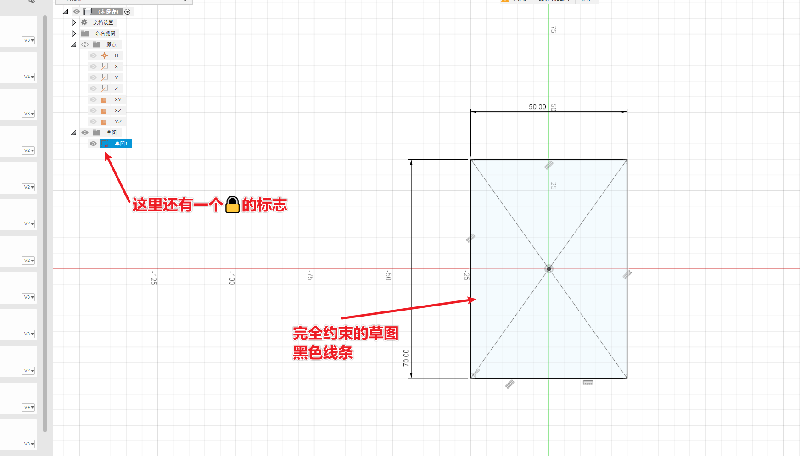

# 简介

根据B站的视频30天学会fusion 360 .这里针对每一个图纸的重点做一个记录。

参考https://www.bilibili.com/video/BV1UL4y177r8?spm_id_from=333.788.videopod.sections&vd_source=cde2e7b9bca1a7048a13eaf0b48210b6

同样只记录之前没有学到的问题

# 完全约束

先说为什么需要完全约束，就是为了做到图像部分的联动效果。

例如约束四条边相等，那么设置一条边长就会联动修改其他三条边长。其他的约束也是类似的效果。

* 约束主要有位置关系和尺寸两个方面

约束菜单在草图中

## 两点矩形与中心矩形的约束

这里距离看一下两点矩形与中心矩形的约束

点击对应的约束，下面就可以显示约束的名称。

## 重合约束

先说一下位置相关的约束，以重合约束为例子

以中心点矩形为例，点击重合约束，点击矩形的中心点和图纸的中心点，那么这两个点就会重合，就是将矩形设置到了中心位置。

## 尺寸

可以使用修改-草图尺寸 来固定对对应的尺寸，例如边长

如果希望快速设置，可以使用之前讲过的变量，也就是 修改-更改参数

同时会自动设置变量，如下图的d2

可以设置用户参数来设置对应的值。这样可以做到一次设置修改，不用一个一个修改了

## 完全约束的草图

