# 简介

根据B站的视频30天学会fusion 360 .这里针对每一个图纸的重点做一个记录。

参考https://www.bilibili.com/video/BV1UL4y177r8?spm_id_from=333.788.videopod.sections&vd_source=cde2e7b9bca1a7048a13eaf0b48210b6

同样只记录之前没有学到的问题

# 塑性建模

不同于之前的设置草图然后拉伸建模，这里有另外一种方式，像捏橡皮泥一样创建一个造型。

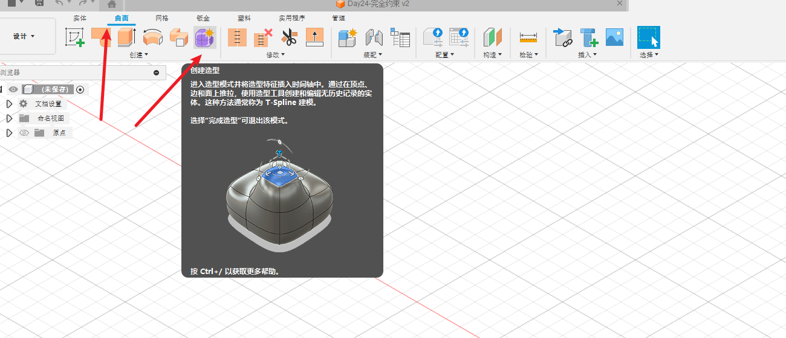

这里只是简单介绍一下。

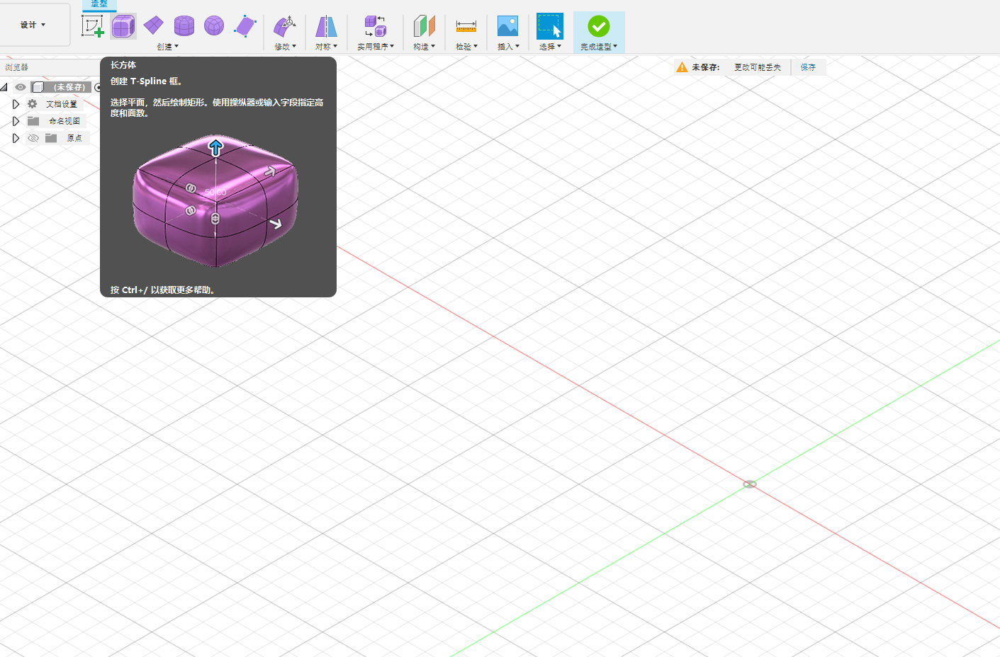

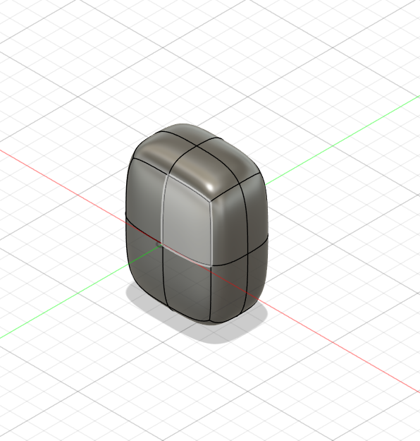

## 选择面

可以手动 shift+单击  选择多个面

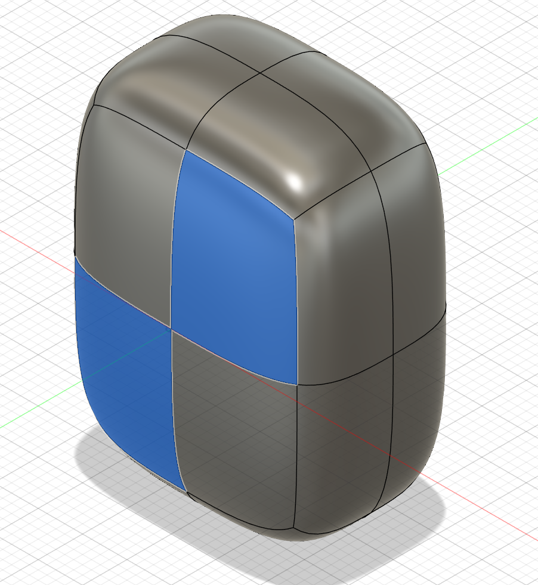

如果希望选择一列的面可以选择一个面 然后 shift 双击一列的另一个面

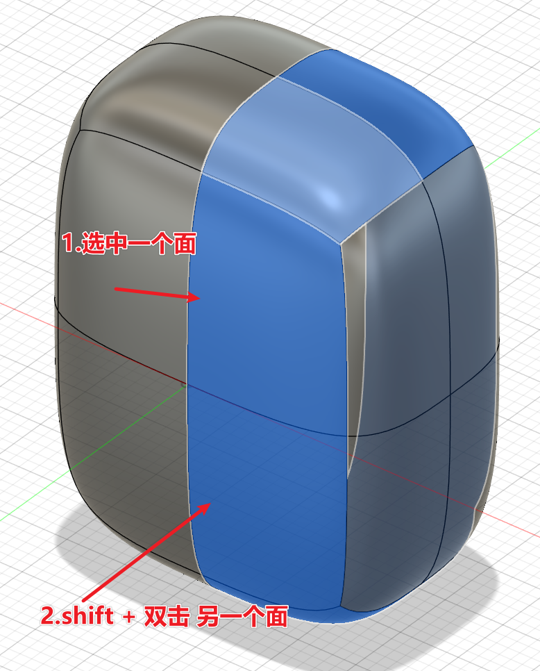

## 选择线

类似面的选择

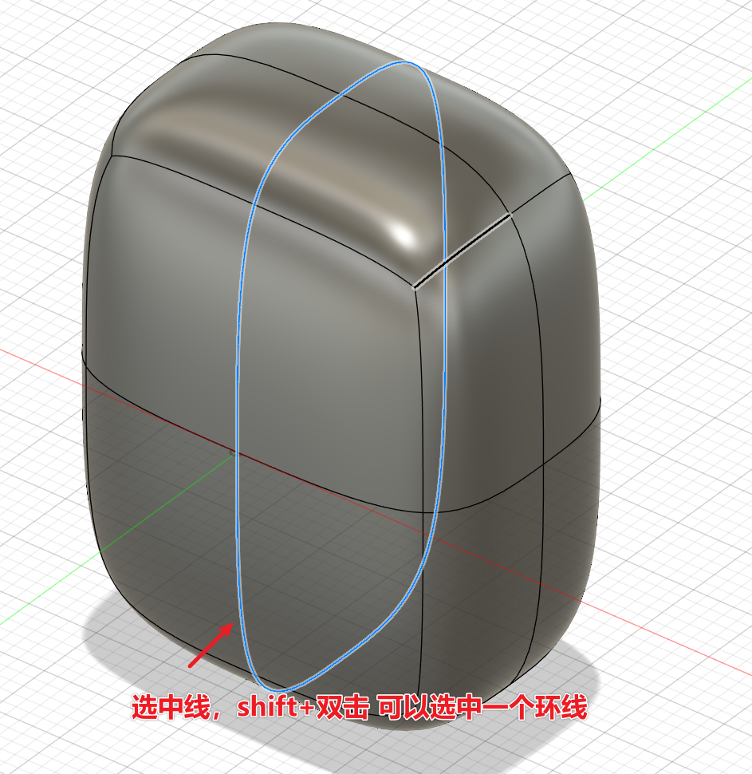

## 着色选择

就是可以鼠标指到哪里选择哪里，左键不松，滑动即可

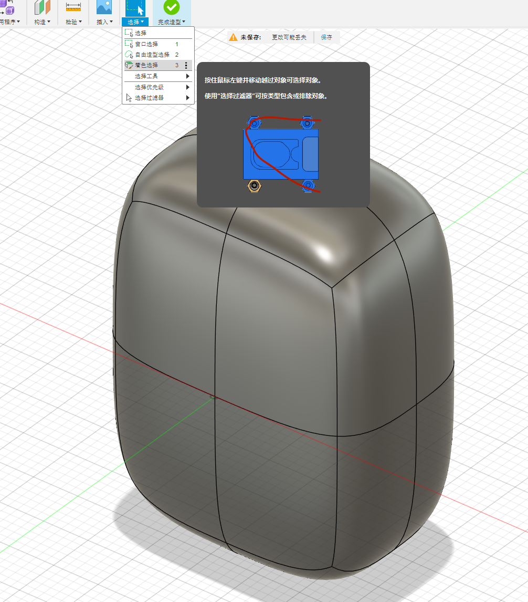

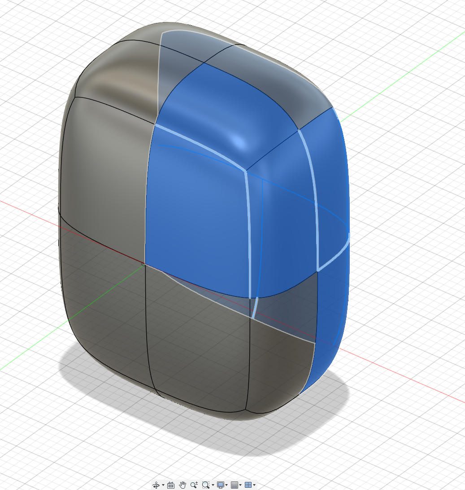

## 选择过滤器

例如只希望选择面，不希望选择线，就可以使用过滤器

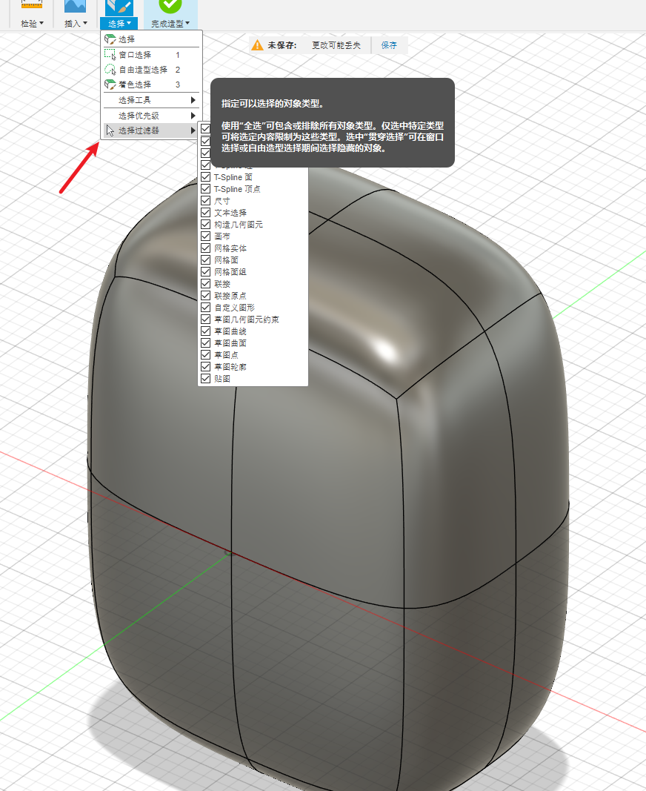

## 修改

选择面后 这里会有一个编辑的，自己可以尝试一下都是修改什么的。

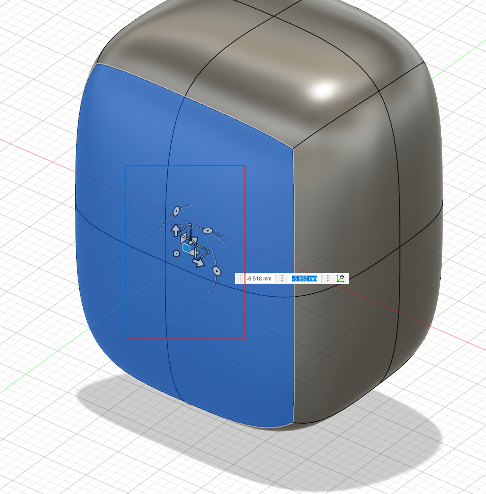

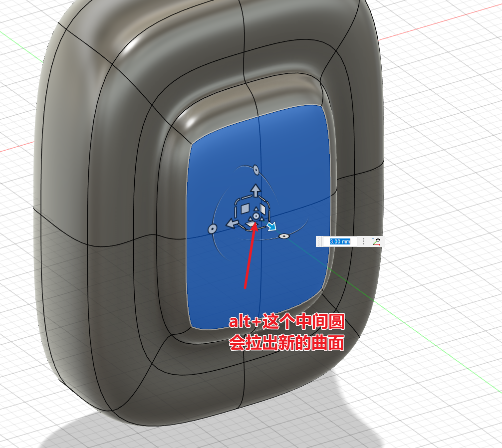

这个编辑都是没有历史记录的。

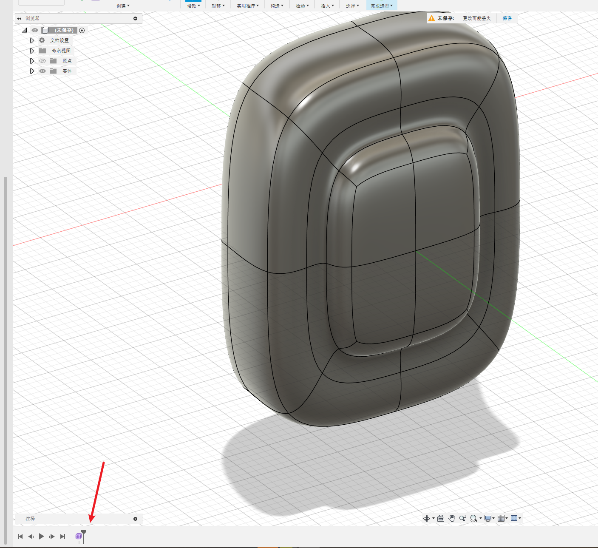

我没有什么艺术细菌，就到这里吧。