# 简介

根据B站的视频30天学会fusion 360 .这里针对每一个图纸的重点做一个记录。

参考https://www.bilibili.com/video/BV1UL4y177r8?spm_id_from=333.788.videopod.sections&vd_source=cde2e7b9bca1a7048a13eaf0b48210b6

同样只记录之前没有学到的问题

# 三脚架的联动效果

之前已经讲过联动了，这里再重复一下，新的内容就是

* 固定
* 快速联动和联动的区别

首先打开官方练习的三脚架

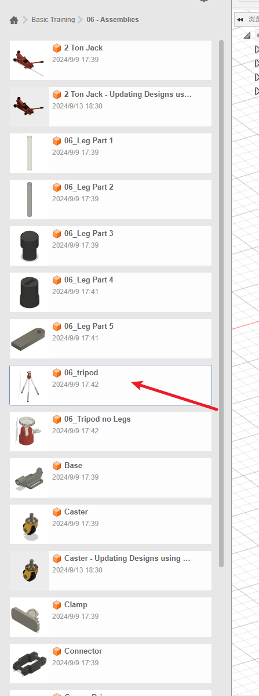

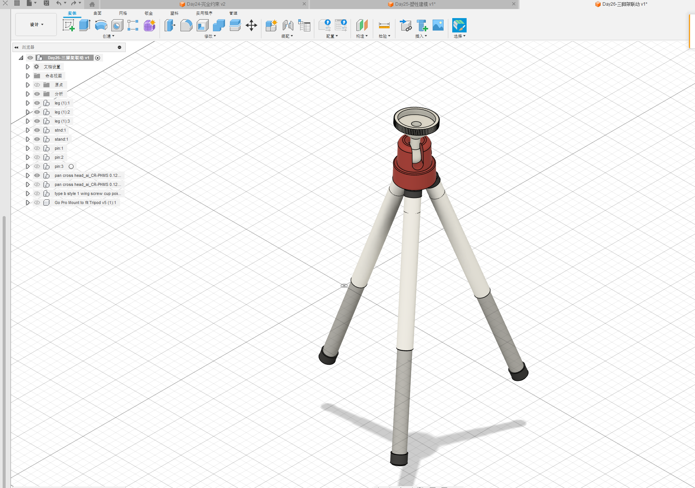

# 零件的移动

所的零件是可以移动的，例如选择后拖动

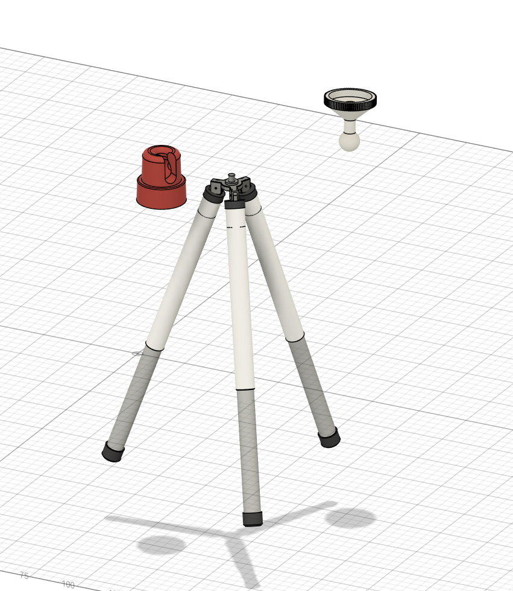

## 快速链接

当相对位置不需要调整时使用快速链接。

例如这里的三角架的伸缩腿。

注意第一个选择的零部是相对运动的，第二个先择的零部件是相对固定的。

捕捉选择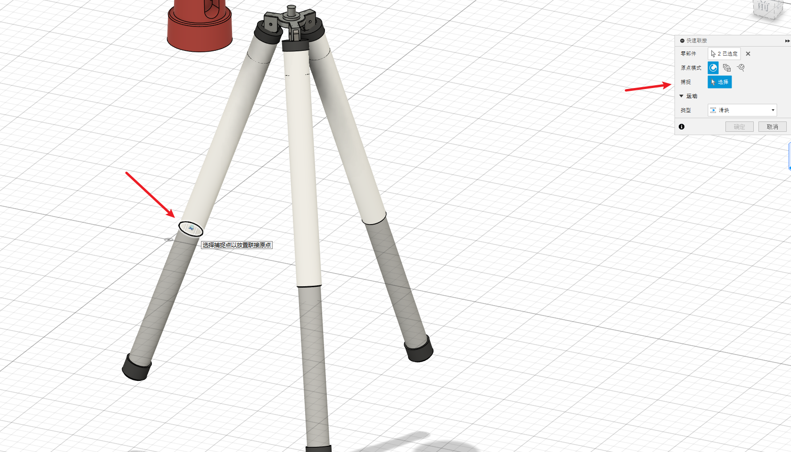

零部件选择玩后选择运动类型-滑块

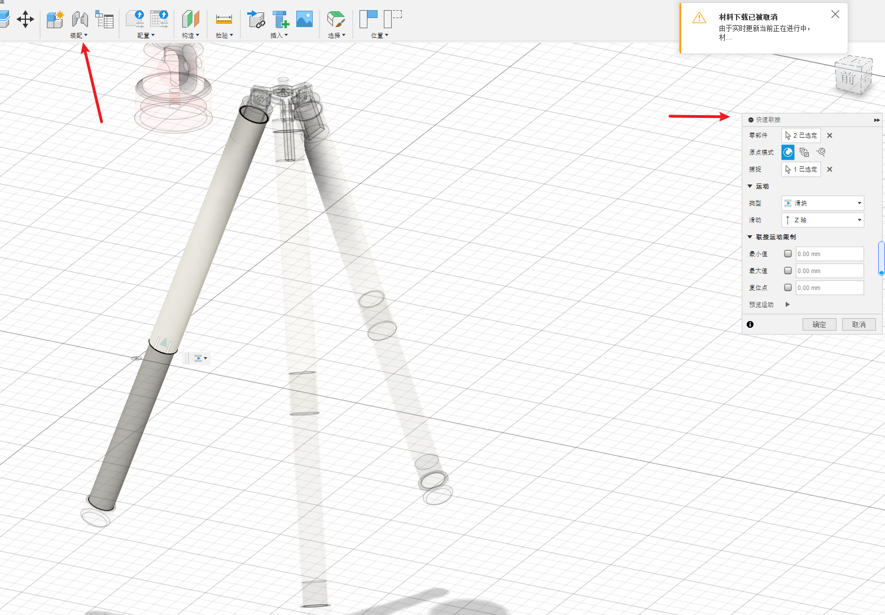

可以发现三个腿都有联接了，是因为三个腿是阵列生成的，是一起的。

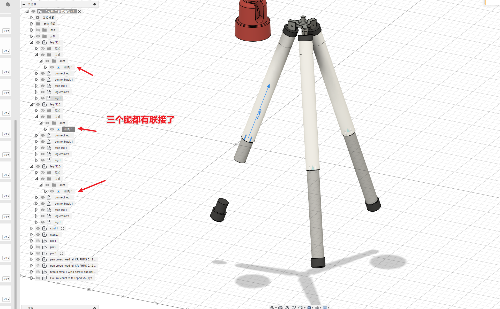

这时候可以运动了，但是橡胶腿没有跟着一起滑动。

我们需要将橡胶腿和下面的伸缩腿创建快速链接-固定。使他们一起运动。预览时 是两个零件作为一个整体颤动，就是刚性联接到一起了。

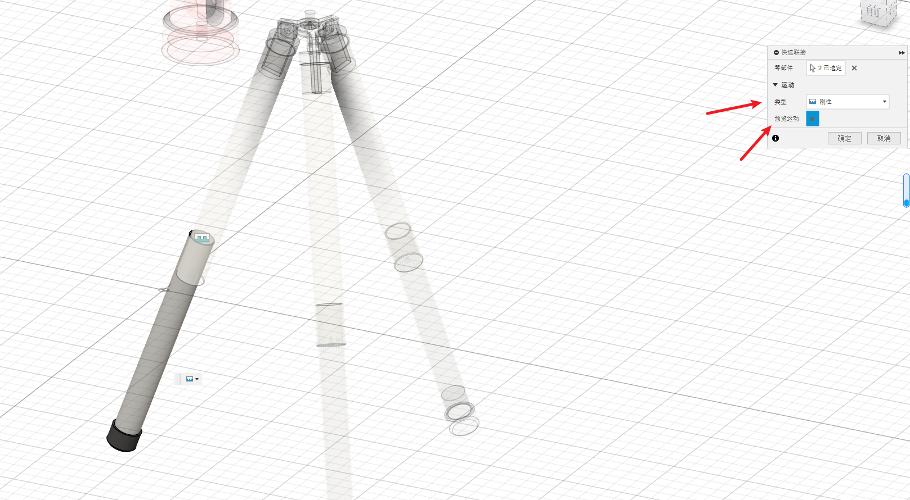

## 联接演示

如果设计完了，可以从这里右键看看对不对

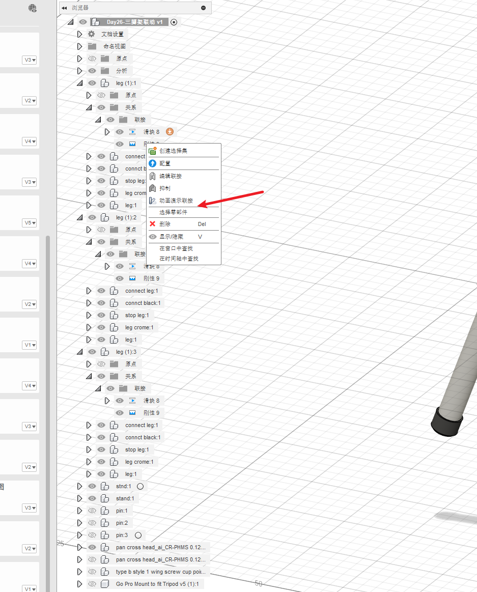

## 联接

与快速联接不同，联接是需要位置移动的，

例如下面的相对位置需要移动的零件。这是我们就需要使用联接

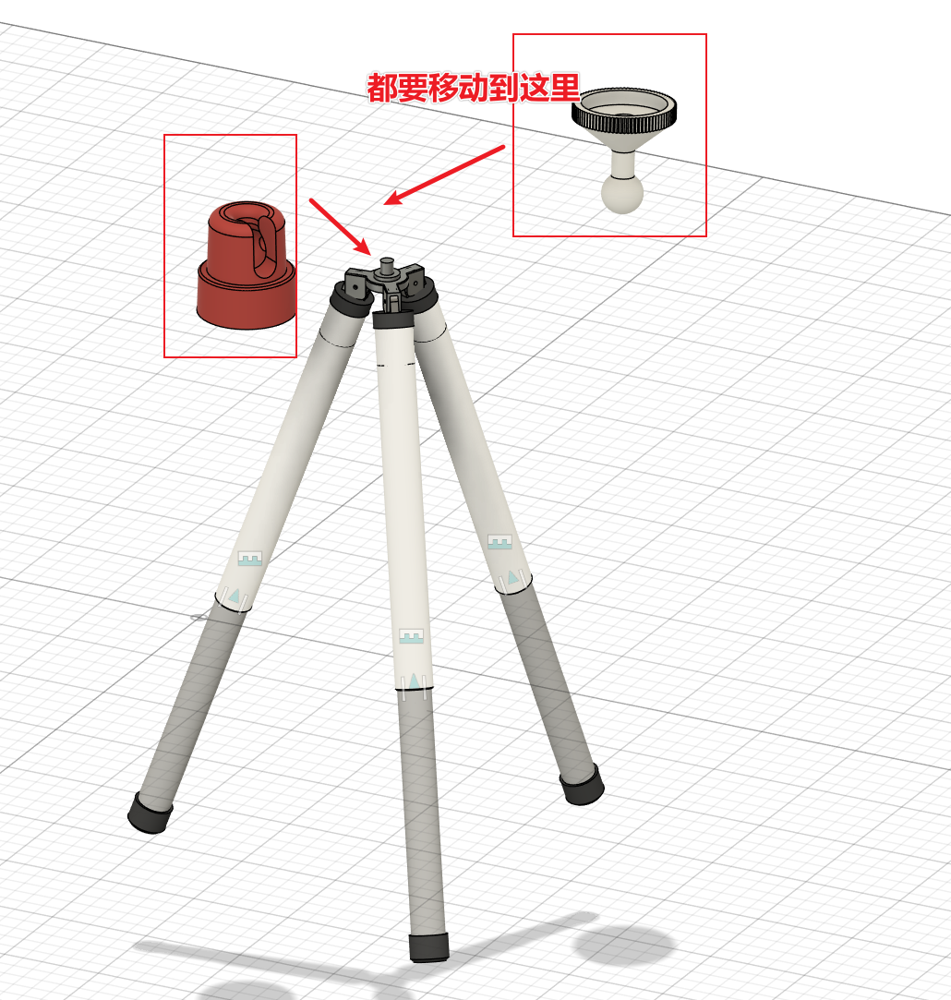

这之前我们可以先固定一个零件的位置

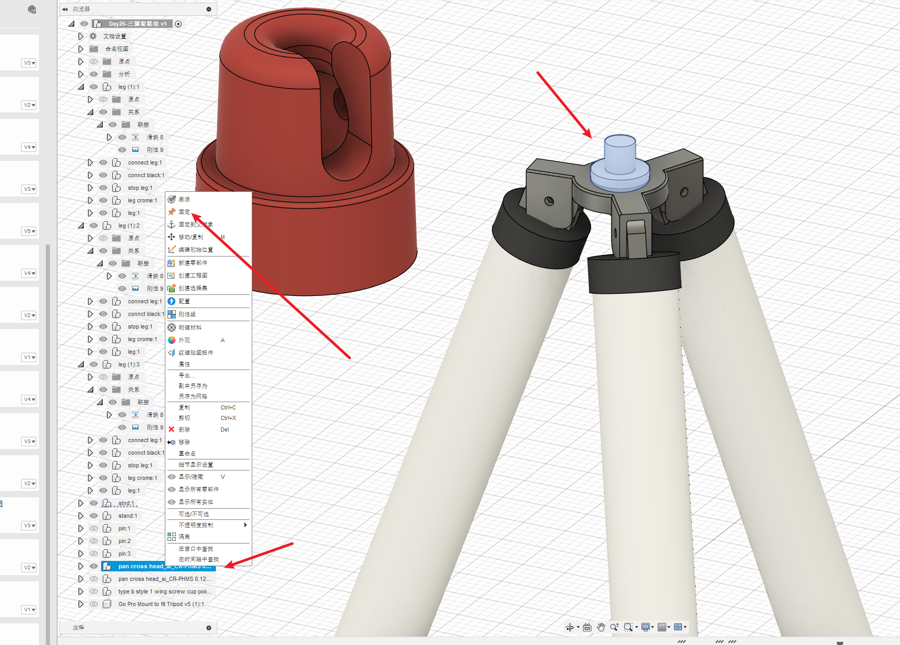

固定后会显示如下图

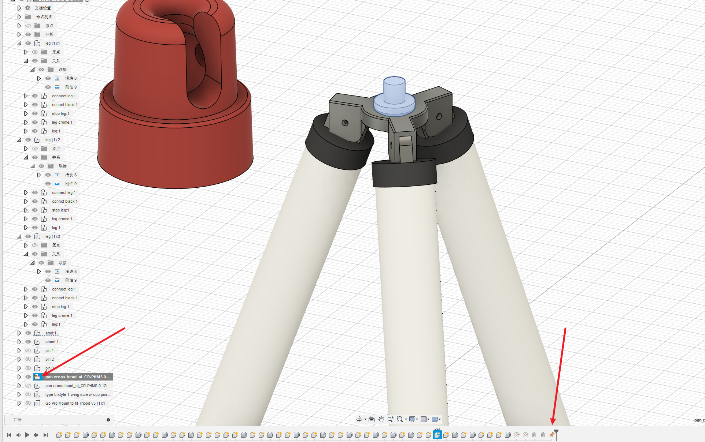

然后设置将橙色的自动移动到中心圆柱上，使用联接

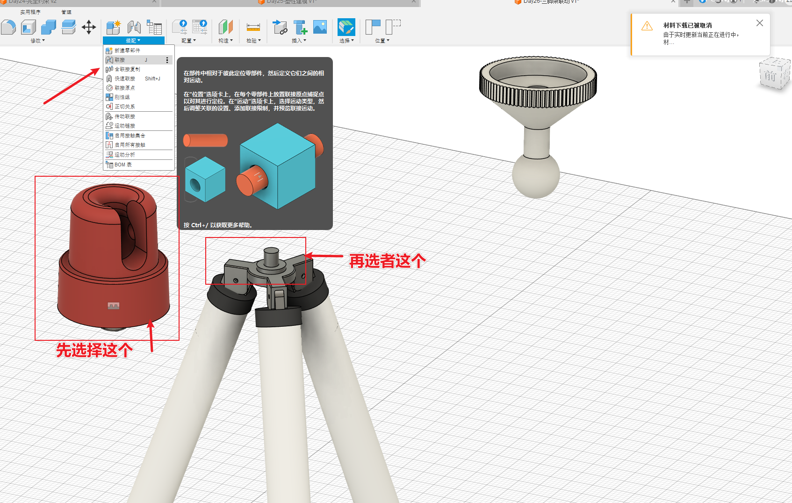

选择旋转

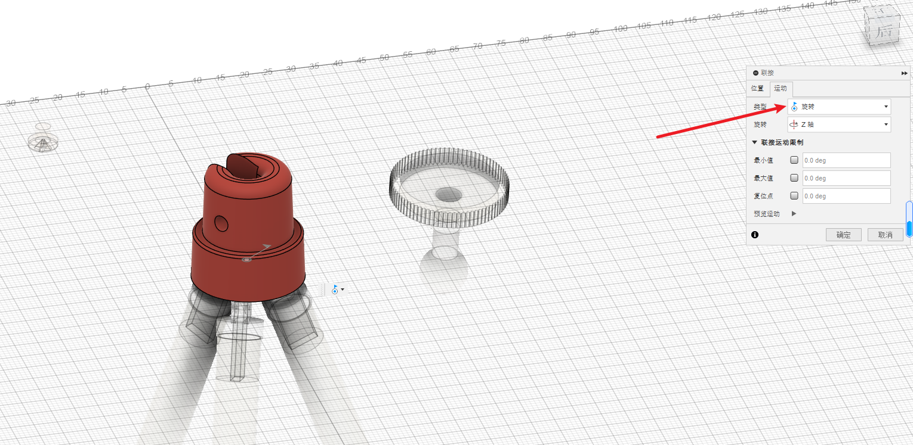

同理设置另一个零件到橙色

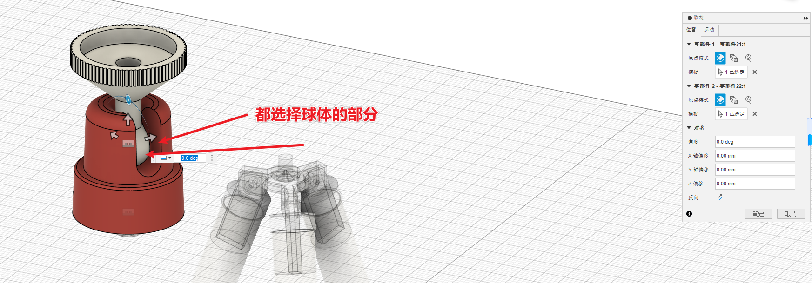

## 编辑运动限制

从预览的演示可以看出，运动的范围不是自己希望的，可以编辑一下

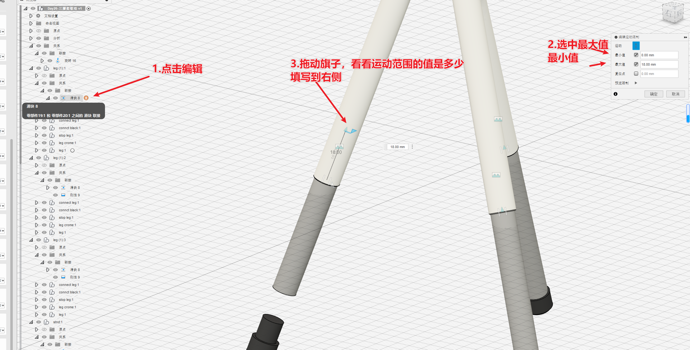