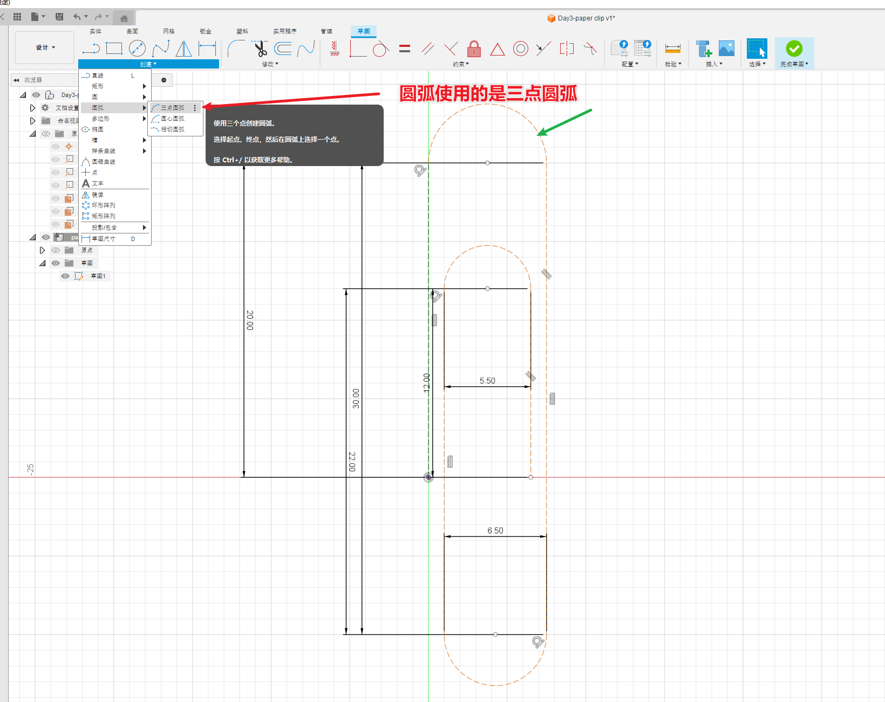
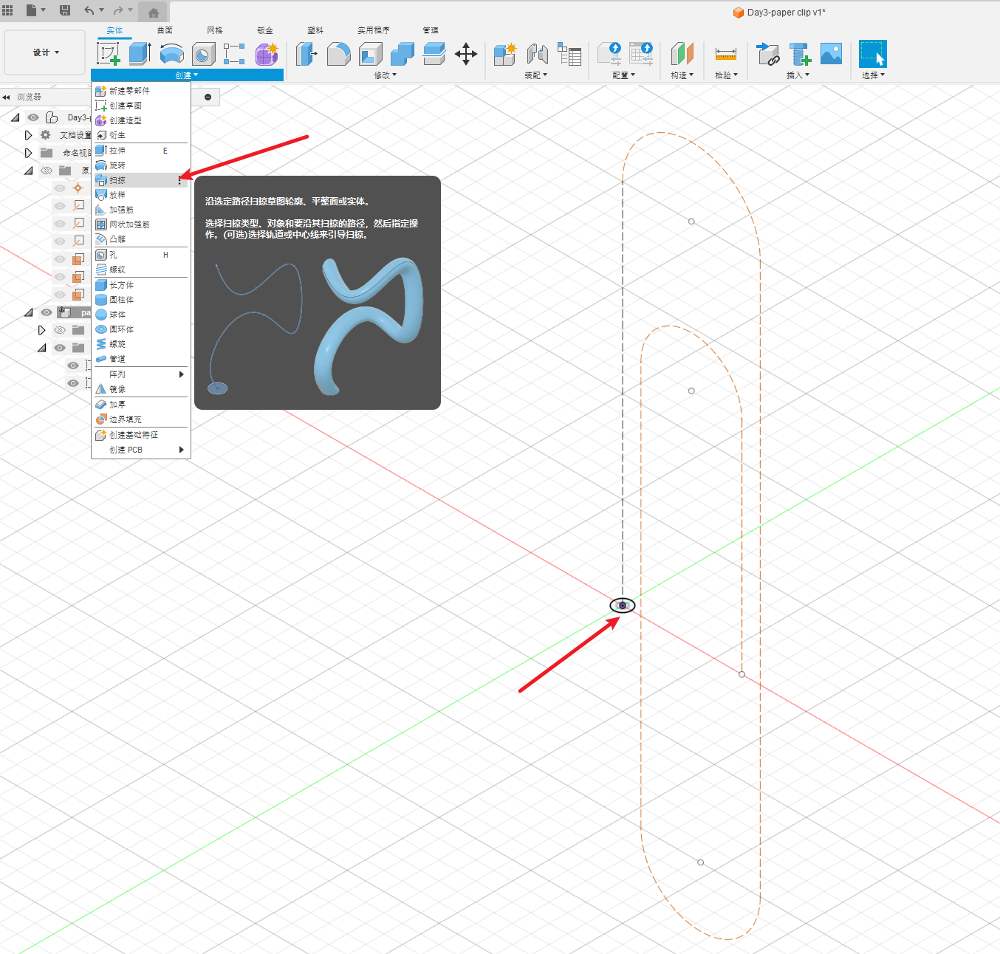
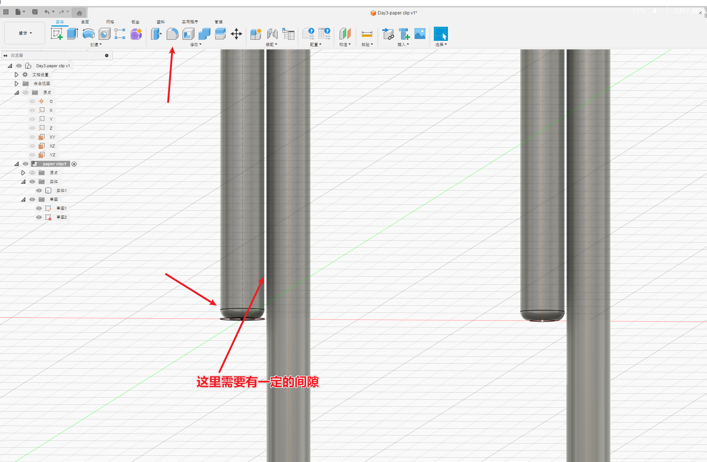
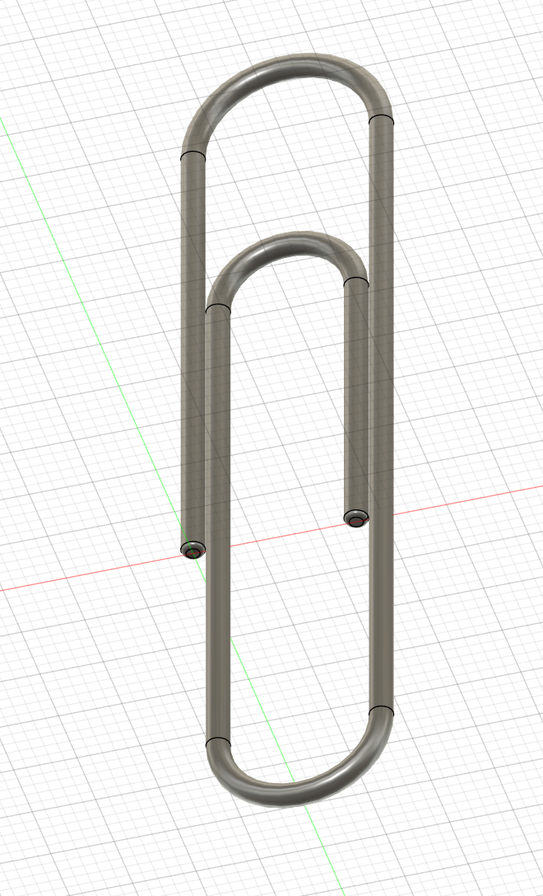

# 简介

根据B站的视频30天学会fusion 360 .这里针对每一个图纸的重点做一个记录。

参考https://www.bilibili.com/video/BV1UL4y177r8?spm_id_from=333.788.videopod.sections&vd_source=cde2e7b9bca1a7048a13eaf0b48210b6

# 曲别针

主要的操作：

* 三点圆弧
* 扫掠

注意在如果这里做倒角的话，如果遇到下面的错误：

错误:   “圆角/倒角”遇到非流形边非流形边或顶点。    这是两个独立的体积共享一条边或一个顶点的位置。请在您的模型上寻找满足此条件的位置，然后尝试编辑这两个体积，使其相互重叠或彼此之间存在间隙。

原因是，“扫掠”的小圆设定的太大了，挨在一起了，解决方案就是 将小圆设定的小一点，如下图有一定的间隙就可以了。

# 成品图

