# 简介

根据B站的视频30天学会fusion 360 .这里针对每一个图纸的重点做一个记录。

参考https://www.bilibili.com/video/BV1UL4y177r8?spm_id_from=333.788.videopod.sections&vd_source=cde2e7b9bca1a7048a13eaf0b48210b6

# 螺帽

重要的步骤

* 创建多边形
* 创建旋转 切面
* 构造中间平面-镜像
* 创建孔 螺纹

## 创建多边形

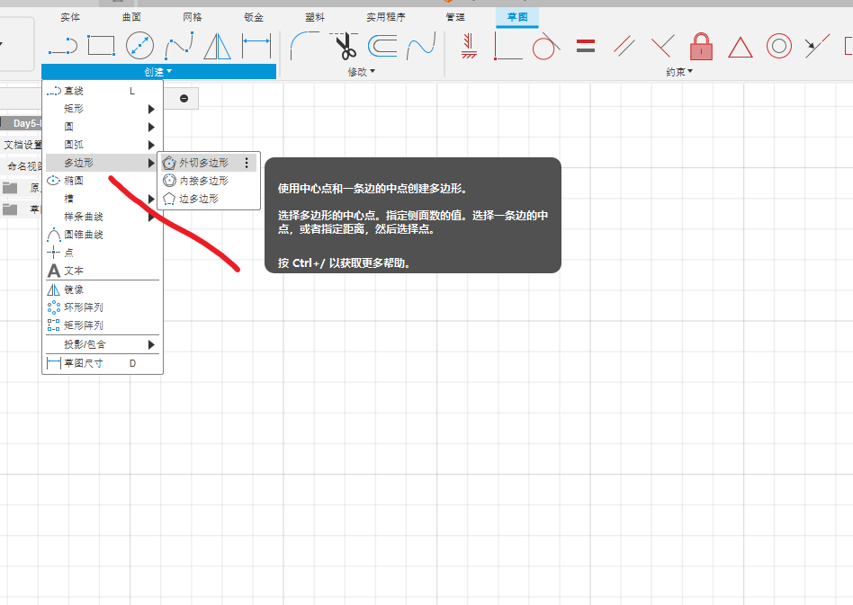

这里需要注意，变为蓝色才行，否则图形不对称。

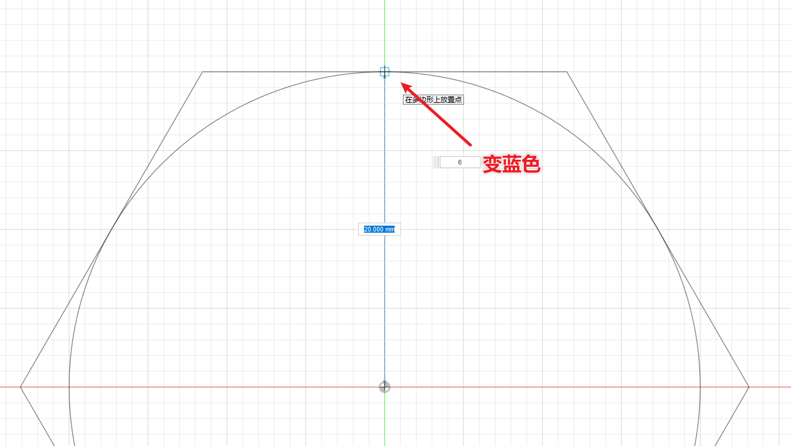

## 旋转-剪切

创建草图，选择面

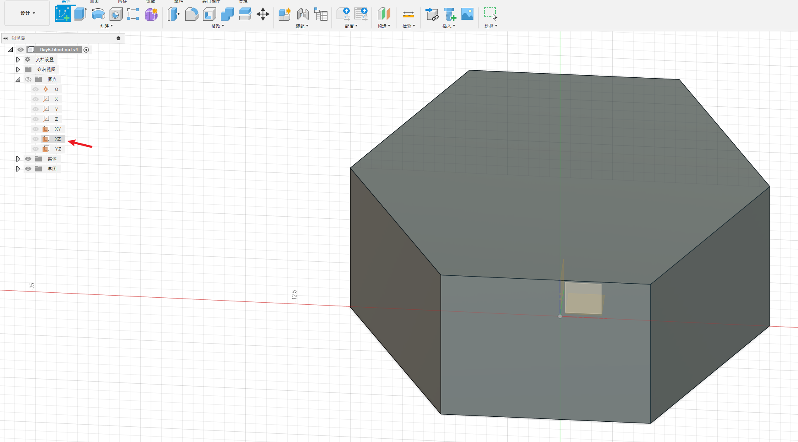

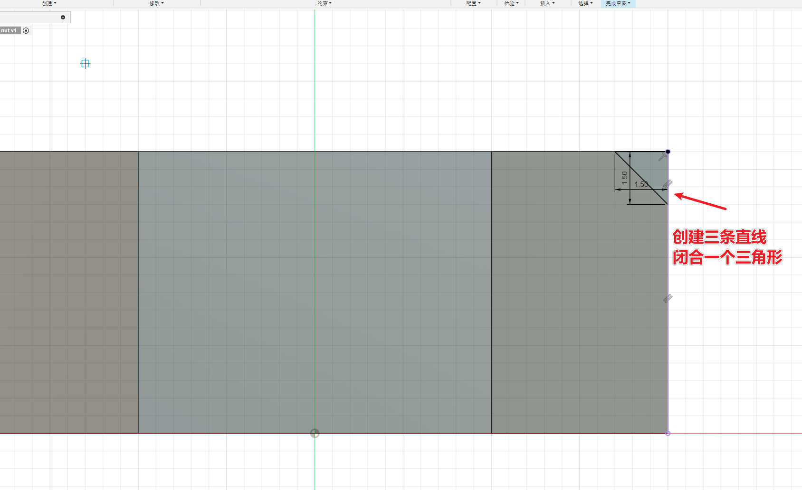

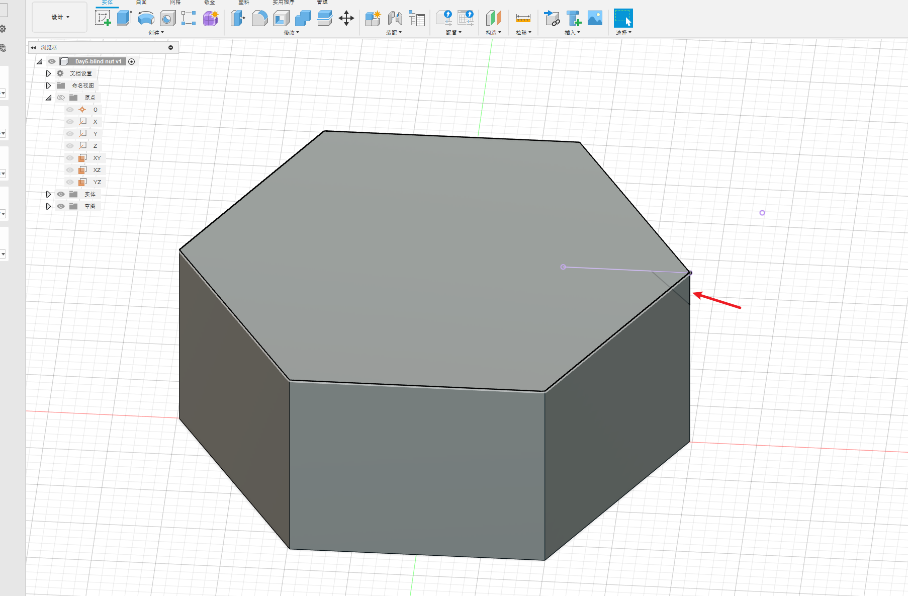

## 旋转

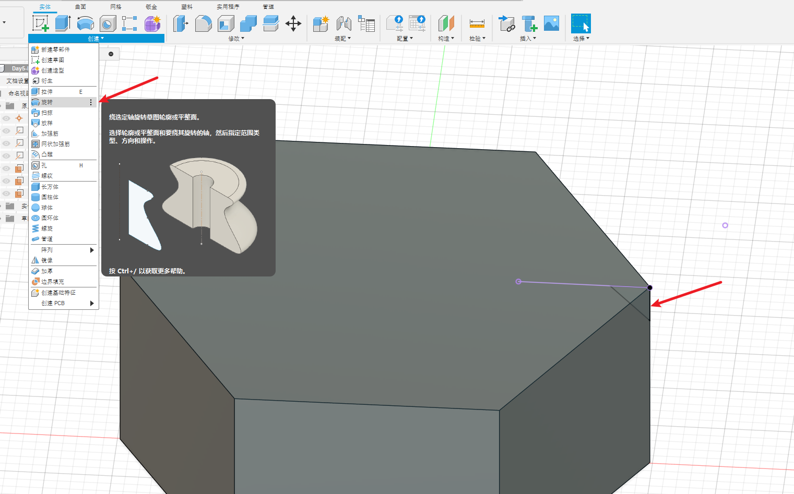

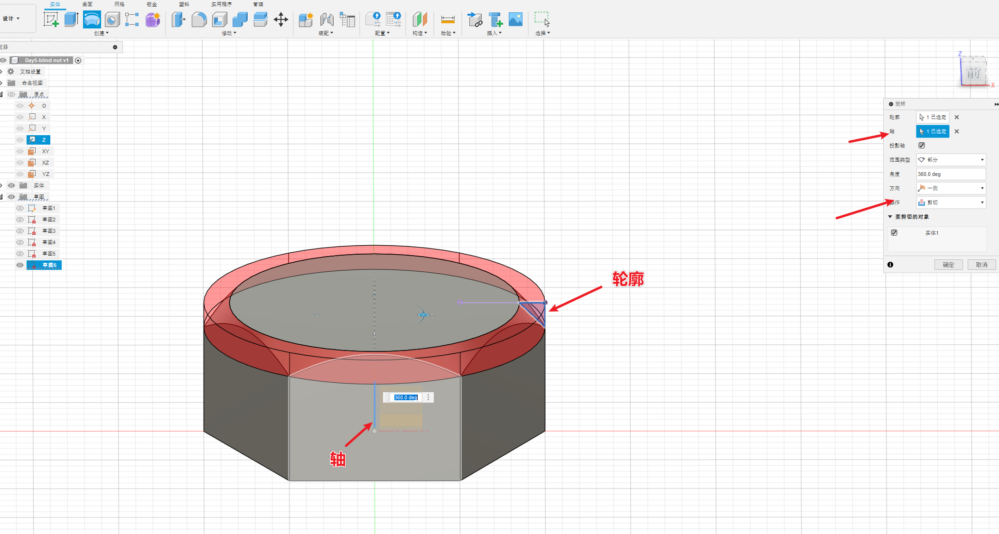

## 构造中间平面

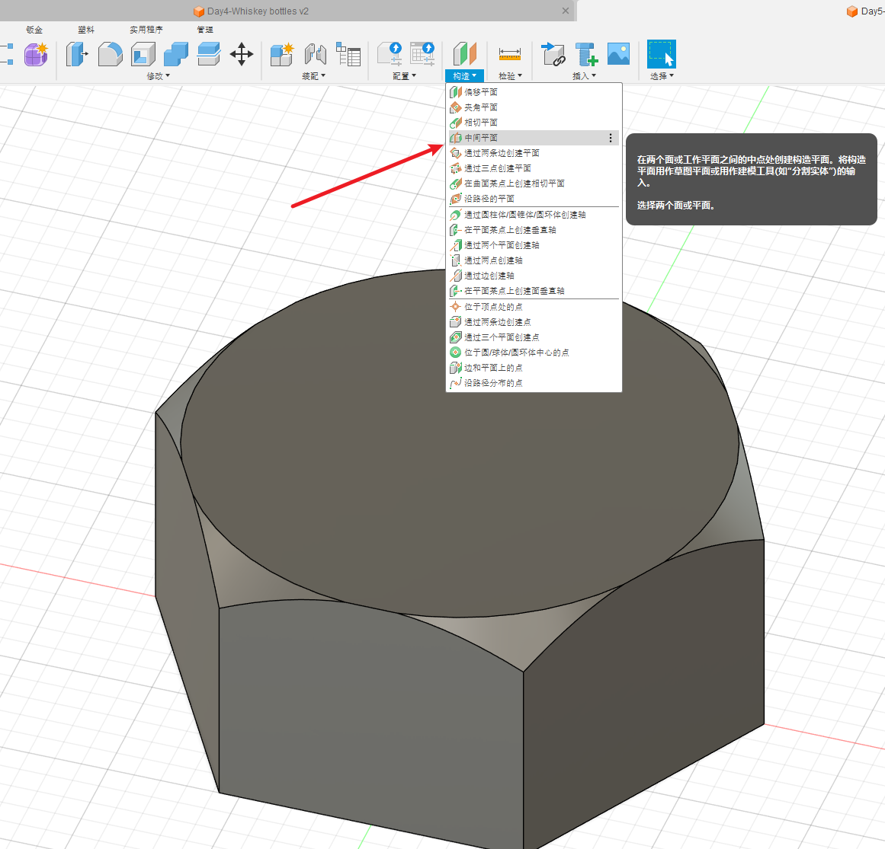

## 镜像

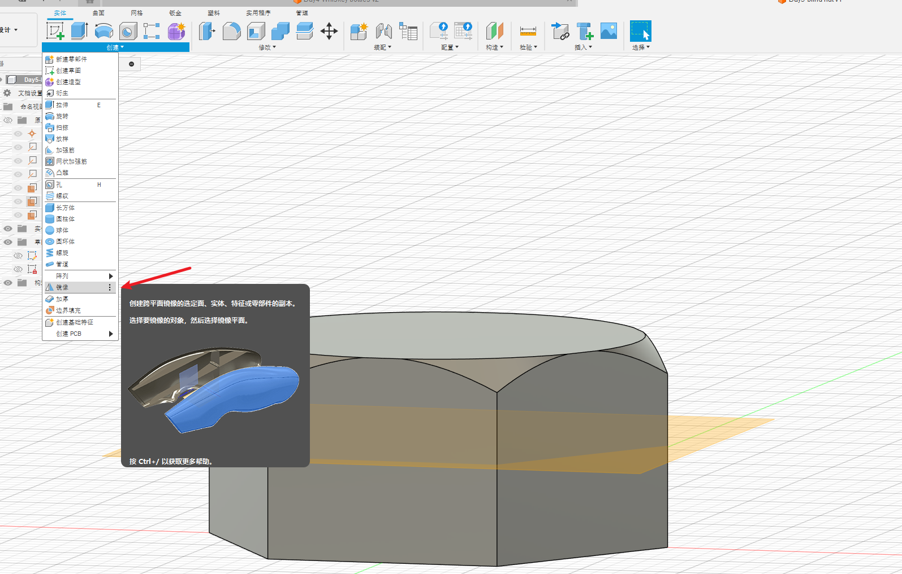

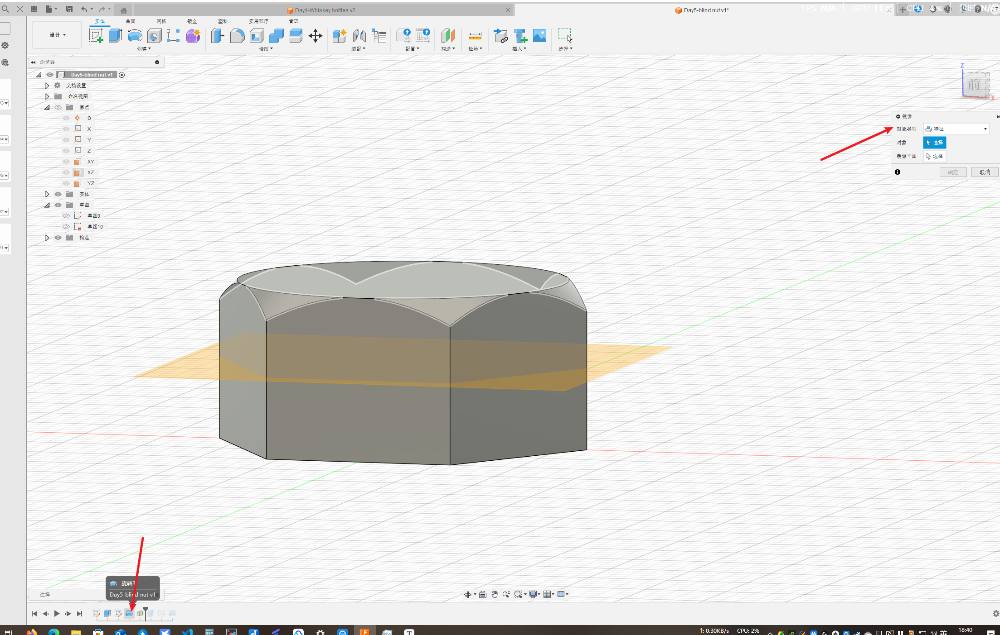

## 创建 孔

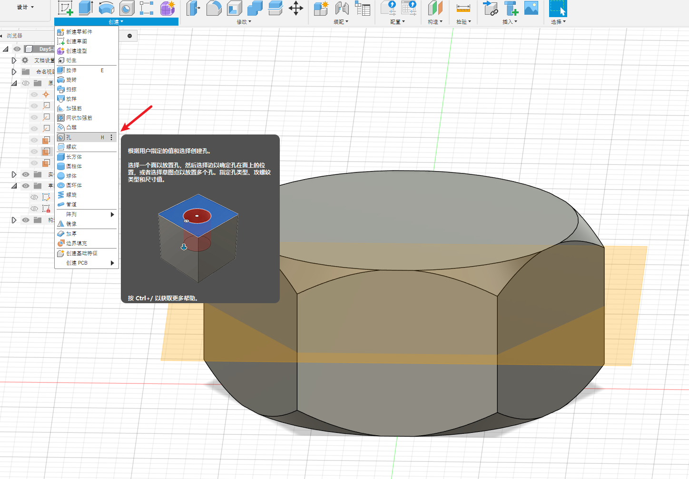

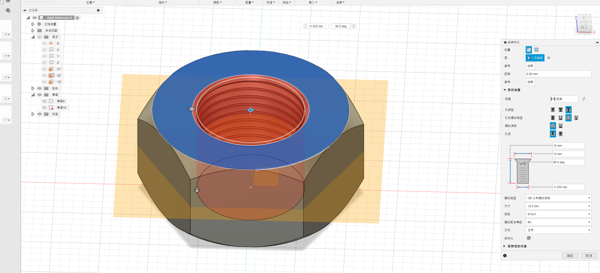

# 成品图

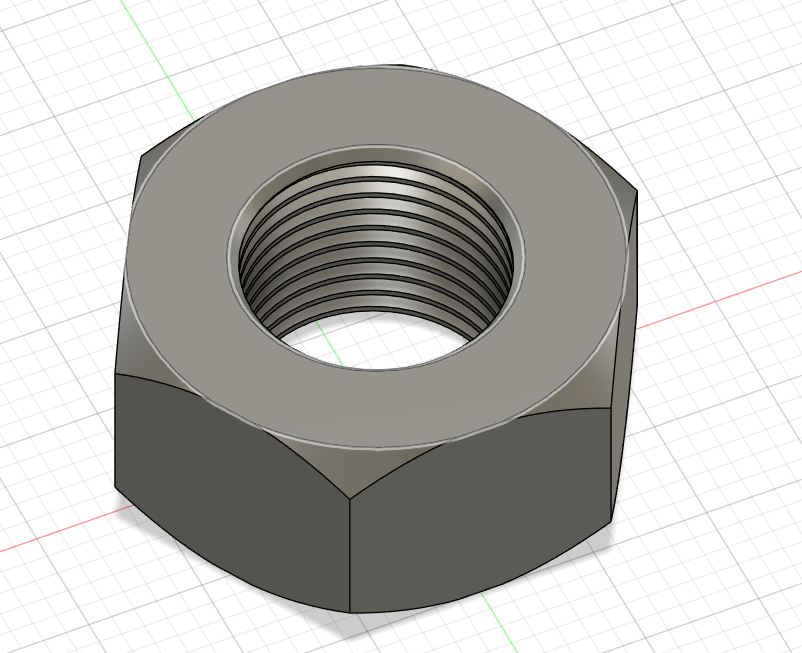