# 简介

根据B站的视频30天学会fusion 360 .这里针对每一个图纸的重点做一个记录。

参考https://www.bilibili.com/video/BV1UL4y177r8?spm_id_from=333.788.videopod.sections&vd_source=cde2e7b9bca1a7048a13eaf0b48210b6

# 橡胶把手

重点步骤

* 多实体
* 表面纹路
* 文字
* 

矩形阵列，选小矩形的四条边

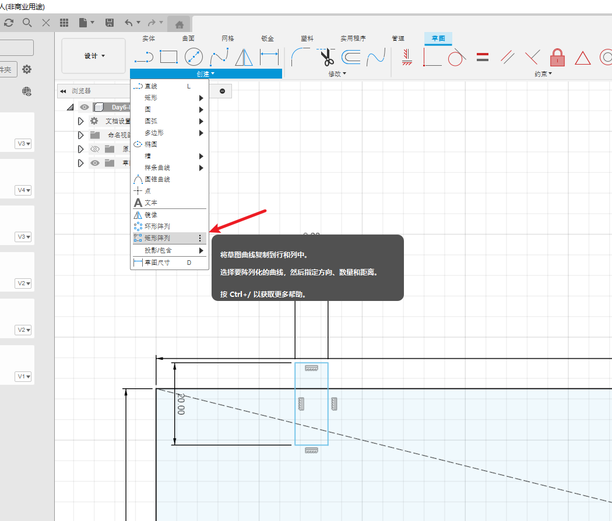

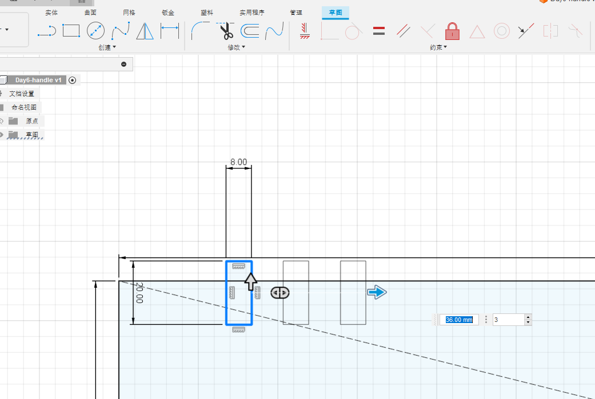

## 旋转

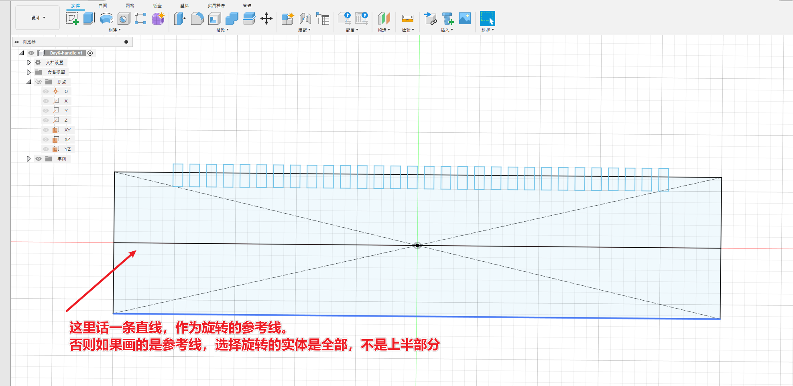

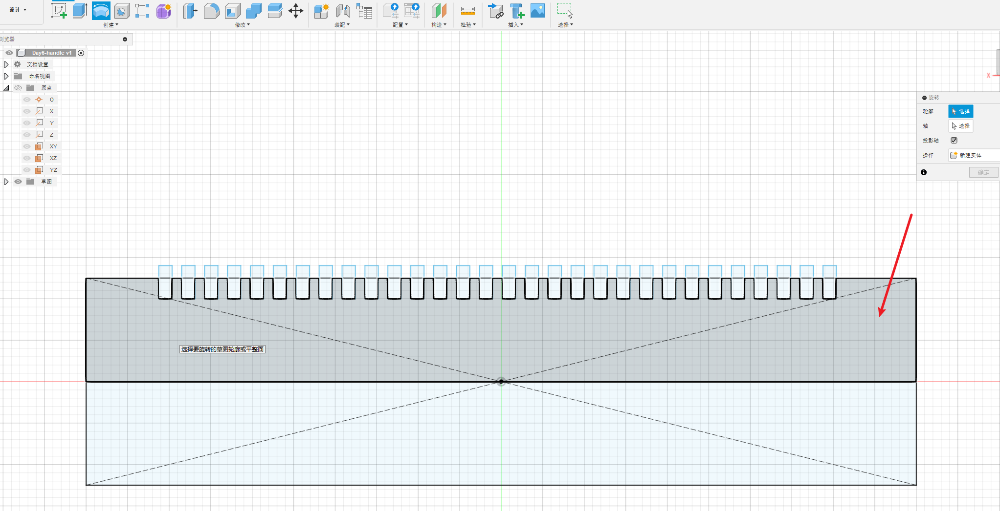

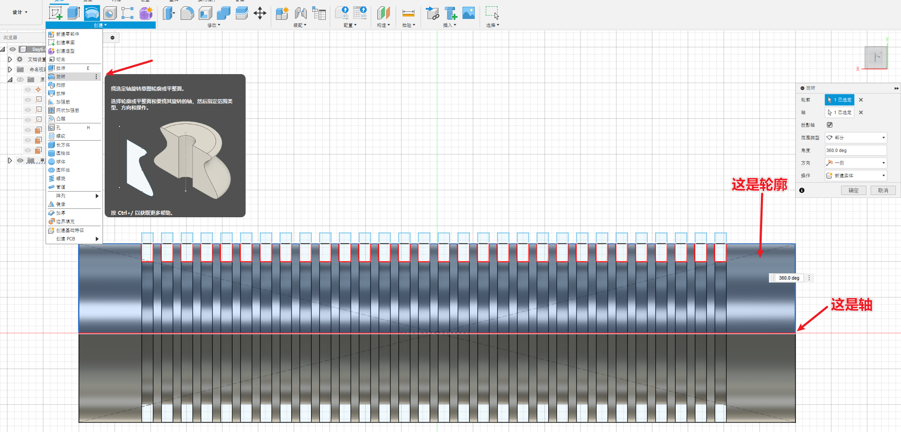

## 新建实体

这样可以区分为两部分材质

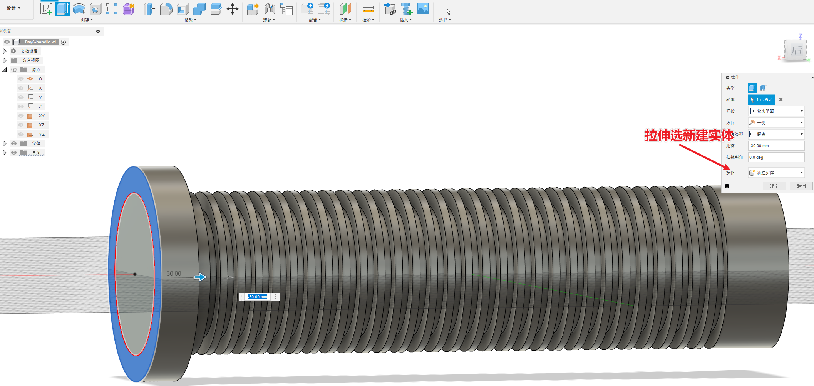

切割部分出来，为了显示文字

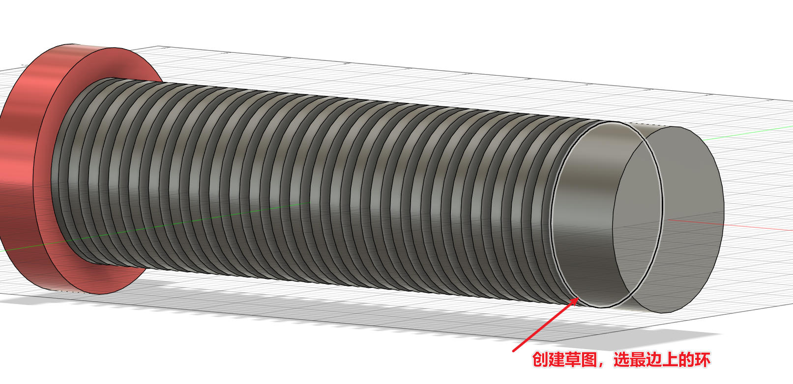

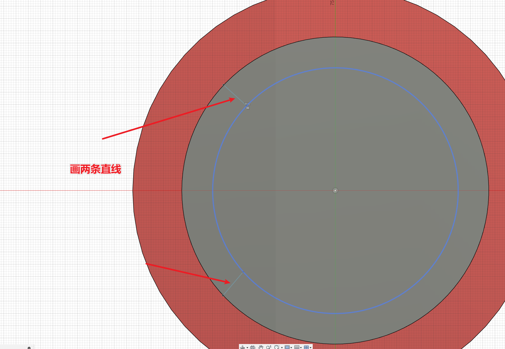

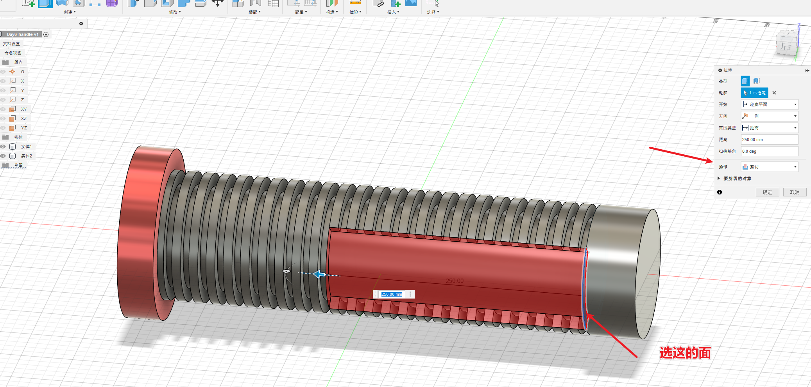

## 创建文本

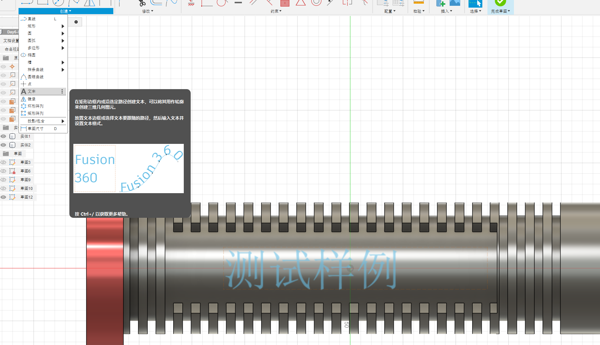

拉伸，选择对象

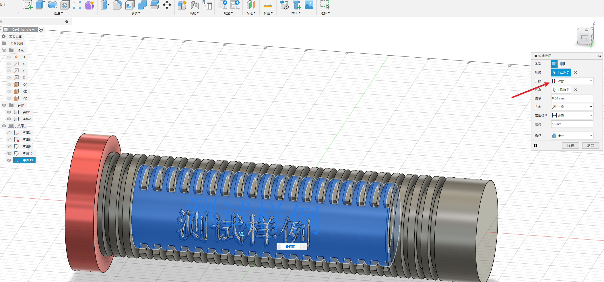

# 成品图

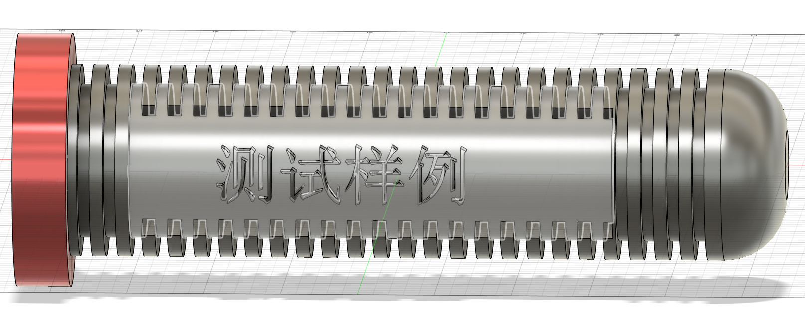