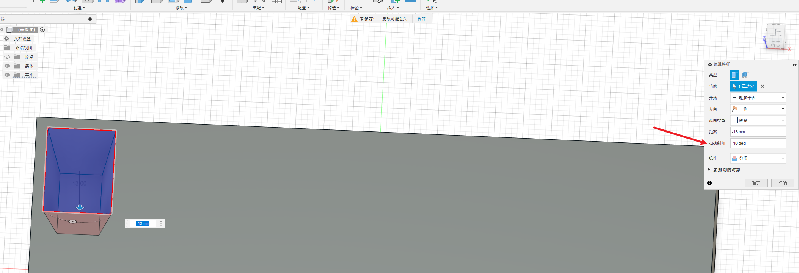
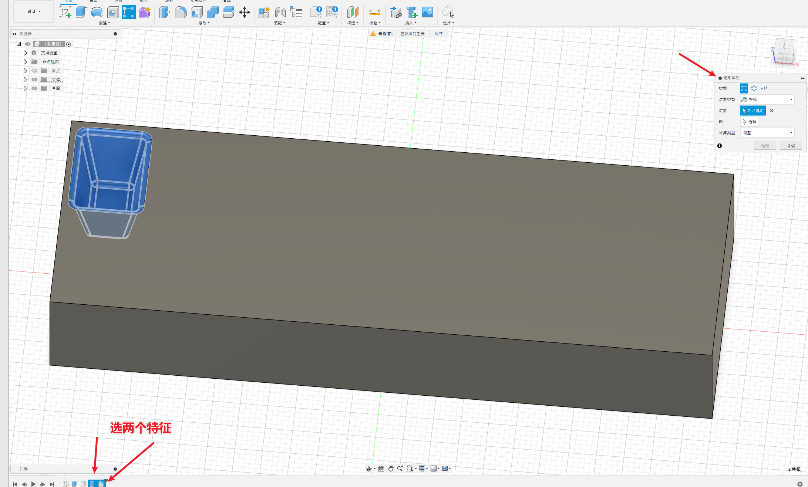
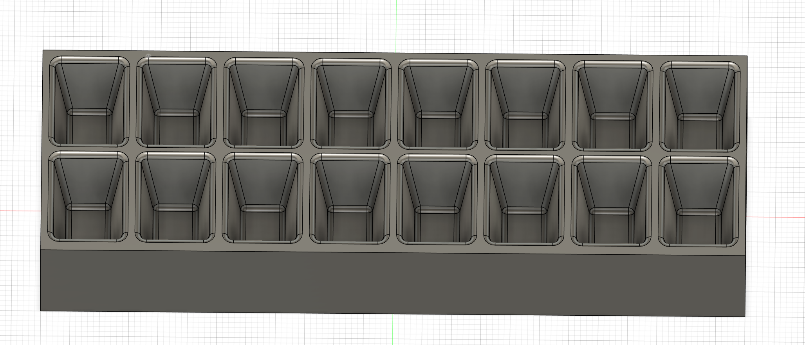
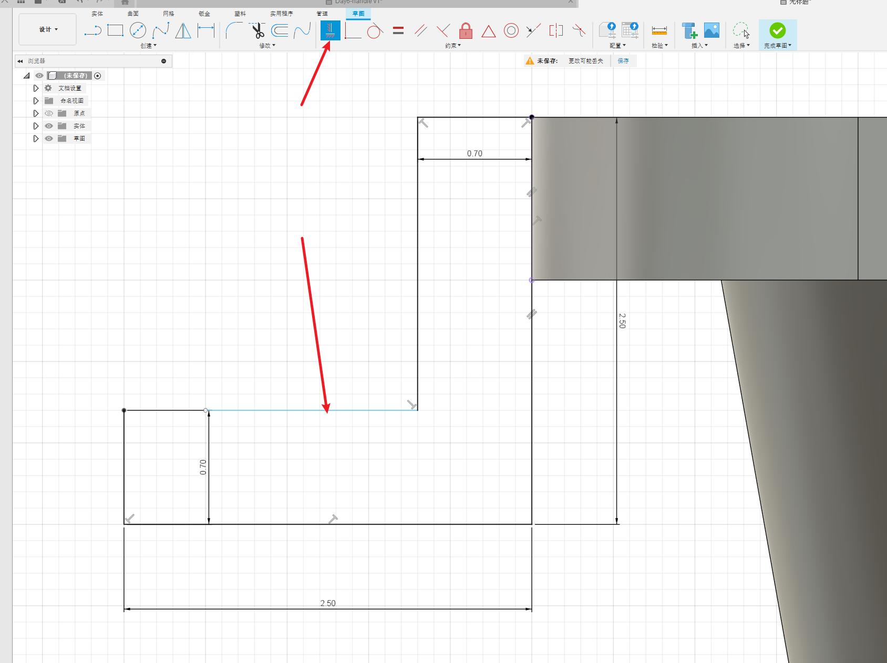
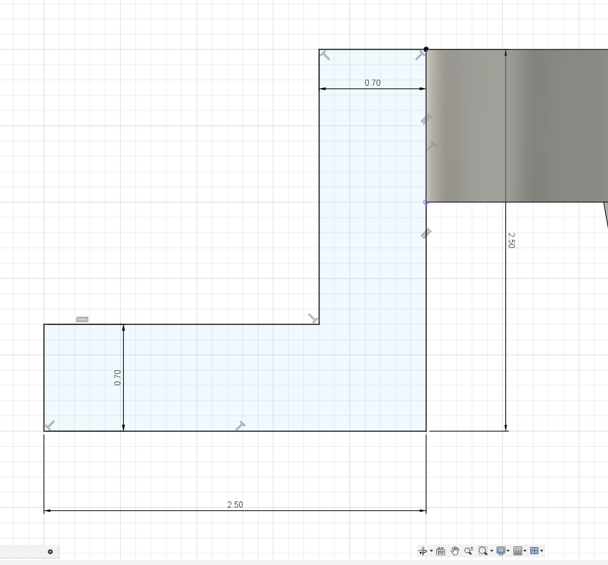
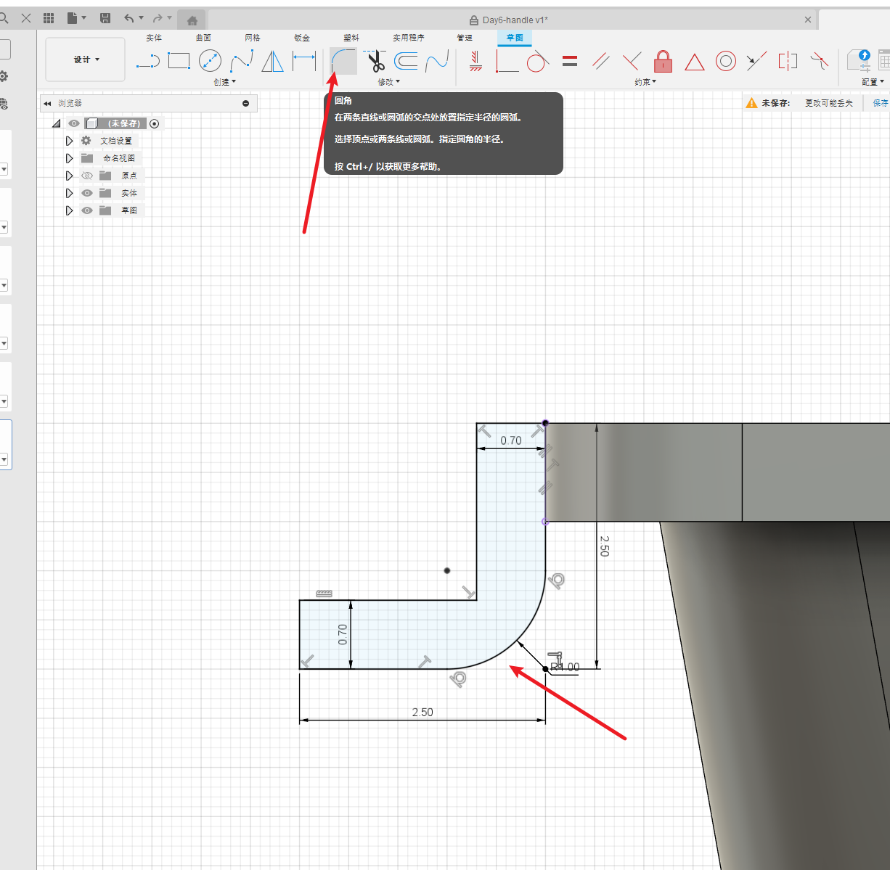
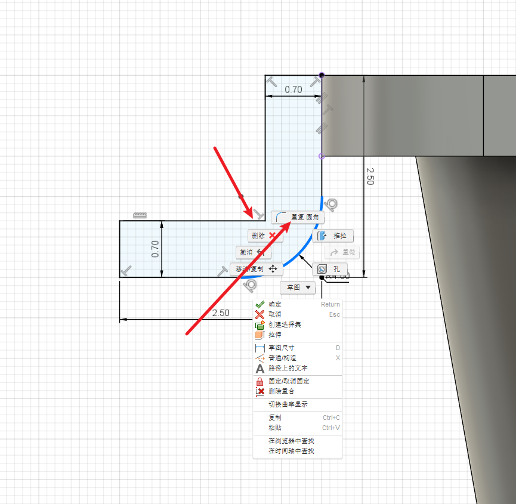
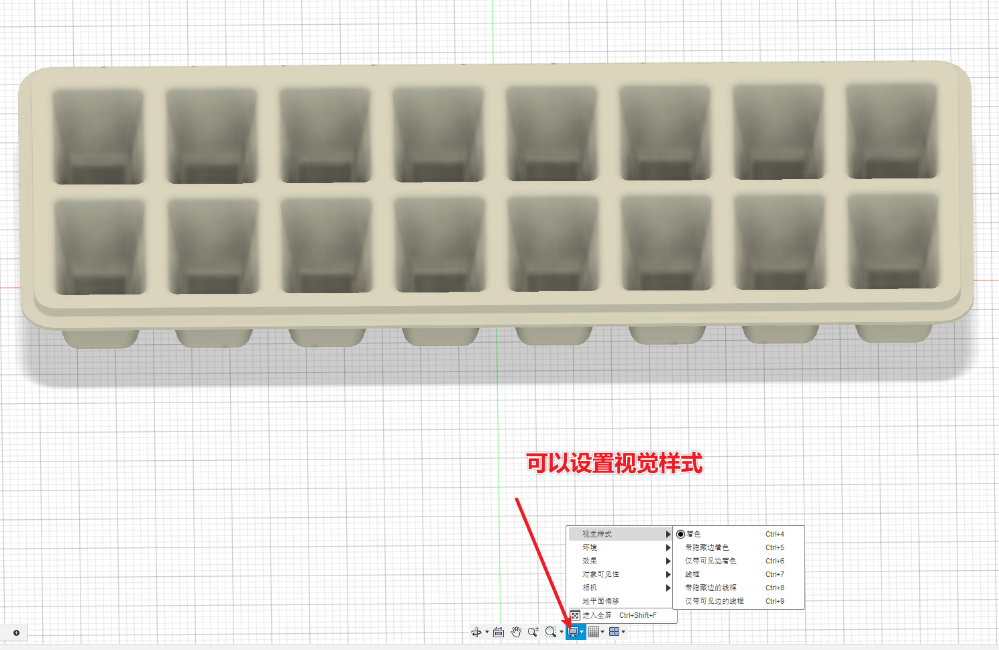

# 简介

根据B站的视频30天学会fusion 360 .这里针对每一个图纸的重点做一个记录。

参考https://www.bilibili.com/video/BV1UL4y177r8?spm_id_from=333.788.videopod.sections&vd_source=cde2e7b9bca1a7048a13eaf0b48210b6

# 冰盒

重点的步骤

* 扫掠-倾角
* 矩阵复制-多个特征
* 约束
* 草图中的圆角

## 扫掠

设置倾角

## 矩阵复制

选择多个特征，一个是拉伸的特征，一个是圆角的特征

## 约束

给这条线添加一个约束，否则是蓝色（貌似是悬空了），添加约束后变为黑色

添加约束变为黑色的线

## 草图圆角

## 视觉样式

