# 简介

根据B站的视频30天学会fusion 360 .这里针对每一个图纸的重点做一个记录。

参考https://www.bilibili.com/video/BV1UL4y177r8?spm_id_from=333.788.videopod.sections&vd_source=cde2e7b9bca1a7048a13eaf0b48210b6

# 螺丝螺帽

创建一个螺丝和螺帽，添加动画效果

重点步骤

* 创建-圆柱体
* 新建零部件
* 激活
* 装配-链接
* 装配-运动链接

## 新建零部件

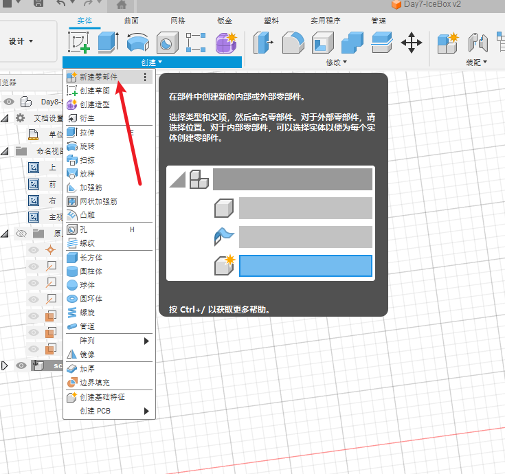

## 创建-圆柱体

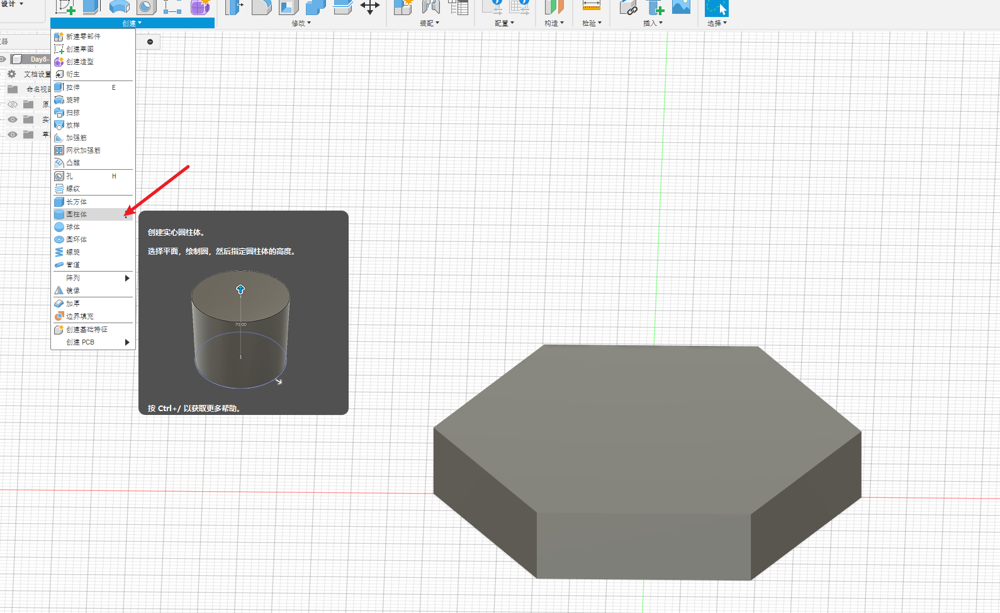

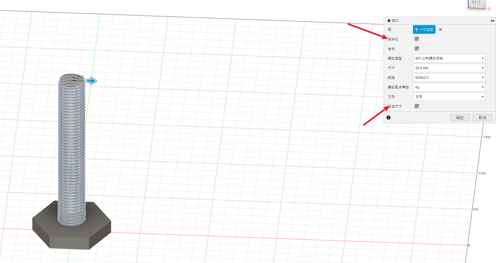

## 下面开始创建一个螺帽

## 新建零部件

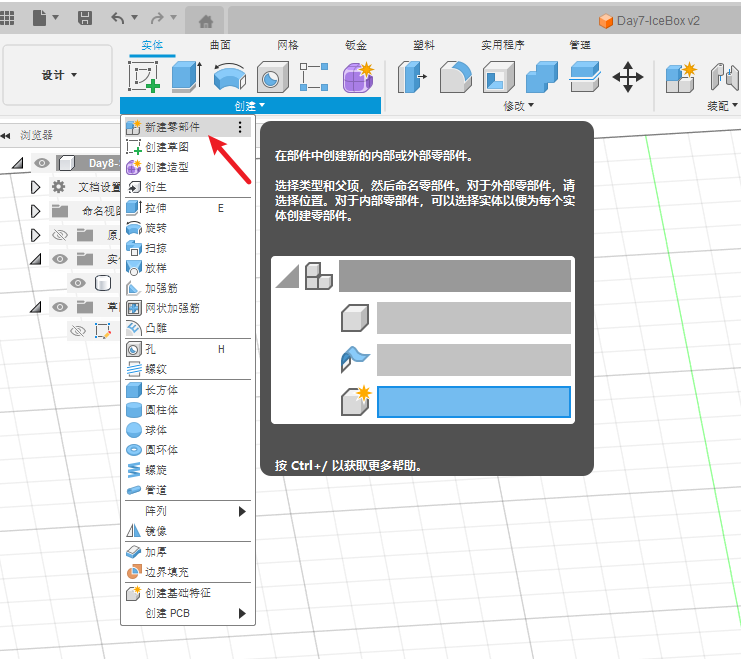

## 激活

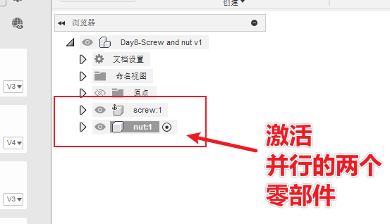

## 链接

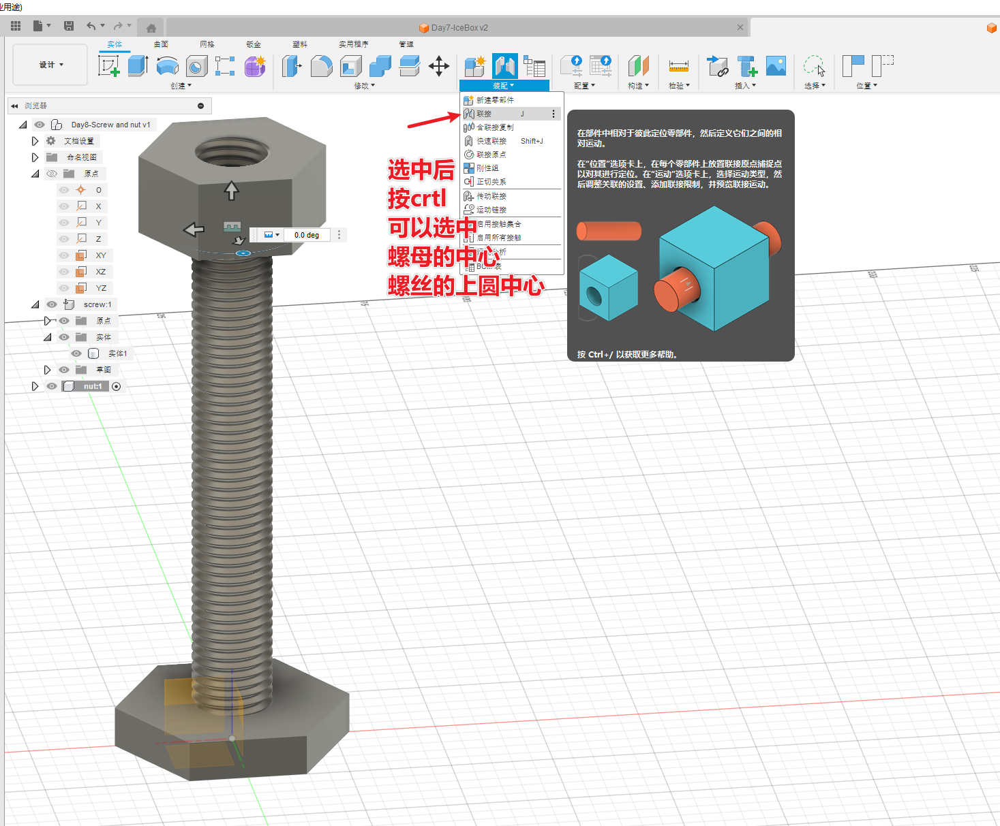

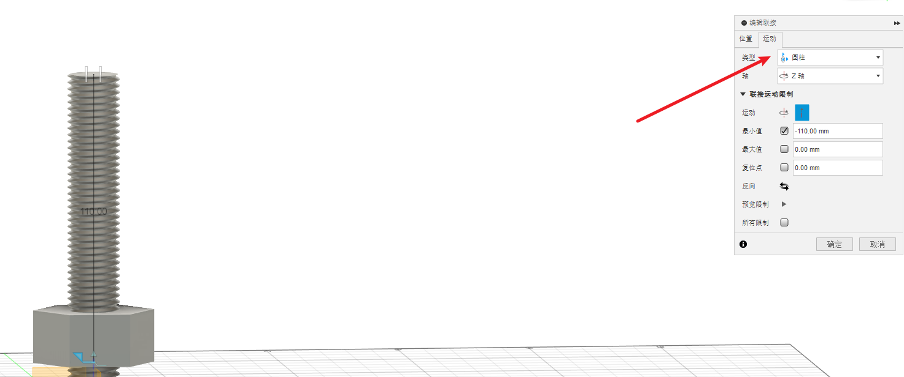

## 运动链接

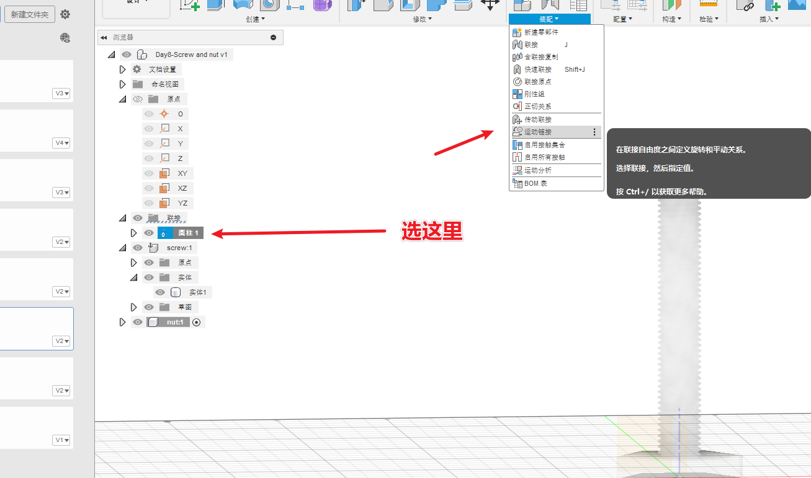

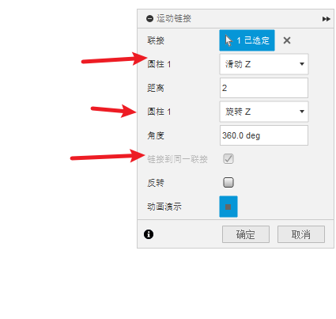

## 激活两个零部件

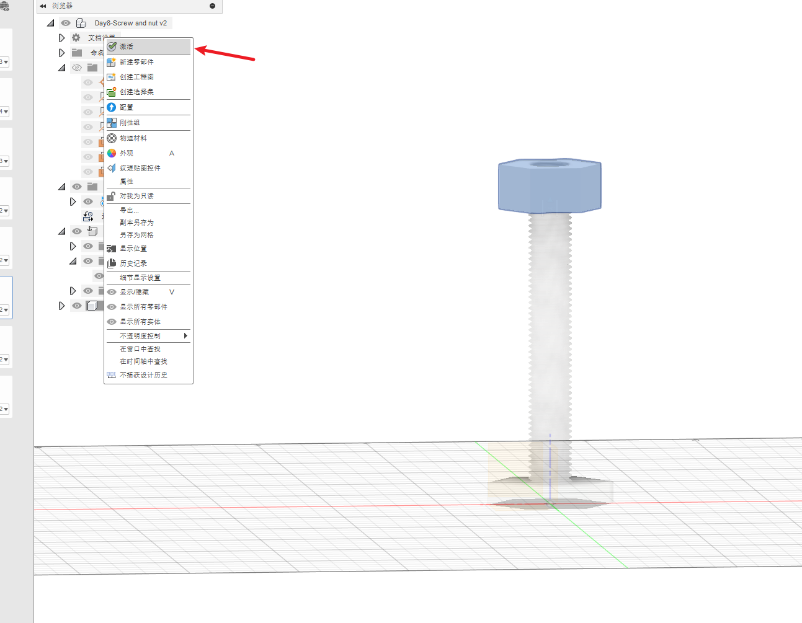

# 成品图

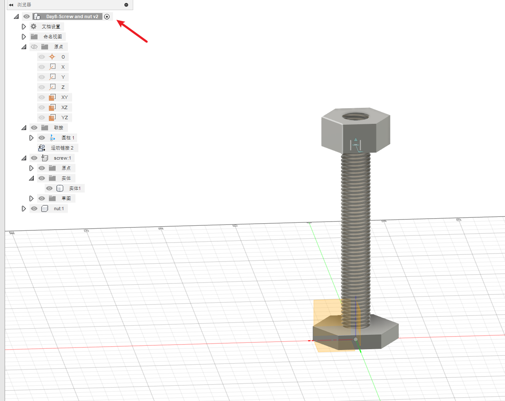