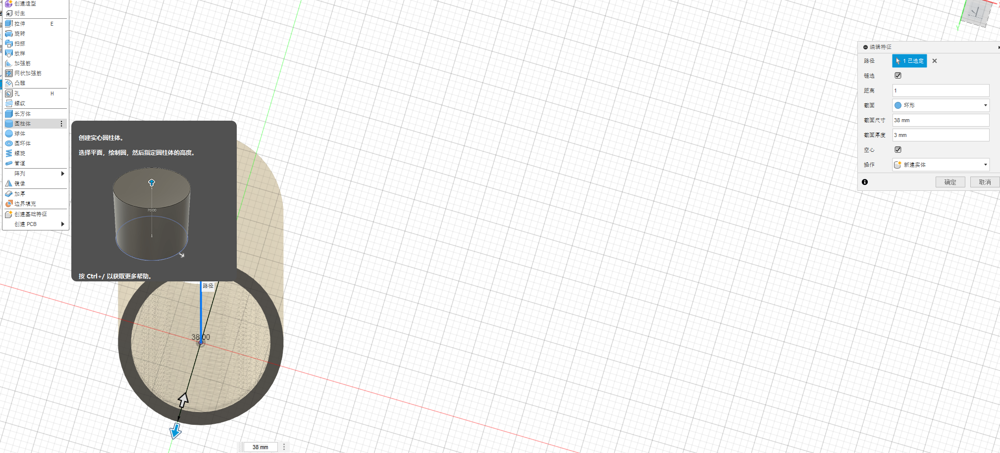
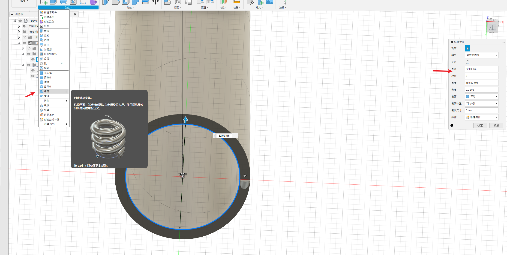
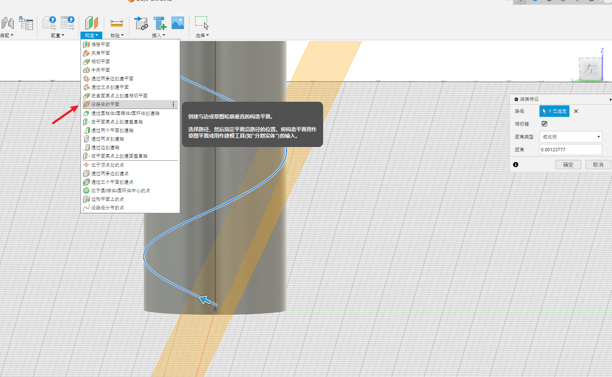
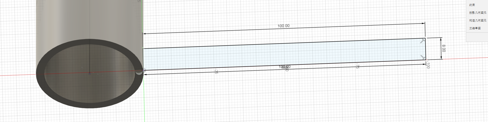
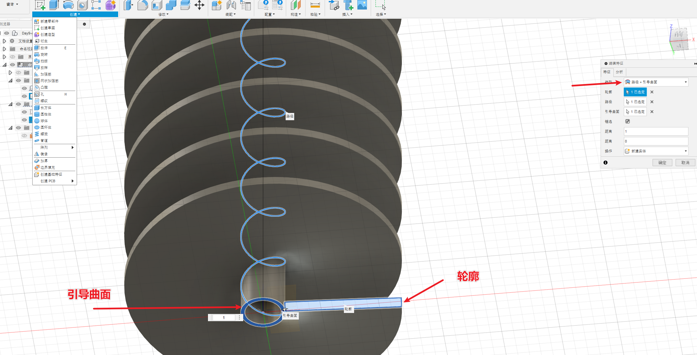
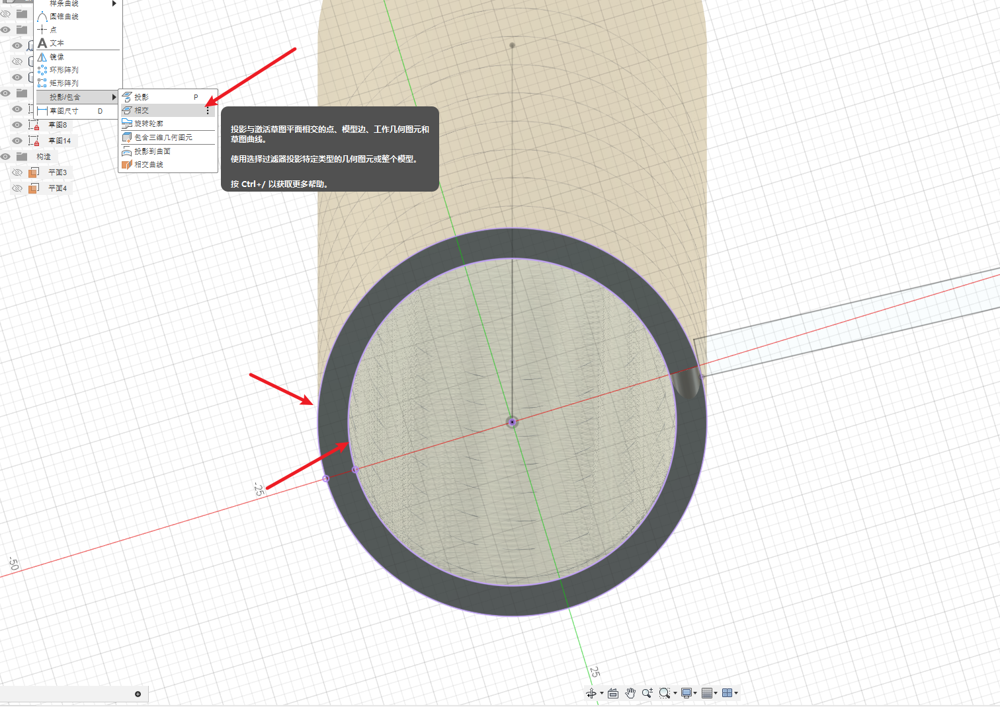
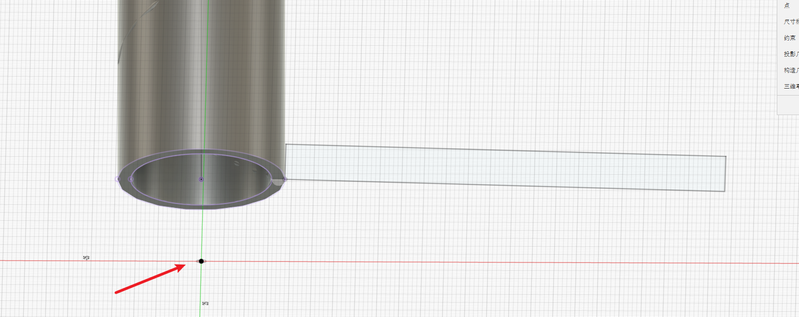
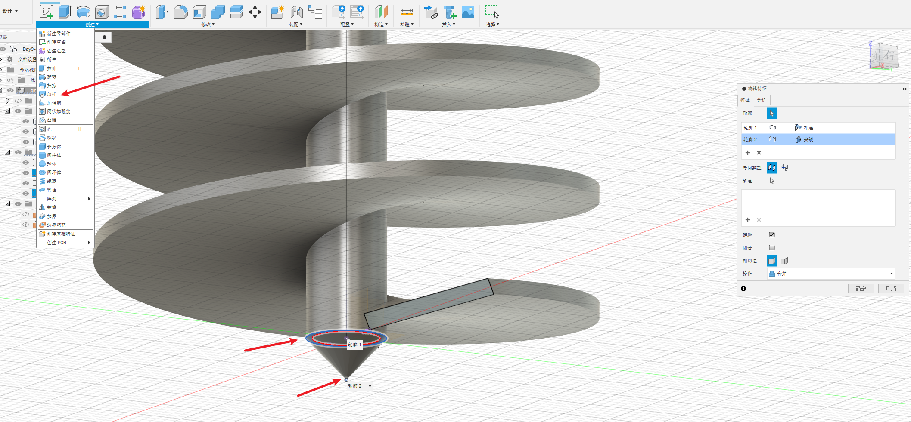
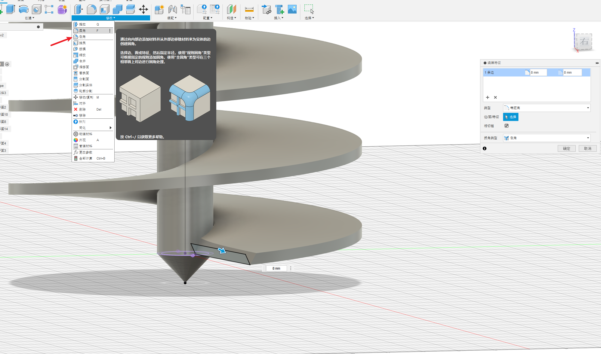

# 简介

根据B站的视频30天学会fusion 360 .这里针对每一个图纸的重点做一个记录。

参考https://www.bilibili.com/video/BV1UL4y177r8?spm_id_from=333.788.videopod.sections&vd_source=cde2e7b9bca1a7048a13eaf0b48210b6

# 钻头

重点的步骤

* 生成一个圆柱，作为中心圆柱
  * 草图画直线，作为圆柱体的路径
  * 创建-圆柱体
* 生成螺旋，作为钻头叶片的路径
  * 创建-螺旋
* 生成一个螺旋的平面，绘制一个矩形，作为钻头的页面
  * 构造-沿路径的平面

* 绘制钻头的页面
  * 扫掠：路径-引导曲面
* 绘制钻头的尖尖
  * 先将圆柱的界面投影， 草图-创建-投影\包含-相交 **相交”**工具可捕获形状的横截面并将其合并到草图中。
  * 偏移平面，草图-点
  * 放样
* 做出开始的切面
  * 修改-倒角

## 创建-圆柱体

## 创建-螺旋

## 构造-沿路径的平面

下面的矩形就是在这个斜着的平面上绘制的草图

## 扫掠

选择类型是路径-引导曲面

其中路径-引导曲面 还有路径-引导轨道的区别参考官网。实际我我也没看出什么区别。。

https://help.autodesk.com/view/fusion360/CHS/?guid=SLD-SWEEP-SOLID

## 草图-创建-投影\包含-相交

参考 https://help.autodesk.com/view/fusion360/CHS/?guid=SKT-SKETCH-CREATE-PROJECT-INCLUDE

好像作用是为了将界面作为一个部分可以选取。

选圆柱的两个边后会变紫色。

偏移平面后画一个点

## 放样

## 修改-倒角

# 附录

* 扫掠实体 https://help.autodesk.com/view/fusion360/CHS/?guid=SLD-SWEEP-SOLID