# 1 GPU架构与算力

[算力查询](https://developer.nvidia.com/cuda-gpus)

| Fermi | Kepler | Maxwell | Pascal | Volta | Turing | Ampere              | Ada (Lovelace) | [Hopper](https://www.nvidia.com/en-us/data-center/hopper-architecture/) |
| ----- | ------ | ------- | ------ | ----- | ------ | ------------------- | -------------- | ------------------------------------------------------------ |
| sm_20 | sm_30  | sm_50   | sm_60  | sm_70 | sm_75  | sm_80               | sm_89          | sm_90                                                        |
|       | sm_35  | sm_52   | sm_61  | sm_72 |        | sm_86               |                | sm_90a                                                       |
|       | sm_37  | sm_53   | sm_62  |       |        | sm_87 (Jetson Orin) |                |                                                              |

### Fermi cards (CUDA 3.2 until CUDA 8)

Deprecated from CUDA 9, support completely dropped from CUDA 10.

- **SM20 or SM_20, compute_30** – 
  GeForce 400, 500, 600, GT-630.
  ***Completely dropped from CUDA 10 onwards.\***

### Kepler cards (CUDA 5 until CUDA 10)

Deprecated from CUDA 11.

- **SM30 or `SM_30, compute_30` –** 
  Kepler architecture (e.g. generic Kepler, GeForce 700, GT-730). 
  Adds support for unified memory programming
  ***Completely dropped from CUDA 11 onwards**.*
- **SM35 or `SM_35, compute_35`** – 
  Tesla K40.
  Adds support for dynamic parallelism. 
  **Deprecated from CUDA 11, will be dropped in future versions**.
- **SM37 or `SM_37, compute_37`** – 
  Tesla K80.
  Adds a few more registers. 
  ***Deprecated from CUDA 11, will be dropped in future versions***, strongly suggest replacing with a [32GB PCIe Tesla V100](https://www.amazon.com/gp/product/B07JVNHFFX/ref=as_li_tl?ie=UTF8&camp=1789&creative=9325&creativeASIN=B07JVNHFFX&linkCode=as2&tag=arnonshimoni-20&linkId=039f38074e50b581e71d500cd08bca85).

### Maxwell cards (CUDA 6 until CUDA 11)

- **SM50 or `SM_50, compute_50`** – 
  Tesla/Quadro M series. 
  ***Deprecated from CUDA 11, will be dropped in future versions***, strongly suggest replacing with a [Quadro RTX 4000](https://www.amazon.com/gp/product/B07P6CDHS5/ref=as_li_tl?ie=UTF8&camp=1789&creative=9325&creativeASIN=B07P6CDHS5&linkCode=as2&tag=arnonshimoni-20&linkId=fe1f6fa6ad408060f634a35bad4271ce) or [A6000](https://www.amazon.com/PNY-VCNRTXA6000-PB-NVIDIA-RTX-A6000/dp/B09BDH8VZV?crid=3QY8KCKXO3FB8&keywords=rtx+a6000&qid=1647969665&sprefix=rtx+a6000%2Caps%2C174&sr=8-1&linkCode=ll1&tag=arnonshimoni-20&linkId=d292ba4d995d2b034a27441321668ffb&language=en_US&ref_=as_li_ss_tl).
- **SM52 or `SM_52, compute_52`** – 
  Quadro M6000 , GeForce 900, GTX-970, GTX-980, GTX Titan X.
- **SM53 or `SM_53, compute_53`** – 
  Tegra (Jetson) TX1 / Tegra X1, Drive CX, Drive PX, Jetson Nano.

### **Pascal (CUDA 8 and later)**

- **SM60 or `SM_60, compute_60`** – 
  Quadro GP100, Tesla P100, DGX-1 (Generic Pascal)
- **SM61 or `SM_61, compute_61`**– 
  GTX  1080, GTX 1070, GTX 1060, GTX 1050, GTX 1030 (GP108), GT 1010 (GP108)  Titan Xp, Tesla P40, Tesla P4, Discrete GPU on the NVIDIA Drive PX2
- **SM62 or `SM_62, compute_62`** – 
  Integrated GPU on the NVIDIA Drive PX2, Tegra (Jetson) TX2 

### Volta (CUDA 9 and later)

- **SM70 or `SM_70, compute_70`** – 
  DGX-1 with Volta, Tesla V100, GTX 1180 (GV104), Titan V, Quadro GV100
- **SM72 or `SM_72, compute_72`** –
  Jetson AGX Xavier, Drive AGX Pegasus, Xavier NX 

### Turing (CUDA 10 and later)

- **SM75 or `SM_75, compute_75`** – 
  GTX/RTX Turing – GTX 1660 Ti, RTX 2060, [RTX 2070](https://www.amazon.com/gp/product/B082P1BF7H/ref=as_li_tl?ie=UTF8&camp=1789&creative=9325&creativeASIN=B082P1BF7H&linkCode=as2&tag=arnonshimoni-20&linkId=68e78b128dd90f652eb7796404e2126f), RTX 2080, Titan RTX, Quadro RTX 4000, Quadro RTX 5000, Quadro RTX 6000, Quadro RTX 8000, Quadro T1000/T2000, Tesla T4 

### Ampere (CUDA 11.1 and later)

- **SM80 or `SM_80, compute_80`** – 
  NVIDIA A100 (the name “Tesla” has been dropped – GA100), NVIDIA DGX-A100
- ***\*SM86 or `SM_86, compute_86`\** –** (from [CUDA 11.1 onwards](https://docs.nvidia.com/cuda/ptx-compiler-api/index.html))
  Tesla GA10x cards, RTX Ampere – RTX 3080, GA102 – RTX 3090, RTX A2000, A3000, [RTX A4000](https://www.amazon.com/PNY-NVIDIA-Quadro-A6000-Graphics/dp/B08NWGS4X1?msclkid=45987a9faa0411ec98c321cb30a0780e&linkCode=ll1&tag=arnonshimoni-20&linkId=ccac0fed7c3cac61b4373d7dac6e7136&language=en_US&ref_=as_li_ss_tl), A5000, [A6000](https://www.amazon.com/PNY-VCNRTXA6000-PB-NVIDIA-RTX-A6000/dp/B09BDH8VZV?crid=3QY8KCKXO3FB8&keywords=rtx+a6000&qid=1647969665&sprefix=rtx+a6000%2Caps%2C174&sr=8-1&linkCode=ll1&tag=arnonshimoni-20&linkId=d292ba4d995d2b034a27441321668ffb&language=en_US&ref_=as_li_ss_tl), NVIDIA A40, GA106 – [RTX 3060](https://www.amazon.com/gp/product/B08W8DGK3X/ref=as_li_qf_asin_il_tl?ie=UTF8&tag=arnonshimoni-20&creative=9325&linkCode=as2&creativeASIN=B08W8DGK3X&linkId=5cb5bc6a11eb10aab6a98ad3f6c00cb9), GA104 – RTX 3070, GA107 – RTX 3050, RTX A10, RTX A16, RTX A40, A2 Tensor Core GPU

- ***\*SM87 or `SM_87, compute_87`\** –** (from [CUDA 11.4 onwards](https://docs.nvidia.com/cuda/ptx-compiler-api/index.html), introduced with PTX ISA 7.4 / Driver r470 and newer) – for Jetson AGX Orin and Drive AGX Orin only

> “*Devices of compute capability 8.6 have 2x more FP32 operations  per cycle per SM than devices of compute capability 8.0. While a binary  compiled for 8.0 will run as is on 8.6, it is recommended to compile  explicitly for 8.6 to benefit from the increased FP32 throughput.*“
>
> 
>
> https://docs.nvidia.com/cuda/ampere-tuning-guide/index.html#improved_fp32

### Lovelace (CUDA 11.8 and later)

- **SM89 or `SM_89, compute_`89** –
  NVIDIA GeForce RTX 4090, RTX 4080, RTX 6000, Tesla L40

### Hopper (CUDA 12 and later)

- **SM90 or `SM_90, compute_90`** –
  NVIDIA H100 (GH100)
- **SM90a or `SM_90a, compute_90a`** – (for PTX ISA version 8.0) – adds acceleration for features like wgmma and setmaxnreg

## 1.1 Tesla 架构

Tesla 架构的资料在官网也没找到多少，不过这是英伟达第一个实现**统一着色器模型**的微架构。

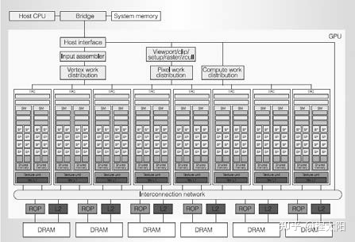

经典型号是**G80**，在Fermi架构白皮书的开篇部分有对G80的简要介绍：

- G80 是第一款支持 C 语言的 GPU，让程序员无需学习新的编程语言即可使用GPU的强大功能。
- G80 是第一款用单一、统一的处理器取代独立的顶点和像素管道的 GPU，该处理器可以执行顶点、几何、像素和计算程序。
- G80 是第一款使用标量线程处理器的 GPU，无需程序员手动管理向量寄存器
- G80 引入了单指令多线程 (SIMT) 执行模型，即多个独立线程使用一条指令并发执行。
- G80 为线程间通信引入了共享内存(shared memory)和屏障同步(barrier synchronization)。

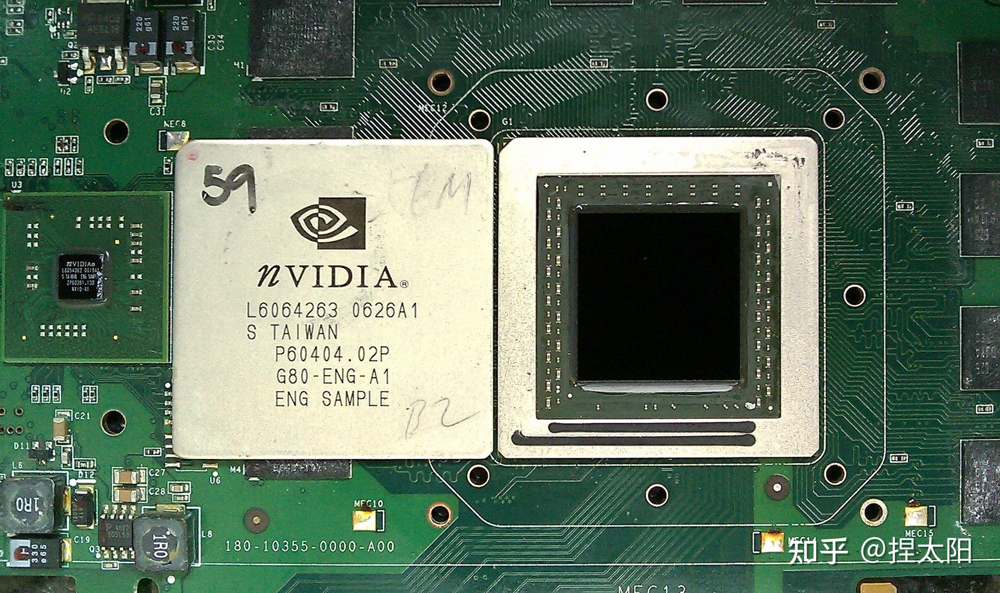

G80 显卡

## 1.2 Fermi架构

Fermi 架构是NVIDIA GPU 架构自初代 G80 以来最重大的飞跃。

NVIDIA的GPU研发团队从G80和GT200两个型号上汲取经验，采用全新的设计方法来创建世界上第一个计算 GPU。在这个过程中，专注于提高以下关键领域：

- **提高双精度性能**——虽然单精度浮点性能大约是桌面 CPU 性能的十倍，但一些 GPU 计算应用程序也需要更高的双精度性能。
- **ECC 支持**——ECC 允许 GPU 计算用户在数据中心安装中安全地部署大量 GPU，并确保医疗成像和金融期权定价等数据敏感应用程序免受内存错误的影响。
- **True Cache Hierarchy**—— 一些并行算法无法使用 GPU 的共享内存，用户需要一个真正的缓存架构来帮助他们。
- **更多共享内存**——许多 CUDA 程序员要求超过 16 KB 的 SM 共享内存来加速他们的应用程序。
- **更快的上下文切换**——用户要求在应用程序和更快的图形和计算互操作之间进行更快的上下文切换。
- **更快的原子操作**(Atomic Operations)——用户要求为他们的并行算法提供更快的读-修改-写原子操作。

基于以上出发点，Fermi架构有以下四大亮点：

第三代流式多处理器 (SM)

- 每个 SM 有 32 个 CUDA 内核，是 GT200 的 4 倍
- 8 倍于 GT200 的峰值双精度浮点性能
- Dual Warp Scheduler 同时调度和分派来自两个独立 warp 的指令
- 64 KB RAM，可配置共享内存和  L1 cache

第二代并行线程执行 ISA

- 具有完整 C++ 支持的统一地址空间
- 针对 OpenCL 和 DirectCompute 进行了优化
- 完整的 IEEE 754-2008 32 位和 64 位精度
- 带有 64 位扩展的完整 32 位整数路径
- 支持过渡到 64 位寻址的内存访问指令
- 通过预测提高性能

改进的内存子系统

- 具有可配置 L1 和Unified L2 Caches 的 NVIDIA Parallel DataCache TM 层次结构
- 第一个支持 ECC 内存的 GPU
- 大幅提升原子内存操作性能

NVIDIA GigaThread TM 引擎

- 应用程序上下文切换速度提高 10 倍
- 并发内核执行
- 乱序线程块执行
- 双重叠内存传输引擎

以上是Fermi 架构相较于初代架构提升的地方

下面具体看看Fermi 架构的配置

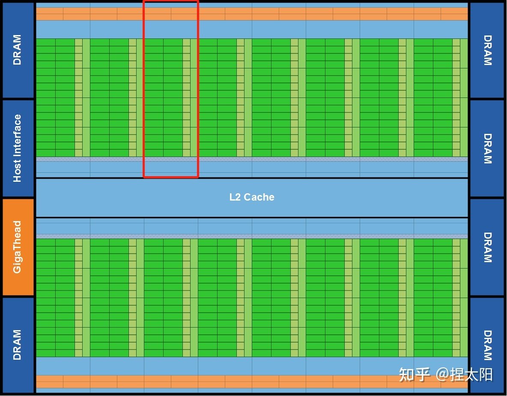

Fermi 架构

第一个基于Fermi架构的GPU，使用 30 亿个晶体管实现，共计512个CUDA内核。

这512 个 CUDA 内核被组织成 16 个 SM，每个 SM 是一个**垂直的矩形条带**(红框中的内容)，分别位于一个普通的 L2 cache周围，每个 SM 有32 个CUDA 内核。 

**一个CUDA 内核为一个线程在每个时钟周期里执行一条浮点或整数指令**。

6个64-bit显存分区，组成一个384-bit的显存接口，总共支持高达 6GB 的 GDDR5 DRAM显存。

> GDDR5：第五版图形用双倍数据传输率存储器
> DRAM：动态随机存取存储器

主机接口(host interface )通过 PCI-Express 将 GPU 连接到 CPU。 Giga Thread 全局调度器将线程块分发给 SM 线程调度器。

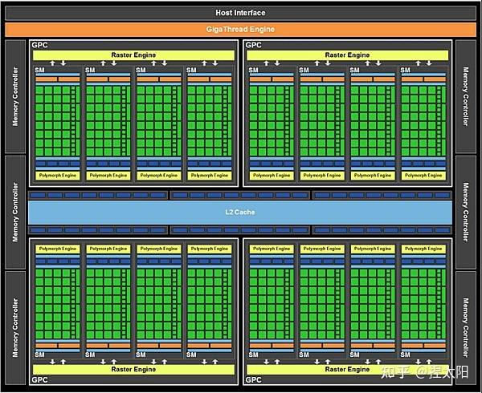

Fermi图形渲染架构

整个 GPU 有多个 GPC(图形处理集群)，单个GPC包含一个光栅引擎(Raster Engine)，四个 SM（流式多处理器），GPC 可以被认为是一个独立的 GPU。所有从 Fermi 开始的 NVIDIA GPU，都有 GPC。

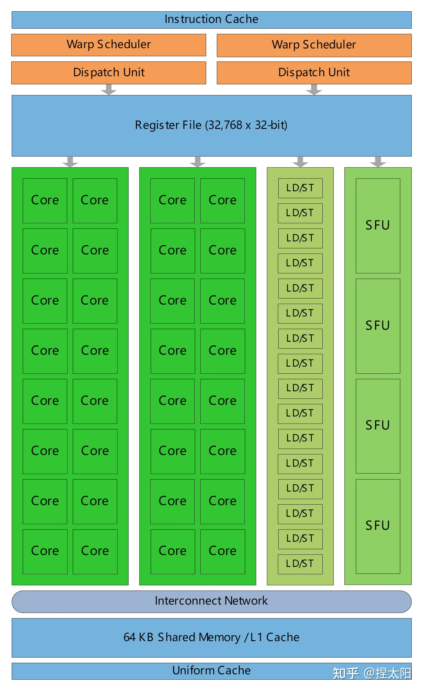

Fermi Streaming Multiprocessor (SM)

上图是将16个SM中的 1 个拿出来放大后的详细结构图，其中包含：

- 橙色部分：2 个 Warp Scheduler/Dispatch Unit
- 绿色部分：32 个 CUDA 内核，分在两条 lane 上，每条分别是 16 个
- 浅蓝色部分：register file-寄存器文件和 L1 cache
- 16 个 Load/Store units (LD/ST Unit)
- 4 个 Special Function Units (SFU)

**每个 SM 具有 32 个 CUDA 内核**，就是图中写着Core的绿色小方块儿，每个 CUDA 内核都有一个完全流水线化的整数算术逻辑单元 (ALU) 和浮点单元 (FPU)：

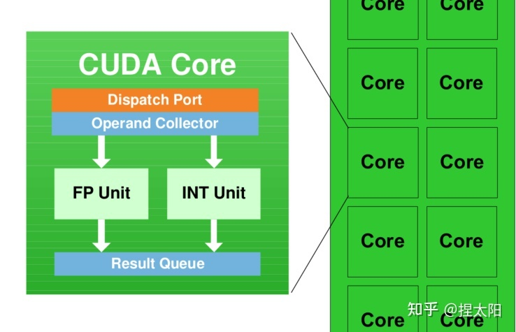

CUDA 内核

SM（Streaming Multiprocessors）是GPU架构中非常重要的部分，GPU硬件的并行性就是由SM决定的。

## 1.3 Kepler架构

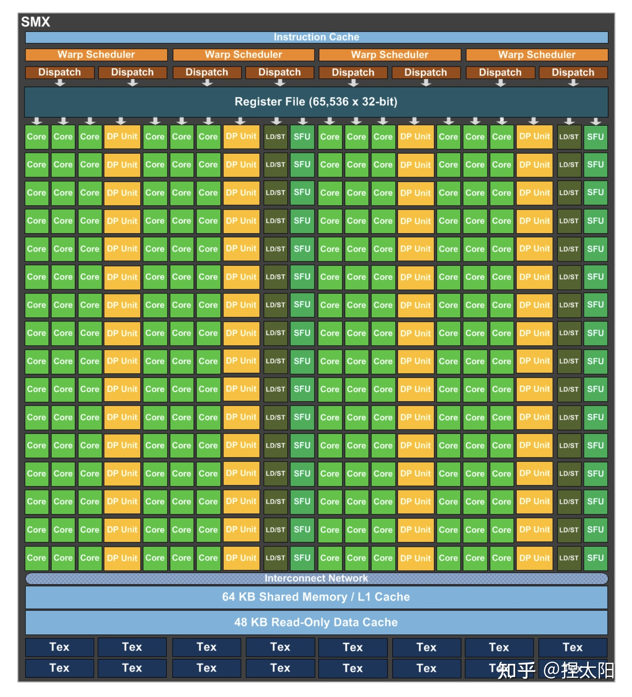

Kepler架构的思路是：减少SM单元数(在这一代中叫SMX单元)，增加每组SM单元中的CUDA内核数。在Kepler架构中，每个SM单元的CUDA内核数由Fermi架构的32个激增至192个。

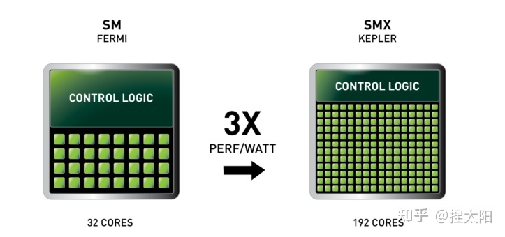

在每个SMX中：

- 4 个 Warp Scheduler，8 个 Dispatch Unit
- 绿色：192个 CUDA 内核，分在12条 lane 上，每条分别是 16 个
- 黄色：64 个DP双精度运算单元，分在4条 lane 上，每条 lane 上 16 个
- 32 个 LD/ST Unit 
- 32 个 SFU  

## 1.4 Maxwell架构

Maxwell架构的SM单元和Kepler架构相比，又有很大变化，这一代的SM单元更像是把4个Fermi 架构的SM单元，按照2x2的方式排列在一起，这一代称为SMM单元：

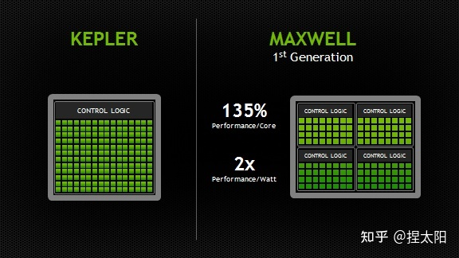

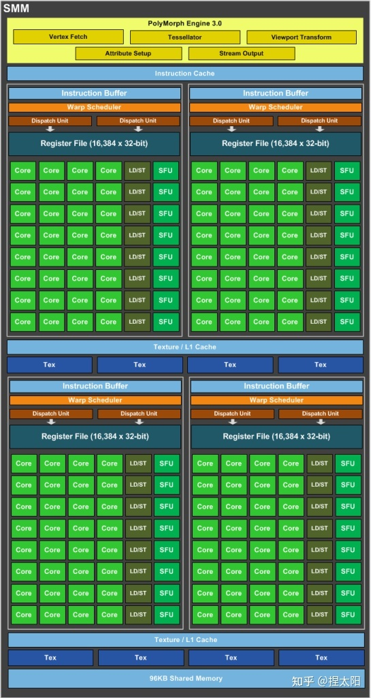

SMM 使用基于象限的设计，具有四个 32 核处理块(processing blocks)，每个处理块都有一个专用的 warp 调度程序，能够在每个时钟分派两条指令。 

每个 SMM 单元提供

- 八个纹理单元(texture units)
- 一个多态引擎(polymorph engine-图形的几何处理)
- 专用寄存器文件和共享内存。

每个处理块中：

- 1个 Warp Scheduler，2 个 Dispatch Unit
- 绿色：32个 CUDA 内核
- 8个 LD/ST Unit 
- 8个 SFU  

CUDA内核总数 从Kpler时代的每组SM单元192个减少到了每组128个，但是每个SMM单元将拥有更多的逻辑控制电路，便于精确控制。

> 参考：
> [Maxwell: The Most Advanced CUDA GPU Ever Made | NVIDIA Developer Blog](https://developer.nvidia.com/blog/maxwell-most-advanced-cuda-gpu-ever-made/)

## **1.5 Pascal架构**

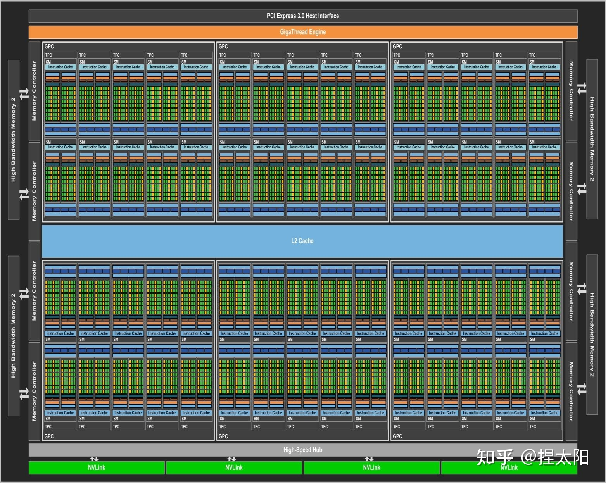

pascal架构的GP100核心

这里有一个新概念：**核心**

NVIDIA不同的架构会有几种不同的核心，Pascal架构有GP100、GP102两种大核心：

- GP100：3840个CUDA核心，60组SM单元；
- GP102：3584个CUDA核心，28组SM单元；

> 第2组数据存疑

**核心**是一个完整的GPU模组，上图展示了一个pascal架构的GP100核心，带有 60 个 SM 单元。

不同的显卡产品可以使用不同的 GP100 配置，一般是满配或者减配，比如Tesla P100 使用了 56 个 SM 单元。

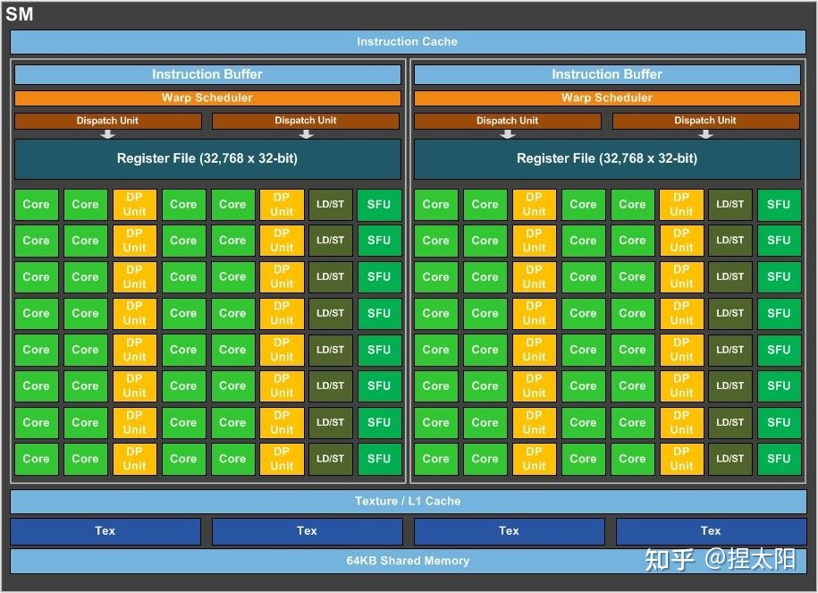

GP100核心的SM单元

每个SM单元中，分为2个Process Block，每个Process Block中：

- 1个 Warp Scheduler，2 个 Dispatch Unit
- 绿色：32个 CUDA 内核
- **黄色：16 个DP双精度运算单元，分在2条 lane 上，每条 lane 上 8个**
- 8个 LD/ST Unit 
- 8个 SFU  

CUDA内核总数从Maxwell时代的每组SM单元128个减少到了每组64个，这一代最大的特点是又把DP双精度运算单元加回来了。

制程工艺升级到了16nm，性能大幅提升，功耗却不增加。

## **1.6 Volta架构**

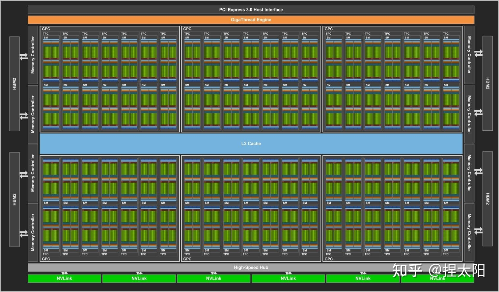

Volta架构的GV100核心

GV100核心的SM单元

每个SM单元中，分为4个Process Block，每个Process Block中：

- 1个 Warp Scheduler，1个 Dispatch Unit
- 8 个 FP64 Core
- 16 个 INT32 Core
- 16 个 FP32 Core
- 2 个 Tensor Core
- 8个 LD/ST Unit 
- 4个 SFU 

在前几代架构中：

**一个CUDA 内核在每个时钟周期里只能为一个线程执行一条浮点或整数指令**。

但是从Volta架构开始，将一个CUDA 内核拆分为两部分：FP32 和 INT32，好处是在同一个时钟周期里，可以同时执行浮点和整数指令，提高计算速度。

Volta架构在传统的单双精度计算之外还增加了专用的**Tensor Core**张量单元，用于深度学习、AI运算等。

## **1.7 Turing架构**

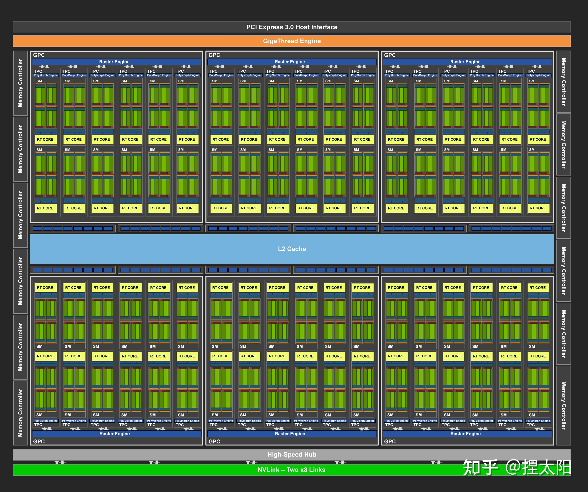

Turing架构的TU102核心

Turing架构目前一共有三种核心：

- TU102核心
- TU104核心
- TU106核心

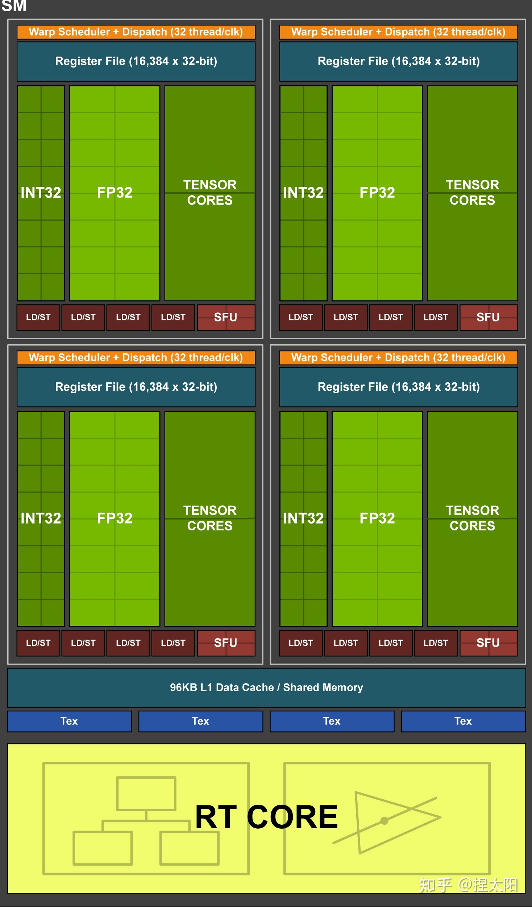

TU102核心的SM单元

每个SM单元有4个处理块，每个处理块中：

- 1 个 Warp Scheduler，1 个 Dispath Unit
- 16 个 INT32 Core
- 16 个 FP32 Core
- 2 个 Tensor Core
- 4 个 LD/ST Unit
- 4 个 SFU

这一代架构去掉了对FP64的支持。

## **1.8 Ampere架构**

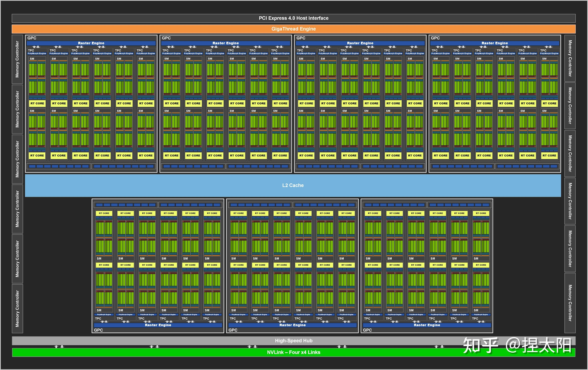

Ampere架构的GA102核心

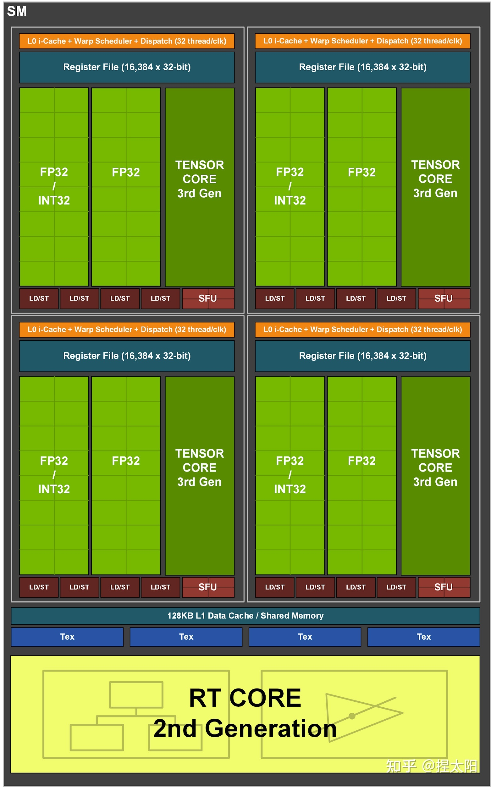

GA102核心的SM单元

每个SM单元分成4个处理块，每个处理块中：

- 1 个 Warp Scheduler，1 个 Dispatch Unit
- 8 个 FP64 Core
- 16 个 FP32 Core
- 16 个 INT32 Core
- 1 个 Tensor Core
- 8 个 LD/ST Unit
- 4 个 SFU

这一代架构又把FP64 Core加回来了，同时也是自Volta架构以来的，NVIDIA第三代Tensor技术，保持一代架构更新一次Tensor。

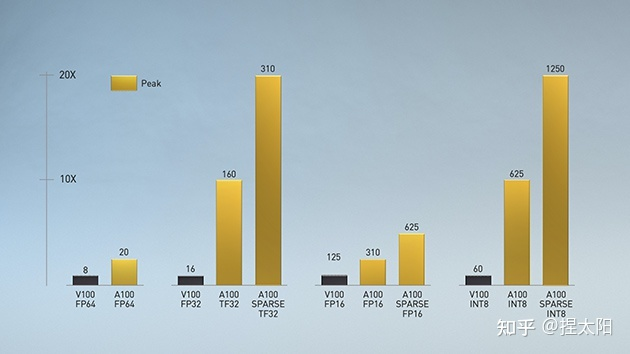

暂时写到这里，还有好多不足的地方，在后面的学习过程中慢慢补充。

# 附录

[算力查询](https://developer.nvidia.com/cuda-gpus)