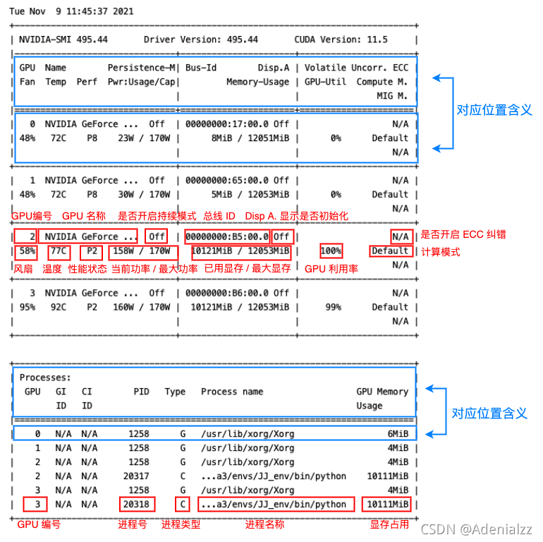

## nvidia-smi 命令详解

## 简介

nvidia-smi - NVIDIA System Management Interface program

nvidia smi（也称为NVSMI）为来自 Fermi 和更高[体系结构](https://so.csdn.net/so/search?q=体系结构&spm=1001.2101.3001.7020)系列的 nvidia Tesla、Quadro、GRID 和 GeForce 设备提供监控和管理功能。GeForce  Titan系列设备支持大多数功能，为GeForce品牌的其余部分提供的信息非常有限。NVSMI是一种跨平台工具，支持所有标准NVIDIA驱动程序支持的Linux发行版，以及从Windows Server 2008 R2开始的64位版本的Windows。

详细的信息可以去手册中查找：`man nvidia-smi`。

## nvidia-smi 命令

直接在命令行输入 `nvidia-smi` 命令应该是各位炼丹师再熟悉不过的命令了。

> 注意：建议使用 `watch -n 0.5 nvidia-smi` 来动态地观察 GPU 的状态。

通过 nvidia-smi 命令，我们会得到这样一个信息丰富的页面：

```bash
Tue Nov  9 13:47:51 2021
+-----------------------------------------------------------------------------+
| NVIDIA-SMI 495.44       Driver Version: 495.44       CUDA Version: 11.5     |
|-------------------------------+----------------------+----------------------+
| GPU  Name        Persistence-M| Bus-Id        Disp.A | Volatile Uncorr. ECC |
| Fan  Temp  Perf  Pwr:Usage/Cap|         Memory-Usage | GPU-Util  Compute M. |
|                               |                      |               MIG M. |
|===============================+======================+======================|
|   0  NVIDIA GeForce ...  Off  | 00000000:17:00.0 Off |                  N/A |
| 62%   78C    P2   155W / 170W |  10123MiB / 12051MiB |    100%      Default |
|                               |                      |                  N/A |
+-------------------------------+----------------------+----------------------+
|   1  NVIDIA GeForce ...  Off  | 00000000:65:00.0 Off |                  N/A |
|100%   92C    P2   136W / 170W |  10121MiB / 12053MiB |     99%      Default |
|                               |                      |                  N/A |
+-------------------------------+----------------------+----------------------+
|   2  NVIDIA GeForce ...  Off  | 00000000:B5:00.0 Off |                  N/A |
| 32%   34C    P8    12W / 170W |      5MiB / 12053MiB |      0%      Default |
|                               |                      |                  N/A |
+-------------------------------+----------------------+----------------------+
|   3  NVIDIA GeForce ...  Off  | 00000000:B6:00.0 Off |                  N/A |
| 30%   37C    P8    13W / 170W |      5MiB / 12053MiB |      0%      Default |
|                               |                      |                  N/A |
+-------------------------------+----------------------+----------------------+

+-----------------------------------------------------------------------------+
| Processes:                                                                  |
|  GPU   GI   CI        PID   Type   Process name                  GPU Memory |
|        ID   ID                                                   Usage      |
|=============================================================================|
|    0   N/A  N/A      1258      G   /usr/lib/xorg/Xorg                  6MiB |
|    0   N/A  N/A     10426      C   ...a3/envs/JJ_env/bin/python    10111MiB |
|    1   N/A  N/A      1258      G   /usr/lib/xorg/Xorg                  4MiB |
|    1   N/A  N/A     10427      C   ...a3/envs/JJ_env/bin/python    10111MiB |
|    2   N/A  N/A      1258      G   /usr/lib/xorg/Xorg                  4MiB |
|    3   N/A  N/A      1258      G   /usr/lib/xorg/Xorg                  4MiB |
+-----------------------------------------------------------------------------+
```

其中显存占用和 GPU 利用率当然是我们最常来查看的参数，但是在一些情况下（比如要重点监控 GPU 的散热情况时）其他参数也很有用，笔者简单总结了一下该命令输出的各个参数的含义如下图：



可以看到其中各个位置的对应含义在输出本身中其实都已经指出了（蓝框），红框则指出了输出各个部分的含义，大部分输出的作用一目了然，这里笔者将其中几个不那么直观的参数简单整理一下：

- Fan：从0到100%之间变动，这个速度是计算机期望的风扇转速，实际情况下如果风扇堵转，可能打不到显示的转速。
- Perf：是性能状态，从P0到P12，P0表示最大性能，P12表示状态最小性能。
- Persistence-M：是持续模式的状态，持续模式虽然耗能大，但是在新的GPU应用启动时，花费的时间更少，这里显示的是off的状态。
- Disp.A：Display Active，表示GPU的显示是否初始化。
- Compute M：是计算模式。
- Volatile Uncorr. ECC：是否开启 ECC 纠错。
- type：进程类型。C 表示计算进程，G 表示图形进程，C+G 表示都有。