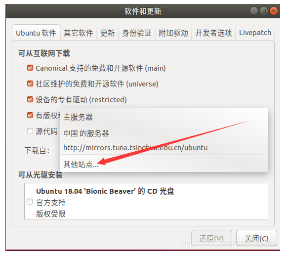
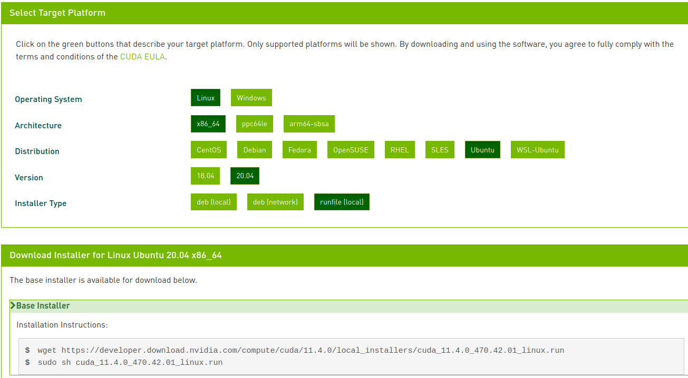
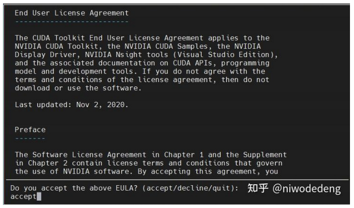
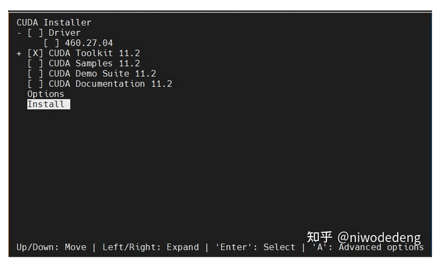
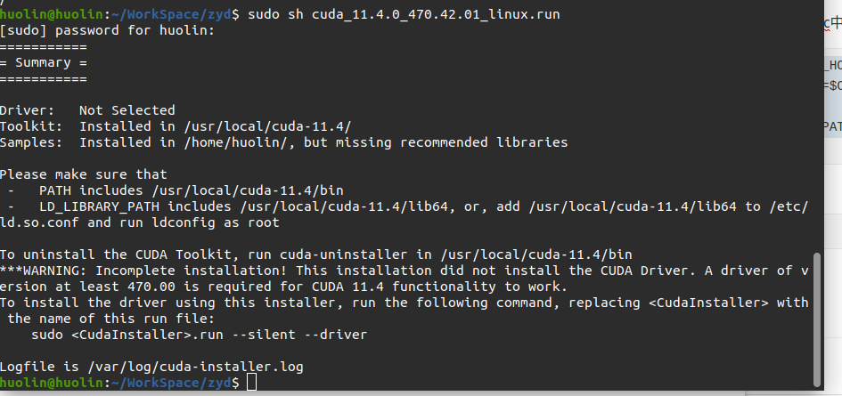
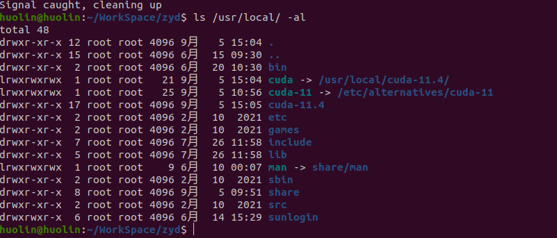
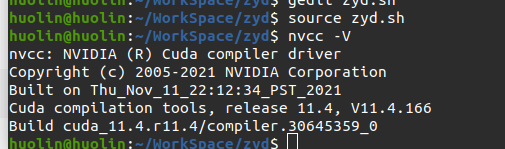
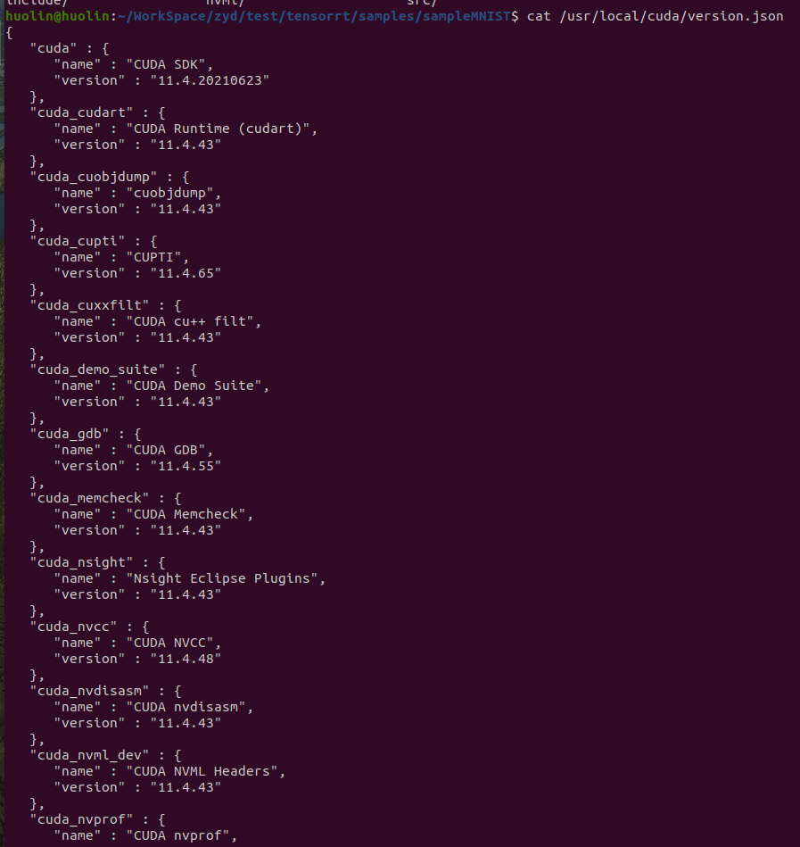
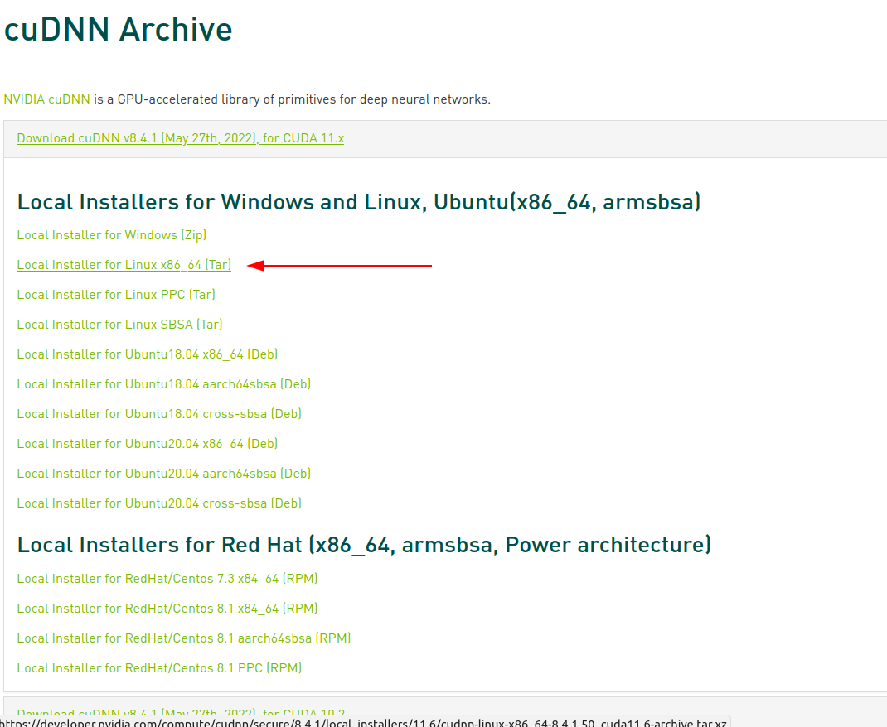
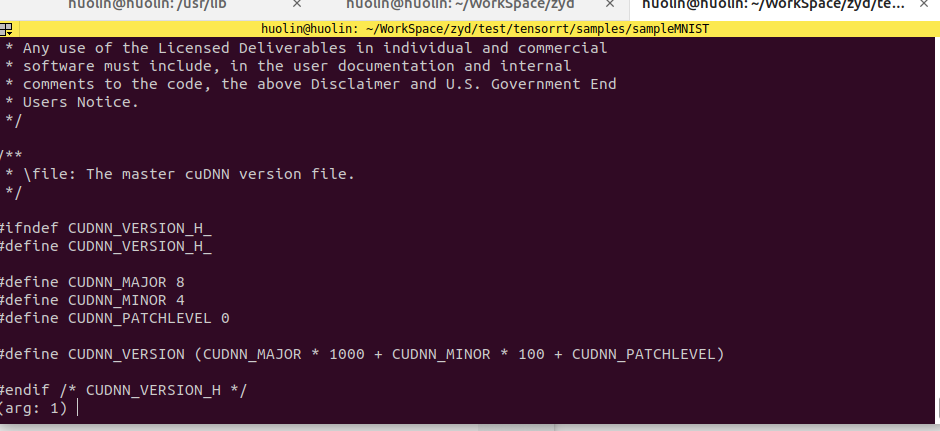

Nvidia diver是最基础的跟硬件直接交互的底层软件，cuda依赖于driver，cuDNN依赖于cuda，tensorRT最终模型的推理加速依赖于前面这些基础的加速环境。

搜索显卡
下面指令分别是查看集成显卡和查看NVIDIA显卡
```shell
 lspci | grep VGA 
 lspci | grep NVIDIA
```

# 1 GPU驱动安装
------
ubuntu显卡驱动安装有四中方法：

- 通过ubuntu仓库安装
- 在英伟达官网选择相应版本的驱动安装
- 在ubuntu软件和更新界面的附加驱动中安装
- -添加ppa源安装

## 1.1 ubuntu仓库安装

只需要一条指令即可安装成功，成功安装后需要重启

```shell
sudo ubuntu-drivers autoinstall
```

```bash
nvidia-smi  #若出现电脑GPU信息则成功
```

## 1.2 离线驱动安装

首先进入[英伟达官网](https://www.nvidia.com/Download/index.aspx?lang=en-us)

下载网址;https://www.nvidia.cn/Download/index.aspx?lang=cn


安装完成后nvidia-smi查看驱动信息


## 1.3 附加驱动安装方法

更新软件源



 在其他站点中选择清华源，更新后终端执行

```bash
sudo apt-get update
sudo apt-get upgrade
```

安装驱动：菜单栏选择附加驱动，会进行自动搜索，选择一个版本的专有驱动，点击应用更改，更改后重启即可，

## 1.4 ppa仓库安装

（1）首先禁用nouveau

```bash
sudo gedit /etc/modprobe.d/blacklist.conf
```

在最后一行添加

```bash
blacklist nouveau
options nouveau modeset=0 #禁用nouveau第三方驱动 本质就是禁用集显
```

（2）执行以下指令

```shell
sudo apt-get remove --purge nvidia*
sudo update -initramfs -u # 更新内核 这个最好不要随便执行，先跳过
sudo add-apt-repository ppa:graphics-drivers/ppa # 添加ppa源
sudo apt-get update
sudo apt-get install nvidia-driver-450 # 这里版本可以根据自己需求来
sudo apt-get install mesa-common-dev
sudo apt-get update
sudo apt-get upgrade
nvidia-smi # 用于确认是否安装成功
sudo sed -i "s/ppa\.launchpad\.net/lanuchpad.moruy.cn/g" /etc/apt/sources.list.d/*.list #ppa加速
```

# 2 深度学习环境

## 2.1 cuda安装

什么是CUDA

2006年11月，NVIDIA推出了CUDA，这是一个通用的并行计算平台和编程模型，它利用NVIDIA gpu中的并行计算引擎，以比CPU更高效的方式解决许多复杂的计算问题。

### 2.1.1 下载cuda

[下载链接](https://developer.nvidia.com/cuda-toolkit-archive)

这里下载的是11.4.0



按照官方的提示下载并运行run文件

```bash
wget https://developer.download.nvidia.com/compute/cuda/11.4.0/local_installers/cuda_11.4.0_470.42.01_linux.runsudo sh cuda_11.4.0_470.42.01_linux.run
```

按装出现下面提示，输入accept



由于上面已经安装过显卡的驱动了。这里把驱动安装取消（空格键）其他都选择上





### 2.1.2 设置权限

```bash
sudo chmod -R 755 /usr/local/cuda-11.4
```

安装完成后会有一个连接文件`/usr/local/cuda` 指向真正的`/usr/local/cuda-11.4`



### 2.1.3 配置环境变量

可以在~/.bashrc中加入环境变量

```shell
export CUDA_HOME=/usr/local/cuda
export PATH=$CUDA_HOME/bin:$PATH
export LD_LIBRARY_PATH=$CUDA_HOME/lib64:$LD_LIBRARY_PATH
```

2.1.4 验证安装

```shell
nvcc -V
```



版本信息

```shell
cat /usr/local/cuda/version.json
```



## 2.2 cuDNN安装

### 2.2.1 什么是cudnn

NVIDIA CUDA深度神经网络库(cuDNN)是一个用于深度神经网络的gpu加速库。cuDNN为标准例程提供了高度优化的实现，比如前向卷积、后向卷积、池化、归一化和激活层。cuDNN是NVIDIA深度学习SDK的一部分。

### 2.2.2 CUDA与CUDNN的关系

CUDA看作是一个工作台，上面配有很多工具，如锤子、螺丝刀等。cuDNN是基于CUDA的深度学习GPU加速库，有了它才能在GPU上完成深度学习的计算。它就相当于工作的工具，比如它就是个扳手。但是CUDA这个工作台买来的时候，并没有送扳手。想要在CUDA上运行深度神经网络，就要安装cuDNN，就像你想要拧个螺帽就要把扳手买回来。这样才能使GPU进行深度神经网络的工作，工作速度相较CPU快很多。

### 2.2.3 cudnn对cuda的影响

从官方安装指南可以看出，只要把cuDNN文件复制到CUDA的对应文件夹里就可以，即是所谓插入式设计，把cuDNN数据库添加CUDA里，cuDNN是CUDA的扩展计算库，不会对CUDA造成其他影响。

### 2.2.4 cudnn版本

[*NVIDIA cuDNN Support Matrix*](https://docs.nvidia.com/deeplearning/sdk/cudnn-support-matrix/index.html). 

根据下图描述，各个版本的对应关系如上面的链接


下图是最新的cudnn8.3.3的对应关系，历史版本的对应关系在 [*NVIDIA cuDNN Archives*](https://docs.nvidia.com/deeplearning/sdk/cudnn-archived/index.html). 的个版本的cudnn support Matrix中


从下图看出cudnn8.3.3支持的硬件和对应的cuda版本还有算力（SM）


### 2.2.5 cudnn下载

[下载地址](https://developer.nvidia.com/rdp/cudnn-archive)

这里选择的是cudnn-linux-x86_64-8.4.0.27_cuda11.6-archive.tar.xz



### 2.2.5 cudnn安装

```shell
tar -xvf cudnn-linux-x86_64-8.4.0.27_cuda11.6-archive.tar.xz 
cd cudnn-linux-x86_64-8.4.0.27_cuda11.6-archive
```

```shell
sudo cp include/cudnn*.h /usr/local/cuda-11.4/include 
sudo cp -P lib/libcudnn* /usr/local/cuda-11.4/lib64 
sudo chmod a+r /usr/local/cuda-11.4/include/cudnn*.h /usr/local/cuda-11.4/lib64/libcudnn*
sudo chmod -R 755 /usr/local/cuda-11.4
```

2.2.3 cuDNN版本查看

```shell
cat /usr/local/cuda/include/cudnn_version.h 
```




# 2.3 nvcc 和nvidia-smi

**nvcc** 属于CUDA的**编译器**，将程序编译成可执行的二进制文件，**nvidia-smi** 全称是 **NVIDIA  System Management Interface** ，是一种**命令行实用工具**，旨在帮助**管理和监控NVIDIA GPU设备。**

CUDA有 **runtime api** 和 **driver api**，两者都有对应的CUDA版本， nvcc --version 显示的就是前者对应的CUDA版本，而 nvidia-smi显示的是后者对应的CUDA版本。

用于支持driver api的必要文件由 **GPU driver installer** 安装，nvidia-smi就属于这一类API；而用于支持runtime api的必要文件是由 **CUDA Toolkit installer** 安装的。nvcc是与CUDA Toolkit一起安装的CUDA compiler-driver tool，**它只知道它自身构建时的CUDA runtime版本，并不知道安装了什么版本的GPU driver，甚至不知道是否安装了GPU driver。**

CUDA Toolkit Installer通常会集成了GPU driver Installer，如果你的CUDA均通过CUDA Tooklkit  Installer来安装，那么runtime api 和 driver api的版本应该是一致的，也就是说， nvcc --version 和  nvidia-smi 显示的版本应该一样。否则，你可能使用了单独的GPU driver installer来安装GPU  dirver，这样就会导致 nvidia-smi 和 nvcc --version 显示的版本不一致了。

通常，**driver api的版本能向下兼容runtime api的版本**，即 **nvidia-smi 显示的版本大于nvcc --version 的版本通常不会出现大问题。**

CUDA有两个主要的API：runtime(运行时) API和driver API。这两个API都有对应的CUDA版本（如9.0和11.1等）。

用于支持driver API的必要文件(如libcuda.so)是由GPU driver installer安装的。nvidia-smi就属于这一类API。
用于支持runtime API的必要文件(如libcudart.so以及nvcc)是由CUDA Toolkit installer安装的。（CUDA Toolkit Installer有时可能会集成了GPU driver Installer）。nvcc是与CUDA Toolkit一起安装的CUDA compiler-driver tool，它只知道它自身构建时的CUDA runtime版本。它不知道安装了什么版本的GPU driver，甚至不知道是否安装了GPU driver。
综上，如果driver API和runtime API的CUDA版本不一致可能是因为你使用的是单独的GPU driver installer，而不是CUDA Toolkit installer里的GPU driver installer。

runtime和driver API区别
runtime和driver API在很多情况非常相似，也就是说用起来的效果是等价的，但是你不能混合使用这两个API，因为二者是互斥的。也就是说在开发过程中，你只能选择其中一种API。简单理解二者的区别就是：runtime是更高级的封装，开发人员用起来更方便，而driver API更接近底层，速度可能会更快。

也就是说driver 与runtime并不是一一对应的哦，CUDA Toolkit（runtime）本质上只是一个工具包而已，所以我可以在同一个设备上安装很多个不同版本的CUDA Toolkit，比如同时安装了CUDA 9.0、CUDA 9.2、CUDA 10.0三个版本。既然NVIDIA显卡驱动和CUDA Toolkit本身是不具有捆绑关系的，也不是一一对应的关系，那为啥我们总是傻傻分不清楚呢。。。因为离线安装的CUDA Toolkit会默认携带与之匹配的最新的驱动程序！！！

这也就能解释，为啥NVIDIA的官网里同时有
CUDA Toolkit
和
NVIDIA Driver
两种下载了


# 2.4 pytorch匹配的版本选择

那么 nvcc --version 与 nvidia-smi 的版本不一致的情况下，有些朋友可能就会懵了：我该如何选择与CUDA版本匹配的Pytorch呢？（炼个丹也太南了吧~！）

其实，只要上去Pytorch官网瞄瞄，细心的你应该能够发现在命令中指定CUDA版本时，用的是 **cudatoolkit**，而 nvcc --version 显示的版本就是通过CUDA Toolkit Installer在安装时决定的，因此，我们**应该选择与 nvcc --version 对应的CUDA版本匹配的Pytorch。**


# 3 nvidia-smi

参考：https://www.jianshu.com/p/ceb3c020e06b

## 3.1 nvidia-smi介绍

nvidia-sim简称NVSMI，提供监控GPU使用情况和更改GPU状态的功能，是一个跨平台工具，支持所有标准的NVIDIA驱动程序支持的Linux和WindowsServer 2008 R2 开始的64位系统。这个工具是N卡驱动附带的，只要装好驱动，就会有这个命令

## 3.2 nvidia-smi常用命令介绍

### 3.2.1 显示GPU当前的状态：nvidia-smi


**表格参数详解：**

- **GPU：**本机中的GPU编号（有多块显卡的时候，从0开始编号）图上GPU的编号是：0
- **Fan：**风扇转速（0%-100%），N/A表示没有风扇
- **Name：**GPU类型，图上GPU的类型是：Tesla T4
- **Temp：**GPU的温度（GPU温度过高会导致GPU的频率下降）
- **Perf：**GPU的性能状态，从P0（最大性能）到P12（最小性能），图上是：P0
- **Persistence-M：**持续模式的状态，持续模式虽然耗能大，但是在新的GPU应用启动时花费的时间更少，图上显示的是：off
- **Pwr：Usager/Cap：**能耗表示，Usage：用了多少，Cap总共多少
- **Bus-Id：**GPU总线相关显示，domain：bus：device.function
- **Disp.A：**Display Active ，表示GPU的显示是否初始化
- **Memory-Usage：**显存使用率
- **Volatile GPU-Util：**GPU使用率
- **Uncorr. ECC：**关于ECC的东西，是否开启错误检查和纠正技术，0/disabled,1/enabled
- **Compute M：**计算模式，0/DEFAULT,1/EXCLUSIVE_PROCESS,2/PROHIBITED
- **Processes：**显示每个进程占用的显存使用率、进程号、占用的哪个GPU

### 3.2.2 隔几秒刷新一下显存状态：nvidia-smi -l  秒数

隔两秒刷新一下GPU的状态：**nvidia-smi -l 2**


### 3.2.3 将监控结果写入文件

```shell
nvidia-smi -l 1 --format=csv --filename=report.csv --query-gpu=timestamp,name,index,utilization.gpu,memory.total,memory.used,power.draw
```

- **-l：**隔多久记录一次，命令中写的是1
- **--format：**结果记录文件格式是csv
- **--filename:** 结果记录文件的名字
- **--query-gpu：**记录哪些数据到csv文件
- **timestamp：**时间戳
- **memory.total：**显存大小
- **memory.total：**显存使用了多少
- **utilization.gpu：**GPU使用率
- **power.draw：**显存功耗，对应Pwr：Usage

------

上面是显存监控中常用的几个命令，如果还有什么参数想了解，可以通过：

**nvidia-smi  -h**  命令查看

如果想调整结果记录文件的字段，可以通过下面的命令查看对应的字段：

**nvidia-smi --help-query-gpu**

### 3.2.4 命令参考网址

[nvidia-smi documentation](http://developer.download.nvidia.com/compute/DCGM/docs/nvidia-smi-367.38.pdf).

https://nvidia.custhelp.com/app/answers/detail/a_id/3751

# 4 TensorRT安装

EA 版本代表抢先体验（在正式发布之前）。
GA 代表通用性。 表示稳定版，经过全面测试。

# 附录：

[显卡驱动安装](https://blog.csdn.net/lixushi/article/details/118575942)

[cuda安装官方](https://docs.nvidia.com/cuda/cuda-installation-guide-linux/index.html#ubuntu-installation)

[cudnn安装官方](https://docs.nvidia.com/deeplearning/cudnn/install-guide/index.html#prerequisites)

[博客](https://zhuanlan.zhihu.com/p/540588163#:~:text=Nvidia%20diver%E6%98%AF%E6%9C%80%E5%9F%BA%E7%A1%80%E7%9A%84%E8%B7%9F%E7%A1%AC%E4%BB%B6%E7%9B%B4%E6%8E%A5%E4%BA%A4%E4%BA%92%E7%9A%84%E5%BA%95%E5%B1%82%E8%BD%AF%E4%BB%B6%EF%BC%8Ccuda%E4%BE%9D%E8%B5%96%E4%BA%8Edriver%EF%BC%8CcuDNN%E4%BE%9D%E8%B5%96%E4%BA%8Ecuda%EF%BC%8CtensorRT%E6%9C%80%E7%BB%88%E6%A8%A1%E5%9E%8B%E7%9A%84%E6%8E%A8%E7%90%86%E5%8A%A0%E9%80%9F%E4%BE%9D%E8%B5%96%E4%BA%8E%E5%89%8D%E9%9D%A2%E8%BF%99%E4%BA%9B%E5%9F%BA%E7%A1%80%E7%9A%84%E5%8A%A0%E9%80%9F%E7%8E%AF%E5%A2%83%E3%80%82%20%E6%88%91%E4%BB%AC%E8%BF%99%E9%87%8C%E5%AE%89%E8%A3%85driver,%28460.106.00%29%2Bcuda%20%2811.2.0%29%2BcuDNN%20%288.4.0%29%2BTensorRT%20%288.2.1.8%29%E3%80%82)

[算力查询](https://developer.nvidia.com/cuda-gpus)

