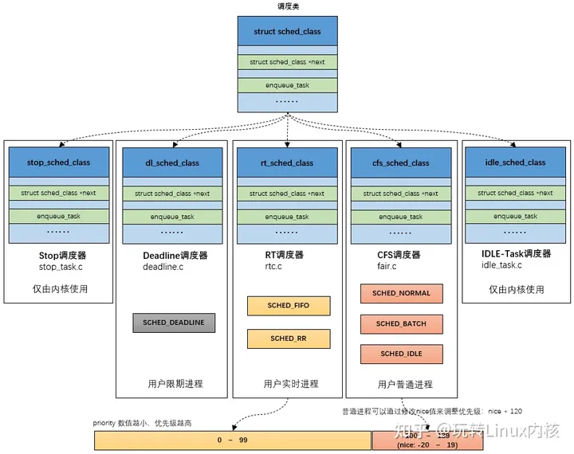
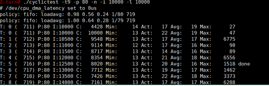
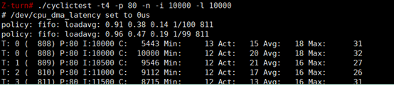
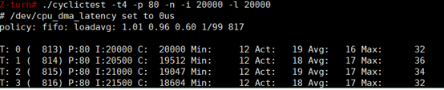

# 1 简介

本文对linux系统的调度进行简单的介绍，参考文章见下面附录

# 2 linux调度机制

参考资料：

1. man手册man 7 sched
2. 内核文档 Documentation/scheduler。


首先需要说明，我们常说的进程调度器是传统的说法，但是实际上进程是资源管理的单位，**线程才是调度的单位**.有时也会说任务调度等。

linux的调度机制由调度策略(policies)和优先级(priority)两个属性共同决定.其中调度策略又可以分为实时调度策略和通用调度策略(非实时)。其中通用调度策略的优先级值为0.而实时调度策略的优先级取值范围为1~99.可以看出，实时调度策略的优先级总是大于通用调度策略。而优先级高线程的总是会被调度器优先调用。其中实时调度策略包含SCHED_RR,SCHED_FIFO调度策略。通用调度策略包含SCHED_OTHER、SCHED_IDLE、SCHED_BATCH调度策略。即如下关系：
linux的调度机制由调度策略(policies)和优先级(priority)共同决定:

1. 优先级:确定哪个线程被优先调度。实时调度策略的优先级总是大于通用调度策略。
2. 调度策略(policies)分如下几种:
   1. 基于截止时间（deadline）的实时调度策略：优先级最高；在`SCHED_DEADLINE`调度策略中，任务的优先级是通过截止时间（deadline）来确定的，而不是传统的优先级概念。较早截止时间的任务将具有更高的"优先级"，因为它们需要更早地完成。在`SCHED_DEADLINE`中，优先级的比较是基于截止时间的大小。
      1. SCHED_DEADLINE
   2. 实时调度策略:spriority值的取值范围为0~99.当线程间的优先级不同时，按照优先级高的先调度原则。当优先级相同时，分为如下两种方式:
      1. SCHED_RR:优先级相同的线程按固定的时间片循环调度。下面会详细讲解。
      2. SCHED_FIFO:与SCHED_RR相似，优先级相同的线程也是循环调度。不过没有时间片的概念。下面会详细讲解。
   3. 通用调度策略(非实时):spriority值为0.
      1. SCHED_OTHER
      2. SCHED_IDLE:
      3. SCHED_BATCH:

所有的调度策略最后通过链表的方式组合成一个调度类。由linux内核调度。



# 3 调度策略介绍

**实时调度策略之SCHED_RR：Round-robin scheduling**

* 当线程间的优先级不同时，优先级高的先调度。当优先级相同时，固定的时间片循环调度。被调用的线程满足如下条件时会让出CPU：
  * 调度期间的时间片使用完了。
  * 自动放弃CPU。如调用了阻塞相关的接口函数或调用了sched_yield()。
  * 被一个优先级更高的线程抢占了
  * 线程终止了。
* 如果因为时间片使用完了或自愿放弃CPU而导致线程让出CPU，此时此线程将会被放置在与其优 先级级别对应的队列的队尾。如果因为被抢占而让出CPU，则会放置到队头，等更高优先级让出cpu时，继续执行此线程。

**实时调度策略之SCHED_FIFO：First in-first out scheduling**

* 与SCHED_RR实时调度策略相似，不过它没有时间片的概念。被调用的线程让出CPU条件与SCHED_RR类似，只是没有时间片使用完的情况

**通用调度策略之SCHED_OTHER：time-sharing scheduling**

* 分时循环调度策略。也就是我们常说的CFS(Completely Fair Scheduler)完全公平调度器。是系统的默认调度策略。按动态时间片循环调度。动态时间片由nice属性值决定。每个SCHED_OTHER策略的线程都拥有一个nice值，其取值范围为−20～19,默认值为0.nice值是一个权重因子，值越小，权重越大。CPU为其分配的动态时间片会越多。

**通用调度策略之SCHED_BATCH**

* 此策略会让频繁被唤醒的线程在调度时次数会变少。其他与SCHED_OTHER策略类似。

**通用调度策略之SCHED_IDLE**

* 可以理解为nice=19的SCHED_OTHER策略。当系统中没有其他线程需要使用CPU时才会大量使用CPU。

**调度策略之SCHED_DEADLINE**

* 自从3.14版本以来，Linux提供了一个截止日期调度策略(SCHED_DEADLINE)。


# 4 调度相关的用户空间接口

* 修改nice值相关的函数接口：

  ```c
  int nice(int inc)
        所属头文件:`<unistd.h>`
        描述:修改当前进程的nice值。此函数已经被更通用的setpriority()取代。
        inc:在当前nice的基础上加inc.
        return: 如果成功，返回新设置的nice值。
        eg:nice(3)、nice(-5)
  int setpriority(int which, int who, int prio)
        描述: 设置通用进程的nice值。这里的priority不要与上边讲到的优先级混淆。
        which:决定who传入的参数含义，which可选值:
            PRIO_PROCESS:表明who为进程id.如果等于零，则为当前进程
            PRIO_PGRP:表明who为进程组id.如果等于零，则为当前进程组
            PRIO_USER:表明who为用户(real user)id.如果等于零，则为当前用户
        prio:-20~19之间的nice值。
        return: 成功返回0。失败返回-1.。
  int getpriority(int which, int who)
        所属头文件:<sys/time.h>,<sys/resource.h>
        描述:获取进程的nice值。
        return: 返回进程调度优先级(-20~19)。
        eg: getpriority(PRIO_PROCESS, getpid());
  ```

  

* 修改优先级与调度策略相关的函数接口：

  ```c
  int sched_get_priority_max(int policy)
      描述: 查看调度策略最大优先级。
      policy 可指定的值如下:
          SCHED_OTHER
          SCHED_BATCH
          SCHED_IDLE
          SCHED_FIFO
          SCHED_RR
      return: 成功返回最大优先级值。失败返回-1.
  int sched_get_priority_min(int policy)
      查看调度策略最小优先级。其他同sched_get_priority_max().
  int sched_setscheduler(pid_t pid, int policy,const struct sched_param *param)
      描述: 设置进程的调度策略和优先级。
      policy 可指定的值如下:
          SCHED_OTHER
          SCHED_BATCH
          SCHED_IDLE 对于这三种策略,param->sched_priority的值必须为0.
          SCHED_FIFO
          SCHED_RR 对于这两种策略，需要指定param->sched_priority的值。
      param:指定调度策略的优先级。struct sched_param的结构体如下：
  
      struct sched_param {
          int sched_priority; //优先级1~99
      };
          1
          2
          3
  
      return: 成功返回0。失败返回-1.
  int sched_getscheduler(pid_t pid)
      所属头文件:<sched.h>
      描述: 获取进程的调度策略。
      pid 进程id.如果为0，表示为本线程。
      return: 成功返回调度策略值(非负整数)。失败返回-1.
          SCHED_OTHER 0
          SCHED_FIFO 1
          SCHED_RR 2
          SCHED_BATCH 3
          SCHED_IDLE 5
  int sched_setparam(pid_t pid, const struct sched_param *param)
      描述: 设置进程的优先级。sched_setscheduler()函数的子集。
      param:见sched_setscheduler()函数中的描述。
      return: 成功返回0。失败返回-1.
  int sched_getparam(pid_t pid, struct sched_param *param)
      描述: 获取进程的优先级。
      param:见sched_setscheduler()函数中的描述。用于接收要获取的优先级值。
      return: 成功返回0。失败返回-1.
  ```

* linux特有的函数接口，可用于修改上边提到的所有属性：

  ```c
  int sched_setattr(pid_t pid, struct sched_attr *attr,unsigned int flags)
      描述: 设置进程的调度策略。
      struct sched_attr结构体如下:
  
      struct sched_attr {
             u32 size;              //结构体大小
             u32 sched_policy;      //调度策略
             u64 sched_flags;       //可选属性:SCHED_FLAG_RESET_ON_FORK 表示子进程创建时不继承此策略。
             s32 sched_nice;        //通用调度策略的nice值
             u32 sched_priority;    //优先级
             /* Remaining fields are for SCHED_DEADLINE */
             u64 sched_runtime;
             u64 sched_deadline;
             u64 sched_period;
         };
      flags 目前为0.
      return: 成功返回0。
  int sched_getattr(pid_t pid, struct sched_attr *attr,unsigned int size, unsigned int flags)
      描述: 获取进程的调度策略。
      size: attr结构体的大小。
      其他参数同sched_setattr().
  ```

* 其他接口:

  ```c
  int sched_yield(void)
      描述:进程主动放弃cpu.
  int sched_rr_get_interval(pid_t pid, struct timespec *tp)
      获取SCHED_RR调度策略的进程在每次使用CPU时分配到时间片的长度。
      tp:获取到的时间长度。
      成功返回0，失败返回-1.
  ```

线程相关的调度设置函数：相关线程属性设置。

# 5 linux实时补丁

为了满足实时性和可预测性的要求，通常会使用实时补丁。一个常见的实时补丁是PREEMPT-RT。PREEMPT-RT是一组Linux内核的补丁，**旨在提高内核的实时性能，减小中断和任务切换的延迟**，以支持对响应性能有严格要求的应用，例如自动驾驶系统。

实时补丁需要配置内核和构建内核，这里就不介绍了，引用一下网上的测试结果对比一下

利用cyclictest进行性能测试：

将编译完成的cyclictest加载到板卡上，并增加其可执行权限，就可以利用cyclictest命令来进行linux内核实时性能测试，测试命令为：

` ./cyclictest -t8 -p 80 -n -i 10000 -l 10000`

常用参数
-p	--prio=PRIO	最高优先级线程的优先级  使用时方法为： -p 90 /  --prio=90
-m	--mlockall 	锁定当前和将来的内存分配
-c	--clock=CLOCK	 选择时钟  cyclictest -c 1      0 = CLOCK_MONOTONIC (默认)    1 = CLOCK_REALTIME
-i	--interval=INTV	基本线程间隔，默认为1000（单位为us）
-l	--loops=LOOPS	循环的个数，默认为0（无穷个），与 -i 间隔数结合可大致算出整个测试的时间，比如 -i 1000  -l 1000000 ,总的循环时间为1000*1000000=1000000000 us =1000s ，所以大致为16分钟多
-n	--nanosleep	使用 clock_nanosleep
-h	 --histogram=US 	在执行完后在标准输出设备上画出延迟的直方图（很多线程有相同的权限）US为最大的跟踪时间限制
-q	 --quiet	 使用-q 参数运行时不打印信息，只在退出时打印概要内容，结合-h HISTNUM参数会在退出时打印HISTNUM 行统计信息以及一个总的概要信息
-f 	--ftrace	ftrace函数跟踪（通常与-b 配套使用，其实通常使用 -b 即可，不使用 -f ）
-b	 --breaktrace=USEC	当延时大于USEC指定的值时，发送停止跟踪。USEC,单位为谬秒（us）


**运行结果含义**

| T: 0    | 序号为0的线程                               |
| ------- | ------------------------------------------- |
| P: 0    | 线程优先级为0                               |
| C: 9397 | 计数器。线程的时间间隔每达到一次，计数器加1 |
| I: 1000 | 时间间隔为1000微秒(us)                      |
| Min:    | 最小延时(us)                                |
| Act:    | 最近一次的延时(us)                          |
| Avg：   | 平均延时(us)                                |
| Max：   | 最大延时(us)                                |

在我们的板卡上进行实时性测试，先对非实时系统进行测试，得到测试结果如下：



对实时性系统进行测试，得到的测试结果如下：





# 附录：

*  [linux 的调度策略与优先级](https://blog.csdn.net/qq_23274715/article/details/110941434)
* [玩转Linux内核进程调度，这一篇就够(所有的知识点)](https://zhuanlan.zhihu.com/p/460055814)
* [linux打实时补丁以及实时性能测试](https://blog.csdn.net/m0_37765662/article/details/109595439)