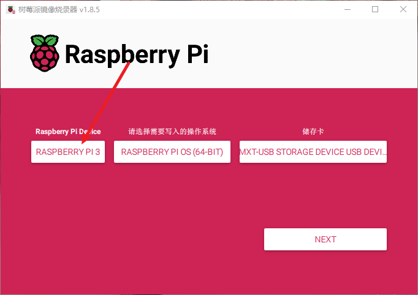
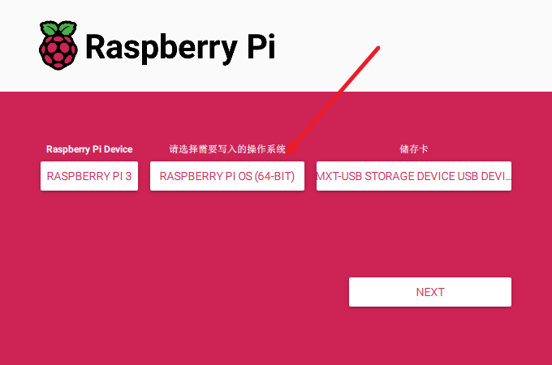
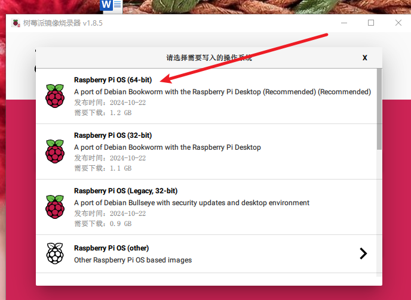
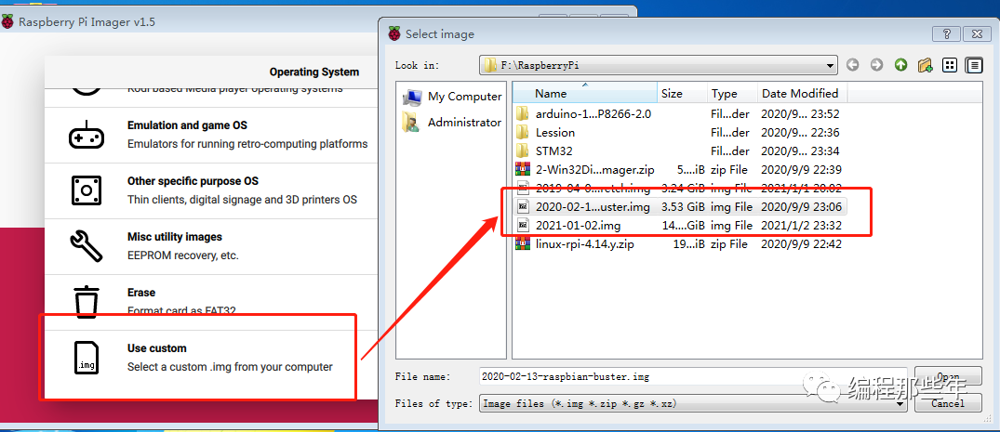
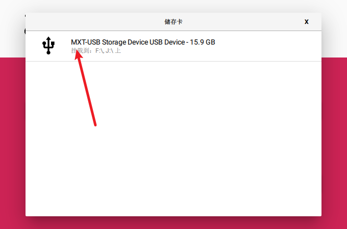
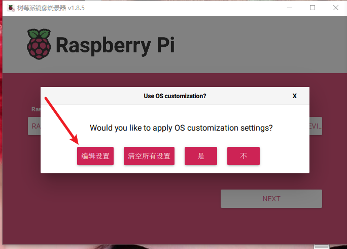
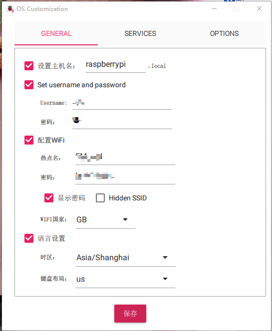
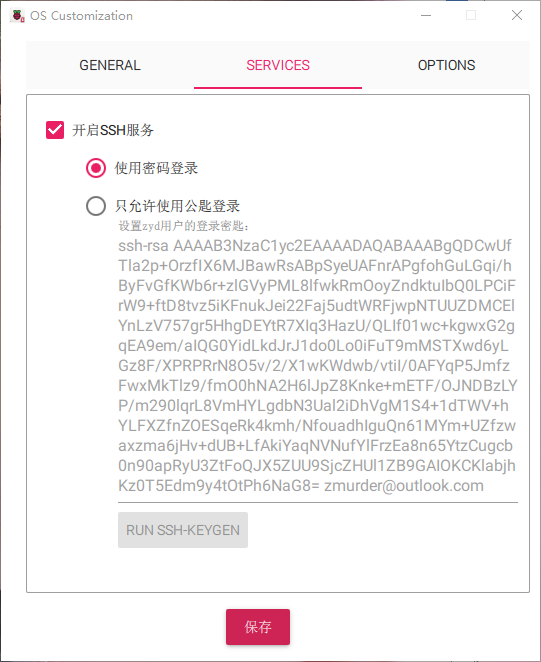

# 1 前言

自己有一个树莓派3B+，闲置了好久了。想着使用起来，所以就开始在重新折腾一下。因为之前刷过系统，什么设置的都忘记了，今天就重新对Raspberry Pi进行刷机。安装一个最新的操作系统

# 2 Raspberry Pi 刷机

之前刷机需要使用类似TF卡的刷机工具，将系统文件刷进去，再插TF卡到Raspberry Pi上。现在官方出了一个工具，树莓派镜像烧录器，节省了很多的操作，电脑识别TF卡后，直接使用这一个工具就可以做到刷机，并且引导一些设置，选择希望下载的镜像，非常的省时省力。下面就是我是用官方的树莓派镜像烧录器进行刷机的步骤。

[树莓派镜像烧录器官方下载](https://www.raspberrypi.com/software/)

## 2.1 刷机步骤

* 下载并安装树莓派镜像烧录器（Raspberry Pi Imager工具）

* 准备好TF卡，插上电脑（有点废话）

* 打开树莓派镜像烧录器，最左侧，选择自己的树莓派版本，我i这里选择的是树莓派3

  

  

* 选择需要刷的Raspberry Pi系统镜像

  我这里选择的是第一个，算是一个官方推荐的最全的，带有桌面系统的镜像。

  

  

  如果是自己之前下载好的镜像，这个往下拉，选自己准备好的镜像。

  

* 选择最右侧的“存储卡”，选择需要写入系统的TF卡

  

* 以上三步就算是设置完了，点击NEXT后弹出下面的对话框

  可以看到又一些‘编辑设置’。里面有一些主机名、用户名、密码、wifi设置。我这边直接就设置了，方便后面的ssh远程登陆使用

  

  

  

* 点击“保存”，按照提示就可以将系统写入TF卡了。

* 烧录完成后把TF拔下来插到树莓派上即可。

# 附录

* [树莓派镜像烧录器官方下载](https://www.raspberrypi.com/software/)
