# 1 简介

给树莓派刷机完成后，想使用远程桌面来访问Raspberry Pi。因此有本文

# 2 树莓配配置VNC

## 2.1 启动树莓派VNC服务

VNC 在树莓派上是默认关闭的，因此在你安装好全新的 Raspbian 后打开树莓派时，你需要启用它。

首先通过菜单进入树莓派的配置界面。

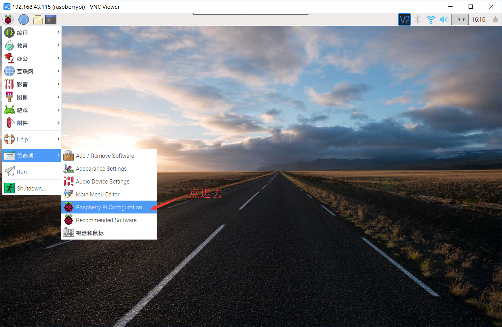

 现在进入接口interfaces标签，启动 VNC并重启你的树莓派。

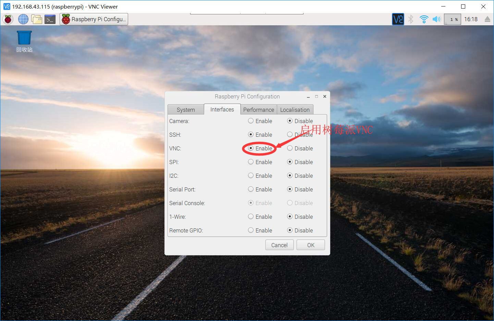

 你也可以通过终端直接启动 VNC。仅需输入命令`sudo` `raspi-config`然后进入高级设置以启用VNC。

参考这篇推文：http://shumeipai.nxez.com/2018/08/31/raspberry-pi-vnc-viewer-configuration-tutorial.html

在开始之前，你需要已经登录树莓派，进入到树莓派命令窗口，通过接上显示器和键鼠直接操作或[通过 SSH 登录](https://shumeipai.nxez.com/2024/04/22/use-putty-to-login-to-your-raspberry-pi-via-ssh.html)都可以。

### 启用树莓派 VNC 服务

在终端输入以下命令进入配置界面。

```
sudo` `raspi-config
```

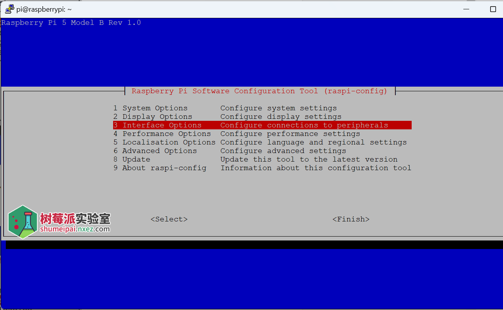
 
 依次操作：Interfacing Options -> VNC -> Yes。之后系统会提示你是否要安装 VNC 服务，输入 y 之后回车，等待系统自动下载安装完成，一切顺利的话 VNC 服务就启动了！

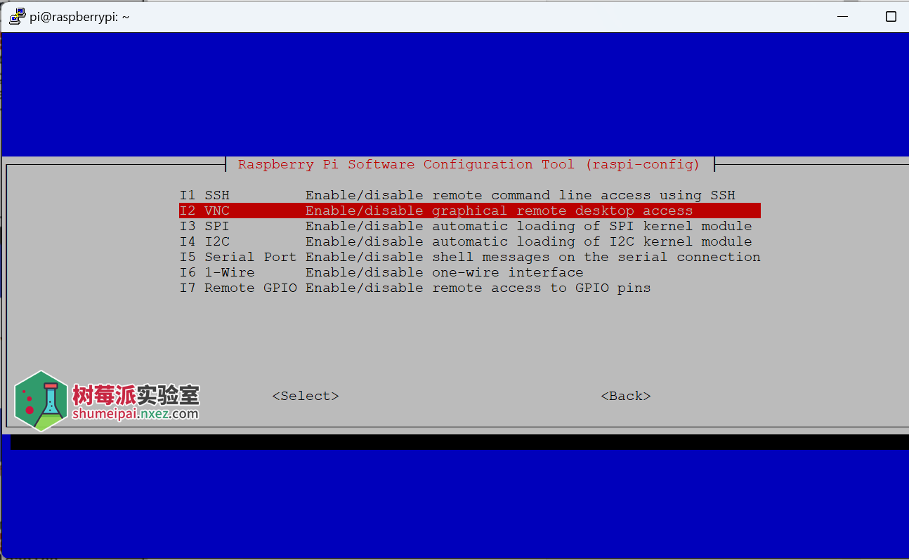

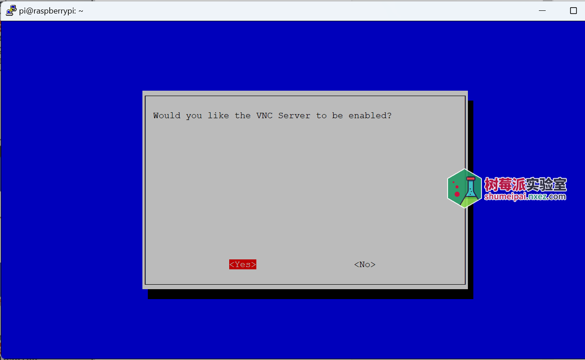

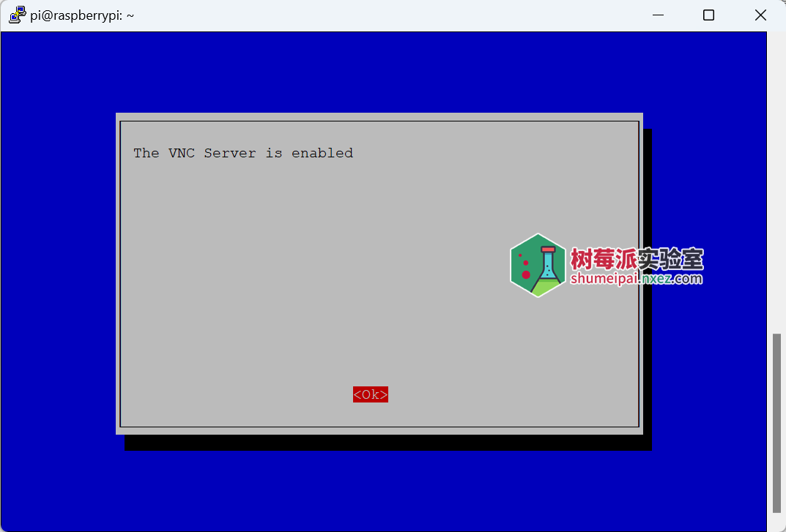

## 2.2 安装 VNC 客户

**步骤二：查看树莓派IP地址**

方法一：连接网络进入VNC即可查看树莓派IP地址

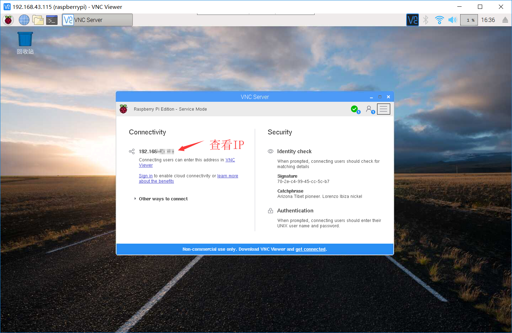

 

 

 方法二：使用古老而好用的 `ifconfig` 命令，但是你也可以使用 `ip address`。

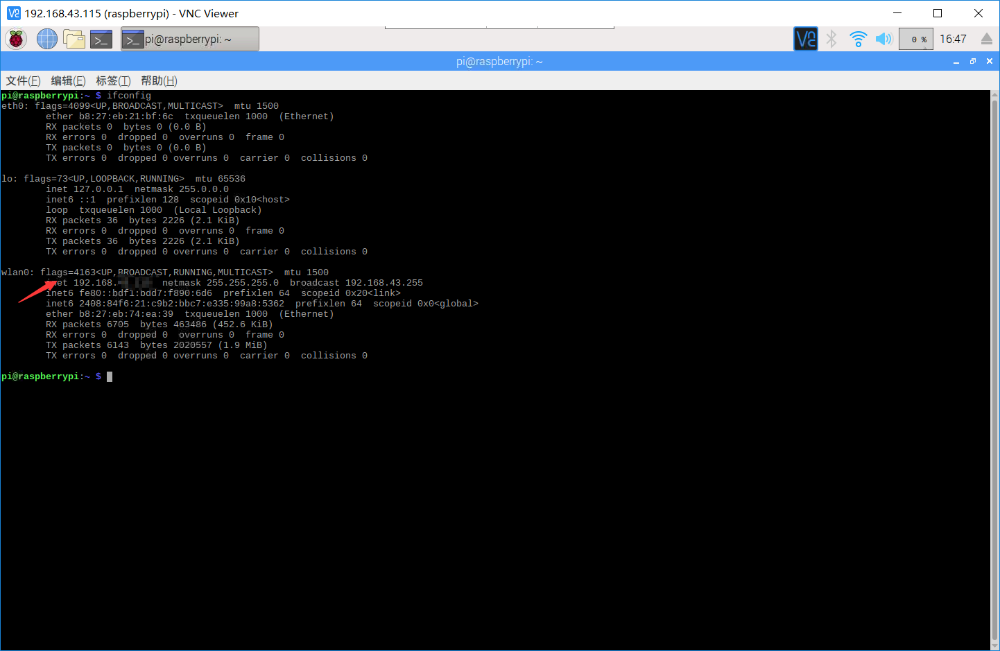

**安装VNC客户端**

下面去 RealVNC 官网下载 [RealVNC Viewer](https://www.realvnc.com/en/connect/download/viewer/)，它是 RealVNC 的客户端，跨平台。下载你需要的平台的客户端版本即可。

https://www.realvnc.com/en/connect/download/viewer/

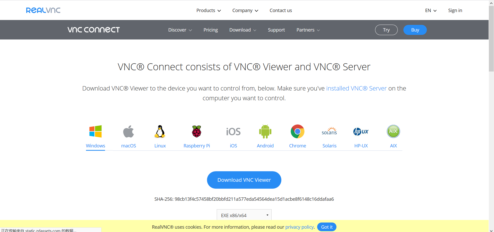

 

 

## **2.3 登录远程桌面运行 RealVNC Viewer**

之后输入树莓派的 IP 地址，通过 ifconfig 命令可以查看。

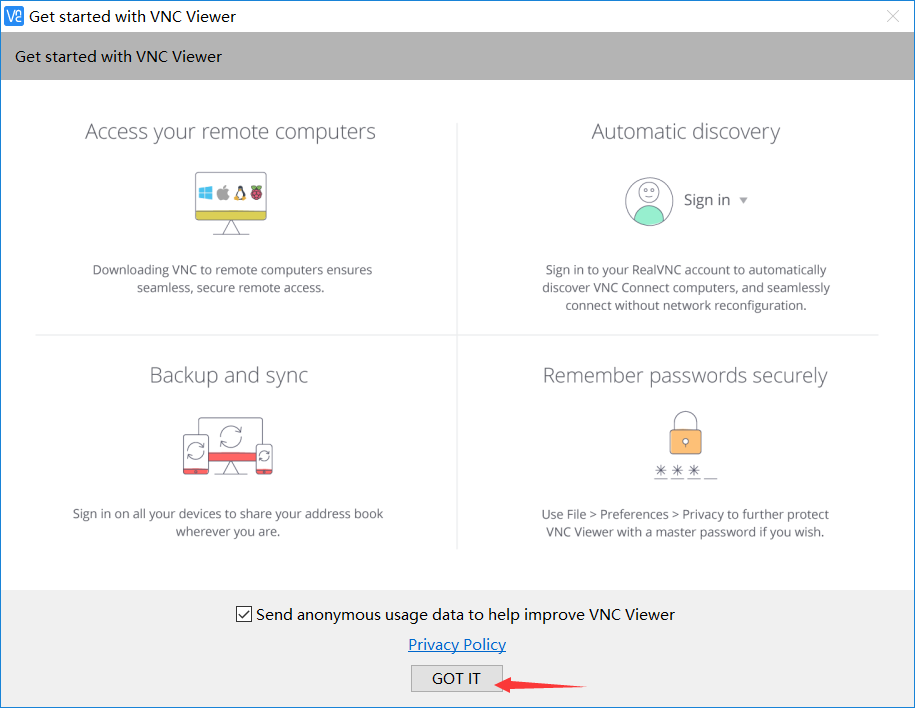

 

 

 安装完后进入VNC Viewer界面

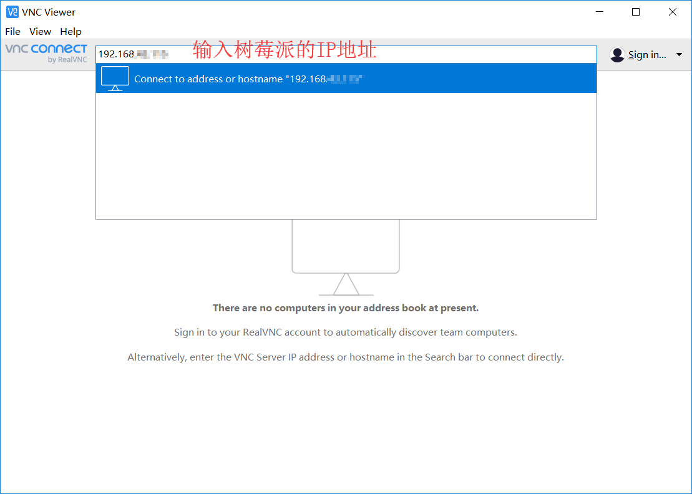

 

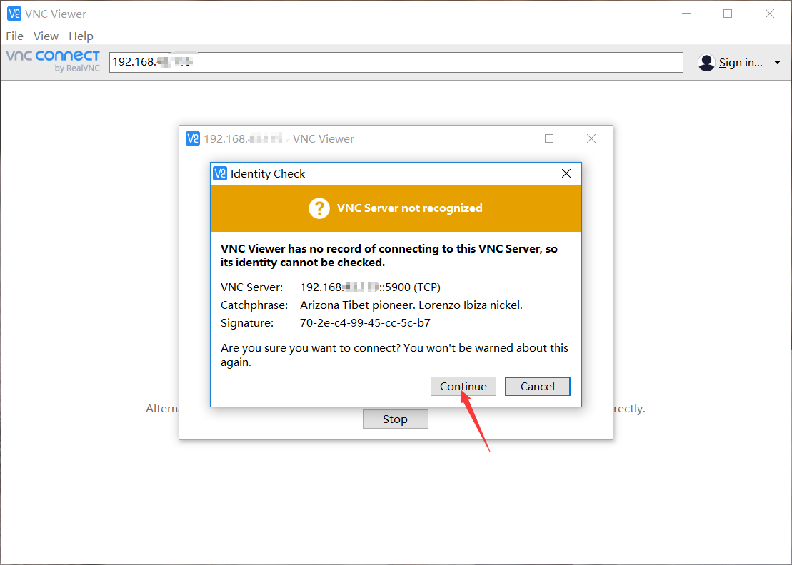

 选择连接之后输入树莓派的登录用户名密码，

初始用户名 ：pi

初始密码 ：raspberry

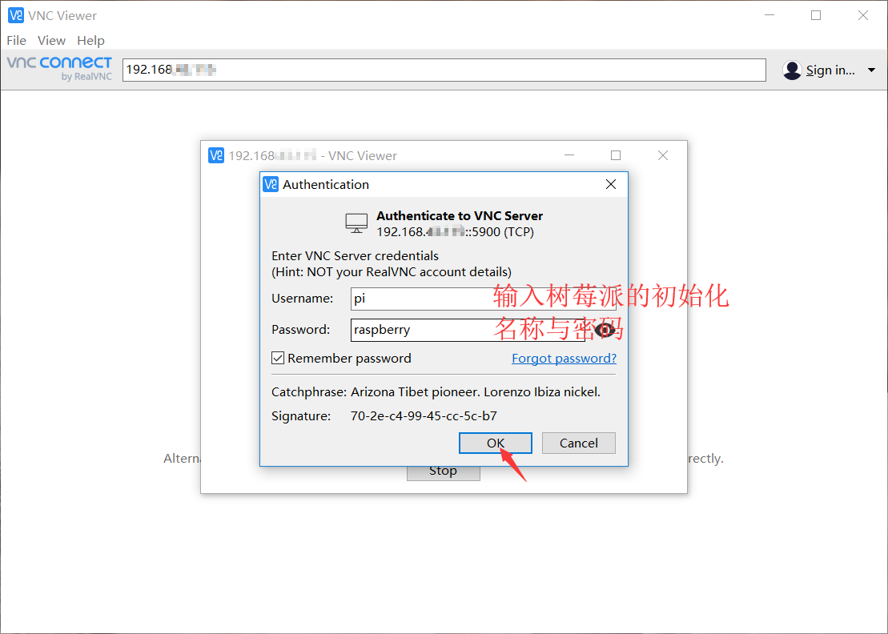

 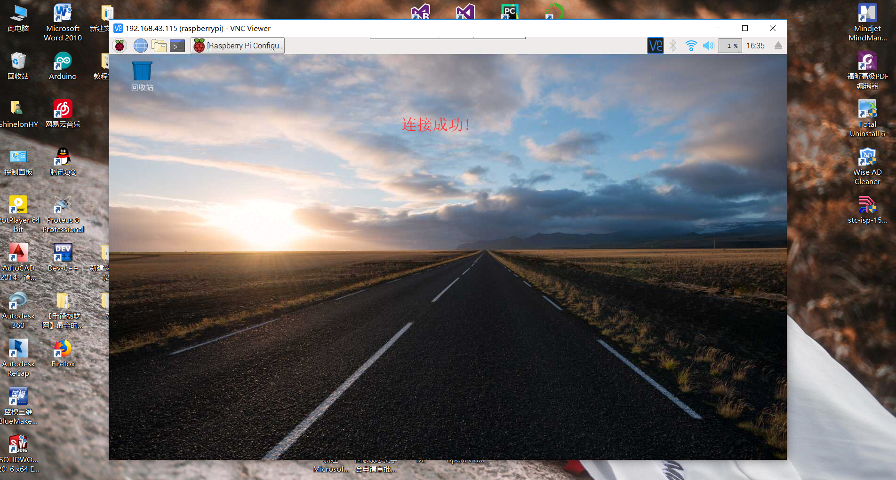

 

 

恭喜你已成功学会如何在树莓派中启用 VNC Viewer以及之后如何通过 VNC 进入树莓派，你可愿将其分享给更多的需要的小伙伴。


 

 

#  附录：

[参考](https://www.cnblogs.com/gghy/p/11625139.html#:~:text=VNC%20%E5%9C%A8%E6%A0%91%E8%8E%93%E6%B4%BE%E4%B8%8A%E6%98%AF%E9%BB%98%E8%AE%A4%E5%85%B3%E9%97%AD%E7%9A%84%EF%BC%8C%E5%9B%A0%E6%AD%A4%E5%9C%A8%E4%BD%A0%E5%AE%89%E8%A3%85%E5%A5%BD%E5%85%A8%E6%96%B0%E7%9A%84%20Raspbian%20%E5%90%8E%E6%89%93%E5%BC%80%E6%A0%91%E8%8E%93%E6%B4%BE%E6%97%B6%EF%BC%8C%E4%BD%A0%E9%9C%80%E8%A6%81%E5%90%AF%E7%94%A8%E5%AE%83%E3%80%82%20%E9%A6%96%E5%85%88%E9%80%9A%E8%BF%87%E8%8F%9C%E5%8D%95%E8%BF%9B%E5%85%A5%E6%A0%91%E8%8E%93%E6%B4%BE%E7%9A%84%E9%85%8D%E7%BD%AE%E7%95%8C%E9%9D%A2%E3%80%82%20%E7%8E%B0%E5%9C%A8%E8%BF%9B%E5%85%A5%E6%8E%A5%E5%8F%A3interfaces%E6%A0%87%E7%AD%BE%EF%BC%8C%E5%90%AF%E5%8A%A8,VNC%E5%B9%B6%E9%87%8D%E5%90%AF%E4%BD%A0%E7%9A%84%E6%A0%91%E8%8E%93%E6%B4%BE%E3%80%82%20%E4%BD%A0%E4%B9%9F%E5%8F%AF%E4%BB%A5%E9%80%9A%E8%BF%87%E7%BB%88%E7%AB%AF%E7%9B%B4%E6%8E%A5%E5%90%AF%E5%8A%A8%20VNC%E3%80%82%20%E4%BB%85%E9%9C%80%E8%BE%93%E5%85%A5%E5%91%BD%E4%BB%A4%20sudo%20raspi-config%20%E7%84%B6%E5%90%8E%E8%BF%9B%E5%85%A5%E9%AB%98%E7%BA%A7%E8%AE%BE%E7%BD%AE%E4%BB%A5%E5%90%AF%E7%94%A8VNC%E3%80%82)

[树莓派 VNC Viewer 远程桌面配置教程](http://shumeipai.nxez.com/2018/08/31/raspberry-pi-vnc-viewer-configuration-tutorial.html)
