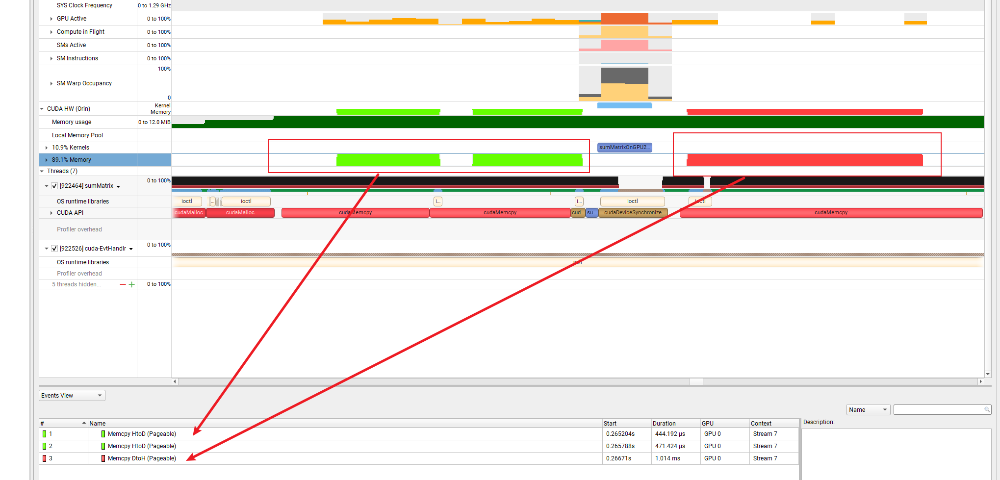
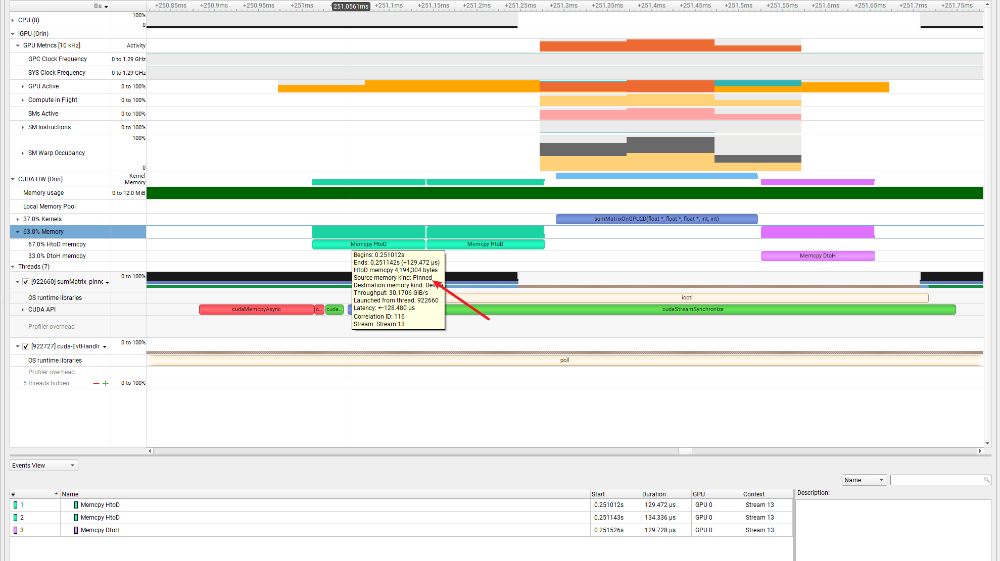
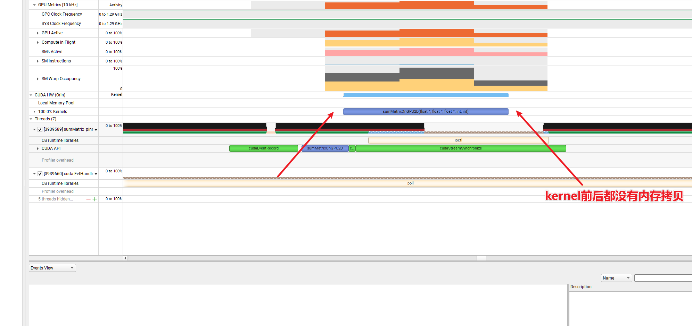
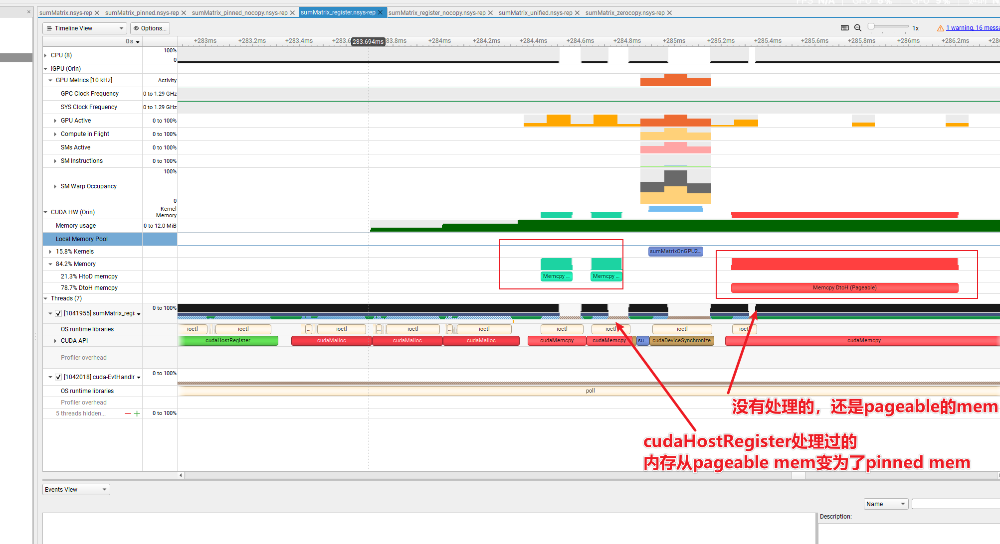
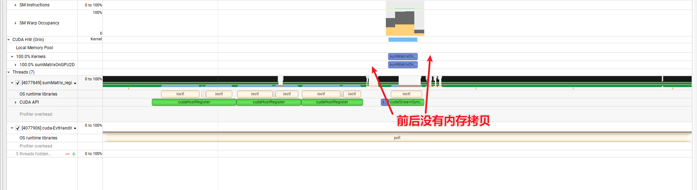
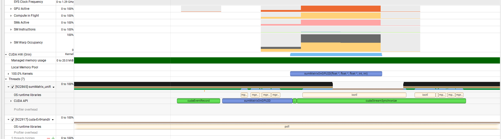
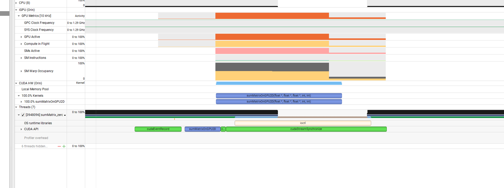

# 简介

这一节主要讲一下我们使用CPU与GPU交互的CPU内存的申请使用和具体的区别。测试平台为orin

参考https://docs.nvidia.com/cuda/cuda-for-tegra-appnote/index.html#memory-management

# 基础知识

这里主要时CPU内存的相关问题，主要分为

* pageable mem  ，例如使用malloc申请的CPU内存
* pinned mem ，例如使用cudamallocHost或者使用cudaHostAlloc申请的CPU内存

在涉及H2D和D2H的内存拷贝时，我们都需要使CPU的mem为 pinned mem 保障拷贝速度最快。

下面使用矩阵加法来演示几种内存。

# pageable mem

```c++
#include "../common/common.h"
#include <cuda_runtime.h>
#include <stdio.h>

/*
 * This example implements matrix element-wise addition on the host and GPU.
 * sumMatrixOnHost iterates over the rows and columns of each matrix, adding
 * elements from A and B together and storing the results in C. The current
 * offset in each matrix is stored using pointer arithmetic. sumMatrixOnGPU2D
 * implements the same logic, but using CUDA threads to process each matrix.
 */

void initialData(float *ip, const int size)
{
    int i;

    for(i = 0; i < size; i++)
    {
        ip[i] = (float)( rand() & 0xFF ) / 10.0f;
    }
}

void sumMatrixOnHost(float *A, float *B, float *C, const int nx, const int ny)
{
    float *ia = A;
    float *ib = B;
    float *ic = C;

    for (int iy = 0; iy < ny; iy++)
    {
        for (int ix = 0; ix < nx; ix++)
        {
            ic[ix] = ia[ix] + ib[ix];
        }

        ia += nx;
        ib += nx;
        ic += nx;
    }

    return;
}

void checkResult(float *hostRef, float *gpuRef, const int N)
{
    double epsilon = 1.0E-8;

    for (int i = 0; i < N; i++)
    {
        if (abs(hostRef[i] - gpuRef[i]) > epsilon)
        {
            printf("host %f gpu %f ", hostRef[i], gpuRef[i]);
            printf("Arrays do not match.\n\n");
            break;
        }
    }
}

// grid 2D block 2D
__global__ void sumMatrixOnGPU2D(float *A, float *B, float *C, int NX, int NY)
{
    unsigned int ix = blockIdx.x * blockDim.x + threadIdx.x;
    unsigned int iy = blockIdx.y * blockDim.y + threadIdx.y;
    unsigned int idx = iy * NX + ix;

    if (ix < NX && iy < NY)
    {
        C[idx] = A[idx] + B[idx];
    }
}

int main(int argc, char **argv)
{
    // set up device
    int dev = 0;
    cudaDeviceProp deviceProp;
    CHECK(cudaGetDeviceProperties(&deviceProp, dev));
    CHECK(cudaSetDevice(dev));

    // set up data size of matrix
    int nx = 1 << 10;
    int ny = 1 << 10;

    int nxy = nx * ny;
    int nBytes = nxy * sizeof(float);

    // malloc host memory
    float *h_A, *h_B, *hostRef, *gpuRef;
    h_A = (float *)malloc(nBytes);
    h_B = (float *)malloc(nBytes);
    hostRef = (float *)malloc(nBytes);
    gpuRef = (float *)malloc(nBytes);

    // initialize data at host side
    double iStart = seconds();
    initialData(h_A, nxy);
    initialData(h_B, nxy);
    double iElaps = seconds() - iStart;

    memset(hostRef, 0, nBytes);
    memset(gpuRef, 0, nBytes);

    // add matrix at host side for result checks
    // iStart = seconds();
    sumMatrixOnHost (h_A, h_B, hostRef, nx, ny);
    // iElaps = seconds() - iStart;

    // malloc device global memory
    float *d_MatA, *d_MatB, *d_MatC;
    CHECK(cudaMalloc((void **)&d_MatA, nBytes));
    CHECK(cudaMalloc((void **)&d_MatB, nBytes));
    CHECK(cudaMalloc((void **)&d_MatC, nBytes));

    // transfer data from host to device
    CHECK(cudaMemcpy(d_MatA, h_A, nBytes, cudaMemcpyHostToDevice));
    CHECK(cudaMemcpy(d_MatB, h_B, nBytes, cudaMemcpyHostToDevice));

    // invoke kernel at host side
    int dimx = 32;
    int dimy = 32;

    if(argc > 2)
    {
        dimx = atoi(argv[1]);
        dimy = atoi(argv[2]);
    }

    dim3 block(dimx, dimy);
    dim3 grid((nx + block.x - 1) / block.x, (ny + block.y - 1) / block.y);

    // execute the kernel
    CHECK(cudaDeviceSynchronize());
    iStart = seconds();
    sumMatrixOnGPU2D<<<grid, block>>>(d_MatA, d_MatB, d_MatC, nx, ny);
    CHECK(cudaDeviceSynchronize());
    iElaps = seconds() - iStart;
    printf("sumMatrixOnGPU2D <<<(%d,%d), (%d,%d)>>> elapsed %f s\n", grid.x,
           grid.y,
           block.x, block.y, iElaps);
	printf("iStart=%lf end=%lf \n",iStart,seconds());
    CHECK(cudaGetLastError());

    // copy kernel result back to host side
    CHECK(cudaMemcpy(gpuRef, d_MatC, nBytes, cudaMemcpyDeviceToHost));

    // check device results
    checkResult(hostRef, gpuRef, nxy);

    // free device global memory
    CHECK(cudaFree(d_MatA));
    CHECK(cudaFree(d_MatB));
    CHECK(cudaFree(d_MatC));

    // free host memory
    free(h_A);
    free(h_B);
    free(hostRef);
    free(gpuRef);

    // reset device
    CHECK(cudaDeviceReset());

    return EXIT_SUCCESS;
}

```

分析nsys如下，可以看出kernel前后都有拷贝，同时是paegable mem。这是最差的情况。一个绿色部分的内存拷贝时间为442us



# pinned mem

使用cudaHostAlloc或者cudamallocHost申请的CPU内存。

```c++

int main(int argc, char **argv) {
    int dev = 0;
    cudaDeviceProp deviceProp;
    CHECK(cudaGetDeviceProperties(&deviceProp, dev));
    CHECK(cudaSetDevice(dev));

    int nx = 1 << 10, ny = 1 << 10;
    int nxy = nx * ny, nBytes = nxy * sizeof(float);

    // 创建非阻塞流和事件
    cudaStream_t stream;
    cudaEvent_t startEvent, endEvent;
    CHECK(cudaStreamCreateWithFlags(&stream, cudaStreamNonBlocking));
    CHECK(cudaEventCreate(&startEvent));
    CHECK(cudaEventCreate(&endEvent));

    // 固定内存分配（主机）
    float *h_A, *h_B, *hostRef, *gpuRef;
    CHECK(cudaHostAlloc((void**)&h_A, nBytes, cudaHostAllocDefault));
    CHECK(cudaHostAlloc((void**)&h_B, nBytes, cudaHostAllocDefault));
    CHECK(cudaHostAlloc((void**)&hostRef, nBytes, cudaHostAllocDefault));
    CHECK(cudaHostAlloc((void**)&gpuRef, nBytes, cudaHostAllocDefault));

    // 设备内存分配
    float *d_MatA, *d_MatB, *d_MatC;
    CHECK(cudaMalloc(&d_MatA, nBytes));
    CHECK(cudaMalloc(&d_MatB, nBytes));
    CHECK(cudaMalloc(&d_MatC, nBytes));

    // 初始化数据
    initialData(h_A, nxy);
    initialData(h_B, nxy);
    memset(hostRef, 0, nBytes);
    sumMatrixOnHost(h_A, h_B, hostRef, nx, ny);

    // 异步数据传输（主机→设备）
    CHECK(cudaMemcpyAsync(d_MatA, h_A, nBytes, cudaMemcpyHostToDevice, stream));
    CHECK(cudaMemcpyAsync(d_MatB, h_B, nBytes, cudaMemcpyHostToDevice, stream));

    // 核函数配置
    int dimx = 32, dimy = 32;
    if(argc > 2) { dimx = atoi(argv[1]); dimy = atoi(argv[2]); }
    dim3 block(dimx, dimy), grid((nx+block.x-1)/block.x, (ny+block.y-1)/block.y);

    // 执行核函数并计时
    CHECK(cudaEventRecord(startEvent, stream));  // 记录流开始
    sumMatrixOnGPU2D<<<grid, block, 0, stream>>>(d_MatA, d_MatB, d_MatC, nx, ny);
    CHECK(cudaEventRecord(endEvent, stream));    // 记录流结束

    // 异步数据传输（设备→主机）
    CHECK(cudaMemcpyAsync(gpuRef, d_MatC, nBytes, cudaMemcpyDeviceToHost, stream));

    // 同步流并计算时间
    CHECK(cudaStreamSynchronize(stream));
    float kernelTime;
    CHECK(cudaEventElapsedTime(&kernelTime, startEvent, endEvent));
    printf("sumMatrixOnGPU2D kernel elapsed: %.4f ms\n", kernelTime);

    // 验证结果
    checkResult(hostRef, gpuRef, nxy);

    // 释放资源
    CHECK(cudaEventDestroy(startEvent));
    CHECK(cudaEventDestroy(endEvent));
    CHECK(cudaStreamDestroy(stream));
    CHECK(cudaFree(d_MatA));
    CHECK(cudaFree(d_MatB));
    CHECK(cudaFree(d_MatC));
    CHECK(cudaFreeHost(h_A));
    CHECK(cudaFreeHost(h_B));
    CHECK(cudaFreeHost(hostRef));
    CHECK(cudaFreeHost(gpuRef));

    CHECK(cudaDeviceReset());
    return EXIT_SUCCESS;
}

```

对应的nsys如下，一次内存拷贝时间为127ms




# pinned mem但是不拷贝

因为我是用的是orin设备，实际上CPU和GPU使用的同一块内存，因此不需要拷贝到GPU，**申请的CPU的内存指针可以直接给到GPU的kernel使用。**

**有一种情况这种使用不合适**

* 当一个小的数据经过kernel频繁的访问计算，然后传递出kernel，，这个时候使用cudamalloc的GPU内存是最优的，不要使用cudaHostAlloc或者cudamallocHost申请这一部分GPU内存，因为cudamalloc申请的GPU内存会有GPU 的L2 cache 可以快速访问,但是cudaHostAlloc或者cudamallocHost的GPU内存只能从global mem访问，太慢了。

备注：需要cuda版本也足够，具体从哪一个版本支持需要查看一下NV统一内存的相关信息，因为我的cuda版本满足，也就没多深入。

```c++

int main(int argc, char **argv) {
    int dev = 0;
    cudaDeviceProp deviceProp;
    CHECK(cudaGetDeviceProperties(&deviceProp, dev));
    CHECK(cudaSetDevice(dev));

    int nx = 1 << 10, ny = 1 << 10;
    int nxy = nx * ny, nBytes = nxy * sizeof(float);

    // 创建非阻塞流和事件
    cudaStream_t stream;
    cudaEvent_t startEvent, endEvent;
    CHECK(cudaStreamCreateWithFlags(&stream, cudaStreamNonBlocking));
    CHECK(cudaEventCreate(&startEvent));
    CHECK(cudaEventCreate(&endEvent));

    // 固定内存分配（主机）
    float *h_A, *h_B, *hostRef, *gpuRef;
    CHECK(cudaHostAlloc((void**)&h_A, nBytes, cudaHostAllocDefault));
    CHECK(cudaHostAlloc((void**)&h_B, nBytes, cudaHostAllocDefault));
    CHECK(cudaHostAlloc((void**)&hostRef, nBytes, cudaHostAllocDefault));
    CHECK(cudaHostAlloc((void**)&gpuRef, nBytes, cudaHostAllocDefault));

    // // 设备内存分配
    // float *d_MatA, *d_MatB, *d_MatC;
    // CHECK(cudaMalloc(&d_MatA, nBytes));
    // CHECK(cudaMalloc(&d_MatB, nBytes));
    // CHECK(cudaMalloc(&d_MatC, nBytes));

    // 初始化数据
    initialData(h_A, nxy);
    initialData(h_B, nxy);
    memset(hostRef, 0, nBytes);
    sumMatrixOnHost(h_A, h_B, hostRef, nx, ny);

    // // 异步数据传输（主机→设备）
    // CHECK(cudaMemcpyAsync(d_MatA, h_A, nBytes, cudaMemcpyHostToDevice, stream));
    // CHECK(cudaMemcpyAsync(d_MatB, h_B, nBytes, cudaMemcpyHostToDevice, stream));

    // 核函数配置
    int dimx = 32, dimy = 32;
    if(argc > 2) { dimx = atoi(argv[1]); dimy = atoi(argv[2]); }
    dim3 block(dimx, dimy), grid((nx+block.x-1)/block.x, (ny+block.y-1)/block.y);

    // 执行核函数并计时
    CHECK(cudaEventRecord(startEvent, stream));  // 记录流开始
    // sumMatrixOnGPU2D<<<grid, block, 0, stream>>>(d_MatA, d_MatB, d_MatC, nx, ny);
    sumMatrixOnGPU2D<<<grid, block, 0, stream>>>(h_A, h_B, gpuRef, nx, ny);
    CHECK(cudaEventRecord(endEvent, stream));    // 记录流结束

    // 异步数据传输（设备→主机）
    // CHECK(cudaMemcpyAsync(gpuRef, d_MatC, nBytes, cudaMemcpyDeviceToHost, stream));

    // 同步流并计算时间
    CHECK(cudaStreamSynchronize(stream));
    float kernelTime;
    CHECK(cudaEventElapsedTime(&kernelTime, startEvent, endEvent));
    printf("sumMatrixOnGPU2D kernel elapsed: %.4f ms\n", kernelTime);

    // 验证结果
    checkResult(hostRef, gpuRef, nxy);

    // 释放资源
    CHECK(cudaEventDestroy(startEvent));
    CHECK(cudaEventDestroy(endEvent));
    CHECK(cudaStreamDestroy(stream));
    // CHECK(cudaFree(d_MatA));
    // CHECK(cudaFree(d_MatB));
    // CHECK(cudaFree(d_MatC));
    CHECK(cudaFreeHost(h_A));
    CHECK(cudaFreeHost(h_B));
    CHECK(cudaFreeHost(hostRef));
    CHECK(cudaFreeHost(gpuRef));

    CHECK(cudaDeviceReset());
    return EXIT_SUCCESS;
}

```



# cudaHostRegister

这里再测试一种情况，如果我们需要使用kernel计算的CPU内存不是我们自己申请的，例如是另外一个进程传递来的，但是是pageable的mem，我么可以使用cudaHostRegister函数将这个内存转换为pinned mem，转换一次即可。

下面代码kernel的输入内存使用了cudaHostRegister处理，但是输出的D2H内存没有处理。可以对比一下

```c++

int main(int argc, char **argv)
{
    // set up device
    int dev = 0;
    cudaDeviceProp deviceProp;
    CHECK(cudaGetDeviceProperties(&deviceProp, dev));
    CHECK(cudaSetDevice(dev));

    // set up data size of matrix
    int nx = 1 << 10;
    int ny = 1 << 10;

    int nxy = nx * ny;
    int nBytes = nxy * sizeof(float);

    // malloc host memory
    float *h_A, *h_B, *hostRef, *gpuRef;
    h_A = (float *)malloc(nBytes);
    h_B = (float *)malloc(nBytes);
    hostRef = (float *)malloc(nBytes);
    gpuRef = (float *)malloc(nBytes);

    // initialize data at host side
    double iStart = seconds();
    initialData(h_A, nxy);
    initialData(h_B, nxy);
    double iElaps = seconds() - iStart;

    memset(hostRef, 0, nBytes);
    memset(gpuRef, 0, nBytes);

    // add matrix at host side for result checks
    // iStart = seconds();
    sumMatrixOnHost (h_A, h_B, hostRef, nx, ny);
    // iElaps = seconds() - iStart;

    CHECK(cudaHostRegister(h_A,nBytes,cudaHostRegisterDefault));
    CHECK(cudaHostRegister(h_B,nBytes,cudaHostRegisterDefault));

    // malloc device global memory
    float *d_MatA, *d_MatB, *d_MatC;
    CHECK(cudaMalloc((void **)&d_MatA, nBytes));
    CHECK(cudaMalloc((void **)&d_MatB, nBytes));
    CHECK(cudaMalloc((void **)&d_MatC, nBytes));

    // transfer data from host to device
    CHECK(cudaMemcpy(d_MatA, h_A, nBytes, cudaMemcpyHostToDevice));
    CHECK(cudaMemcpy(d_MatB, h_B, nBytes, cudaMemcpyHostToDevice));

    // invoke kernel at host side
    int dimx = 32;
    int dimy = 32;

    if(argc > 2)
    {
        dimx = atoi(argv[1]);
        dimy = atoi(argv[2]);
    }

    dim3 block(dimx, dimy);
    dim3 grid((nx + block.x - 1) / block.x, (ny + block.y - 1) / block.y);

    // execute the kernel
    CHECK(cudaDeviceSynchronize());
    iStart = seconds();
    sumMatrixOnGPU2D<<<grid, block>>>(d_MatA, d_MatB, d_MatC, nx, ny);
    CHECK(cudaDeviceSynchronize());
    iElaps = seconds() - iStart;
    printf("sumMatrixOnGPU2D <<<(%d,%d), (%d,%d)>>> elapsed %f s\n", grid.x,
           grid.y,
           block.x, block.y, iElaps);
	printf("iStart=%lf end=%lf \n",iStart,seconds());
    CHECK(cudaGetLastError());

    // copy kernel result back to host side
    CHECK(cudaMemcpy(gpuRef, d_MatC, nBytes, cudaMemcpyDeviceToHost));

    // check device results
    checkResult(hostRef, gpuRef, nxy);

    // free device global memory
    CHECK(cudaFree(d_MatA));
    CHECK(cudaFree(d_MatB));
    CHECK(cudaFree(d_MatC));

    // free host memory
    free(h_A);
    free(h_B);
    free(hostRef);
    free(gpuRef);

    // reset device
    CHECK(cudaDeviceReset());

    return EXIT_SUCCESS;
}
```



# cudaHostRegister 不拷贝

还是因为我们是orin设备。是不是使用cudaHostRegister后也可以不拷贝呢？答案是的。

下面是测试程序

```c++

int main(int argc, char **argv)
{
    // set up device
    int dev = 0;
    cudaDeviceProp deviceProp;
    CHECK(cudaGetDeviceProperties(&deviceProp, dev));
    CHECK(cudaSetDevice(dev));

    cudaStream_t stream;
    cudaEvent_t startEvent, endEvent;
    CHECK(cudaStreamCreateWithFlags(&stream, cudaStreamNonBlocking));
    CHECK(cudaEventCreate(&startEvent));
    CHECK(cudaEventCreate(&endEvent));

    // set up data size of matrix
    int nx = 1 << 10;
    int ny = 1 << 10;

    int nxy = nx * ny;
    int nBytes = nxy * sizeof(float);

    // malloc host memory
    float *h_A, *h_B, *hostRef, *gpuRef;
    h_A = (float *)malloc(nBytes);
    h_B = (float *)malloc(nBytes);
    hostRef = (float *)malloc(nBytes);
    gpuRef = (float *)malloc(nBytes);

    // initialize data at host side
    double iStart = seconds();
    initialData(h_A, nxy);
    initialData(h_B, nxy);
    double iElaps = seconds() - iStart;

    memset(hostRef, 0, nBytes);
    memset(gpuRef, 0, nBytes);

    // add matrix at host side for result checks
    // iStart = seconds();
    sumMatrixOnHost (h_A, h_B, hostRef, nx, ny);
    // iElaps = seconds() - iStart;

    CHECK(cudaHostRegister(h_A,nBytes,cudaHostRegisterDefault));
    CHECK(cudaHostRegister(h_B,nBytes,cudaHostRegisterDefault));
    CHECK(cudaHostRegister(gpuRef,nBytes,cudaHostRegisterDefault));

    // 获取设备端可见的指针（关键修改）
    float *d_h_A, *d_h_B, *d_gpuRef;
    cudaPointerAttributes attr;

    int attrVal;
    cudaDeviceGetAttribute(&attrVal, cudaDevAttrCanUseHostPointerForRegisteredMem, 0);
    printf("cudaDevAttrCanUseHostPointerForRegisteredMem: %d\n", attrVal);
    
    // // 获取h_A的设备指针
    // CHECK(cudaPointerGetAttributes(&attr, h_A));
    // d_h_A = (float*)attr.devicePointer;
    // printf("h_A Device pointer: %p\n", d_h_A);  // 确认设备指针有效性

    // // 获取h_B的设备指针
    // CHECK(cudaPointerGetAttributes(&attr, h_B));
    // d_h_B = (float*)attr.devicePointer;
    // printf("h_B Device pointer: %p\n", d_h_B);

    // // 获取gpuRef的设备指针
    // CHECK(cudaPointerGetAttributes(&attr, gpuRef));
    // d_gpuRef = (float*)attr.devicePointer;
    // printf("gpuRef Device pointer: %p\n", d_gpuRef);

    // 获取设备指针（零拷贝关键）
    CHECK(cudaHostGetDevicePointer((void**)&d_h_A, h_A, 0));
    CHECK(cudaHostGetDevicePointer((void**)&d_h_B, h_B, 0));
    CHECK(cudaHostGetDevicePointer((void**)&d_gpuRef, gpuRef, 0));

    // invoke kernel at host side
    int dimx = 32;
    int dimy = 32;

    if(argc > 2)
    {
        dimx = atoi(argv[1]);
        dimy = atoi(argv[2]);
    }

    dim3 block(dimx, dimy);
    dim3 grid((nx + block.x - 1) / block.x, (ny + block.y - 1) / block.y);

    // execute the kernel
    // CHECK(cudaDeviceSynchronize());
    iStart = seconds();
    // sumMatrixOnGPU2D<<<grid, block>>>(d_MatA, d_MatB, d_MatC, nx, ny);
    sumMatrixOnGPU2D<<<grid, block, 0, stream>>>(d_h_A, d_h_B, d_gpuRef, nx, ny);
    CHECK(cudaStreamSynchronize(stream));
    // CHECK(cudaDeviceSynchronize());
    iElaps = seconds() - iStart;
    printf("sumMatrixOnGPU2D <<<(%d,%d), (%d,%d)>>> elapsed %f s\n", grid.x,
           grid.y,
           block.x, block.y, iElaps);
	printf("iStart=%lf end=%lf \n",iStart,seconds());
    CHECK(cudaGetLastError());

    // copy kernel result back to host side
    // CHECK(cudaMemcpy(gpuRef, d_MatC, nBytes, cudaMemcpyDeviceToHost));

    // check device results
    printf("TTTTTT0\n");
    checkResult(hostRef, gpuRef, nxy);

    // free device global memory
    // CHECK(cudaFree(d_MatA));
    // CHECK(cudaFree(d_MatB));
    // CHECK(cudaFree(d_MatC));

    printf("TTTTTT1\n");

    // free host memory
    free(h_A);
    free(h_B);
    free(hostRef);
    free(gpuRef);

    // reset device
    CHECK(cudaDeviceReset());

    return EXIT_SUCCESS;
}

```



# 统一内存(Unified Memory)

cpu直接申请的GPU就可使用，例如

```c++
__global__ void printme(char *str) {
  printf(str);
}

int main() {
  // Allocate 100 bytes of memory, accessible to both Host and Device code
  char *s = (char*)malloc(100);
  // Physical allocation placed in CPU memory because host accesses "s" first
  strncpy(s, "Hello Unified Memory\n", 99);
  // Here we pass "s" to a kernel without explicitly copying
  printme<<< 1, 1 >>>(s);
  cudaDeviceSynchronize();
  // Free as for normal CUDA allocations
  cudaFree(s); 
  return  0;
}
```

但是在安全的环境中不建议使用，参考https://docs.nvidia.com/cuda/cuda-for-tegra-appnote/index.html#memory-selection

测试代码

```c++

int main(int argc, char **argv) {
    int dev = 0;
    cudaDeviceProp deviceProp;
    CHECK(cudaGetDeviceProperties(&deviceProp, dev));
    CHECK(cudaSetDevice(dev));

    int nx = 1 << 10, ny = 1 << 10;
    int nxy = nx * ny, nBytes = nxy * sizeof(float);

    // 创建非阻塞流和事件
    cudaStream_t stream;
    cudaEvent_t startEvent, endEvent;
    CHECK(cudaStreamCreateWithFlags(&stream, cudaStreamNonBlocking));
    CHECK(cudaEventCreate(&startEvent));
    CHECK(cudaEventCreate(&endEvent));

    // 统一内存分配
    float *d_MatA, *d_MatB, *d_MatC, *hostRef, *gpuRef;
    CHECK(cudaMallocManaged(&d_MatA, nBytes));
    CHECK(cudaMallocManaged(&d_MatB, nBytes));
    CHECK(cudaMallocManaged(&d_MatC, nBytes));
    CHECK(cudaMallocManaged(&hostRef, nBytes));
    CHECK(cudaMallocManaged(&gpuRef, nBytes));

    // 初始化数据（直接操作统一内存）
    initialData(d_MatA, nxy);
    initialData(d_MatB, nxy);
    memset(hostRef, 0, nBytes);
    sumMatrixOnHost(d_MatA, d_MatB, hostRef, nx, ny);

    // 核函数配置
    int dimx = 32, dimy = 32;
    if(argc > 2) { dimx = atoi(argv[1]); dimy = atoi(argv[2]); }
    dim3 block(dimx, dimy), grid((nx+block.x-1)/block.x, (ny+block.y-1)/block.y);

    // 执行核函数并计时（统一内存无需数据拷贝）
    CHECK(cudaEventRecord(startEvent, stream));
    sumMatrixOnGPU2D<<<grid, block, 0, stream>>>(d_MatA, d_MatB, d_MatC, nx, ny);
    CHECK(cudaEventRecord(endEvent, stream));

    // 同步流并计算时间
    CHECK(cudaStreamSynchronize(stream));
    float kernelTime;
    CHECK(cudaEventElapsedTime(&kernelTime, startEvent, endEvent));
    printf("sumMatrixOnGPU2D kernel elapsed: %.4f ms\n", kernelTime);

    // 验证结果（统一内存自动同步）
    checkResult(hostRef, d_MatC, nxy);  // 直接使用d_MatC指针

    // 释放资源
    CHECK(cudaEventDestroy(startEvent));
    CHECK(cudaEventDestroy(endEvent));
    CHECK(cudaStreamDestroy(stream));
    CHECK(cudaFree(d_MatA));
    CHECK(cudaFree(d_MatB));
    CHECK(cudaFree(d_MatC));
    CHECK(cudaFree(hostRef));
    CHECK(cudaFree(gpuRef));

    CHECK(cudaDeviceReset());
    return EXIT_SUCCESS;
}

```

对应的nsys



# 零拷贝内存 zerocopy mem

使用cudaHostAlloc申请，使用cudaHostGetDevicePointer获取对应的GPU指针。也不需要拷贝

```c++

int main(int argc, char **argv) {
    int dev = 0;
    cudaDeviceProp deviceProp;
    CHECK(cudaGetDeviceProperties(&deviceProp, dev));
    CHECK(cudaSetDevice(dev));

    int nx = 1 << 10, ny = 1 << 10;
    int nxy = nx * ny, nBytes = nxy * sizeof(float);

    // 创建非阻塞流和事件
    cudaStream_t stream;
    cudaEvent_t startEvent, endEvent;
    CHECK(cudaStreamCreateWithFlags(&stream, cudaStreamNonBlocking));
    CHECK(cudaEventCreate(&startEvent));
    CHECK(cudaEventCreate(&endEvent));

    // 零拷贝内存分配（可映射的固定内存）
    float *h_A, *h_B, *hostRef, *gpuRef;
    CHECK(cudaHostAlloc((void**)&h_A, nBytes, cudaHostAllocMapped | cudaHostAllocWriteCombined));
    CHECK(cudaHostAlloc((void**)&h_B, nBytes, cudaHostAllocMapped | cudaHostAllocWriteCombined));
    CHECK(cudaHostAlloc((void**)&hostRef, nBytes, cudaHostAllocDefault));
    // CHECK(cudaHostAlloc((void**)&gpuRef, nBytes, cudaHostAllocDefault));
    CHECK(cudaHostAlloc((void**)&gpuRef, nBytes, cudaHostAllocMapped | cudaHostAllocWriteCombined));

    // 获取设备指针（零拷贝关键）
    float *d_MatA, *d_MatB, *d_MatC;
    CHECK(cudaHostGetDevicePointer((void**)&d_MatA, h_A, 0));
    CHECK(cudaHostGetDevicePointer((void**)&d_MatB, h_B, 0));
    CHECK(cudaHostGetDevicePointer((void**)&d_MatC, gpuRef, 0));
    // CHECK(cudaMalloc(&d_MatC, nBytes));  // 结果用设备内存

    // 初始化数据（直接操作主机内存）
    initialData(h_A, nxy);
    initialData(h_B, nxy);
    memset(hostRef, 0, nBytes);
    sumMatrixOnHost(h_A, h_B, hostRef, nx, ny);

    // 核函数配置
    int dimx = 32, dimy = 32;
    if(argc > 2) { dimx = atoi(argv[1]); dimy = atoi(argv[2]); }
    dim3 block(dimx, dimy), grid((nx+block.x-1)/block.x, (ny+block.y-1)/block.y);

    // 执行核函数并计时（输入数据已通过映射指针访问，无需主机→设备拷贝）
    CHECK(cudaEventRecord(startEvent, stream));
    sumMatrixOnGPU2D<<<grid, block, 0, stream>>>(d_MatA, d_MatB, d_MatC, nx, ny);
    CHECK(cudaEventRecord(endEvent, stream));

    // // 异步结果拷贝（设备→主机）
    // CHECK(cudaMemcpyAsync(gpuRef, d_MatC, nBytes, cudaMemcpyDeviceToHost, stream));

    // 同步流并计算时间
    CHECK(cudaStreamSynchronize(stream));
    float kernelTime;
    CHECK(cudaEventElapsedTime(&kernelTime, startEvent, endEvent));
    printf("sumMatrixOnGPU2D kernel elapsed: %.4f ms\n", kernelTime);

    // 验证结果
    checkResult(hostRef, gpuRef, nxy);

    // 释放资源
    CHECK(cudaEventDestroy(startEvent));
    CHECK(cudaEventDestroy(endEvent));
    CHECK(cudaStreamDestroy(stream));
    // CHECK(cudaFree(d_MatC));
    CHECK(cudaFreeHost(h_A));
    CHECK(cudaFreeHost(h_B));
    CHECK(cudaFreeHost(hostRef));
    CHECK(cudaFreeHost(gpuRef));

    CHECK(cudaDeviceReset());
    return EXIT_SUCCESS;
}
```

对应的nsys




# 总结

在orin设备上，首选使用zerocopy mem。

| 内存种类                         | 申请方式                                         | 内存拷贝                         | kernel使用的内存指针     | 推荐使用 |
| -------------------------------- | :----------------------------------------------- | -------------------------------- | ------------------------ | -------- |
| pageable                         | malloc+cudaMalloc                                | cudaMemcpy<br />pageable->Device | cudaMalloc的内存         |          |
| pageable+cudaHostRegister        | malloc+cudaHostRegister+cudaMalloc               | cudaMemcpy<br />pinned->Device   | cudaMalloc的内存         | 推荐     |
| pageable+cudaHostRegister+no cpy | malloc+cudaHostRegister+cudaHostGetDevicePointer | 无                               | cudaHostGetDevicePointer | 推荐     |
| pinned                           | cudaHostAlloc+cudaMalloc                         | cudaMemcpy<br />pinned->Device   | cudaMalloc的内存         | 推荐     |
| pinned+no cpy                    | cudaHostAlloc                                    | 无                               | cudaHostAlloc的内存      | 推荐     |
| Unified                          | cudaMallocManaged                                | 无                               | cudaMallocManaged的内存  |          |
| zero copy mem                    | cudaHostAlloc+cudaHostGetDevicePointer           | 无                               | cudaHostGetDevicePointer | 首选     |


# 附录

* https://docs.nvidia.com/cuda/cuda-for-tegra-appnote/index.html#memory-management
* https://docs.nvidia.com/cuda/cuda-for-tegra-appnote/index.html#memory-selection