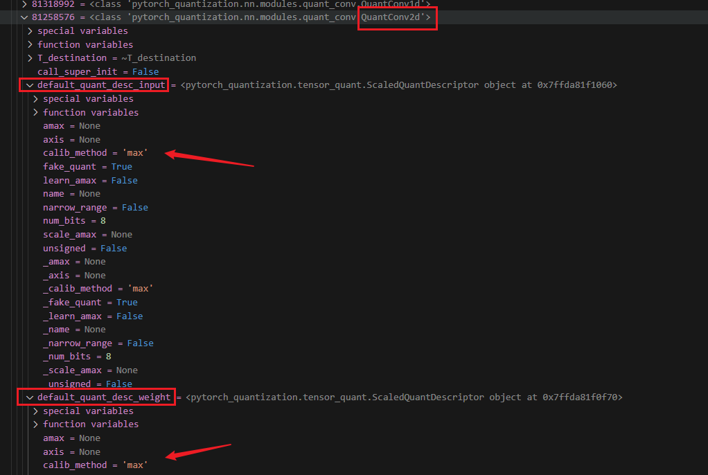

# 简介

针对NV的qat量化代码进行分析，主要针对如何插入QDQ节点进行说明，模型的qat训练暂时先不讨论，持续更新，看到哪里写道哪里

结合之前量化相关的博客食用更佳。

# 整体流程

NV有两份代码可以参考：

* https://github.com/NVIDIA-AI-IOT/yolo_deepstream/blob/main/yolov7_qat/scripts/qat-yolov5.py
* https://github.com/NVIDIA-AI-IOT/Lidar_AI_Solution/blob/master/CUDA-BEVFusion/qat/ptq.py

两个代码实现方式略有不同，可以对比一下对量化代码有一个更加深入的理解。

这里针对地一个代码进行一个整体流程的介绍，目前我使用的就是这套修改的

## 主要流程

下面代码解释了主要的插入QDQ的流程：

* 初始化：quantize.initialize()
* 加载模型：model   = load_yolov5s_model(weight, device)
* 替换自定义的量化模块：quantize.replace_bottleneck_forward(model)
* 替换自动匹配的量化模块：quantize.replace_to_quantization_module(model)
* 分析量化节点是否合理：quantize.apply_custom_rules_to_quantizer
* 量化模型校准：quantize.calibrate_model(model, train_dataloader, device)
* 敏感层分析：Sensitive analysis

```python
def cmd_quantize(weight, cocodir, device, ignore_policy, save_ptq, save_qat, supervision_stride, iters, eval_origin, eval_ptq):
    quantize.initialize()
    
    model   = load_yolov5s_model(weight, device)
    train_dataloader = create_coco_train_dataloader(cocodir)
    val_dataloader   = create_coco_val_dataloader(cocodir)
    quantize.replace_bottleneck_forward(model)
    quantize.replace_to_quantization_module(model, ignore_policy=ignore_policy)
    quantize.apply_custom_rules_to_quantizer(model, export_onnx)
    quantize.calibrate_model(model, train_dataloader, device)
    ...
```

再加上敏感层分析

```python
def cmd_sensitive_analysis(weight, device, cocodir, summary_save, num_image):
    ...
    print("Sensitive analysis by each layer...")
    for i in range(0, len(model.model)):
        layer = model.model[i]
        if quantize.have_quantizer(layer):
            print(f"Quantization disable model.{i}")
            quantize.disable_quantization(layer).apply()
            ap = evaluate_coco(model, val_dataloader)
            summary.append([ap, f"model.{i}"])
            quantize.enable_quantization(layer).apply()
        else:
            print(f"ignore model.{i} because it is {type(layer)}")
	....
    
```

我觉的更好的敏感层分析代码在https://github.com/NVIDIA-AI-IOT/Lidar_AI_Solution/blob/master/CUDA-BEVFusion/qat/lean/quantize.p

我实际参考就是这个，如下

```
def build_sensitivity_profile(model, data_loader_val, dataset_val, eval_model_callback : Callable = None):
    quant_layer_names = []
    for name, module in model.named_modules():
        if name.endswith("_quantizer"):
            print('use quant layer:{}',name)
            module.disable()
            layer_name = name.replace("._input_quantizer", "").replace("._weight_quantizer", "")
            if layer_name not in quant_layer_names:
                quant_layer_names.append(layer_name)
    for i, quant_layer in enumerate(quant_layer_names):
        print("Enable", quant_layer)
        for name, module in model.named_modules():
            if name.endswith("_quantizer") and quant_layer in name:
                module.enable()
                print(F"{name:40}: {module}")
        with torch.no_grad():
            eval_model_callback(model,data_loader_val, dataset_val) 
        for name, module in model.named_modules():
            if name.endswith("_quantizer") and quant_layer in name:
                module.disable()
                print(F"{name:40}: {module}")
```


## 初始化：quantize.initialize()

代码如下

```python
def initialize():
    quant_desc_input = QuantDescriptor(calib_method="histogram")#max or histogram   other methods are all hisogram based. Default "max".
    quant_nn.QuantConv2d.set_default_quant_desc_input(quant_desc_input)
    quant_nn.QuantMaxPool2d.set_default_quant_desc_input(quant_desc_input)
    quant_nn.QuantLinear.set_default_quant_desc_input(quant_desc_input)
    
    #quant_desc_input = QuantDescriptor(calib_method="max")#["max", "histogram"]
    #quant_desc_weight = QuantDescriptor(calib_method="max")#["max", "histogram"]
    #quant_nn.QuantConv2d.set_default_quant_desc_input(quant_desc_input)
    #quant_nn.QuantConv2d.set_default_quant_desc_weight(quant_desc_weight)
    
    quant_logging.set_verbosity(quant_logging.ERROR)
```

上面的代码主要就是设置了针对QuantConv2d、QuantMaxPool2d、QuantLinear的input的QuantDescriptor，全部设置为calib_method="histogram"。

* calib_method可以设置为max or histogram   other methods are all hisogram based. Default "max". 也就是校准的方法。校准方法有什么用？在后面量化模型校准再呼应上讲解。
  * 什么时候需要调整calib_method呢？可以根据量化的精度或者层的数据分布决定，在量化精度不好的情况下可以修改测试。
  * histogram 还细分为几个method：entropy、mse、percentile。如何设置呢？
    * 如果这里设置的calib_method="histogram"，那么在量化模型校准时，需要设置的参数load_calib_amax实现指定method是entropy、mse、percentile其中的一个
    * 如果这里设置的calib_method="max"，那么在量化模型校准时，load_calib_amax默认值就行，或者指定method为max
  * 注：如果希望改变整体的量化方法，就在这里修改。如果是希望整体都是max，但是部分是histogram，我还没有测试如何实现。

* set_default_quant_desc_input方法设置了input的quant_desc为quant_desc_input。也就是只有input的calib_method="histogram"
* 其实除了set_default_quant_desc_input 还有一个方法为set_default_quant_desc_weight。也就是可以单独的指定input和weightQuantDescriptor。可以参考pytorch_quantization/nn/modules/_utils.py
  * set_default_quant_desc_input 设置输入的QuantDescriptor
  * set_default_quant_desc_weight 设置权重的QuantDescriptor

例如我下面QuantConv2d设置的QuantDescriptor都是max



## 加载模型

没什么讲解的，就是加载原始的pth模型而已。这时的模型是原始的，我们需要在这个模型上添加QDQ节点。


## 替换自动匹配的量化模块

调用官方的replace_to_quantization_module(model)函数就可以了。不需要修改

作用就是替换自动匹配的算子为量化版本的算子，例如conv2d->QuantConv2d


```python

def transfer_torch_to_quantization(nninstance: torch.nn.Module, quantmodule):

    quant_instance = quantmodule.__new__(quantmodule)
    for k, val in vars(nninstance).items():
        setattr(quant_instance, k, val)

    def __init__(self):
        if isinstance(self, QuantAdaptiveAvgPool2d):
            quant_desc_input = quant_nn_utils.pop_quant_desc_in_kwargs(self.__class__, input_only=True)
        else:
            quant_desc_input, quant_desc_weight = quant_nn_utils.pop_quant_desc_in_kwargs(self.__class__)

        if isinstance(self, quant_nn_utils.QuantInputMixin):
            self.init_quantizer(quant_desc_input)

            # Turn on torch_hist to enable higher calibration speeds
            if isinstance(self._input_quantizer._calibrator, calib.HistogramCalibrator):
                self._input_quantizer._calibrator._torch_hist = True
        else:
            self.init_quantizer(quant_desc_input, quant_desc_weight)

            # Turn on torch_hist to enable higher calibration speeds
            if isinstance(self._input_quantizer._calibrator, calib.HistogramCalibrator):
                self._input_quantizer._calibrator._torch_hist = True
                self._weight_quantizer._calibrator._torch_hist = True

    __init__(quant_instance)
    return quant_instance
def replace_to_quantization_module(model: torch.nn.Module, ignore_policy: Union[str, List[str], Callable] = None):

    module_dict = {}
    for entry in quant_modules._DEFAULT_QUANT_MAP:
        module = getattr(entry.orig_mod, entry.mod_name)
        module_dict[id(module)] = entry.replace_mod

    def recursive_and_replace_module(module, prefix=""):
        if module is None:
            print(f"[WARNING] Module at '{prefix}' is None, skipping...")
            return
        for name in module._modules:
            submodule = module._modules[name]
            path = name if prefix == "" else prefix + "." + name
            recursive_and_replace_module(submodule, path)

            submodule_id = id(type(submodule))
            if submodule_id in module_dict:
                ignored = quantization_ignore_match(ignore_policy, path)
                if ignored:
                    print(f"Quantization: {path} has ignored.")
                    continue

                module._modules[name] = transfer_torch_to_quantization(submodule, module_dict[submodule_id])

    recursive_and_replace_module(model)

```

自动替换的算子参考参考 pytorch_quantization/quant_modules.py

```python
_DEFAULT_QUANT_MAP = [_quant_entry(torch.nn, "Conv1d", quant_nn.QuantConv1d),
                      _quant_entry(torch.nn, "Conv2d", quant_nn.QuantConv2d),
                      _quant_entry(torch.nn, "Conv3d", quant_nn.QuantConv3d),
                      _quant_entry(torch.nn, "ConvTranspose1d", quant_nn.QuantConvTranspose1d),
                      _quant_entry(torch.nn, "ConvTranspose2d", quant_nn.QuantConvTranspose2d),
                      _quant_entry(torch.nn, "ConvTranspose3d", quant_nn.QuantConvTranspose3d),
                      _quant_entry(torch.nn, "Linear", quant_nn.QuantLinear),
                      _quant_entry(torch.nn, "LSTM", quant_nn.QuantLSTM),
                      _quant_entry(torch.nn, "LSTMCell", quant_nn.QuantLSTMCell),
                      _quant_entry(torch.nn, "AvgPool1d", quant_nn.QuantAvgPool1d),
                      _quant_entry(torch.nn, "AvgPool2d", quant_nn.QuantAvgPool2d),
                      _quant_entry(torch.nn, "AvgPool3d", quant_nn.QuantAvgPool3d),
                      _quant_entry(torch.nn, "AdaptiveAvgPool1d", quant_nn.QuantAdaptiveAvgPool1d),
                      _quant_entry(torch.nn, "AdaptiveAvgPool2d", quant_nn.QuantAdaptiveAvgPool2d),
                      _quant_entry(torch.nn, "AdaptiveAvgPool3d", quant_nn.QuantAdaptiveAvgPool3d),]
```

经过上面的函数，模型中所有的算子，只要有对应量化版本的都会自动替换。

## 替换自定义的量化模块

为什么要有这个步骤？因为算子自动替换为量化算子的不能满足自己的所有情况，例如https://zmurder.github.io/TensorRT/TensorRT%E9%87%8F%E5%8C%96%E5%AE%9E%E6%88%98%E7%BB%8F%E9%AA%8C 中提到的残差部分，也就是add算子是不是需要插入QDQ。这些是需要手动实现的。也就需要自己实现一个QuantAdd

如何实现呢？

通过修改替换原始模型这部分的forward函数实现！

* 找模型原始的这部分的forward函数，依葫芦画瓢，重新写一个bottleneck_quant_forward
* 将原始的forward修改为自己重新的  bottleneck.__class__.forward = bottleneck_quant_forward
* 同时给这部分添加一个属性“addop” ，bottleneck.addop = QuantAdd(bottleneck.add) 这个就是在自己修改的bottleneck_quant_forward中调用addop。就实现了替换。
* 编写实现QuantAdd  我们参考官方代码依葫芦画瓢即可。
* 可以看到这里也使用到了QuantDescriptor。

### 官方实例写法

```python
class QuantAdd(torch.nn.Module):
    def __init__(self, quantization):
        super().__init__()

        if quantization:
            self._input0_quantizer = quant_nn.TensorQuantizer(QuantDescriptor(num_bits=8, calib_method="histogram"))
            self._input1_quantizer = quant_nn.TensorQuantizer(QuantDescriptor(num_bits=8, calib_method="histogram"))
            self._input0_quantizer._calibrator._torch_hist = True
            self._input1_quantizer._calibrator._torch_hist = True
            self._fake_quant = True
        self.quantization = quantization

    def forward(self, x, y):
        if self.quantization:
            # print(f"QAdd {self._input0_quantizer}  {self._input1_quantizer}")
            return self._input0_quantizer(x) + self._input1_quantizer(y)
        return x + y
    
# For example: YoloV5 Bottleneck
def bottleneck_quant_forward(self, x):
    if hasattr(self, "addop"):
        return self.addop(x, self.cv2(self.cv1(x))) if self.add else self.cv2(self.cv1(x))
    return x + self.cv2(self.cv1(x)) if self.add else self.cv2(self.cv1(x))


# For example: YoloV5 Bottleneck
def replace_bottleneck_forward(model):
    for name, module in model.named_modules():
        if module.__class__.__name__ == "Bottleneck": # 模型中所有的这个名字的都被替换
        #if isinstance(module, mmdet.models.backbones.resnext.Bottleneck):#更精细的控制，之替换backbone中的Bottleneck
            if bottleneck.add:
                if not hasattr(bottleneck, "addop"):
                    print(f"Add QuantAdd to {name}")
                    bottleneck.addop = QuantAdd(bottleneck.add)
                bottleneck.__class__.forward = bottleneck_quant_forward
```


例如我们可以写一个QuantConcat

参考[Lidar_AI_Solution/CUDA-BEVFusion/qat/lean/quantize.py at master · NVIDIA-AI-IOT/Lidar_AI_Solution](https://github.com/NVIDIA-AI-IOT/Lidar_AI_Solution/blob/master/CUDA-BEVFusion/qat/lean/quantize.py#L45)

```python
class QuantConcat(torch.nn.Module):
    def __init__(self, quantization =True):
        super().__init__()

        if quantization:
            self._input_quantizer = quant_nn.TensorQuantizer(QuantDescriptor(num_bits=8, calib_method="histogram"))
            self._input_quantizer._calibrator._torch_hist = True
            self._fake_quant = True
        self.quantization = quantization

    def forward(self, x,  y):
        if self.quantization:
            return torch.cat([self._input_quantizer(x), self._input_quantizer(y)], dim=1)
        return torch.cat([x, y], dim=1)
```


### 另外一种写法

还是以QuantAdd为例

```python
class QuantAdd(torch.nn.Module):
    def __init__(self, quantization, downsample_flag):
        super().__init__()

        if quantization:
            self._input0_quantizer = quant_nn.TensorQuantizer(QuantDescriptor(num_bits=8, calib_method="max"))
            self._input1_quantizer = quant_nn.TensorQuantizer(QuantDescriptor(num_bits=8, calib_method="max"))
            self._input0_quantizer._calibrator._torch_hist = True
            self._input1_quantizer._calibrator._torch_hist = True
            self._fake_quant = True
        self.quantization = quantization
        self.downsample_flag = downsample_flag

    def forward(self, x, y):
        # if self.quantization:
        #     return self._input0_quantizer(x) + self._input1_quantizer(y)
        if self.quantization and self.downsample_flag:  #  优化 add两个输入都加QDQ还是只有一个输入加QDQ
            # print(f"QAdd {self._input0_quantizer}  {self._input1_quantizer}")
            return self._input0_quantizer(x) + self._input1_quantizer(y)
        elif self.quantization:
            return x + self._input1_quantizer(y)

        return x + y
    


def Bottleneck_quant_forward(self, x):
    # /data/users/zhaoyidong/code/parking3d/mmmultitask/bak/mmdetection/mmdet/models/backbones/resnet.py
    """Forward function."""

    def _inner_forward(x):
        identity = x
        out = self.conv1(x)
        out = self.norm1(out)
        if model_pruning:
            out = self.relu(out)
        else:
            out = self.relu1(out)

        if self.with_plugins:
            out = self.forward_plugin(out, self.after_conv1_plugin_names)

        out = self.conv2(out)
        out = self.norm2(out)
        if model_pruning:
            out = self.relu(out)
        else:
            out = self.relu2(out)

        if self.with_plugins:
            out = self.forward_plugin(out, self.after_conv2_plugin_names)

        out = self.conv3(out)
        out = self.norm3(out)

        if self.with_plugins:
            out = self.forward_plugin(out, self.after_conv3_plugin_names)
        if self.downsample is not None:
            identity = self.downsample(x)

        if hasattr(self, "addop"):
            return self.addop(out, identity)
        out += identity

        return out

    if self.with_cp and x.requires_grad:
        out = cp.checkpoint(_inner_forward, x)
    else:
        out = _inner_forward(x)

    if model_pruning:
        out = self.relu(out)
    else:
        out = self.relu3(out)

    return out

def replace_bottleneck_forward(module, quantization):
    for name, child in module.named_children():
        # print(f"child={child} type(child)={type(child)}")
        if isinstance(child, mmdet.models.backbones.resnext.Bottleneck):
            if not hasattr(child, "addop"):
                print(f"**** Add QuantAdd to {name}")
                downsample_flag = False  # downsample_flag = True
                if child.downsample == None:
                    downsample_flag = False
                child.addop = QuantAdd(quantization, downsample_flag)  # downsample_flag=False 残差结构的残差部分有QDQ，另一个不用。可以使conv add relu 融合
            # 将 forward 方法替换为新的 forward 方法
            child.__class__.forward = Bottleneck_quant_forward
        else:
            # 递归处理子模块
            replace_bottleneck_forward(child, quantization)

```

### 对比

官方的写法

```python
def replace_bottleneck_forward(model):
    for name, module in model.named_modules():
        if module.__class__.__name__ == "Bottleneck": # 模型中所有的这个名字的都被替换
        #if isinstance(module, mmdet.models.backbones.resnext.Bottleneck):#更精细的控制，之替换backbone中的Bottleneck
        ....
        
```

- 使用 `named_modules()` 遍历整个模型，查找所有名为 `"Bottleneck"` 的模块。如果有不同的部分（例如backbone 和 neck）都有`"Bottleneck"` 的模块，但是希望只控制backbone中的，那么不能使用`if bottleneck.__class__.__name__ == "Bottleneck":`来匹配了。
- 因为 `Concat` 可能出现在模型任意位置（比如 neck 或 head 中），所以需要用 `named_modules()` 来覆盖所有可能位置。

**结论**：适用于全局搜索某一类模块（无论嵌套几层），适合 `Bottleneck` 这种分布较广的模块。


```python
def replace_bottleneck_forward(module, quantization):
    for name, child in module.named_children():
        # print(f"child={child} type(child)={type(child)}")
        if isinstance(child, Bottleneck):
            # 替换 Bottleneck 的 forward，并添加 QuantAdd
            ...
        else:
            # 递归处理子模块
            replace_bottleneck_forward(child, quantization)
```

- 使用 `named_children()` 处理当前模块下的每个子模块；
- 如果不是 `Bottleneck`，就递归进入子模块继续查找；


首先。这两个函数目前都传入的是整个模型，其实可以传入模型的一个模块。例如官方的参考[Lidar_AI_Solution/CUDA-BEVFusion/qat/lean/quantize.py at master · NVIDIA-AI-IOT/Lidar_AI_Solution](https://github.com/NVIDIA-AI-IOT/Lidar_AI_Solution/blob/master/CUDA-BEVFusion/qat/lean/quantize.py#L167)

传入的是就是`model_camera_branch.backbone`只是模型的backbone部分，那么就只是处理这一部分了。

我理解那一种都可以，只要能精细控制自己需要修改的即可。


## 分析量化节点是否合理

在实现了所有的算子都量化完成后，可以对比一下使用trtexec  --best 生成的最快的模型的engine结构图，和自己量化生成的onnx的结构图。对比一下是不是基本上相同的，例如算子融合和算子的精度。如果不同，针对修改（一般是通过替换自定义的量化模块，重新编写forward实现）

具体绘制engine结构图的方法参考[TensorRT量化实战经验 | 奔跑的IC](https://zmurder.github.io/TensorRT/TensorRT量化实战经验/?highlight=svg#engine结构图的绘制)

对应best和量化模型的trtexec命令参考如下

```bash
#--best
/usr/src/tensorrt/bin/trtexec --onnx=test.onnx --saveEngine=test_int8.engine --int8 --fp16 --verbose --dumpLayerInfo --dumpProfile --profilingVerbosity=detailed  --exportLayerInfo=test_int8_layer.json --exportProfile=test_int8_profile.json --exportTimes=test_int8_time.json  >test_int8.log 2>&1

#qdq模型
/usr/src/tensorrt/bin/trtexec  --onnx=test_qdq.onnx --saveEngine=test_qdq.engine  --int8 --fp16 --verbose --dumpLayerInfo --dumpProfile --profilingVerbosity=detailed  --exportLayerInfo=test_qdq_layer.json --exportProfile=test_qdq_profile.json --exportTimes=test_qdq_time.json >test_qdq.log 2>&1

```

其中可能遇到的是一些节点的scalse必须是相同的，tensorrt才能进行层融合，是qdq的模型达到best的速度融合效果。

在模型经过校准后，节点的scales几乎都是不同的，这就需要指定那些节点的scalse应该是相同的，调用函数`apply_custom_rules_to_quantizer`,参考官方即可。官方实际上实现了一般的Concat节点前后的scalse匹配相等的操作，参考[TensorRT量化实战经验 | 奔跑的IC](https://zmurder.github.io/TensorRT/TensorRT量化实战经验/?highlight=concat#concat节点)

但是有的模型比较负载，不一定可以所有的concat节点都可以自动处理正确，所以在下面`find_quantizer_pairs`函数中我添加了几个手动匹配的

例如手动匹配的

`match_pairs.append(['model.img_backbone.stage1.1.final_conv.conv','model.img_backbone.stage1.1.blocks.0.addop'])`

然后在下面代码中设置scales相等

```python
			major = get_attr_with_path(model, major)._input_quantizer
            get_attr_with_path(model, sub)._input0_quantizer = major
            get_attr_with_path(model, sub)._input1_quantizer = major
        else:
            get_attr_with_path(model, sub)._input_quantizer = get_attr_with_path(model, major)._input_quantizer
```


```python

def find_quantizer_pairs(onnx_file):

    model = onnx.load(onnx_file)
    match_pairs = []
    for node in model.graph.node:
        if node.op_type == "Concat":
            qnodes = find_all_with_input_node(model, node.output[0])
            major = None
            for qnode in qnodes:
                if qnode.op_type != "QuantizeLinear":
                    continue

                conv = find_quantizelinear_conv(model, qnode)
                if major is None:
                    major = find_quantize_conv_name(model, conv.input[1])
                else:
                    match_pairs.append([major, find_quantize_conv_name(model, conv.input[1])])

                for subnode in model.graph.node:
                    if len(subnode.input) > 0 and subnode.op_type == "QuantizeLinear" and subnode.input[0] in node.input:
                        subconv = find_quantizelinear_conv(model, subnode)
                        match_pairs.append([major, find_quantize_conv_name(model, subconv.input[1])])

        elif node.op_type == "MaxPool":
            qnode = find_with_input_node(model, node.output[0])
            if not (qnode and qnode.op_type == "QuantizeLinear"):
                continue

            major = find_quantizelinear_conv(model, qnode)
            major = find_quantize_conv_name(model, major.input[1])
            same_input_nodes = find_all_with_input_node(model, node.input[0])

            for same_input_node in same_input_nodes:
                if same_input_node.op_type == "QuantizeLinear":
                    subconv = find_quantizelinear_conv(model, same_input_node)
                    match_pairs.append([major, find_quantize_conv_name(model, subconv.input[1])])
                    
    #下面是手动指定匹配
    match_pairs.append(["model.img_neck.top_down_layers.0.main_conv.conv", "model.img_neck.bottom_up_layers.1.main_conv.conv"])
    match_pairs.append(["model.img_neck.top_down_layers.0.main_conv.conv", "model.det2d_neck.bottom_up_layers.1.main_conv.conv"])
    
    match_pairs.append(["model.img_neck.top_down_layers.1.main_conv.conv", "model.img_neck.bottom_up_layers.0.main_conv.conv"])
    match_pairs.append(["model.det2d_neck.bottom_up_layers.0.main_conv.conv", "model.det2d_neck.top_down_layers.1.main_conv.conv"])

    match_pairs.append(['model.img_backbone.stage1.1.final_conv.conv','model.img_backbone.stage1.1.oneop'])
    match_pairs.append(['model.img_backbone.stage2.1.final_conv.conv','model.img_backbone.stage2.1.oneop'])
    match_pairs.append(['model.img_backbone.stage3.1.final_conv.conv','model.img_backbone.stage3.1.oneop'])
    match_pairs.append(['model.img_backbone.stage4.1.final_conv.conv','model.img_backbone.stage4.1.oneop'])

    match_pairs.append(['model.img_backbone.stage1.1.final_conv.conv','model.img_backbone.stage1.1.blocks.0.addop'])
    match_pairs.append(['model.img_backbone.stage2.1.final_conv.conv','model.img_backbone.stage2.1.blocks.0.addop'])
    match_pairs.append(['model.img_backbone.stage2.1.final_conv.conv','model.img_backbone.stage2.1.blocks.1.addop'])
    match_pairs.append(['model.img_backbone.stage3.1.final_conv.conv','model.img_backbone.stage3.1.blocks.0.addop'])
    match_pairs.append(['model.img_backbone.stage3.1.final_conv.conv','model.img_backbone.stage3.1.blocks.1.addop'])
    match_pairs.append(['model.img_backbone.stage4.1.final_conv.conv','model.img_backbone.stage4.1.blocks.0.addop'])

    return match_pairs

def apply_custom_rules_to_quantizer(model: torch.nn.Module, export_onnx: Callable):
    # apply rules to graph
    export_onnx(model, "quantization-custom-rules-temp.onnx")
    pairs = find_quantizer_pairs("quantization-custom-rules-temp.onnx")
    for major, sub in pairs:
        print(f"Rules: {sub} match to {major}")
        if sub in [
            "model.img_backbone.stage1.1.blocks.0.addop",
            "model.img_backbone.stage2.1.blocks.0.addop",
            "model.img_backbone.stage2.1.blocks.1.addop",
            "model.img_backbone.stage3.1.blocks.0.addop",
            "model.img_backbone.stage3.1.blocks.1.addop",
            "model.img_backbone.stage4.1.blocks.0.addop",
        ]:

            major = get_attr_with_path(model, major)._input_quantizer
            get_attr_with_path(model, sub)._input0_quantizer = major
            get_attr_with_path(model, sub)._input1_quantizer = major
        else:
            get_attr_with_path(model, sub)._input_quantizer = get_attr_with_path(model, major)._input_quantizer
    os.remove("quantization-custom-rules-temp.onnx")
```


## 量化模型校准

通过上面几步。我们设置了量化方法，替换了量化算子、替换自定义的量化算子、下面就是加载数据集进行量化校准了，也就是计算scales值。

使用官方的代码，几乎不用修改

```python

def calibrate_model(model : torch.nn.Module, dataloader, device, num_batch=25):

    def compute_amax(model, **kwargs):
        for name, module in model.named_modules():
            if isinstance(module, quant_nn.TensorQuantizer):
                if module._calibrator is not None:
                    if isinstance(module._calibrator, calib.MaxCalibrator):
                        module.load_calib_amax()
                    else:
                        module.load_calib_amax(**kwargs)

                    module._amax = module._amax.to(device)
        
    def collect_stats(model, data_loader, device, num_batch=200):
        """Feed data to the network and collect statistics"""
        # Enable calibrators
        model.eval()
        for name, module in model.named_modules():
            if isinstance(module, quant_nn.TensorQuantizer):
                if module._calibrator is not None:
                    module.disable_quant()
                    module.enable_calib()
                else:
                    module.disable()

        # Feed data to the network for collecting stats
        with torch.no_grad():
            for i, datas in tqdm(enumerate(data_loader), total=num_batch, desc="Collect stats for calibrating"):
                imgs = datas[0].to(device, non_blocking=True).float() / 255.0
                model(imgs)

                if i >= num_batch:
                    break

        # Disable calibrators
        for name, module in model.named_modules():
            if isinstance(module, quant_nn.TensorQuantizer):
                if module._calibrator is not None:
                    module.enable_quant()
                    module.disable_calib()
                else:
                    module.enable()

    collect_stats(model, dataloader, device, num_batch=num_batch)
    compute_amax(model, method="mse")
    #computeArgMax(model, method="percentile",percentile=99.999)# calib_method="histogram" 时必须设置method

```

这里有一个地方需要注意，就是最后一行`compute_amax(model, method="mse")`

```python
    def compute_amax(model, **kwargs):
        for name, module in model.named_modules():
            if isinstance(module, quant_nn.TensorQuantizer):
                if module._calibrator is not None:
                    if isinstance(module._calibrator, calib.MaxCalibrator):
                        module.load_calib_amax()
                    else:
                        module.load_calib_amax(**kwargs)
```

判断_calibrator：这个就是我们设置的`QuantDescriptor`相关，例如在`quantize.initialize()`设置的和`QuantAdd`中设置的`QuantDescriptor`的calib_method，分为`max和histogram`

* `MaxCalibrator`时 调用`module.load_calib_amax()`
* 其他（也就是HistogramCalibrator时）调用`module.load_calib_amax(**kwargs)`，同时有**参数传入*，我们就是在这里指定calib_method="histogram" 时的method，如果设置method="percentile" 我们还可以设置百分比 percentile=99.999（默认是99.99）, `omputeArgMax(model, method="percentile",percentile=99.999)`

## 敏感层分析

参考官方代码如下即可

```python
def build_sensitivity_profile(model, data_loader_val, dataset_val, eval_model_callback : Callable = None):
    quant_layer_names = []
    for name, module in model.named_modules():
        if name.endswith("_quantizer"):
            print('use quant layer:{}',name)
            module.disable()
            layer_name = name.replace("._input_quantizer", "").replace("._weight_quantizer", "")
            if layer_name not in quant_layer_names:
                quant_layer_names.append(layer_name)
    for i, quant_layer in enumerate(quant_layer_names):
        print("Enable", quant_layer)
        for name, module in model.named_modules():
            if name.endswith("_quantizer") and quant_layer in name:
                module.enable()
                print(F"{name:40}: {module}")
        with torch.no_grad():
            eval_model_callback(model,data_loader_val, dataset_val) 
        for name, module in model.named_modules():
            if name.endswith("_quantizer") and quant_layer in name:
                module.disable()
                print(F"{name:40}: {module}")
```

主要就是通过一个节点一个节点的打开量化，计算精度。然后关闭这个节点的量化，打开下一节点的量化重新计算精度。就这样每次只打开一个节点的量化计算精度，看看那一个是敏感层，后面都分析完成后，将敏感层不量化即可保证和原始模型几乎下相同的精度了。

# 知识点

## PER_TENSOR与PER_CHANNEL量化

先说结论。默认情况，以QuantConv2d为例子

* input：QUANT_DESC_8BIT_PER_TENSOR
* weight：QUANT_DESC_8BIT_CONV2D_WEIGHT_PER_CHANNEL

也就是说input是per_tensor 为单位量化，因为输入是一个整体，一个整体一个量化scalse 合理

weight是per_channel 量化的，也就是每个通道计算一个scalse。精度可以更好。

## 类的继承关系

在官方pytorch_quantization代码中，梳理了部分的继承关系如下：

### QuantConv2d

`QuantConv2d` 继承自 `_QuantConvNd`，`_QuantConvNd` 又继承自 `QuantMixin` 类。

其中`QuantDescriptor = ScaledQuantDescriptor`

### QuantMixin

`QuantMixin`有以下方法

* `set_default_quant_desc_weight()`

* `set_default_quant_desc_input()`

  * 这两个函数的参数都是`QuantDescriptor`，使用方法如下

  ```python
  quant_desc_input = QuantDescriptor(calib_method="histogram")#["max", "histogram"]
  quant_desc_weight = QuantDescriptor(calib_method="histogram")#["max", "histogram"]
  quant_nn.QuantConv2d.set_default_quant_desc_input(quant_desc_input)
  quant_nn.QuantConv2d.set_default_quant_desc_weight(quant_desc_weight)
  ```

* `init_quantizer(self, quant_desc_input, quant_desc_weight, num_layers=None):`中

  ```python
  		if num_layers is None:
              self._input_quantizer = TensorQuantizer(quant_desc_input)
              self._weight_quantizer = TensorQuantizer(quant_desc_weight)
          else:
              self._input_quantizers = nn.ModuleList([TensorQuantizer(quant_desc_input) for _ in range(num_layers)])
              self._weight_quantizers = nn.ModuleList([TensorQuantizer(quant_desc_weight) for _ in range(num_layers)])
  ```

### TensorQuantizer

`TensorQuantizer`

```python
class TensorQuantizer(nn.Module):
    def __init__(self, quant_desc=QuantDescriptor(), disabled=False, if_quant=True, if_clip=False, if_calib=False):
        ...
        if quant_desc.calib_method == "histogram":
            logging.info("Creating histogram calibrator")
            self._calibrator = calib.HistogramCalibrator(
                num_bits=self._num_bits, axis=self._axis, unsigned=self._unsigned)
        elif quant_desc.calib_method == "max":
            logging.info("Creating Max calibrator")
            self._calibrator = calib.MaxCalibrator(num_bits=self._num_bits, axis=self._axis, unsigned=self._unsigned)
        ...
```

根据不同的`calib_method`来设置了`_calibrator`为`HistogramCalibrator`或者`MaxCalibrator`

上面的初始化用到了`quant_desc=QuantDescriptor()`用的都是默认的

在看一下`QuantDescriptor`

### QuantDescriptor

上面提到了QuantDescriptor = ScaledQuantDescriptor

因此看一下ScaledQuantDescriptor 有下面代码

```python
class ScaledQuantDescriptor():
    def __init__(self, num_bits=8, name=None, **kwargs):
    ...
    self._calib_method = kwargs.pop('calib_method', "max")
    ...
```

可以看出设置了默认的`calib_method`为`max`


# 附录：

* NV官方量化代码
  * https://github.com/NVIDIA-AI-IOT/yolo_deepstream/blob/main/yolov7_qat/scripts/qat-yolov5.py
  * https://github.com/NVIDIA-AI-IOT/Lidar_AI_Solution/blob/master/CUDA-BEVFusion/qat/ptq.py


