# 1 Plugin简介

网络模型就是很多层组成的，tensorRT基本上比较经典的层比如，卷积，反卷积，全连接，RNN，softmax等，在tensorRT中都是有对应的实现方式的，tensorRT是可以直接解析的。但是由于现在深度学习技术发展日新月异，各种不同结构的自定义层（比如：STN）层出不穷，所以tensorRT是不可能全部支持当前存在的所有层的。那对于这些自定义的层该怎么办？

**tensorRT中有一个 Plugin 层，这个层提供了 API 可以由用户自己定义tensorRT不支持的层。**

**可以看出，编写plugin实际就是编写一个自定义的算子（因为TensorRT支持的算子有限）。**顺便介绍一下算子

## 1.1 算子

参考网址 https://support.huawei.com/enterprise/zh/doc/EDOC1100180768/9dd5739

深度学习算法由一个个计算单元组成，我们称这些计算单元为算子（Operator，简称Op）。在网络模型中，算子对应层中的计算逻辑，例如：卷积层（Convolution Layer）是一个算子；全连接层（Fully-connected Layer， FC layer）中的权值求和过程，是一个算子。

### 1.1.1 **算子名称（Name）**

算子的name，用于标志网络中的某个算子，同一网络中算子的名称需要保持唯一。如下图所示conv1，pool1，conv2都是此网络中的算子名称，其中conv1与conv2算子的类型为Convolution，表示分别做一次卷积运算。

图1-1  网络拓扑示例
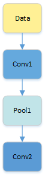

### 1.1.2 **算子类型（Type）**

算子的Type，代表算子的类型，例如卷积算子的类型为Convolution，在一个网络中同一类型的算子可能存在多个。

### 1.1.3 **张量（Tensor）**

Tensor是算子中的数据，包括输入数据与输出数据，TensorDesc（Tensor描述符）是对输入数据与输出数据的描述，TensorDesc数据结构包含如下属性如[表1-1](https://support.huawei.com/enterprise/zh/doc/EDOC1100180768/9dd5739#tb6e37f72bced414fa0adde77dc48447f)所示。

表1-1  TensorDesc属性解释

| 属性                   | 定义                                                         |
| ---------------------- | ------------------------------------------------------------ |
| 名称（name）           | 用于对Tensor进行索引，不同Tensor的name需要保持唯一。         |
| 形状（shape）          | Tensor的形状，比如（10,）或者（1024，1024）或者（2，3，4）等。详细介绍请参见[ 形状（shape）](https://support.huawei.com/enterprise/zh/doc/EDOC1100180768/9dd5739#section1546519496196)。 默认值：无 形式：(i1, i2,…in)，其中i1到in均为正整数 |
| 数据类型（dtype）      | 功能描述：指定Tensor对象的数据类型。 默认值：无 取值范围：float16, float32, int8, int16, int32, uint8, uint16, bool。 |
| 数据排布格式（format） | 详细请参见[ 数据排布格式（format）](https://support.huawei.com/enterprise/zh/doc/EDOC1100180768/9dd5739#section125241018101614)。 |

### 1.1.4 **数据排布格式（Format）**

在深度学习框架中，多维数据通过多维数组存储，比如卷积神经网络的特征图用四维数组保存，四个维度分别为批量大小（Batch, N）、特征图高度（Height, H）、特征图宽度（Width, W）以及特征图通道（Channels, C）。

由于数据只能线性存储，因为这四个维度有对应的顺序。不同深度学习框架会按照不同的顺序存储特征图数据，比如Caffe，排列顺序为[Batch, Channels, Height, Width]，即NCHW。Tensorflow中，排列顺序为[Batch, Height, Width,  Channels]，即NHWC。

如[图1-2](https://support.huawei.com/enterprise/zh/doc/EDOC1100180768/9dd5739#f01701bda7d07409aa921940ae9897c13)所示，以一张格式为RGB的图片为例，NCHW中，C排列在外层，实际存储的是“RRRGGGBBB”，即同一通道的所有像素值顺序存储在一起；而NHWC中C排列在最内层，实际存储的则是“RGBRGBRGB”，即多个通道的同一位置的像素值顺序存储在一起。

图1-2  NCHW和NHWC
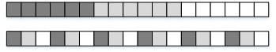


### 1.1.5 **形状（Shape）**

张量的形状，以(D0, D1, … ,Dn-1)的形式表示，D0到Dn是任意的正整数。

如形状(3,4)表示第一维有3个元素，第二维有4个元素，(3,4)表示一个3行4列的矩阵数组。

在形状的小括号中有多少个数字，就代表这个张量是多少维的张量。形状的第一个元素要看张量最外层的中括号中有几个元素，形状的第二个元素要看张量中从左边开始数第二个中括号中有几个元素，依此类推。例如：

表1-2  张量的形状举例

| 张量                           | 形状    |
| ------------------------------ | ------- |
| 1                              | (0,)    |
| [1,2,3]                        | (3,)    |
| [[1,2],[3,4]]                  | (2,2)   |
| [[[1,2],[3,4]], [[5,6],[7,8]]] | (2,2,2) |

物理含义我们应该怎么理解呢？假设我们有这样一个shape=(4, 20, 20, 3)。

假设有一些照片，每个像素点都由红/绿/蓝3色组成，即shape里面3的含义，照片的宽和高都是20，也就是20*20=400个像素，总共有4张的照片，这就是shape=(4, 20, 20, 3)的物理含义。

图1-3  示意图：
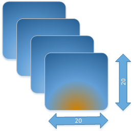

如果体现在编程上，可以简单把shape理解为操作Tensor的各层循环，比如我们要对shape=(4, 20, 20, 3)的A tensor进行操作，循环语句如下：

```c++
produce A {
  for (i, 0, 4) {
    for (j, 0, 20) {
      for (p, 0, 20) {
        for (q, 0, 3) {
          A[((((((i*20) + j)*20) + p)*3) + q)] = a_tensor[((((((i*20) + j)*20) + p)*3) + q)]
        }
      }
    }
  }
}
```

### 1.1.6 **轴（axis）**

轴是相对Shape来说的，轴代表张量的shape的下标，比如张量a是一个5行6列的二维数组，即shape是(5,6)，则axis=0表示是张量中的第一维，即行。axis=1表示是张量中的第二维，即列。

例如张量数据[[[1,2],[3,4]],  [[5,6],[7,8]]]，Shape为(2,2,2)，则轴0代表第一个维度的数据即[[1,2],[3,4]]与[[5,6],[7,8]]这两个矩阵，轴1代表第二个维度的数据即[1,2]、[3,4]、[5,6]、[7,8]这四个数组，轴2代表第三个维度的数据即1，2，3，4，5，6，7，8这八个数。

轴axis可以为负数，此时表示是倒数第axis个维度。

N维Tensor的轴有：0 , 1, 2,……，N-1。

图1-4  轴示意图：
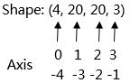

### 1.1.7 **权重（weights）**

当输入数据进入计算单元时，会乘以一个权重。例如，如果一个算子有两个输入，则每个输入会分配一个关联权重，一般将认为较重要数据赋予较高的权重，不重要的数据赋予较小的权重，为零的权重则表示特定的特征是无需关注的。

如[图1-5](https://support.huawei.com/enterprise/zh/doc/EDOC1100180768/9dd5739#zh-cn_topic_0000001073361370_f231ebde3733e42b181faee9678387dec)所示，假设输入数据为X1，与其相关联的权重为W1，那么在通过计算单元后，数据变为了X1*W1。

图1-5  权重计算示例
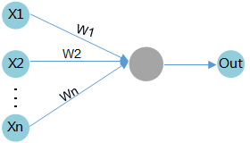

### 1.1.8 **偏差（bias）**

偏差是除了权重之外，另一个被应用于输入数据的线性分量。它被加到权重与输入数据相乘的结果中，用于改变权重与输入相乘所得结果的范围。

如[图1-6](https://support.huawei.com/enterprise/zh/doc/EDOC1100180768/9dd5739#zh-cn_topic_0000001073361370_ff87eef1acc86457686ad23b592357cee)所示，假设输入数据为X1，与其相关联的权重为W1，偏差为B1，那么在通过计算单元后，数据变为了X1*W1+B1。

图1-6  偏差计算示例
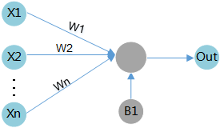

# 2 官方中文

官方参考[中文](https://developer.nvidia.com/zh-cn/blog/tensorrt-custom-layer-cn/#:~:text=%E8%A6%81%E5%9C%A8%E5%BA%94%E7%94%A8%E7%A8%8B%E5%BA%8F%E4%B8%AD%E4%BD%BF%E7%94%A8%20TensorRT%20%E6%8F%92%E4%BB%B6%EF%BC%8C%E5%BF%85%E9%A1%BB%E5%8A%A0%E8%BD%BD,libnvinfer_plugin.so%20%E5%BA%93%EF%BC%8C%E5%B9%B6%E4%B8%94%E5%BF%85%E9%A1%BB%E9%80%9A%E8%BF%87%E5%9C%A8%E5%BA%94%E7%94%A8%E7%A8%8B%E5%BA%8F%E4%BB%A3%E7%A0%81%E4%B8%AD%E8%B0%83%E7%94%A8%20initLibNvInferPlugins%20%E6%9D%A5%E6%B3%A8%E5%86%8C%E6%89%80%E6%9C%89%E6%8F%92%E4%BB%B6%E3%80%82) [英文](https://docs.nvidia.com/deeplearning/tensorrt/developer-guide/index.html#extending)

这里参考英文作了修改

NVIDIA TensorRT 支持多种类型的层，其功能不断扩展；但是，在某些情况下，支持的层不能满足模型的特定需求。[官方已经支持的层](https://docs.nvidia.com/deeplearning/tensorrt/developer-guide/index.html#layers)

您可以通过实现自定义层，通常称为插件（plug-ins）来扩展 TensorRT。

要在您的应用程序中使用Tensorrt插件，必须加载libnvinfer_plugin.so（windows中是nvinfer_plugin.dll）库。所有插件必须通过在您的应用程序代码中调用Initlibnvinferplugins来注册。有关这些插件的更多信息，请参阅[NvInferPlugin.h](https://docs.nvidia.com/deeplearning/sdk/tensorrt-api/c_api/_nv_infer_plugin_8h.html) 文件以获取参考。

如果这些插件无法满足您的需求，则可以编写并添加自己的需求。

## 2.1 使用c++ API添加自定义层

您可以通过从 TensorRT 的插件基类之一派生来实现自定义层。

您必须从插件的基类之一派生插件类。在支持具有不同类型/格式的输入/输出或具有动态形状的网络方面，它们具有不同的表达能力。下表总结了基类，按从最不具表现力到最具表现力的顺序排列。

注意：如果插件用于一般用途，请提供 FP32 实现，以使其能够在任何网络上正常运行。

Table 3. Base classes, ordered from least expressive to most expressive

|                                                              | Introduced in TensorRT version? | Mixed input/output formats/types | Dynamic shapes? | Supports implicit/explicit batch mode? |
| ------------------------------------------------------------ | ------------------------------- | -------------------------------- | --------------- | -------------------------------------- |
| [IPluginV2Ext](https://docs.nvidia.com/deeplearning/sdk/tensorrt-api/c_api/classnvinfer1_1_1_i_plugin_v2_ext.html) | 5.1                             | Limited                          | No              | Implicit batch mode only               |
| [IPluginV2IOExt](https://docs.nvidia.com/deeplearning/sdk/tensorrt-api/c_api/classnvinfer1_1_1_i_plugin_v2_i_o_ext.html) | 6.0.1                           | General                          | No              | Implicit batch mode only               |
| [IPluginV2DynamicExt](https://docs.nvidia.com/deeplearning/sdk/tensorrt-api/c_api/classnvinfer1_1_1_i_plugin_v2_dynamic_ext.html) | 6.0.1                           | General                          | Yes             | Explicit batch mode only               |

为了在网络中使用插件，您必须首先将其注册到 TensorRT 的`PluginRegistry` （ [C++](https://docs.nvidia.com/deeplearning/tensorrt/api/c_api/classnvinfer1_1_1_i_plugin_registry.html) 、 [Python](https://docs.nvidia.com/deeplearning/tensorrt/api/python_api/infer/Plugin/IPluginRegistry.html) ）。不是直接注册插件，而是为插件注册一个工厂类的实例，派生自`PluginCreator` ( [C++](https://docs.nvidia.com/deeplearning/tensorrt/api/c_api/classnvinfer1_1_1_i_plugin_creator.html) , [Python](https://docs.nvidia.com/deeplearning/tensorrt/api/python_api/infer/Plugin/IPluginCreator.html) )。插件创建者类还提供有关插件的其他信息：它的名称、版本和插件字段参数。

您可以通过两种方式注册注册表：

* TensorRT提供了一个宏REGISTER_TENSORRT_PLUGIN，它静态地将插件创建者注册到注册表中。注意REGISTER_TENSORRT_PLUGIN总是在默认的命名空间()下注册创建者。
* 通过创建自己的入口点，类似于Initlibnvinferplugins并在插件注册表上调用registercreator，动态注册。。这比静态注册更可取，因为它可能提供更低的内存占用，并允许在唯一的名称空间下注册插件。这确保在不同插件库之间的构建期间不会发生名称冲突。查看官方例子sampleFasterRCNN。里面就是动态注册后使用param解析器来识别插件的。

注意：

- 要在应用程序中使用 TensorRT 插件，必须加载`libnvinfer_plugin.so`库，并且必须通过在应用程序代码中调用`initLibNvInferPlugins`来注册所有插件。
- 如果您有自己的插件库，则可以包含一个类似的入口点，以便在唯一命名空间下的注册表中注册所有插件。这确保了在构建期间跨不同插件库的插件名称没有冲突。

调用iPluginCreator :: createplugin（）返回Ipluginv2类型的插件对象。您可以使用AddPluginv2（）将插件添加到Tensorrt网络中，该网络可以使用给定的插件创建网络层。

例如，可以向网络添加一个插件层，如下所示（**注意这里是使用API搭建的网络层，如果是使用param解析器时，注册过应该就可以使用了**）

```c++
// Look up the plugin in the registry
auto creator = getPluginRegistry()->getPluginCreator(pluginName, pluginVersion);
const PluginFieldCollection* pluginFC = creator->getFieldNames();
// Populate the fields parameters for the plugin layer 
// PluginFieldCollection *pluginData = parseAndFillFields(pluginFC, layerFields); 
// Create the plugin object using the layerName and the plugin meta data
IPluginV2 *pluginObj = creator->createPlugin(layerName, pluginData);
// Add the plugin to the TensorRT network 
auto layer = network.addPluginV2(&inputs[0], int(inputs.size()), pluginObj);
… (build rest of the network and serialize engine)
// Destroy the plugin object
pluginObj->destroy()
```

注意:前面描述的createPlugin方法在堆上创建一个新的插件对象，并返回指向该对象的指针。确保如前面所示销毁pluginObj，以避免内存泄漏。

在序列化期间，TensorRT引擎在内部存储所有IPluginV2类型插件的插件类型、插件版本和名称空间(如果存在的话)。在反序列化期间，TensorRT从插件注册表中查找插件创建者并调用IPluginCreator::deserializePlugin()。当引擎被删除时，在引擎构建过程中创建的插件对象的克隆将被引擎通过调用IPluginV2::destroy()方法销毁。您有责任确保所创建的插件对象在添加到网络后被释放。

注意：

* 请勿序列化所有插件参数：仅在运行时插件正常运行所需的内容。可以省略构建时间参数。
* 以相同的顺序序列化和反序列化插件参数。在反序列化期间，检查插件参数是否初始化为默认值或反序列化值。未初始化的参数会导致未定义的行为。

### 2.1.1 示例:使用c++添加支持动态形状的自定义层

要支持动态形状，您的插件必须派生自IPluginV2DynamicExt。

BarPlugin是一个具有两个输入和两个输出的插件

* 第一个输出是第二个输入的副本。
* 第二个输出是两个输入的串联，沿着第一个维度，所有类型/格式必须相同，并且是线性格式。

BarPlugin必须按照以下方法派生

```c++
class BarPlugin : public IPluginV2DynamicExt
{
	...override virtual methods inherited from IPluginV2DynamicExt.
};
```

受动态形状影响的四种方法是：

- getOutputDimensions
- supportsFormatCombination
- configurePlugin
- enqueue

getOutputDimensions的重载根据输入维度返回输出维度的符号表达式。您可以使用使用传递到getOutputDimensions的IExprBuilder从输入的表达式构建表达式。在本例中，无需为情况1构建新的表达式，因为第二个输出的维度与第一个输入的维度相同。

```c++
DimsExprs BarPlugin::getOutputDimensions(int outputIndex, 
    const DimsExprs* inputs, int nbInputs, 
    IExprBuilder& exprBuilder)
{
    switch (outputIndex)
    {
    case 0: 
    {
        // First dimension of output is sum of input 
        // first dimensions.
        DimsExprs output(inputs[0]);
        output.d[0] = 
            exprBuilder.operation(DimensionOperation::kSUM, 
                inputs[0].d[0], inputs[1].d[0]);
	   return output;
    }
    case 1:
        return inputs[0];
    default:
         throw std::invalid_argument(“invalid output”);
}
```

`supportsFormatCombination`的覆盖必须指示是否允许格式组合。接口将输入/输出统一索引为“`connections`”，从第一个输入的 0 开始，然后依次为其余输入，然后为输出编号。在示例中，输入是`connections` 0 和 1，输出是`connections` 2 和 3。

TensorRT 使用`supportsFormatCombination`来询问给定的格式/类型组合是否适用于连接，给定的格式/类型用于索引较少的连接。因此，覆盖可以假设较少索引的连接已经过审查，并专注于与索引`pos`的连接。

```c++
bool BarPlugin::supportsFormatCombination(int pos, const PluginTensorDesc* inOut, int nbInputs, int nbOutputs) override
{
    assert(0 <= pos && pos < 4);
    const auto* in = inOut;
    const auto* out = inOut + nbInputs;
    switch (pos)
    {
    case 0: return in[0].format == TensorFormat::kLINEAR;
    case 1: return in[1].type == in[0].type &&
                   in[1].format == TensorFormat::kLINEAR;
    case 2: return out[0].type == in[0].type &&
                   out[0].format == TensorFormat::kLINEAR;
    case 3: return out[1].type == in[0].type &&
                   out[1].format == TensorFormat::kLINEAR;
    }
    throw std::invalid_argument(“invalid connection number”);
}
```

这里的局部变量`in`和`out`允许通过输入或输出编号而不是连接编号检查`inOut` 。

重要提示：覆盖检查索引小于`pos`的连接的格式/类型，但绝不能检查索引大于`pos`的连接的格式/类型。该示例使用case 3来检查连接 3 和连接 0，而不是使用case 0来检查连接 0 和连接 3。

TensorRT 使用`configurePlugin`在运行时设置插件。这个插件不需要`configurePlugin`来做任何事情，所以它是一个空操作：

```c++
void BarPlugin::configurePlugin(
    const DynamicPluginTensorDesc* in, int nbInputs, 
    const DynamicPluginTensorDesc* out, int nbOutputs) override
{
}
```

如果插件需要知道它可能遇到的最小或最大尺寸，它可以检查字段`DynamicPluginTensorDesc::min`或`DynamicPluginTensorDesc::max`的任何输入或输出。格式和构建时维度信息可以在`DynamicPluginTensorDesc::desc`中找到。任何运行时维度都显示为 `-1`。实际维度提供给`BarPlugin::enqueue` 。

最后，重写`BarPlugin::enqueue`必须完成这项工作。由于形状是动态的，因此 `enqueue` 会收到一个`PluginTensorDesc` ，它描述了每个输入和输出的实际尺寸、类型和格式。

### 2.1.2 示例：使用C ++添加INT8 I/O支持的自定义层

PoolPlugin是一个插件，可演示如何扩展自定义式层的INT8 I/O。派生如下：

```c++
class PoolPlugin : public IPluginV2IOExt
{
    ...override virtual methods inherited from IPluginV2IOExt.
};
```

大多数纯虚拟方法都是插件的共同点。影响INT8 I/O的主要方法是：

- supportsFormatCombination
- configurePlugin
- enqueue

`supportsFormatCombination`的重载必须指示允许哪个 INT8 I/O 组合。此接口的用法类似于示例2.2。在本例中，支持的 I/O 张量格式为线性 `CHW`，数据类型为` FP32`、`FP16` 或 `INT8`，但 I/O 张量必须具有相同的数据类型。

```c++
bool PoolPlugin::supportsFormatCombination(int pos, const PluginTensorDesc* inOut, int nbInputs, int nbOutputs) const override
{
    assert(nbInputs == 1 && nbOutputs == 1 && pos < nbInputs + nbOutputs);
    bool condition = inOut[pos].format == TensorFormat::kLINEAR;
    condition &= ((inOut[pos].type == DataType::kFLOAT) ||
                  (inOut[pos].type == DataType::kHALF) ||
                  (inOut[pos].type == DataType::kINT8));
    condition &= inOut[pos].type == inOut[0].type;
    return condition;
}
```

- 如果 INT8 校准必须与具有 INT8 I/O 插件的网络一起使用，则该插件必须支持 FP32 I/O，因为它被 FP32 校准图使用。
- 如果不支持 FP32 I/O 变体或未使用 INT8 校准，则必须明确设置所有必需的 INT8 I/O 张量尺度。
- 校准无法确定插件内部张量的动态范围。对量化数据进行操作的插件必须为内部张量计算自己的动态范围。

TensorRT 调用`configurePlugin`方法通过`PluginTensorDesc`将信息传递给插件，这些信息存储为成员变量，序列化和反序列化。

```c++
void PoolPlugin::configurePlugin(const PluginTensorDesc* in, int nbInput, const PluginTensorDesc* out, int nbOutput)
{
    ...
    mPoolingParams.mC = mInputDims.d[0];
    mPoolingParams.mH = mInputDims.d[1];
    mPoolingParams.mW = mInputDims.d[2];
    mPoolingParams.mP = mOutputDims.d[1];
    mPoolingParams.mQ = mOutputDims.d[2];
    mInHostScale = in[0].scale >= 0.0F ? in[0].scale : -1.0F;
    mOutHostScale = out[0].scale >= 0.0F ? out[0].scale : -1.0F;
}
```

每个张量的int8 i/o量表可以从publIntenSordesc :: scale获得。

 最后，重写`UffPoolPluginV2::enqueue`必须完成这项工作。它包括一组核心算法，可在运行时通过使用实际批量大小、输入、输出、cuDNN 流和配置的信息来执行自定义层。

```C++
int PoolPlugin::enqueue(int batchSize, const void* const* inputs, void** outputs, void* workspace, cudaStream_t stream)
{
    ...
    CHECK(cudnnPoolingForward(mCudnn, mPoolingDesc, &kONE, mSrcDescriptor, input, &kZERO, mDstDescriptor, output));
    ...
    return 0;
}
```

## 2.2 在使用模型解析器（Parser）时使用用户自定义层

ONNX解析器**自动尝试将无法识别的节点作为插件导入**。如果在插件注册表中找到与节点具有相同op_type（个人理解是输出输出的数据类型相同就关联起来了）的插件，解析器将节点的属性作为插件字段参数转发给插件创建者，以便创建插件。默认情况下，解析器使用1作为插件版本和“”作为插件名称空间。通过在相应的ONNX节点中设置插件版本和插件命名空间字符串属性，可以覆盖此行为。

## 2.4 Plugin API

所有新的插件都应该从IPluginCreator和使用c++  API添加自定义层中描述的一个插件基类派生类。另外，新的插件还应该调用REGISTER TENSORRT  PLUGIN(…)宏来将插件注册到TENSORRT插件注册表中，或者创建一个等同于initLibNvInferPlugins()的init函数。

### 2.4.1 IPluginV2 API描述

下面的部分描述IPluginV2类的功能。为了将插件层连接到相邻层并设置输入和输出数据结构，构建器通过调用以下插件方法检查输出的数量及其维度。

**`getNbOutputs`**

用于指定输出张量的数量。

**`getOutputDimensions`**

用于将输出的维度指定为输入维度的函数。

**`supportsFormat`**

用于检查插件是否支持给定的数据格式。

**`getOutputDataType`**

用于获取给定索引处输出的数据类型。返回的数据类型必须具有插件支持的格式。

插件层可以支持四种数据格式，例如：

- NCHW单精度 (FP32)、半精度 (FP16) 和整型 (INT32) 张量
- NC / 2HW2和NHWC8半精度 (FP16) 张量

格式由`PluginFormatType`枚举。

**`getWorkspaceSize`**

除了输入和输出张量之外，不计算所有数据并且需要内存空间的插件可以使用`getWorkspaceSize`方法指定额外的内存需求，该方法由构建器调用以确定和预分配暂存空间。

在构建和推理期间，可能会多次配置和执行插件层。在构建时，为了发现最佳配置，层被配置、初始化、执行和终止。为插件选择最佳格式后，再次配置插件，然后在推理应用程序的生命周期内初始化一次并执行多次，最后在引擎销毁时终止。

这些步骤由构建器和引擎使用以下插件方法控制：

**`configurePlugin`(配置插件)**

传达输入和输出的数量、所有输入和输出的维度和数据类型、所有输入和输出的广播信息、选择的插件格式和最大批量大小。此时，插件设置其内部状态并为给定配置选择最合适的算法和数据结构。

**`initialize`(初始化)**

此时配置是已知的，并且正在创建推理引擎，因此插件可以设置其内部数据结构并准备执行。

**`enqueue`(排队)**

封装插件的实际算法和内核调用，并提供运行时批处理大小、指向输入、输出和暂存空间的指针，以及用于内核执行的CUDA流。

**`terminate`(终止)**

引擎上下文被销毁，插件持有的所有资源必须被释放。

**`clone`(克隆)**

每次创建包含此插件层的新构建器、网络或引擎时都会调用它。它必须返回一个带有正确参数的新插件对象。

**`destroy`(销毁)**

用于销毁插件对象和/或每次创建新插件对象时分配的其他内存。每当构建器或网络或引擎被破坏时都会调用它。

**`set/getPluginNamespace`**

该方法用于设置该插件对象所属的库命名空间（默认可以是“”）。来自同一个插件库的所有插件对象都应该具有相同的命名空间。

`IPluginV2Ext`支持可以处理广播输入和输出的插件。此功能需要实现以下方法：

**`canBroadcastInputAcrossBatch`**

对每个输入调用此方法，其张量在批次中进行语义广播。如果`canBroadcastInputAcrossBatch`返回true （意味着插件可以支持广播），则 TensorRT 不会复制输入张量。插件应该在批处理中共享一个副本。如果它返回false ，则 TensorRT 会复制输入张量，使其看起来像一个非广播张量。

**`isOutputBroadcastAcrossBatch`**

这为每个输出索引调用。该插件应在给定索引处返回 true 输出，并在整个批次中广播。

**`IPluginV2IOExt`** 这由构建器在`initialize()`之前调用。它为层提供了基于 I/O PluginTensorDesc和最大批量大小进行算法选择的机会。

注意：基于`IPluginV2`的插件在引擎级别共享，而不是在执行上下文级别共享，因此这些可能被多个线程同时使用的插件需要以线程安全的方式管理它们的资源。创建`ExecutionContext`时会克隆基于`IPluginV2Ext`和派生接口的插件，因此这不是必需的。

### 2.4.2. IPluginCreator API描述

`IPluginCreator`类中的以下方法用于从插件注册表中查找和创建适当的插件：

**`getPluginName`**

这将返回插件名称，并且应该与IPluginExt::getPluginType的返回值匹配。

**`getPluginVersion`** 

返回插件版本。对于所有内部 TensorRT 插件，默认为1 。

**`getFieldNames`** 

要成功创建插件，需要了解插件的所有字段参数。此方法返回`PluginFieldCollection`结构，其中填充了`PluginField`条目以反映字段名称和`PluginFieldType` （数据应指向`nullptr` ）。

**`createPlugin`**

此方法用于使用`PluginFieldCollection`参数创建插件。应填充`PluginField`条目的数据字段以指向每个插件字段条目的实际数据。

注意：传递给`createPlugin`函数的数据应该由调用者分配，并在程序被销毁时最终由调用者释放。 `createPlugin`函数返回的插件对象的所有权被传递给调用者，并且也必须被销毁。

**`deserializePlugin`**

此方法由 TensorRT 引擎根据插件名称和版本在内部调用。它应该返回要用于推理的插件对象。在该函数中创建的插件对象在引擎被销毁时被 TensorRT 引擎销毁。

**`set/getPluginNamespace`** 该方法用于设置此创建者实例所属的命名空间（默认可以是“”）。

# 3 Plugin编写流程

[博客参考](https://zhuanlan.zhihu.com/p/297002406) 

上面的博客参考了官方的Plugin对应的，这个例子的文件在我本机的`/home/huolin/github/TensorRT/plugin/normalizePlugin/` 路经下

TODO 有的下面有cu cpp h文件 但是有的只有cpp和h文件，不知道为什么

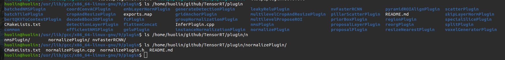

官方的例子有些变化，有点头大，这里就以下面的例子为参考 

就是开源的文档trt-samples-for-hackathon-cn-master/cookbook/05-Plugin

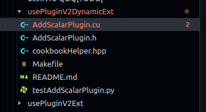

步骤：

1. 继承 IPluginV2DynamicExt 类实现一个Plugin 类
2. 继承 IPluginCreator 类实现一个 PluginCreator 类
3. 实现用于计算的 CUDA C++ kernel
4. 将 Plugin 编译为 .so 保存
5. 在 TenorRT 中加载和使用 Plugin

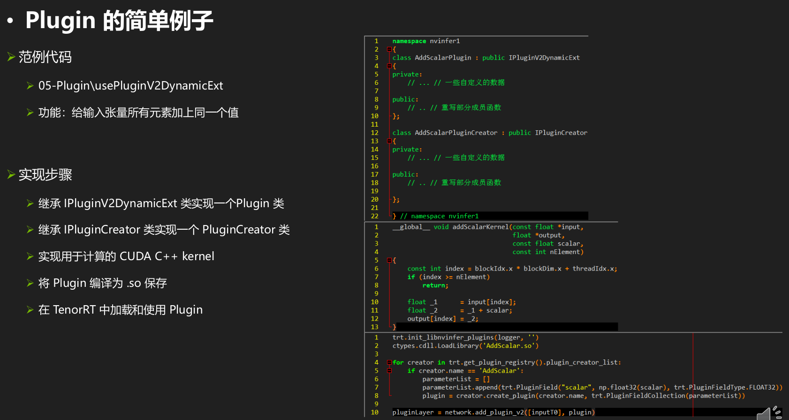

## 3.1 调用关系 

1. 调用IPluginCreator::createPlugin()返回一个类型为IPluginV2的插件对象。
2. 在反序列化期间，TensorRT从插件注册表中查找插件创建者并调用IPluginCreator::deserializePlugin()。

## 3.2 PluginCreator代码分析

功能比较简单，套用参考的结构就行。

从上面的描述可以看出PluginCreator最重要的两个函数就是

* `createPlugin`

  其中new了一个`IPluginV2`这个例子中就是`AddScalarPlugin`

* `deserializePlugin`

  其中new了一个`IPluginV2`这个例子中就是`AddScalarPlugin`，但是**构造函数不同**

* 还有一个重要的注册宏REGISTER_TENSORRT_PLUGIN 用于注册PluginCreator

  ```c++
  REGISTER_TENSORRT_PLUGIN(AddScalarPluginCreator);//注册Creator
  ```


提取PluginCreator相关的代码

头文件中

```c++
//step 2 继承IPluginCreator实现一个PluginCreator类
class AddScalarPluginCreator : public IPluginCreator
{
private:
    static PluginFieldCollection    fc_;
    static std::vector<PluginField> attr_;
    std::string                     namespace_;

public:
    AddScalarPluginCreator();
    ~AddScalarPluginCreator();
    const char *                 getPluginName() const noexcept override;
    const char *                 getPluginVersion() const noexcept override;
    const PluginFieldCollection *getFieldNames() noexcept override;
    IPluginV2 *                  createPlugin(const char *name, const PluginFieldCollection *fc) noexcept override;
    IPluginV2 *                  deserializePlugin(const char *name, const void *serialData, size_t serialLength) noexcept override;
    void                         setPluginNamespace(const char *pluginNamespace) noexcept override;
    const char *                 getPluginNamespace() const noexcept override;
};
```

cpp文件中

```c++
// class AddScalarPluginCreator
PluginFieldCollection    AddScalarPluginCreator::fc_ {};
std::vector<PluginField> AddScalarPluginCreator::attr_;

AddScalarPluginCreator::AddScalarPluginCreator()
{
    WHERE_AM_I();
    attr_.clear();
    attr_.emplace_back(PluginField("scalar", nullptr, PluginFieldType::kFLOAT32, 1));
    fc_.nbFields = attr_.size();
    fc_.fields   = attr_.data();
}

AddScalarPluginCreator::~AddScalarPluginCreator()
{
    WHERE_AM_I();
}

// 最重要的两个成员函数，分别用于“接受参数创建 Plugin” 和 “去序列化创建 Plugin”
IPluginV2 *AddScalarPluginCreator::createPlugin(const char *name, const PluginFieldCollection *fc) noexcept
{
    WHERE_AM_I();
    float                          scalar = 0;
    std::map<std::string, float *> parameterMap {{"scalar", &scalar}};

    for (int i = 0; i < fc->nbFields; ++i)
    {
        if (parameterMap.find(fc->fields[i].name) != parameterMap.end())
        {
            *parameterMap[fc->fields[i].name] = *reinterpret_cast<const float *>(fc->fields[i].data);
        }
    }
	//new了plugin
    AddScalarPlugin *pObj = new AddScalarPlugin(name, scalar);
    pObj->setPluginNamespace(namespace_.c_str());
    return pObj;
}
//第二个重要的函数
IPluginV2 *AddScalarPluginCreator::deserializePlugin(const char *name, const void *serialData, size_t serialLength) noexcept
{
    WHERE_AM_I();
	//new了plugin 和上面的不一样，是两个构造函数
    AddScalarPlugin *pObj = new AddScalarPlugin(name, serialData, serialLength);
    pObj->setPluginNamespace(namespace_.c_str());
    return pObj;
}

void AddScalarPluginCreator::setPluginNamespace(const char *pluginNamespace) noexcept
{
    WHERE_AM_I();
    namespace_ = pluginNamespace;
    return;
}

const char *AddScalarPluginCreator::getPluginNamespace() const noexcept
{
    WHERE_AM_I();
    return namespace_.c_str();
}

const char *AddScalarPluginCreator::getPluginName() const noexcept
{
    WHERE_AM_I();
    return PLUGIN_NAME;
}

const char *AddScalarPluginCreator::getPluginVersion() const noexcept
{
    WHERE_AM_I();
    return PLUGIN_VERSION;
}

const PluginFieldCollection *AddScalarPluginCreator::getFieldNames() noexcept
{
    WHERE_AM_I();
    return &fc_;
}

REGISTER_TENSORRT_PLUGIN(AddScalarPluginCreator);//注册Creator

} // namespace nvinfer1
```

## 3.3 Plugin类代码分析

上面的PluginCreator两次new了plugin，貌似就是注册和对接使用，功能实现都是这里的plugin的代码

头文件

```c++
#include "cookbookHelper.hpp"

namespace
{
static const char *PLUGIN_NAME {"AddScalar"};
static const char *PLUGIN_VERSION {"1"};
} // namespace

namespace nvinfer1
{// step1 继承IPluginV2DynamicExt实现一个Plugin类
class AddScalarPlugin : public IPluginV2DynamicExt
{
private:
    const std::string name_;
    std::string       namespace_;
    struct
    {
        float scalar;
    } m_;

public:
    AddScalarPlugin() = delete;
    AddScalarPlugin(const std::string &name, float scalar);
    AddScalarPlugin(const std::string &name, const void *buffer, size_t length);
    ~AddScalarPlugin();

    // Method inherited from IPluginV2
    const char *getPluginType() const noexcept override;
    const char *getPluginVersion() const noexcept override;
    int32_t     getNbOutputs() const noexcept override;
    int32_t     initialize() noexcept override;
    void        terminate() noexcept override;
    size_t      getSerializationSize() const noexcept override;
    void        serialize(void *buffer) const noexcept override;
    void        destroy() noexcept override;
    void        setPluginNamespace(const char *pluginNamespace) noexcept override;
    const char *getPluginNamespace() const noexcept override;

    // Method inherited from IPluginV2Ext
    DataType getOutputDataType(int32_t index, DataType const *inputTypes, int32_t nbInputs) const noexcept override;
    void     attachToContext(cudnnContext *contextCudnn, cublasContext *contextCublas, IGpuAllocator *gpuAllocator) noexcept override;
    void     detachFromContext() noexcept override;

    //Method inherited from IPluginV2DynamicExt
    IPluginV2DynamicExt *clone() const noexcept override;
    DimsExprs            getOutputDimensions(int32_t outputIndex, const DimsExprs *inputs, int32_t nbInputs, IExprBuilder &exprBuilder) noexcept override;
    bool                 supportsFormatCombination(int32_t pos, const PluginTensorDesc *inOut, int32_t nbInputs, int32_t nbOutputs) noexcept override;
    void                 configurePlugin(const DynamicPluginTensorDesc *in, int32_t nbInputs, const DynamicPluginTensorDesc *out, int32_t nbOutputs) noexcept override;
    size_t               getWorkspaceSize(const PluginTensorDesc *inputs, int32_t nbInputs, const PluginTensorDesc *outputs, int32_t nbOutputs) const noexcept override;
    int32_t              enqueue(const PluginTensorDesc *inputDesc, const PluginTensorDesc *outputDesc, const void *const *inputs, void *const *outputs, void *workspace, cudaStream_t stream) noexcept override;
};
```


cpp文件

```C++
#include "AddScalarPlugin.h"

//step 3 实现计算cuda的核函数
// 用于计算的 kernel
__global__ void addScalarKernel(const float *input, float *output, const float scalar, const int nElement)
{
    const int index = blockIdx.x * blockDim.x + threadIdx.x;
    if (index >= nElement)
        return;

    float _1      = input[index];
    float _2      = _1 + scalar;
    output[index] = _2;
}

namespace nvinfer1
{
// 这里各成员函数按照被调用顺序或重要程度顺序排列
// class AddScalarPlugin
AddScalarPlugin::AddScalarPlugin(const std::string &name, float scalar):
    name_(name)
{
    WHERE_AM_I();
    m_.scalar = scalar;
}

AddScalarPlugin::AddScalarPlugin(const std::string &name, const void *buffer, size_t length):
    name_(name)
{
    WHERE_AM_I();
    memcpy(&m_, buffer, sizeof(m_));
}

AddScalarPlugin::~AddScalarPlugin()
{
    WHERE_AM_I();
}

IPluginV2DynamicExt *AddScalarPlugin::clone() const noexcept
{
    WHERE_AM_I();
    auto p = new AddScalarPlugin(name_, &m_, sizeof(m_));
    p->setPluginNamespace(namespace_.c_str());
    return p;
}

int32_t AddScalarPlugin::getNbOutputs() const noexcept
{
    WHERE_AM_I();
    return 1;
}

DataType AddScalarPlugin::getOutputDataType(int32_t index, DataType const *inputTypes, int32_t nbInputs) const noexcept
{
    WHERE_AM_I();
    return inputTypes[0];
}

DimsExprs AddScalarPlugin::getOutputDimensions(int32_t outputIndex, const DimsExprs *inputs, int32_t nbInputs, IExprBuilder &exprBuilder) noexcept
{
    WHERE_AM_I();
    return inputs[0];
}

bool AddScalarPlugin::supportsFormatCombination(int32_t pos, const PluginTensorDesc *inOut, int32_t nbInputs, int32_t nbOutputs) noexcept
{
    WHERE_AM_I();
#ifdef DEBUG
    bool res;
    switch (pos)
    {
    case 0:
        res = inOut[0].type == DataType::kFLOAT && inOut[0].format == TensorFormat::kLINEAR;
        break;
    case 1:
        res = inOut[1].format == inOut[0].format && inOut[1].type == inOut[0].type;
        break;
    default: // should NOT be here!
        res = false;
    }

    std::cout << "\tpos=" << pos << ",res=" << res << "->[";
    for (int i = 0; i < nbInputs + nbOutputs; ++i)
    {
        std::cout << getFormatString(inOut[i].format) << ",";
    }
    std::cout << "],[";
    for (int i = 0; i < nbInputs + nbOutputs; ++i)
    {
        std::cout << dataTypeToString(inOut[i].type) << ",";
    }
    std::cout << "]" << std::endl;
    return res;
#else
    switch (pos)
    {
    case 0:
        return inOut[0].type == DataType::kFLOAT && inOut[0].format == TensorFormat::kLINEAR;
    case 1:
        return inOut[1].type == inOut[0].type && inOut[1].format == inOut[0].format;
    default: // should NOT be here!
        return false;
    }
    return false;
#endif
}

void AddScalarPlugin::configurePlugin(const DynamicPluginTensorDesc *in, int32_t nbInputs, const DynamicPluginTensorDesc *out, int32_t nbOutputs) noexcept
{
    WHERE_AM_I();
    return;
}

size_t AddScalarPlugin::getWorkspaceSize(const PluginTensorDesc *inputs, int32_t nbInputs, const PluginTensorDesc *outputs, int32_t nbOutputs) const noexcept
{
    WHERE_AM_I();
    return 0;
}

int32_t AddScalarPlugin::enqueue(const PluginTensorDesc *inputDesc, const PluginTensorDesc *outputDesc, const void *const *inputs, void *const *outputs, void *workspace, cudaStream_t stream) noexcept
{
    WHERE_AM_I();
    int nElement = 1;
    for (int i = 0; i < inputDesc[0].dims.nbDims; ++i)
    {
        nElement *= inputDesc[0].dims.d[i];
    }
    dim3 grid(CEIL_DIVIDE(nElement, 256), 1, 1), block(256, 1, 1);
    addScalarKernel<<<grid, block, 0, stream>>>(reinterpret_cast<const float *>(inputs[0]), reinterpret_cast<float *>(outputs[0]), m_.scalar, nElement);
    return 0;
}

void AddScalarPlugin::destroy() noexcept
{
    WHERE_AM_I();
    delete this;
    return;
}

int32_t AddScalarPlugin::initialize() noexcept
{
    WHERE_AM_I();
    return 0;
}

void AddScalarPlugin::terminate() noexcept
{
    WHERE_AM_I();
    return;
}

size_t AddScalarPlugin::getSerializationSize() const noexcept
{
    WHERE_AM_I();
    return sizeof(m_);
}

void AddScalarPlugin::serialize(void *buffer) const noexcept
{
    WHERE_AM_I();
    memcpy(buffer, &m_, sizeof(m_));
    return;
}

void AddScalarPlugin::setPluginNamespace(const char *pluginNamespace) noexcept
{
    WHERE_AM_I();
    namespace_ = pluginNamespace;
    return;
}

const char *AddScalarPlugin::getPluginNamespace() const noexcept
{
    WHERE_AM_I();
    return namespace_.c_str();
}

const char *AddScalarPlugin::getPluginType() const noexcept
{
    WHERE_AM_I();
    return PLUGIN_NAME;
}

const char *AddScalarPlugin::getPluginVersion() const noexcept
{
    WHERE_AM_I();
    return PLUGIN_VERSION;
}

void AddScalarPlugin::attachToContext(cudnnContext *contextCudnn, cublasContext *contextCublas, IGpuAllocator *gpuAllocator) noexcept
{
    WHERE_AM_I();
    return;
}

void AddScalarPlugin::detachFromContext() noexcept
{
    WHERE_AM_I();
    return;
}
```

### 3.3.1 构造函数

构造函数一般设置为三个。

第一个用于在parse阶段，`PluginCreator`用于创建该插件时调用的构造函数，需要传递权重信息以及参数。对应上面Create的`createPlugin`函数

第二个用于在`clone`阶段，复制这个plugin时会用到的构造函数。这个例子没有

第三个用于在`deserialize`阶段，用于将序列化好的权重和参数传入该plugin并创建。对应上面Create的`deserializePlugin`

这里的两个构造函数就是

```c++
AddScalarPlugin(const std::string &name, float scalar);
AddScalarPlugin(const std::string &name, const void *buffer, size_t length);

```

析构函数则需要执行`terminate`，`terminate`函数就是释放这个op之前开辟的一些显存空间:但是这里没有

例如

```c++
MyCustomPlugin::~MyCustomPlugin()
{
    terminate();
}
```

### 3.3.2 clone

这玩意儿干嘛的，顾名思义，就是克隆嘛，将这个`plugin`对象克隆一份给TensorRT的builder、network或者engine。

（创建多个 context ，可以与源对象共享本 engine 的资源）

```c++
IPluginV2DynamicExt *AddScalarPlugin::clone() const noexcept
{
    WHERE_AM_I();
    auto p = new AddScalarPlugin(name_, &m_, sizeof(m_));
    p->setPluginNamespace(namespace_.c_str());
    return p;
}
```

### 3.3.3 getNbOutputs

插件op返回多少个Tensor，比如`AddScalarPlugin`这个操作只输出一个Tensor(也就是一个output)，所以直接`return 1`：

```c++
int32_t AddScalarPlugin::getNbOutputs() const noexcept
{
    WHERE_AM_I();
    return 1;
}
```

### 3.3.4 **getOutputDataType**

返回结果的类型，一般来说我们插件op返回结果类型与输入类型一致：

```c++
DataType AddScalarPlugin::getOutputDataType(int32_t index, DataType const *inputTypes, int32_t nbInputs) const noexcept
{
    WHERE_AM_I();
    return inputTypes[0];
}
```

### 3.3.5 **getOutputDimensions**

* 向 TensorRT 报告每个输出张量的形状。
* TensorRT支持Dynamic-shape的时候，batch这一维度必须是explicit的，也就是说，TensorRT处理的维度从以往的三维[3,-1,-1]变成了[1,3,-1,-1]。最新的onnx-tensorrt也必须设置explicit的batchsize，而且这个batch维度在`getOutputDimensions`中是可以获取到的。

在旧版的IPluginV2类中，getOutputDimensions的定义如下：

```c++
  virtual Dims getOutputDimensions(int index, const Dims* inputs, int nbInputDims) TRTNOEXCEPT = 0;
```

而在新版的IPluginV2DynamicExt类中定义如下：

```c++
virtual DimsExprs getOutputDimensions(int outputIndex, const DimsExprs* inputs, int nbInputs, IExprBuilder& exprBuilder) = 0;
```

我们要做的就是在这个成员函数中根据输入维度推理出模型的输出维度，需要注意的是，虽然说输出维度 是由输入维度决定，但这个**输出维度其实“内定”的**(也就是在计算之前就算出来了)。如果咱的插件op的输出维度需要通过实际运行计算得到，那么这个函数就无法满足咱了。

这里的例中

```c++
DimsExprs AddScalarPlugin::getOutputDimensions(int32_t outputIndex, const DimsExprs *inputs, int32_t nbInputs, IExprBuilder &exprBuilder) noexcept
{
    WHERE_AM_I();
    return inputs[0];
}
```

### 3.3.6 **supportsFormatCombination**

TensorRT调用此方法以判断pos索引的输入/输出是否支持`inOut[pos].format`和`inOut[pos].type`指定的格式/数据类型。

如果插件支持`inOut[pos]`处的格式/数据类型，则返回true。 如果`是否支持`取决于其他的输入/输出格式/数据类型，则插件可以使其结果取决于`inOut[0..pos-1]`中的格式/数据类型，该格式/数据类型将设置为插件支持的值。 这个函数不需要检查`inOut[pos + 1..nbInputs + nbOutputs-1]`，pos的决定必须仅基于`inOut[0..pos]`。

```c++
bool AddScalarPlugin::supportsFormatCombination(int32_t pos, const PluginTensorDesc *inOut, int32_t nbInputs, int32_t nbOutputs) noexcept
{
    WHERE_AM_I();
#ifdef DEBUG
    bool res;
    switch (pos)
    {
    case 0:
        res = inOut[0].type == DataType::kFLOAT && inOut[0].format == TensorFormat::kLINEAR;
        break;
    case 1:
        res = inOut[1].format == inOut[0].format && inOut[1].type == inOut[0].type;
        break;
    default: // should NOT be here!
        res = false;
    }

    std::cout << "\tpos=" << pos << ",res=" << res << "->[";
    for (int i = 0; i < nbInputs + nbOutputs; ++i)
    {
        std::cout << getFormatString(inOut[i].format) << ",";
    }
    std::cout << "],[";
    for (int i = 0; i < nbInputs + nbOutputs; ++i)
    {
        std::cout << dataTypeToString(inOut[i].type) << ",";
    }
    std::cout << "]" << std::endl;
    return res;
#else
    switch (pos)
    {
    case 0:
        return inOut[0].type == DataType::kFLOAT && inOut[0].format == TensorFormat::kLINEAR;
    case 1:
        return inOut[1].type == inOut[0].type && inOut[1].format == inOut[0].format;
    default: // should NOT be here!
        return false;
    }
    return false;
#endif
}
```

### 3.3.7 **configurePlugin**

* 在推理前将调用该成员函数
* Dynamic Shape 模式中，每当输入数据形状发生变化（调用 context.set_binding_shape）时，该成员函数被调用
* 构建期调用时 in/out 张量形状中含有 -1
* 运行期调用时 in/out 张量形状为真实绑定的形状

配置这个插件op，判断输入和输出类型数量是否正确。官方还提到通过这个配置信息可以告知TensorRT去选择合适的算法(algorithm)去调优这个模型。

但自动调优目前还没有尝试过，我们一般自己写的plugin执行代码都是定死的，所谓的调优步骤可能更多地针对官方的op。

```c++
void AddScalarPlugin::configurePlugin(const DynamicPluginTensorDesc *in, int32_t nbInputs, const DynamicPluginTensorDesc *out, int32_t nbOutputs) noexcept
{
    WHERE_AM_I();
    return;
}
```

### 3.3.8 **getWorkspaceSize**

* 向 TensorRT 报告中间计算结果的存储空间
* 由 TensorRT 管理，参与显存优化

这个函数需要返回这个插件op需要中间显存变量的实际数据大小(bytesize)，这个是通过TensorRT的接口去获取，是比较规范的方式。

我们需要在这里确定这个op需要多大的显存空间去运行，在实际运行的时候就可以直接使用TensorRT开辟好的空间而不是自己去申请显存空间。

例如：

```c++
size_t MyCustomPlugin::getWorkspaceSize(const nvinfer1::PluginTensorDesc* inputs, int nbInputs, const nvinfer1::PluginTensorDesc* outputs, int nbOutputs) const 
{ 
    // 计算这个op前向过程中你认为需要的中间显存数量
    size_t need_num;
    return need_num * sizeof(float);
}
```

例子使用的是直接返回0，TODO 为什么？

```c++
size_t AddScalarPlugin::getWorkspaceSize(const PluginTensorDesc *inputs, int32_t nbInputs, const PluginTensorDesc *outputs, int32_t nbOutputs) const noexcept
{
    WHERE_AM_I();
    return 0;
}
```

### 3.3.9 **enqueue**

* 调用 CUDA C++ kernel 计算的地方
* 可以根据输入张量的不同形状、数据类型等条件选择不同 kernel 执行计算
* 不要在 enqueue 中使用 cudaMalloc* 等函数

实际插件op的执行函数，我们自己实现的cuda操作就放到这里(当然C++写的op也可以放进来，不过因为是CPU执行，速度就比较慢了)，与往常一样接受输入`inputs`产生输出`outputs`，传给相应的指针就可以。

```c++
int32_t AddScalarPlugin::enqueue(const PluginTensorDesc *inputDesc, const PluginTensorDesc *outputDesc, const void *const *inputs, void *const *outputs, void *workspace, cudaStream_t stream) noexcept
{
    WHERE_AM_I();
    int nElement = 1;
    for (int i = 0; i < inputDesc[0].dims.nbDims; ++i)
    {
        nElement *= inputDesc[0].dims.d[i];
    }
    dim3 grid(CEIL_DIVIDE(nElement, 256), 1, 1), block(256, 1, 1);
    addScalarKernel<<<grid, block, 0, stream>>>(reinterpret_cast<const float *>(inputs[0]), reinterpret_cast<float *>(outputs[0]), m_.scalar, nElement);
    return 0;
}
```

### 3.3.10 destroy

当 context/engine 销毁时被调用

```c++
void AddScalarPlugin::destroy() noexcept
{
    WHERE_AM_I();
    delete this;
    return;
}
```

### 3.3.11 **initialize**

初始化函数，在这个插件准备开始run之前执行。（engine 创建时被调用，用于初始化 Plugin 层）

主要初始化一些提前开辟空间的参数，一般是一些cuda操作需要的参数(例如conv操作需要执行卷积操作，我们就需要提前开辟weight和bias的显存)，假如我们的算子需要这些参数，则在这里需要提前开辟显存。

需要注意的是，如果插件算子需要开辟比较大的显存空间，**不建议自己去申请显存空间，可以使用Tensorrt官方接口传过来的workspace指针来获取显存空间**。因为如果这个插件被一个网络调用了很多次，而这个插件op需要开辟很多显存空间，那么TensorRT在构建network的时候会根据这个插件被调用的次数开辟很多显存，很容易导致显存溢出。

```c++
int32_t AddScalarPlugin::initialize() noexcept
{
    WHERE_AM_I();
    return 0;
}
```

### 3.3.12 terminate

engine 销毁时被调用，用于释放 initialize 函数申请的资源

```c++
void AddScalarPlugin::terminate() noexcept
{
    WHERE_AM_I();
    return;
}
```


### 3.3.13 **getSerializationSize**

（报告序列化需要的空间大小，单位 Byte）

返回序列化时需要写多少字节到buffer中。 TODO m_ 是什么意思？

```c++
size_t AddScalarPlugin::getSerializationSize() const noexcept
{
    WHERE_AM_I();
    return sizeof(m_);
}
```


### 3.3.14 serialize

将Plugin 数据序列化到给定的 buffer 中

```c++
void AddScalarPlugin::serialize(void *buffer) const noexcept
{
    WHERE_AM_I();
    memcpy(buffer, &m_, sizeof(m_));
    return;
}
```


### 3.3.15 **attachToContext**

（申请使用 context 独占的 cudnn 或 cublas 资源）

如果这个op使用到了一些其他东西，例如`cublas handle`，可以直接借助TensorRT内部提供的`cublas handle`:

```c++
void AddScalarPlugin::attachToContext(cudnnContext *contextCudnn, cublasContext *contextCublas, IGpuAllocator *gpuAllocator) noexcept
{
    WHERE_AM_I();
    return;
}
```

## 3.4 简单的例子

就是cookbook/05-Plugin/usePluginV2DynamicExt/的代码示例

下图是运行过的文件结构

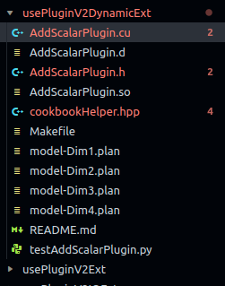

### 3.4.1 头文件 

AddScalarPlugin.h

```c++
/*
 * Copyright (c) 2021-2022, NVIDIA CORPORATION. All rights reserved.
 *
 * Licensed under the Apache License, Version 2.0 (the "License");
 * you may not use this file except in compliance with the License.
 * You may obtain a copy of the License at
 *
 *     http://www.apache.org/licenses/LICENSE-2.0
 *
 * Unless required by applicable law or agreed to in writing, software
 * distributed under the License is distributed on an "AS IS" BASIS,
 * WITHOUT WARRANTIES OR CONDITIONS OF ANY KIND, either express or implied.
 * See the License for the specific language governing permissions and
 * limitations under the License.
 */

#include "cookbookHelper.hpp"

namespace
{
static const char *PLUGIN_NAME {"AddScalar"};
static const char *PLUGIN_VERSION {"1"};
} // namespace

namespace nvinfer1
{// step1 继承IPluginV2DynamicExt实现一个Plugin类
class AddScalarPlugin : public IPluginV2DynamicExt
{
private:
    const std::string name_;
    std::string       namespace_;
    struct
    {
        float scalar;
    } m_;

public:
    AddScalarPlugin() = delete;
    AddScalarPlugin(const std::string &name, float scalar);
    AddScalarPlugin(const std::string &name, const void *buffer, size_t length);
    ~AddScalarPlugin();

    // Method inherited from IPluginV2
    const char *getPluginType() const noexcept override;
    const char *getPluginVersion() const noexcept override;
    int32_t     getNbOutputs() const noexcept override;
    int32_t     initialize() noexcept override;
    void        terminate() noexcept override;
    size_t      getSerializationSize() const noexcept override;
    void        serialize(void *buffer) const noexcept override;
    void        destroy() noexcept override;
    void        setPluginNamespace(const char *pluginNamespace) noexcept override;
    const char *getPluginNamespace() const noexcept override;

    // Method inherited from IPluginV2Ext
    DataType getOutputDataType(int32_t index, DataType const *inputTypes, int32_t nbInputs) const noexcept override;
    void     attachToContext(cudnnContext *contextCudnn, cublasContext *contextCublas, IGpuAllocator *gpuAllocator) noexcept override;
    void     detachFromContext() noexcept override;

    //Method inherited from IPluginV2DynamicExt
    IPluginV2DynamicExt *clone() const noexcept override;
    DimsExprs            getOutputDimensions(int32_t outputIndex, const DimsExprs *inputs, int32_t nbInputs, IExprBuilder &exprBuilder) noexcept override;
    bool                 supportsFormatCombination(int32_t pos, const PluginTensorDesc *inOut, int32_t nbInputs, int32_t nbOutputs) noexcept override;
    void                 configurePlugin(const DynamicPluginTensorDesc *in, int32_t nbInputs, const DynamicPluginTensorDesc *out, int32_t nbOutputs) noexcept override;
    size_t               getWorkspaceSize(const PluginTensorDesc *inputs, int32_t nbInputs, const PluginTensorDesc *outputs, int32_t nbOutputs) const noexcept override;
    int32_t              enqueue(const PluginTensorDesc *inputDesc, const PluginTensorDesc *outputDesc, const void *const *inputs, void *const *outputs, void *workspace, cudaStream_t stream) noexcept override;
};
//step 2 继承IPluginCreator实现一个PluginCreator类
class AddScalarPluginCreator : public IPluginCreator
{
private:
    static PluginFieldCollection    fc_;
    static std::vector<PluginField> attr_;
    std::string                     namespace_;

public:
    AddScalarPluginCreator();
    ~AddScalarPluginCreator();
    const char *                 getPluginName() const noexcept override;
    const char *                 getPluginVersion() const noexcept override;
    const PluginFieldCollection *getFieldNames() noexcept override;
    IPluginV2 *                  createPlugin(const char *name, const PluginFieldCollection *fc) noexcept override;
    IPluginV2 *                  deserializePlugin(const char *name, const void *serialData, size_t serialLength) noexcept override;
    void                         setPluginNamespace(const char *pluginNamespace) noexcept override;
    const char *                 getPluginNamespace() const noexcept override;
};

} // namespace nvinfer1

```

### 3.4.2 源文件

 AddScalarPlugin.cu

```c++
/*
 * Copyright (c) 2021-2022, NVIDIA CORPORATION. All rights reserved.
 *
 * Licensed under the Apache License, Version 2.0 (the "License");
 * you may not use this file except in compliance with the License.
 * You may obtain a copy of the License at
 *
 *     http://www.apache.org/licenses/LICENSE-2.0
 *
 * Unless required by applicable law or agreed to in writing, software
 * distributed under the License is distributed on an "AS IS" BASIS,
 * WITHOUT WARRANTIES OR CONDITIONS OF ANY KIND, either express or implied.
 * See the License for the specific language governing permissions and
 * limitations under the License.
 */

#include "AddScalarPlugin.h"

//step 3 实现计算cuda的核函数
// 用于计算的 kernel
__global__ void addScalarKernel(const float *input, float *output, const float scalar, const int nElement)
{
    const int index = blockIdx.x * blockDim.x + threadIdx.x;
    if (index >= nElement)
        return;

    float _1      = input[index];
    float _2      = _1 + scalar;
    output[index] = _2;
}

namespace nvinfer1
{
// 这里各成员函数按照被调用顺序或重要程度顺序排列
// class AddScalarPlugin
AddScalarPlugin::AddScalarPlugin(const std::string &name, float scalar):
    name_(name)
{
    WHERE_AM_I();
    m_.scalar = scalar;
}

AddScalarPlugin::AddScalarPlugin(const std::string &name, const void *buffer, size_t length):
    name_(name)
{
    WHERE_AM_I();
    memcpy(&m_, buffer, sizeof(m_));
}

AddScalarPlugin::~AddScalarPlugin()
{
    WHERE_AM_I();
}

IPluginV2DynamicExt *AddScalarPlugin::clone() const noexcept
{
    WHERE_AM_I();
    auto p = new AddScalarPlugin(name_, &m_, sizeof(m_));
    p->setPluginNamespace(namespace_.c_str());
    return p;
}

int32_t AddScalarPlugin::getNbOutputs() const noexcept
{
    WHERE_AM_I();
    return 1;
}

DataType AddScalarPlugin::getOutputDataType(int32_t index, DataType const *inputTypes, int32_t nbInputs) const noexcept
{
    WHERE_AM_I();
    return inputTypes[0];
}

DimsExprs AddScalarPlugin::getOutputDimensions(int32_t outputIndex, const DimsExprs *inputs, int32_t nbInputs, IExprBuilder &exprBuilder) noexcept
{
    WHERE_AM_I();
    return inputs[0];
}

bool AddScalarPlugin::supportsFormatCombination(int32_t pos, const PluginTensorDesc *inOut, int32_t nbInputs, int32_t nbOutputs) noexcept
{
    WHERE_AM_I();
#ifdef DEBUG
    bool res;
    switch (pos)
    {
    case 0:
        res = inOut[0].type == DataType::kFLOAT && inOut[0].format == TensorFormat::kLINEAR;
        break;
    case 1:
        res = inOut[1].format == inOut[0].format && inOut[1].type == inOut[0].type;
        break;
    default: // should NOT be here!
        res = false;
    }

    std::cout << "\tpos=" << pos << ",res=" << res << "->[";
    for (int i = 0; i < nbInputs + nbOutputs; ++i)
    {
        std::cout << getFormatString(inOut[i].format) << ",";
    }
    std::cout << "],[";
    for (int i = 0; i < nbInputs + nbOutputs; ++i)
    {
        std::cout << dataTypeToString(inOut[i].type) << ",";
    }
    std::cout << "]" << std::endl;
    return res;
#else
    switch (pos)
    {
    case 0:
        return inOut[0].type == DataType::kFLOAT && inOut[0].format == TensorFormat::kLINEAR;
    case 1:
        return inOut[1].type == inOut[0].type && inOut[1].format == inOut[0].format;
    default: // should NOT be here!
        return false;
    }
    return false;
#endif
}

void AddScalarPlugin::configurePlugin(const DynamicPluginTensorDesc *in, int32_t nbInputs, const DynamicPluginTensorDesc *out, int32_t nbOutputs) noexcept
{
    WHERE_AM_I();
    return;
}

size_t AddScalarPlugin::getWorkspaceSize(const PluginTensorDesc *inputs, int32_t nbInputs, const PluginTensorDesc *outputs, int32_t nbOutputs) const noexcept
{
    WHERE_AM_I();
    return 0;
}

int32_t AddScalarPlugin::enqueue(const PluginTensorDesc *inputDesc, const PluginTensorDesc *outputDesc, const void *const *inputs, void *const *outputs, void *workspace, cudaStream_t stream) noexcept
{
    WHERE_AM_I();
    int nElement = 1;
    for (int i = 0; i < inputDesc[0].dims.nbDims; ++i)
    {
        nElement *= inputDesc[0].dims.d[i];
    }
    dim3 grid(CEIL_DIVIDE(nElement, 256), 1, 1), block(256, 1, 1);
    addScalarKernel<<<grid, block, 0, stream>>>(reinterpret_cast<const float *>(inputs[0]), reinterpret_cast<float *>(outputs[0]), m_.scalar, nElement);
    return 0;
}

void AddScalarPlugin::destroy() noexcept
{
    WHERE_AM_I();
    delete this;
    return;
}

int32_t AddScalarPlugin::initialize() noexcept
{
    WHERE_AM_I();
    return 0;
}

void AddScalarPlugin::terminate() noexcept
{
    WHERE_AM_I();
    return;
}

size_t AddScalarPlugin::getSerializationSize() const noexcept
{
    WHERE_AM_I();
    return sizeof(m_);
}

void AddScalarPlugin::serialize(void *buffer) const noexcept
{
    WHERE_AM_I();
    memcpy(buffer, &m_, sizeof(m_));
    return;
}

void AddScalarPlugin::setPluginNamespace(const char *pluginNamespace) noexcept
{
    WHERE_AM_I();
    namespace_ = pluginNamespace;
    return;
}

const char *AddScalarPlugin::getPluginNamespace() const noexcept
{
    WHERE_AM_I();
    return namespace_.c_str();
}

const char *AddScalarPlugin::getPluginType() const noexcept
{
    WHERE_AM_I();
    return PLUGIN_NAME;
}

const char *AddScalarPlugin::getPluginVersion() const noexcept
{
    WHERE_AM_I();
    return PLUGIN_VERSION;
}

void AddScalarPlugin::attachToContext(cudnnContext *contextCudnn, cublasContext *contextCublas, IGpuAllocator *gpuAllocator) noexcept
{
    WHERE_AM_I();
    return;
}

void AddScalarPlugin::detachFromContext() noexcept
{
    WHERE_AM_I();
    return;
}

// class AddScalarPluginCreator
PluginFieldCollection    AddScalarPluginCreator::fc_ {};
std::vector<PluginField> AddScalarPluginCreator::attr_;

AddScalarPluginCreator::AddScalarPluginCreator()
{
    WHERE_AM_I();
    attr_.clear();
    attr_.emplace_back(PluginField("scalar", nullptr, PluginFieldType::kFLOAT32, 1));
    fc_.nbFields = attr_.size();
    fc_.fields   = attr_.data();
}

AddScalarPluginCreator::~AddScalarPluginCreator()
{
    WHERE_AM_I();
}

// 最重要的两个成员函数，分别用于“接受参数创建 Plugin” 和 “去序列化创建 Plugin”
IPluginV2 *AddScalarPluginCreator::createPlugin(const char *name, const PluginFieldCollection *fc) noexcept
{
    WHERE_AM_I();
    float                          scalar = 0;
    std::map<std::string, float *> parameterMap {{"scalar", &scalar}};

    for (int i = 0; i < fc->nbFields; ++i)
    {
        if (parameterMap.find(fc->fields[i].name) != parameterMap.end())
        {
            *parameterMap[fc->fields[i].name] = *reinterpret_cast<const float *>(fc->fields[i].data);
        }
    }
	//new了plugin 
    AddScalarPlugin *pObj = new AddScalarPlugin(name, scalar);
    pObj->setPluginNamespace(namespace_.c_str());
    return pObj;
}
//第二个重要的函数 把序列化的 buffer 传给 Plugin 的构造函数
IPluginV2 *AddScalarPluginCreator::deserializePlugin(const char *name, const void *serialData, size_t serialLength) noexcept
{
    WHERE_AM_I();
	//new了plugin 和上面的不一样，是两个构造函数 从 buffer 中读取数据并完成 Plugin 构造
    AddScalarPlugin *pObj = new AddScalarPlugin(name, serialData, serialLength);
    pObj->setPluginNamespace(namespace_.c_str());
    return pObj;
}

void AddScalarPluginCreator::setPluginNamespace(const char *pluginNamespace) noexcept
{
    WHERE_AM_I();
    namespace_ = pluginNamespace;
    return;
}

const char *AddScalarPluginCreator::getPluginNamespace() const noexcept
{
    WHERE_AM_I();
    return namespace_.c_str();
}

const char *AddScalarPluginCreator::getPluginName() const noexcept
{
    WHERE_AM_I();
    return PLUGIN_NAME;
}

const char *AddScalarPluginCreator::getPluginVersion() const noexcept
{
    WHERE_AM_I();
    return PLUGIN_VERSION;
}

const PluginFieldCollection *AddScalarPluginCreator::getFieldNames() noexcept
{
    WHERE_AM_I();
    return &fc_;
}

REGISTER_TENSORRT_PLUGIN(AddScalarPluginCreator);//静态注册

} // namespace nvinfer1
```

### 3.4.3 测试运行

上面完成了Plugin的代码编写，makefile中将上面的plugin编译为.so文件，方便后面构建网络时添加使用。

engine的构建使用python代码编写了一个简单的网络，就一个输入层和一个插件层。

engine的构建流程参考`TensorRT例子`教程。

需要了解的就是里面调用了`create_plugin`也就是插件中PluginCreator的createPlugin

```python
#
# Copyright (c) 2021-2022, NVIDIA CORPORATION. All rights reserved.
#
# Licensed under the Apache License, Version 2.0 (the "License");
# you may not use this file except in compliance with the License.
# You may obtain a copy of the License at
#
#     http://www.apache.org/licenses/LICENSE-2.0
#
# Unless required by applicable law or agreed to in writing, software
# distributed under the License is distributed on an "AS IS" BASIS,
# WITHOUT WARRANTIES OR CONDITIONS OF ANY KIND, either express or implied.
# See the License for the specific language governing permissions and
# limitations under the License.
#

import ctypes
from cuda import cudart
import numpy as np
import os
import tensorrt as trt

soFile = "./AddScalarPlugin.so"#python通过加载这个so来实现
np.random.seed(97)

def printArrayInfomation(x, info="", n=5):
    print( '%s:%s,SumAbs=%.5e,Var=%.5f,Max=%.5f,Min=%.5f,SAD=%.5f'%( \
        info,str(x.shape),np.sum(abs(x)),np.var(x),np.max(x),np.min(x),np.sum(np.abs(np.diff(x.reshape(-1)))) ))
    print('\t', x.reshape(-1)[:n], x.reshape(-1)[-n:])

def check(a, b, weak=False, checkEpsilon=1e-5):
    if weak:
        res = np.all(np.abs(a - b) < checkEpsilon)
    else:
        res = np.all(a == b)
    diff0 = np.max(np.abs(a - b))
    diff1 = np.max(np.abs(a - b) / (np.abs(b) + checkEpsilon))
    print("check:%s, absDiff=%f, relDiff=%f" % (res, diff0, diff1))

def addScalarCPU(inputH, scalar):
    return [inputH[0] + scalar]

def getAddScalarPlugin(scalar):
    for c in trt.get_plugin_registry().plugin_creator_list:
        #print(c.name)
        if c.name == "AddScalar":
            parameterList = []
            parameterList.append(trt.PluginField("scalar", np.float32(scalar), trt.PluginFieldType.FLOAT32))
            return c.create_plugin(c.name, trt.PluginFieldCollection(parameterList))#这里调用了Create的函数，也就是plugin代码中的create_plugin
    return None

def run(shape, scalar):
    testCase = "<shape=%s,scalar=%f>" % (shape, scalar)
    trtFile = "./model-Dim%s.plan" % str(len(shape))
    print("Test %s" % testCase)
    logger = trt.Logger(trt.Logger.ERROR)
    trt.init_libnvinfer_plugins(logger, '')#类似与c++的接口initLibNvInferPlugins注册plugin
    ctypes.cdll.LoadLibrary(soFile)
    if os.path.isfile(trtFile):
        with open(trtFile, "rb") as f:
            engine = trt.Runtime(logger).deserialize_cuda_engine(f.read())
        if engine == None:
            print("Failed loading engine!")
            return
        print("Succeeded loading engine!")
    else:
        builder = trt.Builder(logger)
        network = builder.create_network(1 << int(trt.NetworkDefinitionCreationFlag.EXPLICIT_BATCH))
        profile = builder.create_optimization_profile()
        config = builder.create_builder_config()
        config.set_memory_pool_limit(trt.MemoryPoolType.WORKSPACE, 6 << 30)

        inputT0 = network.add_input("inputT0", trt.float32, [-1 for i in shape])
        profile.set_shape(inputT0.name, [1 for i in shape], [8 for i in shape], [32 for i in shape])
        config.add_optimization_profile(profile)

        pluginLayer = network.add_plugin_v2([inputT0], getAddScalarPlugin(scalar))#从这里加载自定义的插件
        network.mark_output(pluginLayer.get_output(0))
        engineString = builder.build_serialized_network(network, config)
        if engineString == None:
            print("Failed building engine!")
            return
        print("Succeeded building engine!")
        with open(trtFile, "wb") as f:
            f.write(engineString)
        engine = trt.Runtime(logger).deserialize_cuda_engine(engineString)

    context = engine.create_execution_context()
    context.set_binding_shape(0, shape)
    #print("Binding all? %s"%(["No","Yes"][int(context.all_binding_shapes_specified)]))
    nInput = np.sum([engine.binding_is_input(i) for i in range(engine.num_bindings)])
    nOutput = engine.num_bindings - nInput
    #for i in range(nInput):
    #    print("Bind[%2d]:i[%2d]->" % (i, i), engine.get_binding_dtype(i), engine.get_binding_shape(i), context.get_binding_shape(i), engine.get_binding_name(i))
    #for i in range(nInput, nInput + nOutput):
    #    print("Bind[%2d]:o[%2d]->" % (i, i - nInput), engine.get_binding_dtype(i), engine.get_binding_shape(i), context.get_binding_shape(i), engine.get_binding_name(i))

    bufferH = []
    bufferH.append(np.arange(np.prod(shape), dtype=np.float32).reshape(shape))
    for i in range(nOutput):
        bufferH.append(np.empty(context.get_binding_shape(nInput + i), dtype=trt.nptype(engine.get_binding_dtype(nInput + i))))
    bufferD = []
    for i in range(engine.num_bindings):
        bufferD.append(cudart.cudaMalloc(bufferH[i].nbytes)[1])

    for i in range(nInput):
        cudart.cudaMemcpy(bufferD[i], np.ascontiguousarray(bufferH[i].reshape(-1)).ctypes.data, bufferH[i].nbytes, cudart.cudaMemcpyKind.cudaMemcpyHostToDevice)

    context.execute_v2(bufferD)

    for i in range(nOutput):
        cudart.cudaMemcpy(bufferH[nInput + i].ctypes.data, bufferD[nInput + i], bufferH[nInput + i].nbytes, cudart.cudaMemcpyKind.cudaMemcpyDeviceToHost)

    outputCPU = addScalarCPU(bufferH[:nInput], scalar)
    """
    for i in range(nInput):
        printArrayInfomation(bufferH[i])
    for i in range(nOutput):
        printArrayInfomation(bufferH[nInput+i])
    for i in range(nOutput):
        printArrayInfomation(outputCPU[i])
    """
    check(bufferH[nInput:][0], outputCPU[0], True)

    for buffer in bufferD:
        cudart.cudaFree(buffer)
    print("Test %s finish!\n" % testCase)

if __name__ == "__main__":
    os.system("rm -rf ./*.plan")
    np.set_printoptions(precision=3, linewidth=100, suppress=True)
    run([32], 1)
    run([32, 32], 1)
    run([16, 16, 16], 1)
    run([8, 8, 8, 8], 1)

    print("Test all finish!")

```


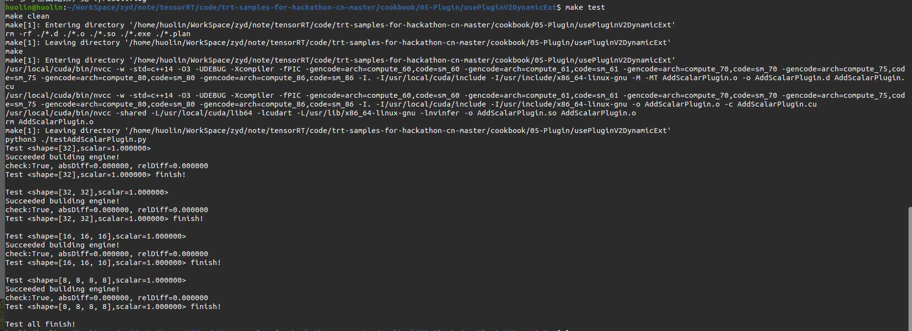

# 4 官方例子

## 4.1 sampleFasterRCNN

这个示例sampleFasterRCNN使用TensorRT插件（TensorRT plugins），执行推理，并实现一个**融合自定义层**，用于Faster R-CNN模型的端到端推理。构建了进一步优化的基础，例如使用INT8校准、用户训练网络等。

Fast R-CNN比它的前辈(RCNN, Fast R-CNN)更快更准确，因为它允许端到端推理，不需要独立的区域提议算法(如Fast R-CNN中的选择性搜索)或分类方法(如RCNN中的支持向量机)。

sampleFasterRCNN示例使用了来自TensorRT插件库的插件，包含了**Faster  R-CNN的区域建议网络(RPN)和ROIPooling层的融合实现**。这些特殊的层来自Faster  R-CNN的论文，**它们作为一个名为RPNROIPlugin的插件一起实现。该插件在TensorRT插件注册表中注册，名称为RPROI_TRT。**如下图

VGG16_faster_rcnn_final.caffemodel模型文件结构如下

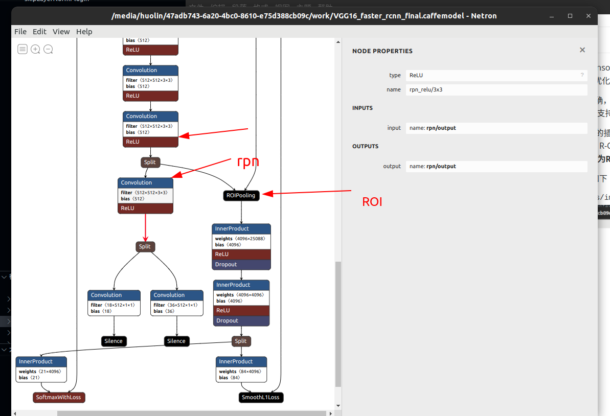

加载的faster_rcnn_test_iplugin.prototxt文件如下

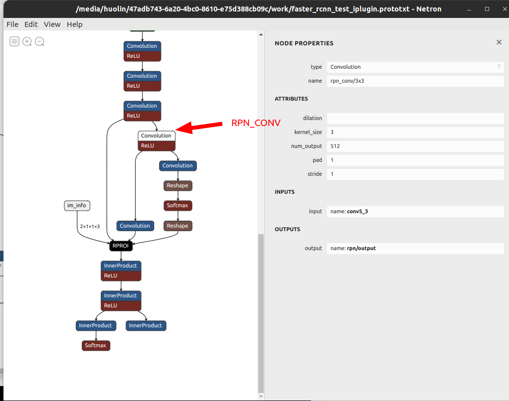


步骤如下：

1. 输入预处理
2. 定义网络（插件的动态加载）
3. 编译engine
4. 运行engine
5. 验证输出

### 4.1.1 输入预处理

更快的R-CNN采用3通道375x500图像作为输入。由于TensorRT不依赖于任何计算机视觉库，图像以每个像素的二进制R、G和B值表示。格式是**像素映射位图PPM**)，这是一种netpbm彩色图像格式。在这种格式中，每个像素的**R、G和B**值通常用整数字节(0-255)表示，它们一个像素一个像素地存储在一起。

然而，Faster R- cnn的作者已经训练了网络，使第一卷积层以**B、G和R**顺序看到图像数据。因此，当将PPM映像放入网络输入缓冲区时，您需要**反转顺序**。

```c++
float* data = new float[N*INPUT_C*INPUT_H*INPUT_W];
// pixel mean used by the Faster R-CNN's author
float pixelMean[3]{ 102.9801f, 115.9465f, 122.7717f }; // also in BGR order
for (int i = 0, volImg = INPUT_C*INPUT_H*INPUT_W; i < N; ++i)
{
	for (int c = 0; c < INPUT_C; ++c)
	{
		// the color image to input should be in BGR order
		for (unsigned j = 0, volChl = INPUT_H*INPUT_W; j < volChl; ++j)
        {
            data[i*volImg + c*volChl + j] =  float(ppms[i].buffer[j*INPUT_C + 2 - c]) - pixelMean[c];
        }
	}
}
```

有一个简单的PPM读取函数称为readPPMFile。

此外，在示例中还有一个名为writePPMFileWithBBox的函数，该函数用一像素宽的红线在图像中绘制给定的边界框。

为了获得PPM图像，您可以很容易地使用命令行工具，例如ImageMagick来执行从JPEG图像的调整大小和转换。

### 4.1.2 定义网络

该网络是在原始文件prototxt中定义的，该文件位于data/faster-rcnn目录中。prototxt文件与Faster R-CNN使用的文件非常相似，只是将RPN和ROI池层融合并用名为RPROIFused的自定义层代替。

**这个示例使用插件注册将插件添加到网络中。Caffe解析器根据Caffe原文本文件中指定的层名将插件对象添加到网络中，例如RPROI**。

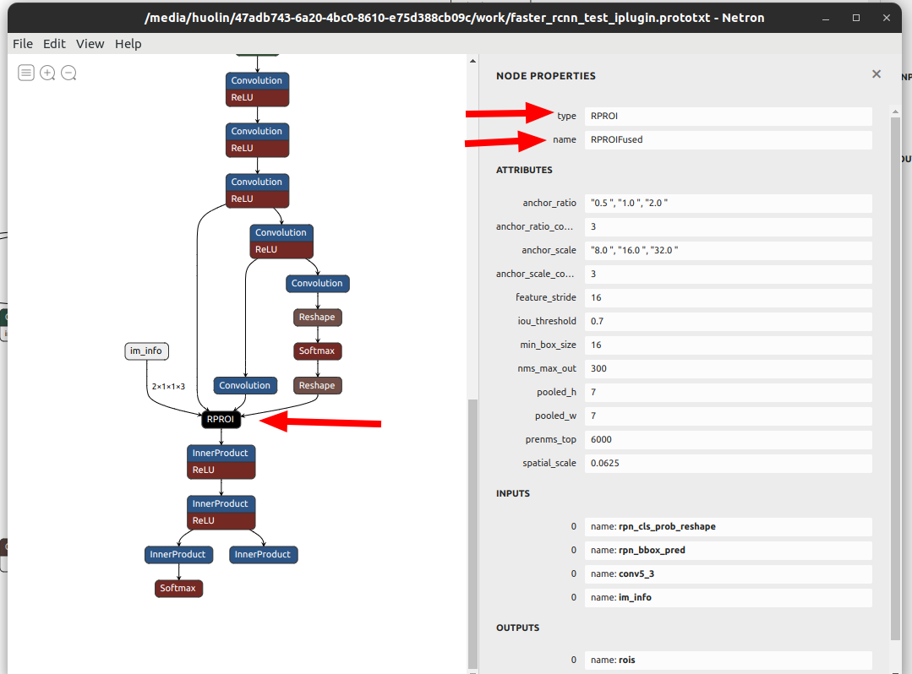

### 4.1.3 编译engine

参考之前的内容

### 4.1.4 运行engine

在sampleFasterRCNN.cpp中，推理函数有两个输入

* data是图像输入，
* imInfo是图像信息数组，用于存储批处理的每张图像的行数、列数和缩放。

4个输出

* bbox pred是高度、宽度和中心坐标的预测偏移量。

* cls_prob问题是与每个边界框的每个对象类相关的概率。
* rois是每个边界框的高度、宽度和中心坐标。
* count不再使用了，不考虑（如果输出没有与nmsMaxOut对齐，count输出用于指定产生的NMS边界框的数量）

### 4.1.5 验证输出

Faster R-CNN网络的输出需要进行后处理，以便获得人类可解释的结果。

* 首先，因为边界框现在由对中心、高度和宽度的偏移量表示，**所以需要通过除以imInfo(图像信息)中定义的比例，将它们缩小到原始图像空间**。
* 确保对边界框应用逆变换，并剪辑得到的坐标，使它们不超出图像边界。
* 最后，采用非最大抑制算法去除重叠预测。后处理代码是在CPU内定义的，因为它们既不是计算密集型的，也不是内存密集型的。
* 在完成上述所有工作之后，根据类号、置信度评分(概率)和四个坐标，可以使用边界框。它们使用writePPMFileWithBBox函数在输出PPM图像中绘制。

### 4.1.6 int8精度预测

RPNROIPlugin有四个输入(bbox confidence、bbox offset、feature map和image info)和两个输出(feature map和rois（Region of Interest感兴趣区域）)。此插件feature map 支持FP32/INT8 I/O，其他都是fp32的输入输出。int8精度需要Tensor的动态文件在目录data/faster-rcnn下。该文件中的每一行都包含一个张量名称(与层名称相同)和一个动态范围值。动态范围值表示张量边界值的abs。

### 4.1.7 Tensorrt API层和OPS

[Activation layer](https://docs.nvidia.com/deeplearning/sdk/tensorrt-developer-guide/index.html#activation-layer) 激活层 实现基于元素的激活功能。kRELU的激活层。

[Convolution layer](https://docs.nvidia.com/deeplearning/sdk/tensorrt-developer-guide/index.html#convolution-layer) 卷积层计算二维(通道、高度和宽度)卷积，有或没有偏置。

[FullyConnected layer](https://docs.nvidia.com/deeplearning/sdk/tensorrt-developer-guide/index.html#fullyconnected-layer) 全连通层实现矩阵-向量乘积，有或没有偏差。

[Plugin (RPROI) layer](https://docs.nvidia.com/deeplearning/sdk/tensorrt-developer-guide/index.html#plugin-layer) 插件层是用户定义的

[Pooling layer](https://docs.nvidia.com/deeplearning/sdk/tensorrt-developer-guide/index.html#pooling-layer) 池化层池化层实现通道内的池化。支持的池类型是最大、平均和最大-平均混合。

[Shuffle layer](https://docs.nvidia.com/deeplearning/sdk/tensorrt-developer-guide/index.html#shuffle-layer) Shuffle层实现了张量的重塑和转置算子。

[Identity Layer](https://docs.nvidia.com/deeplearning/tensorrt/developer-guide/index.html#identity-layer) 标识层实现标识操作。

### 4.1.8 数据准备

1. 设置$TRT_DATADIR为数据存放的目录

2. 下载[faster_rcnn_models.tgz](https://dl.dropboxusercontent.com/s/o6ii098bu51d139/faster_rcnn_models.tgz)数据集

   ```SHELL
   export TRT_DATADIR=/usr/src/tensorrt/data
   mkdir -p $TRT_DATADIR/faster-rcnn
   wget --no-check-certificate https://dl.dropboxusercontent.com/s/o6ii098bu51d139/faster_rcnn_models.tgz?dl=0 -O $TRT_DATADIR/faster-rcnn/faster-rcnn.tgz
   ```

3. 解压数据到data/faster-rcnn目录

   ```shell
   tar zxvf $TRT_DATADIR/faster-rcnn/faster-rcnn.tgz -C $TRT_DATADIR/faster-rcnn --strip-components=1 --exclude=ZF_*
   ```

这里看到对应的文件已经有了。不需要再下载了。(还是需要下载，否则报错没有model文件)

没有下载时文件如下

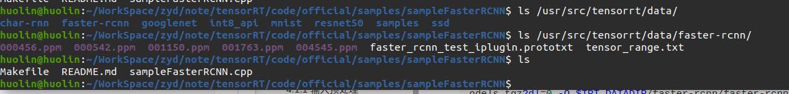

下载并解压后多了模型文件

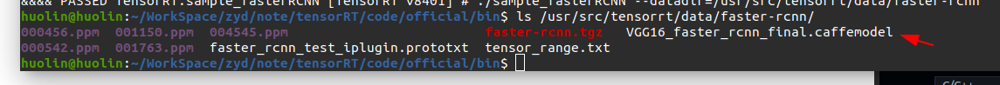

### 4.1.9 运行示例

1. 编译

   ```shell
   $ cd sampleFasterRCNN/
   $ make -j4
   $ cd ../../bin
   ```

2. 运行

   ```shell
   ./sample_fasterRCNN --datadir=/usr/src/tensorrt/data/faster-rcnn
   ```

3. 验证示例是否成功运行。如果示例成功运行，您应该会看到类似以下的输出

   ```shell
   Sample output
   [I] Detected car in 000456.ppm with confidence 99.0063%  (Result stored in car-0.990063.ppm).
   [I] Detected person in 000456.ppm with confidence 97.4725%  (Result stored in person-0.974725.ppm).
   [I] Detected cat in 000542.ppm with confidence 99.1191%  (Result stored in cat-0.991191.ppm).
   [I] Detected dog in 001150.ppm with confidence 99.9603%  (Result stored in dog-0.999603.ppm).
   [I] Detected dog in 001763.ppm with confidence 99.7705%  (Result stored in dog-0.997705.ppm).
   [I] Detected horse in 004545.ppm with confidence 99.467%  (Result stored in horse-0.994670.ppm).
   &&&& PASSED TensorRT.sample_fasterRCNN # ./build/x86_64-linux/sample_fasterRCNN
   ```

   此输出显示示例成功运行PASSED

   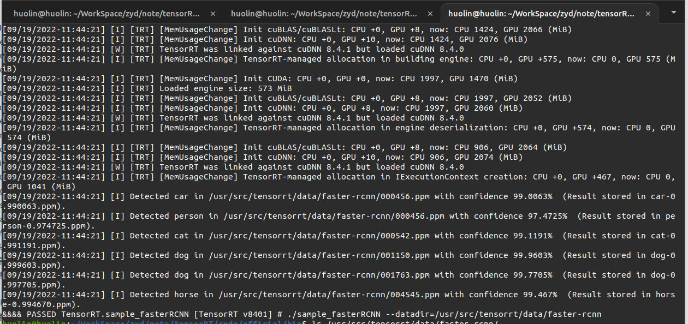

   输出的照片在bin目录下

   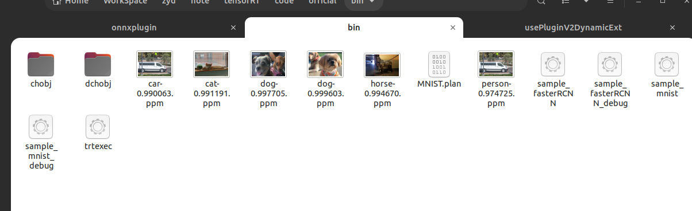

   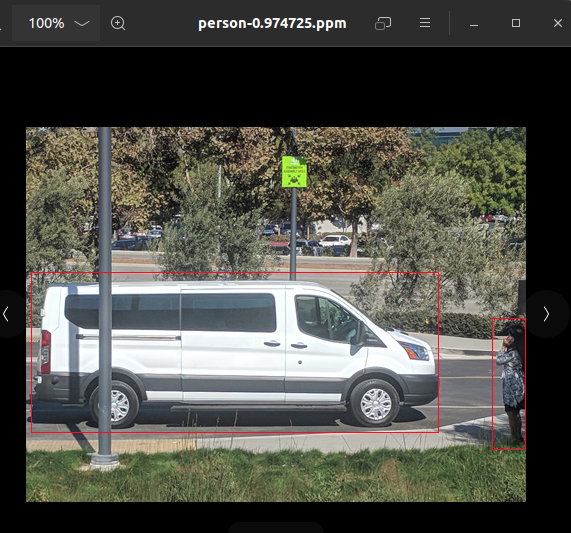


### 4.1.10 理解的几个点：

1. 模型的结构由faster_rcnn_test_iplugin.prototxt定义，不是由VGG16_faster_rcnn_final.caffemodel文件定义的。只是使用了VGG16_faster_rcnn_final.caffemodel中的训练过的参数。因为VGG16_faster_rcnn_final.caffemodel文件中有RPN和ROI层，这两层在faster_rcnn_test_iplugin.prototxt中定义为一个自定义层RPROI_TRT。

2. 虽然有自定义的层，但是在samples/sampleFasterRCNN/sampleFasterRCNN.cpp中engine的编译方式和sampleMNIST相比什么变化。应该是调用parse时直接就解析了，包括解析了自定义层。**因为使用的时parser解析器来解析的，所以不需要调用addPluginV2函数（addPluginV2函数应该是自定义网络结构使用plugin时使用的）**

3. 应该是编译成了动态库，在下面网络使用的时候调用了，库文件在/usr/lib/x86_64-linux-gnu/libnvinfer_plugin_static.a

4. 为什么自定义层也能被解析？就是因为在文件中sampleFasterRCNN.cpp中在build和infer之前调用了注册。在faster_rcnn_test_iplugin.prototxt网路结构描述文件中有一层的名称（名称对应不上，应该是因为2.2节的原因才关联起来的）是这样也就使自定义插件和模型关联起来了。

   ```c++
       initLibNvInferPlugins(&sample::gLogger, "");//动态注册plugin Creator
   ```

   这个函数实现了plugin的动态注册，在plugin/InferPlugin.cpp中实现

   ```c++
   template <typename CreatorType>
   void initializePlugin(void* logger, const char* libNamespace)
   {
       PluginCreatorRegistry::getInstance().addPluginCreator<CreatorType>(logger, libNamespace);//这里面注册
   }
   
   } // namespace plugin
   } // namespace nvinfer1
   // New Plugin APIs
   
   extern "C"
   {
       bool initLibNvInferPlugins(void* logger, const char* libNamespace)
       {
           initializePlugin<nvinfer1::plugin::BatchTilePluginCreator>(logger, libNamespace);
   		.....
           initializePlugin<nvinfer1::plugin::RPROIPluginCreator>(logger, libNamespace);//这里就是我们的插件 RPROIPluginCreator 就是我们自定义的creator
   		.....
           return true;
       }
   } // extern "C"
   
   ```

   ```c++
       template <typename CreatorType>
       void addPluginCreator(void* logger, const char* libNamespace)//注册
       {
           // Make accesses to the plugin creator registry thread safe
           std::lock_guard<std::mutex> lock(mRegistryLock);
   
           std::string errorMsg;
           std::string verboseMsg;
   
           std::unique_ptr<CreatorType> pluginCreator{new CreatorType{}};
           pluginCreator->setPluginNamespace(libNamespace);
   
           nvinfer1::plugin::gLogger = static_cast<nvinfer1::ILogger*>(logger);
           std::string pluginType = std::string{pluginCreator->getPluginNamespace()}
               + "::" + std::string{pluginCreator->getPluginName()} + " version "
               + std::string{pluginCreator->getPluginVersion()};
   
           if (mRegistryList.find(pluginType) == mRegistryList.end())
           {
               bool status = getPluginRegistry()->registerCreator(*pluginCreator, libNamespace);//注册
               if (status)
               {
                   mRegistry.push(std::move(pluginCreator));
                   mRegistryList.insert(pluginType);
                   verboseMsg = "Registered plugin creator - " + pluginType;
               }
               else
               {
                   errorMsg = "Could not register plugin creator -  " + pluginType;
               }
           }
           else
           {
               verboseMsg = "Plugin creator already registered - " + pluginType;
           }
   
           if (logger)
           {
               if (!errorMsg.empty())
               {
                   nvinfer1::plugin::gLogger->log(ILogger::Severity::kERROR, errorMsg.c_str());
               }
               if (!verboseMsg.empty())
               {
                   nvinfer1::plugin::gLogger->log(ILogger::Severity::kVERBOSE, verboseMsg.c_str());
               }
           }
       }
   ```

   

   把我们自定义的crteator放在下面方便理解：plugin/nvFasterRCNN/nvFasterRCNNPlugin.cpp

   ```c++
   // Detach the plugin object from its execution context.
   void RPROIPlugin::detachFromContext() noexcept {}
   
   RPROIPluginCreator::RPROIPluginCreator()
   {
       mPluginAttributes.clear();
       mPluginAttributes.emplace_back(PluginField("poolingH", nullptr, PluginFieldType::kINT32, 1));
       mPluginAttributes.emplace_back(PluginField("poolingW", nullptr, PluginFieldType::kINT32, 1));
       mPluginAttributes.emplace_back(PluginField("featureStride", nullptr, PluginFieldType::kINT32, 1));
       mPluginAttributes.emplace_back(PluginField("preNmsTop", nullptr, PluginFieldType::kINT32, 1));
       mPluginAttributes.emplace_back(PluginField("nmsMaxOut", nullptr, PluginFieldType::kINT32, 1));
       mPluginAttributes.emplace_back(PluginField("anchorsRatioCount", nullptr, PluginFieldType::kINT32, 1));
       mPluginAttributes.emplace_back(PluginField("anchorsScaleCount", nullptr, PluginFieldType::kINT32, 1));
       mPluginAttributes.emplace_back(PluginField("iouThreshold", nullptr, PluginFieldType::kFLOAT32, 1));
       mPluginAttributes.emplace_back(PluginField("minBoxSize", nullptr, PluginFieldType::kFLOAT32, 1));
       mPluginAttributes.emplace_back(PluginField("spatialScale", nullptr, PluginFieldType::kFLOAT32, 1));
   
       // TODO Do we need to pass the size attribute here for float arrarys, we
       // dont have that information at this point.
       mPluginAttributes.emplace_back(PluginField("anchorsRatios", nullptr, PluginFieldType::kFLOAT32, 1));
       mPluginAttributes.emplace_back(PluginField("anchorsScales", nullptr, PluginFieldType::kFLOAT32, 1));
   
       mFC.nbFields = mPluginAttributes.size();
       mFC.fields = mPluginAttributes.data();
   }
   
   RPROIPluginCreator::~RPROIPluginCreator()
   {
       // Free allocated memory (if any) here
   }
   
   const char* RPROIPluginCreator::getPluginName() const noexcept
   {
       return RPROI_PLUGIN_NAME;
   }
   
   const char* RPROIPluginCreator::getPluginVersion() const noexcept
   {
       return RPROI_PLUGIN_VERSION;
   }
   
   const PluginFieldCollection* RPROIPluginCreator::getFieldNames() noexcept
   {
       return &mFC;
   }
   
   IPluginV2Ext* RPROIPluginCreator::createPlugin(const char* name, const PluginFieldCollection* fc) noexcept
   {
       const PluginField* fields = fc->fields;
       int nbFields = fc->nbFields;
   
       for (int i = 0; i < nbFields; ++i)
       {
           const char* attrName = fields[i].name;
           if (!strcmp(attrName, "poolingH"))
           {
               ASSERT(fields[i].type == PluginFieldType::kINT32);
               params.poolingH = *(static_cast<const int*>(fields[i].data));
           }
   		.....
       }
   
       // This object will be deleted when the network is destroyed, which will
       // call RPROIPlugin::terminate()
       RPROIPlugin* plugin = new RPROIPlugin(params, anchorsRatios.data(), anchorsScales.data());
       plugin->setPluginNamespace(mNamespace.c_str());
       return plugin;
   }
   
   IPluginV2Ext* RPROIPluginCreator::deserializePlugin(const char* name, const void* serialData, size_t serialLength) noexcept
   {
       // This object will be deleted when the network is destroyed, which will
       // call RPROIPlugin::terminate()
       RPROIPlugin* plugin = new RPROIPlugin(serialData, serialLength);
       plugin->setPluginNamespace(mNamespace.c_str());
       return plugin;
   }
   ```


### 4.1.11 添加自定义的plugin，使trtexec可以识别

如何将自己的`plugin`编译到库中，使得`trtexec`可以识别自定义层呢？

参考编写一个自己的`plugin`代码比如上面4.1.10的`RPROIPlugin`层，然后添加到`initLibNvInferPlugins`函数中。编译成库，替代自带的库`libnvinfer_plugin.so`就可以了。

# 5 官方库编译

## 5.1 官方plugin编译

源码[官网地址](https://github.com/NVIDIA/TensorRT)，这里使用命令下载，否则第一步就报错。这里也是按照官方的方法进行编译的


```shell
#下载源码
git clone -b master https://github.com/nvidia/TensorRT TensorRT
cd TensorRT
git checkout -b branch8.4.1 8.4.1 #因为我电脑安装的TensorRT版本是8.4.1，为了方便检出了对应的版本进行编译 这时候cudnn也会切换到对应的版本，有一个坑就是我又安装了cuda的11.6版本（原为11.4），也就是tensorRT cuda cudnn的版本要匹配。
git submodule update --init --recursive
```

这里源码的路径就是TensorRT

### 5.1.1 PC端编译


在源码目录内创建build目录，因为这里只是编译plugin因此将sameple和parsers都关闭了。

```shell
mkdir -p build && cd build
cmake -DBUILD_PARSERS=OFF -DBUILD_SAMPLES=OFF -DTRT_OUT_DIR=`pwd`/out ../
make -j$(nproc)
```

编译完成后在build/out目录下会有对应的plugin的动态库文件。


自带的库为

```shell
/usr/lib/x86_64-linux-gnu/libnvinfer_plugin.so.8.4.1
/usr/lib/x86_64-linux-gnu/libnvinfer_plugin.so
/usr/lib/x86_64-linux-gnu/libnvinfer_plugin.so.8
/usr/lib/x86_64-linux-gnu/libnvinfer_plugin_static.a
```


### 5.1.2 交叉编译

### 5.1.3 又一点理解

plugin和TensorRT如何结合起来呢？

一个自定义的plugin如果希望tensorRT识别并使用与构建engine需要两步

* 注册plugin
* 将plugin加入网络

有三种方法来实现：

1. 使用c++ 的API，对应上面的2.1节。
2. 使用python的API
3. 使用ONNX parser自动解析。（后面看到实际这种方法还是调用API实现的，只不过是封装了接口而已）

下面结合ONNX parser解析器的使用来说明

#### 第一步 注册plugin

首先TensorRT提供了一个工具trtexec来将onnx格式的模型转换为trt的plan engine文件。并提供了实现的源码，在TensorRT/samples/trtexec/trtexec.cpp路径下。

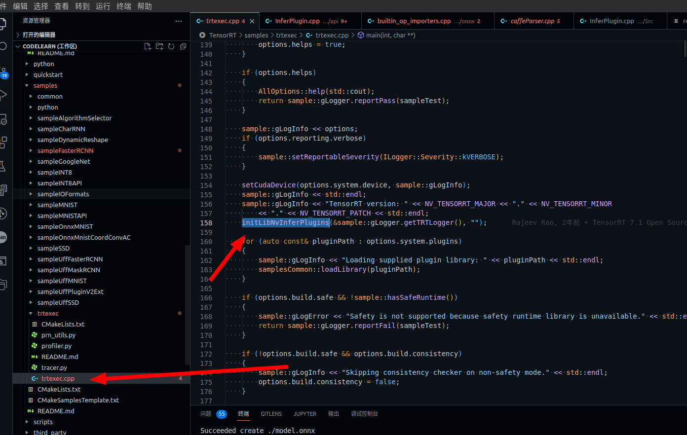

从上图可以看出调用了一个函数`initLibNvInferPlugins`这个函数就是2.1节中说到的动态注册的函数。官方有实现在 `plugin/api/InferPlugin.cpp`这里再一次贴出来源码方便理解。

```c++
#include "NvInfer.h"
#include "NvInferPlugin.h"
#include "checkMacrosPlugin.h"
#include "plugin.h"
#include <algorithm>
#include <array>
#include <iostream>
#include <memory>
#include <mutex>
#include <stack>
#include <unordered_set>
using namespace nvinfer1;
using namespace nvinfer1::plugin;

#include "batchTilePlugin.h"
#include "batchedNMSPlugin.h"
#include "coordConvACPlugin.h"
#include "cropAndResizePlugin.h"
#include "decodeBbox3D.h"
#include "detectionLayerPlugin.h"
#include "efficientNMSPlugin.h"
#include "tftrt/efficientNMSImplicitTFTRTPlugin.h"
#include "tftrt/efficientNMSExplicitTFTRTPlugin.h"
#include "flattenConcat.h"
#include "generateDetectionPlugin.h"
#include "gridAnchorPlugin.h"
#include "instanceNormalizationPlugin.h"
#include "lReluPlugin.h"
#include "multilevelCropAndResizePlugin.h"
#include "multilevelProposeROIPlugin.h"
#include "multiscaleDeformableAttnPlugin.h"
#include "nmsPlugin.h"
#include "normalizePlugin.h"
#include "nvFasterRCNNPlugin.h"
#include "pillarScatter.h"
#include "priorBoxPlugin.h"
#include "proposalLayerPlugin.h"
#include "proposalPlugin.h"
#include "pyramidROIAlignPlugin.h"
#include "regionPlugin.h"
#include "reorgPlugin.h"
#include "resizeNearestPlugin.h"
#include "scatterPlugin.h"
#include "specialSlicePlugin.h"
#include "split.h"
#include "voxelGenerator.h"

using nvinfer1::plugin::RPROIParams;

namespace nvinfer1
{

namespace plugin
{

extern ILogger* gLogger;

// This singleton ensures that each plugin is only registered once for a given
// namespace and type, and attempts of duplicate registration are ignored.
class PluginCreatorRegistry
{
public:
    static PluginCreatorRegistry& getInstance()
    {
        static PluginCreatorRegistry instance;
        return instance;
    }

    template <typename CreatorType>
    void addPluginCreator(void* logger, const char* libNamespace)
    {
        // Make accesses to the plugin creator registry thread safe
        std::lock_guard<std::mutex> lock(mRegistryLock);

        std::string errorMsg;
        std::string verboseMsg;

        std::unique_ptr<CreatorType> pluginCreator{new CreatorType{}};
        pluginCreator->setPluginNamespace(libNamespace);

        nvinfer1::plugin::gLogger = static_cast<nvinfer1::ILogger*>(logger);
        std::string pluginType = std::string{pluginCreator->getPluginNamespace()}
            + "::" + std::string{pluginCreator->getPluginName()} + " version "
            + std::string{pluginCreator->getPluginVersion()};

        if (mRegistryList.find(pluginType) == mRegistryList.end())
        {
            bool status = getPluginRegistry()->registerCreator(*pluginCreator, libNamespace);//实现plugin的注册
            if (status)
            {
                mRegistry.push(std::move(pluginCreator));
                mRegistryList.insert(pluginType);
                verboseMsg = "Registered plugin creator - " + pluginType;
            }
            else
            {
                errorMsg = "Could not register plugin creator -  " + pluginType;
            }
        }
        else
        {
            verboseMsg = "Plugin creator already registered - " + pluginType;
        }

        if (logger)
        {
            if (!errorMsg.empty())
            {
                nvinfer1::plugin::gLogger->log(ILogger::Severity::kERROR, errorMsg.c_str());
            }
            if (!verboseMsg.empty())
            {
                nvinfer1::plugin::gLogger->log(ILogger::Severity::kVERBOSE, verboseMsg.c_str());
            }
        }
    }

    ~PluginCreatorRegistry()
    {
        std::lock_guard<std::mutex> lock(mRegistryLock);

        // Release pluginCreators in LIFO order of registration.
        while (!mRegistry.empty())
        {
            mRegistry.pop();
        }
        mRegistryList.clear();
    }

private:
    PluginCreatorRegistry() {}

    std::mutex mRegistryLock;
    std::stack<std::unique_ptr<IPluginCreator>> mRegistry;
    std::unordered_set<std::string> mRegistryList;

public:
    PluginCreatorRegistry(PluginCreatorRegistry const&) = delete;
    void operator=(PluginCreatorRegistry const&) = delete;
};

template <typename CreatorType>
void initializePlugin(void* logger, const char* libNamespace)
{
    PluginCreatorRegistry::getInstance().addPluginCreator<CreatorType>(logger, libNamespace);
}

} // namespace plugin
} // namespace nvinfer1
// New Plugin APIs

extern "C"
{
    bool initLibNvInferPlugins(void* logger, const char* libNamespace)
    {
        initializePlugin<nvinfer1::plugin::BatchTilePluginCreator>(logger, libNamespace);
        initializePlugin<nvinfer1::plugin::BatchedNMSPluginCreator>(logger, libNamespace);
        initializePlugin<nvinfer1::plugin::BatchedNMSDynamicPluginCreator>(logger, libNamespace);
        initializePlugin<nvinfer1::plugin::CoordConvACPluginCreator>(logger, libNamespace);
        initializePlugin<nvinfer1::plugin::CropAndResizePluginCreator>(logger, libNamespace);
        initializePlugin<nvinfer1::plugin::CropAndResizeDynamicPluginCreator>(logger, libNamespace);
        initializePlugin<nvinfer1::plugin::DecodeBbox3DPluginCreator>(logger, libNamespace);
        initializePlugin<nvinfer1::plugin::DetectionLayerPluginCreator>(logger, libNamespace);
        initializePlugin<nvinfer1::plugin::EfficientNMSPluginCreator>(logger, libNamespace);
        initializePlugin<nvinfer1::plugin::EfficientNMSONNXPluginCreator>(logger, libNamespace);
        initializePlugin<nvinfer1::plugin::EfficientNMSExplicitTFTRTPluginCreator>(logger, libNamespace);
        initializePlugin<nvinfer1::plugin::EfficientNMSImplicitTFTRTPluginCreator>(logger, libNamespace);
        initializePlugin<nvinfer1::plugin::FlattenConcatPluginCreator>(logger, libNamespace);
        initializePlugin<nvinfer1::plugin::GenerateDetectionPluginCreator>(logger, libNamespace);
        initializePlugin<nvinfer1::plugin::GridAnchorPluginCreator>(logger, libNamespace);
        initializePlugin<nvinfer1::plugin::GridAnchorRectPluginCreator>(logger, libNamespace);
        initializePlugin<nvinfer1::plugin::InstanceNormalizationPluginCreator>(logger, libNamespace);
        initializePlugin<nvinfer1::plugin::LReluPluginCreator>(logger, libNamespace);
        initializePlugin<nvinfer1::plugin::MultilevelCropAndResizePluginCreator>(logger, libNamespace);
        initializePlugin<nvinfer1::plugin::MultilevelProposeROIPluginCreator>(logger, libNamespace);
        initializePlugin<nvinfer1::plugin::MultiscaleDeformableAttnPluginCreator>(logger, libNamespace);
        initializePlugin<nvinfer1::plugin::NMSPluginCreator>(logger, libNamespace);
        initializePlugin<nvinfer1::plugin::NMSDynamicPluginCreator>(logger, libNamespace);
        initializePlugin<nvinfer1::plugin::NormalizePluginCreator>(logger, libNamespace);
        initializePlugin<nvinfer1::plugin::PillarScatterPluginCreator>(logger, libNamespace);
        initializePlugin<nvinfer1::plugin::PriorBoxPluginCreator>(logger, libNamespace);
        initializePlugin<nvinfer1::plugin::ProposalLayerPluginCreator>(logger, libNamespace);
        initializePlugin<nvinfer1::plugin::ProposalPluginCreator>(logger, libNamespace);
        initializePlugin<nvinfer1::plugin::ProposalDynamicPluginCreator>(logger, libNamespace);
        initializePlugin<nvinfer1::plugin::PyramidROIAlignPluginCreator>(logger, libNamespace);
        initializePlugin<nvinfer1::plugin::RegionPluginCreator>(logger, libNamespace);
        initializePlugin<nvinfer1::plugin::ReorgPluginCreator>(logger, libNamespace);
        initializePlugin<nvinfer1::plugin::ResizeNearestPluginCreator>(logger, libNamespace);
        initializePlugin<nvinfer1::plugin::RPROIPluginCreator>(logger, libNamespace);
        initializePlugin<nvinfer1::plugin::ScatterNDPluginCreator>(logger, libNamespace);
        initializePlugin<nvinfer1::plugin::SpecialSlicePluginCreator>(logger, libNamespace);
        initializePlugin<nvinfer1::plugin::SplitPluginCreator>(logger, libNamespace);
        initializePlugin<nvinfer1::plugin::VoxelGeneratorPluginCreator>(logger, libNamespace);//VoxelGeneratorPluginCreator就是插件的creator的名称
        return true;
    }
} // extern "C"

```

从上面的函数分析以下做什么了

initLibNvInferPlugins调用了一堆类似下面的函数，其中调用了各自plugin的Creator，initLibNvInferPlugins调用了addPluginCreator，其中又调用了registerCreator实现plugin 的注册。

例如：

`initializePlugin<nvinfer1::plugin::VoxelGeneratorPluginCreator>(logger, libNamespace);`

就是plugin/voxelGeneratorPlugin/voxelGenerator.cpp路径下的plugin的实际实现代码，也就是第三节中自己实现的plugin源码

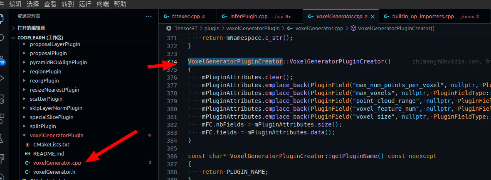

#### 第二步 将plugin加入网络

注册后网络还是不能识别，需要将plugin添加到network中才可以。

按照2.1节的描述需要调用一个addPluginV2的函数。如果是使用API函数来构建network，我们需要自己调用addPluginV2函数，就类似3.4节的例子。但是使用ONNX parser是如何识别的？

参考官方博客[网址](https://developer.nvidia.com/blog/estimating-depth-beyond-2d-using-custom-layers-on-tensorrt-and-onnx-models/)

onnx的parser的源码也有`parsers/onnx/builtin_op_importers.cpp`，如下图，可以看出来如果不是官方支持的原生plugin，那么就会运行到这里，也就是parser也调用了addPluginV2函数。这下就比较明了了。

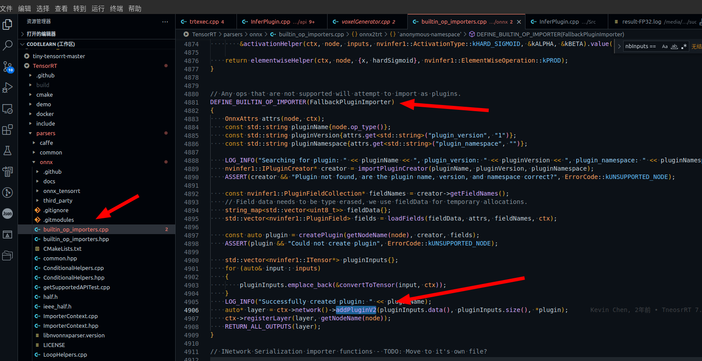

#### 几个注意的点

#### plugin的名称

1. 参考官方博客[网址](https://developer.nvidia.com/blog/estimating-depth-beyond-2d-using-custom-layers-on-tensorrt-and-onnx-models/)提到了我们的onnx模型中plugin的名称需要和我们编写的plugin名称一致。

   下面图中是提到的ONNX模型，可以看出来名称是 `type`字段，也就是`GroupNormalizationPluginCreator`

   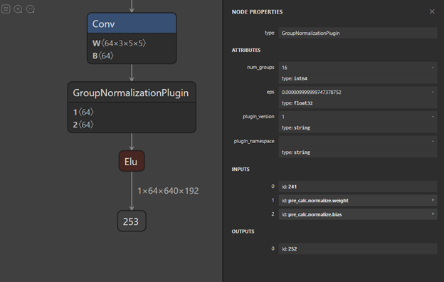

   再看一个例子，**这里的plugin的名称是 type字段的 RPROI 不是name字段的RPROIFused**

   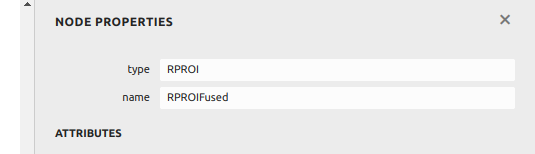

   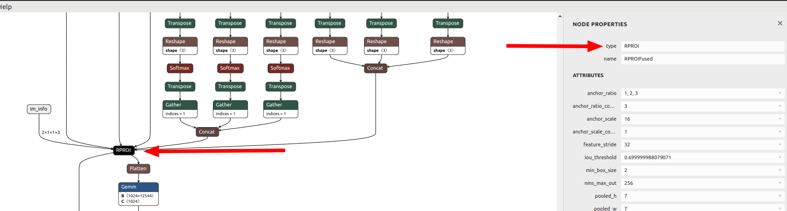

   

#### plugin参数

就像上面的RPROI插件，里面有一堆的参数，如下图

这些参数在我们定义插件的时候如何确认？开始的时候我没有确认，名称也没有对应上，使用trtexec转换onnx模型时报了一堆的错误，例如

```shell
Attribute poolingH not found in plugin node
```


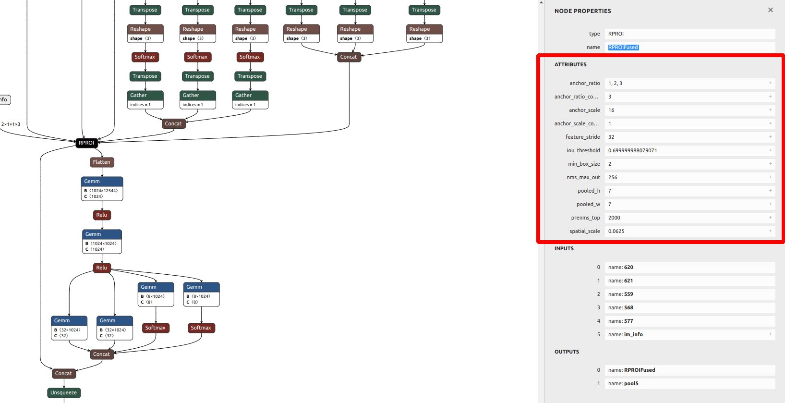

也就是plugin没有poolingH等属性。我修改之前的代码下下图注释的部分，修改为上面箭头就可以了。

可以看出来，编写的plugin的Creator构造函数添加的属性需要与模型的属性描述一致才可以。当然后面的Creator::createPlugin中也要对应起来。

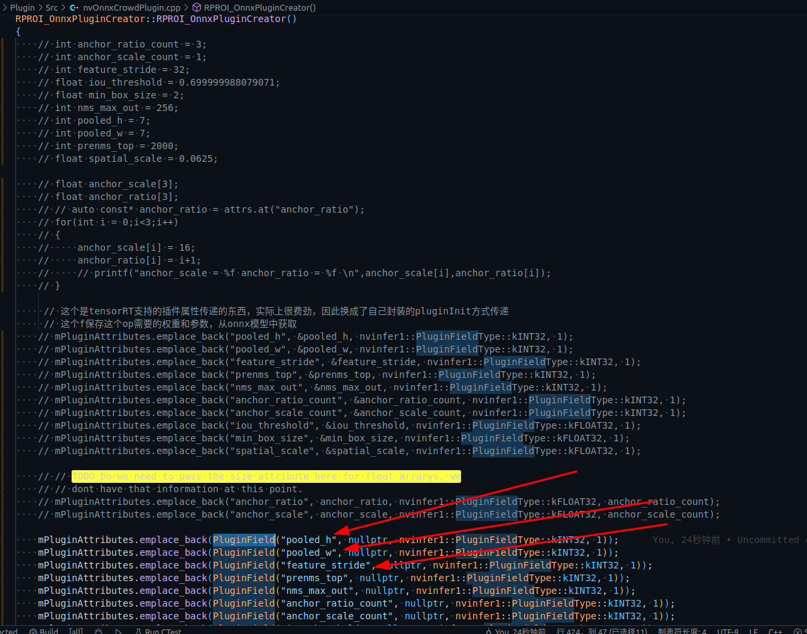

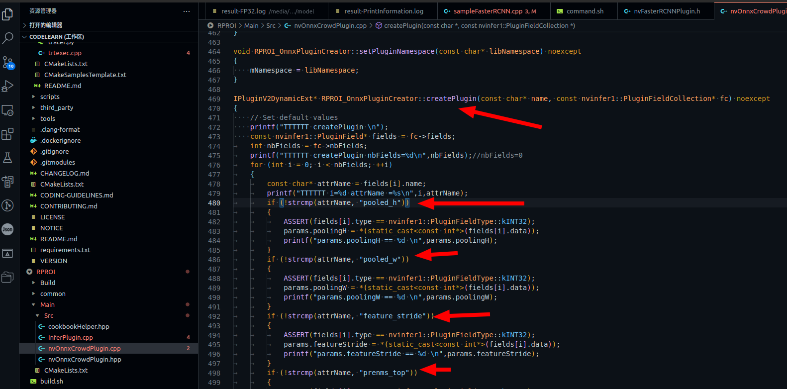

# 使用中的问题

## 1 trtexec dynamic batch size

问题描述：

有一个onnx模型有两个输入，分别是 blob1 [1,3,480,1088]和im_info [2,1,1,3]。可以看出batch size 分别是1和2。我希望都设定为1，并转换为trt的engine。

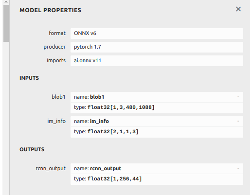

在使用trtexec转换为trt模型的时候指定了--shapes=blob1:1x3x480x1088,im_info:1x1x1x3

```shell
# 	--shapes=blob1:1x3x480x1088,im_info:1x1x1x3 \

# pseudo3d_v8_20220721_release.onnx
# new_crowd_612_20220822_fp_fpn3_0823.onnx
# 02-用上面的 .onnx 构建一个 TensorRT 引擎并作推理
trtexec \
    --onnx=new_crowd_612_0921_4cls_0926_15_2.onnx \
	--minShapes=blob1:1x3x480x1088,im_info:1x1x1x3 \
	--optShapes=blob1:1x3x480x1088,im_info:1x1x1x3 \
	--maxShapes=blob1:1x3x480x1088,im_info:1x1x1x3 \
    --memPoolSize=workspace:1024MiB \
    --saveEngine=new_crowd_612_0921_4cls_0926_15.onnx.INT8.trtmodel \
    --verbose \
    > result-FP32.log 
```

这是使用上述命令转换报错

```bash
[10/14/2022-15:13:21] [W] [TRT] onnx2trt_utils.cpp:369: Your ONNX model has been generated with INT64 weights, while TensorRT does not natively support INT64. Attempting to cast down to INT32.
[10/14/2022-15:13:21] [E] Static model does not take explicit shapes since the shape of inference tensors will be determined by the model itself
[10/14/2022-15:13:21] [E] Network And Config setup failed
[10/14/2022-15:13:21] [E] Building engine failed
[10/14/2022-15:13:21] [E] Failed to create engine from model or file.
[10/14/2022-15:13:21] [E] Engine set up failed
[10/14/2022-15:13:25] [W] * Throughput may be bound by Enqueue Time rather than GPU Compute and the GPU may be under-utilized.
[10/14/2022-15:13:25] [W]   If not already in use, --useCudaGraph (utilize CUDA graphs where possible) may increase the throughput.
[10/14/2022-15:13:25] [W] * GPU compute time is unstable, with coefficient of variance = 4.60091%.
[10/14/2022-15:13:25] [W]   If not already in use, locking GPU clock frequency or adding --useSpinWait may improve the stability.
huolin@huolin:/media/zyd/work/model$ 

```

上面的报错说明了原因就是`Static model does not take explicit shapes since the shape of inference tensors will be determined by the model itself`,说人话就是模型的输入是静态的，不能改变。从上面的图中看，模型的输入的确是blob1 [1,3,480,1088]和im_info [2,1,1,3]。batchsize指定为1和2.是固定的。

那么就需要修改一下onnx的模型了。

参考 https://github.com/onnx/onnx/issues/2182

这个帖子提供了一个python脚本实现脚本修改batch size

```python
import onnx

def change_input_dim(model,):
    batch_size = "1"#这里修改自己希望的batchsize

    # The following code changes the first dimension of every input to be batch_size
    # Modify as appropriate ... note that this requires all inputs to
    # have the same batch_size 
    inputs = model.graph.input
    for input in inputs:
        # Checks omitted.This assumes that all inputs are tensors and have a shape with first dim.
        # Add checks as needed.
        dim1 = input.type.tensor_type.shape.dim[0]
        # update dim to be a symbolic value
        if isinstance(batch_size, str):
            # set dynamic batch size
            dim1.dim_param = batch_size
        elif (isinstance(batch_size, str) and batch_size.isdigit()) or isinstance(batch_size, int):
            # set given batch size
            dim1.dim_value = int(batch_size)
        else:
            # set batch size of 1
            dim1.dim_value = 1

def apply(transform, infile, outfile):
    model = onnx.load(infile)
    transform(model,)
    onnx.save(model, outfile)
#apply(change_input_dim, <path-to-input-model>, <path-to-output-model>)
apply(change_input_dim, "new_crowd_612_0921_4cls_0926_15.onnx", "new_crowd_612_0921_4cls_0926_15_2.onnx")#这里是输入输出的onnx模型文件
```

使用上面的脚本运行后我得到了新的onnx文件`new_crowd_612_0921_4cls_0926_15_2.onnx`,查看batchsize如下。可以看出来已经修改了

分别是[1,3,480,1088]和[1,1,1,3]修改完成。

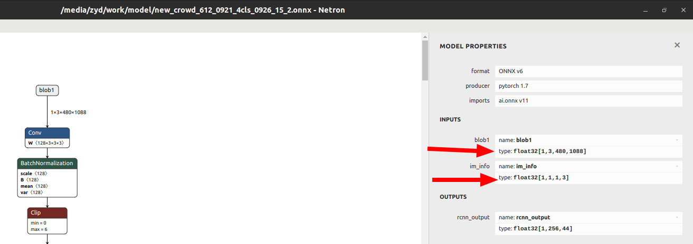


[不使用库，使用源代码编译，识别自定义plugin的方式]: ./code/Bbox


# 附录：

Plugin官方API https://docs.nvidia.com/deeplearning/tensorrt/api/c_api/classnvinfer1_1_1_i_plugin_creator.html#a037a085fc7d0cee9c9a2789a4b83f66f

Plugin官方开发指南 https://docs.nvidia.com/deeplearning/tensorrt/developer-guide/index.html#plugin-api-desc

官方Plugin使用例子 https://github.com/NVIDIA/TensorRT/tree/main/samples/sampleFasterRCNN

trtexec 使用 https://www.ccoderun.ca/programming/doxygen/tensorrt/md_TensorRT_samples_opensource_trtexec_README.html

博客参考：

* 实现TensorRT自定义插件(plugin)自由 https://zhuanlan.zhihu.com/p/297002406
* [三，如何使用tensorRT C%2B%2B API搭建网络/]( http://giantpandacv.com/project/%E9%83%A8%E7%BD%B2%E4%BC%98%E5%8C%96/AI%20%E9%83%A8%E7%BD%B2%E5%8F%8A%E5%85%B6%E5%AE%83%E4%BC%98%E5%8C%96%E7%AE%97%E6%B3%95/TensorRT/%E4%B8%89%EF%BC%8C%E5%A6%82%E4%BD%95%E4%BD%BF%E7%94%A8tensorRT%20C%2B%2B%20API%E6%90%AD%E5%BB%BA%E7%BD%91%E7%BB%9C/)

## **RPN**

全称是region proposal network作用是为第二阶段提供高质量的目标候选框，获得候选框的目的是为了给第二阶段提供优质的roi框

## ROI 

(**region of interest**)关注区域