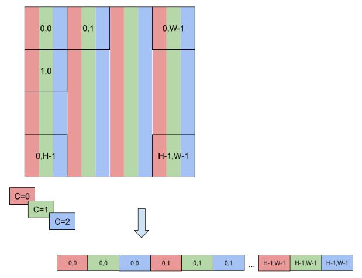
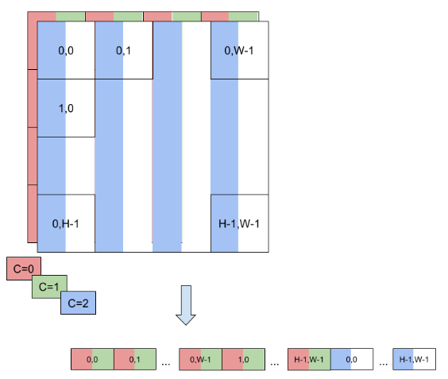

# TensorRT的数据格式定义详解

[点击此处加入NVIDIA开发者计划](https://developer.nvidia.com/zh-cn/developer-program)

TensorRT 支持不同的数据格式。有两个方面需要考虑：数据类型和布局。

数据类型格式

数据类型是每个单独值的表示。它的大小决定了取值范围和表示的精度，分别是`FP32`（32位浮点，或单精度），`FP16`（16位浮点或半精度），`INT32`（32位整数表示），和 `INT8`（8 位表示）。

布局格式

布局格式确定存储值的顺序。通常，batch 维度是最左边的维度，其他维度指的是每个数据项的方面，例如图像中的C是通道， H是高度， W是宽度。忽略总是在这些之前的批量大小， C 、 H和W通常被排序为CHW （参见图 1 ）或HWC （参见图 2 ）。

图1. CHW的布局格式：图像分为HxW矩阵，每个通道一个，矩阵按顺序存储；通道的所有值都是连续存储的。

图2. HWC的布局格式：图像存储为单个HxW矩阵，其值实际上是 C 元组，每个通道都有一个值；一个点（像素）的所有值都是连续存储的。

为了实现更快的计算，定义了更多格式以将通道值打包在一起并使用降低的精度。因此，TensorRT 还支持`NC / 2HW2`和`NHWC8`等格式。

在`NC / 2HW2 ( TensorFormat::kCHW2 )` 中，通道值对在每个HxW矩阵中打包在一起（在奇数通道的情况下为空值）。结果是一种格式，其中`⌈ C/2 ⌉ HxW`矩阵的值是两个连续通道的值对（参见图 3 ）；请注意，如果它们在同一对中，则此排序将维度交错为具有步长1的通道的值，否则将步长为 2xHxW 。

图 3. 一对通道值在每个HxW矩阵中打包在一起。结果是一种格式，其中`[C/2] HxW`矩阵的值是两个连续通道的值对

在`NHWC8 ( TensorFormat::kHWC8 )` 中， HxW矩阵的条目包括所有通道的值（参见图 4 ）。此外，这些值被打包在`⌈ C/8 ⌉` 8 元组中，并且C向上舍入到最接近的 8 倍数。

图 4. 在这种`NHWC8`格式中， HxW矩阵的条目包括所有通道的值。

其他TensorFormat遵循与前面提到的`TensorFormat::kCHW2`和`TensorFormat::kHWC8`类似的规则。

