# 官方例子

NVIDIA TensorRT嵌入式应用程序的其他示例。[here](https://github.com/dusty-nv/jetson-inference). 

NVIDIA TensorRT 8.4.3示例的概述。

# 1 简介

下面的示例展示了如何在许多用例中使用NVIDIA TensorRT，同时突出显示了该接口的不同功能。

## 1.1 c++的例子

可以在`/usr/src/tensorrt/samples`中或者[GitHub](https://github.com/NVIDIA/TensorRT/tree/main/samples)找到c++的例子。

- [“Hello World” For TensorRT](https://docs.nvidia.com/deeplearning/tensorrt/sample-support-guide/index.html#mnist_sample)
- [Building A Simple MNIST Network Layer By Layer](https://docs.nvidia.com/deeplearning/tensorrt/sample-support-guide/index.html#mnistapi_sample)
- [Importing The TensorFlow Model And Running Inference](https://docs.nvidia.com/deeplearning/tensorrt/sample-support-guide/index.html#mnist_uff_sample)
- [“Hello World” For TensorRT From ONNX](https://docs.nvidia.com/deeplearning/tensorrt/sample-support-guide/index.html#onnx_mnist_sample)
- [Building And Running GoogleNet In TensorRT](https://docs.nvidia.com/deeplearning/tensorrt/sample-support-guide/index.html#googlenet_sample)
- [Building An RNN Network Layer By Layer](https://docs.nvidia.com/deeplearning/tensorrt/sample-support-guide/index.html#charRNN_sample)
- [Performing Inference In INT8 Using Custom Calibration](https://docs.nvidia.com/deeplearning/tensorrt/sample-support-guide/index.html#int8_sample)
- [Performing Inference In INT8 Precision](https://docs.nvidia.com/deeplearning/tensorrt/sample-support-guide/index.html#int8_api_sample)
- [Object Detection With Faster R-CNN](https://docs.nvidia.com/deeplearning/tensorrt/sample-support-guide/index.html#fasterrcnn_sample)
- [Object Detection With A TensorFlow SSD Network](https://docs.nvidia.com/deeplearning/tensorrt/sample-support-guide/index.html#uffssd_sample)
- [Object Detection With SSD](https://docs.nvidia.com/deeplearning/tensorrt/sample-support-guide/index.html#sample_ssd)
- [Specifying I/O Formats](https://docs.nvidia.com/deeplearning/tensorrt/sample-support-guide/index.html#samplereformatfreeio)
- [Adding A Custom Layer That Supports INT8 I/O To Your Network In TensorRT](https://docs.nvidia.com/deeplearning/tensorrt/sample-support-guide/index.html#sampleUffPluginV2Ext)
- [Digit Recognition With Dynamic Shapes In TensorRT](https://docs.nvidia.com/deeplearning/tensorrt/sample-support-guide/index.html#sample-dynamic-reshape)
- [Object Detection And Instance Segmentation With A TensorFlow Mask R-CNN Network](https://docs.nvidia.com/deeplearning/tensorrt/sample-support-guide/index.html#sampleuffmaskrcnn)
- [Object Detection With A TensorFlow Faster R-CNN Network](https://docs.nvidia.com/deeplearning/tensorrt/sample-support-guide/index.html#sampleufffasterrcnn)
- [Algorithm Selection API Usage Example Based On sampleMNIST In TensorRT](https://docs.nvidia.com/deeplearning/tensorrt/sample-support-guide/index.html#samplealgorithmselection)[1](https://docs.nvidia.com/deeplearning/tensorrt/sample-support-guide/index.html#fntarg_1)
- [Implementing CoordConv in TensorRT with a custom plugin using sampleOnnxMnistCoordConvAC In TensorRT](https://docs.nvidia.com/deeplearning/tensorrt/sample-support-guide/index.html#sample_onnx_mnist_coordconvac)

每个c++示例都包含一个README.md文件，它提供了关于示例如何工作的详细信息，示例代码，以及如何运行和验证其输出的分步说明。

在Linux上运行c++的例子

如果您使用debian文件安装了TensorRT，请在构建C ++示例之前先将/usr/src/tensorrt复制到新目录

```shell
$ cd <samples_dir>
$ make -j4
$ cd ../bin
$ ./<sample_bin>
```


## 1.2 Python的例子

python的例子在                              `/usr/src/tensorrt/samples/python`

- [Introduction To Importing Caffe, TensorFlow And ONNX Models Into TensorRT Using Python](https://docs.nvidia.com/deeplearning/tensorrt/sample-support-guide/index.html#introductory_parser_samples)
- [“Hello World” For TensorRT Using TensorFlow And Python](https://docs.nvidia.com/deeplearning/tensorrt/sample-support-guide/index.html#end_to_end_tensorflow_mnist)
- [“Hello World” For TensorRT Using PyTorch And Python](https://docs.nvidia.com/deeplearning/tensorrt/sample-support-guide/index.html#network_api_pytorch_mnist)
- [Adding A Custom Layer To Your TensorFlow Network In TensorRT In Python](https://docs.nvidia.com/deeplearning/tensorrt/sample-support-guide/index.html#uff_custom_plugin)
- [Object Detection With The ONNX TensorRT Backend In Python](https://docs.nvidia.com/deeplearning/tensorrt/sample-support-guide/index.html#yolov3_onnx)
- [Object Detection With SSD In Python](https://docs.nvidia.com/deeplearning/tensorrt/sample-support-guide/index.html#uff_ssd)
- [INT8 Calibration In Python](https://docs.nvidia.com/deeplearning/tensorrt/sample-support-guide/index.html#int8_caffe_mnist)
- [Refitting An Engine In Python](https://docs.nvidia.com/deeplearning/tensorrt/sample-support-guide/index.html#engine_refit_mnist)
- [TensorRT Inference Of ONNX Models With Custom Layers In Python](https://docs.nvidia.com/deeplearning/tensorrt/sample-support-guide/index.html#onnx_packnet)
- [Refitting An Engine Built From An ONNX Model In Python](https://docs.nvidia.com/deeplearning/tensorrt/sample-support-guide/index.html#engine_refit_onnx_bidaf)
- [Scalable And Efficient Object Detection With EfficientDet Networks In Python](https://docs.nvidia.com/deeplearning/tensorrt/sample-support-guide/index.html#efficientdet-sample)
- [Scalable And Efficient Image Classification With EfficientNet Networks In Python](https://docs.nvidia.com/deeplearning/tensorrt/sample-support-guide/index.html#efficientnet-sample)
- [Object Detection with TensorFlow Object Detection API Model Zoo Networks in Python](https://docs.nvidia.com/deeplearning/tensorrt/sample-support-guide/index.html#tensorflow_object_detection_api)
- [Object Detection with Detectron 2 Mask R-CNN R50-FPN 3x Network in Python](https://docs.nvidia.com/deeplearning/tensorrt/sample-support-guide/index.html#detectron2)

每一个例子都有README.md文件

运行一个python例子

* 安装示例需求 其中python<x>为python2或python3。

```shell
python<x> -m pip install -r requirements.txt
```

* 如果TensorRT示例数据不在默认位置，则使用提供的数据目录运行示例代码。例如

```shell
python<x> sample.py [-d DATA_DIR]
```

# 2 交叉编译例子

以下各节显示了如何在X86_64 Linux下为AARCH64 QNX和Linux平台进行交叉编译.

## 2.1. 先决条件

1. 为相应的目标安装CUDA跨平台工具包，并设置环境变量CUDA_INSTALL_DIR。

   ```shell
   $ export CUDA_INSTALL_DIR="your cuda install dir"
   ```

   默认情况下，CUDA_INSTALL_DIR设置为/usr/local/cuda。

2. 为相应的目标安装CUDNN跨平台库，并设置环境变量CUDNN_INSTALL_DIR。

   ```shell
   $ export CUDNN_INSTALL_DIR="your cudnn install dir"
   ```

   默认情况下，CUDNN_INSTALL_DIR设置为CUDA_INSTALL_DIR。

3. 为相应的目标安装Tensorrt交叉兼容debian软件包。

   - QNX AArch64
     - tensorrt-cross-qnx-dev                                                                     
   - Linux AArch64
     - tensorrt-cross-aarch64-dev                                                                     
   - Linux SBSA
     - tensorrt-cross-sbsa-dev                 

## 2.2 为QNX AArch64编译例子

1. 下载QNX工具链并导出以下环境变量。

   ```shell
   $ export QNX_HOST=/path/to/your/qnx/toolchains/host/linux/x86_64
   $ export QNX_TARGET=/path/to/your/qnx/toolchain/target/qnx7
   ```

2. 使用下面命令构建

   ```shell
   $ cd /path/to/TensorRT/samples
   $ make TARGET=qnx
   ```

## 2.3 为Linux AArch64编译例子

1. 安装相应的GCC编译器aarch64-linux-gnu-g++。在Ubuntu中，可以通过：

   ```shell
   $ sudo apt-get install g++-aarch64-linux-gnu
   ```

2. 使用下面命令构建

   ```shell
   $ cd /path/to/TensorRT/samples
   $ make TARGET=aarch64
   ```

# 3 使用静态库构建示例(TODO)


# 例子1 sampleMNIST

## 简介

这是一个c++的例子，执行TensorRT的基本设置和初始化使用Caffe解析器。位于samples/sampleMNIST文件夹。

### 示例如何工作

该示例使用了在MNIST数据集上训练的Caffe模型。

* 使用Caffe解析器执行TensorRT的基本设置和初始化
* 使用Caffe解析器导入一个训练好的Caffe模型
* 对输入进行预处理，并将结果存储在托管的缓冲区中
* 构建一个engine
* 序列化和反序列化engine
* 使用引擎对输入图像执行推理

为了验证引擎是否正确运行，该示例随机选择了28x28的数字图像，并使用其创建的引擎对其进行推断。网络的输出是数字上的概率分布，显示图像中的哪个数字可能是该数字。

### Tensorrt API层和OPS

在本示例中，将使用以下层，层的详细信息[TensorRT Developer Guide: Layers](https://docs.nvidia.com/deeplearning/sdk/tensorrt-developer-guide/index.html#layers) 

Activation layer

Convolution layer

FullyConnected layer 

Pooling layer

Scale layer

SoftMax layer 

### 准备示例数据

数据已经在/usr/src/tensorrt/data中，设置环境变量$TRT_DATADIR

```shell
export TRT_DATADIR=/usr/src/tensorrt/data
pushd $TRT_DATADIR/mnist
pip3 install Pillow
popd
```

### 运行示例

1. 编译

   进入例子的文件夹，我这里是拷贝了一份到`/home/huolin/WorkSpace/zyd/test/tensorrt/samples/sampleMNIST`

   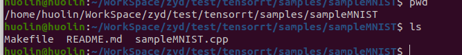

   ```shell
   make -j8
   
   ```

   会在../../bin下生成对应的可执行程序

   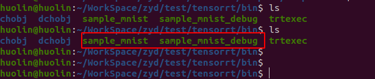

2. 运行

   ```shell
   ./sample_mnist [-h] [--datadir=/path/to/data/dir/] [--useDLA=N] [--fp16 or --int8]
   #例如
   ./sample_mnist --datadir $TRT_DATADIR/mnist --fp16
   ```

   该示例读取三个Caffe文件以构建网络：

   * `mnist.prototxt` 包含网络设计的prototxt文件。
   * `mnist.caffemodel`包含训练好的网络权值的模型文件
   * `mnist_mean.binaryproto`包含均值的二进制文件。

   该示例也可以在FP16和INT8模式下运行。

   注意：默认情况下，示例期望这些文件在data/samples/mnist/或data/mnist/目录中。可以通过以--datadir=/new/path/为命令行参数添加一个或多个路径来更改默认目录的列表。

3. 验证示例是否成功运行。如果示例成功运行，您应该看到类似如下的输出;输入图像的ASCII显示数字3

   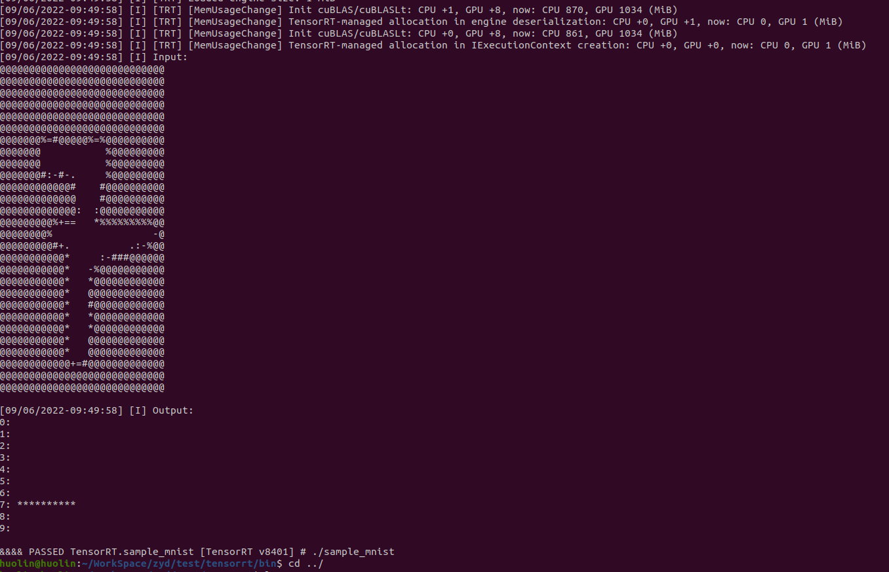

数据及网络结构在`/home/huolin/WorkSpace/zyd/test/tensorrt/data/mnist`文件夹下

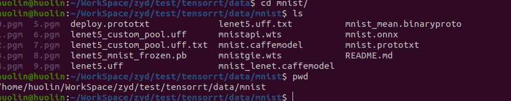

使用netron查看（在浏览器中打开网址 https://netron.app/ 在ubuntu中使用命令`snap install netron`安装）

mnist.prototxt结构如下

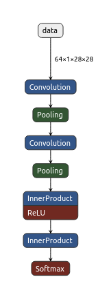

mnist.onnx的网络结构如下：

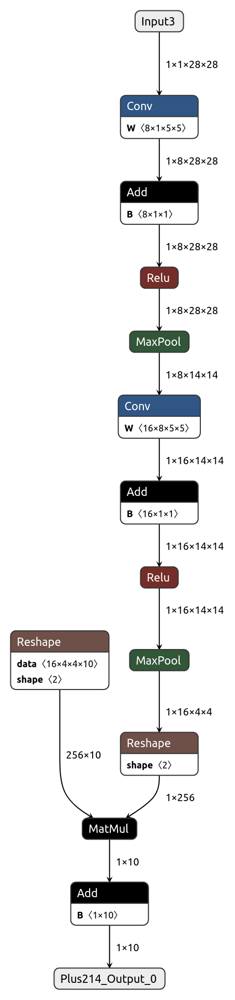

## sampleMNIST代码解析

TensorRT的使用包括两个阶段，Build和Deployment。

### 主函数

```c++
int main(int argc, char** argv)
{
    // 参数解析
    samplesCommon::Args args;
    bool argsOK = samplesCommon::parseArgs(args, argc, argv);
    if (!argsOK)
    {
        sample::gLogError << "Invalid arguments" << std::endl;
        printHelpInfo();
        return EXIT_FAILURE;
    }
    // 打印帮助信息
    if (args.help)
    {
        printHelpInfo();
        return EXIT_SUCCESS;
    }

    auto sampleTest = sample::gLogger.defineTest(gSampleName, argc, argv);

    sample::gLogger.reportTestStart(sampleTest);
	// 使用命令行参数初始化params结构的成员
    samplesCommon::CaffeSampleParams params = initializeSampleParams(args);
	// 构造SampleMNIST对象
    SampleMNIST sample(params);
    sample::gLogInfo << "Building and running a GPU inference engine for MNIST" << std::endl;
    // Build 此函数通过解析caffe模型创建MNIST网络，并构建用于运行MNIST（mEngine）的引擎
    if (!sample.build())
    {
        return sample::gLogger.reportFail(sampleTest);
    }
    // 前向推理如果没成功，用gLogger报告状态
    if (!sample.infer())
    {
        return sample::gLogger.reportFail(sampleTest);
    }
    // 用于清除示例类中创建的任何状态，内存释放
    if (!sample.teardown())
    {
        return sample::gLogger.reportFail(sampleTest);
    }
    // 报告例子运行成功
    return sample::gLogger.reportPass(sampleTest);
}
```

可以清晰的看到代码主要分为参数初始化，Build，Infer这三大部分

### 参数初始化

参数初始化主要由`initializeSampleParams`函数来完成，这个函数的详细注释如下，具体就是根据输入数据和网络文件所在的文件夹去读取LeNet的Caffe原始模型文件和均值文件，另外设置一些如输出Tensor名字，batch大小，运行时精度模式等关键参数，最后返回一个`params`对象。注意这里使用的LeNet模型是Caffe的原始模型，因为TensorRT是直接支持Caffe的原始模型解析的，但例如Pytorch模型之类的还要进行转换，

```c++
//!
//! \brief Initializes members of the params struct using the command line args
//! 使用命令行参数初始化params结构的成员
//!
samplesCommon::CaffeSampleParams initializeSampleParams(const samplesCommon::Args& args)
{
    samplesCommon::CaffeSampleParams params;
    if (args.dataDirs.empty()) // Use default directories if user hasn't provided directory paths如果用户未提供目录路径，则使用默认目录
    {
        params.dataDirs.push_back("data/mnist/");
        params.dataDirs.push_back("data/samples/mnist/");
    }
    else // Use the data directory provided by the user使用用户提供的目录路径
    {
        params.dataDirs = args.dataDirs;
    }

    params.prototxtFileName = locateFile("mnist.prototxt", params.dataDirs);//读取params.dataDirs文件夹下模型文件mnist.prototxt
    params.weightsFileName = locateFile("mnist.caffemodel", params.dataDirs);//读取params.dataDirs文件夹下权重文件mnist.caffemodel
    params.meanFileName = locateFile("mnist_mean.binaryproto", params.dataDirs);//读取MNIST数字识别网络的均值文件
    params.inputTensorNames.push_back("data");// 输入Tensor
    params.batchSize = 1;//设置batch_size大小
    params.outputTensorNames.push_back("prob");// 输出Tensor
    params.dlaCore = args.useDLACore;// 是否使用DLA核心
    params.int8 = args.runInInt8;//以INT8的方式运行
    params.fp16 = args.runInFp16;//以FP16的方式运行

    return params;// 返回Params对象
}
```

### Build

如下图所示，Build阶段主要完成模型转换(从Caffe/TensorFlow/Onnx->TensorRT)，在转换阶段会完成优化过程中的计算图融合，精度校准。这一步的输出是一个针对特定GPU平台和网络模型的优化过的TensorRT模型。这个TensorRT模型可以序列化的存储到磁盘或者内存中。存储到磁盘中的文件叫plan file。在sampleMNIST例子中只需要给tensorRT提供Caffe的*.prototxt，*.caffemodel,*.mean.binaryproto文件即可完成Build过程，另外这个还需要指定batch的大小并标记输出层。下面展示了sampleMNIST例子中的Build代码解析。

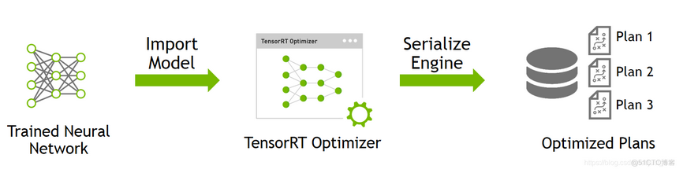

```c++
//!
//! \brief Creates the network, configures the builder and creates the network engine
//!创建网络、配置生成器并创建网络引擎
//! \details This function creates the MNIST network by parsing the caffe model and builds
//!          the engine that will be used to run MNIST (mEngine)
//!此函数通过解析caffe模型创建MNIST网络，并构建用于运行MNIST（mEngine）的引擎
//! \return true if the engine was created successfully and false otherwise
//!如果引擎被创建成功，直接返回True
bool SampleMNIST::build()
{
    //创建一个 IBuilder，传进gLogger参数是为了方便打印信息。
    auto builder = SampleUniquePtr<nvinfer1::IBuilder>(nvinfer1::createInferBuilder(sample::gLogger.getTRTLogger()));
    if (!builder)
    {
        return false;
    }
    //创建空的network，后面 constructNetwork 中会定义
    auto network = SampleUniquePtr<nvinfer1::INetworkDefinition>(builder->createNetworkV2(0));
    if (!network)
    {
        return false;
    }
    //创建一个配置文件解析对象
    auto config = SampleUniquePtr<nvinfer1::IBuilderConfig>(builder->createBuilderConfig());
    if (!config)
    {
        return false;
    }
    //创建一个caffe模型解析对象,在constructNetwork函数中解析模型，转换为 network
    auto parser = SampleUniquePtr<nvcaffeparser1::ICaffeParser>(nvcaffeparser1::createCaffeParser());
    if (!parser)
    {
        return false;
    }
    // 解析 caffe 模型，并转换为 network 形式
    if (!constructNetwork(parser, network))
    {
        return false;
    }
    // 设置batch大小，工作空间等等
    builder->setMaxBatchSize(mParams.batchSize);
    config->setFlag(BuilderFlag::kGPU_FALLBACK);
    if (mParams.fp16)
    {
        config->setFlag(BuilderFlag::kFP16);
    }
    if (mParams.int8)
    {
        config->setFlag(BuilderFlag::kINT8);
    }

    samplesCommon::enableDLA(builder.get(), config.get(), mParams.dlaCore);

    // CUDA stream used for profiling by the builder.
    auto profileStream = samplesCommon::makeCudaStream();
    if (!profileStream)
    {
        return false;
    }
    config->setProfileStream(*profileStream);

    SampleUniquePtr<IHostMemory> plan{builder->buildSerializedNetwork(*network, *config)};
    if (!plan)
    {
        return false;
    }

    SampleUniquePtr<IRuntime> runtime{createInferRuntime(sample::gLogger.getTRTLogger())};
    if (!runtime)
    {
        return false;
    }
	//构建 tensorrt 引擎
    mEngine = std::shared_ptr<nvinfer1::ICudaEngine>(
        runtime->deserializeCudaEngine(plan->data(), plan->size()), samplesCommon::InferDeleter());
    if (!mEngine)
    {
        return false;
    }

    ASSERT(network->getNbInputs() == 1);
    mInputDims = network->getInput(0)->getDimensions();//后面推理需要输入参数，这里取出来后面用
    ASSERT(mInputDims.nbDims == 3);

    return true;
}
```

这个代码中的关键函数是constructNetwork，这个函数的作用是使用caffe解析器创建MNIST数字识别网络(LeNet)并标记输出层，我们可以看一下它的代码解析。可以看到代码中主要就是标记了输出Tensor，并且对网络的输入数据进行预处理包括减均值和缩放之类的操作。

- 其实模型转换本身，`parser->parse` 一个函数就解决了。
- 下面代码的大量篇幅是在：在模型开头添加 `输入图片减去平均数` 操作上。可能是网络训练是后减去均值并缩放了
- 替换了第两层网络，原网络第一层应该就是数据输入，这里替换为数据输入后减均值

```c++

//!
//! \brief Uses a caffe parser to create the MNIST Network and marks the
//!        output layers
//!使用caffe解析器创建MNIST网络并标记输出层
//! \param network Pointer to the network that will be populated with the MNIST network
//!指向将用MNIST网络填充的网络指针
//! \param builder Pointer to the engine builder
//!指向引擎生成器的生成器指针
bool SampleMNIST::constructNetwork(
    SampleUniquePtr<nvcaffeparser1::ICaffeParser>& parser, SampleUniquePtr<nvinfer1::INetworkDefinition>& network)
{
    //这里就解析出了network并包含了权重
    const nvcaffeparser1::IBlobNameToTensor* blobNameToTensor = parser->parse(
        mParams.prototxtFileName.c_str(), mParams.weightsFileName.c_str(), *network, nvinfer1::DataType::kFLOAT);
	//输出Tensor标记
    for (auto& s : mParams.outputTensorNames)
    {
        network->markOutput(*blobNameToTensor->find(s.c_str()));
    }
	// 在网络开头添加减均值操作
    // add mean subtraction to the beginning of the network
    nvinfer1::Dims inputDims = network->getInput(0)->getDimensions();
    //// 读取均值文件的数据
    mMeanBlob
        = SampleUniquePtr<nvcaffeparser1::IBinaryProtoBlob>(parser->parseBinaryProto(mParams.meanFileName.c_str()));
    nvinfer1::Weights meanWeights{nvinfer1::DataType::kFLOAT, mMeanBlob->getData(), inputDims.d[1] * inputDims.d[2]};
    // For this sample, a large range based on the mean data is chosen and applied to the head of the network.
    // After the mean subtraction occurs, the range is expected to be between -127 and 127, so the rest of the network
    // is given a generic range.
    // The preferred method is use scales computed based on a representative data set
    // and apply each one individually based on the tensor. The range here is large enough for the
    // network, but is chosen for example purposes only.
    //数据的原始分布是[0,256]
    // 减去均值之后是[-127,127]
    float maxMean
        = samplesCommon::getMaxValue(static_cast<const float*>(meanWeights.values), samplesCommon::volume(inputDims));
	//在网络中添加一个常量的层 常量是均值 1 28 28
    auto mean = network->addConstant(nvinfer1::Dims3(1, inputDims.d[1], inputDims.d[2]), meanWeights);
    if (!mean->getOutput(0)->setDynamicRange(-maxMean, maxMean))
    {
        return false;
    }
    if (!network->getInput(0)->setDynamicRange(-maxMean, maxMean))
    {
        return false;
    }
    //向网络添加一个元素操作层 执行减均值操作 
    auto meanSub = network->addElementWise(*network->getInput(0), *mean->getOutput(0), ElementWiseOperation::kSUB);//元素减
    if (!meanSub->getOutput(0)->setDynamicRange(-maxMean, maxMean))
    {
        return false;
    }
    network->getLayer(0)->setInput(0, *meanSub->getOutput(0));//将这一层的输入替换为一个特定的张量。 替换第0层的网络为meanSub的输出
    // 设置范围
    samplesCommon::setAllDynamicRanges(network.get(), 127.0f, 127.0f);

    return true;
}
```

### Infer


如上图所示，Infer阶段就是完成前向推理过程了，这里将Build过程中获得的plan文件首先反序列化，并创建一个 runtime engine，然后就可以输入数据，然后输出分类向量结果或检测结果。Deploy阶段的实现在infer函数中，它负责分配缓冲区，设置输入，执行推理引擎并验证输出。代码解析如下：

```c++
//!
//! \brief Runs the TensorRT inference engine for this sample
//!对这个例子执行TensorRT的前向推理
//! \details This function is the main execution function of the sample. It allocates
//!          the buffer, sets inputs, executes the engine, and verifies the output.
//!此函数是示例的主要执行功能。 它分配缓冲区，设置输入，执行推理引擎并验证输出。
bool SampleMNIST::infer()
{
    // Create RAII buffer manager object
    // 缓存对象管理
    samplesCommon::BufferManager buffers(mEngine, mParams.batchSize);
	// 创建上下文
    auto context = SampleUniquePtr<nvinfer1::IExecutionContext>(mEngine->createExecutionContext());
    if (!context)
    {
        return false;
    }

    // Pick a random digit to try to infer
    // 随机选择一个数字
    srand(time(NULL));
    const int digit = rand() % 10;

    // Read the input data into the managed buffers
    // There should be just 1 input tensor
    // 读取输入数据到缓存对象中
    // 即将 digit 写入 buffers 中，名字为 mParams.inputTensorNames[0]
    ASSERT(mParams.inputTensorNames.size() == 1);
    if (!processInput(buffers, mParams.inputTensorNames[0], digit))
    {
        return false;
    }
    // Create CUDA stream for the execution of this inference.
    // 创建 cuda 流，准备执行推理
    cudaStream_t stream;
    CHECK(cudaStreamCreate(&stream));

    // Asynchronously copy data from host input buffers to device input buffers
    // 异步将数据从主机输入缓冲区(buffer)复制到设备输入缓冲区(stream)
    buffers.copyInputToDeviceAsync(stream);

    // Asynchronously enqueue the inference work
    // 异步将推理任务加入队列中
    if (!context->enqueue(mParams.batchSize, buffers.getDeviceBindings().data(), stream, nullptr))
    {
        return false;
    }
    // Asynchronously copy data from device output buffers to host output buffers
    // 异步将模型结果从设备(stream)保存到主机缓冲区(buffers)
    buffers.copyOutputToHostAsync(stream);

    // Wait for the work in the stream to complete
    // 等待工作结束，关闭stream
    CHECK(cudaStreamSynchronize(stream));

    // Release stream
    CHECK(cudaStreamDestroy(stream));

    // Check and print the output of the inference
    // There should be just one output tensor
    // 得到结果，判断结果是否准确
    // 即从 buffer 中获取名为 mParams.outputTensorNames[0] 的结果，判断与digit是否相同
    ASSERT(mParams.outputTensorNames.size() == 1);
    bool outputCorrect = verifyOutput(buffers, mParams.outputTensorNames[0], digit);

    return outputCorrect;
}
```


```c++
//!
//! \brief Reads the input and mean data, preprocesses, and stores the result in a managed buffer
//!
bool SampleMNIST::processInput(
    const samplesCommon::BufferManager& buffers, const std::string& inputTensorName, int inputFileIdx) const
{
    const int inputH = mInputDims.d[1];//mInputDims.d[0]=1 mInputDims.d[1]=28 mInputDims.d[2]=28
    const int inputW = mInputDims.d[2];

    // Read a random digit file
    srand(unsigned(time(nullptr)));
    std::vector<uint8_t> fileData(inputH * inputW);
    //读取图片
    readPGMFile(locateFile(std::to_string(inputFileIdx) + ".pgm", mParams.dataDirs), fileData.data(), inputH, inputW);

    // Print ASCII representation of digit
    sample::gLogInfo << "Input:\n";
    for (int i = 0; i < inputH * inputW; i++)
    {
        sample::gLogInfo << (" .:-=+*#%@"[fileData[i] / 26]) << (((i + 1) % inputW) ? "" : "\n");
    }
    sample::gLogInfo << std::endl;

    float* hostInputBuffer = static_cast<float*>(buffers.getHostBuffer(inputTensorName));

    for (int i = 0; i < inputH * inputW; i++)
    {
        hostInputBuffer[i] = float(fileData[i]);
    }

    return true;
}
```

### zyd修改测试

实现了engine文件的保存和加载，主要就是修改了build部分

```c++
bool SampleMNIST::build()
{
    auto builder = SampleUniquePtr<nvinfer1::IBuilder>(nvinfer1::createInferBuilder(sample::gLogger.getTRTLogger()));
    if (!builder)
    {
        return false;
    }

    auto network = SampleUniquePtr<nvinfer1::INetworkDefinition>(builder->createNetworkV2(0));
    if (!network)
    {
        return false;
    }

    auto config = SampleUniquePtr<nvinfer1::IBuilderConfig>(builder->createBuilderConfig());
    if (!config)
    {
        return false;
    }

    auto parser = SampleUniquePtr<nvcaffeparser1::ICaffeParser>(nvcaffeparser1::createCaffeParser());
    if (!parser)
    {
        return false;
    }

    if (!constructNetwork(parser, network))
    {
        return false;
    }

    builder->setMaxBatchSize(mParams.batchSize);
    config->setFlag(BuilderFlag::kGPU_FALLBACK);
    if (mParams.fp16)
    {
        config->setFlag(BuilderFlag::kFP16);
    }
    if (mParams.int8)
    {
        config->setFlag(BuilderFlag::kINT8);
    }

    samplesCommon::enableDLA(builder.get(), config.get(), mParams.dlaCore);

    // CUDA stream used for profiling by the builder.
    auto profileStream = samplesCommon::makeCudaStream();
    if (!profileStream)
    {
        return false;
    }
    config->setProfileStream(*profileStream);

    SampleUniquePtr<IHostMemory> plan{builder->buildSerializedNetwork(*network, *config)};
    if (!plan)
    {
        return false;
    }
	//zyd add 保存engine文件
	std::ofstream engineFile("MNIST.plan", std::ios::binary);
    if (!engineFile)
    {
        sample::gLogError << "Cannot open engine file: "  << std::endl;
        return false;
    }
	engineFile.write(static_cast<char*>(plan->data()), plan->size());
	// zyd add end
    SampleUniquePtr<IRuntime> runtime{createInferRuntime(sample::gLogger.getTRTLogger())};
    if (!runtime)
    {
        return false;
    }
	//zyd add 读取engin文件
	std::ifstream readEngineFile("MNIST.plan", std::ios::binary);
	if (!readEngineFile)
	{
		std::cout << "Error opening engine file: "  << std::endl;
		return false;
	}

	readEngineFile.seekg(0, readEngineFile.end);
	long int fsize = readEngineFile.tellg();
	readEngineFile.seekg(0, readEngineFile.beg);

	std::vector<char> engineData(fsize);
	readEngineFile.read(engineData.data(), fsize);
	mEngine = std::shared_ptr<nvinfer1::ICudaEngine>(
         runtime->deserializeCudaEngine(engineData.data(), engineData.size()), samplesCommon::InferDeleter());
    //zyd add end
	// 修改为从plan文件读取
	// mEngine = std::shared_ptr<nvinfer1::ICudaEngine>(
    //     runtime->deserializeCudaEngine(plan->data(), plan->size()), samplesCommon::InferDeleter());
    if (!mEngine)
    {
        return false;
    }

    ASSERT(network->getNbInputs() == 1);
    mInputDims = network->getInput(0)->getDimensions();
    ASSERT(mInputDims.nbDims == 3);

    return true;
}
```

# 例子2 sampleMNISTAPI

例子1主要是用 TensorRT 提供的`NvCaffeParser`来将`Caffe`中的`model`转换成 TensorRT 中特有的模型结构。其中`NvCaffeParser`是`TensorRT`封装好的一个用以解析`Caffe`模型的工具 （高层的 API），同样的还有`NvUffPaser`用于解析 TensorFlow 的`pb`模型，`NvONNXParse`用于解析 Onnx 模型。除了这几个工具之外，TensorRT 还提供了 C++ API（底层的 API）直接在 TensorRT 中创建模型。这时候 TensorRT 相当于是一个独立的深度学习框架，不过这个框架只负责前向推理 (Inference)。

使用 C++ API 函数部署网络主要分成 4 个步骤，即： **1. 创建网络。 2. 给网络添加输入。 3. 添加各种各样的层。 4. 设定网络输出。**

## sampleMNISTAPI代码解析

和上面的例子几乎一样的结构

### 主函数

几乎没有区别

```c++
int main(int argc, char** argv)
{
    samplesCommon::Args args;
    bool argsOK = samplesCommon::parseArgs(args, argc, argv);
    if (!argsOK)
    {
        sample::gLogError << "Invalid arguments" << std::endl;
        printHelpInfo();
        return EXIT_FAILURE;
    }
    if (args.help)
    {
        printHelpInfo();
        return EXIT_SUCCESS;
    }

    auto sampleTest = sample::gLogger.defineTest(gSampleName, argc, argv);

    sample::gLogger.reportTestStart(sampleTest);

    SampleMNISTAPI sample(initializeSampleParams(args));//只有这里不一样 上一个是指定读取的模型/权重/均值文件 这里是读取的权值mnistapi.wts

    sample::gLogInfo << "Building and running a GPU inference engine for MNIST API" << std::endl;

    if (!sample.build())
    {
        return sample::gLogger.reportFail(sampleTest);
    }
    if (!sample.infer())
    {
        return sample::gLogger.reportFail(sampleTest);
    }
    if (!sample.teardown())
    {
        return sample::gLogger.reportFail(sampleTest);
    }

    return sample::gLogger.reportPass(sampleTest);
}
```

### Build

重要的区别就在这里面，上一个例子是使用其中从的constructNetwork构建网络，其中调用了*parser*->parse直接就构建出了网络，只是将网络输入层修改了一下，添加了两层作减去均值的处理。

这里就是使用API函数一步一步的建立网络（没有作减均值处理，减均值的操作在推理读取图片时处理了）

```c++
//!
//! \brief Creates the network, configures the builder and creates the network engine
//!
//! \details This function creates the MNIST network by using the API to create a model and builds
//!          the engine that will be used to run MNIST (mEngine)
//!
//! \return true if the engine was created successfully and false otherwise
//!
bool SampleMNISTAPI::build()
{	////加载权重，*.wts文件
    mWeightMap = loadWeights(locateFile(mParams.weightsFile, mParams.dataDirs));

    auto builder = SampleUniquePtr<nvinfer1::IBuilder>(nvinfer1::createInferBuilder(sample::gLogger.getTRTLogger()));
    if (!builder)
    {
        return false;
    }

    const auto explicitBatchFlag = 1U << static_cast<uint32_t>(nvinfer1::NetworkDefinitionCreationFlag::kEXPLICIT_BATCH);
    auto network = SampleUniquePtr<nvinfer1::INetworkDefinition>(builder->createNetworkV2(explicitBatchFlag));
    if (!network)
    {
        return false;
    }

    auto config = SampleUniquePtr<nvinfer1::IBuilderConfig>(builder->createBuilderConfig());
    if (!config)
    {
        return false;
    }

    auto constructed = constructNetwork(builder, network, config);//区别在这里面，使用的是API函数来创建网络结构并加载权重
    if (!constructed)
    {
        return false;
    }

    ASSERT(network->getNbInputs() == 1);
    auto inputDims = network->getInput(0)->getDimensions();
    ASSERT(inputDims.nbDims == 4);

    ASSERT(network->getNbOutputs() == 1);
    auto outputDims = network->getOutput(0)->getDimensions();
    ASSERT(outputDims.nbDims == 4);

    return true;
}
```

按照mnist.caffemodel文件创建层，如下图

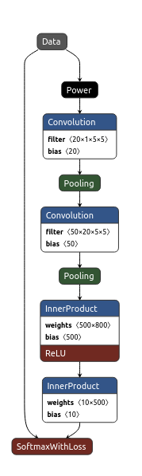

```c++
//!
//! \brief Uses the API to create the MNIST Network
//!
//! \param network Pointer to the network that will be populated with the MNIST network
//!
//! \param builder Pointer to the engine builder
//!
bool SampleMNISTAPI::constructNetwork(SampleUniquePtr<nvinfer1::IBuilder>& builder,
    SampleUniquePtr<nvinfer1::INetworkDefinition>& network, SampleUniquePtr<nvinfer1::IBuilderConfig>& config)
{
    // Create input tensor of shape { 1, 1, 28, 28 }
    //将输入张量添加到网络中。Dims4{1,1, mParams.inputH, mParams.inputW}指的是，batch_size为 1，channel为 1，输入height和width分别为 INPUT_H, INPUT_W 的blob。
    ITensor* data = network->addInput(
        mParams.inputTensorNames[0].c_str(), DataType::kFLOAT, Dims4{1, 1, mParams.inputH, mParams.inputW});
    ASSERT(data);

    // Create scale layer with default power/shift and specified scale parameter.
    const float scaleParam = 0.0125f;//可以从mnist.caffemodel的power层看出这里的值
    const Weights power{DataType::kFLOAT, nullptr, 0};
    const Weights shift{DataType::kFLOAT, nullptr, 0};
    const Weights scale{DataType::kFLOAT, &scaleParam, 1};
    //后面就是添加各种层
    IScaleLayer* scale_1 = network->addScale(*data, ScaleMode::kUNIFORM, shift, scale, power);
    ASSERT(scale_1);

    // Add convolution layer with 20 outputs and a 5x5 filter.
    //`20`表示卷积核的个数，`DimsHW{5, 5}`表示卷积核的大小，`weightMap["conv1filter"]和weightMap["conv1bias"]`表示权值系数矩阵
    IConvolutionLayer* conv1 = network->addConvolutionNd(
        *scale_1->getOutput(0), 20, Dims{2, {5, 5}}, mWeightMap["conv1filter"], mWeightMap["conv1bias"]);
    ASSERT(conv1);
    conv1->setStride(DimsHW{1, 1});//设置步长为1 这些数值都可以在mnist.caffemodel中获取

    // Add max pooling layer with stride of 2x2 and kernel size of 2x2.
    IPoolingLayer* pool1 = network->addPoolingNd(*conv1->getOutput(0), PoolingType::kMAX, Dims{2, {2, 2}});
    ASSERT(pool1);
    pool1->setStride(DimsHW{2, 2});

    // Add second convolution layer with 50 outputs and a 5x5 filter.
    IConvolutionLayer* conv2 = network->addConvolutionNd(
        *pool1->getOutput(0), 50, Dims{2, {5, 5}}, mWeightMap["conv2filter"], mWeightMap["conv2bias"]);
    ASSERT(conv2);
    conv2->setStride(DimsHW{1, 1});

    // Add second max pooling layer with stride of 2x2 and kernel size of 2x3>
    IPoolingLayer* pool2 = network->addPoolingNd(*conv2->getOutput(0), PoolingType::kMAX, Dims{2, {2, 2}});
    ASSERT(pool2);
    pool2->setStride(DimsHW{2, 2});

    // Utility for use MatMul as FC
    auto addMatMulasFCLayer
        = [&network](ITensor* input, int32_t const outputs, Weights& filterWeights, Weights& biasWeights) -> ILayer* {
        Dims inputDims = input->getDimensions();
        int32_t const m = inputDims.d[0];
        int32_t const k
            = std::accumulate(inputDims.d + 1, inputDims.d + inputDims.nbDims, 1, std::multiplies<int32_t>());
        int32_t const n = static_cast<int32_t>(filterWeights.count / static_cast<int64_t>(k));
        ASSERT(static_cast<int64_t>(n) * static_cast<int64_t>(k) == filterWeights.count);
        ASSERT(static_cast<int64_t>(n) == biasWeights.count);
        ASSERT(n == outputs);

        IShuffleLayer* inputReshape = network->addShuffle(*input);
        ASSERT(inputReshape);
        inputReshape->setReshapeDimensions(Dims{2, {m, k}});

        IConstantLayer* filterConst = network->addConstant(Dims{2, {n, k}}, filterWeights);
        ASSERT(filterConst);
        IMatrixMultiplyLayer* mm = network->addMatrixMultiply(*inputReshape->getOutput(0), MatrixOperation::kNONE,
            *filterConst->getOutput(0), MatrixOperation::kTRANSPOSE);
        ASSERT(mm);

        IConstantLayer* biasConst = network->addConstant(Dims{2, {1, n}}, biasWeights);
        ASSERT(biasConst);
        IElementWiseLayer* biasAdd
            = network->addElementWise(*mm->getOutput(0), *biasConst->getOutput(0), ElementWiseOperation::kSUM);
        ASSERT(biasAdd);

        IShuffleLayer* outputReshape = network->addShuffle(*biasAdd->getOutput(0));
        ASSERT(outputReshape);
        outputReshape->setReshapeDimensions(Dims{4, {m, n, 1, 1}});

        return outputReshape;
    };

    // Add fully connected layer with 500 outputs.
    ILayer* ip1 = addMatMulasFCLayer(pool2->getOutput(0), 500, mWeightMap["ip1filter"], mWeightMap["ip1bias"]);
    ASSERT(ip1);

    // Add activation layer using the ReLU algorithm.
    IActivationLayer* relu1 = network->addActivation(*ip1->getOutput(0), ActivationType::kRELU);
    ASSERT(relu1);

    // Add second fully connected layer with 20 outputs.
    ILayer* ip2
        = addMatMulasFCLayer(relu1->getOutput(0), mParams.outputSize, mWeightMap["ip2filter"], mWeightMap["ip2bias"]);
    ASSERT(ip2);

    // Add softmax layer to determine the probability.
    ISoftMaxLayer* prob = network->addSoftMax(*ip2->getOutput(0));
    ASSERT(prob);
    prob->getOutput(0)->setName(mParams.outputTensorNames[0].c_str());
    network->markOutput(*prob->getOutput(0));

    // Build engine
    if (mParams.fp16)
    {
        config->setFlag(BuilderFlag::kFP16);
    }
    if (mParams.int8)
    {
        config->setFlag(BuilderFlag::kINT8);
        samplesCommon::setAllDynamicRanges(network.get(), 64.0f, 64.0f);
    }

    samplesCommon::enableDLA(builder.get(), config.get(), mParams.dlaCore);

    // CUDA stream used for profiling by the builder.
    auto profileStream = samplesCommon::makeCudaStream();
    if (!profileStream)
    {
        return false;
    }
    config->setProfileStream(*profileStream);

    SampleUniquePtr<IHostMemory> plan{builder->buildSerializedNetwork(*network, *config)};
    if (!plan)
    {
        return false;
    }

    SampleUniquePtr<IRuntime> runtime{createInferRuntime(sample::gLogger.getTRTLogger())};
    if (!runtime)
    {
        return false;
    }

    mEngine = std::shared_ptr<nvinfer1::ICudaEngine>(
        runtime->deserializeCudaEngine(plan->data(), plan->size()), samplesCommon::InferDeleter());
    if (!mEngine)
    {
        return false;
    }

    return true;
}
```

* ```c++
  IScaleLayer* scale_1 = network->addScale(*data, ScaleMode::kUNIFORM, shift, scale, power);
  ```

  * 调用了一个`addScale()`函数，后面接受的参数是这一层需要设置的参数，Scale 层的作用是为每个输入数据执行幂运算，公式为

  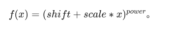

  ​	层的类型为`Power`。可选参数为：power: 默认为1。scale: 默认为1。shift: 默认为0。

* ```c++
  // Add convolution layer with 20 outputs and a 5x5 filter.
  //添加第一个卷积层
      IConvolutionLayer* conv1 = network->addConvolutionNd(
          *scale_1->getOutput(0), 20, Dims{2, {5, 5}}, mWeightMap["conv1filter"], mWeightMap["conv1bias"]);
      ASSERT(conv1);
      conv1->setStride(DimsHW{1, 1});
  //Scale 层是没有训练参数的，ReLU 层，Pooling 层都没有训练参数。而有训练参数的如卷积层，全连接层，在构造的时候则需要先加载权重文件。
  //注意这里的`mWeightMap`在`bool SampleMNISTAPI::build()`函数里面已经加载了，权重只用加载一次。在第一行添加卷积层的函数里面，`*scale_1->getOutput(0)` 用来获取上一层 Scale 层的输出，`20`表示卷积核的个数，`DimsHW{5, 5}`表示卷积核的大小，`weightMap["conv1filter"]和weightMap["conv1bias"]`表示权值系数矩阵。
  ```

### 解析 mnistapi.wts 文件

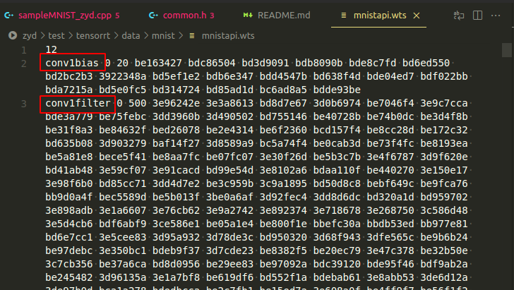

容易发现每一行都是一层的一些参数，比如`conv1bias`就是第一个卷积层的偏置系数，后面的`0`指的是 kFLOAT 类型，也就是`float 32`；后面的`20`是系数的个数，因为输出是`20`，所以偏置是`20`个；下面一行是卷积核的系数，因为是`20`个`5 x 5`的卷积核，所以有`20 x 5 x 5=500`个参数


# 例子3 sampleOnnxMNIST

这个例子演示了一个训练好的模型（ONNX格式）转换为TensorRT网络并进行推理。

ONNX是表示深度学习模型的标准，它允许模型在框架之间转移。

实例大概为以下三步

* 将ONNX模型转换为TensorRT网络（与第一个例子几乎一致）
* 构建一个engine（与上个例子几乎一致）
* 使用生成的TensorRT网络进行推理（与上个例子几乎一致）

## 代码解析

### build

```c++
//!
//! \brief Creates the network, configures the builder and creates the network engine
//!
//! \details This function creates the Onnx MNIST network by parsing the Onnx model and builds
//!          the engine that will be used to run MNIST (mEngine)
//!
//! \return true if the engine was created successfully and false otherwise
//!
bool SampleOnnxMNIST::build()
{
    auto builder = SampleUniquePtr<nvinfer1::IBuilder>(nvinfer1::createInferBuilder(sample::gLogger.getTRTLogger()));
    if (!builder)
    {
        return false;
    }

    const auto explicitBatch = 1U << static_cast<uint32_t>(NetworkDefinitionCreationFlag::kEXPLICIT_BATCH);
    auto network = SampleUniquePtr<nvinfer1::INetworkDefinition>(builder->createNetworkV2(explicitBatch));
    if (!network)
    {
        return false;
    }

    auto config = SampleUniquePtr<nvinfer1::IBuilderConfig>(builder->createBuilderConfig());
    if (!config)
    {
        return false;
    }
	//类似第一个例子 使用onnx的解析器，只是参数不一样
    auto parser
        = SampleUniquePtr<nvonnxparser::IParser>(nvonnxparser::createParser(*network, sample::gLogger.getTRTLogger()));
    if (!parser)
    {
        return false;
    }
	
    auto constructed = constructNetwork(builder, network, config, parser);//区别还是这个构建网络的函数，下面列出函数内容
    if (!constructed)
    {
        return false;
    }

    // CUDA stream used for profiling by the builder.
    auto profileStream = samplesCommon::makeCudaStream();
    if (!profileStream)
    {
        return false;
    }
    config->setProfileStream(*profileStream);

    SampleUniquePtr<IHostMemory> plan{builder->buildSerializedNetwork(*network, *config)};
    if (!plan)
    {
        return false;
    }

    SampleUniquePtr<IRuntime> runtime{createInferRuntime(sample::gLogger.getTRTLogger())};
    if (!runtime)
    {
        return false;
    }

    mEngine = std::shared_ptr<nvinfer1::ICudaEngine>(
        runtime->deserializeCudaEngine(plan->data(), plan->size()), samplesCommon::InferDeleter());
    if (!mEngine)
    {
        return false;
    }

    ASSERT(network->getNbInputs() == 1);
    mInputDims = network->getInput(0)->getDimensions();
    ASSERT(mInputDims.nbDims == 4);

    ASSERT(network->getNbOutputs() == 1);
    mOutputDims = network->getOutput(0)->getDimensions();
    ASSERT(mOutputDims.nbDims == 2);

    return true;
}
```

```c++
//!
//! \brief Uses a ONNX parser to create the Onnx MNIST Network and marks the
//!        output layers
//!
//! \param network Pointer to the network that will be populated with the Onnx MNIST network
//!
//! \param builder Pointer to the engine builder
//!
bool SampleOnnxMNIST::constructNetwork(SampleUniquePtr<nvinfer1::IBuilder>& builder,
    SampleUniquePtr<nvinfer1::INetworkDefinition>& network, SampleUniquePtr<nvinfer1::IBuilderConfig>& config,
    SampleUniquePtr<nvonnxparser::IParser>& parser)
{
    //类比第一个例子，就是使用onnx的解析器创建TensorRT的网络
    auto parsed = parser->parseFromFile(locateFile(mParams.onnxFileName, mParams.dataDirs).c_str(),
        static_cast<int>(sample::gLogger.getReportableSeverity()));
    if (!parsed)
    {
        return false;
    }

    if (mParams.fp16)
    {
        config->setFlag(BuilderFlag::kFP16);
    }
    if (mParams.int8)
    {
        config->setFlag(BuilderFlag::kINT8);
        samplesCommon::setAllDynamicRanges(network.get(), 127.0f, 127.0f);
    }

    samplesCommon::enableDLA(builder.get(), config.get(), mParams.dlaCore);

    return true;
}
```

剩下的部分没什么说的，类比上面两个改变不大。


# 博客总结

由于官方文档不够详细，隐藏的细节比较多，参考网上的博客编写

参考的例子在https://github.com/NVIDIA/trt-samples-for-hackathon-cn

文档在50-Resource文件夹 TensorRT教程-TRT8.2.3-V1.1.pdf

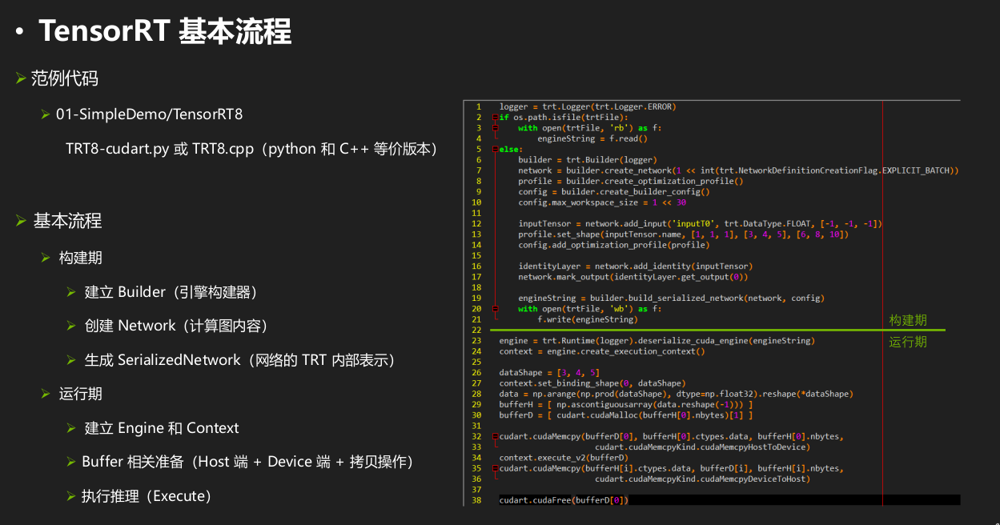

# 1 TRT流程 

参考 https://murphypei.github.io/blog/2019/09/trt-useage.html

### 构建模型 和 engine

TRT 将模型结构和参数以及相应 kernel 计算方法都编译成一个二进制 engine，因此在部署之后大大加快了推理速度。为了能够使用 TRT 进行推理，需要创建一个 eninge。TRT 中 engine 的创建有两种方式：

- 通过网络模型结构和参数文件编译得到，很慢。
- 读取一个已有的 engine（gie 文件），因为跳过了模型解析等过程，速度更快。

第一种方式很慢，但是在第一次部署某个模型，或者修改模型的精度、输入数据类型、网络结构等等，只要修改了模型，就必须重新编译（其实 TRT 还有一种可以重新加载参数的方式，不是本文所涉及的）。

现在假设我们是第一次用 TRT，所以就只能选择第一种方式来创建一个 engine。为了创建一个 engine，我们需要有模型结构和模型参数两个文件，同时需要能够解析这两个文件的方法。在 TRT 中，编译 engine 是通过 `IBuilder` 对象进行的，因此我们首先需要新键一个 `IBuilder` 对象：

```

nvinfer1::IBuilder *builder = createInferBuilder(gLogger);
```

> `gLogger` 是 TRT 中的日志接口 `ILogger` ，继承这个接口并创建自己的 logger 对象传入即可。

为了编译一个 engine，`builder` 首先需要创建一个 `INetworkDefinition` 作为模型的容器：

```

nvinfer1::INetworkDefinition *network = builder->createNetwork();
```

注意，**此时 `network` 是空的**，我们需要填充模型结构和参数，也就是解析我们自己的模型结构和参数文件，获取数据放到其中。

**TRT 官方给了三种主流框架模型格式的解析器（parser）**，分别是：

- ONNX：`IOnnxParser parser = nvonnxparser::createParser(*network, gLogger);`
- Caffe：`ICaffeParser parser = nvcaffeparser1::createCaffeParser();`
- UFF：`IUffParser parser = nvuffparser::createUffParser();`

其中 UFF 是用于 TensorFlow 的格式。调用这三种解析器就可以解析相应的文件。以 `ICaffeParser` 为例，调用其 `parse` 方法来填充 `network`。

```

virtual const IBlobNameToTensor* nvcaffeparser1::ICaffeParser::parse(
    const char* deploy, 
    const char * model, 
	nvinfer1::INetworkDefinition &network, 
	nvinfer1::DataType weightType)

//Parameters
//deploy	    The plain text, prototxt file used to define the network configuration.
//model	        The binaryproto Caffe model that contains the weights associated with the network.
//network	    Network in which the CaffeParser will fill the layers.
//weightType    The type to which the weights will transformed.
```

这样就能得到一个填充好的 `network` ，就可以编译 engine 了，似乎一切都很美妙呢…

然而实际 TRT 并不完善，比如 TensorFlow 的很多操作并不支持，因此你传入的文件往往是根本就解析不了（深度学习框架最常见的困境之一）。因此我们需要自己去做填充 `network` 这件事，这就需要调用 TRT 中低级别的接口来创建模型结构，类似于你在 Caffe 或者 TensorFlow 中做的那样。

TRT 提供了较为丰富的接口让你可以直接通过这些接口创建自己的网络，比如添加一个卷积层：

```

virtual IConvolutionLayer* nvinfer1::INetworkDefinition::addConvolution(ITensor &input, 
                                                                        int nbOutputMaps,
                                                                        DimsHW kernelSize,
                                                                        Weights kernelWeights,
                                                                        Weights biasWeights)		

// Parameters
// input	The input tensor to the convolution.
// nbOutputMaps	The number of output feature maps for the convolution.
// kernelSize	The HW-dimensions of the convolution kernel.
// kernelWeights	The kernel weights for the convolution.
// biasWeights	The optional bias weights for the convolution.
```

这里的参数基本上就是和其他深度学习框架类似的意思，没有什么好讲的。就是把数据封装成 TRT  中的数据结构即可。可能和平时构建训练网络不同的地方就是需要填充好模型的参数，因为 TRT  是推理框架，参数是已知确定的。这个过程一般是读取已经训练好的模型，构造 TRT 的数据结构类型放到其中，也就是需要你自己去解析模型参数文件。

之所以说 TRT 的网络构造接口是**较为丰富**，是因为即使使用这些低级接口这样，很多操作还是没办法完成，也就是没有相应的 `add*` 方法，更何况现实业务可能还会涉及很多自定义的功能层，因此 TRT 又有了 plugin 接口，允许你自己定义一个 `add*` 的操作。其流程就是继承 `nvinfer1::IPluginV2` 接口，利用 cuda 编写一个自定义层的功能，然后继承 `nvinfer1::IPluginCreator` 编写其创建类，需要重写其虚方法 `createPlugin`。最后调用 `REGISTER_TENSORRT_PLUGIN` 宏来注册这个 plugin 就可以用了。plugin 接口的成员函数介绍。

```

// 获得该自定义层的输出个数，比如 leaky relu 层的输出个数为1
virtual int getNbOutputs() const = 0;

// 得到输出 Tensor 的维数
virtual Dims getOutputDimensions(int index, const Dims* inputs, int nbInputDims) = 0;

// 配置该层的参数。该函数在 initialize() 函数之前被构造器调用。它为该层提供了一个机会，可以根据其权重、尺寸和最大批量大小来做出算法选择。
virtual void configure(const Dims* inputDims, int nbInputs, const Dims* outputDims, int nbOutputs, int maxBatchSize) = 0;

// 对该层进行初始化，在 engine 创建时被调用。
virtual int initialize() = 0;

// 该函数在 engine 被摧毁时被调用
virtual void terminate() = 0;

// 获得该层所需的临时显存大小。
virtual size_t getWorkspaceSize(int maxBatchSize) const = 0;

// 执行该层
virtual int enqueue(int batchSize, const void*const * inputs, void** outputs, void* workspace, cudaStream_t stream) = 0;

// 获得该层进行 serialization 操作所需要的内存大小
virtual size_t getSerializationSize() = 0;

// 序列化该层，根据序列化大小 getSerializationSize()，将该类的参数和额外内存空间全都写入到系列化buffer中。
virtual void serialize(void* buffer) = 0;
```

我们需要根据自己层的功能，重写这里全部或者部分函数的实现，这里有很多细节，没办法一一展开，需要自定义的时候还是需要看官方 API。

构建好了网络模型，就可以执行 engine 的编译了，还需要对 engine 进行一些设置。比如计算精度，支持的 batch size 等等，因为这些设置不同，编译出来的 engine 也不同。

TRT 支持 FP16 计算，也是官方推荐的计算精度，其设置也比简单，直接调用：

```

builder->setFp16Mode(true);
```

另外在设置精度的时候，还有一个设置 strict 策略的接口：

```

builder->setStrictTypeConstraints(true);
```

这个接口就是是否严格按照设置的精度进行类型转换，如果不设置 strict 策略，则 TRT 在某些计算中可能会选择更高精度（不影响性能）的计算类型。 

除了精度，还需要设置好运行的 batch size 和 workspace size：

```

builder->setMaxBatchSize(batch_size);
builder->setMaxWorkspaceSize(workspace_size);
```

这里的 batch size 是运行时最大能够支持的 batch size，运行时可以选择比这个值小的 batch size，workspace 也是相对于这个最大 batch size 设置的。

设置好上述参数，就可以编译 engine 了。

```

nvinfer1::ICudaEngine *engine = builder->buildCudaEngine(*network);
```

编译需要花较长时间，耐心等待。

### Engine 序列化和反序列化

编译 engine 需要较长时间，在模型和计算精度、batch size 等均保持不变的情况下，我们可以选择保存 engine 到本地，供下次运行使用，也就是 engine 序列化。TRT 提供了很方便的序列化方法：

```

nvinfer1::IHostMemory *modelStream = engine->serialize();
```

通过这个调用，得到的是一个二进制流，将这个流写入到一个文件中即可保存下来。

如果需要再次部署，可以直接反序列化保存好的文件，略过编译环节。

```

IRuntime* runtime = createInferRuntime(gLogger);
ICudaEngine* engine = runtime->deserializeCudaEngine(modelData, modelSize, nullptr);
```

### 使用 engine 进行预测

有了 engine 之后就可以使用它进行 inference 了。

首先创建一个 inference 的 context。这个 context 类似命名空间，用于保存一个 inference 任务的变量。

```

IExecutionContext *context = engine->createExecutionContext();
```

**一个 engine 可以有多个 context**，也就是说一个 engine 可以同时进行多个预测任务。

然后就是绑定输入和输出的 index。这一步的原因在于 TRT 在 build engine  的过程中，将输入和输出映射为索引编号序列，因此我们只能通过索引编号来获取输入和输出层的信息。虽然 TRT  提供了通过名字获取索引编号的接口，但是本地保存可以方便后续操作。

我们可以先获取索引编号的数量：

```

int index_number = engine->getNbBindings();
```

我们可以判断这个编号数量是不是和我们网络的输入输出之和相同，比如你有一个输入和一个输出，那么编号的数量就是2。如果不是，则说明这个 engine 是有问题的；如果没问题，我们就可以通过名字获取输入输出对应的序号：

```

int input_index = engine->getBindingIndex(input_layer_name);
int output_index = engine->getBindingIndex(output_layer_name);
```

对于常见的一个输入和输出的网络，输入的索引编号就是 0，输出的索引编号就是 1，所以这一步也不是必须的。

接下来就需要为输入和输出层分配显存空间了。为了分配显存空间，我们需要知道输入输出的维度信息和存放的数据类型，TRT 中维度信息和数据类型的表示如下：

```

class Dims
{
public:
    static const int MAX_DIMS = 8; //!< The maximum number of dimensions supported for a tensor.
    int nbDims;                    //!< The number of dimensions.
    int d[MAX_DIMS];               //!< The extent of each dimension.
    DimensionType type[MAX_DIMS];  //!< The type of each dimension.
};

enum class DataType : int
{
    kFLOAT = 0, //!< FP32 format.
    kHALF = 1,  //!< FP16 format.
    kINT8 = 2,  //!< quantized INT8 format.
    kINT32 = 3  //!< INT32 format.
};
```

我们通过索引编号获取输入和输出的数据维度（dims）和数据类型（dtype），然后为每个输出层开辟显存空间，存放输出结果：

```

for (int i = 0; i < index_number; ++i)
{
	nvinfer1::Dims dims = engine->getBindingDimensions(i);
	nvinfer1::DataType dtype = engine->getBindingDataType(i);
    // 获取数据长度
    auto buff_len = std::accumulate(dims.d, dims.d + dims.nbDims, 1, std::multiplies<int64_t>());
    // ...
    // 获取数据类型大小
    dtype_size = getTypeSize(dtype);	// 自定义函数
}

// 为 output 分配显存空间
for (auto &output_i : outputs)
{
    cudaMalloc(buffer_len_i * dtype_size_i * batch_size);
}
```

> 本文给出的是伪代码，仅表示逻辑，因此会涉及一些简单的自定义函数。

至此，我们已经做好了准备工作，现在就可以把数据塞进模型进行推理了。

### 前向预测

TRT 的前向预测执行是异步的，context 通过一个 enqueue 调用来提交任务：

```

cudaStream_t stream;
cudaStreamCreate(&stream);
context->enqueue(batch_size, buffers, stream, nullptr);
cudaStreamSynchronize(stream);
```

enqueue 是 TRT 的实际执行任务的函数，我们在写 plugin 的时候也需要实现这个函数接口。其中：

- `batch_size`：engine 在 build 过程中传入的 `max_batch_size`。

- `buffers`：是一个指针数组，其下标对应的就是输入输出层的索引编号，存放的就是输入的数据指针以及输出的数据存放地址（也就是开辟的显存地址）。

- `stream`：stream 是 cuda 一系列顺序操作的概念。对于我们的模型来说就是将所有的模型操作按照（网络结构）指定的顺序在指定的设备上执行。

  > cuda stream 是指一堆异步的 cuda 操作，他们按照 host 代码调用的顺序执行在 device 上。stream  维护了这些操作的顺序，并在所有预处理完成后允许这些操作进入工作队列，同时也可以对这些操作进行一些查询操作。这些操作包括 host 到  device 的数据传输，launch kernel 以及其他的 host 发起由 device 执行的动作。这些操作的执行总是异步的，cuda runtime 会决定这些操作合适的执行时机。我们则可以使用相应的cuda api 来保证所取得结果是在所有操作完成后获得的。**同一个 stream 里的操作有严格的执行顺序**，不同的 stream 则没有此限制。

这里需要注意，输入数据和输出数据在 buffers 数组中都是在 GPU 上的，可以通过 `cudaMemcpy` 拷贝 CPU 上的输入数据到 GPU 中（需要提前开辟一块显存来存放）。同理，输出数据也需要从 GPU 中拷贝到 CPU 中。

前两句创建了一个 cuda stream，最后一句则是等待这个异步 stream 执行完毕，然后从显存中将数据拷贝出来即可。

至此，我们就完成了 TRT 一个基本的预测流程。

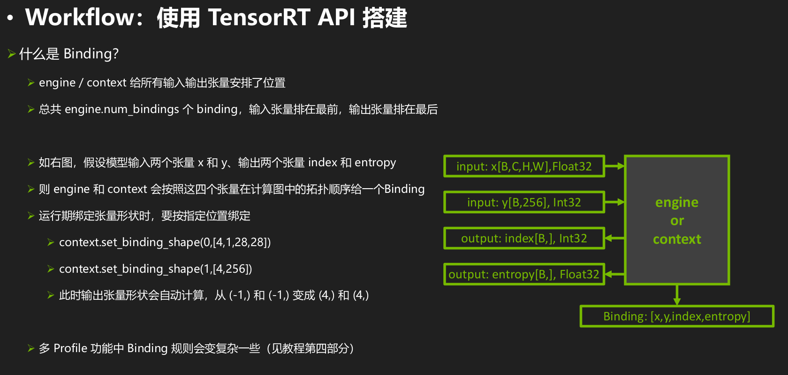

# 2 最简单的TensorRT例子

下面结合`note/tensorRT/code/trt-samples-for-hackathon-cn-master/cookbook/01-SimpleDemo/TensorRT8.4`的例子进行说明

参考 https://docs.nvidia.com/deeplearning/tensorrt/developer-guide/index.html#c_topics

## 分析

这个例子执行两次推理，只是简单的将host的内存拷贝到gpu中，执行推理后从GPU中拷贝出数据（推理没有作任何内容，因此推理前后数据不变）

* 第一次构建一个engine文件并保存本地，然后再进行推理
* 第二次加载上面保存在本地的model.plan 这个engine文件进行推理
* 使用了Dynamic Shape 模式
* explicit batch mode 显式批处理模式，网络指定[N,3,H,W]，因此指定的dim是4维的

分为以下几个步骤

1. 建立Builder（引擎构建器）

   ```c++
   IBuilder * builder = createInferBuilder(gLogger);
   ```

2. 创建Network（计算图内容）

   * 自定义了一个网络，指定输入和输出的维度

   ```c++
   INetworkDefinition *  network = builder->createNetworkV2(1U << int(NetworkDefinitionCreationFlag::kEXPLICIT_BATCH));//显式批处理模式
   IOptimizationProfile *profile = builder->createOptimizationProfile();
   IBuilderConfig *      config  = builder->createBuilderConfig();//创建一个构建配置 以指定Tensorrt应该如何优化模型。
   
   profile->setDimensions("foo", OptProfileSelector::kMIN, Dims3(3,100,200);
   profile->setDimensions("foo", OptProfileSelector::kOPT, Dims3(3,150,250);
   profile->setDimensions("foo", OptProfileSelector::kMAX, Dims3(3,200,300);
   
   config->addOptimizationProfile(profile)//修改网络参数，例如输入的batchsize,配置config
   //api 手动创建层或者导入
   //这里注意两种方式，
   //第一种方式：手动创建网络就是类似sampleMINISTAPI中调用network->addInput等创建网络结构
   //第二种方式：类似IOnnxParser parser = nvonnxparser::createParser(*network, gLogger);使用解析器来构建网络，类似sampleMINST中的代码
   //auto parsed = parser->parseFromFile(locateFile(mParams.onnxFileName, mParams.dataDirs).c_str(),static_cast<int>(sample::gLogger.getReportableSeverity()));
   ```

3. 生成SerializedNetwork（网络的TRT内部表示）

   ```c++
   IHostMemory *engineString = builder->buildSerializedNetwork(*network, *config);
   ```

4. 建立Engine

   ```c++
   IRuntime *runtime {createInferRuntime(gLogger)};
   engine = runtime->deserializeCudaEngine(engineString->data(), engineString->size());
   ```

5. 建立Context

   ```c++
   IExecutionContext *context = engine->createExecutionContext();
   ```

6. Buffer准备（Host端/Device端/拷贝）

   ```c++
   CHECK(cudaMalloc(&vBufferD[i], vBindingSize[i]));
   CHECK(cudaMemcpy(vBufferD[i], vBufferH[i], vBindingSize[i], cudaMemcpyHostToDevice));//将数据拷贝到gpu中
   ```

7. 执行推理

   ```c++
   context->executeV2(vBufferD.data());
   CHECK(cudaMemcpy(vBufferH[i], vBufferD[i], vBindingSize[i], cudaMemcpyDeviceToHost));//从gpu中取出结果
   ```

## 代码

```c++
/*
 * Copyright (c) 2021-2022, NVIDIA CORPORATION. All rights reserved.

 *
 * Licensed under the Apache License, Version 2.0 (the "License");
 * you may not use this file except in compliance with the License.
 * You may obtain a copy of the License at
 *
 *     http://www.apache.org/licenses/LICENSE-2.0
 *
 * Unless required by applicable law or agreed to in writing, software
 * distributed under the License is distributed on an "AS IS" BASIS,
 * WITHOUT WARRANTIES OR CONDITIONS OF ANY KIND, either express or implied.
 * See the License for the specific language governing permissions and
 * limitations under the License.
 */

#include "cookbookHelper.hpp"

using namespace nvinfer1;

const std::string trtFile {"./model.plan"};
static Logger     gLogger(ILogger::Severity::kERROR);

void run()
{
    ICudaEngine *engine = nullptr;

    if (access(trtFile.c_str(), F_OK) == 0)
    {
        std::ifstream engineFile(trtFile, std::ios::binary);
        long int      fsize = 0;

        engineFile.seekg(0, engineFile.end);
        fsize = engineFile.tellg();
        engineFile.seekg(0, engineFile.beg);
        std::vector<char> engineString(fsize);
        engineFile.read(engineString.data(), fsize);
        if (engineString.size() == 0)
        {
            std::cout << "Failed getting serialized engine!" << std::endl;
            return;
        }
        std::cout << "Succeeded getting serialized engine!" << std::endl;
		//有了engin文件 如果要执行推理就需要创建runtime
		//反序列化plan文件
        IRuntime *runtime {createInferRuntime(gLogger)};
		//将模型读入缓冲区后，可以对其进行反序列化以获得引擎
        engine = runtime->deserializeCudaEngine(engineString.data(), fsize);
        if (engine == nullptr)
        {
            std::cout << "Failed loading engine!" << std::endl;
            return;
        }
        std::cout << "Succeeded loading engine!" << std::endl;
    }
    else
    {
		//首次执行并没有model.plan engine文件，因此需要创建一个engin并保存为文件model.plan
		//要创建构建器，首先必须实例化ILogger接口。参考 https://docs.nvidia.com/deeplearning/tensorrt/developer-guide/index.html#c_topics
		//setp1：建立Builder
        IBuilder *            builder = createInferBuilder(gLogger);
		//step2：创建Network 显式批处理模式 空的我们需要填充模型结构和参数，也就是解析我们自己的模型结构和参数文件，获取数据放到其中。
        INetworkDefinition *  network = builder->createNetworkV2(1U << int(NetworkDefinitionCreationFlag::kEXPLICIT_BATCH));
        //参考 https://docs.nvidia.com/deeplearning/tensorrt/developer-guide/index.html#opt_profiles
		//自定义了一个网络 有点类似与Parser的导入功能
		//在构造 CudaEngine 的时候至少要有一个 IOptimizationProfile，因为每个 ExecutionContext 在使用之前都要先指定一个 IOptimizationProfile 才可以执行推理操作。
		IOptimizationProfile *profile = builder->createOptimizationProfile();
		//创建一个构建配置 以指定Tensorrt应该如何优化模型。
        IBuilderConfig *      config  = builder->createBuilderConfig();
		//应该是设置了内存大小
        config->setMemoryPoolLimit(MemoryPoolType::kWORKSPACE, 1 << 30);
		//自定义网络的实现
		//添加输入层
		//通过指定输入张量的名称、数据类型和完整维度，将输入层添加到网络中。
        ITensor *inputTensor = network->addInput("inputT0", DataType::kFLOAT, Dims32 {4, {-1, -1, -1, -1}});
        //网络输入的维度范围以及自动调优器用于优化的维度。
		profile->setDimensions(inputTensor->getName(), OptProfileSelector::kMIN, Dims32 {4, {1, 1, 1, 1}});
        profile->setDimensions(inputTensor->getName(), OptProfileSelector::kOPT, Dims32 {4, {2, 3, 4, 5}});
        profile->setDimensions(inputTensor->getName(), OptProfileSelector::kMAX, Dims32 {4, {4, 6, 8, 10}});
        config->addOptimizationProfile(profile);
		//添加标识层
        IIdentityLayer *identityLayer = network->addIdentity(*inputTensor);
		//标记为整个网络的输出
        network->markOutput(*identityLayer->getOutput(0));

		//step：3 生成SerializedNetwork 配置完成了 构建engine
        IHostMemory *engineString = builder->buildSerializedNetwork(*network, *config);
        if (engineString == nullptr || engineString->size() == 0)
        {
            std::cout << "Failed building serialized engine!" << std::endl;
            return;
        }
        std::cout << "Succeeded building serialized engine!" << std::endl;
		//有了engin文件 如果要执行推理就需要创建runtime
        IRuntime *runtime {createInferRuntime(gLogger)};
		//将模型读入缓冲区后，可以对其进行反序列化以获得引擎
		//step4 建立Engine
        engine = runtime->deserializeCudaEngine(engineString->data(), engineString->size());
        if (engine == nullptr)
        {
            std::cout << "Failed building engine!" << std::endl;
            return;
        }
        std::cout << "Succeeded building engine!" << std::endl;

        std::ofstream engineFile(trtFile, std::ios::binary);
        if (!engineFile)
        {
            std::cout << "Failed opening file to write" << std::endl;
            return;
        }
        engineFile.write(static_cast<char *>(engineString->data()), engineString->size());
        if (engineFile.fail())
        {
            std::cout << "Failed saving .plan file!" << std::endl;
            return;
        }
        std::cout << "Succeeded saving .plan file!" << std::endl;
    }
	//step5 建立Context
    IExecutionContext *context = engine->createExecutionContext();
	//在运行时，必须在选择优化概要文件之后设置输入维度。因为之前只是设定的动态范围。没有确定哪一个
    context->setBindingDimensions(0, Dims32 {4, {2, 3, 4, 5}});
    std::cout << std::string("Binding all? ") << std::string(context->allInputDimensionsSpecified() ? "Yes" : "No") << std::endl;
    //step6：Buffer准备
	int nBinding = engine->getNbBindings();//2
    int nInput   = 0;
    for (int i = 0; i < nBinding; ++i)
    {
        nInput += int(engine->bindingIsInput(i));
    }
    int nOutput = nBinding - nInput;
	std::cout <<"nInput="<<nInput<<" nBinding="<<nBinding<<" nOutput="<<nOutput<<std::endl;// 1 2 1
    //打印输出 Bind[0]:i[0]->FP32  (2, 3, 4, 5) inputT0
	//Bind[1]:o[0]->FP32  (2, 3, 4, 5) (Unnamed Layer* 0) [Identity]_output
	for (int i = 0; i < nBinding; ++i)
    {
        std::cout << std::string("Bind[") << i << std::string(i < nInput ? "]:i[" : "]:o[") << (i < nInput ? i : i - nInput) << std::string("]->");
        std::cout << dataTypeToString(engine->getBindingDataType(i)) << std::string(" ");
        std::cout << shapeToString(context->getBindingDimensions(i)) << std::string(" ");
        std::cout << engine->getBindingName(i) << std::endl;
    }

    std::vector<int> vBindingSize(nBinding, 0);
    for (int i = 0; i < nBinding; ++i)
    {
        Dims32 dim  = context->getBindingDimensions(i);
        int    size = 1;
        for (int j = 0; j < dim.nbDims; ++j)//nbDims=4 因为定义的输入dim是4维的
        {
            size *= dim.d[j];//dim的维度是2*3*4*5=120
        }
        vBindingSize[i] = size * dataTypeToSize(engine->getBindingDataType(i));//120*4 FP32是4字节
		//打印输出 i=0 dim.nbDims=4 vBindingSize[i]=480
		//i=1 dim.nbDims=4 vBindingSize[i]=480
		std::cout <<"i="<<i<<" dim.nbDims="<<dim.nbDims<<" vBindingSize[i]="<<vBindingSize[i]<<std::endl;
    }

    std::vector<void *> vBufferH {nBinding, nullptr};
    std::vector<void *> vBufferD {nBinding, nullptr};
    for (int i = 0; i < nBinding; ++i)
    {
        vBufferH[i] = (void *)new char[vBindingSize[i]];//Host的内存
        CHECK(cudaMalloc(&vBufferD[i], vBindingSize[i]));//Device内存 GPU内存
    }

    float *pData = (float *)vBufferH[0];
    for (int i = 0; i < vBindingSize[0] / dataTypeToSize(engine->getBindingDataType(0)); ++i)
    {
        pData[i] = float(i);
    }
    for (int i = 0; i < nInput; ++i)
    {
        CHECK(cudaMemcpy(vBufferD[i], vBufferH[i], vBindingSize[i], cudaMemcpyHostToDevice));//从CPU拷贝内存到GPU 用于推理
    }
	//step7：执行推理
    context->executeV2(vBufferD.data());

    for (int i = nInput; i < nBinding; ++i)
    {
        CHECK(cudaMemcpy(vBufferH[i], vBufferD[i], vBindingSize[i], cudaMemcpyDeviceToHost));//推理完成 结果从GPU拷贝到CPU
    }

    for (int i = 0; i < nBinding; ++i)
    {
        printArrayInfomation((float *)vBufferH[i], context->getBindingDimensions(i), std::string(engine->getBindingName(i)), true);
    }

    for (int i = 0; i < nBinding; ++i)
    {
        delete[] vBufferH[i];
        CHECK(cudaFree(vBufferD[i]));
    }
    return;
}

int main()
{
    CHECK(cudaSetDevice(0));
    run();
    run();
    return 0;
}

```

程序输出如下

```shell
huolin@huolin:~/WorkSpace/zyd/note/tensorRT/code/trt-samples-for-hackathon-cn-master/cookbook/01-SimpleDemo/TensorRT8.4$ make test
make clean
make[1]: Entering directory '/home/huolin/WorkSpace/zyd/note/tensorRT/code/trt-samples-for-hackathon-cn-master/cookbook/01-SimpleDemo/TensorRT8.4'
rm -rf ./*.d ./*.o ./*.so ./*.exe ./*.plan
make[1]: Leaving directory '/home/huolin/WorkSpace/zyd/note/tensorRT/code/trt-samples-for-hackathon-cn-master/cookbook/01-SimpleDemo/TensorRT8.4'
make
make[1]: Entering directory '/home/huolin/WorkSpace/zyd/note/tensorRT/code/trt-samples-for-hackathon-cn-master/cookbook/01-SimpleDemo/TensorRT8.4'
/usr/local/cuda/bin/nvcc -w -std=c++14 -O3 -UDEBUG -Xcompiler -fPIC -use_fast_math -I. -I/usr/local/cuda/include -I/usr/include/x86_64-linux-gnu -M -MT main.o -o main.d main.cpp
/usr/local/cuda/bin/nvcc -w -std=c++14 -O3 -UDEBUG -Xcompiler -fPIC -use_fast_math -I. -I/usr/local/cuda/include -I/usr/include/x86_64-linux-gnu -Xcompiler -fPIC -o main.o -c main.cpp
/usr/local/cuda/bin/nvcc -w -std=c++14 -O3 -UDEBUG -Xcompiler -fPIC -use_fast_math -L/usr/local/cuda/lib64 -lcudart -L/usr/lib/x86_64-linux-gnu -lnvinfer -o main.exe main.o
rm main.o
make[1]: Leaving directory '/home/huolin/WorkSpace/zyd/note/tensorRT/code/trt-samples-for-hackathon-cn-master/cookbook/01-SimpleDemo/TensorRT8.4'
rm -rf ./*.plan
././main.exe
Succeeded building serialized engine!
Succeeded building engine!
Succeeded saving .plan file!
Binding all? Yes
nInput=1 nBinding=2 nOutput=1
Bind[0]:i[0]->FP32  (2, 3, 4, 5) inputT0
Bind[1]:o[0]->FP32  (2, 3, 4, 5) (Unnamed Layer* 0) [Identity]_output
i=0 dim.nbDims=4 vBindingSize[i]=480
i=1 dim.nbDims=4 vBindingSize[i]=480

inputT0: (2, 3, 4, 5, )
absSum=7140.0000,mean=59.5000,var=1199.9167,max=119.0000,min= 0.0000,diff=119.0000,
 0.00000,  1.00000,  2.00000,  3.00000,  4.00000,  5.00000,  6.00000,  7.00000,  8.00000,  9.00000, 
110.00000, 111.00000, 112.00000, 113.00000, 114.00000, 115.00000, 116.00000, 117.00000, 118.00000, 119.00000, 
 0.000  1.000  2.000  3.000  4.000 
 5.000  6.000  7.000  8.000  9.000 
10.000 11.000 12.000 13.000 14.000 
15.000 16.000 17.000 18.000 19.000 

20.000 21.000 22.000 23.000 24.000 
25.000 26.000 27.000 28.000 29.000 
30.000 31.000 32.000 33.000 34.000 
35.000 36.000 37.000 38.000 39.000 

40.000 41.000 42.000 43.000 44.000 
45.000 46.000 47.000 48.000 49.000 
50.000 51.000 52.000 53.000 54.000 
55.000 56.000 57.000 58.000 59.000 


60.000 61.000 62.000 63.000 64.000 
65.000 66.000 67.000 68.000 69.000 
70.000 71.000 72.000 73.000 74.000 
75.000 76.000 77.000 78.000 79.000 

80.000 81.000 82.000 83.000 84.000 
85.000 86.000 87.000 88.000 89.000 
90.000 91.000 92.000 93.000 94.000 
95.000 96.000 97.000 98.000 99.000 

100.000 101.000 102.000 103.000 104.000 
105.000 106.000 107.000 108.000 109.000 
110.000 111.000 112.000 113.000 114.000 
115.000 116.000 117.000 118.000 119.000 


(Unnamed Layer* 0) [Identity]_output: (2, 3, 4, 5, )
absSum=7140.0000,mean=59.5000,var=1199.9167,max=119.0000,min= 0.0000,diff=119.0000,
 0.00000,  1.00000,  2.00000,  3.00000,  4.00000,  5.00000,  6.00000,  7.00000,  8.00000,  9.00000, 
110.00000, 111.00000, 112.00000, 113.00000, 114.00000, 115.00000, 116.00000, 117.00000, 118.00000, 119.00000, 
 0.000  1.000  2.000  3.000  4.000 
 5.000  6.000  7.000  8.000  9.000 
10.000 11.000 12.000 13.000 14.000 
15.000 16.000 17.000 18.000 19.000 

20.000 21.000 22.000 23.000 24.000 
25.000 26.000 27.000 28.000 29.000 
30.000 31.000 32.000 33.000 34.000 
35.000 36.000 37.000 38.000 39.000 

40.000 41.000 42.000 43.000 44.000 
45.000 46.000 47.000 48.000 49.000 
50.000 51.000 52.000 53.000 54.000 
55.000 56.000 57.000 58.000 59.000 


60.000 61.000 62.000 63.000 64.000 
65.000 66.000 67.000 68.000 69.000 
70.000 71.000 72.000 73.000 74.000 
75.000 76.000 77.000 78.000 79.000 

80.000 81.000 82.000 83.000 84.000 
85.000 86.000 87.000 88.000 89.000 
90.000 91.000 92.000 93.000 94.000 
95.000 96.000 97.000 98.000 99.000 

100.000 101.000 102.000 103.000 104.000 
105.000 106.000 107.000 108.000 109.000 
110.000 111.000 112.000 113.000 114.000 
115.000 116.000 117.000 118.000 119.000 


Succeeded getting serialized engine!
Succeeded loading engine!
Binding all? Yes
nInput=1 nBinding=2 nOutput=1
Bind[0]:i[0]->FP32  (2, 3, 4, 5) inputT0
Bind[1]:o[0]->FP32  (2, 3, 4, 5) (Unnamed Layer* 0) [Identity]_output
i=0 dim.nbDims=4 vBindingSize[i]=480
i=1 dim.nbDims=4 vBindingSize[i]=480

inputT0: (2, 3, 4, 5, )
absSum=7140.0000,mean=59.5000,var=1199.9167,max=119.0000,min= 0.0000,diff=119.0000,
 0.00000,  1.00000,  2.00000,  3.00000,  4.00000,  5.00000,  6.00000,  7.00000,  8.00000,  9.00000, 
110.00000, 111.00000, 112.00000, 113.00000, 114.00000, 115.00000, 116.00000, 117.00000, 118.00000, 119.00000, 
 0.000  1.000  2.000  3.000  4.000 
 5.000  6.000  7.000  8.000  9.000 
10.000 11.000 12.000 13.000 14.000 
15.000 16.000 17.000 18.000 19.000 

20.000 21.000 22.000 23.000 24.000 
25.000 26.000 27.000 28.000 29.000 
30.000 31.000 32.000 33.000 34.000 
35.000 36.000 37.000 38.000 39.000 

40.000 41.000 42.000 43.000 44.000 
45.000 46.000 47.000 48.000 49.000 
50.000 51.000 52.000 53.000 54.000 
55.000 56.000 57.000 58.000 59.000 


60.000 61.000 62.000 63.000 64.000 
65.000 66.000 67.000 68.000 69.000 
70.000 71.000 72.000 73.000 74.000 
75.000 76.000 77.000 78.000 79.000 

80.000 81.000 82.000 83.000 84.000 
85.000 86.000 87.000 88.000 89.000 
90.000 91.000 92.000 93.000 94.000 
95.000 96.000 97.000 98.000 99.000 

100.000 101.000 102.000 103.000 104.000 
105.000 106.000 107.000 108.000 109.000 
110.000 111.000 112.000 113.000 114.000 
115.000 116.000 117.000 118.000 119.000 


(Unnamed Layer* 0) [Identity]_output: (2, 3, 4, 5, )
absSum=7140.0000,mean=59.5000,var=1199.9167,max=119.0000,min= 0.0000,diff=119.0000,
 0.00000,  1.00000,  2.00000,  3.00000,  4.00000,  5.00000,  6.00000,  7.00000,  8.00000,  9.00000, 
110.00000, 111.00000, 112.00000, 113.00000, 114.00000, 115.00000, 116.00000, 117.00000, 118.00000, 119.00000, 
 0.000  1.000  2.000  3.000  4.000 
 5.000  6.000  7.000  8.000  9.000 
10.000 11.000 12.000 13.000 14.000 
15.000 16.000 17.000 18.000 19.000 

20.000 21.000 22.000 23.000 24.000 
25.000 26.000 27.000 28.000 29.000 
30.000 31.000 32.000 33.000 34.000 
35.000 36.000 37.000 38.000 39.000 

40.000 41.000 42.000 43.000 44.000 
45.000 46.000 47.000 48.000 49.000 
50.000 51.000 52.000 53.000 54.000 
55.000 56.000 57.000 58.000 59.000 


60.000 61.000 62.000 63.000 64.000 
65.000 66.000 67.000 68.000 69.000 
70.000 71.000 72.000 73.000 74.000 
75.000 76.000 77.000 78.000 79.000 

80.000 81.000 82.000 83.000 84.000 
85.000 86.000 87.000 88.000 89.000 
90.000 91.000 92.000 93.000 94.000 
95.000 96.000 97.000 98.000 99.000 

100.000 101.000 102.000 103.000 104.000 
105.000 106.000 107.000 108.000 109.000 
110.000 111.000 112.000 113.000 114.000 
115.000 116.000 117.000 118.000 119.000 

```

# TIPS:

在`tensorrt/samples/common/sampleEngines.cpp`文件中有保存和加载engine的操作函数。

## saveEngine

用于保存engine文件，可以根据自己的需求进行修改

```c++
bool saveEngine(const ICudaEngine& engine, std::string const& fileName, std::ostream& err)
{
    std::ofstream engineFile(fileName, std::ios::binary);
    if (!engineFile)
    {
        err << "Cannot open engine file: " << fileName << std::endl;
        return false;
    }

    std::unique_ptr<IHostMemory> serializedEngine{engine.serialize()};
    if (serializedEngine == nullptr)
    {
        err << "Engine serialization failed" << std::endl;
        return false;
    }

    engineFile.write(static_cast<char*>(serializedEngine->data()), serializedEngine->size());
    return !engineFile.fail();
}
```

## loadEngine

用于加载engine文件，根据自己需求修改

```c++
    struct stat my_stat;
	char* filename = "./onnx_engine.engine";
 
	if (stat(filename, &my_stat) == 0) 
    {
		initLibNvInferPlugins(&gLogger.getTRTLogger(), "");
 
		std::ifstream engineFile(filename, std::ios::binary);
		if (!engineFile)
		{
			std::cout << "Error opening engine file: " << filename << std::endl;
			return nullptr;
		}
 
		engineFile.seekg(0, engineFile.end);
		long int fsize = engineFile.tellg();
		engineFile.seekg(0, engineFile.beg);
 
		std::vector<char> engineData(fsize);
		engineFile.read(engineData.data(), fsize);
 
		SampleUniquePtr<IRuntime> runtime{ createInferRuntime(gLogger.getTRTLogger()) };
 
		auto mEngine = runtime->deserializeCudaEngine(engineData.data(), engineData.size(), nullptr);
 
		nvinfer1::Dims mInputDims = mEngine->getBindingDimensions(0);
     }
```

## caffemodel

里不仅存储了权重和偏置等信息，还存储了整个训练网络的结构信息，即.prototxt信息

# 附录

[官方](https://docs.nvidia.com/deeplearning/tensorrt/sample-support-guide/index.html#c_samples_section)

API参考 https://docs.nvidia.com/deeplearning/tensorrt/api/c_api/classnvinfer1_1_1_i_network_definition.html#a00980627b900c6fe4b293e0f8206077c

官方例子说明 https://docs.nvidia.com/deeplearning/tensorrt/sample-support-guide/index.html#samples

官方例子git https://github.com/NVIDIA/TensorRT/tree/main/samples

官方开发指南 https://docs.nvidia.com/deeplearning/tensorrt/developer-guide/index.html#create_network_c

sampleMNIST 参考博客

* https://www.freesion.com/article/3453987630/ 
* https://blog.51cto.com/u_15490502/5220171
* https://blog.csdn.net/HaoBBNuanMM/article/details/102841685
* http://giantpandacv.com/project/%E9%83%A8%E7%BD%B2%E4%BC%98%E5%8C%96/AI%20%E9%83%A8%E7%BD%B2%E5%8F%8A%E5%85%B6%E5%AE%83%E4%BC%98%E5%8C%96%E7%AE%97%E6%B3%95/TensorRT/%E4%B8%89%EF%BC%8C%E5%A6%82%E4%BD%95%E4%BD%BF%E7%94%A8tensorRT%20C%2B%2B%20API%E6%90%AD%E5%BB%BA%E7%BD%91%E7%BB%9C/

非常好的实践例子 https://github.com/NVIDIA/trt-samples-for-hackathon-cn


# 编写

zyd