# 说明

翻译官方 [Quick Start Guide](https://docs.nvidia.com/deeplearning/tensorrt/quick-start-guide/index.html)

# 概要

* 第一章介绍了TensorRT是如何打包和支持的，以及它是如何融入开发者生态系统的。
* 第2章提供了TensorRT功能的概览。
* 第三章和第四章分别介绍了c++和Python api。
* 后续章节将详细介绍高级特性。
* 附录包含一个层参考和常见问题的答案。

NVIDIA TensorRT 8.4.3快速入门指南是想要尝试TensorRT SDK的开发者的一个起点;具体来说，本文演示了如何快速构造一个应用程序，在TensorRT引擎上运行推断。

# 快速开始

# 1 简介

NVIDIA TensorRT是一个SDK，用于优化经过训练的深度学习模型，以实现高性能推理。TensorRT包含一个用于训练好的深度学习模型的深度学习推理优化器（inference optimizer），以及一个用于执行的运行时（runtime）。

在您选择的框架中训练了您的深度学习模型之后，TensorRT使您能够以更高的吞吐量和更低的延迟运行它。

图1。使用TensorRT的典型深度学习开发周期

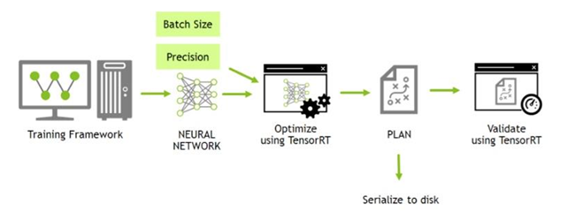

本指南涵盖了TensorRT中提供的基本安装、转换和运行时选项，以及它们的最佳应用时间。

以下是每一章的简要总结:

* [Installing TensorRT](https://docs.nvidia.com/deeplearning/tensorrt/quick-start-guide/index.html#install)

  我们提供多种简单的安装TensorRT的方法。

* [The TensorRT Ecosystem](https://docs.nvidia.com/deeplearning/tensorrt/quick-start-guide/index.html#ecosystem)

  我们描述了一个简单的流程图，以显示不同类型的转换和部署工作流，并讨论它们的优缺点。

* [Example Deployment Using ONNX](https://docs.nvidia.com/deeplearning/tensorrt/quick-start-guide/index.html#ex-deploy-onnx)

  我们将了解转换和部署模型的基本步骤。它将介绍本指南其余部分中使用的概念，并指导您为优化推理执行

* [TF-TRT Framework Integration](https://docs.nvidia.com/deeplearning/tensorrt/quick-start-guide/index.html#framework-integration)

  我们在Google®Tensorflow（TF）集成的内部介绍了Tensorrt（TRT）。

* [ONNX Conversion and Deployment](https://docs.nvidia.com/deeplearning/tensorrt/quick-start-guide/index.html#onnx-export)

  我们提供了一个从TensorFlow和PyTorch导出ONNX的广泛概述，

# 2 安装TensorRT

TensorRT的安装方法有很多种。本章涵盖了最常用的选项

容器、Debian文件或独立pip文件。其他的安装方法参考*[NVIDIA TensorRT Installation Guide](https://docs.nvidia.com/deeplearning/tensorrt/install-guide/index.html)*.

## 2.1 容器安装 TODO

## 2.2 Debian文件安装 TODO

本节包含开发人员安装的说明。这种安装方法适用于新用户或希望安装完整的开发人员的用户，包括c++和Python api的示例和文档。

1. 下载指定的版本[Download](https://docs.nvidia.com/deeplearning/tensorrt/install-guide/index.html#downloading)

   自己的电脑驱动版本如下

   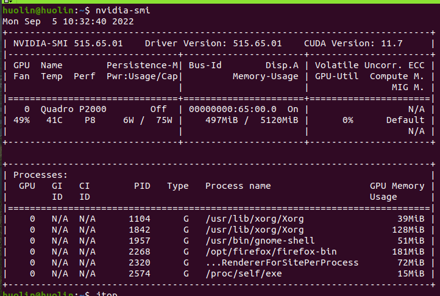

   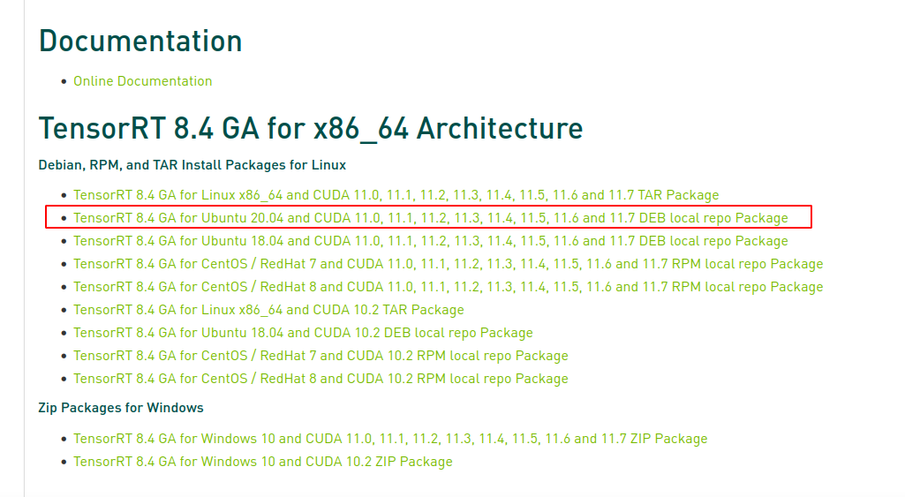

2. 安装

   ```shell
   os="ubuntuxx04"
   tag="cudax.x-trt8.x.x.x-ga-yyyymmdd"
   sudo dpkg -i nv-tensorrt-repo-${os}-${tag}_1-1_amd64.deb
   sudo apt-key add /var/nv-tensorrt-repo-${os}-${tag}/*.pub
   
   sudo apt-get update
   sudo apt-get install tensorrt
   ```

   根据上面的官方指导安装如下：

   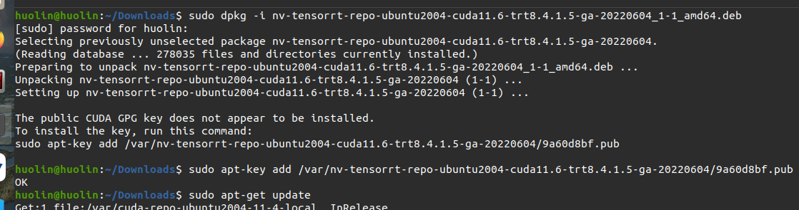

   如果使用Python 3.X

   ```shell
   python3 -m pip install numpy
   sudo apt-get install python3-libnvinfer-dev
   ```

​		会安装下面的内容

```shell
python3-libnvinfer
```

如果希望使用TensorFlow

```shell
python3 -m pip install protobuf
sudo apt-get install uff-converter-tf
```

graphsurgeon-tf包也将与上述命令一起安装。

如果您想运行需要ONNX graphsurgeon的示例，或者在自己的项目中使用Python模块，请运行

```shell
python3 -m pip install numpy onnx
sudo apt-get install onnx-graphsurgeon
```

3. 验证安装

   ```shell
   dpkg -l | grep TensorRT
   ```

   您应该看到类似以下内容

   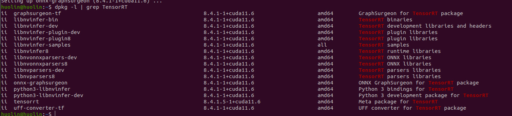

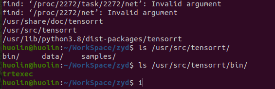

## 2.3 PIP安装 TODO

## 2.4 版本查看

```shell
dpkg -l | grep TensorRT #下图显示是8.4.1
#也可以查看文件find / -name NvInferVersion.h
```

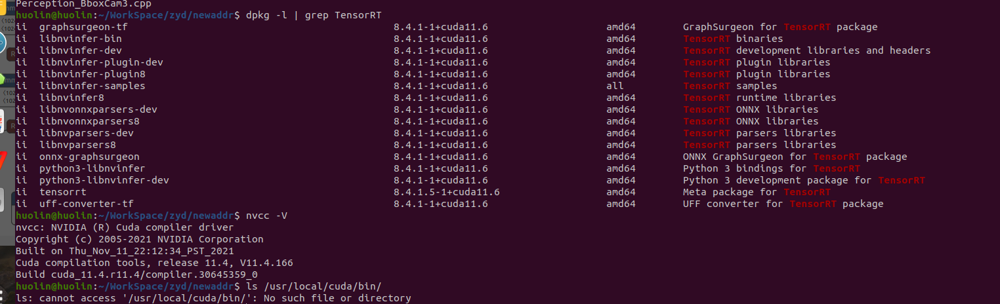


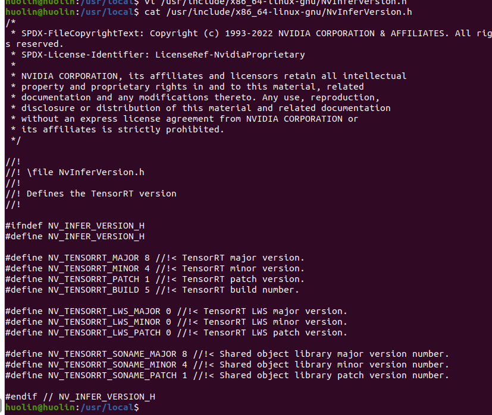

# 3 TensorRT流程图

TensorRT是一个大而灵活的项目。它可以处理各种转换和部署工作流，哪个工作流最适合您，这取决于您特定的用例和问题设置。

TensorRT提供了几种部署选项，但所有的工作流都涉及到将模型转换为优化的表示，TensorRT将其称为引擎（*engine*）。为你的模型构建一个TensorRT工作流需要选择正确的部署选项，以及正确的引擎创建参数组合。

## 3.1 基础流程

TensorRT用户必须遵循五个基本步骤来转换和部署他们的模型

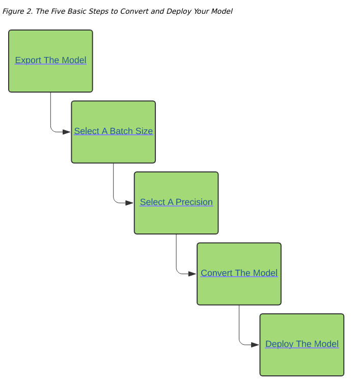

在一个完整的端到端工作流的背景下，最容易理解这些步骤:在下面使用ONNX的示例部署中，我们将介绍一个简单的框架无关的部署工作流，使用ONNX转换和TensorRT的独立运行时，将一个训练有素的ResNet-50模型转换和部署到TensorRT。

## 3.2. 转换和部署选项

分为两个部分：

* 用户可以按照不同路径将他们的模型转换为优化的TensorRT引擎。
* 不同的运行时用户可以使用TensorRT，当部署他们优化的TensorRT引擎时。

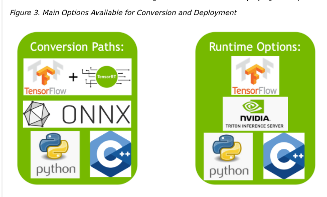

### 3.2.1. 转换

使用TensorRT转换模型有三个主要的选项:

* 使用TF-TRT
* 从.onnx文件自动ONNX转换
* 使用TensorRT API手动构建网络(c++或Python)

为了转换TensorFlow模型，TensorFlow集成(TF-TRT)提供了模型转换和高级运行时API，并且能够退回到TensorFlow实现，当TensorRT不支持特定操作符时。有关支持的操作符的更多信息，请参阅NVIDIA TensorRT支持矩阵中的支持操作部分[Supported Ops](https://docs.nvidia.com/deeplearning/tensorrt/support-matrix/index.html#supported-ops)。

对于自动模型转换和部署，一个性能更好的选择是使用ONNX进行转换。ONNX是一个框架无关选项，可以使用TensorFlow、PyTorch等模型。TensorRT支持ONNX文件的自动转换，可以使用TensorRT  API，也可以使用trtexec——我们将在本指南中使用后者。ONNX转换是全有或全无的，这意味着你的模型中的所有操作都必须得到TensorRT的支持(或者你必须为不支持的操作提供定制插件)。ONNX转换的结果是一个奇异的TensorRT引擎，允许比使用TF-TRT更少的开销。

为了获得最大的性能和可定制性，你也可以使用TensorRT网络定义API手工构造TensorRT引擎。这本质上涉及到在TensorRT操作中构建一个与目标模型相同的网络，只使用TensorRT操作。在创建了TensorRT网络之后，你就可以从框架中导出模型的权重，并将它们加载到TensorRT网络中。对于这种方法，可以在这里找到更多关于使用TensorRT的网络定义API构建模型的信息

- [Creating A Network Definition From Scratch                                           Using The C++ API](https://docs.nvidia.com/deeplearning/tensorrt/developer-guide/index.html#create_network_c)
- [Creating A Network Definition From Scratch                                           Using The Python API](https://docs.nvidia.com/deeplearning/tensorrt/developer-guide/#create_network_python)

### 3.2.2. 部署

使用TensorRT部署模型有三种选择

* 部署在Tensorflow中
* 使用独立的Tensorrt Runtime API
* 使用NVIDIA Triton Inference Server

不同的部署步骤不同

当使用TF-TRT时，最常见的部署选项是简单地在TensorFlow中部署。TF-TRT转换会产生一个TensorFlow图，其中插入了TensorRT操作。这意味着你可以像使用Python运行其他TensorFlow模型一样运行TF-TRT模型。

TensorRT运行时API允许最低的开销和最细粒度的控制，但是TensorRT不支持的操作符必须以插件的形式实现(这里提供了一个预先编写的插件库 [here](https://github.com/NVIDIA/TensorRT/tree/main/plugin))。使用运行时API部署的最常见路径是从框架中使用ONNX导出，这将在下面的章节中介绍。

最后，NVIDIA Triton Inference Server是一款开源的推理服务软件，可以让团队从任何框架(TensorFlow,  TensorRT, PyTorch, ONNX Runtime，或自定义框架)、本地存储、谷歌云平台或AWS  S3上在任何GPU或cpu基础设施(云、数据中心或边缘)上部署经过训练的AI模型。它是一个灵活的项目，具有几个独特的特性——例如异构模型的并发模型执行和同一模型的多个副本(多个模型副本可以进一步减少延迟)，以及负载平衡和模型分析。如果您必须通过HTTP提供模型——比如在云推理解决方案中——那么它是一个很好的选择。你可以在这里找到NVIDIA Triton Inference Server的主页，在这里找到文档[here](https://developer.nvidia.com/nvidia-triton-inference-server)。

## 3.3. 选择正确的工作流程

选择如何转换和部署模型的两个最重要的因素是

* 您选择的框架。
* 目标tensorRT runtime

下面的流程图涵盖了本指南中涉及的不同工作流程。此流程图将帮助您根据这两个因素选择路径。

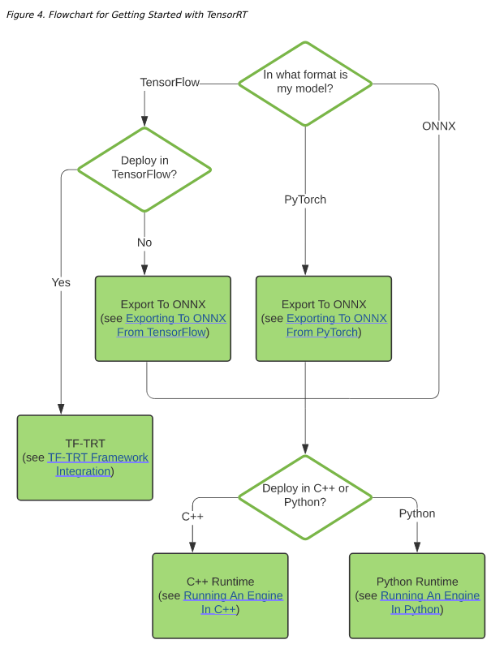

这里放一张网络上找到的图

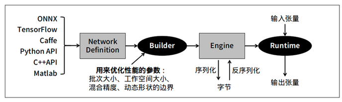

TensorRT 提供 **Caffe、uff 与 ONNX** 三种[解析器](http://www.elecfans.com/tags/解析器/)，其中 Caffe 框架已淡出市场、uff 仅支持 [TensorFlow](http://www.elecfans.com/tags/tensorflow/) 框架，其他的模型就需要透过 ONNX 交换格式进行转换。

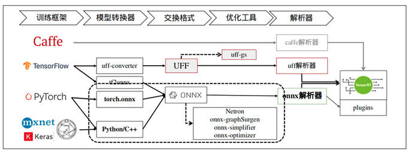

# 4 使用ONNX部署示例

ONNX转换通常是将ONNX模型自动转换为TensorRT引擎的最有效的方式。在本节中，我们将在部署预训练的ONNX模型的背景下，通过TensorRT转换的五个基本步骤。

对于这个例子，我们将使用ONNX格式从ONNX模型动物园转换一个预训练的ResNet-50模型;这是一种框架无关的模型格式，可以从大多数主流框架导出，包括TensorFlow和PyTorch。有关ONNX格式的更多信息，请参见此处。[here](https://github.com/onnx/onnx/blob/main/docs/IR.md) 。步骤的细节[here](https://github.com/NVIDIA/TensorRT/tree/main/quickstart/IntroNotebooks/0. Running This Guide.ipynb)

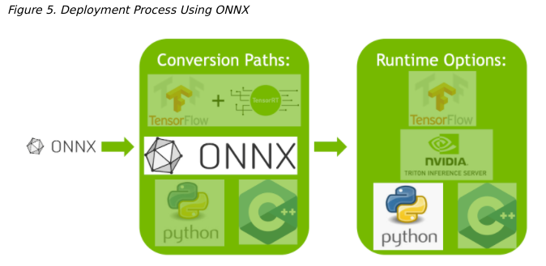

## 4.1 导出模型

TensorRT转换的两种主要自动路径需要不同的模型格式才能成功转换模型

* TF-TRT使用TensorFlow SavedModels。
* ONNX路径要求模型保存在ONNX中。

在这个例子中，我们使用的是ONNX，所以我们需要一个ONNX模型。我们将使用ResNet-50;一个基本的主干视觉模型，可以用于各种目的。我们将使用预训练的ResNet-50 ONNX模型进行分类，该模型包含在ONNX模型动物园中[ONNX model zoo](https://github.com/onnx/models)。

使用wget从ONNX模型动物园下载一个预训练的ResNet-50模型并解压缩它。

```shell
wget https://s3.amazonaws.com/download.onnx/models/opset_8/resnet50.tar.gz
tar xzf resnet50.tar.gz
```

解压一个ResNet-50的.onnx文件到resnet50/model.onnx

在从TensorFlow导出到ONNX或从PyTorch导出到ONNX中，你可以看到我们如何导出ONNX模型，这些模型将使用相同的部署工作流。

 [Exporting to ONNX from TensorFlow](https://docs.nvidia.com/deeplearning/tensorrt/quick-start-guide/index.html#export-from-tf)     

 [Exporting to ONNX from PyTorch](https://docs.nvidia.com/deeplearning/tensorrt/quick-start-guide/index.html#export-from-pytorch)

## 4.2 选择Batch Size 

批处理大小对TensorRT对我们的模型执行的优化有很大的影响。一般来说，在推断时，当我们优先考虑延迟，我们选择较小的批大小，而当我们要对吞吐量进行优先级排序时，我们选择较大的批大小。批量越大，处理时间越长，但减少了每个样品花费的平均时间。

如果您直到运行时才知道需要多大的批处理大小，TensorRT能够动态地处理批处理大小。也就是说，固定的批量尺寸使Tensorrt可以进行额外的优化。对于此示例工作流程，我们使用固定批次大小为64。有关处理动态输入大小的更多信息，请参见“[dynamic shapes](https://docs.nvidia.com/deeplearning/tensorrt/developer-guide/index.html#work_dynamic_shapes).” NVIDIA TENSORRT开发人员指南部分。

在原始导出ONNX过程中，我们将设置批大小。例子model.onnx，文件已将其批处理大小设置为64。

```shell
BATCH_SIZE=64
```

batch的细节[Batching](https://docs.nvidia.com/deeplearning/tensorrt/developer-guide/index.html#batching)

## 4.3. 选择一个精度

推理对数值精度的要求通常低于训练。稍微注意一下，较低的精度可以提供更快的计算速度和较低的内存消耗，而不会牺牲任何有意义的精度。TensorRT支持TF32、FP32、FP16和INT8精度。关于精度的更多信息，请参考NVIDIA TensorRT开发者指南中的降低精度一节。[Reduced Precision](https://docs.nvidia.com/deeplearning/tensorrt/developer-guide/index.html#reduced-precision)

FP32是大多数框架的默认训练精度，所以我们将在这里使用FP32进行推断。

```shell
import numpy as np
PRECISION = np.float32
```

我们设置了TensorRT引擎在运行时应该使用的精度

## 4.4. 转换模型

ONNX转换是自动TensorRT转换中最通用和性能最好的路径之一。它适用于TensorFlow、PyTorch和许多其他框架。

有一些工具可以帮助你将模型从ONNX转换到TensorRT引擎。一种常见的方法是使用trtexec——TensorRT附带的一个命令行工具，它可以将ONNX模型转换为TensorRT引擎并分析它们。

我们可以像下面这样运行这个转换

```shell
trtexec --onnx=resnet50/model.onnx --saveEngine=resnet_engine.trt
```

这将将我们的resnet50/model.onnx转换为名为resnet_engine.trt的TensorRT engine。

```shell
--onnx= #onnx的路经
--saveEngine= #生成的路经
```

## 4.5. 部署模型

在我们成功创建了TensorRT引擎后，我们必须决定如何使用TensorRT运行它。

TensorRT运行时有两种类型:一种是具有c++和Python绑定的独立运行时，另一种是TensorFlow的本地集成。在本节中，我们将使用一个调用独立运行时的简化包装器(ONNXClassifierWrapper)。我们将生成一批随机化的虚拟数据，并使用ONNXClassifierWrapper对该批数据运行推断。[Understanding TensorRT Runtimes](https://github.com/NVIDIA/TensorRT/tree/main/quickstart/IntroNotebooks/5. Understanding TensorRT Runtimes.ipynb)

* 设置ONNXClassifierWrapper（上面设置的BATCH_SIZE为64）

  ```shell
  from onnx_helper import ONNXClassifierWrapper
  N_CLASSES = 1000 # Our ResNet-50 is trained on a 1000 class ImageNet task
  trt_model = ONNXClassifierWrapper("resnet_engine.trt", [BATCH_SIZE, N_CLASSES], target_dtype = PRECISION)
  ```

* 生成虚拟批处理。

  ```shell
  BATCH_SIZE=32
  dummy_input_batch = np.zeros((BATCH_SIZE, 224, 224, 3))
  ```

* 将一批数据馈送到我们的引擎中并获得我们的预测。

  ```shell
  predictions = trt_model.predict(dummy_input_batch)
  ```

  注意，在运行第一批之前，包装器不会加载和初始化引擎，因此该批处理通常需要一段时间。

有关Tensorrt API的更多信息[API Reference](https://docs.nvidia.com/deeplearning/tensorrt/api/index.html). 

# 5. TF-TRT框架集成

TF-TRT集成为开始使用TensorRT提供了一种简单而灵活的方式。TF-TRT是TensorRT的高级Python接口，直接与TensorFlow模型一起工作。它允许你将TensorFlow SavedModels转换为TensorRT优化模型，并使用高级API在Python中运行它们。

TF-TRT提供了一个转换路径和一个Python运行时，它允许你像运行其他TensorFlow模型一样运行一个优化的模型。这有很多优点，值得注意的是TF-TRT能够转换包含受支持和不受支持层混合的模型，而不需要创建自定义插件，通过分析模型并将子图传递给TensorRT，在可能的情况下独立转换为引擎。

从视觉上看，TF-TRT笔记本演示了如何通过TensorRT遵循这条路径

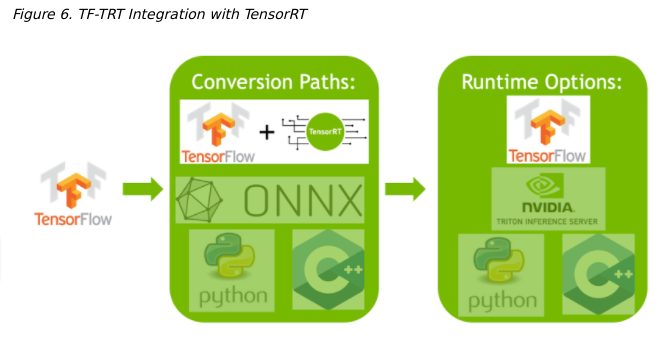

# 6 ONNX转换和部署

ONNX交换格式提供了一种从许多框架导出模型的方式，包括PyTorch, TensorFlow和TensorFlow  2，用于TensorRT运行时。使用ONNX导入模型需要ONNX支持模型中的操作符，而要提供TensorRT不支持的任何操作符的插件实现。(TensorRT的插件库可以在这里找到)。 [here](https://github.com/NVIDIA/TensorRT/tree/main/plugin)

## 6.1 用ONNX导出

ONNX模型可以使用ONNX项目的keras2onnx和tf2onnx工具从TensorFlow模型轻松生成。

[This notebook](https://github.com/NVIDIA/TensorRT/tree/main/quickstart/IntroNotebooks/3. Using Tensorflow 2 through ONNX.ipynb)显示了如何从keras/tf2  resnet-50型号中生成ONNX模型，如何使用Trtexec将这些ONNX型号转换为TensorRT engines，以及如何使用Python  Tensorrt运行时将一批数据送到Tensorrt Engine中。

### 6.1.1 从TensorFlow导出到ONNX

TensorFlow可以通过ONNX导出，并在我们的一个TensorRT运行时中运行。这里，我们提供了从TensorFlow导出ONNX模型所需的步骤。更多信息，请参考 [Using Tensorflow 2 through ONNX](https://github.com/NVIDIA/TensorRT/tree/main/quickstart/IntroNotebooks/3. Using Tensorflow 2 through ONNX.ipynb)。

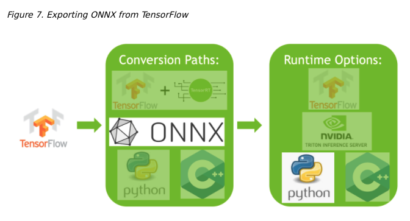

步骤：

1. 从keras.applications中导入ResNet-50模型。这将加载ResNet-50预训练权重的副本。

   ```shell
   from tensorflow.keras.applications import ResNet50
   
   model = ResNet50(weights='imagenet')
   ```

2. 将Resnet-50模型转换为ONNX格式。

   ```shell
   import tf2onnx
   
   model.save('my_model')
   !python -m tf2onnx.convert --saved-model my_model --output temp.onnx
   onnx_model = onnx.load_model('temp.onnx')
   ```

3. 在ONNX文件中设置一个显式批处理大小。

   默认情况下，TensorFlow不显式设置批处理大小。

   ```shell
   import onnx
   
   BATCH_SIZE = 64
   inputs = onnx_model.graph.input
   for input in inputs:
       dim1 = input.type.tensor_type.shape.dim[0]
       dim1.dim_value = BATCH_SIZE
   ```

4. 保存 ONNX文件

   ```shell
   model_name = "resnet50_onnx_model.onnx"
   onnx.save_model(onnx_model, model_name)
   ```

### 6.1.2 从PyTorch导出到ONNX

将PyTorch模型转换为TensorRT的一种方法是将一个PyTorch模型导出到ONNX，然后转换为TensorRT引擎。更多详细信息，请参见[Using PyTorch with TensorRT through ONNX](https://github.com/NVIDIA/TensorRT/tree/main/quickstart/IntroNotebooks/4. Using PyTorch through ONNX.ipynb)

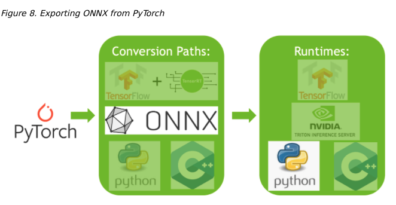

步骤：

1. 从torchvision导入ResNet-50模型。这将加载ResNet-50预训练权重的副本。

   ```shell
   import torchvision.models as models
   
   resnext50_32x4d = models.resnext50_32x4d(pretrained=True)
   ```

2. 从Pytorch保存ONNX文件。

   ```shell
   import torch
   
   BATCH_SIZE = 64
   dummy_input=torch.randn(BATCH_SIZE, 3, 224, 224)
   ```

3. 保存ONNX文件

   ```shell
   import torch.onnx
   torch.onnx.export(resnext50_32x4d, dummy_input, "resnet50_onnx_model.onnx", verbose=False)
   ```

## 6.2 转换ONNX到TensorRT Engine

有两种主要的方式将ONNX文件转换为TensorRT引擎

* 使用trtexec
* 使用Tensorrt API

在本指南中，我们将重点介绍如何使用trtexec。要使用trtexec将上述的ONNX模型之一转换为TensorRT引擎，我们可以如下运行该转换

```shell
trtexec --onnx=resnet50_onnx_model.onnx --saveEngine=resnet_engine.trt
```

这将转换我们resnet50_onnx_model.onnx模型到一个名为resnet_engine.trt的TensorRT引擎。

## 6.3. 将TensorRT引擎部署到Python运行时API

TensorRT有许多可用的运行时。当性能很重要时，TensorRT API是运行ONNX模型的好方法。在下一节中，我们将使用c++和Python中的TensorRT运行时API来部署一个更复杂的ONNX模型。

# 7 使用TensorRT运行时API

对于模型转换和部署来说，性能最好且可定制的选项之一是使用TensorRT API，它同时具有c++和Python绑定。

TensorRT包含一个独立的运行时，带有c++和Python绑定，通常比使用TF-TRT集成和运行在TensorFlow中更有性能和可定制性。c++ API的开销较低，但Python  API与Python数据加载器和库(如NumPy和SciPy)一起工作得很好，并且更容易用于原型设计、调试和测试。

下面的教程演示了使用TensorRT c++和Python API对图像进行语义分割。该任务使用了带有ResNet-101主干的完全卷积模型。该模型接受任意大小的图像，并产生逐像素的预测。

本教程包括以下步骤

* 安装程序启动测试容器，并从导出到ONNX的PyTorch模型生成TensorRT引擎，并使用trtexec进行转换
* c++运行时API使用engine进行推理和TensorRT的c++ API
* python运行时API使用engine进行推理和TensorRT的python API

## 7.1. 设置测试容器并构建TensorRT引擎

1. 从TensorRT开源软件资源库下载本快速入门教程的源代码。[TensorRT Open Source Software repository](http://github.com/NVIDIA/TensorRT).

   ```shell
   $ git clone https://github.com/NVIDIA/TensorRT.git
   $ cd TensorRT/quickstart
   ```

2. 将预训练的FCN-Resnet-101模型从Torch.hub转换为ONNX。

   在这里，我们使用教程中包含的导出脚本来生成ONNX模型，并将其保存到FCN-Resnet101.onnx。该脚本还生成了大小1282x1026的测试图像，并将其保存到Input.ppm。

   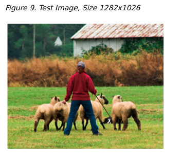

   * 启动NVIDIA PyTorch容器来运行导出脚本。

     ```shell
     $ docker run --rm -it --gpus all -p 8888:8888 -v `pwd`:/workspace -w /workspace/SemanticSegmentation nvcr.io/nvidia/pytorch:20.12-py3 bash
     ```

   * 运行导出脚本将预训练的模型转换为ONNX。

     ```shell
     $ python export.py
     ```

     注:FCN-ResNet-101有一个维度[batch, 3, height, width]的输入和一个维度[batch, 21,  height,  weight]的输出包含21个类标签预测对应的非标准化概率。当将模型导出到ONNX时，我们在输出处附加一个argmax层，以产生最高概率的逐像素类标签。

3. 使用trtexec工具从ONNX构建一个TensorRT引擎。

   trtexec可以从ONNX模型生成TensorRT引擎，然后使用TensorRT运行时API进行部署。它利用TensorRT  ONNX解析器将ONNX模型加载到TensorRT网络图中，并利用TensorRT Builder  API生成优化的引擎。构建引擎可能很耗时，而且通常是脱机执行的。

   ```shell
   trtexec --onnx=fcn-resnet101.onnx --fp16 --workspace=64 --minShapes=input:1x3x256x256 --optShapes=input:1x3x1026x1282 --maxShapes=input:1x3x1440x2560 --buildOnly --saveEngine=fcn-resnet101.engine
   ```

   成功执行应该会生成一个引擎文件，并在命令输出中看到类似于Successful的内容。

   trtexec可以构建TensorRT引擎与以下构建配置选项

   * `--fp16` 除了FP32外，还可以对支持它的图层启用FP16的精度。有关更多信息，请参阅《 NVIDIA Tensorrt开发人员指南》中的降低精度部分。[Reduced Precision](https://docs.nvidia.com/deeplearning/tensorrt/developer-guide/index.html#reduced-precision)
   * `--int8` 除了FP32外，还可以为支持它的层启用INT8精度。
   *  `--best` 实现所有支持的精确度，以实现每一层的最佳性能。
   * `--workspace`控制构建器考虑的算法可用的最大持久暂存内存(以MB为单位)。对于给定的平台，应该根据可用性设置尽可能高的值;在运行时，TensorRT将只分配需要的，不超过最大。
   * `--minShapes`和`--maxShapes`指定每个网络输入和的尺寸范围。`--optShapes`指定自动调优器应该用于优化的维度。[Optimization Profiles](https://docs.nvidia.com/deeplearning/tensorrt/developer-guide/index.html#opt_profiles)
   * `--buildOnly`要求跳过推理性能测量。
   * `--saveEngine`指定保存序列化引擎的文件
   * `--safe`启用构建安全认证的引擎。
   * `--tacticSources`可用于从默认策略源（Cudnn，Cublas和Cublaslt）中添加或删除策略。
   * `--minTiming`和`--avgTiming`分别设置策略选择中使用的最小迭代次数和平均数。
   * `--noBuilderCache`禁用Tensorrt构建器中的层正时缓存。正时缓存有助于通过缓存层分析信息来减少构建器阶段中所花费的时间，
   * `--timingCacheFile`可用于保存或加载序列化的全局正时缓存。

4. 可选地，使用trtexec验证随机值输入生成的引擎。

   ```shell
   trtexec --shapes=input:1x3x1026x1282 --loadEngine=fcn-resnet101.engine
   ```

   其中——shapes设置用于推断的动态形状输入的输入大小。

   如果成功，您应该看到类似以下内容

   ```shell
   &&&& PASSED TensorRT.trtexec # trtexec --shapes=input:1x3x1026x1282 --loadEngine=fcn-resnet101.engine
   ```

## 7.2 使用c++运行一个Engine

1. 在测试容器中编译并运行C ++分割教程。

   ```shell
   $ make
   $ ./bin/segmentation_tutorial
   ```

   以下步骤显示了如何使用推理计划

   步骤：

   1. 从Engine文件中反序列化TensorRT引擎。文件内容被读入缓冲区并在内存中反序列化。

      ```c++
      std::vector<char> engineData(fsize);
      engineFile.read(engineData.data(), fsize);
      
      util::UniquePtr<nvinfer1::IRuntime> runtime{nvinfer1::createInferRuntime(sample::gLogger.getTRTLogger())};
      
      util::UniquePtr<nvinfer1::ICudaEngine> mEngine(runtime->deserializeCudaEngine(engineData.data(), fsize, nullptr));
      ```

      注意:TensorRT对象是通过destroy()方法销毁的。在本教程中，一个带有自定义删除的智能指针用于管理它们的生存期。

      ```c++
      struct InferDeleter
      {
          template <typename T>
          void operator()(T* obj) const
          {
              if (obj) obj->destroy();
          }
      };
      template <typename T>
      using UniquePtr = std::unique_ptr<T, util::InferDeleter>;
      ```

   2. TensorRT执行上下文封装执行状态，比如用于在推断期间保存中间激活张量的持久设备内存。

      由于分割模型是在启用了动态形状的情况下构建的，因此必须指定输入的形状以进行推断执行。可以查询网络输出形状，以确定输出缓冲区的相应尺寸。

      ```c++
      auto input_idx = mEngine->getBindingIndex("input");
      assert(mEngine->getBindingDataType(input_idx) == nvinfer1::DataType::kFLOAT);
      auto input_dims = nvinfer1::Dims4{1, 3 /* channels */, height, width};
      context->setBindingDimensions(input_idx, input_dims);
      auto input_size = util::getMemorySize(input_dims, sizeof(float));
      auto output_idx = mEngine->getBindingIndex("output");
      assert(mEngine->getBindingDataType(output_idx) == nvinfer1::DataType::kINT32);
      auto output_dims = context->getBindingDimensions(output_idx);
      auto output_size = util::getMemorySize(output_dims, sizeof(int32_t));
      ```

      注意：网络I/O的绑定索引可以通过名称查询。

   3. 在为推理做准备时，为所有的输入和输出分配CUDA设备内存，处理图像数据并复制到输入内存中，生成一个引擎绑定列表。

      对于语义分割，将输入图像数据拟合到[0,1]范围内，使用均值[0.485,0.456,0.406]和标准差[0.229,0.224,0.225]进行归一化处理。参考这里的输入预处理要求的torchvision模型 [here](https://github.com/pytorch/vision/blob/main/docs/source/models.rst)。该操作由实用程序类RGBImageReader抽象。

      ```c++
      void* input_mem{nullptr};
      cudaMalloc(&input_mem, input_size);
      void* output_mem{nullptr};
      cudaMalloc(&output_mem, output_size); 
      const std::vector<float> mean{0.485f, 0.456f, 0.406f};
      const std::vector<float> stddev{0.229f, 0.224f, 0.225f};
      auto input_image{util::RGBImageReader(input_filename, input_dims, mean, stddev)};
      input_image.read();
      auto input_buffer = input_image.process();
      cudaMemcpyAsync(input_mem, input_buffer.get(), input_size, cudaMemcpyHostToDevice, stream);
      ```

   4. 使用上下文的executeV2或enqueueV2方法启动推理执行。执行完成后，我们将结果复制回主机缓冲区，并释放所有设备内存分配。

      ```c++
      void* bindings[] = {input_mem, output_mem};
      bool status = context->enqueueV2(bindings, stream, nullptr);
      auto output_buffer = std::unique_ptr<int>{new int[output_size]};
      cudaMemcpyAsync(output_buffer.get(), output_mem, output_size, cudaMemcpyDeviceToHost, stream);
      cudaStreamSynchronize(stream);
      
      cudaFree(input_mem);
      cudaFree(output_mem);
      ```

   5. 为了可视化结果，将逐像素类预测的伪颜色图写入output.ppm。这是由实用程序类ArgmaxImageWriter抽象的。

      ```c++
      const int num_classes{21};
      const std::vector<int> palette{
      	(0x1 << 25) - 1, (0x1 << 15) - 1, (0x1 << 21) - 1};
      auto output_image{util::ArgmaxImageWriter(output_filename, output_dims, palette, num_classes)};
      output_image.process(output_buffer.get());
      output_image.write();
      ```

      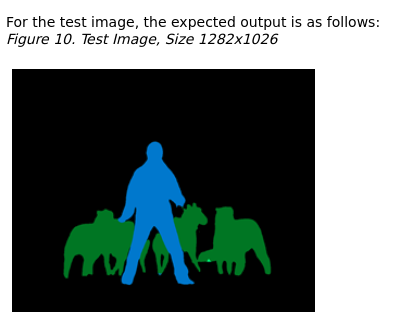

## 7.3 在Python中运行Engine

1. 安装所需的Python包。

   ```shell
   $ pip install pycuda
   ```

2. 启动Jupyter并使用浏览器*http://<host-ip-address>:8888*.

   ```shell
   $ jupyter notebook --port=8888 --no-browser --ip=0.0.0.0 --allow-root
   ```

3. 打开教程 -  runtime.ipynb笔记本，然后按照其步骤操作。

# TOPS:

## plan 文件

序列化格式的优化推理引擎。要初始化推理引擎，应用程序将首先从计划文件反序列化模型。典型的应用程序只构建一次引擎，然后将其序列化为计划文件以供以后使用。从下面三个例子可以看出来 .plan  .engine .trt文件都是序列化后的engine文件

```shell
trtexec --onnx=resnet50/model.onnx --saveEngine=resnet_engine.trt
trtexec --onnx=foo.onnx --profilingVerbosity=detailed --saveEngine=foo.plan
```

```shell
trtexec --onnx=fcn-resnet101.onnx --fp16 --workspace=64 --minShapes=input:1x3x256x256 --optShapes=input:1x3x1026x1282 --maxShapes=input:1x3x1440x2560 --buildOnly --saveEngine=fcn-resnet101.engine
trtexec --shapes=input:1x3x1026x1282 --loadEngine=fcn-resnet101.engine
```

```shell
trtexec --onnx=foo.onnx --profilingVerbosity=detailed --saveEngine=foo.plan
nsys profile -o foo_profile --capture-range cudaProfilerApi trtexec --loadEngine=foo.plan --warmUp=0 --duration=0 --iterations=50
```

--saveEngine指定序列化引擎保存到的文件。

--loadEngine=<file>从一个序列化的计划文件加载引擎，而不是从输入ONNX, UFF或Caffe模型构建它。

# 附录

参考网址：官方 [Quick Start Guide](https://docs.nvidia.com/deeplearning/tensorrt/quick-start-guide/index.html)

官方开发者文档 https://docs.nvidia.com/deeplearning/tensorrt/developer-guide/index.html

[*NVIDIA TensorRT 8.4 Developer Guide*.](https://docs.nvidia.com/deeplearning/tensorrt/developer-guide/index.html#perform_inference_c) 

博客参考 ：

* [TensorRT 实战教程](https://murphypei.github.io/blog/2019/09/trt-useage.html) 

* [TensorRT/三，如何使用tensorRT C%2B%2B API搭建网络](TensorRT/三，如何使用tensorRT C%2B%2B API搭建网络)
* [TensorRT——INT8推理](https://www.cnblogs.com/TaipKang/p/15542329.html) 这个博客代码有点小错误。需要修改下。
* 关于int8的git 资源
  * [搜索git上调用](https://github.com/search?l=C%2B%2B&o=desc&p=3&q=IInt8EntropyCalibrator2&s=indexed&type=Code) 
  * 实现1 https://github.com/Yu-Lingrui/Project-deployment-and-landing/blob/65030a5d830778ee73c5881fbf6c36ad45a6b876/tensorrtx/refinedet/calibrator.cpp
  * 