# 1 背景

本文档是记录学习Nvidia官方B站的[视频](https://www.bilibili.com/video/BV1jj411Z7wG?spm_id_from=333.788.videopod.sections&vd_source=cde2e7b9bca1a7048a13eaf0b48210b6)，参考对应的PDF文件 TensorRTTraining-TRT8.6.1-Part5-V1.1.pdf 的记录。对应的官方代码[[trt-samples-for-hackathon-cn]](https://github.com/NVIDIA/trt-samples-for-hackathon-cn)

官方的视频教程基于TensorRT8.6.1版本。但是官方代码没有对应的tag。只有8.4、8.5和截至目前最新的8.10（master分支）。因此我这里参考的都是8.4分支的代码。

* part1 TensorRT简介
* part2 开发辅助工具
* part3 插件书写
* part4 TensorRT高级用法
* part5 常见优化策略


# 2 TensorRT简介

## 2.1 TensorRT是什么

* 用于高效实现已训练好的深度学习模型的**推理过程**的SDK
* 内含**推理优化器**和**运行时环境**
* 使 DL 模型能以**更高吞吐量**和**更低的延迟**运行
* 有 C++ 和 python 的 API，完全等价可以混用

## 2.2 TensorRT 做的工作

* **构建期（推理优化器）**
  * 模型解析 / 建立 加载 Onnx 等其他格式的模型 / 使用原生 API 搭建模型
  * 计算图优化 横向层融合（Conv），纵向层融合（Conv+add+ReLU） [参考链接](https://developer.nvidia.com/blog/deploying-deep-learning-nvidia-tensorrt/)
  * 节点消除 去除无用层，节点变换（Pad，Slice，Concat，Shuffle）
  * 多精度支持 FP32 / FP16 / INT8 / TF32（代价是可能插入 reformat 节点，用于数据类型变换）
  * 优选 kernel / format 硬件有关优化。一个节点在GPU有多种实现，自动选择哪一种**最快**
  * 导入 plugin 实现自定义操作
  * 显存优化 显存池复用
* **运行期（运行时环境）**
  * 运行时环境 对象生命期管理，内存显存管理，异常处理
  * 序列化反序列化 推理引擎保存为文件或从文件中加载

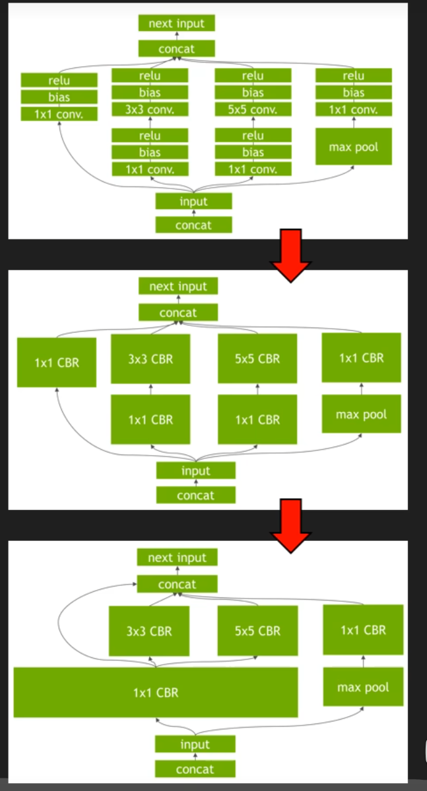

## 2.3 TensorRT 的表现

* 不同模型加速效果不同
* 选用高效算子提升运算效率（计算密集型）
* 算子融合减少访存数据、提高访问效率（算子融合）
* 使用低精度数据类型，节约时间空间

**注意高版本的TensorRT可能有更加好的优化策略。**

# 3 TensorRT 基本流程

范例代码 01-SimpleDemo/TensorRT8.5   main.py 或 main.cpp（python 和 C++ 等价版本）

## 3.1 基本流程

* 构建期
  * 前期准备（Logger，Builder，Config，Profile）
  * 创建 Network（计算图内容）
  * 生成序列化网络（计算图 TRT 内部表示）
* 运行期
  * 建立 Engine 和 Context
  * Buffer 相关准备（申请+拷贝）
  * 执行推理（Execute）
  * 善后工作


python代码

```python
#
# Copyright (c) 2021-2022, NVIDIA CORPORATION. All rights reserved.
#
# Licensed under the Apache License, Version 2.0 (the "License");
# you may not use this file except in compliance with the License.
# You may obtain a copy of the License at
#
#     http://www.apache.org/licenses/LICENSE-2.0
#
# Unless required by applicable law or agreed to in writing, software
# distributed under the License is distributed on an "AS IS" BASIS,
# WITHOUT WARRANTIES OR CONDITIONS OF ANY KIND, either express or implied.
# See the License for the specific language governing permissions and
# limitations under the License.
#

from cuda import cudart  # 使用 cuda runtime API
import numpy as np
import os
import tensorrt as trt

# yapf:disable

trtFile = "./model.plan"

def run():
    logger = trt.Logger(trt.Logger.ERROR)                                       # create Logger, avaiable level: VERBOSE, INFO, WARNING, ERRROR, INTERNAL_ERROR
    if os.path.isfile(trtFile):                                                 # load serialized network and skip building process if .plan file existed
        with open(trtFile, "rb") as f:
            engineString = f.read()
        if engineString == None:
            print("Failed getting serialized engine!")
            return
        print("Succeeded getting serialized engine!")
    else:                                                                       # build a serialized network from scratch
        builder = trt.Builder(logger)                                           # create Builder
        network = builder.create_network(1 << int(trt.NetworkDefinitionCreationFlag.EXPLICIT_BATCH))  # create Network
        profile = builder.create_optimization_profile()                         # create Optimization Profile if using Dynamic Shape mode
        config = builder.create_builder_config()                                # create BuidlerConfig to set meta data of the network
        config.set_memory_pool_limit(trt.MemoryPoolType.WORKSPACE, 1 << 30)     # set workspace for the optimization process (default value is the total GPU memory)

        inputTensor = network.add_input("inputT0", trt.float32, [-1, -1, -1])   # set inpute tensor for the network
        profile.set_shape(inputTensor.name, [1, 1, 1], [3, 4, 5], [6, 8, 10])   # set danamic range of the input tensor
        config.add_optimization_profile(profile)                                # add the Optimization Profile into the BuilderConfig

        identityLayer = network.add_identity(inputTensor)                       # here is only a identity transformation layer in our simple network, which the output is exactly equal to input
        identityLayer.get_output(0).name = 'outputT0'                           # set the name of the output tensor from the laer (not required)
        network.mark_output(identityLayer.get_output(0))                        # mark the output tensor of the network

        engineString = builder.build_serialized_network(network, config)        # create a serialized network
        if engineString == None:
            print("Failed building serialized engine!")
            return
        print("Succeeded building serialized engine!")
        with open(trtFile, "wb") as f:                                          # write the serialized netwok into a .plan file
            f.write(engineString)
            print("Succeeded saving .plan file!")
#上面的代码为构件期，下面的代码为运行期
    engine = trt.Runtime(logger).deserialize_cuda_engine(engineString)          # create inference Engine using Runtime
    if engine == None:
        print("Failed building engine!")
        return
    print("Succeeded building engine!")

    nIO = engine.num_io_tensors                                                 # since TensorRT 8.5, the concept of Binding is replaced by I/O Tensor, all the APIs with "binding" in their name are deprecated
    lTensorName = [engine.get_tensor_name(i) for i in range(nIO)]               # get a list of I/O tensor names of the engine, because all I/O tensor in Engine and Excution Context are indexed by name, not binding number like TensorRT 8.4 or before
    nInput = [engine.get_tensor_mode(lTensorName[i]) for i in range(nIO)].count(trt.TensorIOMode.INPUT)  # get the count of input tensor
    #nOutput = [engine.get_tensor_mode(lTensorName[i]) for i in range(nIO)].count(trt.TensorIOMode.OUTPUT)  # get the count of output tensor

    context = engine.create_execution_context()                                 # create Excution Context from the engine (analogy to a GPU context, or a CPU process)
    context.set_input_shape(lTensorName[0], [3, 4, 5])                          # set actual size of input tensor if using Dynamic Shape mode
    for i in range(nIO):
        print("[%2d]%s->" % (i, "Input " if i < nInput else "Output"), engine.get_tensor_dtype(lTensorName[i]), engine.get_tensor_shape(lTensorName[i]), context.get_tensor_shape(lTensorName[i]), lTensorName[i])

    bufferH = []                                                                # prepare the memory buffer on host and device
    for i in range(nIO):
        bufferH.append(np.empty(context.get_tensor_shape(lTensorName[i]), dtype=trt.nptype(engine.get_tensor_dtype(lTensorName[i]))))
    bufferD = []
    for i in range(nIO):
        bufferD.append(cudart.cudaMalloc(bufferH[i].nbytes)[1])

    data = np.ascontiguousarray(np.arange(3 * 4 * 5, dtype=np.float32).reshape(3, 4, 5))  # feed input data into host buffer
    bufferH[0] = data

    for i in range(nInput):                                                     # copy input data from host buffer into device buffer
        cudart.cudaMemcpy(bufferD[i], bufferH[i].ctypes.data, bufferH[i].nbytes, cudart.cudaMemcpyKind.cudaMemcpyHostToDevice)

    for i in range(nIO):
        context.set_tensor_address(lTensorName[i], int(bufferD[i]))             # set address of all input and output data in device buffer

    context.execute_async_v3(0)                                                 # do inference computation

    for i in range(nInput, nIO):                                                # copy output data from device buffer into host buffer
        cudart.cudaMemcpy(bufferH[i].ctypes.data, bufferD[i], bufferH[i].nbytes, cudart.cudaMemcpyKind.cudaMemcpyDeviceToHost)

    for i in range(nIO):
        print(lTensorName[i])
        print(bufferH[i])

    for b in bufferD:                                                           # free the GPU memory buffer after all work
        cudart.cudaFree(b)

if __name__ == "__main__":
    os.system("rm -rf ./*.plan")
    run()                                                                       # create a serialized network of TensorRT and do inference
    run()                                                                       # load a serialized network of TensorRT and do inference

```

c++代码

```c++
/*
 * Copyright (c) 2021-2022, NVIDIA CORPORATION. All rights reserved.

 *
 * Licensed under the Apache License, Version 2.0 (the "License");
 * you may not use this file except in compliance with the License.
 * You may obtain a copy of the License at
 *
 *     http://www.apache.org/licenses/LICENSE-2.0
 *
 * Unless required by applicable law or agreed to in writing, software
 * distributed under the License is distributed on an "AS IS" BASIS,
 * WITHOUT WARRANTIES OR CONDITIONS OF ANY KIND, either express or implied.
 * See the License for the specific language governing permissions and
 * limitations under the License.
 */

#include "cookbookHelper.hpp"

using namespace nvinfer1;

const std::string trtFile {"./model.plan"};
static Logger     gLogger(ILogger::Severity::kERROR);

void run()
{
    ICudaEngine *engine = nullptr;

    if (access(trtFile.c_str(), F_OK) == 0)
    {
        std::ifstream engineFile(trtFile, std::ios::binary);
        long int      fsize = 0;

        engineFile.seekg(0, engineFile.end);
        fsize = engineFile.tellg();
        engineFile.seekg(0, engineFile.beg);
        std::vector<char> engineString(fsize);
        engineFile.read(engineString.data(), fsize);
        if (engineString.size() == 0)
        {
            std::cout << "Failed getting serialized engine!" << std::endl;
            return;
        }
        std::cout << "Succeeded getting serialized engine!" << std::endl;

        IRuntime *runtime {createInferRuntime(gLogger)};
        engine = runtime->deserializeCudaEngine(engineString.data(), fsize);
        if (engine == nullptr)
        {
            std::cout << "Failed loading engine!" << std::endl;
            return;
        }
        std::cout << "Succeeded loading engine!" << std::endl;
    }
    else
    {
        IBuilder *            builder = createInferBuilder(gLogger);
        INetworkDefinition *  network = builder->createNetworkV2(1U << int(NetworkDefinitionCreationFlag::kEXPLICIT_BATCH));
        IOptimizationProfile *profile = builder->createOptimizationProfile();
        IBuilderConfig *      config  = builder->createBuilderConfig();
        config->setMemoryPoolLimit(MemoryPoolType::kWORKSPACE, 1 << 30);

        ITensor *inputTensor = network->addInput("inputT0", DataType::kFLOAT, Dims32 {3, {-1, -1, -1}});
        profile->setDimensions(inputTensor->getName(), OptProfileSelector::kMIN, Dims32 {3, {1, 1, 1}});
        profile->setDimensions(inputTensor->getName(), OptProfileSelector::kOPT, Dims32 {3, {3, 4, 5}});
        profile->setDimensions(inputTensor->getName(), OptProfileSelector::kMAX, Dims32 {3, {6, 8, 10}});
        config->addOptimizationProfile(profile);

        IIdentityLayer *identityLayer = network->addIdentity(*inputTensor);
        network->markOutput(*identityLayer->getOutput(0));
        IHostMemory *engineString = builder->buildSerializedNetwork(*network, *config);
        if (engineString == nullptr || engineString->size() == 0)
        {
            std::cout << "Failed building serialized engine!" << std::endl;
            return;
        }
        std::cout << "Succeeded building serialized engine!" << std::endl;

        IRuntime *runtime {createInferRuntime(gLogger)};
        engine = runtime->deserializeCudaEngine(engineString->data(), engineString->size());
        if (engine == nullptr)
        {
            std::cout << "Failed building engine!" << std::endl;
            return;
        }
        std::cout << "Succeeded building engine!" << std::endl;

        std::ofstream engineFile(trtFile, std::ios::binary);
        if (!engineFile)
        {
            std::cout << "Failed opening file to write" << std::endl;
            return;
        }
        engineFile.write(static_cast<char *>(engineString->data()), engineString->size());
        if (engineFile.fail())
        {
            std::cout << "Failed saving .plan file!" << std::endl;
            return;
        }
        std::cout << "Succeeded saving .plan file!" << std::endl;
    }

    int                      nIO     = engine->getNbIOTensors();
    int                      nInput  = 0;
    int                      nOutput = 0;
    std::vector<std::string> vTensorName(nIO);
    for (int i = 0; i < nIO; ++i)
    {
        vTensorName[i] = std::string(engine->getIOTensorName(i));
        nInput += int(engine->getTensorIOMode(vTensorName[i].c_str()) == TensorIOMode::kINPUT);
        nOutput += int(engine->getTensorIOMode(vTensorName[i].c_str()) == TensorIOMode::kOUTPUT);
    }

    IExecutionContext *context = engine->createExecutionContext();
    context->setInputShape(vTensorName[0].c_str(), Dims32 {3, {3, 4, 5}});

    for (int i = 0; i < nIO; ++i)
    {
        std::cout << std::string(i < nInput ? "Input [" : "Output[");
        std::cout << i << std::string("]-> ");
        std::cout << dataTypeToString(engine->getTensorDataType(vTensorName[i].c_str())) << std::string(" ");
        std::cout << shapeToString(engine->getTensorShape(vTensorName[i].c_str())) << std::string(" ");
        std::cout << shapeToString(context->getTensorShape(vTensorName[i].c_str())) << std::string(" ");
        std::cout << vTensorName[i] << std::endl;
    }

    std::vector<int> vTensorSize(nIO, 0);
    for (int i = 0; i < nIO; ++i)
    {
        Dims32 dim  = context->getTensorShape(vTensorName[i].c_str());
        int    size = 1;
        for (int j = 0; j < dim.nbDims; ++j)
        {
            size *= dim.d[j];
        }
        vTensorSize[i] = size * dataTypeToSize(engine->getTensorDataType(vTensorName[i].c_str()));
    }

    std::vector<void *>
        vBufferH {nIO, nullptr};
    std::vector<void *> vBufferD {nIO, nullptr};
    for (int i = 0; i < nIO; ++i)
    {
        vBufferH[i] = (void *)new char[vTensorSize[i]];
        CHECK(cudaMalloc(&vBufferD[i], vTensorSize[i]));
    }

    float *pData = (float *)vBufferH[0];

    for (int i = 0; i < vTensorSize[0] / dataTypeToSize(engine->getTensorDataType(vTensorName[0].c_str())); ++i)
    {
        pData[i] = float(i);
    }
    for (int i = 0; i < nInput; ++i)
    {
        CHECK(cudaMemcpy(vBufferD[i], vBufferH[i], vTensorSize[i], cudaMemcpyHostToDevice));
    }

    for (int i = 0; i < nIO; ++i)
    {
        context->setTensorAddress(vTensorName[i].c_str(), vBufferD[i]);
    }

    context->enqueueV3(0);

    for (int i = nInput; i < nIO; ++i)
    {
        CHECK(cudaMemcpy(vBufferH[i], vBufferD[i], vTensorSize[i], cudaMemcpyDeviceToHost));
    }

    for (int i = 0; i < nIO; ++i)
    {
        printArrayInfomation((float *)vBufferH[i], context->getTensorShape(vTensorName[i].c_str()), vTensorName[i], true);
    }

    for (int i = 0; i < nIO; ++i)
    {
        delete[] vBufferH[i];
        CHECK(cudaFree(vBufferD[i]));
    }
    return;
}

int main()
{
    CHECK(cudaSetDevice(0));
    run();
    run();
    return 0;
}

```

## 3.2 Workflow

如何将我们训练好的模型使用TensorRT运行，有三种方式

* 使用框架自带 TRT 接口（TF-TRT，Torch-TensorRT），部署在原框架中，不支持的算子返回到原框架中计算，不需要写plugin
* 使用 Parser（TF/Torch/… → ONNX → TensorRT），**目前我主要使用这一种方式来做**，也是一个主流的方案，**推荐使用**
* 使用 TensorRT 原生 API 搭建网络

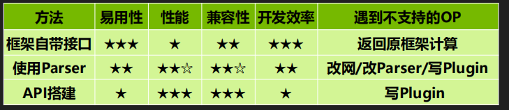

## 3.3 Workflow：使用 TensorRT API 搭建

* 怎样从头开始写一个网络？
* 哪些代码是 API 搭建特有的，哪些是所有 Workflow 通用的？
* 怎么让一个 Network 跑起来？
* 用于推理计算的输入输出内存显存怎么准备？
* 构建引擎需要时间，怎么构建一次，反复使用？
* TensorRT 的开发环境？

**使用 API 完整搭建一个 MNIST 手写识别模型的示例**

范例代码 cookbook\03-APIModel\MNISTExample-pyTorch

基本流程：

* TensorFlow / pyTorch 中创建并训练一个网络
* 提取网络权重，保存为 para.npz
* **TensorRT 中逐层重建该网络并加载 para.npz 中的权重**
* 生成推理引擎
* 用引擎做实际推理


* 构建阶段
  * 建立 Logger（日志记录器）
  * 建立 Builder（网络元数据）和BuilderConfig（网络元数据的选项）
  * 创建 Network（计算图内容）
  * 生成 SerializedNetwork（网络的 TRT 内部表示，生成序列化的engine文件保存或者生成可执行的推理engine）
* 运行阶段
  * 建立 Engine（理解为可执行代码）
  * 创建 Context（GPU 进程）
  * Buffer 准备（Host 端 + Device 端）
  * Buffer 拷贝 Host to Device
  * 执行推理（Execute）
  * Buffer 拷贝 Device to Host
  * 善后工作

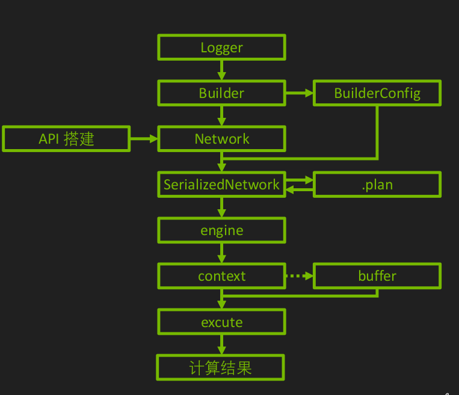

## 3.4 Logger **日志记录器**

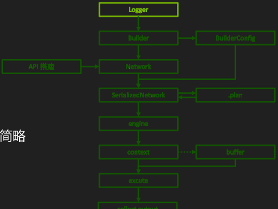

多个builder可以共享一个logger

`logger = trt.Logger(trt.Logger.VERBOSE)`

可选参数：VERBOSE, INFO, WARNING, ERROR, INTERNAL_ERROR，产生不同等级的日志，由详细到简略

参考代码cookbook\02-API\Logger

## 3.5 Builder 引擎构建器

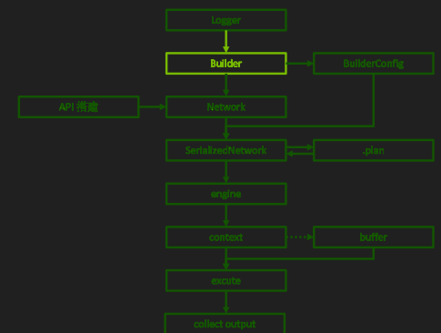

`builder = trt.Builder(logger)`

* **常用API**

  * `builder.create_network(…)` 创建 TensorRT 网络对象
  * `builder.create_optimization_profile()` 创建用于 Dyanmic Shape 输入的配置器

  更多细节见 02-API/Builder

## 3.6 BuilderConfig **网络属性选项**

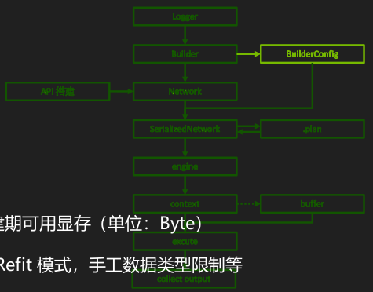

* BuilderConfig **网络属性选项**

`config = builder.create_builder_config()`

* 常用成员：
  * config. config.set_memory_pool_limit(trt.MemoryPoolType.WORKSPACE, 1 << 30) 指定构建期可用显存（单位：Byte）
  * config.flag = … 设置标志位开关，如启闭 FP16/INT8 模式，Refit 模式，手工数据类型限制等
  * config.int8_calibrator = … 指定 INT8-PTQ 的校正器
  * config.add_optimization_profile(…) 添加用于 Dynamic Shape 输入的配置器
  * config.set_tactic_sources/set_timing_cache/set_preview_feature/ … 更多高级用法（见教程第四部分）

更多细节见 02-API/BuilderConfig

## 3.7 Network **网络具体构造**

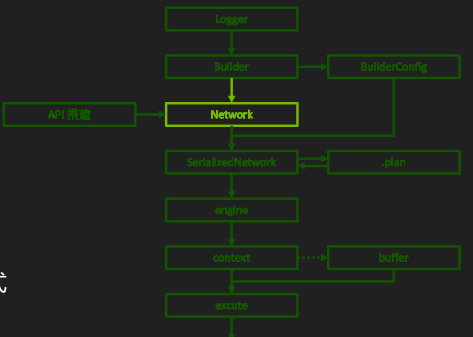

Network **网络具体构造**

`network = builder.create_network()`

**在使用API搭建网络时需要add来添加网络层，如果使用parser导入解析后网络就完成了。**

* 常用参数：
  * 1 << int(tensorrt.NetworkDefinitionCreationFlag.EXPLICIT_BATCH)，使用 Explicit Batch 模式

* （使用API搭建 ）常用方法：

  * network.add_input( 'oneTensor' ,trt.float32, (3,4,5)) 标记网络输入张量

  * convLayer = network.add_convolution_nd(XXX) 添加各种网络层

  * network.mark_output(convLayer.get_output(0)) 标记网络输出张量

* 常用获取网络信息的成员：
  * network.name / network.num_layers / network.num_inputs / network.num_outputs
  * network.has_implicit_batch_dimension / network.has_explicit_precision

其他细节见 02-API/Network

### 3.7.1 Explicit Batch 模式 v.s. Implicit Batch 模式

* **Explicit Batch 为 TensorRT 主流 Network 构建方法**，Implicit Batch 模式（builder.create_network(0)）仅用作后向兼容
* Implicit Batch 模式：所有张量的batch维度不显式的包含在张量形状中，在运行时指定。
* **Explicit Batch所有张量显式包含 Batch 维度、比 Implicit Batch 模式多一维**
* 需要使用 builder.create_network(1 << int(tensorrt.NetworkDefinitionCreationFlag.EXPLICIT_BATCH))
* Explicit Batch 模式能做、Implicit Batch 模式不能做的事情：
  * Batch Normalization（视频教程的录音中说成了 Layer Normalization）
  * Reshape/Transpose/Reduce over batch dimension
  * Dynamic shape 模式
  * Loop 结构
  * 一些 Layer 的高级用法（如 ShufleLayer.set_input） 

* **从 Onnx 导入的模型也默认使用 Explicit Batch 模式**

范例代码仅在 01-SimpleDemo 中 TensorRT6 和 TensorRT7 中保留了 Implicit Batch 的例子

## 3.8 Dynamic Shape 模式

* 适用于输入张量形状在推理时才决定网络
* 除了 Batch 维，其他维度也可以推理时才决定
* 需要 Explicit Batch 模式
* 需要 Optimazation Profile 帮助网络优化
* 需用 context.set_input_shape 绑定实际输入数据形状

Profile **指定输入张量大小范围**

`profile = builder.create_optimization_profile()`

* 常用方法：
  * profile.set_shape(tensorName, minShape, commonShape, maxShape) 给定输入张量的最小、最常见、最大尺寸
  * config.add_optimization_profile(profile) 将设置的 profile 传递给 config 以创建网络


涉及到两个部分的代码

完整的python和c++代码参考下面 [3.11 使用API搭建的示例](#3.11 使用API搭建的示例)

* 构建网络阶段 也就是上面提到的 Optimazation Profile 帮助网络优化

  ```python
          builder = trt.Builder(logger)                                           # 网络元信息，Builder/Network/BuilderConfig/Profile 相关
          network = builder.create_network(1 << int(trt.NetworkDefinitionCreationFlag.EXPLICIT_BATCH))
          profile = builder.create_optimization_profile()
          config = builder.create_builder_config()
          config.set_memory_pool_limit(trt.MemoryPoolType.WORKSPACE, 1 << 30)     # 设置空间给 TensoRT 尝试优化，单位 Byte
  
          inputTensor = network.add_input("inputT0", trt.float32, [-1, -1, -1])   # 指定输入张量
          profile.set_shape(inputTensor.name, [1, 1, 1], [3, 4, 5], [6, 8, 10])   # 指定输入张量 Dynamic Shape 范围
          config.add_optimization_profile(profile)
  
          identityLayer = network.add_identity(inputTensor)                       # 恒等变换
          identityLayer.get_output(0).name = 'outputT0'
          network.mark_output(identityLayer.get_output(0))                        # 标记输出张量
  
          engineString = builder.build_serialized_network(network, config)        # 生成序列化网络
          if engineString == None:
              print("Failed building serialized engine!")
              return
          print("Succeeded building serialized engine!")
          with open(trtFile, "wb") as f:                                          # 将序列化网络保存为 .plan 文件
              f.write(engineString)
              print("Succeeded saving .plan file!")
  ```

  

* 运行网络阶段 也就是上面提到的 context.set_input_shape 绑定实际输入数据形状

  ```python
      engine = trt.Runtime(logger).deserialize_cuda_engine(engineString)          # 使用 Runtime 来创建 engine
      if engine == None:
          print("Failed building engine!")
          return
      print("Succeeded building engine!")
  
      context = engine.create_execution_context()                                 # 创建 context（相当于 GPU 进程）
      context.set_binding_shape(0, [3, 4, 5])                                     # Dynamic Shape 模式需要绑定真实数据形状
      nInput = np.sum([engine.binding_is_input(i) for i in range(engine.num_bindings)])  # 获取 engine 绑定信息
      nOutput = engine.num_bindings - nInput
      for i in range(nInput):
          print("Bind[%2d]:i[%2d]->" % (i, i), engine.get_binding_dtype(i), engine.get_binding_shape(i), context.get_binding_shape(i), engine.get_binding_name(i))
      for i in range(nInput, nInput + nOutput):
          print("Bind[%2d]:o[%2d]->" % (i, i - nInput), engine.get_binding_dtype(i), engine.get_binding_shape(i), context.get_binding_shape(i), engine.get_binding_name(i))
  
      data = np.arange(3 * 4 * 5, dtype=np.float32).reshape(3, 4, 5)              # 准备数据和 Host/Device 端内存
      bufferH = []
      bufferH.append(np.ascontiguousarray(data))
      for i in range(nInput, nInput + nOutput):
          bufferH.append(np.empty(context.get_binding_shape(i), dtype=trt.nptype(engine.get_binding_dtype(i))))
      bufferD = []
      for i in range(nInput + nOutput):
          bufferD.append(cudart.cudaMalloc(bufferH[i].nbytes)[1])
  
      for i in range(nInput):                                                     # 首先将 Host 数据拷贝到 Device 端
          cudart.cudaMemcpy(bufferD[i], bufferH[i].ctypes.data, bufferH[i].nbytes, cudart.cudaMemcpyKind.cudaMemcpyHostToDevice)
  
      context.execute_v2(bufferD)                                                 # 运行推理计算
  ```

## 3.9 Layer 和 Tensor（使用API搭建 ）

注意区别 Layer 和 Tensor

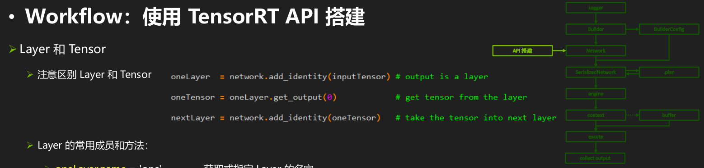

Layer 的常用成员和方法：

* oneLayer.name = 'one' 获取或指定 Layer 的名字
* oneLayer.type 获取该层的种类
* oneLayer.precision 指定改层计算精度（需配合 builder.strict_type_constraints）
* oneLayer.get_output(i) 获取该层第 i 个输出张量

**常见 Layer 的使用范例**

范例代码 02-API/Layer/*/*.md，41 种 Layer 示例 各 Layer 目录中示例代码可以直接运行

遇到 TensorRT 不原生支持的节点 自己实现 Plugin（见教程第三部分讲）

Tensor 的常用成员和方法：

* oneTensor.name = 'one' 获取或指定 tensor 的名字
* oneTensor.shape 获取 tensor 的形状，可用于 print 检查或作为后续层的参数
* oneTensor.dtype 获取或设定 tensor 的数据类型（可用于配合 identity 层实现数据类型转换）

更多细节见 02-API/Tensor 和 02-API/Layer  这里面有非常多的层，因为我没用过API搭建网络，因此不熟，这里给出一个里面的例子

```python
import numpy as np
from cuda import cudart
import tensorrt as trt

nB, nC, nH, nW = 1, 4, 8, 8  # nC % 4 ==0，全部值得到保存
#nB, nC, nH, nW = 1, 3, 8, 8  # nC % 4 !=0，会丢值
data = (np.arange(1, 1 + nB * nC * nH * nW, dtype=np.float32) / np.prod(nB * nC * nH * nW) * 128).astype(np.float32).reshape(nB, nC, nH, nW)

np.set_printoptions(precision=3, edgeitems=8, linewidth=300, suppress=True)
cudart.cudaDeviceSynchronize()

logger = trt.Logger(trt.Logger.ERROR)
builder = trt.Builder(logger)
network = builder.create_network(1 << int(trt.NetworkDefinitionCreationFlag.EXPLICIT_BATCH))
profile = builder.create_optimization_profile()
config = builder.create_builder_config()
config.set_flag(trt.BuilderFlag.INT8)
inputT0 = network.add_input("inputT0", trt.float32, (-1, nC, nH, nW))
profile.set_shape(inputT0.name, [1, nC, nH, nW], [nB, nC, nH, nW], [nB * 2, nC, nH, nW])
config.add_optimization_profile(profile)

layer = network.add_identity(inputT0)
layer.name = "Identity Layer"
layer.precision = trt.int8
layer.reset_precision()
layer.precision = trt.int8
layer.get_output(0).dtype = trt.int8
layer.set_output_type(0, trt.int8)
layer.reset_output_type(0)
layer.set_output_type(0, trt.int8)
layer.get_output(0).allowed_formats = 1 << int(trt.TensorFormat.CHW4)
layer.get_output(0).dynamic_range = [-128, 128]

network.mark_output(layer.get_output(0))

engineString = builder.build_serialized_network(network, config)

print("layer.name = %s" % layer.name)
print("layer.type = %s" % layer.type)
print("layer.__sizeof__() = %s" % layer.__sizeof__())
print("layer.__str__ = %s" % layer.__str__())
print("layer.num_inputs = %d" % layer.num_inputs)
for i in range(layer.num_inputs):
    print("\tlayer.get_input(%d) = %s" % (i, layer.get_input(i)))
print("layer.num_outputs = %d" % layer.num_outputs)
for i in range(layer.num_outputs):
    print("\tlayer.get_output(%d) = %s" % (i, layer.get_output(i)))
    print("\tlayer.get_output_type(%d) = %s" % (i, layer.get_output_type(i)))
    print("\tlayer.output_type_is_set(%d) = %s" % (i, layer.output_type_is_set(i)))
print("layer.precision = %s" % layer.precision)
print("layer.precision_is_set = %s" % layer.precision_is_set)
```

## 3.10 从Network中打印所有层和张量的信息

范例代码：07-Tool/NetworkPrinter

* 外层循环遍历所有 Layer
* 内层循环遍历该 Layer 的的所有 input/output

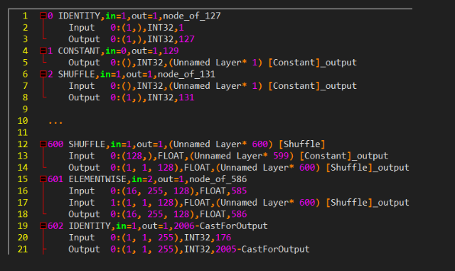

python代码

```python
for i in range(network.num_layers):
    layer = network.get_layer(i)
    print("%4d->%s,in=%d,out=%d,%s" % (i, str(layer.type)[10:], layer.num_inputs, layer.num_outputs, layer.name))
    for j in range(layer.num_inputs):
        tensor = layer.get_input(j)
        if tensor == None:
            print("\tInput  %2d:" % j, "None")
        else:
            print("\tInput  %2d:%s,%s,%s" % (j, tensor.shape, str(tensor.dtype)[9:], tensor.name))
    for j in range(layer.num_outputs):
        tensor = layer.get_output(j)
        if tensor == None:
            print("\tOutput %2d:" % j, "None")
        else:
            print("\tOutput %2d:%s,%s,%s" % (j, tensor.shape, str(tensor.dtype)[9:], tensor.name))
```

c++代码

```c++
for (int i = 0; i < network->getNbLayers(); ++i)
    {
        ILayer *layer = network->getLayer(i);
        std::cout << std::setw(4) << i << std::string("->") << layerTypeToString(layer->getType()) << std::string(",in=") << layer->getNbInputs() << std::string(",out=") << layer->getNbOutputs() << std::string(",") << std::string(layer->getName()) << std::endl;
        for (int j = 0; j < layer->getNbInputs(); ++j)
        {
            ITensor *tensor = layer->getInput(j);
            std::cout << std::string("\tInput  ") << std::setw(2) << j << std::string(":") << shapeToString(tensor->getDimensions()) << std::string(",") << dataTypeToString(tensor->getType()) << std::string(",") << std ::string(tensor->getName()) << std::endl;
        }
        for (int j = 0; j < layer->getNbOutputs(); ++j)
        {
            ITensor *tensor = layer->getOutput(j);
            std::cout << std::string("\tOutput ") << std::setw(2) << j << std::string(":") << shapeToString(tensor->getDimensions()) << std::string(",") << dataTypeToString(tensor->getType()) << std::string(",") << std ::string(tensor->getName()) << std::endl;
        }
    }
```


## 3.11 使用API搭建的示例

```python
#
# Copyright (c) 2021-2023, NVIDIA CORPORATION. All rights reserved.
#
# Licensed under the Apache License, Version 2.0 (the "License");
# you may not use this file except in compliance with the License.
# You may obtain a copy of the License at
#
#     http://www.apache.org/licenses/LICENSE-2.0
#
# Unless required by applicable law or agreed to in writing, software
# distributed under the License is distributed on an "AS IS" BASIS,
# WITHOUT WARRANTIES OR CONDITIONS OF ANY KIND, either express or implied.
# See the License for the specific language governing permissions and
# limitations under the License.
#

import tensorrt as trt


class MyLogger(trt.ILogger):  # customerized Logger

    def __init__(self):
        trt.ILogger.__init__(self)

    def log(self, severity, msg):
        if severity <= self.min_severity:
            # int(trt.ILogger.Severity.VERBOSE) == 4
            # int(trt.ILogger.Severity.INFO) == 3
            # int(trt.ILogger.Severity.WARNING) == 2
            # int(trt.ILogger.Severity.ERROR) == 1
            # int(trt.ILogger.Severity.INTERNAL_ERROR) == 0
            print("My Logger[%s] %s" % (severity, msg))  # customerized log content

logger = MyLogger()  # default severity is VERBOSE

print("Build time --------------------------------------------------------------")
logger.min_severity = trt.ILogger.Severity.INFO  # use severity INFO in build time
builder = trt.Builder(logger)  # assign logger to Builder
network = builder.create_network(1 << int(trt.NetworkDefinitionCreationFlag.EXPLICIT_BATCH))
config = builder.create_builder_config()
inputTensor = network.add_input("inputT0", trt.float32, [3, 4, 5])
identityLayer = network.add_identity(inputTensor)
network.mark_output(identityLayer.get_output(0))
engineString = builder.build_serialized_network(network, config)

print("Run time ----------------------------------------------------------------")
logger.min_severity = trt.ILogger.Severity.VERBOSE  # change severity into VERBOSE in run time

engine = trt.Runtime(logger).deserialize_cuda_engine(engineString)  # assign logger to Runtime

```

python代码

```python
#
# Copyright (c) 2021-2022, NVIDIA CORPORATION. All rights reserved.
#
# Licensed under the Apache License, Version 2.0 (the "License");
# you may not use this file except in compliance with the License.
# You may obtain a copy of the License at
#
#     http://www.apache.org/licenses/LICENSE-2.0
#
# Unless required by applicable law or agreed to in writing, software
# distributed under the License is distributed on an "AS IS" BASIS,
# WITHOUT WARRANTIES OR CONDITIONS OF ANY KIND, either express or implied.
# See the License for the specific language governing permissions and
# limitations under the License.
#

from cuda import cudart  # 使用 cuda runtime API
import numpy as np
import os
import tensorrt as trt

# yapf:disable

trtFile = "./model.plan"

def run():
    logger = trt.Logger(trt.Logger.ERROR)                                       # 指定 Logger，可用等级：VERBOSE，INFO，WARNING，ERRROR，INTERNAL_ERROR
    if os.path.isfile(trtFile):                                                 # 如果有 .plan 文件则直接读取
        with open(trtFile, "rb") as f:
            engineString = f.read()
        if engineString == None:
            print("Failed getting serialized engine!")
            return
        print("Succeeded getting serialized engine!")
    else:                                                                       # 没有 .plan 文件，从头开始创建
        builder = trt.Builder(logger)                                           # 网络元信息，Builder/Network/BuilderConfig/Profile 相关
        network = builder.create_network(1 << int(trt.NetworkDefinitionCreationFlag.EXPLICIT_BATCH))
        profile = builder.create_optimization_profile()
        config = builder.create_builder_config()
        config.set_memory_pool_limit(trt.MemoryPoolType.WORKSPACE, 1 << 30)     # 设置空间给 TensoRT 尝试优化，单位 Byte

        inputTensor = network.add_input("inputT0", trt.float32, [-1, -1, -1])   # 指定输入张量
        profile.set_shape(inputTensor.name, [1, 1, 1], [3, 4, 5], [6, 8, 10])   # 指定输入张量 Dynamic Shape 范围
        config.add_optimization_profile(profile)

        identityLayer = network.add_identity(inputTensor)                       # 恒等变换
        identityLayer.get_output(0).name = 'outputT0'
        network.mark_output(identityLayer.get_output(0))                        # 标记输出张量

        engineString = builder.build_serialized_network(network, config)        # 生成序列化网络
        if engineString == None:
            print("Failed building serialized engine!")
            return
        print("Succeeded building serialized engine!")
        with open(trtFile, "wb") as f:                                          # 将序列化网络保存为 .plan 文件
            f.write(engineString)
            print("Succeeded saving .plan file!")

    engine = trt.Runtime(logger).deserialize_cuda_engine(engineString)          # 使用 Runtime 来创建 engine
    if engine == None:
        print("Failed building engine!")
        return
    print("Succeeded building engine!")

    context = engine.create_execution_context()                                 # 创建 context（相当于 GPU 进程）
    context.set_binding_shape(0, [3, 4, 5])                                     # Dynamic Shape 模式需要绑定真实数据形状
    nInput = np.sum([engine.binding_is_input(i) for i in range(engine.num_bindings)])  # 获取 engine 绑定信息
    nOutput = engine.num_bindings - nInput
    for i in range(nInput):
        print("Bind[%2d]:i[%2d]->" % (i, i), engine.get_binding_dtype(i), engine.get_binding_shape(i), context.get_binding_shape(i), engine.get_binding_name(i))
    for i in range(nInput, nInput + nOutput):
        print("Bind[%2d]:o[%2d]->" % (i, i - nInput), engine.get_binding_dtype(i), engine.get_binding_shape(i), context.get_binding_shape(i), engine.get_binding_name(i))

    data = np.arange(3 * 4 * 5, dtype=np.float32).reshape(3, 4, 5)              # 准备数据和 Host/Device 端内存
    bufferH = []
    bufferH.append(np.ascontiguousarray(data))
    for i in range(nInput, nInput + nOutput):
        bufferH.append(np.empty(context.get_binding_shape(i), dtype=trt.nptype(engine.get_binding_dtype(i))))
    bufferD = []
    for i in range(nInput + nOutput):
        bufferD.append(cudart.cudaMalloc(bufferH[i].nbytes)[1])

    for i in range(nInput):                                                     # 首先将 Host 数据拷贝到 Device 端
        cudart.cudaMemcpy(bufferD[i], bufferH[i].ctypes.data, bufferH[i].nbytes, cudart.cudaMemcpyKind.cudaMemcpyHostToDevice)

    context.execute_v2(bufferD)                                                 # 运行推理计算

    for i in range(nInput, nInput + nOutput):                                   # 将结果从 Device 端拷回 Host 端
        cudart.cudaMemcpy(bufferH[i].ctypes.data, bufferD[i], bufferH[i].nbytes, cudart.cudaMemcpyKind.cudaMemcpyDeviceToHost)

    for i in range(nInput + nOutput):
        print(engine.get_binding_name(i))
        print(bufferH[i])

    for b in bufferD:                                                           # 释放 Device 端内存
        cudart.cudaFree(b)

if __name__ == "__main__":
    os.system("rm -rf ./*.plan")
    run()                                                                       # 创建 TensorRT 引擎并推理
    run()                                                                       # 读取 TensorRT 引擎并推理

```


c++ 代码

```c++
// TensorRT 日志结构体
class Logger : public ILogger
{
public:
    Severity reportableSeverity;

    Logger(Severity severity = Severity::kINFO):
        reportableSeverity(severity) {}

    void log(Severity severity, const char *msg) noexcept override
    {
        if (severity > reportableSeverity)
        {
            return;
        }
        switch (severity)
        {
        case Severity::kINTERNAL_ERROR:
            std::cerr << "INTERNAL_ERROR: ";
            break;
        case Severity::kERROR:
            std::cerr << "ERROR: ";
            break;
        case Severity::kWARNING:
            std::cerr << "WARNING: ";
            break;
        case Severity::kINFO:
            std::cerr << "INFO: ";
            break;
        default:
            std::cerr << "VERBOSE: ";
            break;
        }
        std::cerr << msg << std::endl;
    }
};
```

```c++
/*
 * Copyright (c) 2021-2022, NVIDIA CORPORATION. All rights reserved.

 *
 * Licensed under the Apache License, Version 2.0 (the "License");
 * you may not use this file except in compliance with the License.
 * You may obtain a copy of the License at
 *
 *     http://www.apache.org/licenses/LICENSE-2.0
 *
 * Unless required by applicable law or agreed to in writing, software
 * distributed under the License is distributed on an "AS IS" BASIS,
 * WITHOUT WARRANTIES OR CONDITIONS OF ANY KIND, either express or implied.
 * See the License for the specific language governing permissions and
 * limitations under the License.
 */

#include "cookbookHelper.hpp"

using namespace nvinfer1;

const std::string trtFile {"./model.plan"};
static Logger     gLogger(ILogger::Severity::kERROR);

void run()
{
    ICudaEngine *engine = nullptr;

    if (access(trtFile.c_str(), F_OK) == 0)
    {
        std::ifstream engineFile(trtFile, std::ios::binary);
        long int      fsize = 0;

        engineFile.seekg(0, engineFile.end);
        fsize = engineFile.tellg();
        engineFile.seekg(0, engineFile.beg);
        std::vector<char> engineString(fsize);
        engineFile.read(engineString.data(), fsize);
        if (engineString.size() == 0)
        {
            std::cout << "Failed getting serialized engine!" << std::endl;
            return;
        }
        std::cout << "Succeeded getting serialized engine!" << std::endl;

        IRuntime *runtime {createInferRuntime(gLogger)};
        engine = runtime->deserializeCudaEngine(engineString.data(), fsize);
        if (engine == nullptr)
        {
            std::cout << "Failed loading engine!" << std::endl;
            return;
        }
        std::cout << "Succeeded loading engine!" << std::endl;
    }
    else
    {
        IBuilder *            builder = createInferBuilder(gLogger);
        INetworkDefinition *  network = builder->createNetworkV2(1U << int(NetworkDefinitionCreationFlag::kEXPLICIT_BATCH));
        IOptimizationProfile *profile = builder->createOptimizationProfile();
        IBuilderConfig *      config  = builder->createBuilderConfig();
        config->setMemoryPoolLimit(MemoryPoolType::kWORKSPACE, 1 << 30);

        ITensor *inputTensor = network->addInput("inputT0", DataType::kFLOAT, Dims32 {4, {-1, -1, -1, -1}});
        profile->setDimensions(inputTensor->getName(), OptProfileSelector::kMIN, Dims32 {4, {1, 1, 1, 1}});
        profile->setDimensions(inputTensor->getName(), OptProfileSelector::kOPT, Dims32 {4, {2, 3, 4, 5}});
        profile->setDimensions(inputTensor->getName(), OptProfileSelector::kMAX, Dims32 {4, {4, 6, 8, 10}});
        config->addOptimizationProfile(profile);

        IIdentityLayer *identityLayer = network->addIdentity(*inputTensor);
        network->markOutput(*identityLayer->getOutput(0));
        IHostMemory *engineString = builder->buildSerializedNetwork(*network, *config);
        if (engineString == nullptr || engineString->size() == 0)
        {
            std::cout << "Failed building serialized engine!" << std::endl;
            return;
        }
        std::cout << "Succeeded building serialized engine!" << std::endl;

        IRuntime *runtime {createInferRuntime(gLogger)};
        engine = runtime->deserializeCudaEngine(engineString->data(), engineString->size());
        if (engine == nullptr)
        {
            std::cout << "Failed building engine!" << std::endl;
            return;
        }
        std::cout << "Succeeded building engine!" << std::endl;

        std::ofstream engineFile(trtFile, std::ios::binary);
        if (!engineFile)
        {
            std::cout << "Failed opening file to write" << std::endl;
            return;
        }
        engineFile.write(static_cast<char *>(engineString->data()), engineString->size());
        if (engineFile.fail())
        {
            std::cout << "Failed saving .plan file!" << std::endl;
            return;
        }
        std::cout << "Succeeded saving .plan file!" << std::endl;
    }

    IExecutionContext *context = engine->createExecutionContext();
    context->setBindingDimensions(0, Dims32 {4, {2, 3, 4, 5}});
    std::cout << std::string("Binding all? ") << std::string(context->allInputDimensionsSpecified() ? "Yes" : "No") << std::endl;
    int nBinding = engine->getNbBindings();
    int nInput   = 0;
    for (int i = 0; i < nBinding; ++i)
    {
        nInput += int(engine->bindingIsInput(i));
    }
    int nOutput = nBinding - nInput;
    for (int i = 0; i < nBinding; ++i)
    {
        std::cout << std::string("Bind[") << i << std::string(i < nInput ? "]:i[" : "]:o[") << (i < nInput ? i : i - nInput) << std::string("]->");
        std::cout << dataTypeToString(engine->getBindingDataType(i)) << std::string(" ");
        std::cout << shapeToString(context->getBindingDimensions(i)) << std::string(" ");
        std::cout << engine->getBindingName(i) << std::endl;
    }

    std::vector<int> vBindingSize(nBinding, 0);
    for (int i = 0; i < nBinding; ++i)
    {
        Dims32 dim  = context->getBindingDimensions(i);
        int    size = 1;
        for (int j = 0; j < dim.nbDims; ++j)
        {
            size *= dim.d[j];
        }
        vBindingSize[i] = size * dataTypeToSize(engine->getBindingDataType(i));
    }

    std::vector<void *> vBufferH {nBinding, nullptr};
    std::vector<void *> vBufferD {nBinding, nullptr};
    for (int i = 0; i < nBinding; ++i)
    {
        vBufferH[i] = (void *)new char[vBindingSize[i]];
        CHECK(cudaMalloc(&vBufferD[i], vBindingSize[i]));
    }

    float *pData = (float *)vBufferH[0];
    for (int i = 0; i < vBindingSize[0] / dataTypeToSize(engine->getBindingDataType(0)); ++i)
    {
        pData[i] = float(i);
    }
    for (int i = 0; i < nInput; ++i)
    {
        CHECK(cudaMemcpy(vBufferD[i], vBufferH[i], vBindingSize[i], cudaMemcpyHostToDevice));
    }

    context->executeV2(vBufferD.data());

    for (int i = nInput; i < nBinding; ++i)
    {
        CHECK(cudaMemcpy(vBufferH[i], vBufferD[i], vBindingSize[i], cudaMemcpyDeviceToHost));
    }

    for (int i = 0; i < nBinding; ++i)
    {
        printArrayInfomation((float *)vBufferH[i], context->getBindingDimensions(i), std::string(engine->getBindingName(i)), true);
    }

    for (int i = 0; i < nBinding; ++i)
    {
        delete[] vBufferH[i];
        CHECK(cudaFree(vBufferD[i]));
    }
    return;
}

int main()
{
    CHECK(cudaSetDevice(0));
    run();
    run();
    return 0;
}

```

### 3.11.1 权重迁移

原模型中权重保存为 npz，方便 TensorRT 读取

范例代码 03-BuildEngineByTensorRTAPI/TypicalAPI-* 介绍了从TensorFlow、pytorch、Paddlepaddle的权重迁移方式

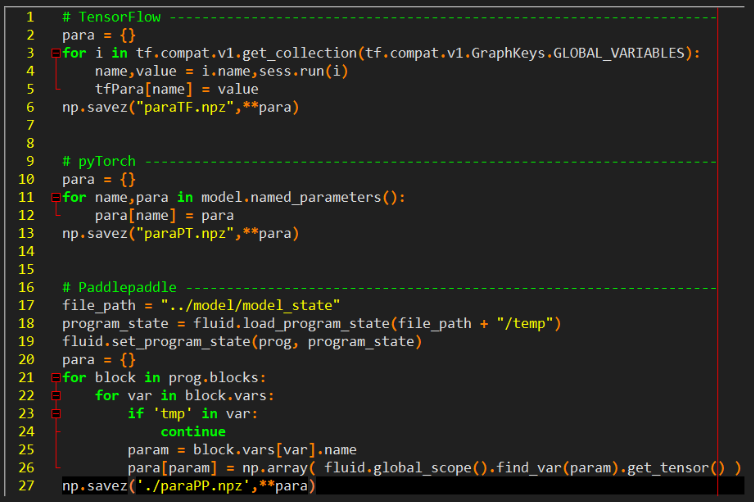

### 3.11.2 逐层搭建

注意算法一致性和权重的排列方式

举例：TensorFlow 中 LSTM 多种实现，各种实现导出权重的排列顺序不同

### 3.11.3 逐层检验输出

**FP32 模式相对误差均值 1×10-6 量级，FP16 模式相对误差均值 1×10-3 量级**

保证 FP32 模式结果正确后，逐步尝试 FP16 和 INT8 模式

## 3.12 FP16模式

范例代码：03-BuildEngineByONNXParser/pyTorch-ONNX-TensorRT

`config.flags = 1<<int(trt.BuilderFlag.FP16)`

* 建立 engine 时间比 FP32 模式更长（更多 kernel 选择，需要插入 Reformat 节点）
* Timeline 中出现 nchwToNchw 等 kernel 调用（就是在做数据类型转换 ）
* 部分层可能精度下降导致较大误差
* 找到误差较大的层（用 polygraphy等工具，见教程第二部分）
  * 强制该层使用 FP32 进行计算
  * config.set_flag(trt.BuilderFlag.OBEY_PRECISION_CONSTRAINTS)
  * layer.precision = trt.float32

## 3.13 INT8模式

Int8 模式 —— PTQ

范例代码：03-BuildEngineByONNXParser/pyTorch-ONNX-TensorRT-PTQ

* 需要有校准集（输入范例数据）
* 自己实现 calibrator（如右图）
* config.set_flag(trt.BuilderFlag.INT8)
* config.int8_calibrator = …

Int8 模式 —— QAT

范例代码：03-BuildEngineByONNXParser/pyTorch-ONNX-TensorRT-QAT

* config.set_flag(trt.BuilderFlag.INT8)
* 在 pyTorch 网络中插入 Quantize/Dequantize 层

## 3.14 **TensorRT 运行期（Runtime）**

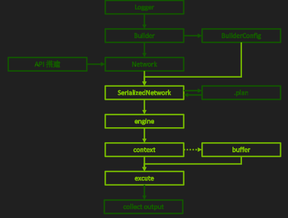

* 生成 TRT 内部表示
  * serializedNetwork = builder. build_serialized_network(network, config)
* 生成 Engine
  * engine = trt.Runtime(logger).deserialize_cuda_engine(serializedNetwork)
  * lTensorName = [engine.get_tensor_name(i) for i in range(engine.num_io_tensors)]

* 创建 Context
  *  context = engine.create_execution_context()

* 绑定输入输出（Dynamic Shape 模式必须）
  * context.set_input_shape(lTensorName[0], [3, 4, 5]) ## TensorRT 8.5 开始 binding 系列 API 全部 deprecated，换成 tensor 系列 API

* 准备 Buffer

  * inputHost = np.ascontiguousarray(inputData.reshape(-1))

  * outputHost = np.empty(context.get_tensor_shape(iTensorName[i]), trt.nptype(engine.get_tensor_dtype(iTensorName[1])))

  * inputDevice = cudart.cudaMalloc(inputHost.nbytes)[1]

  * outputDevice = cudart.cudaMalloc(outputHost.nbytes)[1]

  * context.set_tensor_address(iTensorName[0], inputDevice) ## 用到的 GPU 指针提前在这里设置，不再传入 execute_v3 函数

  * context.set_tensor_address(iTensorName[1], outputDevice)

* 执行计算

  * cudart.cudaMemcpy(inputDevice, inputHost.ctypes.data, inputHost.nbytes, cudart.cudaMemcpyKind.cudaMemcpyHostToDevice)

  * context. execute_async_v3(0) 

  * cudart.cudaMemcpy(outputHost.ctypes.data, outputDevice, outputHost.nbytes, cudart.cudaMemcpyKind.cudaMemcpyDeviceToHost)

## 3.15 Engine 计算引擎

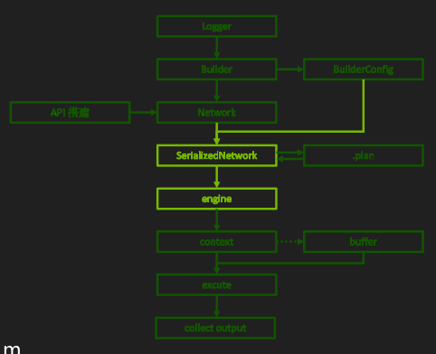

* serializedNetwork = builder. build_serialized_network(network, config)

* engine = trt.Runtime(logger).deserialize_cuda_engine(serializedNetwork)

* 常用成员：

  * engine. num_io_tensors 获取 engine 绑定的输入输出张量总数，n + m

  *  engine.num_layers 获取 engine（自动优化后）总层数

* 常用方法：## TensorRT 8.5 开始 binding 系列 API 全部 deprecated，换成 tensor 系列 API

  *  Engine.get_tensor_name(i) 第 i 个张量的名字

  *  engine.get_tensor_dtype(iTensorName[i]) 第 i 个张量的数据类型，传入张量名字而非索引

  *  engine.get_tensor_shape(iTensorName[i]) 第 i 个张量的张量形状，传入张量名字而非索引，Dynamic Shape 模式下结果可能含 -1

  * engine. engine.get_tensor_mode(iTensorName[i]) 第 i 个张量属于是输入还是输出张量

* 更多细节见 02-API/CudaEngine


## 3.16 Context **推理进程**

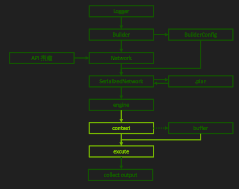

相当于CPU端的一个进程

* context = engine.create_execution_context()

* 常用方法：## TensorRT 8.5 开始 binding 系列 API 全部 deprecated，换成 tensor 系列 API

  *  context. set_input_shape(iTensorName[i], shapeOfInputTensor) 设定第 i 个张量的形状（Dynamic Shape 模式中使用）

  *  context.get_tensor_shape(iTensorName[i]) 获取第 i 个张量的形状

  *  context.set_tensor_address(iTensorName[i], address) 设定输入输出张量的指针

  *  context.execute_async_v3(srteam) Explicit batch 模式的异步执行

* 更多细节见 02-API/ExecutionContext


## 3.17 CUDA 异构计算

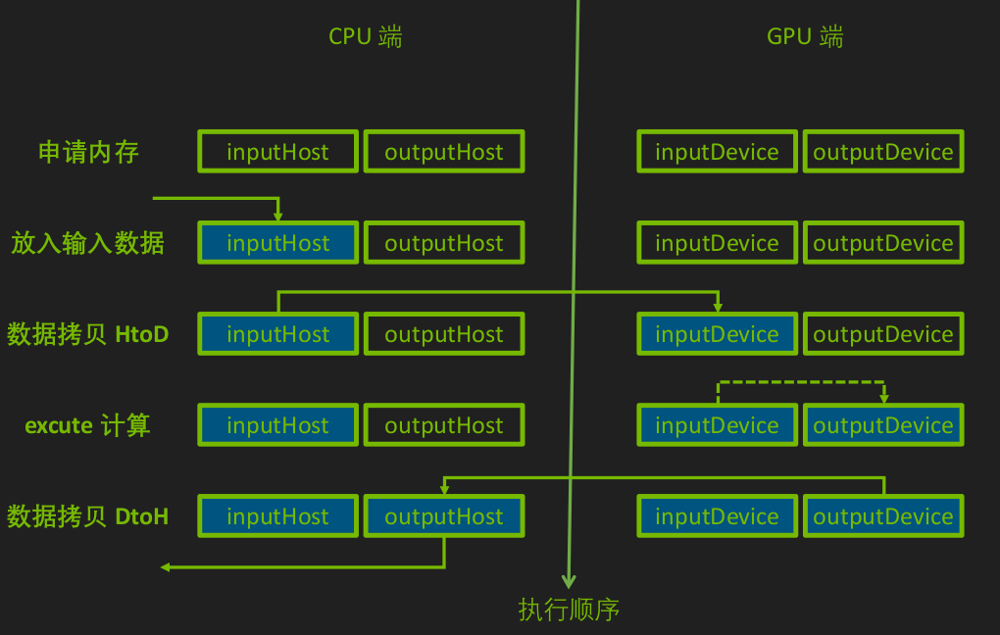

* 同时准备 CPU 端内存和 GPU端显存

* 开始计算前把数据从内存拷贝到显存中

* 计算过程的输入输出数据均在 GPU端读写

* 计算完成后要把结果拷贝会内存才能使用

## 3.18 Buffer

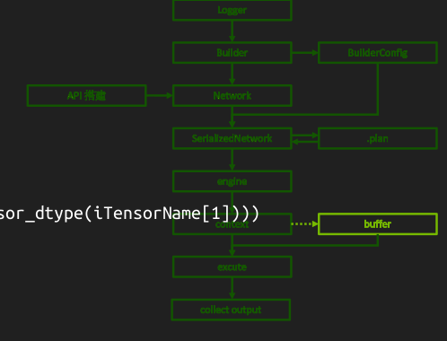

* 内存和显存的申请

*  inputHost = np.**ascontiguousarray**(inputData) # 不要忘了 ascontiguousarray！

* outputHost = np.empty(context.get_tensor_shape(iTensorName[1]), trt.nptype(engine.get_tensor_dtype(iTensorName[1])))

* inputDevice = cudart.cudaMalloc(inputHost.nbytes)[1]

* outputDevice = cudart.cudaMalloc(outputHost.nbytes)[1]

* context.set_tensor_address(iTensorName[0], inputDevice)

* context.set_tensor_address(iTensorName[1], outputDevice)

* 内存和显存之间的拷贝

* cudart.cudaMemcpy(inputDevice, inputHost.ctypes.data, inputHost.nbytes, cudart.cudaMemcpyKind.cudaMemcpyHostToDevice)

* cudart.cudaMemcpy(outputHost.ctypes.data, outputDevice, outputHost.nbytes, cudart.cudaMemcpyKind.cudaMemcpyDeviceToHost)

* 推理完成后释放显存

* cudart.cudaFree(inputDevice)

* cudart.cudaFree(outputDevice)

## 3.19 序列化与反序列化

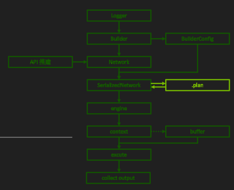

构建引擎需要时间，怎么构建一次，反复使用?

将 SerializedNetwork 保存为文件，下次跳过构建直接使用

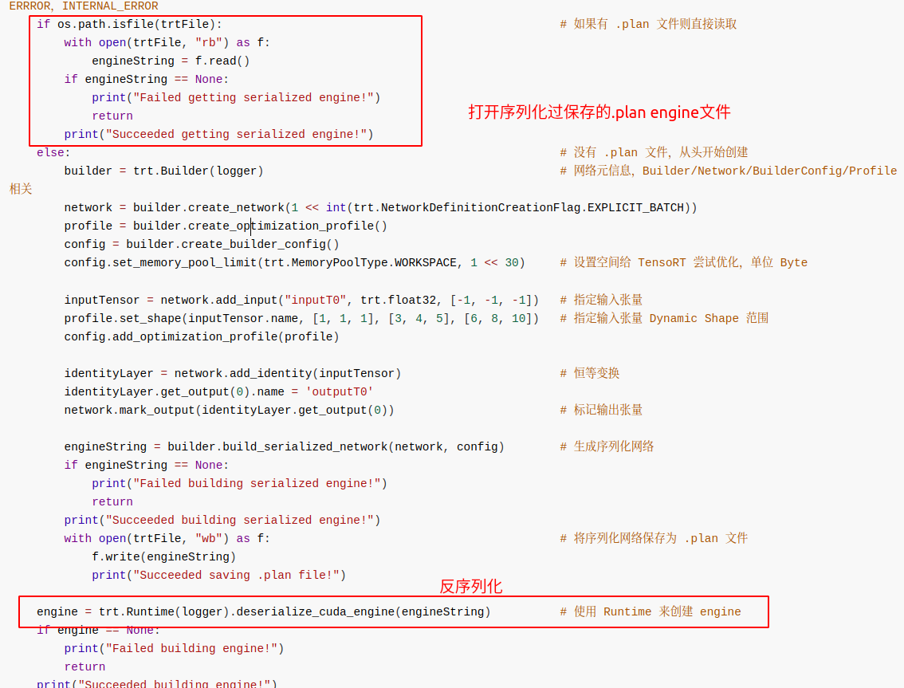

* 注意环境统一（硬件环境 + CUDA/cuDNN/TensorRT 环境）
  * **Engine 包含硬件有关优化，不能跨硬件平台使用**
  * **不同版本 TensorRT 生成的 engine 不能相互兼容**
  * **同平台同环境多次生成的 engine 可能不同**

* TensorRT runtime 版本与 engine 版本不同时的报错信息

  * *[TensorRT] ERROR: INVALID_CONFIG: The engine plan file is not compatible with this version of TensorRT, expecting library version 8.6.1.5 got 8.6.1.6, please rebuild.*

  * *[TensorRT] ERROR: engine.cpp (1646) - Serialization Error in deserialize: 0 (Core engine deserialization failure)*

* 高级话题（见教程第四部分）：

  * **利用 AlgorthimSelector 或 TimingCache 多次生成一模一样的 engine**

  * 利用 TensorRT 8.6 的 Hardware compatibility 和 Version compatibility 特性创建跨设备、跨 TensorRT 版本的 engine

## 3.20 **Workflow：使用 Parser**

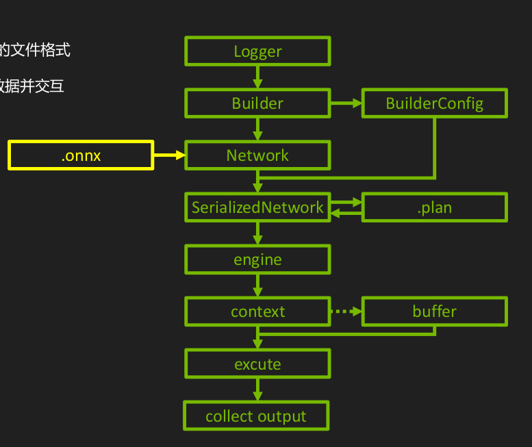

* ONNX

  * 简介 https://onnx.ai/

  * Open Neural Network Exchange，针对机器学习所设计的开放式的文件格式
  * 用于存储训练好的模型，使得不同框架可以采用相同格式存储模型数据并交互

  * TensorFlow / pyTorch 模型转 TensorRT 的中间表示

  * 当前 TensoRT 导入模型的主要途径

* Onnxruntime

  * 简介 https://onnxruntime.ai/

  * 利用 onnx 格式模型进行推理计算的框架

  * 兼容多硬件、多操作系统，支持多深度学习框架

  *  可用于检查 TensorFlow / Torch 模型导出到 Onnx 的正确性

* pyTorch 的例子
  * 范例代码 04-BuildEngineByONNXParser/pyTorch-ONNX-TensorRT

* 基本流程：

  * pyTorch 中创建网络并保存为 .pt 文件

  *  使用 pyTorch 内部 API 将 .pt 转化为 .onnx

  * TensorRT 中读取 .onnx 构建 engine 并做推理

* 本例在 TensorRT 中开启了 Int8 模式
  * 需要自己实现 calibrator 类（calibrator.py 可作为 Int8 通用样例）

```python
# Export model as ONNX file ----------------------------------------------------
t.onnx.export(model, t.randn(1, 1, nHeight, nWidth, device="cuda"), onnxFile, input_names=["x"], output_names=["y", "z"], do_constant_folding=True, verbose=True, keep_initializers_as_inputs=True, opset_version=12, dynamic_axes={"x": {0: "nBatchSize"}, "z": {0: "nBatchSize"}})
print("Succeeded converting model into ONNX!")

# Parse network, rebuild network and do inference in TensorRT ------------------
logger = trt.Logger(trt.Logger.ERROR)
builder = trt.Builder(logger)
network = builder.create_network(1 << int(trt.NetworkDefinitionCreationFlag.EXPLICIT_BATCH))
profile = builder.create_optimization_profile()
config = builder.create_builder_config()
config.set_memory_pool_limit(trt.MemoryPoolType.WORKSPACE, 3 << 30)
if bUseFP16Mode:
    config.set_flag(trt.BuilderFlag.FP16)
if bUseINT8Mode:
    config.set_flag(trt.BuilderFlag.INT8)
    config.int8_calibrator = calibrator.MyCalibrator(calibrationDataPath, nCalibration, (1, 1, nHeight, nWidth), cacheFile)

parser = trt.OnnxParser(network, logger)
if not os.path.exists(onnxFile):
    print("Failed finding ONNX file!")
    exit()
print("Succeeded finding ONNX file!")
with open(onnxFile, "rb") as model:
    if not parser.parse(model.read()):
        print("Failed parsing .onnx file!")
        for error in range(parser.num_errors):
            print(parser.get_error(error))
        exit()
    print("Succeeded parsing .onnx file!")

inputTensor = network.get_input(0)
profile.set_shape(inputTensor.name, (1, 1, nHeight, nWidth), (4, 1, nHeight, nWidth), (8, 1, nHeight, nWidth))
config.add_optimization_profile(profile)

network.unmark_output(network.get_output(0))  # 去掉输出张量 "y"
engineString = builder.build_serialized_network(network, config)
if engineString == None:
    print("Failed building engine!")
    exit()
print("Succeeded building engine!")
#with open(trtFile, "wb") as f:
#    f.write(engineString)
engine = trt.Runtime(logger).deserialize_cuda_engine(engineString)
```

* TensorFlow 的例子
  * 范例代码 04-BuildEngineByONNXParser/TensorFlow*-ONNX-TensorRT

* 基本流程：

  * 中创建网络并保存为 .pb 文件

  * 使用 tf2onnx 将 .pb 转化为 ONNX 文件

  *  TensorRT 中读取 ONNX 构建 engine 并做推理


* 如果不用 Int8 模式，onnx parser 的代码几乎是通用的
  * **有命令行工具可用，基本等价于脚本中的 API（见教程第二部分 trtexec）**

* 遇到 TensorRT 不支持的节点

  * 修改源模型

  * 修改 Onnx 计算图（见教程第二部分 onnx-surgeon）

  * TensorRT 中实现 Plugin（见教程第三部分）

  * 修改 Parser：修改 TRT 源码并重新编译 TRT（见 https://github.com/NVIDIA/TensorRT 项目）

*  trtexec，onnx-graphsurgeon 和 plugin 都是使用 parser 的必备知识，将在后面的教程展开

## 3.21 **Workflow：使用框架内 TensorRT 接口**

* TF-TRT
  * 范例代码 06-UseFrameworkTRT/TensorFlow*-TFTRT

* Torch-TensorRT（旧名 TRTorch）
  *  范例代码 06-UseFrameworkTRT/Torch-TensorRT

## 3.22 **TensorRT 环境**

* 推荐使用 NVIDIA-optimized Docker

  * 安装步骤：https://docs.nvidia.com/datacenter/cloud-native/container-toolkit/install-guide.html#docker

  * 镜像列表：https://docs.nvidia.com/deeplearning/frameworks/support-matrix/index.html
  * 推荐镜像：nvcr.io/nvidia/pytorch:23.03-py3（pyTorch1.14+TRT8.5.2），nvcr.io/nvidia/pytorch:23.04-py3（pyTorch2.0+TRT8.6.1）

* python 库（见 cookbook requirements.txt）
  * nvidia-pyindex，cuda-python（python≥3.7），pycuda，onnx，onnx-surgeon，onnxruntime-gpu，opencv-python，polygraphy

* 推荐使用：

  * 最新的 TensorRT8，图优化内容更多，优化过程和推理过程显存使用量更少

  * builderConfig API，功能覆盖旧版 builder API，旧版 builder API 将被废弃

  * explicit batch 模式 + dynamic shape 模式，ONNX 格式默认模式，灵活性和应用场景更广，使模型适应性更好
  * cuda-python 库，完整的 CUDA API 支持，修复 pycuda 库可能存在的问题（如与其他框架交互使用时的同步操作等）

# 附录：

* Nvidia官方B站的[视频](https://www.bilibili.com/video/BV1jj411Z7wG?spm_id_from=333.788.videopod.sections&vd_source=cde2e7b9bca1a7048a13eaf0b48210b6)
* 官方代码[[trt-samples-for-hackathon-cn]](https://github.com/NVIDIA/trt-samples-for-hackathon-cn)
*  https://docs.nvidia.com/deeplearning/tensorrt/developer-guide/index.html（TensorRT 文档）
* https://docs.nvidia.com/deeplearning/tensorrt/api/c_api（C++ API 文档）
* https://docs.nvidia.com/deeplearning/tensorrt/api/python_api/（python API 文档）
* https://developer.nvidia.com/nvidia-tensorrt-download（TensorRT 下载）
*  https://github.com/NVIDIA/trt-samples-for-hackathon-cn/tree/master/cookbook（本教程配套代码，包含视频以外的更多范例代码）