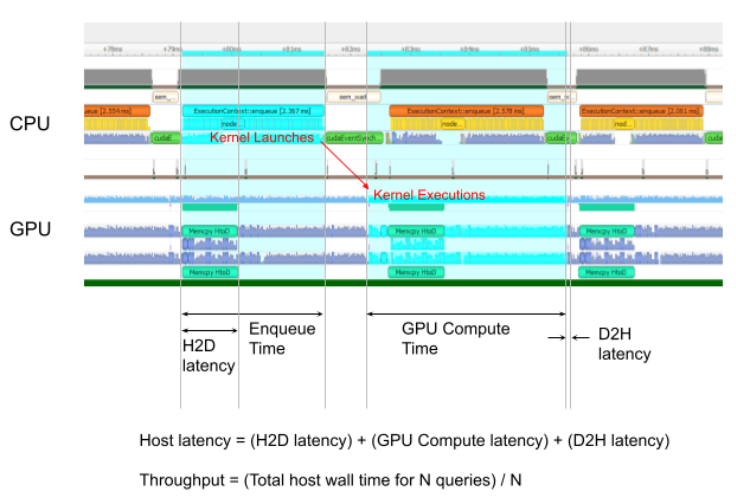

# 1 背景

本文档是记录学习Nvidia官方B站的[视频](https://www.bilibili.com/video/BV1jj411Z7wG?spm_id_from=333.788.videopod.sections&vd_source=cde2e7b9bca1a7048a13eaf0b48210b6)，参考对应的PDF文件 TensorRTTraining-TRT8.6.1-Part5-V1.1.pdf 的记录。对应的官方代码[[trt-samples-for-hackathon-cn\]](https://github.com/NVIDIA/trt-samples-for-hackathon-cn)

官方的视频教程基于TensorRT8.6.1版本。但是官方代码没有对应的tag。只有8.4、8.5和截至目前最新的8.10（master分支）。因此我这里参考的都是8.4分支的代码。

- part1 TensorRT简介
- part2 开发辅助工具
- part3 插件书写
- part4 TensorRT高级用法
- part5 常见优化策略


# 2 开发辅助工具

* trtexec :TensorRT 命令行工具，主要的 End2End 性能测试工具

* Netron :网络可视化

* onnx-graphsurgeon :onnx 计算图编辑

* polygraphy :结果验证与定位，图优化

* Nsight Systems :性能分析

希望解决的问题

* 不想写脚本来跑 TensorRT： trtexec用命令行搞定

*  怎么进行简单的推理性能测试？： trtexec测量延迟、吞吐量等

*  网络结构可视化？：Netron

* 计算图上有些节点阻碍 TensorRT 自动优化 ：onnx-graphsurgeon手工调整以便 TensorRT 能够处理

* 怎么处理 TensorRT 不支持的网络结构？ :onnx-graphsurgeon手工调整以便 TensorRT 能够处理

* 怎么检验 TensorRT 上计算结果正确性 / 精度？ :polygraphy同时在原框架和 TensorRT 上运行

*  怎么找出计算错误 / 精度不足的层？ :polygraphy模型逐层比较

* 怎么进行简单的计算图优化？ :polygraphy手工调整

* 怎样找出最耗时的层？ :nsight system找到热点集中优化

## 2.1 **trtexec**

* TensorRT 的命令行工具，

  * 随 TensorRT 安装，位于 tensorrt-XX/bin/trtexec

  *  docker 中位于：/opt/tensorrt/bin/

* 功能

  * 由 ONNX 文件生成 TensorRT 引擎并序列化为 Plan 文件

  * 查看 ONNX 文件或 Plan 文件的网络逐层信息

  * 模型性能测试（测试 TensorRT 引擎基于随机输入或给定输入下的性能）

一些简单的指令

* 07-Tool/trtexec，运行 ./command.sh

```bash

# 02-用上面的 .onnx 构建一个 TensorRT 引擎并作推理
trtexec \
    --onnx=model.onnx \
    --minShapes=tensor-0:1x1x28x28 \
    --optShapes=tensor-0:4x1x28x28 \
    --maxShapes=tensor-0:16x1x28x28 \
    --memPoolSize=workspace:1024MiB \
    --saveEngine=model-FP32.plan \
    --shapes=tensor-0:4x1x28x28 \
    --verbose \
    > result-FP32.log

# 注意参数名和格式跟 polygrapy 不一样，多个形状之间用逗号分隔，如：
# --minShapes=tensor-0:16x320x256,tensor-1:16x320,tensor-2:16

# 03-用上面的 .onnx 构建一个 TensorRT 引擎并作推理，使用 FP16 模式
trtexec \
    --onnx=model.onnx \
    --minShapes=tensor-0:1x1x28x28 \
    --optShapes=tensor-0:4x1x28x28 \
    --maxShapes=tensor-0:16x1x28x28 \
    --memPoolSize=workspace:1024MiB \
    --saveEngine=model-FP16.plan \
    --shapes=tensor-0:4x1x28x28 \
    --verbose \
    --fp16 \
    > result-FP16.log

# 04-读取上面构建的 result-FP32.plan 并作推理
trtexec \
    --loadEngine=./model-FP32.plan \
    --shapes=tensor-0:4x1x28x28 \
    --verbose \
    > result-loadAndInference.log
    
# 05-读取上面构建的 result-FP32.plan 打印引擎的详细信息（since TRT8.4）
trtexec \
    --loadEngine=./model-FP32.plan \
    --shapes=tensor-0:4x1x28x28 \
    --verbose \
    --dumpLayerInfo \
    --exportLayerInfo="./modelInformation.log" \
    > result-PrintInformation.log
```


## 2.2 trtexec 常用选项

我这里列举出来tensorRT8.4在orin上的help

```bash
root@tegra-ubuntu:~# trtexec --help
&&&& RUNNING TensorRT.trtexec [TensorRT v8412] # trtexec --help
=== Model Options ===
  --uff=<file>                UFF model
  --onnx=<file>               ONNX model
  --model=<file>              Caffe model (default = no model, random weights used)
  --deploy=<file>             Caffe prototxt file
  --output=<name>[,<name>]*   Output names (it can be specified multiple times); at least one output is required for UFF and Caffe
  --uffInput=<name>,X,Y,Z     Input blob name and its dimensions (X,Y,Z=C,H,W), it can be specified multiple times; at least one is required for UFF models
  --uffNHWC                   Set if inputs are in the NHWC layout instead of NCHW (use X,Y,Z=H,W,C order in --uffInput)

=== Build Options ===
  --maxBatch                  Set max batch size and build an implicit batch engine (default = same size as --batch)
                              This option should not be used when the input model is ONNX or when dynamic shapes are provided.
  --minShapes=spec            Build with dynamic shapes using a profile with the min shapes provided
  --optShapes=spec            Build with dynamic shapes using a profile with the opt shapes provided
  --maxShapes=spec            Build with dynamic shapes using a profile with the max shapes provided
  --minShapesCalib=spec       Calibrate with dynamic shapes using a profile with the min shapes provided
  --optShapesCalib=spec       Calibrate with dynamic shapes using a profile with the opt shapes provided
  --maxShapesCalib=spec       Calibrate with dynamic shapes using a profile with the max shapes provided
                              Note: All three of min, opt and max shapes must be supplied.
                                    However, if only opt shapes is supplied then it will be expanded so
                                    that min shapes and max shapes are set to the same values as opt shapes.
                                    Input names can be wrapped with escaped single quotes (ex: \'Input:0\').
                              Example input shapes spec: input0:1x3x256x256,input1:1x3x128x128
                              Each input shape is supplied as a key-value pair where key is the input name and
                              value is the dimensions (including the batch dimension) to be used for that input.
                              Each key-value pair has the key and value separated using a colon (:).
                              Multiple input shapes can be provided via comma-separated key-value pairs.
  --inputIOFormats=spec       Type and format of each of the input tensors (default = all inputs in fp32:chw)
                              See --outputIOFormats help for the grammar of type and format list.
                              Note: If this option is specified, please set comma-separated types and formats for all
                                    inputs following the same order as network inputs ID (even if only one input
                                    needs specifying IO format) or set the type and format once for broadcasting.
  --outputIOFormats=spec      Type and format of each of the output tensors (default = all outputs in fp32:chw)
                              Note: If this option is specified, please set comma-separated types and formats for all
                                    outputs following the same order as network outputs ID (even if only one output
                                    needs specifying IO format) or set the type and format once for broadcasting.
                              IO Formats: spec  ::= IOfmt[","spec]
                                          IOfmt ::= type:fmt
                                          type  ::= "fp32"|"fp16"|"int32"|"int8"
                                          fmt   ::= ("chw"|"chw2"|"chw4"|"hwc8"|"chw16"|"chw32"|"dhwc8"|
                                                     "cdhw32"|"hwc"|"dla_linear"|"dla_hwc4")["+"fmt]
  --workspace=N               Set workspace size in MiB.
  --memPoolSize=poolspec      Specify the size constraints of the designated memory pool(s) in MiB.
                              Note: Also accepts decimal sizes, e.g. 0.25MiB. Will be rounded down to the nearest integer bytes.
                              Pool constraint: poolspec ::= poolfmt[","poolspec]
                                               poolfmt ::= pool:sizeInMiB
                                               pool ::= "workspace"|"dlaSRAM"|"dlaLocalDRAM"|"dlaGlobalDRAM"
  --profilingVerbosity=mode   Specify profiling verbosity. mode ::= layer_names_only|detailed|none (default = layer_names_only)
  --minTiming=M               Set the minimum number of iterations used in kernel selection (default = 1)
  --avgTiming=M               Set the number of times averaged in each iteration for kernel selection (default = 8)
  --refit                     Mark the engine as refittable. This will allow the inspection of refittable layers
                              and weights within the engine.
  --sparsity=spec             Control sparsity (default = disabled).
                              Sparsity: spec ::= "disable", "enable", "force"
                              Note: Description about each of these options is as below
                                    disable = do not enable sparse tactics in the builder (this is the default)
                                    enable  = enable sparse tactics in the builder (but these tactics will only be
                                              considered if the weights have the right sparsity pattern)
                                    force   = enable sparse tactics in the builder and force-overwrite the weights to have
                                              a sparsity pattern (even if you loaded a model yourself)
  --noTF32                    Disable tf32 precision (default is to enable tf32, in addition to fp32)
  --fp16                      Enable fp16 precision, in addition to fp32 (default = disabled)
  --int8                      Enable int8 precision, in addition to fp32 (default = disabled)
  --best                      Enable all precisions to achieve the best performance (default = disabled)
  --directIO                  Avoid reformatting at network boundaries. (default = disabled)
  --precisionConstraints=spec Control precision constraint setting. (default = none)
                                  Precision Constaints: spec ::= "none" | "obey" | "prefer"
                                  none = no constraints
                                  prefer = meet precision constraints set by --layerPrecisions/--layerOutputTypes if possible
                                  obey = meet precision constraints set by --layerPrecisions/--layerOutputTypes or fail
                                         otherwise
  --layerPrecisions=spec      Control per-layer precision constraints. Effective only when precisionConstraints is set to
                              "obey" or "prefer". (default = none)
                              The specs are read left-to-right, and later ones override earlier ones. "*" can be used as a
                              layerName to specify the default precision for all the unspecified layers.
                              Per-layer precision spec ::= layerPrecision[","spec]
                                                  layerPrecision ::= layerName":"precision
                                                  precision ::= "fp32"|"fp16"|"int32"|"int8"
  --layerOutputTypes=spec     Control per-layer output type constraints. Effective only when precisionConstraints is set to
                              "obey" or "prefer". (default = none)
                              The specs are read left-to-right, and later ones override earlier ones. "*" can be used as a
                              layerName to specify the default precision for all the unspecified layers. If a layer has more than
                              one output, then multiple types separated by "+" can be provided for this layer.
                              Per-layer output type spec ::= layerOutputTypes[","spec]
                                                    layerOutputTypes ::= layerName":"type
                                                    type ::= "fp32"|"fp16"|"int32"|"int8"["+"type]
  --calib=<file>              Read INT8 calibration cache file
  --safe                      Enable build safety certified engine
  --consistency               Perform consistency checking on safety certified engine
  --restricted                Enable safety scope checking with kSAFETY_SCOPE build flag
  --saveEngine=<file>         Save the serialized engine
  --loadEngine=<file>         Load a serialized engine
  --tacticSources=tactics     Specify the tactics to be used by adding (+) or removing (-) tactics from the default
                              tactic sources (default = all available tactics).
                              Note: Currently only cuDNN, cuBLAS, cuBLAS-LT, and edge mask convolutions are listed as optional
                                    tactics.
                              Tactic Sources: tactics ::= [","tactic]
                                              tactic  ::= (+|-)lib
                                              lib     ::= "CUBLAS"|"CUBLAS_LT"|"CUDNN"|"EDGE_MASK_CONVOLUTIONS"
                              For example, to disable cudnn and enable cublas: --tacticSources=-CUDNN,+CUBLAS
  --noBuilderCache            Disable timing cache in builder (default is to enable timing cache)
  --timingCacheFile=<file>    Save/load the serialized global timing cache

=== Inference Options ===
  --batch=N                   Set batch size for implicit batch engines (default = 1)
                              This option should not be used when the engine is built from an ONNX model or when dynamic
                              shapes are provided when the engine is built.
  --shapes=spec               Set input shapes for dynamic shapes inference inputs.
                              Note: Input names can be wrapped with escaped single quotes (ex: \'Input:0\').
                              Example input shapes spec: input0:1x3x256x256, input1:1x3x128x128
                              Each input shape is supplied as a key-value pair where key is the input name and
                              value is the dimensions (including the batch dimension) to be used for that input.
                              Each key-value pair has the key and value separated using a colon (:).
                              Multiple input shapes can be provided via comma-separated key-value pairs.
  --loadInputs=spec           Load input values from files (default = generate random inputs). Input names can be wrapped with single quotes (ex: 'Input:0')
                              Input values spec ::= Ival[","spec]
                                           Ival ::= name":"file
  --iterations=N              Run at least N inference iterations (default = 10)
  --warmUp=N                  Run for N milliseconds to warmup before measuring performance (default = 200)
  --duration=N                Run performance measurements for at least N seconds wallclock time (default = 3)
  --sleepTime=N               Delay inference start with a gap of N milliseconds between launch and compute (default = 0)
  --idleTime=N                Sleep N milliseconds between two continuous iterations(default = 0)
  --streams=N                 Instantiate N engines to use concurrently (default = 1)
  --exposeDMA                 Serialize DMA transfers to and from device (default = disabled).
  --noDataTransfers           Disable DMA transfers to and from device (default = enabled).
  --useManagedMemory          Use managed memory instead of separate host and device allocations (default = disabled).
  --useSpinWait               Actively synchronize on GPU events. This option may decrease synchronization time but increase CPU usage and power (default = disabled)
  --threads                   Enable multithreading to drive engines with independent threads or speed up refitting (default = disabled)
  --useCudaGraph              Use CUDA graph to capture engine execution and then launch inference (default = disabled).
                              This flag may be ignored if the graph capture fails.
  --timeDeserialize           Time the amount of time it takes to deserialize the network and exit.
  --timeRefit                 Time the amount of time it takes to refit the engine before inference.
  --separateProfileRun        Do not attach the profiler in the benchmark run; if profiling is enabled, a second profile run will be executed (default = disabled)
  --buildOnly                 Exit after the engine has been built and skip inference perf measurement (default = disabled)

=== Build and Inference Batch Options ===
                              When using implicit batch, the max batch size of the engine, if not given,
                              is set to the inference batch size;
                              when using explicit batch, if shapes are specified only for inference, they
                              will be used also as min/opt/max in the build profile; if shapes are
                              specified only for the build, the opt shapes will be used also for inference;
                              if both are specified, they must be compatible; and if explicit batch is
                              enabled but neither is specified, the model must provide complete static
                              dimensions, including batch size, for all inputs
                              Using ONNX models automatically forces explicit batch.

=== Reporting Options ===
  --verbose                   Use verbose logging (default = false)
  --avgRuns=N                 Report performance measurements averaged over N consecutive iterations (default = 10)
  --percentile=P              Report performance for the P percentage (0<=P<=100, 0 representing max perf, and 100 representing min perf; (default = 99%)
  --dumpRefit                 Print the refittable layers and weights from a refittable engine
  --dumpOutput                Print the output tensor(s) of the last inference iteration (default = disabled)
  --dumpProfile               Print profile information per layer (default = disabled)
  --dumpLayerInfo             Print layer information of the engine to console (default = disabled)
  --exportTimes=<file>        Write the timing results in a json file (default = disabled)
  --exportOutput=<file>       Write the output tensors to a json file (default = disabled)
  --exportProfile=<file>      Write the profile information per layer in a json file (default = disabled)
  --exportLayerInfo=<file>    Write the layer information of the engine in a json file (default = disabled)

=== System Options ===
  --device=N                  Select cuda device N (default = 0)
  --useDLACore=N              Select DLA core N for layers that support DLA (default = none)
  --allowGPUFallback          When DLA is enabled, allow GPU fallback for unsupported layers (default = disabled)
  --plugins                   Plugin library (.so) to load (can be specified multiple times)

=== Help ===
  --help, -h                  Print this message
root@tegra-ubuntu:~#


```


### 2.2.1 构建阶段

*  --onnx=./model-NCHW.onnx 指定输入模型文件名

*  --output=y:0 指定输出张量名（使用 ONNX 时该选项无效）

*  --minShapes=x:0:1x1x28x28 --optShapes=x:0:4x1x28x28 --maxShapes=x:0:16x1x28x28 指定输入形状的范围最小值、最常见值、最大值

*  --memPoolSize=workspace:1024MiB 优化过程可使用显存最大值 ##

*  --fp16，--int8，--noTF32，--best，--sparsity=… 指定引擎精度和稀疏性等属性

*  --saveEngine=./model.plan 指定输出引擎文件名

*  --skipInference 只创建引擎不运行

*  --verbose 打印详细日志

*  --preview=profileSharing0806 启用某些 preview 功能 ##

*  --builderOptimizationLevel=5 设置优化等级（默认值 2） ##

*  --timingCacheFile=timing.cache 指定输出优化计时缓存文件名[1]

*  --profilingVerbosity=detailed 构建期保留更多的逐层信息

*  --dumpLayerInfo，--exportLayerInfo=layerInfo.txt 导出引擎逐层信息，可与 

### 2.2.2 运行阶段

*  --loadEngine=model.plan 读取 engine 文件，而不是输入 ONNX 文件

*  --shapes=x:0:1x1x28x28 指定输入张量形状

*  --warmUp=1000 热身阶段最短运行时间（单位：ms）

*  --duration=10 测试阶段最短运行时间（单位：s）

*  --iterations=100 指定测试阶段运行的最小迭代次数

*  --useCudaGraph 使用 CUDAGraph 来捕获和执行推理过程[1]

*  --noDataTransfers 关闭 Host 和 Device 之间的数据传输

*  --streams=2 使用多个 stream 来运行推理

*  --verbose 打印详细日志

*  --dumpProfile，--exportProfile=layerProfile.txt 保存逐层性能数据信息

### 2.2.3 性能测试结果



下面是我实际一个模型的性能测试结果，其中最后还有各种延迟的解释

```bash
[10/23/2024-07:55:37] [I] === Performance summary ===
[10/23/2024-07:55:37] [I] Throughput: 167.872 qps
[10/23/2024-07:55:37] [I] Latency: min = 6.00146 ms, max = 12.9489 ms, mean = 6.32138 ms, median = 6.13257 ms, percentile(99%) = 11.8965 ms
[10/23/2024-07:55:37] [I] Enqueue Time: min = 5.64685 ms, max = 12.1282 ms, mean = 5.90171 ms, median = 5.71997 ms, percentile(99%) = 11.9158 ms
[10/23/2024-07:55:37] [I] H2D Latency: min = 0.296387 ms, max = 0.517822 ms, mean = 0.394752 ms, median = 0.397461 ms, percentile(99%) = 0.472168 ms
[10/23/2024-07:55:37] [I] GPU Compute Time: min = 5.37585 ms, max = 12.2018 ms, mean = 5.59932 ms, median = 5.4104 ms, percentile(99%) = 11.0095 ms
[10/23/2024-07:55:37] [I] D2H Latency: min = 0.209717 ms, max = 0.454102 ms, mean = 0.32731 ms, median = 0.32605 ms, percentile(99%) = 0.414429 ms
[10/23/2024-07:55:37] [I] Total Host Walltime: 2.09088 s
[10/23/2024-07:55:37] [I] Total GPU Compute Time: 1.96536 s
[10/23/2024-07:55:37] [W] * Throughput may be bound by Enqueue Time rather than GPU Compute and the GPU may be under-utilized.
[10/23/2024-07:55:37] [W]   If not already in use, --useCudaGraph (utilize CUDA graphs where possible) may increase the throughput.
[10/23/2024-07:55:37] [W] * GPU compute time is unstable, with coefficient of variance = 16.4497%.
[10/23/2024-07:55:37] [W]   If not already in use, locking GPU clock frequency or adding --useSpinWait may improve the stability.
[10/23/2024-07:55:37] [I] Explanations of the performance metrics are printed in the verbose logs.
[10/23/2024-07:55:37] [V]
[10/23/2024-07:55:37] [V] === Explanations of the performance metrics ===
[10/23/2024-07:55:37] [V] Total Host Walltime: the host walltime from when the first query (after warmups) is enqueued to when the last query is completed.
[10/23/2024-07:55:37] [V] GPU Compute Time: the GPU latency to execute the kernels for a query.
[10/23/2024-07:55:37] [V] Total GPU Compute Time: the summation of the GPU Compute Time of all the queries. If this is significantly shorter than Total Host Walltime, the GPU may be under-utilized because of host-side overheads or data transfers.
[10/23/2024-07:55:37] [V] Throughput: the observed throughput computed by dividing the number of queries by the Total Host Walltime. If this is significantly lower than the reciprocal of GPU Compute Time, the GPU may be under-utilized because of host-side overheads or data transfers.
[10/23/2024-07:55:37] [V] Enqueue Time: the host latency to enqueue a query. If this is longer than GPU Compute Time, the GPU may be under-utilized.
[10/23/2024-07:55:37] [V] H2D Latency: the latency for host-to-device data transfers for input tensors of a single query.
[10/23/2024-07:55:37] [V] D2H Latency: the latency for device-to-host data transfers for output tensors of a single query.
[10/23/2024-07:55:37] [V] Latency: the summation of H2D Latency, GPU Compute Time, and D2H Latency. This is the latency to infer a single query.
[10/23/2024-07:55:37] [I]
&&&& PASSED TensorRT.trtexec [TensorRT v8412] # trtexec --loadEngine=test.engine --verbose

```

## 2.3 Netron

* 模型网络可视化工具

* 下载安装https://github.com/lutzroeder/Netron

* 查看网络结构

* 查看计算图信息

* 查看节点信息


## 2.4 onnx-graphsurgeon

* 需要手工修改网络的情形？

* 冗余节点

* 阻碍 TensorRT 融合的节点组合

*  可以手工模块化的节点
*  更多范例：09-BestPractice

在下左图中Conv、Add、Relu节点中间存在一些Squeeze和Unsqueeze节点，这些节点的存在会阻止Conv、Add、Relu节点融合，改造为中间的图，那么中间的Conv、Add、Relu节点会中和为一个节点

下右图中是一个layerNorm，但是有12个节点，我们将其转换为一个plugin一个节点就可以完成。

因此就需要我们对原始的onnx进行修改，需要用到的就是onnx-graphsurgeon


* ONNX 模型的编辑器，包含 python API（下面简称 ogs）

* 功能：

  * 修改计算图：图属性 / 节点 / 张量 / 节点和张量的连接 / 权重

  * 修改子图：添加 / 删除 / 替换 / 隔离

  * 优化计算图：常量折叠 / 拓扑排序 / 去除无用层
  * 功能和 API 上有别于 onnx 库

* 下载和参考文档

  * pip install nvidia-pyindex onnx-graphsurgeon

  * https://github.com/NVIDIA/TensorRT/tree/master/tools/onnx-graphsurgeon/examples

  * https://docs.nvidia.com/deeplearning/tensorrt/onnx-graphsurgeon/docs/index.html

范例代码

* 07-Tool/OnnxGraphSurgeon，运行 test.sh

* 共有 9 个例子，包含创建模型、隔离子图、替换节点、常量折叠、删除节点、shape 操作

Ogs 的 Node 和 Variable:类似与TensorRT的layer和Tensor的概念，有对应的上下游，我们在修改计算图时需要注意防止修改的节点存在上下游为空的情况。也就是输入输出都是可以连接上的。


### 2.4.1 CreateModel

```python
from collections import OrderedDict
import numpy as np
import onnx
import onnx_graphsurgeon as gs

tensor0 = gs.Variable("tensor0", np.float32, ["B", 3, 64, 64])  # 定义张量（变量）
tensor1 = gs.Variable("tensor1", np.float32, ["B", 1, 64, 64])
tensor2 = gs.Variable("tensor2", np.float32, None)  # 可以不知道形状或者数据类型
tensor3 = gs.Variable("tensor3", np.float32, None)

constant0 = gs.Constant(name="constant0", values=np.ones(shape=[1, 3, 3, 3], dtype=np.float32))  # 定义张量（常量）
constant1 = gs.Constant(name="constant1", values=np.ones(shape=[1], dtype=np.float32))

node0 = gs.Node("Conv", "myConv", inputs=[tensor0, constant0], outputs=[tensor1])  # 定义节点，使用张量作为输入和输出
node0.attrs = OrderedDict([
    ["dilations", [1, 1]],
    ["kernel_shape", [3, 3]],
    ["pads", [1, 1, 1, 1]],
    ["strides", [1, 1]],
])  # 节点的属性参数

node1 = gs.Node("Add", "myAdd", inputs=[tensor1, constant1], outputs=[tensor2])
node2 = gs.Node("Relu", "myRelu", inputs=[tensor2], outputs=[tensor3])

graph = gs.Graph(nodes=[node0, node1, node2], inputs=[tensor0], outputs=[tensor3])  # 定义计算图，要求给出所有节点和输入输出张量

graph.cleanup().toposort()  # 保存计算图前的收尾工作，详细作用见 06-Fold.py
onnx.save(gs.export_onnx(graph), "model-01.onnx")
```


对应的日志

```tex
[W] --workspace is deprecated and will be removed in Polygraphy 0.48.0. Use --pool-limit workspace:1000000000 instead.
[I] RUNNING | Command: /home/zhaoyidong/anaconda3/envs/zyd_env/bin/polygraphy run model-01.onnx --onnxrt --trt --workspace 1000000000 --atol 1e-3 --rtol 1e-3 --verbose --trt-min-shapes tensor0:[1,3,64,64] --trt-opt-shapes tensor0:[4,3,64,64] --trt-max-shapes tensor0:[16,3,64,64] --input-shapes tensor0:[4,3,64,64]
[V] Loaded Module: polygraphy | Version: 0.47.1 | Path: ['/home/zhaoyidong/anaconda3/envs/zyd_env/lib/python3.8/site-packages/polygraphy']
[V] Loaded extension modules: []
[V] Loaded Module: tensorrt | Version: 8.6.0 | Path: ['/home/zhaoyidong/anaconda3/envs/zyd_env/lib/python3.8/site-packages/tensorrt']
[I] Will generate inference input data according to provided TensorMetadata: {tensor0 [shape=(4, 3, 64, 64)]}
[I] onnxrt-runner-N0-10/24/24-09:43:36  | Activating and starting inference
[V] Loaded Module: onnxruntime | Version: 1.19.0 | Path: ['/home/zhaoyidong/.local/lib/python3.8/site-packages/onnxruntime']
[I] Creating ONNX-Runtime Inference Session with providers: ['CPUExecutionProvider']
[V] Loaded Module: numpy | Version: 1.24.4 | Path: ['/home/zhaoyidong/.local/lib/python3.8/site-packages/numpy']
[V] Loading inputs from data loader
[V] Generating data using numpy seed: 1
[V] Input tensor: tensor0 | Generating input data in range: [0.0, 1.0]
[I] onnxrt-runner-N0-10/24/24-09:43:36 
    ---- Inference Input(s) ----
    {tensor0 [dtype=float32, shape=(4, 3, 64, 64)]}
[V] onnxrt-runner-N0-10/24/24-09:43:36  | Input metadata is: {tensor0 [dtype=float32, shape=('B', 3, 64, 64)]}
[I] onnxrt-runner-N0-10/24/24-09:43:36 
    ---- Inference Output(s) ----
    {tensor3 [dtype=float32, shape=(4, 1, 64, 64)]}
[I] onnxrt-runner-N0-10/24/24-09:43:36  | Completed 1 iteration(s) in 19.5 ms | Average inference time: 19.5 ms.
[I] trt-runner-N0-10/24/24-09:43:36     | Activating and starting inference
[V] [MemUsageChange] Init CUDA: CPU +14, GPU +0, now: CPU 32, GPU 848 (MiB)
[V] [MemUsageChange] Init builder kernel library: CPU +1434, GPU +266, now: CPU 1542, GPU 1114 (MiB)
[V] ----------------------------------------------------------------
[V] Input filename:   /media/byd/disk38/media_zhaoyidong/test/OnnxGraphSurgeon/model-01.onnx
[V] ONNX IR version:  0.0.9
[V] Opset version:    11
[V] Producer name:    
[V] Producer version: 
[V] Domain:           
[V] Model version:    0
[V] Doc string:       
[V] ----------------------------------------------------------------
[V]     Setting TensorRT Optimization Profiles
[V]     Input tensor: tensor0 (dtype=DataType.FLOAT, shape=(-1, 3, 64, 64)) | Setting input tensor shapes to: (min=[1, 3, 64, 64], opt=[4, 3, 64, 64], max=[16, 3, 64, 64])
[I]     Configuring with profiles: [Profile().add('tensor0', min=[1, 3, 64, 64], opt=[4, 3, 64, 64], max=[16, 3, 64, 64])]
[I] Building engine with configuration:
    Flags                  | []
    Engine Capability      | EngineCapability.DEFAULT
    Memory Pools           | [WORKSPACE: 953.67 MiB, TACTIC_DRAM: 24209.12 MiB]
    Tactic Sources         | [CUBLAS, CUBLAS_LT, CUDNN, EDGE_MASK_CONVOLUTIONS, JIT_CONVOLUTIONS]
    Profiling Verbosity    | ProfilingVerbosity.DETAILED
    Preview Features       | [FASTER_DYNAMIC_SHAPES_0805, DISABLE_EXTERNAL_TACTIC_SOURCES_FOR_CORE_0805]
[V] Graph optimization time: 0.001256 seconds.
[V] Global timing cache in use. Profiling results in this builder pass will be stored.
[V] Detected 1 inputs and 1 output network tensors.
[V] Total Host Persistent Memory: 5488
[V] Total Device Persistent Memory: 0
[V] Total Scratch Memory: 0
[V] [MemUsageStats] Peak memory usage of TRT CPU/GPU memory allocators: CPU 0 MiB, GPU 4 MiB
[V] Total Activation Memory: 0
[V] [MemUsageChange] TensorRT-managed allocation in building engine: CPU +0, GPU +4, now: CPU 0, GPU 4 (MiB)
[I] Finished engine building in 0.302 seconds
[V] Loaded engine size: 0 MiB
[V] [MemUsageChange] TensorRT-managed allocation in engine deserialization: CPU +0, GPU +0, now: CPU 0, GPU 0 (MiB)
[V] [MemUsageChange] TensorRT-managed allocation in IExecutionContext creation: CPU +0, GPU +0, now: CPU 0, GPU 0 (MiB)
[V] Found candidate CUDA libraries: ['/usr/local/cuda/lib64/libcudart.so', '/usr/local/cuda/lib64/libcudart.so.11.0', '/usr/local/cuda/lib64/libcudart.so.11.4.43']
[I] trt-runner-N0-10/24/24-09:43:36    
    ---- Inference Input(s) ----
    {tensor0 [dtype=float32, shape=(4, 3, 64, 64)]}
[V] trt-runner-N0-10/24/24-09:43:36     | Input metadata is: {tensor0 [dtype=float32, shape=(-1, 3, 64, 64)]}
[I] trt-runner-N0-10/24/24-09:43:36    
    ---- Inference Output(s) ----
    {tensor3 [dtype=float32, shape=(4, 1, 64, 64)]}
[I] trt-runner-N0-10/24/24-09:43:36     | Completed 1 iteration(s) in 0.2832 ms | Average inference time: 0.2832 ms.
[V] Successfully ran: ['onnxrt-runner-N0-10/24/24-09:43:36', 'trt-runner-N0-10/24/24-09:43:36']
[I] Accuracy Comparison | onnxrt-runner-N0-10/24/24-09:43:36 vs. trt-runner-N0-10/24/24-09:43:36
[I]     Comparing Output: 'tensor3' (dtype=float32, shape=(4, 1, 64, 64)) with 'tensor3' (dtype=float32, shape=(4, 1, 64, 64))
[I]         Tolerance: [abs=0.001, rel=0.001] | Checking elemwise error
[I]         onnxrt-runner-N0-10/24/24-09:43:36: tensor3 | Stats: mean=14.21, std-dev=1.8511, var=3.4266, median=14.358, min=5.0062 at (3, 0, 0, 0), max=19.679 at (3, 0, 9, 34), avg-magnitude=14.21
[V]             ---- Histogram ----
                Bin Range    |  Num Elems | Visualization
                (5.01, 6.47) |          9 | 
                (6.47, 7.94) |         68 | 
                (7.94, 9.41) |        312 | ##
                (9.41, 10.9) |        510 | ###
                (10.9, 12.3) |       1156 | #######
                (12.3, 13.8) |       3912 | ##########################
                (13.8, 15.3) |       5827 | ########################################
                (15.3, 16.7) |       3537 | ########################
                (16.7, 18.2) |        965 | ######
                (18.2, 19.7) |         88 | 
[I]         trt-runner-N0-10/24/24-09:43:36: tensor3 | Stats: mean=14.21, std-dev=1.8511, var=3.4266, median=14.358, min=5.0062 at (3, 0, 0, 0), max=19.679 at (3, 0, 9, 34), avg-magnitude=14.21
[V]             ---- Histogram ----
                Bin Range    |  Num Elems | Visualization
                (5.01, 6.47) |          9 | 
                (6.47, 7.94) |         68 | 
                (7.94, 9.41) |        312 | ##
                (9.41, 10.9) |        510 | ###
                (10.9, 12.3) |       1156 | #######
                (12.3, 13.8) |       3912 | ##########################
                (13.8, 15.3) |       5827 | ########################################
                (15.3, 16.7) |       3537 | ########################
                (16.7, 18.2) |        965 | ######
                (18.2, 19.7) |         88 | 
[I]         Error Metrics: tensor3
[I]             Minimum Required Tolerance: elemwise error | [abs=3.8147e-06] OR [rel=2.8924e-07] (requirements may be lower if both abs/rel tolerances are set)
[I]             Absolute Difference | Stats: mean=8.4843e-07, std-dev=8.1982e-07, var=6.721e-13, median=9.5367e-07, min=0 at (0, 0, 0, 0), max=3.8147e-06 at (0, 0, 3, 31), avg-magnitude=8.4843e-07
[V]                 ---- Histogram ----
                    Bin Range            |  Num Elems | Visualization
                    (0       , 3.81e-07) |       6227 | #######################################
                    (3.81e-07, 7.63e-07) |         39 | 
                    (7.63e-07, 1.14e-06) |       6352 | ########################################
                    (1.14e-06, 1.53e-06) |          1 | 
                    (1.53e-06, 1.91e-06) |          0 | 
                    (1.91e-06, 2.29e-06) |       3235 | ####################
                    (2.29e-06, 2.67e-06) |          0 | 
                    (2.67e-06, 3.05e-06) |        387 | ##
                    (3.05e-06, 3.43e-06) |          0 | 
                    (3.43e-06, 3.81e-06) |        143 | 
[I]             Relative Difference | Stats: mean=5.9694e-08, std-dev=5.6359e-08, var=3.1764e-15, median=6.4727e-08, min=0 at (0, 0, 0, 0), max=2.8924e-07 at (3, 0, 61, 31), avg-magnitude=5.9694e-08
[V]                 ---- Histogram ----
                    Bin Range            |  Num Elems | Visualization
                    (0       , 2.89e-08) |       6227 | ########################################
                    (2.89e-08, 5.78e-08) |          0 | 
                    (5.78e-08, 8.68e-08) |       5978 | ######################################
                    (8.68e-08, 1.16e-07) |        992 | ######
                    (1.16e-07, 1.45e-07) |       2214 | ##############
                    (1.45e-07, 1.74e-07) |        405 | ##
                    (1.74e-07, 2.02e-07) |        275 | #
                    (2.02e-07, 2.31e-07) |        196 | #
                    (2.31e-07, 2.6e-07 ) |         86 | 
                    (2.6e-07 , 2.89e-07) |         11 | 
[I]         PASSED | Output: 'tensor3' | Difference is within tolerance (rel=0.001, abs=0.001)
[I]     PASSED | All outputs matched | Outputs: ['tensor3']
[I] Accuracy Summary | onnxrt-runner-N0-10/24/24-09:43:36 vs. trt-runner-N0-10/24/24-09:43:36 | Passed: 1/1 iterations | Pass Rate: 100.0%
[I] PASSED | Runtime: 5.122s | Command: /home/zhaoyidong/anaconda3/envs/zyd_env/bin/polygraphy run model-01.onnx --onnxrt --trt --workspace 1000000000 --atol 1e-3 --rtol 1e-3 --verbose --trt-min-shapes tensor0:[1,3,64,64] --trt-opt-shapes tensor0:[4,3,64,64] --trt-max-shapes tensor0:[16,3,64,64] --input-shapes tensor0:[4,3,64,64]

```


### 2.4.2 AddNode

```python
from collections import OrderedDict
import numpy as np
import onnx
import onnx_graphsurgeon as gs

tensor0 = gs.Variable("tensor0", np.float32, ["B", 3, 64, 64])
tensor1 = gs.Variable("tensor1", np.float32, None)
tensor2 = gs.Variable("tensor2", np.float32, None)

node0 = gs.Node("Identity", "myIdentity0", inputs=[tensor0], outputs=[tensor1])
node1 = gs.Node("Identity", "myIdentity1", inputs=[tensor1], outputs=[tensor2])

graph = gs.Graph(nodes=[node0, node1], inputs=[tensor0], outputs=[tensor2])
graph.cleanup().toposort()
onnx.save(gs.export_onnx(graph), "model-02-01.onnx")

for node in graph.nodes:
    if node.op == "Identity" and node.name == "myIdentity0":  # 遍历计算图找到需要添加节点的位置
        constant0 = gs.Constant(name="constant0", values=np.ones(shape=[1, 1, 1, 1], dtype=np.float32))  # 构造新节点和新张量
        tensor3 = gs.Variable("tensor3", np.float32, None)
        newNode = gs.Node("Add", "myAdd", inputs=[node.outputs[0], constant0], outputs=[tensor3])

        graph.nodes.append(newNode)  # 记得把新节点加入计算图中
        index = node.o().inputs.index(node.outputs[0])  # 小心地找到下一个节点中对应输入张量的位置
        node.o().inputs[index] = tensor3  # 替换为新张量

graph.cleanup().toposort()
onnx.save(gs.export_onnx(graph), "model-02-02.onnx")
```


对应的日志

```tex
[W] --workspace is deprecated and will be removed in Polygraphy 0.48.0. Use --pool-limit workspace:1000000000 instead.
[I] RUNNING | Command: /home/zhaoyidong/anaconda3/envs/zyd_env/bin/polygraphy run model-02-01.onnx --onnxrt --trt --workspace 1000000000 --atol 1e-3 --rtol 1e-3 --verbose --trt-min-shapes tensor0:[1,3,64,64] --trt-opt-shapes tensor0:[4,3,64,64] --trt-max-shapes tensor0:[16,3,64,64] --input-shapes tensor0:[4,3,64,64]
[V] Loaded Module: polygraphy | Version: 0.47.1 | Path: ['/home/zhaoyidong/anaconda3/envs/zyd_env/lib/python3.8/site-packages/polygraphy']
[V] Loaded extension modules: []
[V] Loaded Module: tensorrt | Version: 8.6.0 | Path: ['/home/zhaoyidong/anaconda3/envs/zyd_env/lib/python3.8/site-packages/tensorrt']
[I] Will generate inference input data according to provided TensorMetadata: {tensor0 [shape=(4, 3, 64, 64)]}
[I] onnxrt-runner-N0-10/24/24-09:43:41  | Activating and starting inference
[V] Loaded Module: onnxruntime | Version: 1.19.0 | Path: ['/home/zhaoyidong/.local/lib/python3.8/site-packages/onnxruntime']
[I] Creating ONNX-Runtime Inference Session with providers: ['CPUExecutionProvider']
[V] Loaded Module: numpy | Version: 1.24.4 | Path: ['/home/zhaoyidong/.local/lib/python3.8/site-packages/numpy']
[V] Loading inputs from data loader
[V] Generating data using numpy seed: 1
[V] Input tensor: tensor0 | Generating input data in range: [0.0, 1.0]
[I] onnxrt-runner-N0-10/24/24-09:43:41 
    ---- Inference Input(s) ----
    {tensor0 [dtype=float32, shape=(4, 3, 64, 64)]}
[V] onnxrt-runner-N0-10/24/24-09:43:41  | Input metadata is: {tensor0 [dtype=float32, shape=('B', 3, 64, 64)]}
[I] onnxrt-runner-N0-10/24/24-09:43:41 
    ---- Inference Output(s) ----
    {tensor2 [dtype=float32, shape=(4, 3, 64, 64)]}
[I] onnxrt-runner-N0-10/24/24-09:43:41  | Completed 1 iteration(s) in 0.2275 ms | Average inference time: 0.2275 ms.
[I] trt-runner-N0-10/24/24-09:43:41     | Activating and starting inference
[V] [MemUsageChange] Init CUDA: CPU +14, GPU +0, now: CPU 32, GPU 848 (MiB)
[V] [MemUsageChange] Init builder kernel library: CPU +1434, GPU +266, now: CPU 1542, GPU 1114 (MiB)
[V] ----------------------------------------------------------------
[V] Input filename:   /media/byd/disk38/media_zhaoyidong/test/OnnxGraphSurgeon/model-02-01.onnx
[V] ONNX IR version:  0.0.9
[V] Opset version:    11
[V] Producer name:    
[V] Producer version: 
[V] Domain:           
[V] Model version:    0
[V] Doc string:       
[V] ----------------------------------------------------------------
[V]     Setting TensorRT Optimization Profiles
[V]     Input tensor: tensor0 (dtype=DataType.FLOAT, shape=(-1, 3, 64, 64)) | Setting input tensor shapes to: (min=[1, 3, 64, 64], opt=[4, 3, 64, 64], max=[16, 3, 64, 64])
[I]     Configuring with profiles: [Profile().add('tensor0', min=[1, 3, 64, 64], opt=[4, 3, 64, 64], max=[16, 3, 64, 64])]
[I] Building engine with configuration:
    Flags                  | []
    Engine Capability      | EngineCapability.DEFAULT
    Memory Pools           | [WORKSPACE: 953.67 MiB, TACTIC_DRAM: 24209.12 MiB]
    Tactic Sources         | [CUBLAS, CUBLAS_LT, CUDNN, EDGE_MASK_CONVOLUTIONS, JIT_CONVOLUTIONS]
    Profiling Verbosity    | ProfilingVerbosity.DETAILED
    Preview Features       | [FASTER_DYNAMIC_SHAPES_0805, DISABLE_EXTERNAL_TACTIC_SOURCES_FOR_CORE_0805]
[V] Graph optimization time: 0.000262845 seconds.
[V] Global timing cache in use. Profiling results in this builder pass will be stored.
[V] Detected 1 inputs and 1 output network tensors.
[V] Total Host Persistent Memory: 32
[V] Total Device Persistent Memory: 0
[V] Total Scratch Memory: 0
[V] [MemUsageStats] Peak memory usage of TRT CPU/GPU memory allocators: CPU 0 MiB, GPU 4 MiB
[V] [BlockAssignment] Started assigning block shifts. This will take 1 steps to complete.
[V] [BlockAssignment] Algorithm ShiftNTopDown took 0.024485ms to assign 1 blocks to 1 nodes requiring 512 bytes.
[V] Total Activation Memory: 512
[V] [MemUsageChange] TensorRT-managed allocation in building engine: CPU +0, GPU +4, now: CPU 0, GPU 4 (MiB)
[I] Finished engine building in 0.321 seconds
[V] Loaded engine size: 0 MiB
[V] [MemUsageChange] TensorRT-managed allocation in engine deserialization: CPU +0, GPU +0, now: CPU 0, GPU 0 (MiB)
[V] [MemUsageChange] TensorRT-managed allocation in IExecutionContext creation: CPU +0, GPU +0, now: CPU 0, GPU 0 (MiB)
[V] Found candidate CUDA libraries: ['/usr/local/cuda/lib64/libcudart.so', '/usr/local/cuda/lib64/libcudart.so.11.0', '/usr/local/cuda/lib64/libcudart.so.11.4.43']
[I] trt-runner-N0-10/24/24-09:43:41    
    ---- Inference Input(s) ----
    {tensor0 [dtype=float32, shape=(4, 3, 64, 64)]}
[V] trt-runner-N0-10/24/24-09:43:41     | Input metadata is: {tensor0 [dtype=float32, shape=(-1, 3, 64, 64)]}
[I] trt-runner-N0-10/24/24-09:43:41    
    ---- Inference Output(s) ----
    {tensor2 [dtype=float32, shape=(4, 3, 64, 64)]}
[I] trt-runner-N0-10/24/24-09:43:41     | Completed 1 iteration(s) in 0.2804 ms | Average inference time: 0.2804 ms.
[V] Successfully ran: ['onnxrt-runner-N0-10/24/24-09:43:41', 'trt-runner-N0-10/24/24-09:43:41']
[I] Accuracy Comparison | onnxrt-runner-N0-10/24/24-09:43:41 vs. trt-runner-N0-10/24/24-09:43:41
[I]     Comparing Output: 'tensor2' (dtype=float32, shape=(4, 3, 64, 64)) with 'tensor2' (dtype=float32, shape=(4, 3, 64, 64))
[I]         Tolerance: [abs=0.001, rel=0.001] | Checking elemwise error
[I]         onnxrt-runner-N0-10/24/24-09:43:41: tensor2 | Stats: mean=0.49952, std-dev=0.2893, var=0.083692, median=0.50203, min=1.0369e-05 at (3, 2, 35, 12), max=0.99999 at (3, 0, 30, 21), avg-magnitude=0.49952
[V]             ---- Histogram ----
                Bin Range       |  Num Elems | Visualization
                (1.04e-05, 0.1) |       4986 | #######################################
                (0.1     , 0.2) |       4912 | #######################################
                (0.2     , 0.3) |       4978 | #######################################
                (0.3     , 0.4) |       4840 | ######################################
                (0.4     , 0.5) |       4785 | ######################################
                (0.5     , 0.6) |       5011 | ########################################
                (0.6     , 0.7) |       4908 | #######################################
                (0.7     , 0.8) |       4915 | #######################################
                (0.8     , 0.9) |       4899 | #######################################
                (0.9     , 1  ) |       4918 | #######################################
[I]         trt-runner-N0-10/24/24-09:43:41: tensor2 | Stats: mean=0.49952, std-dev=0.2893, var=0.083692, median=0.50203, min=1.0369e-05 at (3, 2, 35, 12), max=0.99999 at (3, 0, 30, 21), avg-magnitude=0.49952
[V]             ---- Histogram ----
                Bin Range       |  Num Elems | Visualization
                (1.04e-05, 0.1) |       4986 | #######################################
                (0.1     , 0.2) |       4912 | #######################################
                (0.2     , 0.3) |       4978 | #######################################
                (0.3     , 0.4) |       4840 | ######################################
                (0.4     , 0.5) |       4785 | ######################################
                (0.5     , 0.6) |       5011 | ########################################
                (0.6     , 0.7) |       4908 | #######################################
                (0.7     , 0.8) |       4915 | #######################################
                (0.8     , 0.9) |       4899 | #######################################
                (0.9     , 1  ) |       4918 | #######################################
[I]         Error Metrics: tensor2
[I]             Minimum Required Tolerance: elemwise error | [abs=0] OR [rel=0] (requirements may be lower if both abs/rel tolerances are set)
[I]             Absolute Difference | Stats: mean=0, std-dev=0, var=0, median=0, min=0 at (0, 0, 0, 0), max=0 at (0, 0, 0, 0), avg-magnitude=0
[V]                 ---- Histogram ----
                    Bin Range    |  Num Elems | Visualization
                    (-0.5, -0.4) |          0 | 
                    (-0.4, -0.3) |          0 | 
                    (-0.3, -0.2) |          0 | 
                    (-0.2, -0.1) |          0 | 
                    (-0.1, 0   ) |          0 | 
                    (0   , 0.1 ) |      49152 | ########################################
                    (0.1 , 0.2 ) |          0 | 
                    (0.2 , 0.3 ) |          0 | 
                    (0.3 , 0.4 ) |          0 | 
                    (0.4 , 0.5 ) |          0 | 
[I]             Relative Difference | Stats: mean=0, std-dev=0, var=0, median=0, min=0 at (0, 0, 0, 0), max=0 at (0, 0, 0, 0), avg-magnitude=0
[V]                 ---- Histogram ----
                    Bin Range    |  Num Elems | Visualization
                    (-0.5, -0.4) |          0 | 
                    (-0.4, -0.3) |          0 | 
                    (-0.3, -0.2) |          0 | 
                    (-0.2, -0.1) |          0 | 
                    (-0.1, 0   ) |          0 | 
                    (0   , 0.1 ) |      49152 | ########################################
                    (0.1 , 0.2 ) |          0 | 
                    (0.2 , 0.3 ) |          0 | 
                    (0.3 , 0.4 ) |          0 | 
                    (0.4 , 0.5 ) |          0 | 
[I]         PASSED | Output: 'tensor2' | Difference is within tolerance (rel=0.001, abs=0.001)
[I]     PASSED | All outputs matched | Outputs: ['tensor2']
[I] Accuracy Summary | onnxrt-runner-N0-10/24/24-09:43:41 vs. trt-runner-N0-10/24/24-09:43:41 | Passed: 1/1 iterations | Pass Rate: 100.0%
[I] PASSED | Runtime: 4.610s | Command: /home/zhaoyidong/anaconda3/envs/zyd_env/bin/polygraphy run model-02-01.onnx --onnxrt --trt --workspace 1000000000 --atol 1e-3 --rtol 1e-3 --verbose --trt-min-shapes tensor0:[1,3,64,64] --trt-opt-shapes tensor0:[4,3,64,64] --trt-max-shapes tensor0:[16,3,64,64] --input-shapes tensor0:[4,3,64,64]
[W] --workspace is deprecated and will be removed in Polygraphy 0.48.0. Use --pool-limit workspace:1000000000 instead.
[I] RUNNING | Command: /home/zhaoyidong/anaconda3/envs/zyd_env/bin/polygraphy run model-02-02.onnx --onnxrt --trt --workspace 1000000000 --atol 1e-3 --rtol 1e-3 --verbose --trt-min-shapes tensor0:[1,3,64,64] --trt-opt-shapes tensor0:[4,3,64,64] --trt-max-shapes tensor0:[16,3,64,64] --input-shapes tensor0:[4,3,64,64]
[V] Loaded Module: polygraphy | Version: 0.47.1 | Path: ['/home/zhaoyidong/anaconda3/envs/zyd_env/lib/python3.8/site-packages/polygraphy']
[V] Loaded extension modules: []
[V] Loaded Module: tensorrt | Version: 8.6.0 | Path: ['/home/zhaoyidong/anaconda3/envs/zyd_env/lib/python3.8/site-packages/tensorrt']
[I] Will generate inference input data according to provided TensorMetadata: {tensor0 [shape=(4, 3, 64, 64)]}
[I] onnxrt-runner-N0-10/24/24-09:43:46  | Activating and starting inference
[V] Loaded Module: onnxruntime | Version: 1.19.0 | Path: ['/home/zhaoyidong/.local/lib/python3.8/site-packages/onnxruntime']
[I] Creating ONNX-Runtime Inference Session with providers: ['CPUExecutionProvider']
[V] Loaded Module: numpy | Version: 1.24.4 | Path: ['/home/zhaoyidong/.local/lib/python3.8/site-packages/numpy']
[V] Loading inputs from data loader
[V] Generating data using numpy seed: 1
[V] Input tensor: tensor0 | Generating input data in range: [0.0, 1.0]
[I] onnxrt-runner-N0-10/24/24-09:43:46 
    ---- Inference Input(s) ----
    {tensor0 [dtype=float32, shape=(4, 3, 64, 64)]}
[V] onnxrt-runner-N0-10/24/24-09:43:46  | Input metadata is: {tensor0 [dtype=float32, shape=('B', 3, 64, 64)]}
[I] onnxrt-runner-N0-10/24/24-09:43:46 
    ---- Inference Output(s) ----
    {tensor2 [dtype=float32, shape=(4, 3, 64, 64)]}
[I] onnxrt-runner-N0-10/24/24-09:43:46  | Completed 1 iteration(s) in 0.2618 ms | Average inference time: 0.2618 ms.
[I] trt-runner-N0-10/24/24-09:43:46     | Activating and starting inference
[V] [MemUsageChange] Init CUDA: CPU +14, GPU +0, now: CPU 32, GPU 848 (MiB)
[V] [MemUsageChange] Init builder kernel library: CPU +1434, GPU +266, now: CPU 1542, GPU 1114 (MiB)
[V] ----------------------------------------------------------------
[V] Input filename:   /media/byd/disk38/media_zhaoyidong/test/OnnxGraphSurgeon/model-02-02.onnx
[V] ONNX IR version:  0.0.9
[V] Opset version:    11
[V] Producer name:    
[V] Producer version: 
[V] Domain:           
[V] Model version:    0
[V] Doc string:       
[V] ----------------------------------------------------------------
[V]     Setting TensorRT Optimization Profiles
[V]     Input tensor: tensor0 (dtype=DataType.FLOAT, shape=(-1, 3, 64, 64)) | Setting input tensor shapes to: (min=[1, 3, 64, 64], opt=[4, 3, 64, 64], max=[16, 3, 64, 64])
[I]     Configuring with profiles: [Profile().add('tensor0', min=[1, 3, 64, 64], opt=[4, 3, 64, 64], max=[16, 3, 64, 64])]
[I] Building engine with configuration:
    Flags                  | []
    Engine Capability      | EngineCapability.DEFAULT
    Memory Pools           | [WORKSPACE: 953.67 MiB, TACTIC_DRAM: 24209.12 MiB]
    Tactic Sources         | [CUBLAS, CUBLAS_LT, CUDNN, EDGE_MASK_CONVOLUTIONS, JIT_CONVOLUTIONS]
    Profiling Verbosity    | ProfilingVerbosity.DETAILED
    Preview Features       | [FASTER_DYNAMIC_SHAPES_0805, DISABLE_EXTERNAL_TACTIC_SOURCES_FOR_CORE_0805]
[V] Graph optimization time: 0.000311621 seconds.
[V] Global timing cache in use. Profiling results in this builder pass will be stored.
[V] Detected 1 inputs and 1 output network tensors.
[V] Total Host Persistent Memory: 0
[V] Total Device Persistent Memory: 0
[V] Total Scratch Memory: 0
[V] [MemUsageStats] Peak memory usage of TRT CPU/GPU memory allocators: CPU 0 MiB, GPU 8 MiB
[V] [BlockAssignment] Started assigning block shifts. This will take 2 steps to complete.
[V] [BlockAssignment] Algorithm ShiftNTopDown took 0.025079ms to assign 2 blocks to 2 nodes requiring 1024 bytes.
[V] Total Activation Memory: 1024
[V] [MemUsageChange] TensorRT-managed allocation in building engine: CPU +0, GPU +4, now: CPU 0, GPU 4 (MiB)
[I] Finished engine building in 0.514 seconds
[V] Loaded engine size: 0 MiB
[V] [MemUsageChange] TensorRT-managed allocation in engine deserialization: CPU +0, GPU +0, now: CPU 0, GPU 0 (MiB)
[V] [MemUsageChange] TensorRT-managed allocation in IExecutionContext creation: CPU +0, GPU +0, now: CPU 0, GPU 0 (MiB)
[V] Found candidate CUDA libraries: ['/usr/local/cuda/lib64/libcudart.so', '/usr/local/cuda/lib64/libcudart.so.11.0', '/usr/local/cuda/lib64/libcudart.so.11.4.43']
[I] trt-runner-N0-10/24/24-09:43:46    
    ---- Inference Input(s) ----
    {tensor0 [dtype=float32, shape=(4, 3, 64, 64)]}
[V] trt-runner-N0-10/24/24-09:43:46     | Input metadata is: {tensor0 [dtype=float32, shape=(-1, 3, 64, 64)]}
[I] trt-runner-N0-10/24/24-09:43:46    
    ---- Inference Output(s) ----
    {tensor2 [dtype=float32, shape=(4, 3, 64, 64)]}
[I] trt-runner-N0-10/24/24-09:43:46     | Completed 1 iteration(s) in 0.2782 ms | Average inference time: 0.2782 ms.
[V] Successfully ran: ['onnxrt-runner-N0-10/24/24-09:43:46', 'trt-runner-N0-10/24/24-09:43:46']
[I] Accuracy Comparison | onnxrt-runner-N0-10/24/24-09:43:46 vs. trt-runner-N0-10/24/24-09:43:46
[I]     Comparing Output: 'tensor2' (dtype=float32, shape=(4, 3, 64, 64)) with 'tensor2' (dtype=float32, shape=(4, 3, 64, 64))
[I]         Tolerance: [abs=0.001, rel=0.001] | Checking elemwise error
[I]         onnxrt-runner-N0-10/24/24-09:43:46: tensor2 | Stats: mean=1.4995, std-dev=0.2893, var=0.083692, median=1.502, min=1 at (3, 2, 35, 12), max=2 at (3, 0, 30, 21), avg-magnitude=1.4995
[V]             ---- Histogram ----
                Bin Range  |  Num Elems | Visualization
                (1  , 1.1) |       4986 | #######################################
                (1.1, 1.2) |       4912 | #######################################
                (1.2, 1.3) |       4978 | #######################################
                (1.3, 1.4) |       4840 | ######################################
                (1.4, 1.5) |       4785 | ######################################
                (1.5, 1.6) |       5011 | ########################################
                (1.6, 1.7) |       4908 | #######################################
                (1.7, 1.8) |       4915 | #######################################
                (1.8, 1.9) |       4899 | #######################################
                (1.9, 2  ) |       4918 | #######################################
[I]         trt-runner-N0-10/24/24-09:43:46: tensor2 | Stats: mean=1.4995, std-dev=0.2893, var=0.083692, median=1.502, min=1 at (3, 2, 35, 12), max=2 at (3, 0, 30, 21), avg-magnitude=1.4995
[V]             ---- Histogram ----
                Bin Range  |  Num Elems | Visualization
                (1  , 1.1) |       4986 | #######################################
                (1.1, 1.2) |       4912 | #######################################
                (1.2, 1.3) |       4978 | #######################################
                (1.3, 1.4) |       4840 | ######################################
                (1.4, 1.5) |       4785 | ######################################
                (1.5, 1.6) |       5011 | ########################################
                (1.6, 1.7) |       4908 | #######################################
                (1.7, 1.8) |       4915 | #######################################
                (1.8, 1.9) |       4899 | #######################################
                (1.9, 2  ) |       4918 | #######################################
[I]         Error Metrics: tensor2
[I]             Minimum Required Tolerance: elemwise error | [abs=0] OR [rel=0] (requirements may be lower if both abs/rel tolerances are set)
[I]             Absolute Difference | Stats: mean=0, std-dev=0, var=0, median=0, min=0 at (0, 0, 0, 0), max=0 at (0, 0, 0, 0), avg-magnitude=0
[V]                 ---- Histogram ----
                    Bin Range    |  Num Elems | Visualization
                    (-0.5, -0.4) |          0 | 
                    (-0.4, -0.3) |          0 | 
                    (-0.3, -0.2) |          0 | 
                    (-0.2, -0.1) |          0 | 
                    (-0.1, 0   ) |          0 | 
                    (0   , 0.1 ) |      49152 | ########################################
                    (0.1 , 0.2 ) |          0 | 
                    (0.2 , 0.3 ) |          0 | 
                    (0.3 , 0.4 ) |          0 | 
                    (0.4 , 0.5 ) |          0 | 
[I]             Relative Difference | Stats: mean=0, std-dev=0, var=0, median=0, min=0 at (0, 0, 0, 0), max=0 at (0, 0, 0, 0), avg-magnitude=0
[V]                 ---- Histogram ----
                    Bin Range    |  Num Elems | Visualization
                    (-0.5, -0.4) |          0 | 
                    (-0.4, -0.3) |          0 | 
                    (-0.3, -0.2) |          0 | 
                    (-0.2, -0.1) |          0 | 
                    (-0.1, 0   ) |          0 | 
                    (0   , 0.1 ) |      49152 | ########################################
                    (0.1 , 0.2 ) |          0 | 
                    (0.2 , 0.3 ) |          0 | 
                    (0.3 , 0.4 ) |          0 | 
                    (0.4 , 0.5 ) |          0 | 
[I]         PASSED | Output: 'tensor2' | Difference is within tolerance (rel=0.001, abs=0.001)
[I]     PASSED | All outputs matched | Outputs: ['tensor2']
[I] Accuracy Summary | onnxrt-runner-N0-10/24/24-09:43:46 vs. trt-runner-N0-10/24/24-09:43:46 | Passed: 1/1 iterations | Pass Rate: 100.0%
[I] PASSED | Runtime: 4.820s | Command: /home/zhaoyidong/anaconda3/envs/zyd_env/bin/polygraphy run model-02-02.onnx --onnxrt --trt --workspace 1000000000 --atol 1e-3 --rtol 1e-3 --verbose --trt-min-shapes tensor0:[1,3,64,64] --trt-opt-shapes tensor0:[4,3,64,64] --trt-max-shapes tensor0:[16,3,64,64] --input-shapes tensor0:[4,3,64,64]

```


### 2.4.3 RemoveNode

```python
from collections import OrderedDict
import numpy as np
import onnx
import onnx_graphsurgeon as gs

tensor0 = gs.Variable("tensor0", np.float32, ["B", 3, 64, 64])
tensor1 = gs.Variable("tensor1", np.float32, None)
tensor2 = gs.Variable("tensor2", np.float32, None)
tensor3 = gs.Variable("tensor3", np.float32, None)

constant0 = gs.Constant(name="constant0", values=np.ones(shape=[1, 1, 1, 1], dtype=np.float32))

node0 = gs.Node("Identity", "myIdentity0", inputs=[tensor0], outputs=[tensor1])
node1 = gs.Node("Add", "myAdd", inputs=[tensor1, constant0], outputs=[tensor2])
node2 = gs.Node("Identity", "myIdentity1", inputs=[tensor2], outputs=[tensor3])

graph = gs.Graph(nodes=[node0, node1, node2], inputs=[tensor0], outputs=[tensor3])
graph.cleanup().toposort()
onnx.save(gs.export_onnx(graph), "model-03-01.onnx")

for node in graph.nodes:
    if node.op == "Add" and node.name == "myAdd":
        index = node.o().inputs.index(node.outputs[0])  # 小心地找到下一个节点中该张量的位置
        node.o().inputs[index] = node.inputs[0]  # 把下一节点的对应输入张量赋为 Add 节点的输入张量
        node.outputs = []  # 关键操作：将 Add 节点的输出张量设置为空，这样 Add 节点就成为无用节点，可以被自动清理删掉

graph.cleanup().toposort()  # 在清理时会自动删掉 Add 节点+
onnx.save(gs.export_onnx(graph), "model-03-02.onnx")
```


对应的日志

```tex
[W] --workspace is deprecated and will be removed in Polygraphy 0.48.0. Use --pool-limit workspace:1000000000 instead.
[I] RUNNING | Command: /home/zhaoyidong/anaconda3/envs/zyd_env/bin/polygraphy run model-03-01.onnx --onnxrt --trt --workspace 1000000000 --atol 1e-3 --rtol 1e-3 --verbose --trt-min-shapes tensor0:[1,3,64,64] --trt-opt-shapes tensor0:[4,3,64,64] --trt-max-shapes tensor0:[16,3,64,64] --input-shapes tensor0:[4,3,64,64]
[V] Loaded Module: polygraphy | Version: 0.47.1 | Path: ['/home/zhaoyidong/anaconda3/envs/zyd_env/lib/python3.8/site-packages/polygraphy']
[V] Loaded extension modules: []
[V] Loaded Module: tensorrt | Version: 8.6.0 | Path: ['/home/zhaoyidong/anaconda3/envs/zyd_env/lib/python3.8/site-packages/tensorrt']
[I] Will generate inference input data according to provided TensorMetadata: {tensor0 [shape=(4, 3, 64, 64)]}
[I] onnxrt-runner-N0-10/24/24-09:43:51  | Activating and starting inference
[V] Loaded Module: onnxruntime | Version: 1.19.0 | Path: ['/home/zhaoyidong/.local/lib/python3.8/site-packages/onnxruntime']
[I] Creating ONNX-Runtime Inference Session with providers: ['CPUExecutionProvider']
[V] Loaded Module: numpy | Version: 1.24.4 | Path: ['/home/zhaoyidong/.local/lib/python3.8/site-packages/numpy']
[V] Loading inputs from data loader
[V] Generating data using numpy seed: 1
[V] Input tensor: tensor0 | Generating input data in range: [0.0, 1.0]
[I] onnxrt-runner-N0-10/24/24-09:43:51 
    ---- Inference Input(s) ----
    {tensor0 [dtype=float32, shape=(4, 3, 64, 64)]}
[V] onnxrt-runner-N0-10/24/24-09:43:51  | Input metadata is: {tensor0 [dtype=float32, shape=('B', 3, 64, 64)]}
[I] onnxrt-runner-N0-10/24/24-09:43:51 
    ---- Inference Output(s) ----
    {tensor3 [dtype=float32, shape=(4, 3, 64, 64)]}
[I] onnxrt-runner-N0-10/24/24-09:43:51  | Completed 1 iteration(s) in 0.2489 ms | Average inference time: 0.2489 ms.
[I] trt-runner-N0-10/24/24-09:43:51     | Activating and starting inference
[V] [MemUsageChange] Init CUDA: CPU +14, GPU +0, now: CPU 32, GPU 848 (MiB)
[V] [MemUsageChange] Init builder kernel library: CPU +1434, GPU +266, now: CPU 1542, GPU 1114 (MiB)
[V] ----------------------------------------------------------------
[V] Input filename:   /media/byd/disk38/media_zhaoyidong/test/OnnxGraphSurgeon/model-03-01.onnx
[V] ONNX IR version:  0.0.9
[V] Opset version:    11
[V] Producer name:    
[V] Producer version: 
[V] Domain:           
[V] Model version:    0
[V] Doc string:       
[V] ----------------------------------------------------------------
[V]     Setting TensorRT Optimization Profiles
[V]     Input tensor: tensor0 (dtype=DataType.FLOAT, shape=(-1, 3, 64, 64)) | Setting input tensor shapes to: (min=[1, 3, 64, 64], opt=[4, 3, 64, 64], max=[16, 3, 64, 64])
[I]     Configuring with profiles: [Profile().add('tensor0', min=[1, 3, 64, 64], opt=[4, 3, 64, 64], max=[16, 3, 64, 64])]
[I] Building engine with configuration:
    Flags                  | []
    Engine Capability      | EngineCapability.DEFAULT
    Memory Pools           | [WORKSPACE: 953.67 MiB, TACTIC_DRAM: 24209.12 MiB]
    Tactic Sources         | [CUBLAS, CUBLAS_LT, CUDNN, EDGE_MASK_CONVOLUTIONS, JIT_CONVOLUTIONS]
    Profiling Verbosity    | ProfilingVerbosity.DETAILED
    Preview Features       | [FASTER_DYNAMIC_SHAPES_0805, DISABLE_EXTERNAL_TACTIC_SOURCES_FOR_CORE_0805]
[V] Graph optimization time: 0.000316171 seconds.
[V] Global timing cache in use. Profiling results in this builder pass will be stored.
[V] Detected 1 inputs and 1 output network tensors.
[V] Total Host Persistent Memory: 0
[V] Total Device Persistent Memory: 0
[V] Total Scratch Memory: 0
[V] [MemUsageStats] Peak memory usage of TRT CPU/GPU memory allocators: CPU 0 MiB, GPU 8 MiB
[V] [BlockAssignment] Started assigning block shifts. This will take 2 steps to complete.
[V] [BlockAssignment] Algorithm ShiftNTopDown took 0.029281ms to assign 2 blocks to 2 nodes requiring 1024 bytes.
[V] Total Activation Memory: 1024
[V] [MemUsageChange] TensorRT-managed allocation in building engine: CPU +0, GPU +4, now: CPU 0, GPU 4 (MiB)
[I] Finished engine building in 0.495 seconds
[V] Loaded engine size: 0 MiB
[V] [MemUsageChange] TensorRT-managed allocation in engine deserialization: CPU +0, GPU +0, now: CPU 0, GPU 0 (MiB)
[V] [MemUsageChange] TensorRT-managed allocation in IExecutionContext creation: CPU +0, GPU +0, now: CPU 0, GPU 0 (MiB)
[V] Found candidate CUDA libraries: ['/usr/local/cuda/lib64/libcudart.so', '/usr/local/cuda/lib64/libcudart.so.11.0', '/usr/local/cuda/lib64/libcudart.so.11.4.43']
[I] trt-runner-N0-10/24/24-09:43:51    
    ---- Inference Input(s) ----
    {tensor0 [dtype=float32, shape=(4, 3, 64, 64)]}
[V] trt-runner-N0-10/24/24-09:43:51     | Input metadata is: {tensor0 [dtype=float32, shape=(-1, 3, 64, 64)]}
[I] trt-runner-N0-10/24/24-09:43:51    
    ---- Inference Output(s) ----
    {tensor3 [dtype=float32, shape=(4, 3, 64, 64)]}
[I] trt-runner-N0-10/24/24-09:43:51     | Completed 1 iteration(s) in 0.3054 ms | Average inference time: 0.3054 ms.
[V] Successfully ran: ['onnxrt-runner-N0-10/24/24-09:43:51', 'trt-runner-N0-10/24/24-09:43:51']
[I] Accuracy Comparison | onnxrt-runner-N0-10/24/24-09:43:51 vs. trt-runner-N0-10/24/24-09:43:51
[I]     Comparing Output: 'tensor3' (dtype=float32, shape=(4, 3, 64, 64)) with 'tensor3' (dtype=float32, shape=(4, 3, 64, 64))
[I]         Tolerance: [abs=0.001, rel=0.001] | Checking elemwise error
[I]         onnxrt-runner-N0-10/24/24-09:43:51: tensor3 | Stats: mean=1.4995, std-dev=0.2893, var=0.083692, median=1.502, min=1 at (3, 2, 35, 12), max=2 at (3, 0, 30, 21), avg-magnitude=1.4995
[V]             ---- Histogram ----
                Bin Range  |  Num Elems | Visualization
                (1  , 1.1) |       4986 | #######################################
                (1.1, 1.2) |       4912 | #######################################
                (1.2, 1.3) |       4978 | #######################################
                (1.3, 1.4) |       4840 | ######################################
                (1.4, 1.5) |       4785 | ######################################
                (1.5, 1.6) |       5011 | ########################################
                (1.6, 1.7) |       4908 | #######################################
                (1.7, 1.8) |       4915 | #######################################
                (1.8, 1.9) |       4899 | #######################################
                (1.9, 2  ) |       4918 | #######################################
[I]         trt-runner-N0-10/24/24-09:43:51: tensor3 | Stats: mean=1.4995, std-dev=0.2893, var=0.083692, median=1.502, min=1 at (3, 2, 35, 12), max=2 at (3, 0, 30, 21), avg-magnitude=1.4995
[V]             ---- Histogram ----
                Bin Range  |  Num Elems | Visualization
                (1  , 1.1) |       4986 | #######################################
                (1.1, 1.2) |       4912 | #######################################
                (1.2, 1.3) |       4978 | #######################################
                (1.3, 1.4) |       4840 | ######################################
                (1.4, 1.5) |       4785 | ######################################
                (1.5, 1.6) |       5011 | ########################################
                (1.6, 1.7) |       4908 | #######################################
                (1.7, 1.8) |       4915 | #######################################
                (1.8, 1.9) |       4899 | #######################################
                (1.9, 2  ) |       4918 | #######################################
[I]         Error Metrics: tensor3
[I]             Minimum Required Tolerance: elemwise error | [abs=0] OR [rel=0] (requirements may be lower if both abs/rel tolerances are set)
[I]             Absolute Difference | Stats: mean=0, std-dev=0, var=0, median=0, min=0 at (0, 0, 0, 0), max=0 at (0, 0, 0, 0), avg-magnitude=0
[V]                 ---- Histogram ----
                    Bin Range    |  Num Elems | Visualization
                    (-0.5, -0.4) |          0 | 
                    (-0.4, -0.3) |          0 | 
                    (-0.3, -0.2) |          0 | 
                    (-0.2, -0.1) |          0 | 
                    (-0.1, 0   ) |          0 | 
                    (0   , 0.1 ) |      49152 | ########################################
                    (0.1 , 0.2 ) |          0 | 
                    (0.2 , 0.3 ) |          0 | 
                    (0.3 , 0.4 ) |          0 | 
                    (0.4 , 0.5 ) |          0 | 
[I]             Relative Difference | Stats: mean=0, std-dev=0, var=0, median=0, min=0 at (0, 0, 0, 0), max=0 at (0, 0, 0, 0), avg-magnitude=0
[V]                 ---- Histogram ----
                    Bin Range    |  Num Elems | Visualization
                    (-0.5, -0.4) |          0 | 
                    (-0.4, -0.3) |          0 | 
                    (-0.3, -0.2) |          0 | 
                    (-0.2, -0.1) |          0 | 
                    (-0.1, 0   ) |          0 | 
                    (0   , 0.1 ) |      49152 | ########################################
                    (0.1 , 0.2 ) |          0 | 
                    (0.2 , 0.3 ) |          0 | 
                    (0.3 , 0.4 ) |          0 | 
                    (0.4 , 0.5 ) |          0 | 
[I]         PASSED | Output: 'tensor3' | Difference is within tolerance (rel=0.001, abs=0.001)
[I]     PASSED | All outputs matched | Outputs: ['tensor3']
[I] Accuracy Summary | onnxrt-runner-N0-10/24/24-09:43:51 vs. trt-runner-N0-10/24/24-09:43:51 | Passed: 1/1 iterations | Pass Rate: 100.0%
[I] PASSED | Runtime: 4.829s | Command: /home/zhaoyidong/anaconda3/envs/zyd_env/bin/polygraphy run model-03-01.onnx --onnxrt --trt --workspace 1000000000 --atol 1e-3 --rtol 1e-3 --verbose --trt-min-shapes tensor0:[1,3,64,64] --trt-opt-shapes tensor0:[4,3,64,64] --trt-max-shapes tensor0:[16,3,64,64] --input-shapes tensor0:[4,3,64,64]
[W] --workspace is deprecated and will be removed in Polygraphy 0.48.0. Use --pool-limit workspace:1000000000 instead.
[I] RUNNING | Command: /home/zhaoyidong/anaconda3/envs/zyd_env/bin/polygraphy run model-03-02.onnx --onnxrt --trt --workspace 1000000000 --atol 1e-3 --rtol 1e-3 --verbose --trt-min-shapes tensor0:[1,3,64,64] --trt-opt-shapes tensor0:[4,3,64,64] --trt-max-shapes tensor0:[16,3,64,64] --input-shapes tensor0:[4,3,64,64]
[V] Loaded Module: polygraphy | Version: 0.47.1 | Path: ['/home/zhaoyidong/anaconda3/envs/zyd_env/lib/python3.8/site-packages/polygraphy']
[V] Loaded extension modules: []
[V] Loaded Module: tensorrt | Version: 8.6.0 | Path: ['/home/zhaoyidong/anaconda3/envs/zyd_env/lib/python3.8/site-packages/tensorrt']
[I] Will generate inference input data according to provided TensorMetadata: {tensor0 [shape=(4, 3, 64, 64)]}
[I] onnxrt-runner-N0-10/24/24-09:43:56  | Activating and starting inference
[V] Loaded Module: onnxruntime | Version: 1.19.0 | Path: ['/home/zhaoyidong/.local/lib/python3.8/site-packages/onnxruntime']
[I] Creating ONNX-Runtime Inference Session with providers: ['CPUExecutionProvider']
[V] Loaded Module: numpy | Version: 1.24.4 | Path: ['/home/zhaoyidong/.local/lib/python3.8/site-packages/numpy']
[V] Loading inputs from data loader
[V] Generating data using numpy seed: 1
[V] Input tensor: tensor0 | Generating input data in range: [0.0, 1.0]
[I] onnxrt-runner-N0-10/24/24-09:43:56 
    ---- Inference Input(s) ----
    {tensor0 [dtype=float32, shape=(4, 3, 64, 64)]}
[V] onnxrt-runner-N0-10/24/24-09:43:56  | Input metadata is: {tensor0 [dtype=float32, shape=('B', 3, 64, 64)]}
[I] onnxrt-runner-N0-10/24/24-09:43:56 
    ---- Inference Output(s) ----
    {tensor3 [dtype=float32, shape=(4, 3, 64, 64)]}
[I] onnxrt-runner-N0-10/24/24-09:43:56  | Completed 1 iteration(s) in 0.2198 ms | Average inference time: 0.2198 ms.
[I] trt-runner-N0-10/24/24-09:43:56     | Activating and starting inference
[V] [MemUsageChange] Init CUDA: CPU +14, GPU +0, now: CPU 32, GPU 848 (MiB)
[V] [MemUsageChange] Init builder kernel library: CPU +1434, GPU +266, now: CPU 1542, GPU 1114 (MiB)
[V] ----------------------------------------------------------------
[V] Input filename:   /media/byd/disk38/media_zhaoyidong/test/OnnxGraphSurgeon/model-03-02.onnx
[V] ONNX IR version:  0.0.9
[V] Opset version:    11
[V] Producer name:    
[V] Producer version: 
[V] Domain:           
[V] Model version:    0
[V] Doc string:       
[V] ----------------------------------------------------------------
[V]     Setting TensorRT Optimization Profiles
[V]     Input tensor: tensor0 (dtype=DataType.FLOAT, shape=(-1, 3, 64, 64)) | Setting input tensor shapes to: (min=[1, 3, 64, 64], opt=[4, 3, 64, 64], max=[16, 3, 64, 64])
[I]     Configuring with profiles: [Profile().add('tensor0', min=[1, 3, 64, 64], opt=[4, 3, 64, 64], max=[16, 3, 64, 64])]
[I] Building engine with configuration:
    Flags                  | []
    Engine Capability      | EngineCapability.DEFAULT
    Memory Pools           | [WORKSPACE: 953.67 MiB, TACTIC_DRAM: 24209.12 MiB]
    Tactic Sources         | [CUBLAS, CUBLAS_LT, CUDNN, EDGE_MASK_CONVOLUTIONS, JIT_CONVOLUTIONS]
    Profiling Verbosity    | ProfilingVerbosity.DETAILED
    Preview Features       | [FASTER_DYNAMIC_SHAPES_0805, DISABLE_EXTERNAL_TACTIC_SOURCES_FOR_CORE_0805]
[V] Graph optimization time: 0.000277221 seconds.
[V] Global timing cache in use. Profiling results in this builder pass will be stored.
[V] Detected 1 inputs and 1 output network tensors.
[V] Total Host Persistent Memory: 0
[V] Total Device Persistent Memory: 0
[V] Total Scratch Memory: 0
[V] [MemUsageStats] Peak memory usage of TRT CPU/GPU memory allocators: CPU 0 MiB, GPU 4 MiB
[V] [BlockAssignment] Started assigning block shifts. This will take 1 steps to complete.
[V] [BlockAssignment] Algorithm ShiftNTopDown took 0.024074ms to assign 1 blocks to 1 nodes requiring 512 bytes.
[V] Total Activation Memory: 512
[V] [MemUsageChange] TensorRT-managed allocation in building engine: CPU +0, GPU +4, now: CPU 0, GPU 4 (MiB)
[I] Finished engine building in 0.151 seconds
[V] Loaded engine size: 0 MiB
[V] [MemUsageChange] TensorRT-managed allocation in engine deserialization: CPU +0, GPU +0, now: CPU 0, GPU 0 (MiB)
[V] [MemUsageChange] TensorRT-managed allocation in IExecutionContext creation: CPU +0, GPU +0, now: CPU 0, GPU 0 (MiB)
[V] Found candidate CUDA libraries: ['/usr/local/cuda/lib64/libcudart.so', '/usr/local/cuda/lib64/libcudart.so.11.0', '/usr/local/cuda/lib64/libcudart.so.11.4.43']
[I] trt-runner-N0-10/24/24-09:43:56    
    ---- Inference Input(s) ----
    {tensor0 [dtype=float32, shape=(4, 3, 64, 64)]}
[V] trt-runner-N0-10/24/24-09:43:56     | Input metadata is: {tensor0 [dtype=float32, shape=(-1, 3, 64, 64)]}
[I] trt-runner-N0-10/24/24-09:43:56    
    ---- Inference Output(s) ----
    {tensor3 [dtype=float32, shape=(4, 3, 64, 64)]}
[I] trt-runner-N0-10/24/24-09:43:56     | Completed 1 iteration(s) in 0.2995 ms | Average inference time: 0.2995 ms.
[V] Successfully ran: ['onnxrt-runner-N0-10/24/24-09:43:56', 'trt-runner-N0-10/24/24-09:43:56']
[I] Accuracy Comparison | onnxrt-runner-N0-10/24/24-09:43:56 vs. trt-runner-N0-10/24/24-09:43:56
[I]     Comparing Output: 'tensor3' (dtype=float32, shape=(4, 3, 64, 64)) with 'tensor3' (dtype=float32, shape=(4, 3, 64, 64))
[I]         Tolerance: [abs=0.001, rel=0.001] | Checking elemwise error
[I]         onnxrt-runner-N0-10/24/24-09:43:56: tensor3 | Stats: mean=0.49952, std-dev=0.2893, var=0.083692, median=0.50203, min=1.0369e-05 at (3, 2, 35, 12), max=0.99999 at (3, 0, 30, 21), avg-magnitude=0.49952
[V]             ---- Histogram ----
                Bin Range       |  Num Elems | Visualization
                (1.04e-05, 0.1) |       4986 | #######################################
                (0.1     , 0.2) |       4912 | #######################################
                (0.2     , 0.3) |       4978 | #######################################
                (0.3     , 0.4) |       4840 | ######################################
                (0.4     , 0.5) |       4785 | ######################################
                (0.5     , 0.6) |       5011 | ########################################
                (0.6     , 0.7) |       4908 | #######################################
                (0.7     , 0.8) |       4915 | #######################################
                (0.8     , 0.9) |       4899 | #######################################
                (0.9     , 1  ) |       4918 | #######################################
[I]         trt-runner-N0-10/24/24-09:43:56: tensor3 | Stats: mean=0.49952, std-dev=0.2893, var=0.083692, median=0.50203, min=1.0369e-05 at (3, 2, 35, 12), max=0.99999 at (3, 0, 30, 21), avg-magnitude=0.49952
[V]             ---- Histogram ----
                Bin Range       |  Num Elems | Visualization
                (1.04e-05, 0.1) |       4986 | #######################################
                (0.1     , 0.2) |       4912 | #######################################
                (0.2     , 0.3) |       4978 | #######################################
                (0.3     , 0.4) |       4840 | ######################################
                (0.4     , 0.5) |       4785 | ######################################
                (0.5     , 0.6) |       5011 | ########################################
                (0.6     , 0.7) |       4908 | #######################################
                (0.7     , 0.8) |       4915 | #######################################
                (0.8     , 0.9) |       4899 | #######################################
                (0.9     , 1  ) |       4918 | #######################################
[I]         Error Metrics: tensor3
[I]             Minimum Required Tolerance: elemwise error | [abs=0] OR [rel=0] (requirements may be lower if both abs/rel tolerances are set)
[I]             Absolute Difference | Stats: mean=0, std-dev=0, var=0, median=0, min=0 at (0, 0, 0, 0), max=0 at (0, 0, 0, 0), avg-magnitude=0
[V]                 ---- Histogram ----
                    Bin Range    |  Num Elems | Visualization
                    (-0.5, -0.4) |          0 | 
                    (-0.4, -0.3) |          0 | 
                    (-0.3, -0.2) |          0 | 
                    (-0.2, -0.1) |          0 | 
                    (-0.1, 0   ) |          0 | 
                    (0   , 0.1 ) |      49152 | ########################################
                    (0.1 , 0.2 ) |          0 | 
                    (0.2 , 0.3 ) |          0 | 
                    (0.3 , 0.4 ) |          0 | 
                    (0.4 , 0.5 ) |          0 | 
[I]             Relative Difference | Stats: mean=0, std-dev=0, var=0, median=0, min=0 at (0, 0, 0, 0), max=0 at (0, 0, 0, 0), avg-magnitude=0
[V]                 ---- Histogram ----
                    Bin Range    |  Num Elems | Visualization
                    (-0.5, -0.4) |          0 | 
                    (-0.4, -0.3) |          0 | 
                    (-0.3, -0.2) |          0 | 
                    (-0.2, -0.1) |          0 | 
                    (-0.1, 0   ) |          0 | 
                    (0   , 0.1 ) |      49152 | ########################################
                    (0.1 , 0.2 ) |          0 | 
                    (0.2 , 0.3 ) |          0 | 
                    (0.3 , 0.4 ) |          0 | 
                    (0.4 , 0.5 ) |          0 | 
[I]         PASSED | Output: 'tensor3' | Difference is within tolerance (rel=0.001, abs=0.001)
[I]     PASSED | All outputs matched | Outputs: ['tensor3']
[I] Accuracy Summary | onnxrt-runner-N0-10/24/24-09:43:56 vs. trt-runner-N0-10/24/24-09:43:56 | Passed: 1/1 iterations | Pass Rate: 100.0%
[I] PASSED | Runtime: 4.452s | Command: /home/zhaoyidong/anaconda3/envs/zyd_env/bin/polygraphy run model-03-02.onnx --onnxrt --trt --workspace 1000000000 --atol 1e-3 --rtol 1e-3 --verbose --trt-min-shapes tensor0:[1,3,64,64] --trt-opt-shapes tensor0:[4,3,64,64] --trt-max-shapes tensor0:[16,3,64,64] --input-shapes tensor0:[4,3,64,64]

```


### 2.4.4 ReplaceNode

```python
from collections import OrderedDict
import numpy as np
import onnx
import onnx_graphsurgeon as gs

tensor0 = gs.Variable("tensor0", np.float32, ["B", 3, 64, 64])
tensor1 = gs.Variable("tensor1", np.float32, None)
tensor2 = gs.Variable("tensor2", np.float32, None)
tensor3 = gs.Variable("tensor3", np.float32, None)

constant0 = gs.Constant(name="constant0", values=np.ones(shape=[1, 1, 1, 1], dtype=np.float32))

node0 = gs.Node("Identity", "myIdentity0", inputs=[tensor0], outputs=[tensor1])
node1 = gs.Node("Add", "myAdd", inputs=[tensor1, constant0], outputs=[tensor2])
node2 = gs.Node("Identity", "myIdentity1", inputs=[tensor2], outputs=[tensor3])

graph0 = gs.Graph(nodes=[node0, node1, node2], inputs=[tensor0], outputs=[tensor3])
graph0.cleanup().toposort()
onnx.save(gs.export_onnx(graph0), "model-04-01.onnx")

# 通过修改操作类型来替换节点
graph1 = graph0.copy()
for node in graph1.nodes:
    if node.op == "Add" and node.name == "myAdd":
        node.op = "Sub"
        node.name = "mySub"  # 名字该改不改都行，主要是方便区分节点以及日后查找

graph1.cleanup().toposort()
onnx.save(gs.export_onnx(graph1), "model-04-02.onnx")

# 通过插入新节点来替换节点
graph2 = graph0.copy()
for node in graph2.nodes:
    if node.op == "Add" and node.name == "myAdd":
        newNode = gs.Node("Sub", "mySub", inputs=node.inputs, outputs=node.outputs)  # 照搬输入输出张量
        graph2.nodes.append(newNode)  # 把新节点加入计算图中
        node.outputs = []  # 将原节点的输出张量设置为空

graph2.cleanup().toposort()
onnx.save(gs.export_onnx(graph2), "model-04-03.onnx")
```


对应的日志

```tex
[W] --workspace is deprecated and will be removed in Polygraphy 0.48.0. Use --pool-limit workspace:1000000000 instead.
[I] RUNNING | Command: /home/zhaoyidong/anaconda3/envs/zyd_env/bin/polygraphy run model-04-01.onnx --onnxrt --trt --workspace 1000000000 --atol 1e-3 --rtol 1e-3 --verbose --trt-min-shapes tensor0:[1,3,64,64] --trt-opt-shapes tensor0:[4,3,64,64] --trt-max-shapes tensor0:[16,3,64,64] --input-shapes tensor0:[4,3,64,64]
[V] Loaded Module: polygraphy | Version: 0.47.1 | Path: ['/home/zhaoyidong/anaconda3/envs/zyd_env/lib/python3.8/site-packages/polygraphy']
[V] Loaded extension modules: []
[V] Loaded Module: tensorrt | Version: 8.6.0 | Path: ['/home/zhaoyidong/anaconda3/envs/zyd_env/lib/python3.8/site-packages/tensorrt']
[I] Will generate inference input data according to provided TensorMetadata: {tensor0 [shape=(4, 3, 64, 64)]}
[I] onnxrt-runner-N0-10/24/24-09:44:01  | Activating and starting inference
[V] Loaded Module: onnxruntime | Version: 1.19.0 | Path: ['/home/zhaoyidong/.local/lib/python3.8/site-packages/onnxruntime']
[I] Creating ONNX-Runtime Inference Session with providers: ['CPUExecutionProvider']
[V] Loaded Module: numpy | Version: 1.24.4 | Path: ['/home/zhaoyidong/.local/lib/python3.8/site-packages/numpy']
[V] Loading inputs from data loader
[V] Generating data using numpy seed: 1
[V] Input tensor: tensor0 | Generating input data in range: [0.0, 1.0]
[I] onnxrt-runner-N0-10/24/24-09:44:01 
    ---- Inference Input(s) ----
    {tensor0 [dtype=float32, shape=(4, 3, 64, 64)]}
[V] onnxrt-runner-N0-10/24/24-09:44:01  | Input metadata is: {tensor0 [dtype=float32, shape=('B', 3, 64, 64)]}
[I] onnxrt-runner-N0-10/24/24-09:44:01 
    ---- Inference Output(s) ----
    {tensor3 [dtype=float32, shape=(4, 3, 64, 64)]}
[I] onnxrt-runner-N0-10/24/24-09:44:01  | Completed 1 iteration(s) in 0.2253 ms | Average inference time: 0.2253 ms.
[I] trt-runner-N0-10/24/24-09:44:01     | Activating and starting inference
[V] [MemUsageChange] Init CUDA: CPU +14, GPU +0, now: CPU 32, GPU 848 (MiB)
[V] [MemUsageChange] Init builder kernel library: CPU +1434, GPU +266, now: CPU 1542, GPU 1114 (MiB)
[V] ----------------------------------------------------------------
[V] Input filename:   /media/byd/disk38/media_zhaoyidong/test/OnnxGraphSurgeon/model-04-01.onnx
[V] ONNX IR version:  0.0.9
[V] Opset version:    11
[V] Producer name:    
[V] Producer version: 
[V] Domain:           
[V] Model version:    0
[V] Doc string:       
[V] ----------------------------------------------------------------
[V]     Setting TensorRT Optimization Profiles
[V]     Input tensor: tensor0 (dtype=DataType.FLOAT, shape=(-1, 3, 64, 64)) | Setting input tensor shapes to: (min=[1, 3, 64, 64], opt=[4, 3, 64, 64], max=[16, 3, 64, 64])
[I]     Configuring with profiles: [Profile().add('tensor0', min=[1, 3, 64, 64], opt=[4, 3, 64, 64], max=[16, 3, 64, 64])]
[I] Building engine with configuration:
    Flags                  | []
    Engine Capability      | EngineCapability.DEFAULT
    Memory Pools           | [WORKSPACE: 953.67 MiB, TACTIC_DRAM: 24209.12 MiB]
    Tactic Sources         | [CUBLAS, CUBLAS_LT, CUDNN, EDGE_MASK_CONVOLUTIONS, JIT_CONVOLUTIONS]
    Profiling Verbosity    | ProfilingVerbosity.DETAILED
    Preview Features       | [FASTER_DYNAMIC_SHAPES_0805, DISABLE_EXTERNAL_TACTIC_SOURCES_FOR_CORE_0805]
[V] Graph optimization time: 0.000319935 seconds.
[V] Global timing cache in use. Profiling results in this builder pass will be stored.
[V] Detected 1 inputs and 1 output network tensors.
[V] Total Host Persistent Memory: 0
[V] Total Device Persistent Memory: 0
[V] Total Scratch Memory: 0
[V] [MemUsageStats] Peak memory usage of TRT CPU/GPU memory allocators: CPU 0 MiB, GPU 8 MiB
[V] [BlockAssignment] Started assigning block shifts. This will take 2 steps to complete.
[V] [BlockAssignment] Algorithm ShiftNTopDown took 0.025494ms to assign 2 blocks to 2 nodes requiring 1024 bytes.
[V] Total Activation Memory: 1024
[V] [MemUsageChange] TensorRT-managed allocation in building engine: CPU +0, GPU +4, now: CPU 0, GPU 4 (MiB)
[I] Finished engine building in 0.493 seconds
[V] Loaded engine size: 0 MiB
[V] [MemUsageChange] TensorRT-managed allocation in engine deserialization: CPU +0, GPU +0, now: CPU 0, GPU 0 (MiB)
[V] [MemUsageChange] TensorRT-managed allocation in IExecutionContext creation: CPU +0, GPU +0, now: CPU 0, GPU 0 (MiB)
[V] Found candidate CUDA libraries: ['/usr/local/cuda/lib64/libcudart.so', '/usr/local/cuda/lib64/libcudart.so.11.0', '/usr/local/cuda/lib64/libcudart.so.11.4.43']
[I] trt-runner-N0-10/24/24-09:44:01    
    ---- Inference Input(s) ----
    {tensor0 [dtype=float32, shape=(4, 3, 64, 64)]}
[V] trt-runner-N0-10/24/24-09:44:01     | Input metadata is: {tensor0 [dtype=float32, shape=(-1, 3, 64, 64)]}
[I] trt-runner-N0-10/24/24-09:44:01    
    ---- Inference Output(s) ----
    {tensor3 [dtype=float32, shape=(4, 3, 64, 64)]}
[I] trt-runner-N0-10/24/24-09:44:01     | Completed 1 iteration(s) in 0.2902 ms | Average inference time: 0.2902 ms.
[V] Successfully ran: ['onnxrt-runner-N0-10/24/24-09:44:01', 'trt-runner-N0-10/24/24-09:44:01']
[I] Accuracy Comparison | onnxrt-runner-N0-10/24/24-09:44:01 vs. trt-runner-N0-10/24/24-09:44:01
[I]     Comparing Output: 'tensor3' (dtype=float32, shape=(4, 3, 64, 64)) with 'tensor3' (dtype=float32, shape=(4, 3, 64, 64))
[I]         Tolerance: [abs=0.001, rel=0.001] | Checking elemwise error
[I]         onnxrt-runner-N0-10/24/24-09:44:01: tensor3 | Stats: mean=1.4995, std-dev=0.2893, var=0.083692, median=1.502, min=1 at (3, 2, 35, 12), max=2 at (3, 0, 30, 21), avg-magnitude=1.4995
[V]             ---- Histogram ----
                Bin Range  |  Num Elems | Visualization
                (1  , 1.1) |       4986 | #######################################
                (1.1, 1.2) |       4912 | #######################################
                (1.2, 1.3) |       4978 | #######################################
                (1.3, 1.4) |       4840 | ######################################
                (1.4, 1.5) |       4785 | ######################################
                (1.5, 1.6) |       5011 | ########################################
                (1.6, 1.7) |       4908 | #######################################
                (1.7, 1.8) |       4915 | #######################################
                (1.8, 1.9) |       4899 | #######################################
                (1.9, 2  ) |       4918 | #######################################
[I]         trt-runner-N0-10/24/24-09:44:01: tensor3 | Stats: mean=1.4995, std-dev=0.2893, var=0.083692, median=1.502, min=1 at (3, 2, 35, 12), max=2 at (3, 0, 30, 21), avg-magnitude=1.4995
[V]             ---- Histogram ----
                Bin Range  |  Num Elems | Visualization
                (1  , 1.1) |       4986 | #######################################
                (1.1, 1.2) |       4912 | #######################################
                (1.2, 1.3) |       4978 | #######################################
                (1.3, 1.4) |       4840 | ######################################
                (1.4, 1.5) |       4785 | ######################################
                (1.5, 1.6) |       5011 | ########################################
                (1.6, 1.7) |       4908 | #######################################
                (1.7, 1.8) |       4915 | #######################################
                (1.8, 1.9) |       4899 | #######################################
                (1.9, 2  ) |       4918 | #######################################
[I]         Error Metrics: tensor3
[I]             Minimum Required Tolerance: elemwise error | [abs=0] OR [rel=0] (requirements may be lower if both abs/rel tolerances are set)
[I]             Absolute Difference | Stats: mean=0, std-dev=0, var=0, median=0, min=0 at (0, 0, 0, 0), max=0 at (0, 0, 0, 0), avg-magnitude=0
[V]                 ---- Histogram ----
                    Bin Range    |  Num Elems | Visualization
                    (-0.5, -0.4) |          0 | 
                    (-0.4, -0.3) |          0 | 
                    (-0.3, -0.2) |          0 | 
                    (-0.2, -0.1) |          0 | 
                    (-0.1, 0   ) |          0 | 
                    (0   , 0.1 ) |      49152 | ########################################
                    (0.1 , 0.2 ) |          0 | 
                    (0.2 , 0.3 ) |          0 | 
                    (0.3 , 0.4 ) |          0 | 
                    (0.4 , 0.5 ) |          0 | 
[I]             Relative Difference | Stats: mean=0, std-dev=0, var=0, median=0, min=0 at (0, 0, 0, 0), max=0 at (0, 0, 0, 0), avg-magnitude=0
[V]                 ---- Histogram ----
                    Bin Range    |  Num Elems | Visualization
                    (-0.5, -0.4) |          0 | 
                    (-0.4, -0.3) |          0 | 
                    (-0.3, -0.2) |          0 | 
                    (-0.2, -0.1) |          0 | 
                    (-0.1, 0   ) |          0 | 
                    (0   , 0.1 ) |      49152 | ########################################
                    (0.1 , 0.2 ) |          0 | 
                    (0.2 , 0.3 ) |          0 | 
                    (0.3 , 0.4 ) |          0 | 
                    (0.4 , 0.5 ) |          0 | 
[I]         PASSED | Output: 'tensor3' | Difference is within tolerance (rel=0.001, abs=0.001)
[I]     PASSED | All outputs matched | Outputs: ['tensor3']
[I] Accuracy Summary | onnxrt-runner-N0-10/24/24-09:44:01 vs. trt-runner-N0-10/24/24-09:44:01 | Passed: 1/1 iterations | Pass Rate: 100.0%
[I] PASSED | Runtime: 4.800s | Command: /home/zhaoyidong/anaconda3/envs/zyd_env/bin/polygraphy run model-04-01.onnx --onnxrt --trt --workspace 1000000000 --atol 1e-3 --rtol 1e-3 --verbose --trt-min-shapes tensor0:[1,3,64,64] --trt-opt-shapes tensor0:[4,3,64,64] --trt-max-shapes tensor0:[16,3,64,64] --input-shapes tensor0:[4,3,64,64]
[W] --workspace is deprecated and will be removed in Polygraphy 0.48.0. Use --pool-limit workspace:1000000000 instead.
[I] RUNNING | Command: /home/zhaoyidong/anaconda3/envs/zyd_env/bin/polygraphy run model-04-02.onnx --onnxrt --trt --workspace 1000000000 --atol 1e-3 --rtol 1e-3 --verbose --trt-min-shapes tensor0:[1,3,64,64] --trt-opt-shapes tensor0:[4,3,64,64] --trt-max-shapes tensor0:[16,3,64,64] --input-shapes tensor0:[4,3,64,64]
[V] Loaded Module: polygraphy | Version: 0.47.1 | Path: ['/home/zhaoyidong/anaconda3/envs/zyd_env/lib/python3.8/site-packages/polygraphy']
[V] Loaded extension modules: []
[V] Loaded Module: tensorrt | Version: 8.6.0 | Path: ['/home/zhaoyidong/anaconda3/envs/zyd_env/lib/python3.8/site-packages/tensorrt']
[I] Will generate inference input data according to provided TensorMetadata: {tensor0 [shape=(4, 3, 64, 64)]}
[I] onnxrt-runner-N0-10/24/24-09:44:06  | Activating and starting inference
[V] Loaded Module: onnxruntime | Version: 1.19.0 | Path: ['/home/zhaoyidong/.local/lib/python3.8/site-packages/onnxruntime']
[I] Creating ONNX-Runtime Inference Session with providers: ['CPUExecutionProvider']
[V] Loaded Module: numpy | Version: 1.24.4 | Path: ['/home/zhaoyidong/.local/lib/python3.8/site-packages/numpy']
[V] Loading inputs from data loader
[V] Generating data using numpy seed: 1
[V] Input tensor: tensor0 | Generating input data in range: [0.0, 1.0]
[I] onnxrt-runner-N0-10/24/24-09:44:06 
    ---- Inference Input(s) ----
    {tensor0 [dtype=float32, shape=(4, 3, 64, 64)]}
[V] onnxrt-runner-N0-10/24/24-09:44:06  | Input metadata is: {tensor0 [dtype=float32, shape=('B', 3, 64, 64)]}
[I] onnxrt-runner-N0-10/24/24-09:44:06 
    ---- Inference Output(s) ----
    {tensor3 [dtype=float32, shape=(4, 3, 64, 64)]}
[I] onnxrt-runner-N0-10/24/24-09:44:06  | Completed 1 iteration(s) in 0.2508 ms | Average inference time: 0.2508 ms.
[I] trt-runner-N0-10/24/24-09:44:06     | Activating and starting inference
[V] [MemUsageChange] Init CUDA: CPU +14, GPU +0, now: CPU 32, GPU 848 (MiB)
[V] [MemUsageChange] Init builder kernel library: CPU +1434, GPU +266, now: CPU 1542, GPU 1114 (MiB)
[V] ----------------------------------------------------------------
[V] Input filename:   /media/byd/disk38/media_zhaoyidong/test/OnnxGraphSurgeon/model-04-02.onnx
[V] ONNX IR version:  0.0.9
[V] Opset version:    11
[V] Producer name:    
[V] Producer version: 
[V] Domain:           
[V] Model version:    0
[V] Doc string:       
[V] ----------------------------------------------------------------
[V]     Setting TensorRT Optimization Profiles
[V]     Input tensor: tensor0 (dtype=DataType.FLOAT, shape=(-1, 3, 64, 64)) | Setting input tensor shapes to: (min=[1, 3, 64, 64], opt=[4, 3, 64, 64], max=[16, 3, 64, 64])
[I]     Configuring with profiles: [Profile().add('tensor0', min=[1, 3, 64, 64], opt=[4, 3, 64, 64], max=[16, 3, 64, 64])]
[I] Building engine with configuration:
    Flags                  | []
    Engine Capability      | EngineCapability.DEFAULT
    Memory Pools           | [WORKSPACE: 953.67 MiB, TACTIC_DRAM: 24209.12 MiB]
    Tactic Sources         | [CUBLAS, CUBLAS_LT, CUDNN, EDGE_MASK_CONVOLUTIONS, JIT_CONVOLUTIONS]
    Profiling Verbosity    | ProfilingVerbosity.DETAILED
    Preview Features       | [FASTER_DYNAMIC_SHAPES_0805, DISABLE_EXTERNAL_TACTIC_SOURCES_FOR_CORE_0805]
[V] Graph optimization time: 0.000436975 seconds.
[V] Global timing cache in use. Profiling results in this builder pass will be stored.
[V] Detected 1 inputs and 1 output network tensors.
[V] Total Host Persistent Memory: 256
[V] Total Device Persistent Memory: 0
[V] Total Scratch Memory: 0
[V] [MemUsageStats] Peak memory usage of TRT CPU/GPU memory allocators: CPU 0 MiB, GPU 16 MiB
[V] [BlockAssignment] Started assigning block shifts. This will take 2 steps to complete.
[V] [BlockAssignment] Algorithm ShiftNTopDown took 0.024297ms to assign 2 blocks to 2 nodes requiring 1024 bytes.
[V] Total Activation Memory: 1024
[V] [MemUsageChange] TensorRT-managed allocation in building engine: CPU +0, GPU +4, now: CPU 0, GPU 4 (MiB)
[I] Finished engine building in 7.949 seconds
[V] Loaded engine size: 0 MiB
[V] [MemUsageChange] TensorRT-managed allocation in engine deserialization: CPU +0, GPU +0, now: CPU 0, GPU 0 (MiB)
[V] [MemUsageChange] TensorRT-managed allocation in IExecutionContext creation: CPU +0, GPU +0, now: CPU 0, GPU 0 (MiB)
[V] Found candidate CUDA libraries: ['/usr/local/cuda/lib64/libcudart.so', '/usr/local/cuda/lib64/libcudart.so.11.0', '/usr/local/cuda/lib64/libcudart.so.11.4.43']
[I] trt-runner-N0-10/24/24-09:44:06    
    ---- Inference Input(s) ----
    {tensor0 [dtype=float32, shape=(4, 3, 64, 64)]}
[V] trt-runner-N0-10/24/24-09:44:06     | Input metadata is: {tensor0 [dtype=float32, shape=(-1, 3, 64, 64)]}
[I] trt-runner-N0-10/24/24-09:44:06    
    ---- Inference Output(s) ----
    {tensor3 [dtype=float32, shape=(4, 3, 64, 64)]}
[I] trt-runner-N0-10/24/24-09:44:06     | Completed 1 iteration(s) in 0.2778 ms | Average inference time: 0.2778 ms.
[V] Successfully ran: ['onnxrt-runner-N0-10/24/24-09:44:06', 'trt-runner-N0-10/24/24-09:44:06']
[I] Accuracy Comparison | onnxrt-runner-N0-10/24/24-09:44:06 vs. trt-runner-N0-10/24/24-09:44:06
[I]     Comparing Output: 'tensor3' (dtype=float32, shape=(4, 3, 64, 64)) with 'tensor3' (dtype=float32, shape=(4, 3, 64, 64))
[I]         Tolerance: [abs=0.001, rel=0.001] | Checking elemwise error
[I]         onnxrt-runner-N0-10/24/24-09:44:06: tensor3 | Stats: mean=-0.50048, std-dev=0.2893, var=0.083692, median=-0.49797, min=-0.99999 at (3, 2, 35, 12), max=-9.7156e-06 at (3, 0, 30, 21), avg-magnitude=0.50048
[V]             ---- Histogram ----
                Bin Range              |  Num Elems | Visualization
                (-1       , -0.9     ) |       4986 | #######################################
                (-0.9     , -0.8     ) |       4912 | #######################################
                (-0.8     , -0.7     ) |       4978 | #######################################
                (-0.7     , -0.6     ) |       4840 | ######################################
                (-0.6     , -0.5     ) |       4785 | ######################################
                (-0.5     , -0.4     ) |       5011 | ########################################
                (-0.4     , -0.3     ) |       4908 | #######################################
                (-0.3     , -0.2     ) |       4915 | #######################################
                (-0.2     , -0.1     ) |       4899 | #######################################
                (-0.1     , -9.72e-06) |       4918 | #######################################
[I]         trt-runner-N0-10/24/24-09:44:06: tensor3 | Stats: mean=-0.50048, std-dev=0.2893, var=0.083692, median=-0.49797, min=-0.99999 at (3, 2, 35, 12), max=-9.7156e-06 at (3, 0, 30, 21), avg-magnitude=0.50048
[V]             ---- Histogram ----
                Bin Range              |  Num Elems | Visualization
                (-1       , -0.9     ) |       4986 | #######################################
                (-0.9     , -0.8     ) |       4912 | #######################################
                (-0.8     , -0.7     ) |       4978 | #######################################
                (-0.7     , -0.6     ) |       4840 | ######################################
                (-0.6     , -0.5     ) |       4785 | ######################################
                (-0.5     , -0.4     ) |       5011 | ########################################
                (-0.4     , -0.3     ) |       4908 | #######################################
                (-0.3     , -0.2     ) |       4915 | #######################################
                (-0.2     , -0.1     ) |       4899 | #######################################
                (-0.1     , -9.72e-06) |       4918 | #######################################
[I]         Error Metrics: tensor3
[I]             Minimum Required Tolerance: elemwise error | [abs=0] OR [rel=0] (requirements may be lower if both abs/rel tolerances are set)
[I]             Absolute Difference | Stats: mean=0, std-dev=0, var=0, median=0, min=0 at (0, 0, 0, 0), max=0 at (0, 0, 0, 0), avg-magnitude=0
[V]                 ---- Histogram ----
                    Bin Range    |  Num Elems | Visualization
                    (-0.5, -0.4) |          0 | 
                    (-0.4, -0.3) |          0 | 
                    (-0.3, -0.2) |          0 | 
                    (-0.2, -0.1) |          0 | 
                    (-0.1, 0   ) |          0 | 
                    (0   , 0.1 ) |      49152 | ########################################
                    (0.1 , 0.2 ) |          0 | 
                    (0.2 , 0.3 ) |          0 | 
                    (0.3 , 0.4 ) |          0 | 
                    (0.4 , 0.5 ) |          0 | 
[I]             Relative Difference | Stats: mean=0, std-dev=0, var=0, median=0, min=0 at (0, 0, 0, 0), max=0 at (0, 0, 0, 0), avg-magnitude=0
[V]                 ---- Histogram ----
                    Bin Range    |  Num Elems | Visualization
                    (-0.5, -0.4) |          0 | 
                    (-0.4, -0.3) |          0 | 
                    (-0.3, -0.2) |          0 | 
                    (-0.2, -0.1) |          0 | 
                    (-0.1, 0   ) |          0 | 
                    (0   , 0.1 ) |      49152 | ########################################
                    (0.1 , 0.2 ) |          0 | 
                    (0.2 , 0.3 ) |          0 | 
                    (0.3 , 0.4 ) |          0 | 
                    (0.4 , 0.5 ) |          0 | 
[I]         PASSED | Output: 'tensor3' | Difference is within tolerance (rel=0.001, abs=0.001)
[I]     PASSED | All outputs matched | Outputs: ['tensor3']
[I] Accuracy Summary | onnxrt-runner-N0-10/24/24-09:44:06 vs. trt-runner-N0-10/24/24-09:44:06 | Passed: 1/1 iterations | Pass Rate: 100.0%
[I] PASSED | Runtime: 12.231s | Command: /home/zhaoyidong/anaconda3/envs/zyd_env/bin/polygraphy run model-04-02.onnx --onnxrt --trt --workspace 1000000000 --atol 1e-3 --rtol 1e-3 --verbose --trt-min-shapes tensor0:[1,3,64,64] --trt-opt-shapes tensor0:[4,3,64,64] --trt-max-shapes tensor0:[16,3,64,64] --input-shapes tensor0:[4,3,64,64]
[W] --workspace is deprecated and will be removed in Polygraphy 0.48.0. Use --pool-limit workspace:1000000000 instead.
[I] RUNNING | Command: /home/zhaoyidong/anaconda3/envs/zyd_env/bin/polygraphy run model-04-03.onnx --onnxrt --trt --workspace 1000000000 --atol 1e-3 --rtol 1e-3 --verbose --trt-min-shapes tensor0:[1,3,64,64] --trt-opt-shapes tensor0:[4,3,64,64] --trt-max-shapes tensor0:[16,3,64,64] --input-shapes tensor0:[4,3,64,64]
[V] Loaded Module: polygraphy | Version: 0.47.1 | Path: ['/home/zhaoyidong/anaconda3/envs/zyd_env/lib/python3.8/site-packages/polygraphy']
[V] Loaded extension modules: []
[V] Loaded Module: tensorrt | Version: 8.6.0 | Path: ['/home/zhaoyidong/anaconda3/envs/zyd_env/lib/python3.8/site-packages/tensorrt']
[I] Will generate inference input data according to provided TensorMetadata: {tensor0 [shape=(4, 3, 64, 64)]}
[I] onnxrt-runner-N0-10/24/24-09:44:18  | Activating and starting inference
[V] Loaded Module: onnxruntime | Version: 1.19.0 | Path: ['/home/zhaoyidong/.local/lib/python3.8/site-packages/onnxruntime']
[I] Creating ONNX-Runtime Inference Session with providers: ['CPUExecutionProvider']
[V] Loaded Module: numpy | Version: 1.24.4 | Path: ['/home/zhaoyidong/.local/lib/python3.8/site-packages/numpy']
[V] Loading inputs from data loader
[V] Generating data using numpy seed: 1
[V] Input tensor: tensor0 | Generating input data in range: [0.0, 1.0]
[I] onnxrt-runner-N0-10/24/24-09:44:18 
    ---- Inference Input(s) ----
    {tensor0 [dtype=float32, shape=(4, 3, 64, 64)]}
[V] onnxrt-runner-N0-10/24/24-09:44:18  | Input metadata is: {tensor0 [dtype=float32, shape=('B', 3, 64, 64)]}
[I] onnxrt-runner-N0-10/24/24-09:44:18 
    ---- Inference Output(s) ----
    {tensor3 [dtype=float32, shape=(4, 3, 64, 64)]}
[I] onnxrt-runner-N0-10/24/24-09:44:18  | Completed 1 iteration(s) in 0.2246 ms | Average inference time: 0.2246 ms.
[I] trt-runner-N0-10/24/24-09:44:18     | Activating and starting inference
[V] [MemUsageChange] Init CUDA: CPU +14, GPU +0, now: CPU 32, GPU 848 (MiB)
[V] [MemUsageChange] Init builder kernel library: CPU +1434, GPU +266, now: CPU 1542, GPU 1114 (MiB)
[V] ----------------------------------------------------------------
[V] Input filename:   /media/byd/disk38/media_zhaoyidong/test/OnnxGraphSurgeon/model-04-03.onnx
[V] ONNX IR version:  0.0.9
[V] Opset version:    11
[V] Producer name:    
[V] Producer version: 
[V] Domain:           
[V] Model version:    0
[V] Doc string:       
[V] ----------------------------------------------------------------
[V]     Setting TensorRT Optimization Profiles
[V]     Input tensor: tensor0 (dtype=DataType.FLOAT, shape=(-1, 3, 64, 64)) | Setting input tensor shapes to: (min=[1, 3, 64, 64], opt=[4, 3, 64, 64], max=[16, 3, 64, 64])
[I]     Configuring with profiles: [Profile().add('tensor0', min=[1, 3, 64, 64], opt=[4, 3, 64, 64], max=[16, 3, 64, 64])]
[I] Building engine with configuration:
    Flags                  | []
    Engine Capability      | EngineCapability.DEFAULT
    Memory Pools           | [WORKSPACE: 953.67 MiB, TACTIC_DRAM: 24209.12 MiB]
    Tactic Sources         | [CUBLAS, CUBLAS_LT, CUDNN, EDGE_MASK_CONVOLUTIONS, JIT_CONVOLUTIONS]
    Profiling Verbosity    | ProfilingVerbosity.DETAILED
    Preview Features       | [FASTER_DYNAMIC_SHAPES_0805, DISABLE_EXTERNAL_TACTIC_SOURCES_FOR_CORE_0805]
[V] Graph optimization time: 0.000438549 seconds.
[V] Global timing cache in use. Profiling results in this builder pass will be stored.
[V] Detected 1 inputs and 1 output network tensors.
[V] Total Host Persistent Memory: 256
[V] Total Device Persistent Memory: 0
[V] Total Scratch Memory: 0
[V] [MemUsageStats] Peak memory usage of TRT CPU/GPU memory allocators: CPU 0 MiB, GPU 16 MiB
[V] [BlockAssignment] Started assigning block shifts. This will take 2 steps to complete.
[V] [BlockAssignment] Algorithm ShiftNTopDown took 0.023849ms to assign 2 blocks to 2 nodes requiring 1024 bytes.
[V] Total Activation Memory: 1024
[V] [MemUsageChange] TensorRT-managed allocation in building engine: CPU +0, GPU +4, now: CPU 0, GPU 4 (MiB)
[I] Finished engine building in 7.952 seconds
[V] Loaded engine size: 0 MiB
[V] [MemUsageChange] TensorRT-managed allocation in engine deserialization: CPU +0, GPU +0, now: CPU 0, GPU 0 (MiB)
[V] [MemUsageChange] TensorRT-managed allocation in IExecutionContext creation: CPU +0, GPU +0, now: CPU 0, GPU 0 (MiB)
[V] Found candidate CUDA libraries: ['/usr/local/cuda/lib64/libcudart.so', '/usr/local/cuda/lib64/libcudart.so.11.0', '/usr/local/cuda/lib64/libcudart.so.11.4.43']
[I] trt-runner-N0-10/24/24-09:44:18    
    ---- Inference Input(s) ----
    {tensor0 [dtype=float32, shape=(4, 3, 64, 64)]}
[V] trt-runner-N0-10/24/24-09:44:18     | Input metadata is: {tensor0 [dtype=float32, shape=(-1, 3, 64, 64)]}
[I] trt-runner-N0-10/24/24-09:44:18    
    ---- Inference Output(s) ----
    {tensor3 [dtype=float32, shape=(4, 3, 64, 64)]}
[I] trt-runner-N0-10/24/24-09:44:18     | Completed 1 iteration(s) in 0.303 ms | Average inference time: 0.303 ms.
[V] Successfully ran: ['onnxrt-runner-N0-10/24/24-09:44:18', 'trt-runner-N0-10/24/24-09:44:18']
[I] Accuracy Comparison | onnxrt-runner-N0-10/24/24-09:44:18 vs. trt-runner-N0-10/24/24-09:44:18
[I]     Comparing Output: 'tensor3' (dtype=float32, shape=(4, 3, 64, 64)) with 'tensor3' (dtype=float32, shape=(4, 3, 64, 64))
[I]         Tolerance: [abs=0.001, rel=0.001] | Checking elemwise error
[I]         onnxrt-runner-N0-10/24/24-09:44:18: tensor3 | Stats: mean=-0.50048, std-dev=0.2893, var=0.083692, median=-0.49797, min=-0.99999 at (3, 2, 35, 12), max=-9.7156e-06 at (3, 0, 30, 21), avg-magnitude=0.50048
[V]             ---- Histogram ----
                Bin Range              |  Num Elems | Visualization
                (-1       , -0.9     ) |       4986 | #######################################
                (-0.9     , -0.8     ) |       4912 | #######################################
                (-0.8     , -0.7     ) |       4978 | #######################################
                (-0.7     , -0.6     ) |       4840 | ######################################
                (-0.6     , -0.5     ) |       4785 | ######################################
                (-0.5     , -0.4     ) |       5011 | ########################################
                (-0.4     , -0.3     ) |       4908 | #######################################
                (-0.3     , -0.2     ) |       4915 | #######################################
                (-0.2     , -0.1     ) |       4899 | #######################################
                (-0.1     , -9.72e-06) |       4918 | #######################################
[I]         trt-runner-N0-10/24/24-09:44:18: tensor3 | Stats: mean=-0.50048, std-dev=0.2893, var=0.083692, median=-0.49797, min=-0.99999 at (3, 2, 35, 12), max=-9.7156e-06 at (3, 0, 30, 21), avg-magnitude=0.50048
[V]             ---- Histogram ----
                Bin Range              |  Num Elems | Visualization
                (-1       , -0.9     ) |       4986 | #######################################
                (-0.9     , -0.8     ) |       4912 | #######################################
                (-0.8     , -0.7     ) |       4978 | #######################################
                (-0.7     , -0.6     ) |       4840 | ######################################
                (-0.6     , -0.5     ) |       4785 | ######################################
                (-0.5     , -0.4     ) |       5011 | ########################################
                (-0.4     , -0.3     ) |       4908 | #######################################
                (-0.3     , -0.2     ) |       4915 | #######################################
                (-0.2     , -0.1     ) |       4899 | #######################################
                (-0.1     , -9.72e-06) |       4918 | #######################################
[I]         Error Metrics: tensor3
[I]             Minimum Required Tolerance: elemwise error | [abs=0] OR [rel=0] (requirements may be lower if both abs/rel tolerances are set)
[I]             Absolute Difference | Stats: mean=0, std-dev=0, var=0, median=0, min=0 at (0, 0, 0, 0), max=0 at (0, 0, 0, 0), avg-magnitude=0
[V]                 ---- Histogram ----
                    Bin Range    |  Num Elems | Visualization
                    (-0.5, -0.4) |          0 | 
                    (-0.4, -0.3) |          0 | 
                    (-0.3, -0.2) |          0 | 
                    (-0.2, -0.1) |          0 | 
                    (-0.1, 0   ) |          0 | 
                    (0   , 0.1 ) |      49152 | ########################################
                    (0.1 , 0.2 ) |          0 | 
                    (0.2 , 0.3 ) |          0 | 
                    (0.3 , 0.4 ) |          0 | 
                    (0.4 , 0.5 ) |          0 | 
[I]             Relative Difference | Stats: mean=0, std-dev=0, var=0, median=0, min=0 at (0, 0, 0, 0), max=0 at (0, 0, 0, 0), avg-magnitude=0
[V]                 ---- Histogram ----
                    Bin Range    |  Num Elems | Visualization
                    (-0.5, -0.4) |          0 | 
                    (-0.4, -0.3) |          0 | 
                    (-0.3, -0.2) |          0 | 
                    (-0.2, -0.1) |          0 | 
                    (-0.1, 0   ) |          0 | 
                    (0   , 0.1 ) |      49152 | ########################################
                    (0.1 , 0.2 ) |          0 | 
                    (0.2 , 0.3 ) |          0 | 
                    (0.3 , 0.4 ) |          0 | 
                    (0.4 , 0.5 ) |          0 | 
[I]         PASSED | Output: 'tensor3' | Difference is within tolerance (rel=0.001, abs=0.001)
[I]     PASSED | All outputs matched | Outputs: ['tensor3']
[I] Accuracy Summary | onnxrt-runner-N0-10/24/24-09:44:18 vs. trt-runner-N0-10/24/24-09:44:18 | Passed: 1/1 iterations | Pass Rate: 100.0%
[I] PASSED | Runtime: 12.211s | Command: /home/zhaoyidong/anaconda3/envs/zyd_env/bin/polygraphy run model-04-03.onnx --onnxrt --trt --workspace 1000000000 --atol 1e-3 --rtol 1e-3 --verbose --trt-min-shapes tensor0:[1,3,64,64] --trt-opt-shapes tensor0:[4,3,64,64] --trt-max-shapes tensor0:[16,3,64,64] --input-shapes tensor0:[4,3,64,64]

```


### 2.4.5 PrintGraphInformation

```python

from collections import OrderedDict
import numpy as np
import onnx
import onnx_graphsurgeon as gs

onnxFile = "./model-05-PrintGraphInformation.onnx"
nMaxAdjustNode = 256

# 创建 .onnx 模型文件 ------------------------------------------------------------
tensor0 = gs.Variable("tensor-0", np.float32, ["B", 1, 28, 28])

constant32x1 = gs.Constant("constant32x1", np.ascontiguousarray(np.random.rand(32, 1, 5, 5).reshape(32, 1, 5, 5).astype(np.float32) * 2 - 1))
constant32 = gs.Constant("constant32", np.ascontiguousarray(np.random.rand(32).reshape(32).astype(np.float32) * 2 - 1))
constant64x32 = gs.Constant("constant64x32", np.ascontiguousarray(np.random.rand(64, 32, 5, 5).reshape(64, 32, 5, 5).astype(np.float32) * 2 - 1))
constant64 = gs.Constant("constant64", np.ascontiguousarray(np.random.rand(64).reshape(64).astype(np.float32) * 2 - 1))
constantM1Comma3136 = gs.Constant("constantM1Comma3136", np.ascontiguousarray(np.array([-1, 7 * 7 * 64], dtype=np.int64)))
constant3136x1024 = gs.Constant("constant3136x1024", np.ascontiguousarray(np.random.rand(3136, 1024).reshape(3136, 1024).astype(np.float32) * 2 - 1))
constant1024 = gs.Constant("constant1024", np.ascontiguousarray(np.random.rand(1024).reshape(1024).astype(np.float32) * 2 - 1))
constant1024x10 = gs.Constant("constant1024x10", np.ascontiguousarray(np.random.rand(1024, 10).reshape(1024, 10).astype(np.float32) * 2 - 1))
constant10 = gs.Constant("constant10", np.ascontiguousarray(np.random.rand(10).reshape(10).astype(np.float32) * 2 - 1))

graphNodeList = []

tensor1 = gs.Variable("tensor-1", np.float32, None)
node1 = gs.Node("Conv", "Conv-1", inputs=[tensor0, constant32x1, constant32], outputs=[tensor1])
node1.attrs = OrderedDict([["kernel_shape", [5, 5]], ["pads", [2, 2, 2, 2]]])
graphNodeList.append(node1)

tensor2 = gs.Variable("tensor-2", np.float32, None)
node2 = gs.Node("Relu", "ReLU-2", inputs=[tensor1], outputs=[tensor2])
graphNodeList.append(node2)

tensor3 = gs.Variable("tensor-3", np.float32, None)
node3 = gs.Node("MaxPool", "MaxPool-3", inputs=[tensor2], outputs=[tensor3])
node3.attrs = OrderedDict([["kernel_shape", [2, 2]], ["pads", [0, 0, 0, 0]], ["strides", [2, 2]]])
graphNodeList.append(node3)

tensor4 = gs.Variable("tensor-4", np.float32, None)
node1 = gs.Node("Conv", "Conv-4", inputs=[tensor3, constant64x32, constant64], outputs=[tensor4])
node1.attrs = OrderedDict([["kernel_shape", [5, 5]], ["pads", [2, 2, 2, 2]]])
graphNodeList.append(node1)

tensor5 = gs.Variable("tensor-5", np.float32, None)
node5 = gs.Node("Relu", "ReLU-5", inputs=[tensor4], outputs=[tensor5])
graphNodeList.append(node5)

tensor6 = gs.Variable("tensor-6", np.float32, None)
node6 = gs.Node("MaxPool", "MaxPool-6", inputs=[tensor5], outputs=[tensor6])
node6.attrs = OrderedDict([["kernel_shape", [2, 2]], ["pads", [0, 0, 0, 0]], ["strides", [2, 2]]])
graphNodeList.append(node6)

tensor7 = gs.Variable("tensor-7", np.float32, None)
node7 = gs.Node("Transpose", "Transpose-7", inputs=[tensor6], outputs=[tensor7], attrs=OrderedDict([("perm", [0, 2, 3, 1])]))
graphNodeList.append(node7)

tensor8 = gs.Variable("tensor-8", np.float32, None)
node8 = gs.Node("Reshape", "Reshape-7", inputs=[tensor7, constantM1Comma3136], outputs=[tensor8])
graphNodeList.append(node8)

tensor9 = gs.Variable("tensor-9", np.float32, None)
node9 = gs.Node("MatMul", "MatMul-9", inputs=[tensor8, constant3136x1024], outputs=[tensor9])
graphNodeList.append(node9)

tensor10 = gs.Variable("tensor-10", np.float32, None)
node10 = gs.Node("Add", "Add-10", inputs=[tensor9, constant1024], outputs=[tensor10])
graphNodeList.append(node10)

tensor11 = gs.Variable("tensor-11", np.float32, None)
node11 = gs.Node("Relu", "ReLU-11", inputs=[tensor10], outputs=[tensor11])
graphNodeList.append(node11)

tensor12 = gs.Variable("tensor-12", np.float32, None)
node12 = gs.Node("MatMul", "MatMul-12", inputs=[tensor11, constant1024x10], outputs=[tensor12])
graphNodeList.append(node12)

tensor13 = gs.Variable("tensor-13", np.float32, None)
node13 = gs.Node("Add", "Add-13", inputs=[tensor12, constant10], outputs=[tensor13])
graphNodeList.append(node13)

tensor14 = gs.Variable("tensor-14", np.float32, None)
node14 = gs.Node("Softmax", "Softmax-14", inputs=[tensor13], outputs=[tensor14], attrs=OrderedDict([("axis", 1)]))
graphNodeList.append(node14)

tensor15 = gs.Variable("tensor-15", np.int32, None)
node15 = gs.Node("ArgMax", "ArgMax-15", inputs=[tensor14], outputs=[tensor15], attrs=OrderedDict([("axis", 1), ("keepdims", 0)]))
graphNodeList.append(node15)

graph = gs.Graph(nodes=graphNodeList, inputs=[tensor0], outputs=[tensor15])

graph.cleanup().toposort()
onnx.save(gs.export_onnx(graph), onnxFile)


print("# Traverse the node: ----------------------------------------------------")  # 遍历节点，打印：节点信息，输入张量，输出张量，父节点名，子节点名
for index, node in enumerate(graph.nodes):
    print("Node%4d: op=%s, name=%s, attrs=%s" % (index, node.op, node.name, "".join(["{"] + [str(key) + ":" + str(value) + ", " for key, value in node.attrs.items()] + ["}"])))
    for jndex, inputTensor in enumerate(node.inputs):
        print("\tInTensor  %d: %s" % (jndex, inputTensor))
    for jndex, outputTensor in enumerate(node.outputs):
        print("\tOutTensor %d: %s" % (jndex, outputTensor))

    fatherNodeList = []
    for i in range(nMaxAdjustNode):
        try:
            newNode = node.i(i)
            fatherNodeList.append(newNode)
        except:
            break
    for jndex, newNode in enumerate(fatherNodeList):
        print("\tFatherNode%d: %s" % (jndex, newNode.name))

    sonNodeList = []
    for i in range(nMaxAdjustNode):
        try:
            newNode = node.o(i)
            sonNodeList.append(newNode)
        except:
            break
    for jndex, newNode in enumerate(sonNodeList):
        print("\tSonNode   %d: %s" % (jndex, newNode.name))
    """
    # 旧方法，需要嵌套遍历计算图
    fatherNodeList = []
    for newNode in graph.nodes:
        for newOutputTensor in newNode.outputs:
            if newOutputTensor in node.inputs:
                fatherNodeList.append(newNode)
    for jndex, newNode in enumerate(fatherNodeList):
        print("\tFatherNode%d: %s" % (jndex, newNode.name))

    sonNodeList = []
    for newNode in graph.nodes:
        for newInputTensor in newNode.inputs:
            if newInputTensor in node.outputs:
                sonNodeList.append(newNode)
    for jndex, newNode in enumerate(sonNodeList):
        print("\tSonNode   %d: %s" % (jndex, newNode.name))
    """

print("# Traverse the tensor: --------------------------------------------------")  # 遍历张量，打印：张量信息，以本张量作为输入张量的节点名，以本张量作为输出张量的节点名，父张量信息，子张量信息
for index, (name, tensor) in enumerate(graph.tensors().items()):
    print("Tensor%4d: name=%s, desc=%s" % (index, name, tensor))
    for jndex, inputNode in enumerate(tensor.inputs):
        print("\tInNode      %d: %s" % (jndex, inputNode.name))
    for jndex, outputNode in enumerate(tensor.outputs):
        print("\tOutNode     %d: %s" % (jndex, outputNode.name))

    fatherTensorList = []
    for i in range(nMaxAdjustNode):
        try:
            newTensor = tensor.i(i)
            fatherTensorList.append(newTensor)
        except:
            break
    for jndex, newTensor in enumerate(fatherTensorList):
        print("\tFatherTensor%d: %s" % (jndex, newTensor))

    sonTensorList = []
    for i in range(nMaxAdjustNode):
        try:
            newTensor = tensor.o(i)
            sonTensorList.append(newTensor)
        except:
            break
    for jndex, newTensor in enumerate(sonTensorList):
        print("\tSonTensor   %d: %s" % (jndex, newTensor))
    """
    # 旧方法，需要嵌套遍历计算图
    fatherTensorList = []
    for newTensor in list(graph.tensors().values()):
        for newOutputNode in newTensor.outputs:
            if newOutputNode in tensor.inputs:
                fatherTensorList.append(newTensor)
    for jndex, newTensor in enumerate(fatherTensorList):
        print("\tFatherTensor%d: %s" % (jndex, newTensor))

    sonTensorList = []
    for newTensor in list(graph.tensors().values()):
        for newInputNode in newTensor.inputs:
            if newInputNode in tensor.outputs:
                sonTensorList.append(newTensor)
    for jndex, newTensor in enumerate(sonTensorList):
        print("\tSonTensor   %d: %s" % (jndex, newTensor))
    """

```


输出如下

```bash
# Traverse the node: ----------------------------------------------------
Node   0: op=Conv, name=Conv-1, attrs={kernel_shape:[5, 5], pads:[2, 2, 2, 2], }
        InTensor  0: Variable (tensor-0): (shape=['B', 1, 28, 28], dtype=<class 'numpy.float32'>)
        InTensor  1: Constant (constant32x1): (shape=(32, 1, 5, 5), dtype=float32)
        InTensor  2: Constant (constant32): (shape=(32,), dtype=float32)
        OutTensor 0: Variable (tensor-1): (shape=None, dtype=<class 'numpy.float32'>)
        SonNode   0: ReLU-2
Node   1: op=Relu, name=ReLU-2, attrs={}
        InTensor  0: Variable (tensor-1): (shape=None, dtype=<class 'numpy.float32'>)
        OutTensor 0: Variable (tensor-2): (shape=None, dtype=<class 'numpy.float32'>)
        FatherNode0: Conv-1
        SonNode   0: MaxPool-3
Node   2: op=MaxPool, name=MaxPool-3, attrs={kernel_shape:[2, 2], pads:[0, 0, 0, 0], strides:[2, 2], }
        InTensor  0: Variable (tensor-2): (shape=None, dtype=<class 'numpy.float32'>)
        OutTensor 0: Variable (tensor-3): (shape=None, dtype=<class 'numpy.float32'>)
        FatherNode0: ReLU-2
        SonNode   0: Conv-4
Node   3: op=Conv, name=Conv-4, attrs={kernel_shape:[5, 5], pads:[2, 2, 2, 2], }
        InTensor  0: Variable (tensor-3): (shape=None, dtype=<class 'numpy.float32'>)
        InTensor  1: Constant (constant64x32): (shape=(64, 32, 5, 5), dtype=float32)
        InTensor  2: Constant (constant64): (shape=(64,), dtype=float32)
        OutTensor 0: Variable (tensor-4): (shape=None, dtype=<class 'numpy.float32'>)
        FatherNode0: MaxPool-3
        SonNode   0: ReLU-5
Node   4: op=Relu, name=ReLU-5, attrs={}
        InTensor  0: Variable (tensor-4): (shape=None, dtype=<class 'numpy.float32'>)
        OutTensor 0: Variable (tensor-5): (shape=None, dtype=<class 'numpy.float32'>)
        FatherNode0: Conv-4
        SonNode   0: MaxPool-6
Node   5: op=MaxPool, name=MaxPool-6, attrs={kernel_shape:[2, 2], pads:[0, 0, 0, 0], strides:[2, 2], }
        InTensor  0: Variable (tensor-5): (shape=None, dtype=<class 'numpy.float32'>)
        OutTensor 0: Variable (tensor-6): (shape=None, dtype=<class 'numpy.float32'>)
        FatherNode0: ReLU-5
        SonNode   0: Transpose-7
Node   6: op=Transpose, name=Transpose-7, attrs={perm:[0, 2, 3, 1], }
        InTensor  0: Variable (tensor-6): (shape=None, dtype=<class 'numpy.float32'>)
        OutTensor 0: Variable (tensor-7): (shape=None, dtype=<class 'numpy.float32'>)
        FatherNode0: MaxPool-6
        SonNode   0: Reshape-7
Node   7: op=Reshape, name=Reshape-7, attrs={}
        InTensor  0: Variable (tensor-7): (shape=None, dtype=<class 'numpy.float32'>)
        InTensor  1: Constant (constantM1Comma3136): (shape=(2,), dtype=int64)
        OutTensor 0: Variable (tensor-8): (shape=None, dtype=<class 'numpy.float32'>)
        FatherNode0: Transpose-7
        SonNode   0: MatMul-9
Node   8: op=MatMul, name=MatMul-9, attrs={}
        InTensor  0: Variable (tensor-8): (shape=None, dtype=<class 'numpy.float32'>)
        InTensor  1: Constant (constant3136x1024): (shape=(3136, 1024), dtype=float32)
        OutTensor 0: Variable (tensor-9): (shape=None, dtype=<class 'numpy.float32'>)
        FatherNode0: Reshape-7
        SonNode   0: Add-10
Node   9: op=Add, name=Add-10, attrs={}
        InTensor  0: Variable (tensor-9): (shape=None, dtype=<class 'numpy.float32'>)
        InTensor  1: Constant (constant1024): (shape=(1024,), dtype=float32)
        OutTensor 0: Variable (tensor-10): (shape=None, dtype=<class 'numpy.float32'>)
        FatherNode0: MatMul-9
        SonNode   0: ReLU-11
Node  10: op=Relu, name=ReLU-11, attrs={}
        InTensor  0: Variable (tensor-10): (shape=None, dtype=<class 'numpy.float32'>)
        OutTensor 0: Variable (tensor-11): (shape=None, dtype=<class 'numpy.float32'>)
        FatherNode0: Add-10
        SonNode   0: MatMul-12
Node  11: op=MatMul, name=MatMul-12, attrs={}
        InTensor  0: Variable (tensor-11): (shape=None, dtype=<class 'numpy.float32'>)
        InTensor  1: Constant (constant1024x10): (shape=(1024, 10), dtype=float32)
        OutTensor 0: Variable (tensor-12): (shape=None, dtype=<class 'numpy.float32'>)
        FatherNode0: ReLU-11
        SonNode   0: Add-13
Node  12: op=Add, name=Add-13, attrs={}
        InTensor  0: Variable (tensor-12): (shape=None, dtype=<class 'numpy.float32'>)
        InTensor  1: Constant (constant10): (shape=(10,), dtype=float32)
        OutTensor 0: Variable (tensor-13): (shape=None, dtype=<class 'numpy.float32'>)
        FatherNode0: MatMul-12
        SonNode   0: Softmax-14
Node  13: op=Softmax, name=Softmax-14, attrs={axis:1, }
        InTensor  0: Variable (tensor-13): (shape=None, dtype=<class 'numpy.float32'>)
        OutTensor 0: Variable (tensor-14): (shape=None, dtype=<class 'numpy.float32'>)
        FatherNode0: Add-13
        SonNode   0: ArgMax-15
Node  14: op=ArgMax, name=ArgMax-15, attrs={axis:1, keepdims:0, }
        InTensor  0: Variable (tensor-14): (shape=None, dtype=<class 'numpy.float32'>)
        OutTensor 0: Variable (tensor-15): (shape=None, dtype=<class 'numpy.int32'>)
        FatherNode0: Softmax-14
# Traverse the tensor: --------------------------------------------------
Tensor   0: name=tensor-0, desc=Variable (tensor-0): (shape=['B', 1, 28, 28], dtype=<class 'numpy.float32'>)
        OutNode     0: Conv-1
        SonTensor   0: Variable (tensor-1): (shape=None, dtype=<class 'numpy.float32'>)
Tensor   1: name=constant32x1, desc=Constant (constant32x1): (shape=(32, 1, 5, 5), dtype=float32)
        OutNode     0: Conv-1
        SonTensor   0: Variable (tensor-1): (shape=None, dtype=<class 'numpy.float32'>)
Tensor   2: name=constant32, desc=Constant (constant32): (shape=(32,), dtype=float32)
        OutNode     0: Conv-1
        SonTensor   0: Variable (tensor-1): (shape=None, dtype=<class 'numpy.float32'>)
Tensor   3: name=tensor-1, desc=Variable (tensor-1): (shape=None, dtype=<class 'numpy.float32'>)
        InNode      0: Conv-1
        OutNode     0: ReLU-2
        FatherTensor0: Variable (tensor-0): (shape=['B', 1, 28, 28], dtype=<class 'numpy.float32'>)
        FatherTensor1: Constant (constant32x1): (shape=(32, 1, 5, 5), dtype=float32)
        FatherTensor2: Constant (constant32): (shape=(32,), dtype=float32)
        SonTensor   0: Variable (tensor-2): (shape=None, dtype=<class 'numpy.float32'>)
Tensor   4: name=tensor-2, desc=Variable (tensor-2): (shape=None, dtype=<class 'numpy.float32'>)
        InNode      0: ReLU-2
        OutNode     0: MaxPool-3
        FatherTensor0: Variable (tensor-1): (shape=None, dtype=<class 'numpy.float32'>)
        SonTensor   0: Variable (tensor-3): (shape=None, dtype=<class 'numpy.float32'>)
Tensor   5: name=tensor-3, desc=Variable (tensor-3): (shape=None, dtype=<class 'numpy.float32'>)
        InNode      0: MaxPool-3
        OutNode     0: Conv-4
        FatherTensor0: Variable (tensor-2): (shape=None, dtype=<class 'numpy.float32'>)
        SonTensor   0: Variable (tensor-4): (shape=None, dtype=<class 'numpy.float32'>)
Tensor   6: name=constant64x32, desc=Constant (constant64x32): (shape=(64, 32, 5, 5), dtype=float32)
        OutNode     0: Conv-4
        SonTensor   0: Variable (tensor-4): (shape=None, dtype=<class 'numpy.float32'>)
Tensor   7: name=constant64, desc=Constant (constant64): (shape=(64,), dtype=float32)
        OutNode     0: Conv-4
        SonTensor   0: Variable (tensor-4): (shape=None, dtype=<class 'numpy.float32'>)
Tensor   8: name=tensor-4, desc=Variable (tensor-4): (shape=None, dtype=<class 'numpy.float32'>)
        InNode      0: Conv-4
        OutNode     0: ReLU-5
        FatherTensor0: Variable (tensor-3): (shape=None, dtype=<class 'numpy.float32'>)
        FatherTensor1: Constant (constant64x32): (shape=(64, 32, 5, 5), dtype=float32)
        FatherTensor2: Constant (constant64): (shape=(64,), dtype=float32)
        SonTensor   0: Variable (tensor-5): (shape=None, dtype=<class 'numpy.float32'>)
Tensor   9: name=tensor-5, desc=Variable (tensor-5): (shape=None, dtype=<class 'numpy.float32'>)
        InNode      0: ReLU-5
        OutNode     0: MaxPool-6
        FatherTensor0: Variable (tensor-4): (shape=None, dtype=<class 'numpy.float32'>)
        SonTensor   0: Variable (tensor-6): (shape=None, dtype=<class 'numpy.float32'>)
Tensor  10: name=tensor-6, desc=Variable (tensor-6): (shape=None, dtype=<class 'numpy.float32'>)
        InNode      0: MaxPool-6
        OutNode     0: Transpose-7
        FatherTensor0: Variable (tensor-5): (shape=None, dtype=<class 'numpy.float32'>)
        SonTensor   0: Variable (tensor-7): (shape=None, dtype=<class 'numpy.float32'>)
Tensor  11: name=tensor-7, desc=Variable (tensor-7): (shape=None, dtype=<class 'numpy.float32'>)
        InNode      0: Transpose-7
        OutNode     0: Reshape-7
        FatherTensor0: Variable (tensor-6): (shape=None, dtype=<class 'numpy.float32'>)
        SonTensor   0: Variable (tensor-8): (shape=None, dtype=<class 'numpy.float32'>)
Tensor  12: name=constantM1Comma3136, desc=Constant (constantM1Comma3136): (shape=(2,), dtype=int64)
        OutNode     0: Reshape-7
        SonTensor   0: Variable (tensor-8): (shape=None, dtype=<class 'numpy.float32'>)
Tensor  13: name=tensor-8, desc=Variable (tensor-8): (shape=None, dtype=<class 'numpy.float32'>)
        InNode      0: Reshape-7
        OutNode     0: MatMul-9
        FatherTensor0: Variable (tensor-7): (shape=None, dtype=<class 'numpy.float32'>)
        FatherTensor1: Constant (constantM1Comma3136): (shape=(2,), dtype=int64)
        SonTensor   0: Variable (tensor-9): (shape=None, dtype=<class 'numpy.float32'>)
Tensor  14: name=constant3136x1024, desc=Constant (constant3136x1024): (shape=(3136, 1024), dtype=float32)
        OutNode     0: MatMul-9
        SonTensor   0: Variable (tensor-9): (shape=None, dtype=<class 'numpy.float32'>)
Tensor  15: name=tensor-9, desc=Variable (tensor-9): (shape=None, dtype=<class 'numpy.float32'>)
        InNode      0: MatMul-9
        OutNode     0: Add-10
        FatherTensor0: Variable (tensor-8): (shape=None, dtype=<class 'numpy.float32'>)
        FatherTensor1: Constant (constant3136x1024): (shape=(3136, 1024), dtype=float32)
        SonTensor   0: Variable (tensor-10): (shape=None, dtype=<class 'numpy.float32'>)
Tensor  16: name=constant1024, desc=Constant (constant1024): (shape=(1024,), dtype=float32)
        OutNode     0: Add-10
        SonTensor   0: Variable (tensor-10): (shape=None, dtype=<class 'numpy.float32'>)
Tensor  17: name=tensor-10, desc=Variable (tensor-10): (shape=None, dtype=<class 'numpy.float32'>)
        InNode      0: Add-10
        OutNode     0: ReLU-11
        FatherTensor0: Variable (tensor-9): (shape=None, dtype=<class 'numpy.float32'>)
        FatherTensor1: Constant (constant1024): (shape=(1024,), dtype=float32)
        SonTensor   0: Variable (tensor-11): (shape=None, dtype=<class 'numpy.float32'>)
Tensor  18: name=tensor-11, desc=Variable (tensor-11): (shape=None, dtype=<class 'numpy.float32'>)
        InNode      0: ReLU-11
        OutNode     0: MatMul-12
        FatherTensor0: Variable (tensor-10): (shape=None, dtype=<class 'numpy.float32'>)
        SonTensor   0: Variable (tensor-12): (shape=None, dtype=<class 'numpy.float32'>)
Tensor  19: name=constant1024x10, desc=Constant (constant1024x10): (shape=(1024, 10), dtype=float32)
        OutNode     0: MatMul-12
        SonTensor   0: Variable (tensor-12): (shape=None, dtype=<class 'numpy.float32'>)
Tensor  20: name=tensor-12, desc=Variable (tensor-12): (shape=None, dtype=<class 'numpy.float32'>)
        InNode      0: MatMul-12
        OutNode     0: Add-13
        FatherTensor0: Variable (tensor-11): (shape=None, dtype=<class 'numpy.float32'>)
        FatherTensor1: Constant (constant1024x10): (shape=(1024, 10), dtype=float32)
        SonTensor   0: Variable (tensor-13): (shape=None, dtype=<class 'numpy.float32'>)
Tensor  21: name=constant10, desc=Constant (constant10): (shape=(10,), dtype=float32)
        OutNode     0: Add-13
        SonTensor   0: Variable (tensor-13): (shape=None, dtype=<class 'numpy.float32'>)
Tensor  22: name=tensor-13, desc=Variable (tensor-13): (shape=None, dtype=<class 'numpy.float32'>)
        InNode      0: Add-13
        OutNode     0: Softmax-14
        FatherTensor0: Variable (tensor-12): (shape=None, dtype=<class 'numpy.float32'>)
        FatherTensor1: Constant (constant10): (shape=(10,), dtype=float32)
        SonTensor   0: Variable (tensor-14): (shape=None, dtype=<class 'numpy.float32'>)
Tensor  23: name=tensor-14, desc=Variable (tensor-14): (shape=None, dtype=<class 'numpy.float32'>)
        InNode      0: Softmax-14
        OutNode     0: ArgMax-15
        FatherTensor0: Variable (tensor-13): (shape=None, dtype=<class 'numpy.float32'>)
        SonTensor   0: Variable (tensor-15): (shape=None, dtype=<class 'numpy.int32'>)
Tensor  24: name=tensor-15, desc=Variable (tensor-15): (shape=None, dtype=<class 'numpy.int32'>)
        InNode      0: ArgMax-15
        FatherTensor0: Variable (tensor-14): (shape=None, dtype=<class 'numpy.float32'>)

```


### 2.4.6 Fold

```python

import numpy as np
import onnx
import onnx_graphsurgeon as gs

tensor0 = gs.Variable("tensor0", np.float32, ["B", 3, 64, 64])  # 三个真正有用的张量
tensor1 = gs.Variable("tensor1", np.float32, ["B", 3, 64, 64])
tensor2 = gs.Variable("tensor2", np.float32, ["B", 3, 64, 64])
tensor3 = gs.Variable("tensor3", np.float32, ["B", 3, 64, 64])  # 一个假输入张量
tensor4 = gs.Variable("tensor4", np.float32, ["B", 1, 64, 64])  # 一个假输出张量
tensor5 = gs.Variable("tensor5", np.float32, ["B", 1, 64, 64])  # 两个无用张量
tensor6 = gs.Variable("tensor6", np.float32, ["B", 1, 64, 64])
tensor7 = gs.Variable("tensor7", np.float32, None)  # 中间结果张量
tensor8 = gs.Variable("tensor8", np.float32, None)

constant0 = gs.Constant(name="w", values=np.ones(shape=[1, 1, 1, 1], dtype=np.float32))

node0 = gs.Node("Add", "myAdd0", inputs=[constant0, constant0], outputs=[tensor7])
node1 = gs.Node("Add", "myAdd1", inputs=[tensor7, constant0], outputs=[tensor8])
node2 = gs.Node("Add", "myAdd2", inputs=[tensor0, tensor8], outputs=[tensor1])  # 有效节点
node3 = gs.Node("Add", "myAdd3", inputs=[tensor1, constant0], outputs=[tensor2])  # 有效节点
node4 = gs.Node("Add", "myAdd4", inputs=[tensor5, constant0], outputs=[tensor6])  # 无效节点

graph = gs.Graph(nodes=[node4, node3, node2, node1, node0], inputs=[tensor0, tensor3], outputs=[tensor2, tensor4])

onnx.save(gs.export_onnx(graph), "model-06-01.onnx")  # 原始计算图，可见 4 个无边张量和 1 个无边的节点，还有 1 个常数计算链
onnx.save(gs.export_onnx(graph.fold_constants()), "model-06-02.onnx")  # 常数折叠后的计算图，常数计算链合并到主链中，多出 2 个无边 Add 节点，注意常数折叠并不做节点融合的工作，主链上两个 Add 没有合并掉
onnx.save(gs.export_onnx(graph.fold_constants().cleanup()), "model-06-03.onnx")  # 打扫后的计算图，可见 3 个无用的 Add 节点被清除

print("Before toposort:")  # 原始节点顺序
for index, node in enumerate(graph.nodes):
    print("No.%d->%s" % (index, node.name))

print("After toposort:")  # 拓扑排序后的节点顺序，节点基本按照计算图的计算顺序进行排列
graph.cleanup().toposort()
for index, node in enumerate(graph.nodes):
    print("No.%d->%s" % (index, node.name))

graph.inputs = [tensor0]
graph.outputs = [tensor2]
onnx.save(gs.export_onnx(graph), "model-06-04.onnx")  # 去掉多与输入输出的计算图，才能正确被 TensorRT 处理
```


对应的日志

```tex
Before toposort:
No.0->myAdd3
No.1->myAdd2
After toposort:
No.0->myAdd2
No.1->myAdd3
[W] --workspace is deprecated and will be removed in Polygraphy 0.48.0. Use --pool-limit workspace:1000000000 instead.
[I] RUNNING | Command: /home/zhaoyidong/anaconda3/envs/zyd_env/bin/polygraphy run model-06-04.onnx --onnxrt --trt --workspace 1000000000 --atol 1e-3 --rtol 1e-3 --verbose --trt-min-shapes tensor0:[1,3,64,64] --trt-opt-shapes tensor0:[4,3,64,64] --trt-max-shapes tensor0:[16,3,64,64] --input-shapes tensor0:[4,3,64,64]
[V] Loaded Module: polygraphy | Version: 0.47.1 | Path: ['/home/zhaoyidong/anaconda3/envs/zyd_env/lib/python3.8/site-packages/polygraphy']
[V] Loaded extension modules: []
[V] Loaded Module: tensorrt | Version: 8.6.0 | Path: ['/home/zhaoyidong/anaconda3/envs/zyd_env/lib/python3.8/site-packages/tensorrt']
[I] Will generate inference input data according to provided TensorMetadata: {tensor0 [shape=(4, 3, 64, 64)]}
[I] onnxrt-runner-N0-10/24/24-09:44:31  | Activating and starting inference
[V] Loaded Module: onnxruntime | Version: 1.19.0 | Path: ['/home/zhaoyidong/.local/lib/python3.8/site-packages/onnxruntime']
[I] Creating ONNX-Runtime Inference Session with providers: ['CPUExecutionProvider']
[V] Loaded Module: numpy | Version: 1.24.4 | Path: ['/home/zhaoyidong/.local/lib/python3.8/site-packages/numpy']
[V] Loading inputs from data loader
[V] Generating data using numpy seed: 1
[V] Input tensor: tensor0 | Generating input data in range: [0.0, 1.0]
[I] onnxrt-runner-N0-10/24/24-09:44:31 
    ---- Inference Input(s) ----
    {tensor0 [dtype=float32, shape=(4, 3, 64, 64)]}
[V] onnxrt-runner-N0-10/24/24-09:44:31  | Input metadata is: {tensor0 [dtype=float32, shape=('B', 3, 64, 64)]}
[I] onnxrt-runner-N0-10/24/24-09:44:31 
    ---- Inference Output(s) ----
    {tensor2 [dtype=float32, shape=(4, 3, 64, 64)]}
[I] onnxrt-runner-N0-10/24/24-09:44:31  | Completed 1 iteration(s) in 0.3281 ms | Average inference time: 0.3281 ms.
[I] trt-runner-N0-10/24/24-09:44:31     | Activating and starting inference
[V] [MemUsageChange] Init CUDA: CPU +14, GPU +0, now: CPU 32, GPU 848 (MiB)
[V] [MemUsageChange] Init builder kernel library: CPU +1434, GPU +266, now: CPU 1542, GPU 1114 (MiB)
[V] ----------------------------------------------------------------
[V] Input filename:   /media/byd/disk38/media_zhaoyidong/test/OnnxGraphSurgeon/model-06-04.onnx
[V] ONNX IR version:  0.0.9
[V] Opset version:    11
[V] Producer name:    
[V] Producer version: 
[V] Domain:           
[V] Model version:    0
[V] Doc string:       
[V] ----------------------------------------------------------------
[V]     Setting TensorRT Optimization Profiles
[V]     Input tensor: tensor0 (dtype=DataType.FLOAT, shape=(-1, 3, 64, 64)) | Setting input tensor shapes to: (min=[1, 3, 64, 64], opt=[4, 3, 64, 64], max=[16, 3, 64, 64])
[I]     Configuring with profiles: [Profile().add('tensor0', min=[1, 3, 64, 64], opt=[4, 3, 64, 64], max=[16, 3, 64, 64])]
[I] Building engine with configuration:
    Flags                  | []
    Engine Capability      | EngineCapability.DEFAULT
    Memory Pools           | [WORKSPACE: 953.67 MiB, TACTIC_DRAM: 24209.12 MiB]
    Tactic Sources         | [CUBLAS, CUBLAS_LT, CUDNN, EDGE_MASK_CONVOLUTIONS, JIT_CONVOLUTIONS]
    Profiling Verbosity    | ProfilingVerbosity.DETAILED
    Preview Features       | [FASTER_DYNAMIC_SHAPES_0805, DISABLE_EXTERNAL_TACTIC_SOURCES_FOR_CORE_0805]
[V] Graph optimization time: 0.000276867 seconds.
[V] Global timing cache in use. Profiling results in this builder pass will be stored.
[V] Detected 1 inputs and 1 output network tensors.
[V] Total Host Persistent Memory: 0
[V] Total Device Persistent Memory: 0
[V] Total Scratch Memory: 0
[V] [MemUsageStats] Peak memory usage of TRT CPU/GPU memory allocators: CPU 0 MiB, GPU 8 MiB
[V] Total Activation Memory: 0
[V] [MemUsageChange] TensorRT-managed allocation in building engine: CPU +0, GPU +4, now: CPU 0, GPU 4 (MiB)
[I] Finished engine building in 0.062 seconds
[V] Loaded engine size: 0 MiB
[V] [MemUsageChange] TensorRT-managed allocation in engine deserialization: CPU +0, GPU +0, now: CPU 0, GPU 0 (MiB)
[V] [MemUsageChange] TensorRT-managed allocation in IExecutionContext creation: CPU +0, GPU +0, now: CPU 0, GPU 0 (MiB)
[V] Found candidate CUDA libraries: ['/usr/local/cuda/lib64/libcudart.so', '/usr/local/cuda/lib64/libcudart.so.11.0', '/usr/local/cuda/lib64/libcudart.so.11.4.43']
[I] trt-runner-N0-10/24/24-09:44:31    
    ---- Inference Input(s) ----
    {tensor0 [dtype=float32, shape=(4, 3, 64, 64)]}
[V] trt-runner-N0-10/24/24-09:44:31     | Input metadata is: {tensor0 [dtype=float32, shape=(-1, 3, 64, 64)]}
[I] trt-runner-N0-10/24/24-09:44:31    
    ---- Inference Output(s) ----
    {tensor2 [dtype=float32, shape=(4, 3, 64, 64)]}
[I] trt-runner-N0-10/24/24-09:44:31     | Completed 1 iteration(s) in 0.3433 ms | Average inference time: 0.3433 ms.
[V] Successfully ran: ['onnxrt-runner-N0-10/24/24-09:44:31', 'trt-runner-N0-10/24/24-09:44:31']
[I] Accuracy Comparison | onnxrt-runner-N0-10/24/24-09:44:31 vs. trt-runner-N0-10/24/24-09:44:31
[I]     Comparing Output: 'tensor2' (dtype=float32, shape=(4, 3, 64, 64)) with 'tensor2' (dtype=float32, shape=(4, 3, 64, 64))
[I]         Tolerance: [abs=0.001, rel=0.001] | Checking elemwise error
[I]         onnxrt-runner-N0-10/24/24-09:44:31: tensor2 | Stats: mean=4.4995, std-dev=0.2893, var=0.083692, median=4.502, min=4 at (3, 2, 35, 12), max=5 at (3, 0, 30, 21), avg-magnitude=4.4995
[V]             ---- Histogram ----
                Bin Range  |  Num Elems | Visualization
                (4  , 4.1) |       4986 | #######################################
                (4.1, 4.2) |       4912 | #######################################
                (4.2, 4.3) |       4978 | #######################################
                (4.3, 4.4) |       4840 | ######################################
                (4.4, 4.5) |       4785 | ######################################
                (4.5, 4.6) |       5011 | ########################################
                (4.6, 4.7) |       4908 | #######################################
                (4.7, 4.8) |       4915 | #######################################
                (4.8, 4.9) |       4899 | #######################################
                (4.9, 5  ) |       4918 | #######################################
[I]         trt-runner-N0-10/24/24-09:44:31: tensor2 | Stats: mean=4.4995, std-dev=0.2893, var=0.083692, median=4.502, min=4 at (3, 2, 35, 12), max=5 at (3, 0, 30, 21), avg-magnitude=4.4995
[V]             ---- Histogram ----
                Bin Range  |  Num Elems | Visualization
                (4  , 4.1) |       4986 | #######################################
                (4.1, 4.2) |       4912 | #######################################
                (4.2, 4.3) |       4978 | #######################################
                (4.3, 4.4) |       4840 | ######################################
                (4.4, 4.5) |       4785 | ######################################
                (4.5, 4.6) |       5011 | ########################################
                (4.6, 4.7) |       4908 | #######################################
                (4.7, 4.8) |       4915 | #######################################
                (4.8, 4.9) |       4899 | #######################################
                (4.9, 5  ) |       4918 | #######################################
[I]         Error Metrics: tensor2
[I]             Minimum Required Tolerance: elemwise error | [abs=4.7684e-07] OR [rel=1.1921e-07] (requirements may be lower if both abs/rel tolerances are set)
[I]             Absolute Difference | Stats: mean=7.9677e-08, std-dev=1.7789e-07, var=3.1644e-14, median=0, min=0 at (0, 0, 0, 0), max=4.7684e-07 at (0, 0, 0, 3), avg-magnitude=7.9677e-08
[V]                 ---- Histogram ----
                    Bin Range            |  Num Elems | Visualization
                    (0       , 4.77e-08) |      40939 | ########################################
                    (4.77e-08, 9.54e-08) |          0 | 
                    (9.54e-08, 1.43e-07) |          0 | 
                    (1.43e-07, 1.91e-07) |          0 | 
                    (1.91e-07, 2.38e-07) |          0 | 
                    (2.38e-07, 2.86e-07) |          0 | 
                    (2.86e-07, 3.34e-07) |          0 | 
                    (3.34e-07, 3.81e-07) |          0 | 
                    (3.81e-07, 4.29e-07) |          0 | 
                    (4.29e-07, 4.77e-07) |       8213 | ########
[I]             Relative Difference | Stats: mean=1.8076e-08, std-dev=4.0456e-08, var=1.6367e-15, median=0, min=0 at (0, 0, 0, 0), max=1.1921e-07 at (3, 2, 50, 63), avg-magnitude=1.8076e-08
[V]                 ---- Histogram ----
                    Bin Range            |  Num Elems | Visualization
                    (0       , 1.19e-08) |      40939 | ########################################
                    (1.19e-08, 2.38e-08) |          0 | 
                    (2.38e-08, 3.58e-08) |          0 | 
                    (3.58e-08, 4.77e-08) |          0 | 
                    (4.77e-08, 5.96e-08) |          0 | 
                    (5.96e-08, 7.15e-08) |          0 | 
                    (7.15e-08, 8.34e-08) |          0 | 
                    (8.34e-08, 9.54e-08) |          0 | 
                    (9.54e-08, 1.07e-07) |       3547 | ###
                    (1.07e-07, 1.19e-07) |       4666 | ####
[I]         PASSED | Output: 'tensor2' | Difference is within tolerance (rel=0.001, abs=0.001)
[I]     PASSED | All outputs matched | Outputs: ['tensor2']
[I] Accuracy Summary | onnxrt-runner-N0-10/24/24-09:44:31 vs. trt-runner-N0-10/24/24-09:44:31 | Passed: 1/1 iterations | Pass Rate: 100.0%
[I] PASSED | Runtime: 4.330s | Command: /home/zhaoyidong/anaconda3/envs/zyd_env/bin/polygraphy run model-06-04.onnx --onnxrt --trt --workspace 1000000000 --atol 1e-3 --rtol 1e-3 --verbose --trt-min-shapes tensor0:[1,3,64,64] --trt-opt-shapes tensor0:[4,3,64,64] --trt-max-shapes tensor0:[16,3,64,64] --input-shapes tensor0:[4,3,64,64]

```


### 2.4.7 ShapeOperationAndSimplify

```python

from collections import OrderedDict
import numpy as np
import onnx
import onnx_graphsurgeon as gs

tensor0 = gs.Variable("tensor0", np.float32, ["A", 3, "B", 5])
tensor1 = gs.Variable("tensor1", np.int64, None)
tensor2 = gs.Variable("tensor2", np.int64, None)
tensor3 = gs.Variable("tensor3", np.float32, None)
tensor4 = gs.Variable("tensor4", np.int64, None)
tensor5 = gs.Variable("tensor5", np.int64, None)
tensor6 = gs.Variable("tensor6", np.int64, None)
tensor7 = gs.Variable("tensor7", np.int64, None)
tensor8 = gs.Variable("tensor8", np.float32, None)

constant0 = gs.Constant("constant0", values=np.array([0, 1], dtype=np.int32))  # 定义张量（常量）
constant1 = gs.Constant("constant1", values=np.array([2, 3], dtype=np.int32))

node0 = gs.Node("Shape", "myShape", inputs=[tensor0], outputs=[tensor1])  # value=(A,3,B,5), shape=(4,)
node1 = gs.Node("ReduceProd", "myReduceProd0", inputs=[tensor1], attrs={"axes": [0], "keepdims": int(True)}, outputs=[tensor2])  # value=(A*3*B*5), shape=()
node2 = gs.Node("Reshape", "myReshape0", inputs=[tensor0, tensor2], outputs=[tensor3])  # shape=(A*3*B*5,)

node3 = gs.Node("Gather", "myGather0", inputs=[tensor1, constant0], outputs=[tensor4])  # value=(A,3), shape=(2,)
node4 = gs.Node("Gather", "myGather1", inputs=[tensor1, constant1], outputs=[tensor5])  # value=(B,5), shape=(2,)
node5 = gs.Node("ReduceProd", "myReduceProd1", inputs=[tensor5], attrs={"axes": [0], "keepdims": int(True)}, outputs=[tensor6])  # value=(B*5), shape=()
node6 = gs.Node("Concat", "myConcat", inputs=[tensor4, tensor6], attrs={"axis": 0}, outputs=[tensor7])  # value=(A,3,B*5), shape=()
node7 = gs.Node("Reshape", "myReshape1", inputs=[tensor0, tensor7], outputs=[tensor8])  # shape=(A*3*B*5,)

graph = gs.Graph(nodes=[node0, node1, node2, node3, node4, node5, node6, node7], inputs=[tensor0], outputs=[tensor3, tensor8])

graph.cleanup().toposort()
onnx.save(gs.export_onnx(graph), "model-07-01.onnx")

graph.inputs[0].shape = [2, 3, 4, 5]  # 如果是 static shape，则 fold_constants 可以化简大量形状相关的计算节点
graph.fold_constants().cleanup().toposort()
onnx.save(gs.export_onnx(graph), "model-07-02.onnx")

```


对应的日志

```tex
[W] --workspace is deprecated and will be removed in Polygraphy 0.48.0. Use --pool-limit workspace:1000000000 instead.
[I] RUNNING | Command: /home/zhaoyidong/anaconda3/envs/zyd_env/bin/polygraphy run model-07-01.onnx --onnxrt --trt --workspace 1000000000 --atol 1e-3 --rtol 1e-3 --verbose --trt-min-shapes tensor0:[1,3,1,5] --trt-opt-shapes tensor0:[2,3,4,5] --trt-max-shapes tensor0:[4,3,16,5] --input-shapes tensor0:[4,3,64,64]
[V] Loaded Module: polygraphy | Version: 0.47.1 | Path: ['/home/zhaoyidong/anaconda3/envs/zyd_env/lib/python3.8/site-packages/polygraphy']
[V] Loaded extension modules: []
[V] Loaded Module: tensorrt | Version: 8.6.0 | Path: ['/home/zhaoyidong/anaconda3/envs/zyd_env/lib/python3.8/site-packages/tensorrt']
[I] Will generate inference input data according to provided TensorMetadata: {tensor0 [shape=(4, 3, 64, 64)]}
[I] onnxrt-runner-N0-10/24/24-09:44:36  | Activating and starting inference
[V] Loaded Module: onnxruntime | Version: 1.19.0 | Path: ['/home/zhaoyidong/.local/lib/python3.8/site-packages/onnxruntime']
[I] Creating ONNX-Runtime Inference Session with providers: ['CPUExecutionProvider']
[V] Loaded Module: numpy | Version: 1.24.4 | Path: ['/home/zhaoyidong/.local/lib/python3.8/site-packages/numpy']
[V] Loading inputs from data loader
[V] Generating data using numpy seed: 1
[W] Input tensor: tensor0 [shape=BoundedShape(['A', 3, 'B', 5], min=None, max=None)] | Cannot use provided custom shape: BoundedShape([4, 3, 64, 64], min=None, max=None) to override tensor shape. Will use default shape instead.
[W] Input tensor: tensor0 [shape=BoundedShape(['A', 3, 'B', 5], min=None, max=None)] | Will generate data of shape: [1, 3, 1, 5].
    If this is incorrect, please provide a custom data loader.
[V] Input tensor: tensor0 | Generating input data in range: [0.0, 1.0]
[I] onnxrt-runner-N0-10/24/24-09:44:36 
    ---- Inference Input(s) ----
    {tensor0 [dtype=float32, shape=(1, 3, 1, 5)]}
[V] onnxrt-runner-N0-10/24/24-09:44:36  | Input metadata is: {tensor0 [dtype=float32, shape=('A', 3, 'B', 5)]}
[I] onnxrt-runner-N0-10/24/24-09:44:36 
    ---- Inference Output(s) ----
    {tensor3 [dtype=float32, shape=(15,)],
     tensor8 [dtype=float32, shape=(1, 3, 5)]}
[I] onnxrt-runner-N0-10/24/24-09:44:36  | Completed 1 iteration(s) in 0.2027 ms | Average inference time: 0.2027 ms.
[I] trt-runner-N0-10/24/24-09:44:36     | Activating and starting inference
[V] [MemUsageChange] Init CUDA: CPU +13, GPU +0, now: CPU 31, GPU 848 (MiB)
[V] [MemUsageChange] Init builder kernel library: CPU +1435, GPU +266, now: CPU 1542, GPU 1114 (MiB)
[V] ----------------------------------------------------------------
[V] Input filename:   /media/byd/disk38/media_zhaoyidong/test/OnnxGraphSurgeon/model-07-01.onnx
[V] ONNX IR version:  0.0.9
[V] Opset version:    11
[V] Producer name:    
[V] Producer version: 
[V] Domain:           
[V] Model version:    0
[V] Doc string:       
[V] ----------------------------------------------------------------
[V]     Setting TensorRT Optimization Profiles
[V]     Input tensor: tensor0 (dtype=DataType.FLOAT, shape=(-1, 3, -1, 5)) | Setting input tensor shapes to: (min=[1, 3, 1, 5], opt=[2, 3, 4, 5], max=[4, 3, 16, 5])
[I]     Configuring with profiles: [Profile().add('tensor0', min=[1, 3, 1, 5], opt=[2, 3, 4, 5], max=[4, 3, 16, 5])]
[I] Building engine with configuration:
    Flags                  | []
    Engine Capability      | EngineCapability.DEFAULT
    Memory Pools           | [WORKSPACE: 953.67 MiB, TACTIC_DRAM: 24209.12 MiB]
    Tactic Sources         | [CUBLAS, CUBLAS_LT, CUDNN, EDGE_MASK_CONVOLUTIONS, JIT_CONVOLUTIONS]
    Profiling Verbosity    | ProfilingVerbosity.DETAILED
    Preview Features       | [FASTER_DYNAMIC_SHAPES_0805, DISABLE_EXTERNAL_TACTIC_SOURCES_FOR_CORE_0805]
[V] Graph optimization time: 0.000201152 seconds.
[V] Global timing cache in use. Profiling results in this builder pass will be stored.
[V] Detected 1 inputs and 2 output network tensors.
[V] Total Host Persistent Memory: 0
[V] Total Device Persistent Memory: 0
[V] Total Scratch Memory: 0
[V] [MemUsageStats] Peak memory usage of TRT CPU/GPU memory allocators: CPU 0 MiB, GPU 4 MiB
[V] [BlockAssignment] Started assigning block shifts. This will take 1 steps to complete.
[V] [BlockAssignment] Algorithm ShiftNTopDown took 0.022452ms to assign 1 blocks to 1 nodes requiring 512 bytes.
[V] Total Activation Memory: 512
[V] [MemUsageChange] TensorRT-managed allocation in building engine: CPU +0, GPU +4, now: CPU 0, GPU 4 (MiB)
[I] Finished engine building in 0.218 seconds
[V] Loaded engine size: 0 MiB
[V] [MemUsageChange] TensorRT-managed allocation in engine deserialization: CPU +0, GPU +0, now: CPU 0, GPU 0 (MiB)
[V] [MemUsageChange] TensorRT-managed allocation in IExecutionContext creation: CPU +0, GPU +0, now: CPU 0, GPU 0 (MiB)
[V] Found candidate CUDA libraries: ['/usr/local/cuda/lib64/libcudart.so', '/usr/local/cuda/lib64/libcudart.so.11.0', '/usr/local/cuda/lib64/libcudart.so.11.4.43']
[I] trt-runner-N0-10/24/24-09:44:36    
    ---- Inference Input(s) ----
    {tensor0 [dtype=float32, shape=(1, 3, 1, 5)]}
[V] trt-runner-N0-10/24/24-09:44:36     | Input metadata is: {tensor0 [dtype=float32, shape=(-1, 3, -1, 5)]}
[I] trt-runner-N0-10/24/24-09:44:36    
    ---- Inference Output(s) ----
    {tensor3 [dtype=float32, shape=(15,)],
     tensor8 [dtype=float32, shape=(1, 3, 5)]}
[I] trt-runner-N0-10/24/24-09:44:36     | Completed 1 iteration(s) in 0.3252 ms | Average inference time: 0.3252 ms.
[V] Successfully ran: ['onnxrt-runner-N0-10/24/24-09:44:36', 'trt-runner-N0-10/24/24-09:44:36']
[I] Accuracy Comparison | onnxrt-runner-N0-10/24/24-09:44:36 vs. trt-runner-N0-10/24/24-09:44:36
[I]     Comparing Output: 'tensor3' (dtype=float32, shape=(15,)) with 'tensor3' (dtype=float32, shape=(15,))
[I]         Tolerance: [abs=0.001, rel=0.001] | Checking elemwise error
[I]         onnxrt-runner-N0-10/24/24-09:44:36: tensor3 | Stats: mean=0.35738, std-dev=0.25288, var=0.063947, median=0.34556, min=0.00011437 at (2,), max=0.87812 at (13,), avg-magnitude=0.35738
[V]             ---- Values ----
                    [4.17021990e-01 7.20324516e-01 1.14374816e-04 3.02332580e-01
                     1.46755889e-01 9.23385918e-02 1.86260208e-01 3.45560730e-01
                     3.96767467e-01 5.38816750e-01 4.19194520e-01 6.85219526e-01
                     2.04452246e-01 8.78117442e-01 2.73875929e-02]
[V]             ---- Histogram ----
                Bin Range          |  Num Elems | Visualization
                (0.000114, 0.0879) |          2 | ##########################
                (0.0879  , 0.176 ) |          2 | ##########################
                (0.176   , 0.264 ) |          2 | ##########################
                (0.264   , 0.351 ) |          2 | ##########################
                (0.351   , 0.439 ) |          3 | ########################################
                (0.439   , 0.527 ) |          0 | 
                (0.527   , 0.615 ) |          1 | #############
                (0.615   , 0.703 ) |          1 | #############
                (0.703   , 0.79  ) |          1 | #############
                (0.79    , 0.878 ) |          1 | #############
[I]         trt-runner-N0-10/24/24-09:44:36: tensor3 | Stats: mean=0.35738, std-dev=0.25288, var=0.063947, median=0.34556, min=0.00011437 at (2,), max=0.87812 at (13,), avg-magnitude=0.35738
[V]             ---- Values ----
                    [4.17021990e-01 7.20324516e-01 1.14374816e-04 3.02332580e-01
                     1.46755889e-01 9.23385918e-02 1.86260208e-01 3.45560730e-01
                     3.96767467e-01 5.38816750e-01 4.19194520e-01 6.85219526e-01
                     2.04452246e-01 8.78117442e-01 2.73875929e-02]
[V]             ---- Histogram ----
                Bin Range          |  Num Elems | Visualization
                (0.000114, 0.0879) |          2 | ##########################
                (0.0879  , 0.176 ) |          2 | ##########################
                (0.176   , 0.264 ) |          2 | ##########################
                (0.264   , 0.351 ) |          2 | ##########################
                (0.351   , 0.439 ) |          3 | ########################################
                (0.439   , 0.527 ) |          0 | 
                (0.527   , 0.615 ) |          1 | #############
                (0.615   , 0.703 ) |          1 | #############
                (0.703   , 0.79  ) |          1 | #############
                (0.79    , 0.878 ) |          1 | #############
[I]         Error Metrics: tensor3
[I]             Minimum Required Tolerance: elemwise error | [abs=0] OR [rel=0] (requirements may be lower if both abs/rel tolerances are set)
[I]             Absolute Difference | Stats: mean=0, std-dev=0, var=0, median=0, min=0 at (0,), max=0 at (0,), avg-magnitude=0
[V]                 ---- Values ----
                        [0. 0. 0. 0. 0. 0. 0. 0. 0. 0. 0. 0. 0. 0. 0.]
[V]                 ---- Histogram ----
                    Bin Range    |  Num Elems | Visualization
                    (-0.5, -0.4) |          0 | 
                    (-0.4, -0.3) |          0 | 
                    (-0.3, -0.2) |          0 | 
                    (-0.2, -0.1) |          0 | 
                    (-0.1, 0   ) |          0 | 
                    (0   , 0.1 ) |         15 | ########################################
                    (0.1 , 0.2 ) |          0 | 
                    (0.2 , 0.3 ) |          0 | 
                    (0.3 , 0.4 ) |          0 | 
                    (0.4 , 0.5 ) |          0 | 
[I]             Relative Difference | Stats: mean=0, std-dev=0, var=0, median=0, min=0 at (0,), max=0 at (0,), avg-magnitude=0
[V]                 ---- Values ----
                        [0. 0. 0. 0. 0. 0. 0. 0. 0. 0. 0. 0. 0. 0. 0.]
[V]                 ---- Histogram ----
                    Bin Range    |  Num Elems | Visualization
                    (-0.5, -0.4) |          0 | 
                    (-0.4, -0.3) |          0 | 
                    (-0.3, -0.2) |          0 | 
                    (-0.2, -0.1) |          0 | 
                    (-0.1, 0   ) |          0 | 
                    (0   , 0.1 ) |         15 | ########################################
                    (0.1 , 0.2 ) |          0 | 
                    (0.2 , 0.3 ) |          0 | 
                    (0.3 , 0.4 ) |          0 | 
                    (0.4 , 0.5 ) |          0 | 
[I]         PASSED | Output: 'tensor3' | Difference is within tolerance (rel=0.001, abs=0.001)
[I]     Comparing Output: 'tensor8' (dtype=float32, shape=(1, 3, 5)) with 'tensor8' (dtype=float32, shape=(1, 3, 5))
[I]         Tolerance: [abs=0.001, rel=0.001] | Checking elemwise error
[I]         onnxrt-runner-N0-10/24/24-09:44:36: tensor8 | Stats: mean=0.35738, std-dev=0.25288, var=0.063947, median=0.34556, min=0.00011437 at (0, 0, 2), max=0.87812 at (0, 2, 3), avg-magnitude=0.35738
[V]             ---- Values ----
                    [[[4.17021990e-01 7.20324516e-01 1.14374816e-04 3.02332580e-01
                       1.46755889e-01]
                      [9.23385918e-02 1.86260208e-01 3.45560730e-01 3.96767467e-01
                       5.38816750e-01]
                      [4.19194520e-01 6.85219526e-01 2.04452246e-01 8.78117442e-01
                       2.73875929e-02]]]
[V]             ---- Histogram ----
                Bin Range          |  Num Elems | Visualization
                (0.000114, 0.0879) |          2 | ##########################
                (0.0879  , 0.176 ) |          2 | ##########################
                (0.176   , 0.264 ) |          2 | ##########################
                (0.264   , 0.351 ) |          2 | ##########################
                (0.351   , 0.439 ) |          3 | ########################################
                (0.439   , 0.527 ) |          0 | 
                (0.527   , 0.615 ) |          1 | #############
                (0.615   , 0.703 ) |          1 | #############
                (0.703   , 0.79  ) |          1 | #############
                (0.79    , 0.878 ) |          1 | #############
[I]         trt-runner-N0-10/24/24-09:44:36: tensor8 | Stats: mean=0.35738, std-dev=0.25288, var=0.063947, median=0.34556, min=0.00011437 at (0, 0, 2), max=0.87812 at (0, 2, 3), avg-magnitude=0.35738
[V]             ---- Values ----
                    [[[4.17021990e-01 7.20324516e-01 1.14374816e-04 3.02332580e-01
                       1.46755889e-01]
                      [9.23385918e-02 1.86260208e-01 3.45560730e-01 3.96767467e-01
                       5.38816750e-01]
                      [4.19194520e-01 6.85219526e-01 2.04452246e-01 8.78117442e-01
                       2.73875929e-02]]]
[V]             ---- Histogram ----
                Bin Range          |  Num Elems | Visualization
                (0.000114, 0.0879) |          2 | ##########################
                (0.0879  , 0.176 ) |          2 | ##########################
                (0.176   , 0.264 ) |          2 | ##########################
                (0.264   , 0.351 ) |          2 | ##########################
                (0.351   , 0.439 ) |          3 | ########################################
                (0.439   , 0.527 ) |          0 | 
                (0.527   , 0.615 ) |          1 | #############
                (0.615   , 0.703 ) |          1 | #############
                (0.703   , 0.79  ) |          1 | #############
                (0.79    , 0.878 ) |          1 | #############
[I]         Error Metrics: tensor8
[I]             Minimum Required Tolerance: elemwise error | [abs=0] OR [rel=0] (requirements may be lower if both abs/rel tolerances are set)
[I]             Absolute Difference | Stats: mean=0, std-dev=0, var=0, median=0, min=0 at (0, 0, 0), max=0 at (0, 0, 0), avg-magnitude=0
[V]                 ---- Values ----
                        [[[0. 0. 0. 0. 0.]
                          [0. 0. 0. 0. 0.]
                          [0. 0. 0. 0. 0.]]]
[V]                 ---- Histogram ----
                    Bin Range    |  Num Elems | Visualization
                    (-0.5, -0.4) |          0 | 
                    (-0.4, -0.3) |          0 | 
                    (-0.3, -0.2) |          0 | 
                    (-0.2, -0.1) |          0 | 
                    (-0.1, 0   ) |          0 | 
                    (0   , 0.1 ) |         15 | ########################################
                    (0.1 , 0.2 ) |          0 | 
                    (0.2 , 0.3 ) |          0 | 
                    (0.3 , 0.4 ) |          0 | 
                    (0.4 , 0.5 ) |          0 | 
[I]             Relative Difference | Stats: mean=0, std-dev=0, var=0, median=0, min=0 at (0, 0, 0), max=0 at (0, 0, 0), avg-magnitude=0
[V]                 ---- Values ----
                        [[[0. 0. 0. 0. 0.]
                          [0. 0. 0. 0. 0.]
                          [0. 0. 0. 0. 0.]]]
[V]                 ---- Histogram ----
                    Bin Range    |  Num Elems | Visualization
                    (-0.5, -0.4) |          0 | 
                    (-0.4, -0.3) |          0 | 
                    (-0.3, -0.2) |          0 | 
                    (-0.2, -0.1) |          0 | 
                    (-0.1, 0   ) |          0 | 
                    (0   , 0.1 ) |         15 | ########################################
                    (0.1 , 0.2 ) |          0 | 
                    (0.2 , 0.3 ) |          0 | 
                    (0.3 , 0.4 ) |          0 | 
                    (0.4 , 0.5 ) |          0 | 
[I]         PASSED | Output: 'tensor8' | Difference is within tolerance (rel=0.001, abs=0.001)
[I]     PASSED | All outputs matched | Outputs: ['tensor3', 'tensor8']
[I] Accuracy Summary | onnxrt-runner-N0-10/24/24-09:44:36 vs. trt-runner-N0-10/24/24-09:44:36 | Passed: 1/1 iterations | Pass Rate: 100.0%
[I] PASSED | Runtime: 4.488s | Command: /home/zhaoyidong/anaconda3/envs/zyd_env/bin/polygraphy run model-07-01.onnx --onnxrt --trt --workspace 1000000000 --atol 1e-3 --rtol 1e-3 --verbose --trt-min-shapes tensor0:[1,3,1,5] --trt-opt-shapes tensor0:[2,3,4,5] --trt-max-shapes tensor0:[4,3,16,5] --input-shapes tensor0:[4,3,64,64]
[W] --workspace is deprecated and will be removed in Polygraphy 0.48.0. Use --pool-limit workspace:1000000000 instead.
[I] RUNNING | Command: /home/zhaoyidong/anaconda3/envs/zyd_env/bin/polygraphy run model-07-02.onnx --onnxrt --trt --workspace 1000000000 --atol 1e-3 --rtol 1e-3 --verbose --input-shapes tensor0:[2,3,4,5]
[V] Loaded Module: polygraphy | Version: 0.47.1 | Path: ['/home/zhaoyidong/anaconda3/envs/zyd_env/lib/python3.8/site-packages/polygraphy']
[V] Loaded extension modules: []
[V] Loaded Module: tensorrt | Version: 8.6.0 | Path: ['/home/zhaoyidong/anaconda3/envs/zyd_env/lib/python3.8/site-packages/tensorrt']
[I] Will generate inference input data according to provided TensorMetadata: {tensor0 [shape=(2, 3, 4, 5)]}
[I] onnxrt-runner-N0-10/24/24-09:44:41  | Activating and starting inference
[V] Loaded Module: onnxruntime | Version: 1.19.0 | Path: ['/home/zhaoyidong/.local/lib/python3.8/site-packages/onnxruntime']
[I] Creating ONNX-Runtime Inference Session with providers: ['CPUExecutionProvider']
[V] Loaded Module: numpy | Version: 1.24.4 | Path: ['/home/zhaoyidong/.local/lib/python3.8/site-packages/numpy']
[V] Loading inputs from data loader
[V] Generating data using numpy seed: 1
[V] Input tensor: tensor0 | Generating input data in range: [0.0, 1.0]
[I] onnxrt-runner-N0-10/24/24-09:44:41 
    ---- Inference Input(s) ----
    {tensor0 [dtype=float32, shape=(2, 3, 4, 5)]}
[V] onnxrt-runner-N0-10/24/24-09:44:41  | Input metadata is: {tensor0 [dtype=float32, shape=(2, 3, 4, 5)]}
[I] onnxrt-runner-N0-10/24/24-09:44:41 
    ---- Inference Output(s) ----
    {tensor3 [dtype=float32, shape=(120,)],
     tensor8 [dtype=float32, shape=(2, 3, 20)]}
[I] onnxrt-runner-N0-10/24/24-09:44:41  | Completed 1 iteration(s) in 0.1762 ms | Average inference time: 0.1762 ms.
[I] trt-runner-N0-10/24/24-09:44:41     | Activating and starting inference
[V] [MemUsageChange] Init CUDA: CPU +13, GPU +0, now: CPU 31, GPU 848 (MiB)
[V] [MemUsageChange] Init builder kernel library: CPU +1435, GPU +266, now: CPU 1542, GPU 1114 (MiB)
[V] ----------------------------------------------------------------
[V] Input filename:   /media/byd/disk38/media_zhaoyidong/test/OnnxGraphSurgeon/model-07-02.onnx
[V] ONNX IR version:  0.0.9
[V] Opset version:    11
[V] Producer name:    
[V] Producer version: 
[V] Domain:           
[V] Model version:    0
[V] Doc string:       
[V] ----------------------------------------------------------------
[W] onnx2trt_utils.cpp:374: Your ONNX model has been generated with INT64 weights, while TensorRT does not natively support INT64. Attempting to cast down to INT32.
[V]     Setting TensorRT Optimization Profiles
[V]     Input tensor: tensor0 (dtype=DataType.FLOAT, shape=(2, 3, 4, 5)) | Setting input tensor shapes to: (min=[2, 3, 4, 5], opt=[2, 3, 4, 5], max=[2, 3, 4, 5])
[I]     Configuring with profiles: [Profile().add('tensor0', min=[2, 3, 4, 5], opt=[2, 3, 4, 5], max=[2, 3, 4, 5])]
[I] Building engine with configuration:
    Flags                  | []
    Engine Capability      | EngineCapability.DEFAULT
    Memory Pools           | [WORKSPACE: 953.67 MiB, TACTIC_DRAM: 24209.12 MiB]
    Tactic Sources         | [CUBLAS, CUBLAS_LT, CUDNN, EDGE_MASK_CONVOLUTIONS, JIT_CONVOLUTIONS]
    Profiling Verbosity    | ProfilingVerbosity.DETAILED
    Preview Features       | [FASTER_DYNAMIC_SHAPES_0805, DISABLE_EXTERNAL_TACTIC_SOURCES_FOR_CORE_0805]
[V] Graph optimization time: 0.000190046 seconds.
[V] Global timing cache in use. Profiling results in this builder pass will be stored.
[V] Detected 1 inputs and 2 output network tensors.
[V] Total Host Persistent Memory: 0
[V] Total Device Persistent Memory: 0
[V] Total Scratch Memory: 0
[V] [MemUsageStats] Peak memory usage of TRT CPU/GPU memory allocators: CPU 0 MiB, GPU 4 MiB
[V] [BlockAssignment] Started assigning block shifts. This will take 1 steps to complete.
[V] [BlockAssignment] Algorithm ShiftNTopDown took 0.023994ms to assign 1 blocks to 1 nodes requiring 512 bytes.
[V] Total Activation Memory: 512
[V] [MemUsageChange] TensorRT-managed allocation in building engine: CPU +0, GPU +4, now: CPU 0, GPU 4 (MiB)
[I] Finished engine building in 0.222 seconds
[V] Loaded engine size: 0 MiB
[V] [MemUsageChange] TensorRT-managed allocation in engine deserialization: CPU +0, GPU +0, now: CPU 0, GPU 0 (MiB)
[V] [MemUsageChange] TensorRT-managed allocation in IExecutionContext creation: CPU +0, GPU +0, now: CPU 0, GPU 0 (MiB)
[V] Found candidate CUDA libraries: ['/usr/local/cuda/lib64/libcudart.so', '/usr/local/cuda/lib64/libcudart.so.11.0', '/usr/local/cuda/lib64/libcudart.so.11.4.43']
[I] trt-runner-N0-10/24/24-09:44:41    
    ---- Inference Input(s) ----
    {tensor0 [dtype=float32, shape=(2, 3, 4, 5)]}
[V] trt-runner-N0-10/24/24-09:44:41     | Input metadata is: {tensor0 [dtype=float32, shape=(2, 3, 4, 5)]}
[I] trt-runner-N0-10/24/24-09:44:41    
    ---- Inference Output(s) ----
    {tensor3 [dtype=float32, shape=(120,)],
     tensor8 [dtype=float32, shape=(2, 3, 20)]}
[I] trt-runner-N0-10/24/24-09:44:41     | Completed 1 iteration(s) in 0.2961 ms | Average inference time: 0.2961 ms.
[V] Successfully ran: ['onnxrt-runner-N0-10/24/24-09:44:41', 'trt-runner-N0-10/24/24-09:44:41']
[I] Accuracy Comparison | onnxrt-runner-N0-10/24/24-09:44:41 vs. trt-runner-N0-10/24/24-09:44:41
[I]     Comparing Output: 'tensor3' (dtype=float32, shape=(120,)) with 'tensor3' (dtype=float32, shape=(120,))
[I]         Tolerance: [abs=0.001, rel=0.001] | Checking elemwise error
[I]         onnxrt-runner-N0-10/24/24-09:44:41: tensor3 | Stats: mean=0.50103, std-dev=0.30166, var=0.090998, median=0.53011, min=0.00011437 at (2,), max=0.99732 at (109,), avg-magnitude=0.50103
[V]             ---- Histogram ----
                Bin Range          |  Num Elems | Visualization
                (0.000114, 0.0998) |         13 | ################################
                (0.0998  , 0.2   ) |         16 | ########################################
                (0.2     , 0.299 ) |          8 | ####################
                (0.299   , 0.399 ) |         10 | #########################
                (0.399   , 0.499 ) |         11 | ###########################
                (0.499   , 0.598 ) |         11 | ###########################
                (0.598   , 0.698 ) |         15 | #####################################
                (0.698   , 0.798 ) |         11 | ###########################
                (0.798   , 0.898 ) |         10 | #########################
                (0.898   , 0.997 ) |         15 | #####################################
[I]         trt-runner-N0-10/24/24-09:44:41: tensor3 | Stats: mean=0.50103, std-dev=0.30166, var=0.090998, median=0.53011, min=0.00011437 at (2,), max=0.99732 at (109,), avg-magnitude=0.50103
[V]             ---- Histogram ----
                Bin Range          |  Num Elems | Visualization
                (0.000114, 0.0998) |         13 | ################################
                (0.0998  , 0.2   ) |         16 | ########################################
                (0.2     , 0.299 ) |          8 | ####################
                (0.299   , 0.399 ) |         10 | #########################
                (0.399   , 0.499 ) |         11 | ###########################
                (0.499   , 0.598 ) |         11 | ###########################
                (0.598   , 0.698 ) |         15 | #####################################
                (0.698   , 0.798 ) |         11 | ###########################
                (0.798   , 0.898 ) |         10 | #########################
                (0.898   , 0.997 ) |         15 | #####################################
[I]         Error Metrics: tensor3
[I]             Minimum Required Tolerance: elemwise error | [abs=0] OR [rel=0] (requirements may be lower if both abs/rel tolerances are set)
[I]             Absolute Difference | Stats: mean=0, std-dev=0, var=0, median=0, min=0 at (0,), max=0 at (0,), avg-magnitude=0
[V]                 ---- Histogram ----
                    Bin Range    |  Num Elems | Visualization
                    (-0.5, -0.4) |          0 | 
                    (-0.4, -0.3) |          0 | 
                    (-0.3, -0.2) |          0 | 
                    (-0.2, -0.1) |          0 | 
                    (-0.1, 0   ) |          0 | 
                    (0   , 0.1 ) |        120 | ########################################
                    (0.1 , 0.2 ) |          0 | 
                    (0.2 , 0.3 ) |          0 | 
                    (0.3 , 0.4 ) |          0 | 
                    (0.4 , 0.5 ) |          0 | 
[I]             Relative Difference | Stats: mean=0, std-dev=0, var=0, median=0, min=0 at (0,), max=0 at (0,), avg-magnitude=0
[V]                 ---- Histogram ----
                    Bin Range    |  Num Elems | Visualization
                    (-0.5, -0.4) |          0 | 
                    (-0.4, -0.3) |          0 | 
                    (-0.3, -0.2) |          0 | 
                    (-0.2, -0.1) |          0 | 
                    (-0.1, 0   ) |          0 | 
                    (0   , 0.1 ) |        120 | ########################################
                    (0.1 , 0.2 ) |          0 | 
                    (0.2 , 0.3 ) |          0 | 
                    (0.3 , 0.4 ) |          0 | 
                    (0.4 , 0.5 ) |          0 | 
[I]         PASSED | Output: 'tensor3' | Difference is within tolerance (rel=0.001, abs=0.001)
[I]     Comparing Output: 'tensor8' (dtype=float32, shape=(2, 3, 20)) with 'tensor8' (dtype=float32, shape=(2, 3, 20))
[I]         Tolerance: [abs=0.001, rel=0.001] | Checking elemwise error
[I]         onnxrt-runner-N0-10/24/24-09:44:41: tensor8 | Stats: mean=0.50103, std-dev=0.30166, var=0.090998, median=0.53011, min=0.00011437 at (0, 0, 2), max=0.99732 at (1, 2, 9), avg-magnitude=0.50103
[V]             ---- Histogram ----
                Bin Range          |  Num Elems | Visualization
                (0.000114, 0.0998) |         13 | ################################
                (0.0998  , 0.2   ) |         16 | ########################################
                (0.2     , 0.299 ) |          8 | ####################
                (0.299   , 0.399 ) |         10 | #########################
                (0.399   , 0.499 ) |         11 | ###########################
                (0.499   , 0.598 ) |         11 | ###########################
                (0.598   , 0.698 ) |         15 | #####################################
                (0.698   , 0.798 ) |         11 | ###########################
                (0.798   , 0.898 ) |         10 | #########################
                (0.898   , 0.997 ) |         15 | #####################################
[I]         trt-runner-N0-10/24/24-09:44:41: tensor8 | Stats: mean=0.50103, std-dev=0.30166, var=0.090998, median=0.53011, min=0.00011437 at (0, 0, 2), max=0.99732 at (1, 2, 9), avg-magnitude=0.50103
[V]             ---- Histogram ----
                Bin Range          |  Num Elems | Visualization
                (0.000114, 0.0998) |         13 | ################################
                (0.0998  , 0.2   ) |         16 | ########################################
                (0.2     , 0.299 ) |          8 | ####################
                (0.299   , 0.399 ) |         10 | #########################
                (0.399   , 0.499 ) |         11 | ###########################
                (0.499   , 0.598 ) |         11 | ###########################
                (0.598   , 0.698 ) |         15 | #####################################
                (0.698   , 0.798 ) |         11 | ###########################
                (0.798   , 0.898 ) |         10 | #########################
                (0.898   , 0.997 ) |         15 | #####################################
[I]         Error Metrics: tensor8
[I]             Minimum Required Tolerance: elemwise error | [abs=0] OR [rel=0] (requirements may be lower if both abs/rel tolerances are set)
[I]             Absolute Difference | Stats: mean=0, std-dev=0, var=0, median=0, min=0 at (0, 0, 0), max=0 at (0, 0, 0), avg-magnitude=0
[V]                 ---- Histogram ----
                    Bin Range    |  Num Elems | Visualization
                    (-0.5, -0.4) |          0 | 
                    (-0.4, -0.3) |          0 | 
                    (-0.3, -0.2) |          0 | 
                    (-0.2, -0.1) |          0 | 
                    (-0.1, 0   ) |          0 | 
                    (0   , 0.1 ) |        120 | ########################################
                    (0.1 , 0.2 ) |          0 | 
                    (0.2 , 0.3 ) |          0 | 
                    (0.3 , 0.4 ) |          0 | 
                    (0.4 , 0.5 ) |          0 | 
[I]             Relative Difference | Stats: mean=0, std-dev=0, var=0, median=0, min=0 at (0, 0, 0), max=0 at (0, 0, 0), avg-magnitude=0
[V]                 ---- Histogram ----
                    Bin Range    |  Num Elems | Visualization
                    (-0.5, -0.4) |          0 | 
                    (-0.4, -0.3) |          0 | 
                    (-0.3, -0.2) |          0 | 
                    (-0.2, -0.1) |          0 | 
                    (-0.1, 0   ) |          0 | 
                    (0   , 0.1 ) |        120 | ########################################
                    (0.1 , 0.2 ) |          0 | 
                    (0.2 , 0.3 ) |          0 | 
                    (0.3 , 0.4 ) |          0 | 
                    (0.4 , 0.5 ) |          0 | 
[I]         PASSED | Output: 'tensor8' | Difference is within tolerance (rel=0.001, abs=0.001)
[I]     PASSED | All outputs matched | Outputs: ['tensor3', 'tensor8']
[I] Accuracy Summary | onnxrt-runner-N0-10/24/24-09:44:41 vs. trt-runner-N0-10/24/24-09:44:41 | Passed: 1/1 iterations | Pass Rate: 100.0%
[I] PASSED | Runtime: 4.486s | Command: /home/zhaoyidong/anaconda3/envs/zyd_env/bin/polygraphy run model-07-02.onnx --onnxrt --trt --workspace 1000000000 --atol 1e-3 --rtol 1e-3 --verbose --input-shapes tensor0:[2,3,4,5]

```


### 2.4.8 IsolateSubgraph

```python
from collections import OrderedDict
import numpy as np
import onnx
import onnx_graphsurgeon as gs

tensor0 = gs.Variable("tensor0", np.float32, ["B", 3, 64, 64])
tensor1 = gs.Variable("tensor1", np.float32, ["B", 3, 64, 64])
tensor2 = gs.Variable("tensor2", np.float32, ["B", 3, 64, 64])
tensor3 = gs.Variable("tensor3", np.float32, ["B", 3, 64, 64])

constant0 = gs.Constant(name="constant0", values=np.ones(shape=[1, 1, 1, 1], dtype=np.float32))

node0 = gs.Node("Identity", "myIdentity0", inputs=[tensor0], outputs=[tensor1])
node1 = gs.Node("Add", "myAdd", inputs=[tensor1, constant0], outputs=[tensor2])
node2 = gs.Node("Identity", "myIdentity1", inputs=[tensor2], outputs=[tensor3])

graph = gs.Graph(nodes=[node0, node1, node2], inputs=[tensor0], outputs=[tensor3])
graph.cleanup().toposort()
onnx.save(gs.export_onnx(graph), "model-08-01.onnx")

for node in graph.nodes:
    if node.op == "Add" and node.name == "myAdd":
        graph.inputs = [node.inputs[0]]
        graph.outputs = node.outputs

graph.cleanup().toposort()
onnx.save(gs.export_onnx(graph), "model-08-02.onnx")
```


对应的日志

```tex
[W] --workspace is deprecated and will be removed in Polygraphy 0.48.0. Use --pool-limit workspace:1000000000 instead.
[I] RUNNING | Command: /home/zhaoyidong/anaconda3/envs/zyd_env/bin/polygraphy run model-08-01.onnx --onnxrt --trt --workspace 1000000000 --atol 1e-3 --rtol 1e-3 --verbose --trt-min-shapes tensor0:[1,3,64,64] --trt-opt-shapes tensor0:[4,3,64,64] --trt-max-shapes tensor0:[16,3,64,64] --input-shapes tensor0:[4,3,64,64]
[V] Loaded Module: polygraphy | Version: 0.47.1 | Path: ['/home/zhaoyidong/anaconda3/envs/zyd_env/lib/python3.8/site-packages/polygraphy']
[V] Loaded extension modules: []
[V] Loaded Module: tensorrt | Version: 8.6.0 | Path: ['/home/zhaoyidong/anaconda3/envs/zyd_env/lib/python3.8/site-packages/tensorrt']
[I] Will generate inference input data according to provided TensorMetadata: {tensor0 [shape=(4, 3, 64, 64)]}
[I] onnxrt-runner-N0-10/24/24-09:44:45  | Activating and starting inference
[V] Loaded Module: onnxruntime | Version: 1.19.0 | Path: ['/home/zhaoyidong/.local/lib/python3.8/site-packages/onnxruntime']
[I] Creating ONNX-Runtime Inference Session with providers: ['CPUExecutionProvider']
[V] Loaded Module: numpy | Version: 1.24.4 | Path: ['/home/zhaoyidong/.local/lib/python3.8/site-packages/numpy']
[V] Loading inputs from data loader
[V] Generating data using numpy seed: 1
[V] Input tensor: tensor0 | Generating input data in range: [0.0, 1.0]
[I] onnxrt-runner-N0-10/24/24-09:44:45 
    ---- Inference Input(s) ----
    {tensor0 [dtype=float32, shape=(4, 3, 64, 64)]}
[V] onnxrt-runner-N0-10/24/24-09:44:45  | Input metadata is: {tensor0 [dtype=float32, shape=('B', 3, 64, 64)]}
[I] onnxrt-runner-N0-10/24/24-09:44:45 
    ---- Inference Output(s) ----
    {tensor3 [dtype=float32, shape=(4, 3, 64, 64)]}
[I] onnxrt-runner-N0-10/24/24-09:44:45  | Completed 1 iteration(s) in 0.2596 ms | Average inference time: 0.2596 ms.
[I] trt-runner-N0-10/24/24-09:44:45     | Activating and starting inference
[V] [MemUsageChange] Init CUDA: CPU +14, GPU +0, now: CPU 32, GPU 848 (MiB)
[V] [MemUsageChange] Init builder kernel library: CPU +1434, GPU +266, now: CPU 1542, GPU 1114 (MiB)
[V] ----------------------------------------------------------------
[V] Input filename:   /media/byd/disk38/media_zhaoyidong/test/OnnxGraphSurgeon/model-08-01.onnx
[V] ONNX IR version:  0.0.9
[V] Opset version:    11
[V] Producer name:    
[V] Producer version: 
[V] Domain:           
[V] Model version:    0
[V] Doc string:       
[V] ----------------------------------------------------------------
[V]     Setting TensorRT Optimization Profiles
[V]     Input tensor: tensor0 (dtype=DataType.FLOAT, shape=(-1, 3, 64, 64)) | Setting input tensor shapes to: (min=[1, 3, 64, 64], opt=[4, 3, 64, 64], max=[16, 3, 64, 64])
[I]     Configuring with profiles: [Profile().add('tensor0', min=[1, 3, 64, 64], opt=[4, 3, 64, 64], max=[16, 3, 64, 64])]
[I] Building engine with configuration:
    Flags                  | []
    Engine Capability      | EngineCapability.DEFAULT
    Memory Pools           | [WORKSPACE: 953.67 MiB, TACTIC_DRAM: 24209.12 MiB]
    Tactic Sources         | [CUBLAS, CUBLAS_LT, CUDNN, EDGE_MASK_CONVOLUTIONS, JIT_CONVOLUTIONS]
    Profiling Verbosity    | ProfilingVerbosity.DETAILED
    Preview Features       | [FASTER_DYNAMIC_SHAPES_0805, DISABLE_EXTERNAL_TACTIC_SOURCES_FOR_CORE_0805]
[V] Graph optimization time: 0.000325907 seconds.
[V] Global timing cache in use. Profiling results in this builder pass will be stored.
[V] Detected 1 inputs and 1 output network tensors.
[V] Total Host Persistent Memory: 0
[V] Total Device Persistent Memory: 0
[V] Total Scratch Memory: 0
[V] [MemUsageStats] Peak memory usage of TRT CPU/GPU memory allocators: CPU 0 MiB, GPU 8 MiB
[V] [BlockAssignment] Started assigning block shifts. This will take 2 steps to complete.
[V] [BlockAssignment] Algorithm ShiftNTopDown took 0.024943ms to assign 2 blocks to 2 nodes requiring 1024 bytes.
[V] Total Activation Memory: 1024
[V] [MemUsageChange] TensorRT-managed allocation in building engine: CPU +0, GPU +4, now: CPU 0, GPU 4 (MiB)
[I] Finished engine building in 0.491 seconds
[V] Loaded engine size: 0 MiB
[V] [MemUsageChange] TensorRT-managed allocation in engine deserialization: CPU +0, GPU +0, now: CPU 0, GPU 0 (MiB)
[V] [MemUsageChange] TensorRT-managed allocation in IExecutionContext creation: CPU +0, GPU +0, now: CPU 0, GPU 0 (MiB)
[V] Found candidate CUDA libraries: ['/usr/local/cuda/lib64/libcudart.so', '/usr/local/cuda/lib64/libcudart.so.11.0', '/usr/local/cuda/lib64/libcudart.so.11.4.43']
[I] trt-runner-N0-10/24/24-09:44:45    
    ---- Inference Input(s) ----
    {tensor0 [dtype=float32, shape=(4, 3, 64, 64)]}
[V] trt-runner-N0-10/24/24-09:44:45     | Input metadata is: {tensor0 [dtype=float32, shape=(-1, 3, 64, 64)]}
[I] trt-runner-N0-10/24/24-09:44:45    
    ---- Inference Output(s) ----
    {tensor3 [dtype=float32, shape=(4, 3, 64, 64)]}
[I] trt-runner-N0-10/24/24-09:44:45     | Completed 1 iteration(s) in 0.2978 ms | Average inference time: 0.2978 ms.
[V] Successfully ran: ['onnxrt-runner-N0-10/24/24-09:44:45', 'trt-runner-N0-10/24/24-09:44:45']
[I] Accuracy Comparison | onnxrt-runner-N0-10/24/24-09:44:45 vs. trt-runner-N0-10/24/24-09:44:45
[I]     Comparing Output: 'tensor3' (dtype=float32, shape=(4, 3, 64, 64)) with 'tensor3' (dtype=float32, shape=(4, 3, 64, 64))
[I]         Tolerance: [abs=0.001, rel=0.001] | Checking elemwise error
[I]         onnxrt-runner-N0-10/24/24-09:44:45: tensor3 | Stats: mean=1.4995, std-dev=0.2893, var=0.083692, median=1.502, min=1 at (3, 2, 35, 12), max=2 at (3, 0, 30, 21), avg-magnitude=1.4995
[V]             ---- Histogram ----
                Bin Range  |  Num Elems | Visualization
                (1  , 1.1) |       4986 | #######################################
                (1.1, 1.2) |       4912 | #######################################
                (1.2, 1.3) |       4978 | #######################################
                (1.3, 1.4) |       4840 | ######################################
                (1.4, 1.5) |       4785 | ######################################
                (1.5, 1.6) |       5011 | ########################################
                (1.6, 1.7) |       4908 | #######################################
                (1.7, 1.8) |       4915 | #######################################
                (1.8, 1.9) |       4899 | #######################################
                (1.9, 2  ) |       4918 | #######################################
[I]         trt-runner-N0-10/24/24-09:44:45: tensor3 | Stats: mean=1.4995, std-dev=0.2893, var=0.083692, median=1.502, min=1 at (3, 2, 35, 12), max=2 at (3, 0, 30, 21), avg-magnitude=1.4995
[V]             ---- Histogram ----
                Bin Range  |  Num Elems | Visualization
                (1  , 1.1) |       4986 | #######################################
                (1.1, 1.2) |       4912 | #######################################
                (1.2, 1.3) |       4978 | #######################################
                (1.3, 1.4) |       4840 | ######################################
                (1.4, 1.5) |       4785 | ######################################
                (1.5, 1.6) |       5011 | ########################################
                (1.6, 1.7) |       4908 | #######################################
                (1.7, 1.8) |       4915 | #######################################
                (1.8, 1.9) |       4899 | #######################################
                (1.9, 2  ) |       4918 | #######################################
[I]         Error Metrics: tensor3
[I]             Minimum Required Tolerance: elemwise error | [abs=0] OR [rel=0] (requirements may be lower if both abs/rel tolerances are set)
[I]             Absolute Difference | Stats: mean=0, std-dev=0, var=0, median=0, min=0 at (0, 0, 0, 0), max=0 at (0, 0, 0, 0), avg-magnitude=0
[V]                 ---- Histogram ----
                    Bin Range    |  Num Elems | Visualization
                    (-0.5, -0.4) |          0 | 
                    (-0.4, -0.3) |          0 | 
                    (-0.3, -0.2) |          0 | 
                    (-0.2, -0.1) |          0 | 
                    (-0.1, 0   ) |          0 | 
                    (0   , 0.1 ) |      49152 | ########################################
                    (0.1 , 0.2 ) |          0 | 
                    (0.2 , 0.3 ) |          0 | 
                    (0.3 , 0.4 ) |          0 | 
                    (0.4 , 0.5 ) |          0 | 
[I]             Relative Difference | Stats: mean=0, std-dev=0, var=0, median=0, min=0 at (0, 0, 0, 0), max=0 at (0, 0, 0, 0), avg-magnitude=0
[V]                 ---- Histogram ----
                    Bin Range    |  Num Elems | Visualization
                    (-0.5, -0.4) |          0 | 
                    (-0.4, -0.3) |          0 | 
                    (-0.3, -0.2) |          0 | 
                    (-0.2, -0.1) |          0 | 
                    (-0.1, 0   ) |          0 | 
                    (0   , 0.1 ) |      49152 | ########################################
                    (0.1 , 0.2 ) |          0 | 
                    (0.2 , 0.3 ) |          0 | 
                    (0.3 , 0.4 ) |          0 | 
                    (0.4 , 0.5 ) |          0 | 
[I]         PASSED | Output: 'tensor3' | Difference is within tolerance (rel=0.001, abs=0.001)
[I]     PASSED | All outputs matched | Outputs: ['tensor3']
[I] Accuracy Summary | onnxrt-runner-N0-10/24/24-09:44:45 vs. trt-runner-N0-10/24/24-09:44:45 | Passed: 1/1 iterations | Pass Rate: 100.0%
[I] PASSED | Runtime: 4.765s | Command: /home/zhaoyidong/anaconda3/envs/zyd_env/bin/polygraphy run model-08-01.onnx --onnxrt --trt --workspace 1000000000 --atol 1e-3 --rtol 1e-3 --verbose --trt-min-shapes tensor0:[1,3,64,64] --trt-opt-shapes tensor0:[4,3,64,64] --trt-max-shapes tensor0:[16,3,64,64] --input-shapes tensor0:[4,3,64,64]
[W] --workspace is deprecated and will be removed in Polygraphy 0.48.0. Use --pool-limit workspace:1000000000 instead.
[I] RUNNING | Command: /home/zhaoyidong/anaconda3/envs/zyd_env/bin/polygraphy run model-08-02.onnx --onnxrt --trt --workspace 1000000000 --atol 1e-3 --rtol 1e-3 --verbose --trt-min-shapes tensor1:[1,3,64,64] --trt-opt-shapes tensor1:[4,3,64,64] --trt-max-shapes tensor1:[16,3,64,64] --input-shapes tensor1:[4,3,64,64]
[V] Loaded Module: polygraphy | Version: 0.47.1 | Path: ['/home/zhaoyidong/anaconda3/envs/zyd_env/lib/python3.8/site-packages/polygraphy']
[V] Loaded extension modules: []
[V] Loaded Module: tensorrt | Version: 8.6.0 | Path: ['/home/zhaoyidong/anaconda3/envs/zyd_env/lib/python3.8/site-packages/tensorrt']
[I] Will generate inference input data according to provided TensorMetadata: {tensor1 [shape=(4, 3, 64, 64)]}
[I] onnxrt-runner-N0-10/24/24-09:44:50  | Activating and starting inference
[V] Loaded Module: onnxruntime | Version: 1.19.0 | Path: ['/home/zhaoyidong/.local/lib/python3.8/site-packages/onnxruntime']
[I] Creating ONNX-Runtime Inference Session with providers: ['CPUExecutionProvider']
[V] Loaded Module: numpy | Version: 1.24.4 | Path: ['/home/zhaoyidong/.local/lib/python3.8/site-packages/numpy']
[V] Loading inputs from data loader
[V] Generating data using numpy seed: 1
[V] Input tensor: tensor1 | Generating input data in range: [0.0, 1.0]
[I] onnxrt-runner-N0-10/24/24-09:44:50 
    ---- Inference Input(s) ----
    {tensor1 [dtype=float32, shape=(4, 3, 64, 64)]}
[V] onnxrt-runner-N0-10/24/24-09:44:50  | Input metadata is: {tensor1 [dtype=float32, shape=('B', 3, 64, 64)]}
[I] onnxrt-runner-N0-10/24/24-09:44:50 
    ---- Inference Output(s) ----
    {tensor2 [dtype=float32, shape=(4, 3, 64, 64)]}
[I] onnxrt-runner-N0-10/24/24-09:44:50  | Completed 1 iteration(s) in 0.2503 ms | Average inference time: 0.2503 ms.
[I] trt-runner-N0-10/24/24-09:44:50     | Activating and starting inference
[V] [MemUsageChange] Init CUDA: CPU +14, GPU +0, now: CPU 32, GPU 848 (MiB)
[V] [MemUsageChange] Init builder kernel library: CPU +1434, GPU +266, now: CPU 1542, GPU 1114 (MiB)
[V] ----------------------------------------------------------------
[V] Input filename:   /media/byd/disk38/media_zhaoyidong/test/OnnxGraphSurgeon/model-08-02.onnx
[V] ONNX IR version:  0.0.9
[V] Opset version:    11
[V] Producer name:    
[V] Producer version: 
[V] Domain:           
[V] Model version:    0
[V] Doc string:       
[V] ----------------------------------------------------------------
[V]     Setting TensorRT Optimization Profiles
[V]     Input tensor: tensor1 (dtype=DataType.FLOAT, shape=(-1, 3, 64, 64)) | Setting input tensor shapes to: (min=[1, 3, 64, 64], opt=[4, 3, 64, 64], max=[16, 3, 64, 64])
[I]     Configuring with profiles: [Profile().add('tensor1', min=[1, 3, 64, 64], opt=[4, 3, 64, 64], max=[16, 3, 64, 64])]
[I] Building engine with configuration:
    Flags                  | []
    Engine Capability      | EngineCapability.DEFAULT
    Memory Pools           | [WORKSPACE: 953.67 MiB, TACTIC_DRAM: 24209.12 MiB]
    Tactic Sources         | [CUBLAS, CUBLAS_LT, CUDNN, EDGE_MASK_CONVOLUTIONS, JIT_CONVOLUTIONS]
    Profiling Verbosity    | ProfilingVerbosity.DETAILED
    Preview Features       | [FASTER_DYNAMIC_SHAPES_0805, DISABLE_EXTERNAL_TACTIC_SOURCES_FOR_CORE_0805]
[V] Graph optimization time: 0.000202157 seconds.
[V] Global timing cache in use. Profiling results in this builder pass will be stored.
[V] Detected 1 inputs and 1 output network tensors.
[V] Total Host Persistent Memory: 0
[V] Total Device Persistent Memory: 0
[V] Total Scratch Memory: 0
[V] [MemUsageStats] Peak memory usage of TRT CPU/GPU memory allocators: CPU 0 MiB, GPU 8 MiB
[V] Total Activation Memory: 0
[V] [MemUsageChange] TensorRT-managed allocation in building engine: CPU +0, GPU +4, now: CPU 0, GPU 4 (MiB)
[I] Finished engine building in 0.047 seconds
[V] Loaded engine size: 0 MiB
[V] [MemUsageChange] TensorRT-managed allocation in engine deserialization: CPU +0, GPU +0, now: CPU 0, GPU 0 (MiB)
[V] [MemUsageChange] TensorRT-managed allocation in IExecutionContext creation: CPU +0, GPU +0, now: CPU 0, GPU 0 (MiB)
[V] Found candidate CUDA libraries: ['/usr/local/cuda/lib64/libcudart.so', '/usr/local/cuda/lib64/libcudart.so.11.0', '/usr/local/cuda/lib64/libcudart.so.11.4.43']
[I] trt-runner-N0-10/24/24-09:44:50    
    ---- Inference Input(s) ----
    {tensor1 [dtype=float32, shape=(4, 3, 64, 64)]}
[V] trt-runner-N0-10/24/24-09:44:50     | Input metadata is: {tensor1 [dtype=float32, shape=(-1, 3, 64, 64)]}
[I] trt-runner-N0-10/24/24-09:44:50    
    ---- Inference Output(s) ----
    {tensor2 [dtype=float32, shape=(4, 3, 64, 64)]}
[I] trt-runner-N0-10/24/24-09:44:50     | Completed 1 iteration(s) in 0.3438 ms | Average inference time: 0.3438 ms.
[V] Successfully ran: ['onnxrt-runner-N0-10/24/24-09:44:50', 'trt-runner-N0-10/24/24-09:44:50']
[I] Accuracy Comparison | onnxrt-runner-N0-10/24/24-09:44:50 vs. trt-runner-N0-10/24/24-09:44:50
[I]     Comparing Output: 'tensor2' (dtype=float32, shape=(4, 3, 64, 64)) with 'tensor2' (dtype=float32, shape=(4, 3, 64, 64))
[I]         Tolerance: [abs=0.001, rel=0.001] | Checking elemwise error
[I]         onnxrt-runner-N0-10/24/24-09:44:50: tensor2 | Stats: mean=1.4995, std-dev=0.2893, var=0.083692, median=1.502, min=1 at (3, 2, 35, 12), max=2 at (3, 0, 30, 21), avg-magnitude=1.4995
[V]             ---- Histogram ----
                Bin Range  |  Num Elems | Visualization
                (1  , 1.1) |       4986 | #######################################
                (1.1, 1.2) |       4912 | #######################################
                (1.2, 1.3) |       4978 | #######################################
                (1.3, 1.4) |       4840 | ######################################
                (1.4, 1.5) |       4785 | ######################################
                (1.5, 1.6) |       5011 | ########################################
                (1.6, 1.7) |       4908 | #######################################
                (1.7, 1.8) |       4915 | #######################################
                (1.8, 1.9) |       4899 | #######################################
                (1.9, 2  ) |       4918 | #######################################
[I]         trt-runner-N0-10/24/24-09:44:50: tensor2 | Stats: mean=1.4995, std-dev=0.2893, var=0.083692, median=1.502, min=1 at (3, 2, 35, 12), max=2 at (3, 0, 30, 21), avg-magnitude=1.4995
[V]             ---- Histogram ----
                Bin Range  |  Num Elems | Visualization
                (1  , 1.1) |       4986 | #######################################
                (1.1, 1.2) |       4912 | #######################################
                (1.2, 1.3) |       4978 | #######################################
                (1.3, 1.4) |       4840 | ######################################
                (1.4, 1.5) |       4785 | ######################################
                (1.5, 1.6) |       5011 | ########################################
                (1.6, 1.7) |       4908 | #######################################
                (1.7, 1.8) |       4915 | #######################################
                (1.8, 1.9) |       4899 | #######################################
                (1.9, 2  ) |       4918 | #######################################
[I]         Error Metrics: tensor2
[I]             Minimum Required Tolerance: elemwise error | [abs=0] OR [rel=0] (requirements may be lower if both abs/rel tolerances are set)
[I]             Absolute Difference | Stats: mean=0, std-dev=0, var=0, median=0, min=0 at (0, 0, 0, 0), max=0 at (0, 0, 0, 0), avg-magnitude=0
[V]                 ---- Histogram ----
                    Bin Range    |  Num Elems | Visualization
                    (-0.5, -0.4) |          0 | 
                    (-0.4, -0.3) |          0 | 
                    (-0.3, -0.2) |          0 | 
                    (-0.2, -0.1) |          0 | 
                    (-0.1, 0   ) |          0 | 
                    (0   , 0.1 ) |      49152 | ########################################
                    (0.1 , 0.2 ) |          0 | 
                    (0.2 , 0.3 ) |          0 | 
                    (0.3 , 0.4 ) |          0 | 
                    (0.4 , 0.5 ) |          0 | 
[I]             Relative Difference | Stats: mean=0, std-dev=0, var=0, median=0, min=0 at (0, 0, 0, 0), max=0 at (0, 0, 0, 0), avg-magnitude=0
[V]                 ---- Histogram ----
                    Bin Range    |  Num Elems | Visualization
                    (-0.5, -0.4) |          0 | 
                    (-0.4, -0.3) |          0 | 
                    (-0.3, -0.2) |          0 | 
                    (-0.2, -0.1) |          0 | 
                    (-0.1, 0   ) |          0 | 
                    (0   , 0.1 ) |      49152 | ########################################
                    (0.1 , 0.2 ) |          0 | 
                    (0.2 , 0.3 ) |          0 | 
                    (0.3 , 0.4 ) |          0 | 
                    (0.4 , 0.5 ) |          0 | 
[I]         PASSED | Output: 'tensor2' | Difference is within tolerance (rel=0.001, abs=0.001)
[I]     PASSED | All outputs matched | Outputs: ['tensor2']
[I] Accuracy Summary | onnxrt-runner-N0-10/24/24-09:44:50 vs. trt-runner-N0-10/24/24-09:44:50 | Passed: 1/1 iterations | Pass Rate: 100.0%
[I] PASSED | Runtime: 4.326s | Command: /home/zhaoyidong/anaconda3/envs/zyd_env/bin/polygraphy run model-08-02.onnx --onnxrt --trt --workspace 1000000000 --atol 1e-3 --rtol 1e-3 --verbose --trt-min-shapes tensor1:[1,3,64,64] --trt-opt-shapes tensor1:[4,3,64,64] --trt-max-shapes tensor1:[16,3,64,64] --input-shapes tensor1:[4,3,64,64]

```


### 2.4.9 BuildModelWithAPI

用的不多

```python

import onnx
import onnx_graphsurgeon as gs
import numpy as np

# 创建节点
# 使用 onnx_graphsurgeon.Graph.register() 将一个函数注册为计算图
@gs.Graph.register()
def add(self, a, b):
    return self.layer(op="Add", inputs=[a, b], outputs=["myAdd"])

@gs.Graph.register()
def mul(self, a, b):
    return self.layer(op="Mul", inputs=[a, b], outputs=["myMul"])

@gs.Graph.register()
def gemm(self, a, b, isTransposeA=False, isTransposeB=False):
    attrs = {"transA": int(isTransposeA), "transB": int(isTransposeB)}
    return self.layer(op="Gemm", inputs=[a, b], outputs=["myGgemm"], attrs=attrs)

@gs.Graph.register()
def min(self, *args):
    return self.layer(op="Min", inputs=args, outputs=["myMin"])

@gs.Graph.register()
def max(self, *args):
    return self.layer(op="Max", inputs=args, outputs=["myMax"])

# 注册函数时注明其版本
@gs.Graph.register(opsets=[11])
def relu(self, a):
    return self.layer(op="Relu", inputs=[a], outputs=["myReLU"])

# 注册其他版本的同名函数，在 graph 创建时只会选用指定版本的函数
@gs.Graph.register(opsets=[1])
def relu(self, a):
    raise NotImplementedError("This function has not been implemented!")

# 创建计算图
graph = gs.Graph(opset=11)
tensor0 = gs.Variable(name="tensor0", shape=[64, 64], dtype=np.float32)
#tensor1 = np.ones(shape=(64, 64), dtype=np.float32) # 可以直接使用 np.array，但是张量名字会由 onnx 自动生成
tensor1 = gs.Constant(name="tensor1", values=np.ones(shape=(64, 64), dtype=np.float32))
tensor2 = gs.Constant(name="tensor2", values=np.ones((64, 64), dtype=np.float32) * 0.5)
tensor3 = gs.Constant(name="tensor3", values=np.ones(shape=[64, 64], dtype=np.float32))
tensor4 = gs.Constant(name="tensor4", values=np.array([3], dtype=np.float32))
tensor5 = gs.Constant(name="tensor5", values=np.array([-3], dtype=np.float32))

node0 = graph.gemm(tensor1, tensor0, isTransposeB=True)
node1 = graph.add(*node0, tensor2)
node2 = graph.relu(*node1)
node3 = graph.mul(*node2, tensor3)
node4 = graph.min(*node3, tensor4)
node5 = graph.max(*node4, tensor5)

graph.inputs = [tensor0]
graph.outputs = [node5[0]]

graph.inputs[0].dtype = np.dtype(np.float32)
graph.outputs[0].dtype = np.dtype(np.float32)

onnx.save(gs.export_onnx(graph), "model-09-01.onnx")

@gs.Graph.register()
def replaceWithClip(self, inputs, outputs):
    # 砍掉末尾节点的输出张量和头节点的输入张量
    for inp in inputs:
        inp.outputs.clear()
    for out in outputs:
        out.inputs.clear()
    # 插入新节点
    return self.layer(op="Clip", inputs=inputs, outputs=outputs)

tmap = graph.tensors()

# 手工找出要砍掉的输入和输出张量，交给 replaceWithClip 函数
inputs = [tmap["myMul_6"], tmap["tensor5"], tmap["tensor4"]]
outputs = [tmap["myMax_10"]]
graph.replaceWithClip(inputs, outputs)

graph.cleanup().toposort()
onnx.save(gs.export_onnx(graph), "model-09-02.onnx")

```


对应的日志

```tex
[W] --workspace is deprecated and will be removed in Polygraphy 0.48.0. Use --pool-limit workspace:1000000000 instead.
[I] RUNNING | Command: /home/zhaoyidong/anaconda3/envs/zyd_env/bin/polygraphy run model-09-01.onnx --onnxrt --trt --workspace 1000000000 --atol 1e-3 --rtol 1e-3 --verbose --input-shapes tensor0:[64,64]
[V] Loaded Module: polygraphy | Version: 0.47.1 | Path: ['/home/zhaoyidong/anaconda3/envs/zyd_env/lib/python3.8/site-packages/polygraphy']
[V] Loaded extension modules: []
[V] Loaded Module: tensorrt | Version: 8.6.0 | Path: ['/home/zhaoyidong/anaconda3/envs/zyd_env/lib/python3.8/site-packages/tensorrt']
[I] Will generate inference input data according to provided TensorMetadata: {tensor0 [shape=(64, 64)]}
[I] onnxrt-runner-N0-10/24/24-09:44:55  | Activating and starting inference
[V] Loaded Module: onnxruntime | Version: 1.19.0 | Path: ['/home/zhaoyidong/.local/lib/python3.8/site-packages/onnxruntime']
[I] Creating ONNX-Runtime Inference Session with providers: ['CPUExecutionProvider']
[V] Loaded Module: numpy | Version: 1.24.4 | Path: ['/home/zhaoyidong/.local/lib/python3.8/site-packages/numpy']
[V] Loading inputs from data loader
[V] Generating data using numpy seed: 1
[V] Input tensor: tensor0 | Generating input data in range: [0.0, 1.0]
[I] onnxrt-runner-N0-10/24/24-09:44:55 
    ---- Inference Input(s) ----
    {tensor0 [dtype=float32, shape=(64, 64)]}
[V] onnxrt-runner-N0-10/24/24-09:44:55  | Input metadata is: {tensor0 [dtype=float32, shape=(64, 64)]}
[I] onnxrt-runner-N0-10/24/24-09:44:55 
    ---- Inference Output(s) ----
    {myMax_10 [dtype=float32, shape=(64, 64)]}
[I] onnxrt-runner-N0-10/24/24-09:44:55  | Completed 1 iteration(s) in 8.818 ms | Average inference time: 8.818 ms.
[I] trt-runner-N0-10/24/24-09:44:55     | Activating and starting inference
[V] [MemUsageChange] Init CUDA: CPU +13, GPU +0, now: CPU 31, GPU 848 (MiB)
[V] [MemUsageChange] Init builder kernel library: CPU +1435, GPU +266, now: CPU 1542, GPU 1114 (MiB)
[V] ----------------------------------------------------------------
[V] Input filename:   /media/byd/disk38/media_zhaoyidong/test/OnnxGraphSurgeon/model-09-01.onnx
[V] ONNX IR version:  0.0.9
[V] Opset version:    11
[V] Producer name:    
[V] Producer version: 
[V] Domain:           
[V] Model version:    0
[V] Doc string:       
[V] ----------------------------------------------------------------
[V]     Setting TensorRT Optimization Profiles
[V]     Input tensor: tensor0 (dtype=DataType.FLOAT, shape=(64, 64)) | Setting input tensor shapes to: (min=[64, 64], opt=[64, 64], max=[64, 64])
[I]     Configuring with profiles: [Profile().add('tensor0', min=[64, 64], opt=[64, 64], max=[64, 64])]
[I] Building engine with configuration:
    Flags                  | []
    Engine Capability      | EngineCapability.DEFAULT
    Memory Pools           | [WORKSPACE: 953.67 MiB, TACTIC_DRAM: 24209.12 MiB]
    Tactic Sources         | [CUBLAS, CUBLAS_LT, CUDNN, EDGE_MASK_CONVOLUTIONS, JIT_CONVOLUTIONS]
    Profiling Verbosity    | ProfilingVerbosity.DETAILED
    Preview Features       | [FASTER_DYNAMIC_SHAPES_0805, DISABLE_EXTERNAL_TACTIC_SOURCES_FOR_CORE_0805]
[V] Graph optimization time: 0.00119907 seconds.
[V] Global timing cache in use. Profiling results in this builder pass will be stored.
[V] Detected 1 inputs and 1 output network tensors.
[V] Total Host Persistent Memory: 7648
[V] Total Device Persistent Memory: 0
[V] Total Scratch Memory: 0
[V] [MemUsageStats] Peak memory usage of TRT CPU/GPU memory allocators: CPU 0 MiB, GPU 8 MiB
[V] [BlockAssignment] Started assigning block shifts. This will take 1 steps to complete.
[V] [BlockAssignment] Algorithm ShiftNTopDown took 0.023593ms to assign 1 blocks to 1 nodes requiring 16384 bytes.
[V] Total Activation Memory: 16384
[V] [MemUsageChange] TensorRT-managed allocation in building engine: CPU +0, GPU +4, now: CPU 0, GPU 4 (MiB)
[I] Finished engine building in 1.608 seconds
[V] Loaded engine size: 0 MiB
[V] [MemUsageChange] TensorRT-managed allocation in engine deserialization: CPU +0, GPU +0, now: CPU 0, GPU 0 (MiB)
[V] [MemUsageChange] TensorRT-managed allocation in IExecutionContext creation: CPU +0, GPU +0, now: CPU 0, GPU 0 (MiB)
[V] Found candidate CUDA libraries: ['/usr/local/cuda/lib64/libcudart.so', '/usr/local/cuda/lib64/libcudart.so.11.0', '/usr/local/cuda/lib64/libcudart.so.11.4.43']
[I] trt-runner-N0-10/24/24-09:44:55    
    ---- Inference Input(s) ----
    {tensor0 [dtype=float32, shape=(64, 64)]}
[V] trt-runner-N0-10/24/24-09:44:55     | Input metadata is: {tensor0 [dtype=float32, shape=(64, 64)]}
[I] trt-runner-N0-10/24/24-09:44:55    
    ---- Inference Output(s) ----
    {myMax_10 [dtype=float32, shape=(64, 64)]}
[I] trt-runner-N0-10/24/24-09:44:55     | Completed 1 iteration(s) in 0.2885 ms | Average inference time: 0.2885 ms.
[V] Successfully ran: ['onnxrt-runner-N0-10/24/24-09:44:55', 'trt-runner-N0-10/24/24-09:44:55']
[I] Accuracy Comparison | onnxrt-runner-N0-10/24/24-09:44:55 vs. trt-runner-N0-10/24/24-09:44:55
[I]     Comparing Output: 'myMax_10' (dtype=float32, shape=(64, 64)) with 'myMax_10' (dtype=float32, shape=(64, 64))
[I]         Tolerance: [abs=0.001, rel=0.001] | Checking elemwise error
[I]         onnxrt-runner-N0-10/24/24-09:44:55: myMax_10 | Stats: mean=3, std-dev=0, var=0, median=3, min=3 at (0, 0), max=3 at (0, 0), avg-magnitude=3
[V]             ---- Histogram ----
                Bin Range  |  Num Elems | Visualization
                (2.5, 2.6) |          0 | 
                (2.6, 2.7) |          0 | 
                (2.7, 2.8) |          0 | 
                (2.8, 2.9) |          0 | 
                (2.9, 3  ) |          0 | 
                (3  , 3.1) |       4096 | ########################################
                (3.1, 3.2) |          0 | 
                (3.2, 3.3) |          0 | 
                (3.3, 3.4) |          0 | 
                (3.4, 3.5) |          0 | 
[I]         trt-runner-N0-10/24/24-09:44:55: myMax_10 | Stats: mean=3, std-dev=0, var=0, median=3, min=3 at (0, 0), max=3 at (0, 0), avg-magnitude=3
[V]             ---- Histogram ----
                Bin Range  |  Num Elems | Visualization
                (2.5, 2.6) |          0 | 
                (2.6, 2.7) |          0 | 
                (2.7, 2.8) |          0 | 
                (2.8, 2.9) |          0 | 
                (2.9, 3  ) |          0 | 
                (3  , 3.1) |       4096 | ########################################
                (3.1, 3.2) |          0 | 
                (3.2, 3.3) |          0 | 
                (3.3, 3.4) |          0 | 
                (3.4, 3.5) |          0 | 
[I]         Error Metrics: myMax_10
[I]             Minimum Required Tolerance: elemwise error | [abs=0] OR [rel=0] (requirements may be lower if both abs/rel tolerances are set)
[I]             Absolute Difference | Stats: mean=0, std-dev=0, var=0, median=0, min=0 at (0, 0), max=0 at (0, 0), avg-magnitude=0
[V]                 ---- Histogram ----
                    Bin Range    |  Num Elems | Visualization
                    (-0.5, -0.4) |          0 | 
                    (-0.4, -0.3) |          0 | 
                    (-0.3, -0.2) |          0 | 
                    (-0.2, -0.1) |          0 | 
                    (-0.1, 0   ) |          0 | 
                    (0   , 0.1 ) |       4096 | ########################################
                    (0.1 , 0.2 ) |          0 | 
                    (0.2 , 0.3 ) |          0 | 
                    (0.3 , 0.4 ) |          0 | 
                    (0.4 , 0.5 ) |          0 | 
[I]             Relative Difference | Stats: mean=0, std-dev=0, var=0, median=0, min=0 at (0, 0), max=0 at (0, 0), avg-magnitude=0
[V]                 ---- Histogram ----
                    Bin Range    |  Num Elems | Visualization
                    (-0.5, -0.4) |          0 | 
                    (-0.4, -0.3) |          0 | 
                    (-0.3, -0.2) |          0 | 
                    (-0.2, -0.1) |          0 | 
                    (-0.1, 0   ) |          0 | 
                    (0   , 0.1 ) |       4096 | ########################################
                    (0.1 , 0.2 ) |          0 | 
                    (0.2 , 0.3 ) |          0 | 
                    (0.3 , 0.4 ) |          0 | 
                    (0.4 , 0.5 ) |          0 | 
[I]         PASSED | Output: 'myMax_10' | Difference is within tolerance (rel=0.001, abs=0.001)
[I]     PASSED | All outputs matched | Outputs: ['myMax_10']
[I] Accuracy Summary | onnxrt-runner-N0-10/24/24-09:44:55 vs. trt-runner-N0-10/24/24-09:44:55 | Passed: 1/1 iterations | Pass Rate: 100.0%
[I] PASSED | Runtime: 5.898s | Command: /home/zhaoyidong/anaconda3/envs/zyd_env/bin/polygraphy run model-09-01.onnx --onnxrt --trt --workspace 1000000000 --atol 1e-3 --rtol 1e-3 --verbose --input-shapes tensor0:[64,64]
[W] --workspace is deprecated and will be removed in Polygraphy 0.48.0. Use --pool-limit workspace:1000000000 instead.
[I] RUNNING | Command: /home/zhaoyidong/anaconda3/envs/zyd_env/bin/polygraphy run model-09-02.onnx --onnxrt --trt --workspace 1000000000 --atol 1e-3 --rtol 1e-3 --verbose --input-shapes tensor0:[64,64]
[V] Loaded Module: polygraphy | Version: 0.47.1 | Path: ['/home/zhaoyidong/anaconda3/envs/zyd_env/lib/python3.8/site-packages/polygraphy']
[V] Loaded extension modules: []
[V] Loaded Module: tensorrt | Version: 8.6.0 | Path: ['/home/zhaoyidong/anaconda3/envs/zyd_env/lib/python3.8/site-packages/tensorrt']
[I] Will generate inference input data according to provided TensorMetadata: {tensor0 [shape=(64, 64)]}
[I] onnxrt-runner-N0-10/24/24-09:45:01  | Activating and starting inference
[V] Loaded Module: onnxruntime | Version: 1.19.0 | Path: ['/home/zhaoyidong/.local/lib/python3.8/site-packages/onnxruntime']
[I] Creating ONNX-Runtime Inference Session with providers: ['CPUExecutionProvider']
[V] Loaded Module: numpy | Version: 1.24.4 | Path: ['/home/zhaoyidong/.local/lib/python3.8/site-packages/numpy']
[V] Loading inputs from data loader
[V] Generating data using numpy seed: 1
[V] Input tensor: tensor0 | Generating input data in range: [0.0, 1.0]
[I] onnxrt-runner-N0-10/24/24-09:45:01 
    ---- Inference Input(s) ----
    {tensor0 [dtype=float32, shape=(64, 64)]}
[V] onnxrt-runner-N0-10/24/24-09:45:01  | Input metadata is: {tensor0 [dtype=float32, shape=(64, 64)]}
[I] onnxrt-runner-N0-10/24/24-09:45:01 
    ---- Inference Output(s) ----
    {myMax_10 [dtype=float32, shape=(64, 64)]}
[I] onnxrt-runner-N0-10/24/24-09:45:01  | Completed 1 iteration(s) in 0.2558 ms | Average inference time: 0.2558 ms.
[I] trt-runner-N0-10/24/24-09:45:01     | Activating and starting inference
[V] [MemUsageChange] Init CUDA: CPU +13, GPU +0, now: CPU 31, GPU 848 (MiB)
[V] [MemUsageChange] Init builder kernel library: CPU +1435, GPU +266, now: CPU 1542, GPU 1114 (MiB)
[V] ----------------------------------------------------------------
[V] Input filename:   /media/byd/disk38/media_zhaoyidong/test/OnnxGraphSurgeon/model-09-02.onnx
[V] ONNX IR version:  0.0.9
[V] Opset version:    11
[V] Producer name:    
[V] Producer version: 
[V] Domain:           
[V] Model version:    0
[V] Doc string:       
[V] ----------------------------------------------------------------
[V]     Setting TensorRT Optimization Profiles
[V]     Input tensor: tensor0 (dtype=DataType.FLOAT, shape=(64, 64)) | Setting input tensor shapes to: (min=[64, 64], opt=[64, 64], max=[64, 64])
[I]     Configuring with profiles: [Profile().add('tensor0', min=[64, 64], opt=[64, 64], max=[64, 64])]
[I] Building engine with configuration:
    Flags                  | []
    Engine Capability      | EngineCapability.DEFAULT
    Memory Pools           | [WORKSPACE: 953.67 MiB, TACTIC_DRAM: 24209.12 MiB]
    Tactic Sources         | [CUBLAS, CUBLAS_LT, CUDNN, EDGE_MASK_CONVOLUTIONS, JIT_CONVOLUTIONS]
    Profiling Verbosity    | ProfilingVerbosity.DETAILED
    Preview Features       | [FASTER_DYNAMIC_SHAPES_0805, DISABLE_EXTERNAL_TACTIC_SOURCES_FOR_CORE_0805]
[V] Graph optimization time: 0.000733574 seconds.
[V] Global timing cache in use. Profiling results in this builder pass will be stored.
[V] Detected 1 inputs and 1 output network tensors.
[V] Total Host Persistent Memory: 7648
[V] Total Device Persistent Memory: 0
[V] Total Scratch Memory: 0
[V] [MemUsageStats] Peak memory usage of TRT CPU/GPU memory allocators: CPU 0 MiB, GPU 8 MiB
[V] [BlockAssignment] Started assigning block shifts. This will take 1 steps to complete.
[V] [BlockAssignment] Algorithm ShiftNTopDown took 0.024197ms to assign 1 blocks to 1 nodes requiring 16384 bytes.
[V] Total Activation Memory: 16384
[V] [MemUsageChange] TensorRT-managed allocation in building engine: CPU +0, GPU +4, now: CPU 0, GPU 4 (MiB)
[I] Finished engine building in 1.614 seconds
[V] Loaded engine size: 0 MiB
[V] [MemUsageChange] TensorRT-managed allocation in engine deserialization: CPU +0, GPU +0, now: CPU 0, GPU 0 (MiB)
[V] [MemUsageChange] TensorRT-managed allocation in IExecutionContext creation: CPU +0, GPU +0, now: CPU 0, GPU 0 (MiB)
[V] Found candidate CUDA libraries: ['/usr/local/cuda/lib64/libcudart.so', '/usr/local/cuda/lib64/libcudart.so.11.0', '/usr/local/cuda/lib64/libcudart.so.11.4.43']
[I] trt-runner-N0-10/24/24-09:45:01    
    ---- Inference Input(s) ----
    {tensor0 [dtype=float32, shape=(64, 64)]}
[V] trt-runner-N0-10/24/24-09:45:01     | Input metadata is: {tensor0 [dtype=float32, shape=(64, 64)]}
[I] trt-runner-N0-10/24/24-09:45:01    
    ---- Inference Output(s) ----
    {myMax_10 [dtype=float32, shape=(64, 64)]}
[I] trt-runner-N0-10/24/24-09:45:01     | Completed 1 iteration(s) in 0.2401 ms | Average inference time: 0.2401 ms.
[V] Successfully ran: ['onnxrt-runner-N0-10/24/24-09:45:01', 'trt-runner-N0-10/24/24-09:45:01']
[I] Accuracy Comparison | onnxrt-runner-N0-10/24/24-09:45:01 vs. trt-runner-N0-10/24/24-09:45:01
[I]     Comparing Output: 'myMax_10' (dtype=float32, shape=(64, 64)) with 'myMax_10' (dtype=float32, shape=(64, 64))
[I]         Tolerance: [abs=0.001, rel=0.001] | Checking elemwise error
[I]         onnxrt-runner-N0-10/24/24-09:45:01: myMax_10 | Stats: mean=3, std-dev=0, var=0, median=3, min=3 at (0, 0), max=3 at (0, 0), avg-magnitude=3
[V]             ---- Histogram ----
                Bin Range  |  Num Elems | Visualization
                (2.5, 2.6) |          0 | 
                (2.6, 2.7) |          0 | 
                (2.7, 2.8) |          0 | 
                (2.8, 2.9) |          0 | 
                (2.9, 3  ) |          0 | 
                (3  , 3.1) |       4096 | ########################################
                (3.1, 3.2) |          0 | 
                (3.2, 3.3) |          0 | 
                (3.3, 3.4) |          0 | 
                (3.4, 3.5) |          0 | 
[I]         trt-runner-N0-10/24/24-09:45:01: myMax_10 | Stats: mean=3, std-dev=0, var=0, median=3, min=3 at (0, 0), max=3 at (0, 0), avg-magnitude=3
[V]             ---- Histogram ----
                Bin Range  |  Num Elems | Visualization
                (2.5, 2.6) |          0 | 
                (2.6, 2.7) |          0 | 
                (2.7, 2.8) |          0 | 
                (2.8, 2.9) |          0 | 
                (2.9, 3  ) |          0 | 
                (3  , 3.1) |       4096 | ########################################
                (3.1, 3.2) |          0 | 
                (3.2, 3.3) |          0 | 
                (3.3, 3.4) |          0 | 
                (3.4, 3.5) |          0 | 
[I]         Error Metrics: myMax_10
[I]             Minimum Required Tolerance: elemwise error | [abs=0] OR [rel=0] (requirements may be lower if both abs/rel tolerances are set)
[I]             Absolute Difference | Stats: mean=0, std-dev=0, var=0, median=0, min=0 at (0, 0), max=0 at (0, 0), avg-magnitude=0
[V]                 ---- Histogram ----
                    Bin Range    |  Num Elems | Visualization
                    (-0.5, -0.4) |          0 | 
                    (-0.4, -0.3) |          0 | 
                    (-0.3, -0.2) |          0 | 
                    (-0.2, -0.1) |          0 | 
                    (-0.1, 0   ) |          0 | 
                    (0   , 0.1 ) |       4096 | ########################################
                    (0.1 , 0.2 ) |          0 | 
                    (0.2 , 0.3 ) |          0 | 
                    (0.3 , 0.4 ) |          0 | 
                    (0.4 , 0.5 ) |          0 | 
[I]             Relative Difference | Stats: mean=0, std-dev=0, var=0, median=0, min=0 at (0, 0), max=0 at (0, 0), avg-magnitude=0
[V]                 ---- Histogram ----
                    Bin Range    |  Num Elems | Visualization
                    (-0.5, -0.4) |          0 | 
                    (-0.4, -0.3) |          0 | 
                    (-0.3, -0.2) |          0 | 
                    (-0.2, -0.1) |          0 | 
                    (-0.1, 0   ) |          0 | 
                    (0   , 0.1 ) |       4096 | ########################################
                    (0.1 , 0.2 ) |          0 | 
                    (0.2 , 0.3 ) |          0 | 
                    (0.3 , 0.4 ) |          0 | 
                    (0.4 , 0.5 ) |          0 | 
[I]         PASSED | Output: 'myMax_10' | Difference is within tolerance (rel=0.001, abs=0.001)
[I]     PASSED | All outputs matched | Outputs: ['myMax_10']
[I] Accuracy Summary | onnxrt-runner-N0-10/24/24-09:45:01 vs. trt-runner-N0-10/24/24-09:45:01 | Passed: 1/1 iterations | Pass Rate: 100.0%
[I] PASSED | Runtime: 5.899s | Command: /home/zhaoyidong/anaconda3/envs/zyd_env/bin/polygraphy run model-09-02.onnx --onnxrt --trt --workspace 1000000000 --atol 1e-3 --rtol 1e-3 --verbose --input-shapes tensor0:[64,64]

```


## 2.5 **polygraphy**

深度学习模型调试器，包含 python API 和命令行工具（这里只介绍命令行）

* 功能：

  * 使用多种后端运行推理计算，包括 TensorRT，onnxruntime，TensorFlow

  * 比较不同后端的逐层计算结果

  * 由模型文件生成 TensorRT 引擎并序列化为 .plan

  * 查看模型网络的逐层信息
  * 修改 Onnx 模型，如提取子图，计算图化简

  * 分析 Onnx 转 TensorRT 失败原因，将原计算图中可以 / 不可以转 TensorRT 的子图分割保存

  * 隔离 TensorRT 中的错误 tactic

* 下载和参考文档：

  * pip install polygraphy

  * https://docs.nvidia.com/deeplearning/tensorrt/polygraphy/docs/index.html

  * https://www.nvidia.com/en-us/on-demand/session/gtcspring21-s31695/（onnx-graphsurgeon 和 polygraphy 的一个视频教程）

```bash
polygraphy --help
usage: polygraphy [-h] [-v] {run,convert,inspect,surgeon,template,debug,data} ...

Polygraphy: A Deep Learning Debugging Toolkit

optional arguments:
  -h, --help            show this help message and exit
  -v, --version         show program's version number and exit

Tools:
  {run,convert,inspect,surgeon,template,debug,data}
    run                 Run inference and compare results across backends.
    convert             Convert models to other formats.
    inspect             View information about various types of files.
    surgeon             Modify ONNX models.
    template            [EXPERIMENTAL] Generate template files.
    debug               [EXPERIMENTAL] Debug a wide variety of model issues.
    data                Manipulate input and output data generated by other Polygraphy subtools.

```

### 2.5.1 run模式

Run 模式

* 范例代码07-Tool/polygraphy/runExample，运行 ./command.sh

* 首先生成一个 .onnx 文件（同前面基于 MNIST 的模型）

* 其次使用 polygraphy 生成一个 FP16 的 TRT 引擎，并对比使用 onnxruntime 和 TensorRT 的计算结果

* 然后使用 polygraphy 生成一个 FP32 的 TRT 引擎，将网络中所有层都标记为输出，并对比使用 onnxruntime 和TensorRT 的计算结果（逐层结果对比）

* 最后（右图中没有）使用 polygraphy 生成一个“用于生成FP32 的 TRT 引擎”的 python 脚本，可用于理解polygraphy 的 API 和原理，这里不展开


输出结果示例


```bash

# 从 TensorFlow 创建一个 .onnx 用来做 polygraphy 的输入文件
python3 getOnnxModel.py

# 01 用上面的 .onnx 构建一个 TensorRT 引擎，使用 FP16精度，同时在 onnxruntime 和 TensorRT 中运行，对比结果
polygraphy run model.onnx \
    --onnxrt --trt \
    --workspace 1000000000 \
    --save-engine=model-FP16.plan \
    --atol 1e-3 --rtol 1e-3 \
    --fp16 \
    --verbose \
    --trt-min-shapes 'tensor-0:[1,1,28,28]' \
    --trt-opt-shapes 'tensor-0:[4,1,28,28]' \
    --trt-max-shapes 'tensor-0:[16,1,28,28]' \
    --input-shapes   'tensor-0:[4,1,28,28]' \
    > result-run-FP16.log 2>&1

# 注意参数名和格式跟 trtexec 不一样，多个形状之间用空格分隔，如：
# --trt-max-shapes 'input0:[16,320,256]' 'input1:[16，320]' 'input2:[16]'
    
# 02 用上面的 .onnx 构建一个 TensorRT 引擎，使用 FP32 精度，输出所有层的计算结果作对比
polygraphy run model.onnx \
    --onnxrt --trt \
    --workspace 1000000000 \
    --save-engine=model-FP32-MarkAll.plan \
    --atol 1e-3 --rtol 1e-3 \
    --verbose \
    --onnx-outputs mark all \
    --trt-outputs mark all \
    --trt-min-shapes 'tensor-0:[1,1,28,28]' \
    --trt-opt-shapes 'tensor-0:[4,1,28,28]' \
    --trt-max-shapes 'tensor-0:[16,1,28,28]' \
    --input-shapes   'tensor-0:[4,1,28,28]'
    > result-run-FP32-MarkAll.log 2>&1
```

**Run 模式常用选项**

*  --model-type ：输入模型文件类型，可用 frozen, keras, ckpt, onnx, engine 等

* --verbose ：打印详细日志

* --trt --tf –onnxrt ：选用的后端（可以指定多个）

* --input-shapes "x:[4,1,28,28]" "y:[4,8]" ：做推理时的实际数据形状，注意跟 trtexec 格式不同

* --ckpt "./model.ckpt" --save-pb "./model.pb" --freeze-graph TensorFlow相关的模型在载入和保存

*  --save-onnx ".model.onnx" --opset 13 ：指定导出 Onnx 文件名和算子集编号

* --shape-inference ：启用 Onnx 的形状推理功能

*  --trt-min-shapes 'x:[1,1,28,28]' 'y:[1,8]' --trt-opt-shapes 'x:[4,1,28,28]' 'y:[4,8]' --trt-max-shapes 'x:[16,1,28,28]' 'y:[16,8]'：设定 TensorRT Dynamic Shape 的输入性状范围

* --fp16 --int8 --tf32 --sparse-weights ：指定 TensorRT 中网络计算精度和稀疏性

* --workspace 1G ：指定 TensorRT 工作空间大小，可用 M 或者 G 做后缀

* --save-engine "./model.plan" ：指定 TensorRT 导出的 .plan 文件名

* --rtol 1e-6 --atol 1e-6 --validate ：比较计算结果时的相对误差/绝对误差上限，并检查 NaN 和 INF

### 2.5.2 inspect 模式

* 范例代码07-Tool/polygraphy/inspectExample，运行 ./command.sh

* 首先生成一个 .onnx 文件（同前面基于 MNIST 的模型）

* 其次使用 polygraphy 导出 .onnx 详细信息（计算图属性、逐层属性、权重信息等）

* 然后生成一个 FP32 的 TRT 引擎，使用 polygraphy 导出 .plan 详细信息（网络属性、引擎binding信息，显存需求等）

* 使用 polygraphy 判断一个 .onnx 是否完整被 TensorRT 支持

* 故意生成一个 TensorRT 不完整支持的 .onnx（含一个 NonZero 节点），再次做上述判断

```bash
clear

rm -rf ./*.onnx ./*.plan ./result*.log ./polygraphy_capability_dumps/

# 创建 .onnx 模型
python3 getOnnxModel.py

# 导出上面 .onnx 的详细信息
polygraphy inspect model model.onnx \
    --mode=full \
    > result-inspectOnnxModel.log

# 用上面 .onnx 生成一个 .plan 及其相应的 tactics 用于后续分析
polygraphy run model.onnx \
    --trt \
    --workspace 1000000000 \
    --save-engine="./model.plan" \
    --save-tactics="./model.tactic" \
    --save-inputs="./model-input.log" \
    --save-outputs="./model-output.log" \
    --silent \
    --trt-min-shapes 'tensor-0:[1,1,28,28]' \
    --trt-opt-shapes 'tensor-0:[4,1,28,28]' \
    --trt-max-shapes 'tensor-0:[16,1,28,28]' \
    --input-shapes   'tensor-0:[4,1,28,28]'
    
# 导出上面 .plan 的详细信息（since TensorRT 8.2）
polygraphy inspect model model.plan \
    --mode=full \
    > result-inspectPlanModel.log

# 导出上面 .tactic 的信息，就是 json 转 text
polygraphy inspect tactics model.tactic \
    > result-inspectPlanTactic.log
    
# 导出上面 .plan 输入输出数据信息
polygraphy inspect data model-input.log \
    > result-inspectPlanInputData.log

polygraphy inspect data model-output.log \
    > result-inspectPlanOutputData.log
    
# 确认 TensorRT 是否完全原生支持该 .onnx
polygraphy inspect capability model.onnx > result-inspectCapability.log

# 生成一个含有 TensorRT 不原生支持的 .onnx，再次用 inspect capability 来确认
python3 getOnnxModel-NonZero.py

polygraphy inspect capability model-NonZero.onnx > result-NonZero.log
# 产生目录 .results，包含网络分析信息和支持的子图(.onnx)、不支持的子图(.onnx)


```

输出结果示例

下图中polygraphy 的inspect 还帮我们切割了模型，因为中间的TensorRT不支持的节点NonZero，原模型被切割为三个部分。


### 2.5.3 surgeon 模式

*  范例代码08-Tool/polygraphy/surgeonExample，运行 ./command.sh

* 首先生成一个 .onnx 文件（一个 shape 操作相关的网络）

* 其次使用 polygraphy 优化其计算图

```bash
clear

rm -rf ./*.onnx ./*.plan ./result-*.log

# 从 TensorFlow 创建一个 .onnx 用来做 polygraphy 的输入文件
python3 getShapeOperateOnnxModel.py

# 01 对上面的 .onnx 进行图优化
polygraphy surgeon sanitize model.onnx \
    --fold-constant \
    -o model-foldConstant.onnx \
    > result-surgeon.log
```


### 2.5.4 其他模式

* convert 模式

  * 基本同 run 模式

  * 范例代码：08-Tool\Polygraphy\convertExample

* debug 模式

  * 检查模型转 TensorRT 时的错误并分离出一个可以运行的最大子图

  *  范例代码：08-Tool\Polygraphy\debugExample

* data 模式
  * 调整和分析用于运行模型的输入输出、权重数据

* template 模式

  * 用于生成 polygraphy 的 python 脚本，使用脚本对模型进行调整

  * 范例代码：08-Tool\Polygraphy\templateExample

## 2.6 nsight systems

性能调试器

* 随 CUDA 安装或独立安装，位于 /usr/local/cuda/bin/ 下的 nsys 和 nsys-ui

* 替代旧工具 nvprof 和 nvvp

* 首先命令行运行 nsys profile XXX，获得 .qdrep 或 .qdrep-nsys 文件

* 然后打开 nsys-ui，将上述文件拖入即可观察 timeline

建议

* 只计量运行阶段，而不分析构建期

* 构建期打开 profiling 以便获得关于 Layer 的更多信息

* builder_config.profilling_verbosity = trt.ProfilingVerbosity.DETAILED

* 范例代码 08-Advance\ProfilingVerbosity

* 可以搭配 trtexec 使用：nsys profile -o myProfile trtexec --loadEngine=model.plan --warmUp=0 --duration=0 --iterations=50

* 也可以配合自己的 script 使用：nsys profile -o myProfile python myScript.py

*  务必将 nsys 更新到最新版，nsys 不能前向兼容

范例代码08-Tool\NsightSystem，运行 ./command.sh

范例在 TensorFlow 上训练一个 MNIST 手写识别模型，然后在 TensorRT中用 API 重新搭建该模型，并加载训练好的权重，最后进行 30 次推理


* 整个 timeline
* 建议使用 nsys 只计量 TensoRT 运行部分的时间（上面 timeline 包含 TF 训练、TRT 构建和 TRT 运行


* 计算部分的 timeline（GPU timeline 要从左边 CUDA HW 行展开，Threads 下面的是 CPU 端的情况）
* 一共有 31 次 ExecutionContext::enqueue（橘黄色），对应 31 次 context.execute 调用
* 下面的黄色矩形对应网络中各层，蓝色矩形为相应的 cuda kernel 的调用
* 首次推理（warming up）为完整推理过程{，前后包含一些 memcpy，后续 30 次只做计算不做 memcpy


* 单次 inference 的 timeline，展开 GPU部分
* 9 个黄矩形代表网络的 9 个层：
  * Reformat、Conv+ReLU、Pooling、Conv+ReLU、Pooling、Shuffle、FullyConnected+ReLU、 FullyConnected+ReLU、softmax+TopK
* CPU 端调用 cuda API 与 GPU 端实际执行 kernel 之间存在滞后


列出 GPU kernel 运行情况（在 [All Streams] 那一行右键选择 “show in events”）


列出 TensorRT 的 NVTX（在 TensorRT 那一行右键选择 “show in events”）


# 附录

* Netron https://github.com/lutzroeder/Netron

* onnx-graphsurgeon

  * pip install nvidia-pyindex onnx-graphsurgeon

  * https://github.com/NVIDIA/TensorRT/tree/master/tools/onnx-graphsurgeon/examples

  * https://docs.nvidia.com/deeplearning/tensorrt/onnx-graphsurgeon/docs/index.html

* polygraphy

  * pip install polygraphy

  * https://docs.nvidia.com/deeplearning/tensorrt/polygraphy/docs/index.html

  * https://www.nvidia.com/en-us/on-demand/session/gtcspring21-s31695/（onnx-graphsurgeon 和 polygraphy 的一个视频教程）

* nsight system

  * https://developer.nvidia.com/nsight-systems 
  *  https://docs.nvidia.com/nsight-systems/UserGuide/index.html

