# 1 背景

本文档是记录学习Nvidia官方B站的[视频](https://www.bilibili.com/video/BV1jj411Z7wG?spm_id_from=333.788.videopod.sections&vd_source=cde2e7b9bca1a7048a13eaf0b48210b6)，参考对应的PDF文件 TensorRTTraining-TRT8.6.1-Part5-V1.1.pdf 的记录。对应的官方代码[[trt-samples-for-hackathon-cn\]](https://github.com/NVIDIA/trt-samples-for-hackathon-cn)

官方的视频教程基于TensorRT8.6.1版本。但是官方代码没有对应的tag。只有8.4、8.5和截至目前最新的8.10（master分支）。因此我这里参考的都是8.4分支的代码。

- part1 TensorRT简介
- part2 开发辅助工具
- part3 插件书写
- part4 TensorRT高级用法
- part5 常见优化策略


# 2 TensorRT高级用法

* 多 Optimization Profile
* 多 Context 与多 Stream
* CUDA Graph
* Timing Cache
* Algorithm Selector
* Refit
* Tactic Source
* Hardware compatibility 和 Version compatibility
* 更多工具


* 希望解决的问题
  * Dynamic Shape 模式在 min-opt-max 跨度较大时性能下降？
  * 怎样重叠计算和数据拷贝的时间，增加GPU利用率？
  * 怎样使一个 engine 供多个线程使用？
  * 怎么样优化 Kernel 的调用，减少 Launch Bound 的发生？
  * engine 构建时间太长，怎么节约多次构建的时间？
  * 某些 Layer 的算法导致较大的误差，能不能屏蔽掉该选择？
  * 想更新模型的权重，但又不想重新构建 engine？
  * 构建期/运行期显存占用过大，怎么减少？
  * 能不能跨硬件或 TensorRT 版本运行 engine？


因为开发环境变化，这里使用的tensorrt都是TODO版本

## 2.1 多 OptimizationProfile

Dynamic Shape 模式在 min-opt-max 跨度较大时性能下降

解决方法：造多个 OptimizationProfile

范例代码08-Advance\MultiProfile

* 要点
  * 缩小每个 Profile 范围，方便 TensorRT 自动优化，多个profile的动态范围可以重叠
  * 推理时，根据数据形状选择相应 Profile
  * 注意输入输出数据的绑定位置
* 间接作用
  * 多 Context 的基础工作
  * 增加显存占用、引擎尺寸和 .plan 尺寸

TODO 本机测试并验证，没看明白

```python
import numpy as np
import tensorrt as trt
from cuda import cudart

shape = [2, 3, 4, 5]
nProfile = 2  # count of OptimizationProfile
np.random.seed(31193)
np.set_printoptions(precision=3, linewidth=200, suppress=True)
cudart.cudaDeviceSynchronize()

logger = trt.Logger(trt.Logger.ERROR)
builder = trt.Builder(logger)
network = builder.create_network(1 << int(trt.NetworkDefinitionCreationFlag.EXPLICIT_BATCH))
profileList = [builder.create_optimization_profile() for _ in range(nProfile)]
config = builder.create_builder_config()

inputT0 = network.add_input("inputT0", trt.float32, [-1, -1, -1, -1])
inputT1 = network.add_input("inputT1", trt.float32, [-1, -1, -1, -1])
for profile in profileList:
    profile.set_shape(inputT0.name, shape, shape, [k * nProfile for k in shape])  # "* nProfile" is just for this example, not required in real use case
    profile.set_shape(inputT1.name, shape, shape, [k * nProfile for k in shape])
    config.add_optimization_profile(profile)

layer = network.add_elementwise(inputT0, inputT1, trt.ElementWiseOperation.SUM)
network.mark_output(layer.get_output(0))
engineString = builder.build_serialized_network(network, config)
engine = trt.Runtime(logger).deserialize_cuda_engine(engineString)
nIO = engine.num_io_tensors
lTensorName = [engine.get_tensor_name(i) for i in range(nIO)]
nInput = [engine.get_tensor_mode(lTensorName[i]) for i in range(nIO)].count(trt.TensorIOMode.INPUT)

context = engine.create_execution_context()

for index in range(nProfile):
    print("Use Profile %d" % index)
    context.set_optimization_profile_async(index, 0)  # use default stream
    inputShape = [k * (index + 1) for k in shape]  # we use different shape for various context in this example, not required in real use case
    context.set_input_shape(lTensorName[0], inputShape)
    context.set_input_shape(lTensorName[1], inputShape)
    bufferH = []  # use respective buffers for different Optimization Profile
    for i in range(nInput):
        bufferH.append(np.arange(np.prod(inputShape)).astype(np.float32).reshape(inputShape))
    for i in range(nInput, nIO):
        bufferH.append(np.empty(context.get_tensor_shape(lTensorName[i]), dtype=trt.nptype(engine.get_tensor_dtype(lTensorName[i]))))

    bufferD = []
    for i in range(len(bufferH)):
        bufferD.append(cudart.cudaMalloc(bufferH[i].nbytes)[1])

    for i in range(nIO):
        print("[%2d]%s->" % (i, "Input " if i < nInput else "Output"), engine.get_tensor_dtype(lTensorName[i]), engine.get_tensor_shape(lTensorName[i]), context.get_tensor_shape(lTensorName[i]), lTensorName[i])

    for i in range(nInput):
        cudart.cudaMemcpyAsync(bufferD[i], bufferH[i].ctypes.data, bufferH[i].nbytes, cudart.cudaMemcpyKind.cudaMemcpyHostToDevice, 0)

    for i in range(nIO):
        context.set_tensor_address(lTensorName[i], int(bufferD[i]))

    context.execute_async_v3(0)

    for i in range(nInput, nIO):
        cudart.cudaMemcpyAsync(bufferH[i].ctypes.data, bufferD[i], bufferH[i].nbytes, cudart.cudaMemcpyKind.cudaMemcpyDeviceToHost, 0)

    print("check result of OptimizationProfile %d: %s" % (index, np.all(bufferH[2] == bufferH[0] + bufferH[1])))

    for b in bufferD:
        cudart.cudaFree(b)

```

## 2.2 多stream

CUDA 编程经典话题：重叠计算和数据拷贝

* 解决方法：恰当使用 Stream
* 与GPU相关的异步操作，包括异步内存申请释放、kernel执行等，都可以放在一个或者多个stream中，同一个stream的函数调用会根据函数的加入顺序执行，不同的stream之间独立（不使用event时）
* 范例代码：08-Advance\MultiStream


* 使用 CUDA event 和 CUDA stream

  下图中stream0执行 kernel0-kernel1-eventRecord。同时stream2执行kernel2-StreamWaitEvent（等待stream0的eventRecord）-kernel3。

  相当与kernel3必须在kernel0  1 2执行完成后再执行。

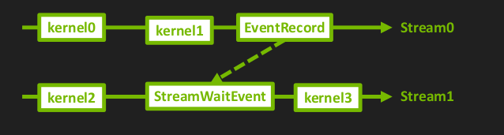

* 使用 pinned-memory

  通常我们使用的CPU内存是可分页的，可以被交换到文件中以减少内存的使用量，但是pinned memory是不可分页的，一定在内存中。我们使用cuda的异步函数调用是一定要使用pinned memory。因为例如异步内存拷贝等都是异步的，真正执行的时候可能需要的内存被交换出去了，又要再换回来，浪费时间。


```python
import os
from time import time

import numpy as np
import tensorrt as trt
from cuda import cudart

trtFile = "./model.plan"
np.random.seed(31193)

nWarmUp = 10
nTest = 30

# There are 3 scenarios of the inference
# 1. HtoD-bound

nB, nC, nH, nW = 8, 64, 256, 256
nCOut, nKernelHeight, nKernelWidth = 1, 3, 3

# 2. Calculation-bound
"""
nB,nC,nH,nW = 8,64,128,128
nCOut,nKernelHeight,nKernelWidth    = 64,9,9
"""
# 3. DtoH-bound
"""
nB,nC,nH,nW = 8,64,128,128
nCOut,nKernelHeight,nKernelWidth    = 256,3,3
"""

def getEngine():
    logger = trt.Logger(trt.Logger.ERROR)
    if os.path.isfile(trtFile):
        with open(trtFile, "rb") as f:
            engineString = f.read()
        if engineString == None:
            print("Failed getting serialized engine!")
            return
        print("Succeeded getting serialized engine!")
    else:
        builder = trt.Builder(logger)
        network = builder.create_network(1 << int(trt.NetworkDefinitionCreationFlag.EXPLICIT_BATCH))
        profile = builder.create_optimization_profile()
        config = builder.create_builder_config()

        inputTensor = network.add_input("inputT0", trt.float32, [-1, nC, nH, nW])
        profile.set_shape(inputTensor.name, [1, nC, nH, nW], [nB, nC, nH, nW], [nB * 2, nC, nH, nW])
        config.add_optimization_profile(profile)

        w = np.ascontiguousarray(np.random.rand(nCOut, nC, nKernelHeight, nKernelWidth).astype(np.float32) * 2 - 1)
        b = np.ascontiguousarray(np.random.rand(nCOut).astype(np.float32) * 2 - 1)
        _0 = network.add_convolution_nd(inputTensor, nCOut, [nKernelHeight, nKernelWidth], trt.Weights(w), trt.Weights(b))
        _0.padding_nd = (nKernelHeight // 2, nKernelWidth // 2)
        _1 = network.add_activation(_0.get_output(0), trt.ActivationType.RELU)

        network.mark_output(_1.get_output(0))
        engineString = builder.build_serialized_network(network, config)
        if engineString == None:
            print("Failed building serialized engine!")
            return
        print("Succeeded building serialized engine!")
        with open(trtFile, "wb") as f:
            f.write(engineString)
            print("Succeeded saving .plan file!")

    return trt.Runtime(logger).deserialize_cuda_engine(engineString)

def run1(engine):
    context = engine.create_execution_context()
    context.set_binding_shape(0, [nB, nC, nH, nW])
    _, stream = cudart.cudaStreamCreate()

    data = np.random.rand(nB * nC * nH * nW).astype(np.float32).reshape(nB, nC, nH, nW)
    inputH0 = np.ascontiguousarray(data.reshape(-1))
    outputH0 = np.empty(context.get_binding_shape(1), dtype=trt.nptype(engine.get_binding_dtype(1)))
    _, inputD0 = cudart.cudaMallocAsync(inputH0.nbytes, stream)
    _, outputD0 = cudart.cudaMallocAsync(outputH0.nbytes, stream)

    # do a complete inference
    cudart.cudaMemcpyAsync(inputD0, inputH0.ctypes.data, inputH0.nbytes, cudart.cudaMemcpyKind.cudaMemcpyHostToDevice, stream)
    context.execute_async_v2([int(inputD0), int(outputD0)], stream)
    cudart.cudaMemcpyAsync(outputH0.ctypes.data, outputD0, outputH0.nbytes, cudart.cudaMemcpyKind.cudaMemcpyDeviceToHost, stream)
    cudart.cudaStreamSynchronize(stream)

    # Count time of memory copy from host to device
    for i in range(nWarmUp):
        cudart.cudaMemcpyAsync(inputD0, inputH0.ctypes.data, inputH0.nbytes, cudart.cudaMemcpyKind.cudaMemcpyHostToDevice, stream)

    trtTimeStart = time()
    for i in range(nTest):
        cudart.cudaMemcpyAsync(inputD0, inputH0.ctypes.data, inputH0.nbytes, cudart.cudaMemcpyKind.cudaMemcpyHostToDevice, stream)
    cudart.cudaStreamSynchronize(stream)
    trtTimeEnd = time()
    print("%6.3fms - 1 stream, DataCopyHtoD" % ((trtTimeEnd - trtTimeStart) / nTest * 1000))

    # Count time of inference
    for i in range(nWarmUp):
        context.execute_async_v2([int(inputD0), int(outputD0)], stream)

    trtTimeStart = time()
    for i in range(nTest):
        context.execute_async_v2([int(inputD0), int(outputD0)], stream)
    cudart.cudaStreamSynchronize(stream)
    trtTimeEnd = time()
    print("%6.3fms - 1 stream, Inference" % ((trtTimeEnd - trtTimeStart) / nTest * 1000))

    # Count time of memory copy from device to host
    for i in range(nWarmUp):
        cudart.cudaMemcpyAsync(outputH0.ctypes.data, outputD0, outputH0.nbytes, cudart.cudaMemcpyKind.cudaMemcpyDeviceToHost, stream)

    trtTimeStart = time()
    for i in range(nTest):
        cudart.cudaMemcpyAsync(outputH0.ctypes.data, outputD0, outputH0.nbytes, cudart.cudaMemcpyKind.cudaMemcpyDeviceToHost, stream)
    cudart.cudaStreamSynchronize(stream)
    trtTimeEnd = time()
    print("%6.3fms - 1 stream, DataCopyDtoH" % ((trtTimeEnd - trtTimeStart) / nTest * 1000))

    # Count time of end to end
    for i in range(nWarmUp):
        context.execute_async_v2([int(inputD0), int(outputD0)], stream)

    trtTimeStart = time()
    for i in range(nTest):
        cudart.cudaMemcpyAsync(inputD0, inputH0.ctypes.data, inputH0.nbytes, cudart.cudaMemcpyKind.cudaMemcpyHostToDevice, stream)
        context.execute_async_v2([int(inputD0), int(outputD0)], stream)
        cudart.cudaMemcpyAsync(outputH0.ctypes.data, outputD0, outputH0.nbytes, cudart.cudaMemcpyKind.cudaMemcpyDeviceToHost, stream)
    cudart.cudaStreamSynchronize(stream)
    trtTimeEnd = time()
    print("%6.3fms - 1 stream, DataCopy + Inference" % ((trtTimeEnd - trtTimeStart) / nTest * 1000))

    cudart.cudaStreamDestroy(stream)
    cudart.cudaFree(inputD0)
    cudart.cudaFree(outputD0)

def run2(engine):
    context = engine.create_execution_context()
    context.set_binding_shape(0, [nB, nC, nH, nW])
    _, stream0 = cudart.cudaStreamCreate()
    _, stream1 = cudart.cudaStreamCreate()
    _, event0 = cudart.cudaEventCreate()
    _, event1 = cudart.cudaEventCreate()

    data = np.random.rand(nB * nC * nH * nW).astype(np.float32).reshape(nB, nC, nH, nW)
    inputSize = trt.volume(context.get_binding_shape(0)) * np.array([0], dtype=trt.nptype(engine.get_binding_dtype(0))).nbytes
    outputSize = trt.volume(context.get_binding_shape(1)) * np.array([0], dtype=trt.nptype(engine.get_binding_dtype(1))).nbytes
    _, inputH0 = cudart.cudaHostAlloc(inputSize, cudart.cudaHostAllocWriteCombined)
    _, inputH1 = cudart.cudaHostAlloc(inputSize, cudart.cudaHostAllocWriteCombined)
    _, outputH0 = cudart.cudaHostAlloc(outputSize, cudart.cudaHostAllocWriteCombined)
    _, outputH1 = cudart.cudaHostAlloc(outputSize, cudart.cudaHostAllocWriteCombined)
    _, inputD0 = cudart.cudaMallocAsync(inputSize, stream0)
    _, inputD1 = cudart.cudaMallocAsync(inputSize, stream1)
    _, outputD0 = cudart.cudaMallocAsync(outputSize, stream0)
    _, outputD1 = cudart.cudaMallocAsync(outputSize, stream1)

    # Count time of end to end
    for i in range(nWarmUp):
        context.execute_async_v2([int(inputD0), int(outputD0)], stream0)

    trtTimeStart = time()
    cudart.cudaEventRecord(event1, stream1)

    for i in range(nTest):
        inputH, outputH = [inputH1, outputH1] if i & 1 else [inputH0, outputH0]
        inputD, outputD = [inputD1, outputD1] if i & 1 else [inputD0, outputD0]
        eventBefore, eventAfter = [event0, event1] if i & 1 else [event1, event0]
        stream = stream1 if i & 1 else stream0

        cudart.cudaMemcpyAsync(inputD, inputH, inputSize, cudart.cudaMemcpyKind.cudaMemcpyHostToDevice, stream)
        cudart.cudaStreamWaitEvent(stream, eventBefore, cudart.cudaEventWaitDefault)
        context.execute_async_v2([int(inputD), int(outputD)], stream)
        cudart.cudaEventRecord(eventAfter, stream)
        cudart.cudaMemcpyAsync(outputH, outputD, outputSize, cudart.cudaMemcpyKind.cudaMemcpyDeviceToHost, stream)
    """# split the loop into odd and even iterations
    for i in range(nTest//2):
        cudart.cudaMemcpyAsync(inputD0, inputH0, inputSize, cudart.cudaMemcpyKind.cudaMemcpyHostToDevice, stream0)
        cudart.cudaStreamWaitEvent(stream0,event1,cudart.cudaEventWaitDefault)
        context.execute_async_v2([int(inputD0), int(outputD0)], stream0)
        cudart.cudaEventRecord(event0,stream0)
        cudart.cudaMemcpyAsync(outputH0, outputD0, outputSize, cudart.cudaMemcpyKind.cudaMemcpyDeviceToHost, stream0)

        cudart.cudaMemcpyAsync(inputD1, inputH1, inputSize, cudart.cudaMemcpyKind.cudaMemcpyHostToDevice, stream1)
        cudart.cudaStreamWaitEvent(stream1,event0,cudart.cudaEventWaitDefault)
        context.execute_async_v2([int(inputD1), int(outputD1)], stream1)
        cudart.cudaEventRecord(event1,stream1)
        cudart.cudaMemcpyAsync(outputH1, outputD1, outputSize, cudart.cudaMemcpyKind.cudaMemcpyDeviceToHost, stream1)
    """
    cudart.cudaEventSynchronize(event1)
    trtTimeEnd = time()
    print("%6.3fms - 2 stream, DataCopy + Inference" % ((trtTimeEnd - trtTimeStart) / nTest * 1000))

if __name__ == "__main__":
    os.system("rm -rf ./*.plan")
    cudart.cudaDeviceSynchronize()
    engine = getEngine()  # build TensorRT engine
    run1(engine)  # do inference with single stream
    run2(engine)  # do inference with double stream

```

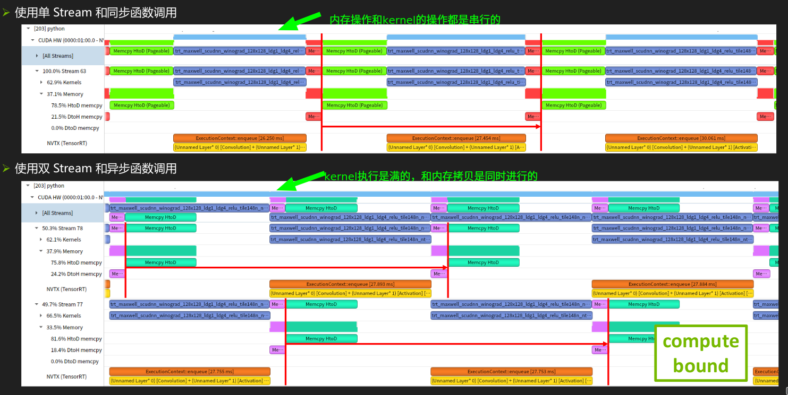

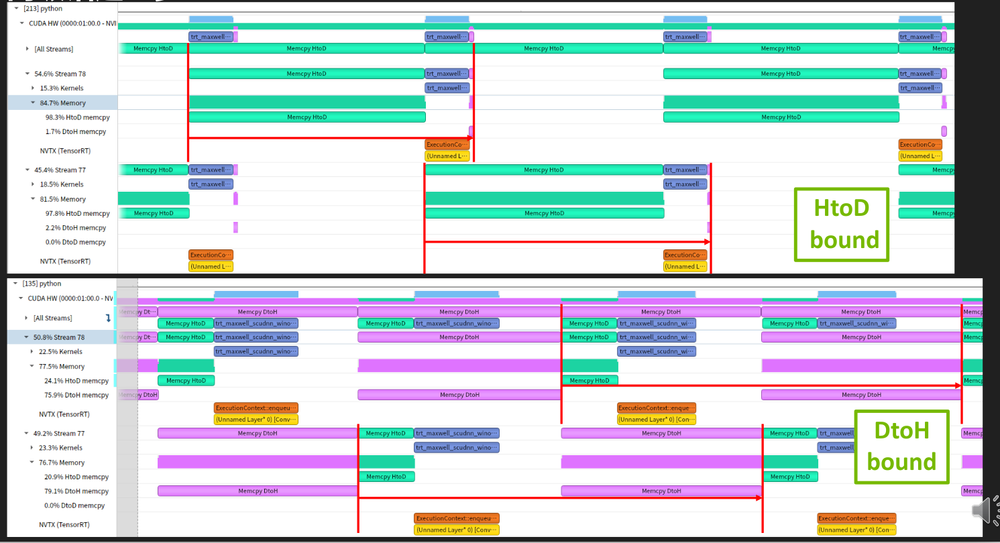

## 2.3 多Context

一个 Engine 供多个 Context 共用，之占用一个engine的显存，供多个线程推理计算。

* 范例代码08-Advance\MultiContext
* 要点
  * 从 engine 中创建多个 context
    * contextList = [engine.create_execution_context() for index in range(nContext)
  *  不再需要使用多个 OptimizationProfile （从TensorRT8.6开始），可以从示例代码中看细节

```python

import numpy as np
import tensorrt as trt
from cuda import cudart

shape = [2, 3, 4, 5]
nProfile = 2  # count of OptimizationProfile
np.random.seed(31193)
np.set_printoptions(precision=3, linewidth=200, suppress=True)
cudart.cudaDeviceSynchronize()

logger = trt.Logger(trt.Logger.ERROR)
builder = trt.Builder(logger)
network = builder.create_network(1 << int(trt.NetworkDefinitionCreationFlag.EXPLICIT_BATCH))
profileList = [builder.create_optimization_profile() for _ in range(nProfile)]
config = builder.create_builder_config()

inputT0 = network.add_input("inputT0", trt.float32, [-1, -1, -1, -1])
inputT1 = network.add_input("inputT1", trt.float32, [-1, -1, -1, -1])
for profile in profileList:
    profile.set_shape(inputT0.name, shape, shape, [k * nProfile for k in shape])  # "* nProfile" is just for this example, not required in real use case
    profile.set_shape(inputT1.name, shape, shape, [k * nProfile for k in shape])
    config.add_optimization_profile(profile)

layer = network.add_elementwise(inputT0, inputT1, trt.ElementWiseOperation.SUM)
network.mark_output(layer.get_output(0))
engineString = builder.build_serialized_network(network, config)
engine = trt.Runtime(logger).deserialize_cuda_engine(engineString)
nIO = engine.num_io_tensors
lTensorName = [engine.get_tensor_name(i) for i in range(nIO)]
nInput = [engine.get_tensor_mode(lTensorName[i]) for i in range(nIO)].count(trt.TensorIOMode.INPUT)

context = engine.create_execution_context()

for index in range(nProfile):
    print("Use Profile %d" % index)
    context.set_optimization_profile_async(index, 0)  # use default stream
    inputShape = [k * (index + 1) for k in shape]  # we use different shape for various context in this example, not required in real use case
    context.set_input_shape(lTensorName[0], inputShape)
    context.set_input_shape(lTensorName[1], inputShape)
    bufferH = []  # use respective buffers for different Optimization Profile
    for i in range(nInput):
        bufferH.append(np.arange(np.prod(inputShape)).astype(np.float32).reshape(inputShape))
    for i in range(nInput, nIO):
        bufferH.append(np.empty(context.get_tensor_shape(lTensorName[i]), dtype=trt.nptype(engine.get_tensor_dtype(lTensorName[i]))))

    bufferD = []
    for i in range(len(bufferH)):
        bufferD.append(cudart.cudaMalloc(bufferH[i].nbytes)[1])

    for i in range(nIO):
        print("[%2d]%s->" % (i, "Input " if i < nInput else "Output"), engine.get_tensor_dtype(lTensorName[i]), engine.get_tensor_shape(lTensorName[i]), context.get_tensor_shape(lTensorName[i]), lTensorName[i])

    for i in range(nInput):
        cudart.cudaMemcpyAsync(bufferD[i], bufferH[i].ctypes.data, bufferH[i].nbytes, cudart.cudaMemcpyKind.cudaMemcpyHostToDevice, 0)

    for i in range(nIO):
        context.set_tensor_address(lTensorName[i], int(bufferD[i]))

    context.execute_async_v3(0)

    for i in range(nInput, nIO):
        cudart.cudaMemcpyAsync(bufferH[i].ctypes.data, bufferD[i], bufferH[i].nbytes, cudart.cudaMemcpyKind.cudaMemcpyDeviceToHost, 0)

    print("check result of OptimizationProfile %d: %s" % (index, np.all(bufferH[2] == bufferH[0] + bufferH[1])))

    for b in bufferD:
        cudart.cudaFree(b)
```


## 2.4 CUDA Graph

利用cuda Graph优化 Kernel 的调用，减少 Launch Bound 的发生

* 范例代码 08-Advance\CudaGraph

* 优点：
  * 降低 CPU Launch cost
  * CUDA 工作流优化
  * 缓解大量 kernel 调用时的 Launch Bound
* 要点
  * 步骤：Graph 定义， Graph 实例化， Graph 执行（捕获 CUDA Graph 之前要运行一次推理）
  * Dynamic Shape 模式中，实际数据形状发生改变时（调用 context.set_binding_shape），
    要先跑一遍 context.execute 再重新捕获 Graph，最后再实例化和执行 Graph

```python
/*
 * Copyright (c) 2021-2023, NVIDIA CORPORATION. All rights reserved.

 *
 * Licensed under the Apache License, Version 2.0 (the "License");
 * you may not use this file except in compliance with the License.
 * You may obtain a copy of the License at
 *
 *     http://www.apache.org/licenses/LICENSE-2.0
 *
 * Unless required by applicable law or agreed to in writing, software
 * distributed under the License is distributed on an "AS IS" BASIS,
 * WITHOUT WARRANTIES OR CONDITIONS OF ANY KIND, either express or implied.
 * See the License for the specific language governing permissions and
 * limitations under the License.
 */

#include "cookbookHelper.cuh"

using namespace nvinfer1;

const std::string trtFile {"./model.plan"};
static Logger     gLogger(ILogger::Severity::kERROR);

void run()
{
    ICudaEngine *engine = nullptr;

    if (access(trtFile.c_str(), F_OK) == 0)
    {
        std::ifstream engineFile(trtFile, std::ios::binary);
        long int      fsize = 0;

        engineFile.seekg(0, engineFile.end);
        fsize = engineFile.tellg();
        engineFile.seekg(0, engineFile.beg);
        std::vector<char> engineString(fsize);
        engineFile.read(engineString.data(), fsize);
        if (engineString.size() == 0)
        {
            std::cout << "Failed getting serialized engine!" << std::endl;
            return;
        }
        std::cout << "Succeeded getting serialized engine!" << std::endl;

        IRuntime *runtime {createInferRuntime(gLogger)};
        engine = runtime->deserializeCudaEngine(engineString.data(), fsize);
        if (engine == nullptr)
        {
            std::cout << "Failed loading engine!" << std::endl;
            return;
        }
        std::cout << "Succeeded loading engine!" << std::endl;
    }
    else
    {
        IBuilder             *builder = createInferBuilder(gLogger);
        INetworkDefinition   *network = builder->createNetworkV2(1U << int(NetworkDefinitionCreationFlag::kEXPLICIT_BATCH));
        IOptimizationProfile *profile = builder->createOptimizationProfile();
        IBuilderConfig       *config  = builder->createBuilderConfig();
        config->setMemoryPoolLimit(MemoryPoolType::kWORKSPACE, 1 << 30);

        ITensor *inputTensor = network->addInput("inputT0", DataType::kFLOAT, Dims32 {3, {-1, -1, -1}});
        profile->setDimensions(inputTensor->getName(), OptProfileSelector::kMIN, Dims32 {3, {1, 1, 1}});
        profile->setDimensions(inputTensor->getName(), OptProfileSelector::kOPT, Dims32 {3, {3, 4, 5}});
        profile->setDimensions(inputTensor->getName(), OptProfileSelector::kMAX, Dims32 {3, {6, 8, 10}});
        config->addOptimizationProfile(profile);

        IIdentityLayer *identityLayer = network->addIdentity(*inputTensor);
        network->markOutput(*identityLayer->getOutput(0));
        IHostMemory *engineString = builder->buildSerializedNetwork(*network, *config);
        if (engineString == nullptr || engineString->size() == 0)
        {
            std::cout << "Failed building serialized engine!" << std::endl;
            return;
        }
        std::cout << "Succeeded building serialized engine!" << std::endl;

        IRuntime *runtime {createInferRuntime(gLogger)};
        engine = runtime->deserializeCudaEngine(engineString->data(), engineString->size());
        if (engine == nullptr)
        {
            std::cout << "Failed building engine!" << std::endl;
            return;
        }
        std::cout << "Succeeded building engine!" << std::endl;

        std::ofstream engineFile(trtFile, std::ios::binary);
        if (!engineFile)
        {
            std::cout << "Failed opening file to write" << std::endl;
            return;
        }
        engineFile.write(static_cast<char *>(engineString->data()), engineString->size());
        if (engineFile.fail())
        {
            std::cout << "Failed saving .plan file!" << std::endl;
            return;
        }
        std::cout << "Succeeded saving .plan file!" << std::endl;
    }

    IExecutionContext *context = engine->createExecutionContext();
    context->setBindingDimensions(0, Dims32 {3, {3, 4, 5}});
    std::cout << std::string("Binding all? ") << std::string(context->allInputDimensionsSpecified() ? "Yes" : "No") << std::endl;
    int nBinding = engine->getNbBindings();
    int nInput   = 0;
    for (int i = 0; i < nBinding; ++i)
    {
        nInput += int(engine->bindingIsInput(i));
    }
    int nOutput = nBinding - nInput;
    for (int i = 0; i < nBinding; ++i)
    {
        std::cout << std::string("Bind[") << i << std::string(i < nInput ? "]:i[" : "]:o[") << (i < nInput ? i : i - nInput) << std::string("]->");
        std::cout << dataTypeToString(engine->getBindingDataType(i)) << std::string(" ");
        std::cout << shapeToString(context->getBindingDimensions(i)) << std::string(" ");
        std::cout << engine->getBindingName(i) << std::endl;
    }

    std::vector<int> vBindingSize(nBinding, 0);
    for (int i = 0; i < nBinding; ++i)
    {
        Dims32 dim  = context->getBindingDimensions(i);
        int    size = 1;
        for (int j = 0; j < dim.nbDims; ++j)
        {
            size *= dim.d[j];
        }
        vBindingSize[i] = size * dataTypeToSize(engine->getBindingDataType(i));
    }

    std::vector<void *> vBufferH {nBinding, nullptr};
    std::vector<void *> vBufferD {nBinding, nullptr};
    for (int i = 0; i < nBinding; ++i)
    {
        vBufferH[i] = (void *)new char[vBindingSize[i]];
        CHECK(cudaMalloc(&vBufferD[i], vBindingSize[i]));
    }

    float *pData = (float *)vBufferH[0];
    for (int i = 0; i < vBindingSize[0] / dataTypeToSize(engine->getBindingDataType(0)); ++i)
    {
        pData[i] = float(i);
    }

    int  inputSize = 3 * 4 * 5, outputSize = 1;
    Dims outputShape = context->getBindingDimensions(1);
    for (int i = 0; i < outputShape.nbDims; ++i)
    {
        outputSize *= outputShape.d[i];
    }
    std::vector<float>  inputH0(inputSize, 1.0f);
    std::vector<float>  outputH0(outputSize, 0.0f);
    std::vector<void *> binding = {nullptr, nullptr};
    CHECK(cudaMalloc(&binding[0], sizeof(float) * inputSize));
    CHECK(cudaMalloc(&binding[1], sizeof(float) * outputSize));
    for (int i = 0; i < inputSize; ++i)
    {
        inputH0[i] = (float)i;
    }

    // 运行推理和使用 CUDA Graph 要用的流
    cudaStream_t stream;
    CHECK(cudaStreamCreate(&stream));

    // 捕获 CUDA Graph 之前要运行一次推理，https://docs.nvidia.com/deeplearning/tensorrt/api/c_api/classnvinfer1_1_1_i_execution_context.html#a2f4429652736e8ef6e19f433400108c7
    for (int i = 0; i < nInput; ++i)
    {
        CHECK(cudaMemcpyAsync(vBufferD[i], vBufferH[i], vBindingSize[i], cudaMemcpyHostToDevice, stream));
    }

    context->enqueueV2(vBufferD.data(), stream, nullptr);

    for (int i = nInput; i < nBinding; ++i)
    {
        CHECK(cudaMemcpyAsync(vBufferH[i], vBufferD[i], vBindingSize[i], cudaMemcpyDeviceToHost, stream));
    }
    cudaStreamSynchronize(stream); // 不用在 graph 内同步

    for (int i = 0; i < nBinding; ++i)
    {
        printArrayInformation((float *)vBufferH[i], context->getBindingDimensions(i), std::string(engine->getBindingName(i)), true, true);
    }

    // 首次捕获 CUDA Graph 并运行推理
    cudaGraph_t     graph;
    cudaGraphExec_t graphExec = nullptr;
    cudaStreamBeginCapture(stream, cudaStreamCaptureModeGlobal);
    for (int i = 0; i < nInput; ++i)
    {
        CHECK(cudaMemcpyAsync(vBufferD[i], vBufferH[i], vBindingSize[i], cudaMemcpyHostToDevice, stream));
    }

    context->enqueueV2(vBufferD.data(), stream, nullptr);

    for (int i = nInput; i < nBinding; ++i)
    {
        CHECK(cudaMemcpyAsync(vBufferH[i], vBufferD[i], vBindingSize[i], cudaMemcpyDeviceToHost, stream));
    }
    //cudaStreamSynchronize(stream); // 不用在 graph 内同步
    cudaStreamEndCapture(stream, &graph);
    cudaGraphInstantiate(&graphExec, graph, nullptr, nullptr, 0);

    cudaGraphLaunch(graphExec, stream);
    cudaStreamSynchronize(stream);

    // 输入尺寸改变后，也需要首先运行一次推理，然后重新捕获 CUDA Graph，最后再运行推理
    context->setBindingDimensions(0, Dims32 {3, {2, 3, 4}});
    std::cout << std::string("Binding all? ") << std::string(context->allInputDimensionsSpecified() ? "Yes" : "No") << std::endl;

    for (int i = 0; i < nBinding; ++i)
    {
        Dims32 dim  = context->getBindingDimensions(i);
        int    size = 1;
        for (int j = 0; j < dim.nbDims; ++j)
        {
            size *= dim.d[j];
        }
        vBindingSize[i] = size * dataTypeToSize(engine->getBindingDataType(i));
    }

    // 这里偷懒，因为本次推理绑定的输入输出数据形状不大于上一次推理，所以这里不再重新准备所有 buffer

    for (int i = 0; i < nInput; ++i)
    {
        CHECK(cudaMemcpyAsync(vBufferD[i], vBufferH[i], vBindingSize[i], cudaMemcpyHostToDevice, stream));
    }

    context->enqueueV2(vBufferD.data(), stream, nullptr);

    for (int i = nInput; i < nBinding; ++i)
    {
        CHECK(cudaMemcpyAsync(vBufferH[i], vBufferD[i], vBindingSize[i], cudaMemcpyDeviceToHost, stream));
    }
    cudaStreamSynchronize(stream); // 不用在 graph 内同步

    for (int i = 0; i < nBinding; ++i)
    {
        printArrayInformation((float *)vBufferH[i], context->getBindingDimensions(i), std::string(engine->getBindingName(i)), true, true);
    }

    // 再次捕获 CUDA Graph 并运行推理
    cudaStreamBeginCapture(stream, cudaStreamCaptureModeGlobal);
    for (int i = 0; i < nInput; ++i)
    {
        CHECK(cudaMemcpyAsync(vBufferD[i], vBufferH[i], vBindingSize[i], cudaMemcpyHostToDevice, stream));
    }

    context->enqueueV2(vBufferD.data(), stream, nullptr);

    for (int i = nInput; i < nBinding; ++i)
    {
        CHECK(cudaMemcpyAsync(vBufferH[i], vBufferD[i], vBindingSize[i], cudaMemcpyDeviceToHost, stream));
    }
    //cudaStreamSynchronize(stream); // 不用在 graph 内同步
    cudaStreamEndCapture(stream, &graph);
    cudaGraphInstantiate(&graphExec, graph, nullptr, nullptr, 0);

    cudaGraphLaunch(graphExec, stream);
    cudaStreamSynchronize(stream);

    cudaStreamDestroy(stream);

    for (int i = 0; i < nBinding; ++i)
    {
        delete[] vBufferH[i];
        CHECK(cudaFree(vBufferD[i]));
    }
    return;
}

int main()
{
    CHECK(cudaSetDevice(0));
    run();
    run();
    return 0;
}

```

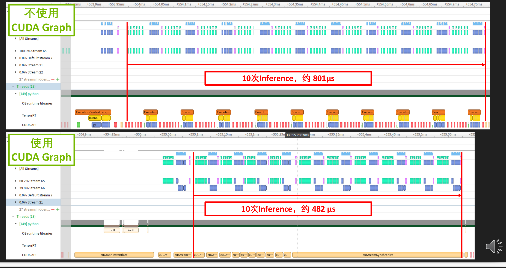

## 2.5 Timing Cache

engine 构建时间太长，使用timing cache节约多次构建时的时间

* 范例代码：08-Advance\TimingCache
* 优点：
  * 优化单次引擎构建时间（模型内多个同参数的算子）
  * 优化多次引擎构建时间（debug、参数更新后重新构建）
  * 优化同环境下多个引擎构建时间（跨 builder 可用）
  * 用于反复生成一模一样的引擎
* 要点
  * 类似引擎序列化反序列化，将 Timing Cache 保存出来下次用
  * 类似 .plan，不可跨平台和开发环境使用

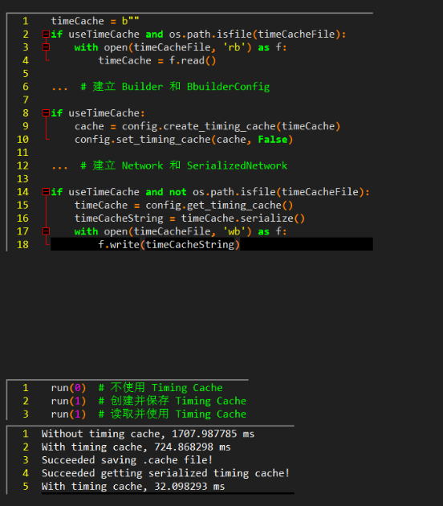

```python
#
# Copyright (c) 2021-2022, NVIDIA CORPORATION. All rights reserved.
#
# Licensed under the Apache License, Version 2.0 (the "License");
# you may not use this file except in compliance with the License.
# You may obtain a copy of the License at
#
#     http://www.apache.org/licenses/LICENSE-2.0
#
# Unless required by applicable law or agreed to in writing, software
# distributed under the License is distributed on an "AS IS" BASIS,
# WITHOUT WARRANTIES OR CONDITIONS OF ANY KIND, either express or implied.
# See the License for the specific language governing permissions and
# limitations under the License.
#

from cuda import cudart
import numpy as np
import os
import tensorrt as trt
from time import time

trtFile = "./model.plan"
timeCacheFile = "./model.cache"
nB, nC, nH, nW = 1, 1, 28, 28
data = np.random.rand(nB, nC, nH, nW).astype(np.float32) * 2 - 1
np.random.seed(31193)

def run(bUseTimeCache):
    logger = trt.Logger(trt.Logger.ERROR)
    timeCache = b""
    if bUseTimeCache and os.path.isfile(timeCacheFile):
        with open(timeCacheFile, "rb") as f:
            timeCache = f.read()
        if timeCache == None:
            print("Failed getting serialized timing cache!")
            return
        print("Succeeded getting serialized timing cache!")

    builder = trt.Builder(logger)
    network = builder.create_network(1 << int(trt.NetworkDefinitionCreationFlag.EXPLICIT_BATCH))
    profile = builder.create_optimization_profile()
    config = builder.create_builder_config()
    config.set_memory_pool_limit(trt.MemoryPoolType.WORKSPACE, 7 << 30)
    if bUseTimeCache:
        cache = config.create_timing_cache(timeCache)
        config.set_timing_cache(cache, False)

    inputTensor = network.add_input("inputT0", trt.float32, [-1, nC, nH, nW])
    profile.set_shape(inputTensor.name, [nB, nC, nH, nW], [nB, nC, nH, nW], [nB * 2, nC, nH, nW])
    config.add_optimization_profile(profile)

    w = np.ascontiguousarray(np.random.rand(32, 1, 5, 5).astype(np.float32))
    b = np.ascontiguousarray(np.random.rand(32).astype(np.float32))
    _0 = network.add_convolution_nd(inputTensor, 32, [5, 5], w, b)
    _0.padding_nd = [2, 2]
    _1 = network.add_activation(_0.get_output(0), trt.ActivationType.RELU)
    _2 = network.add_pooling_nd(_1.get_output(0), trt.PoolingType.MAX, [2, 2])
    _2.stride_nd = [2, 2]

    w = np.ascontiguousarray(np.random.rand(64, 32, 5, 5).astype(np.float32))
    b = np.ascontiguousarray(np.random.rand(64).astype(np.float32))
    _3 = network.add_convolution_nd(_2.get_output(0), 64, [5, 5], w, b)
    _3.padding_nd = [2, 2]
    _4 = network.add_activation(_3.get_output(0), trt.ActivationType.RELU)
    _5 = network.add_pooling_nd(_4.get_output(0), trt.PoolingType.MAX, [2, 2])
    _5.stride_nd = [2, 2]

    _6 = network.add_shuffle(_5.get_output(0))
    _6.first_transpose = (0, 2, 3, 1)
    _6.reshape_dims = (-1, 64 * 7 * 7)

    w = np.ascontiguousarray(np.random.rand(64 * 7 * 7, 1024).astype(np.float32))
    b = np.ascontiguousarray(np.random.rand(1, 1024).astype(np.float32))
    _7 = network.add_constant(w.shape, trt.Weights(w))
    _8 = network.add_matrix_multiply(_6.get_output(0), trt.MatrixOperation.NONE, _7.get_output(0), trt.MatrixOperation.NONE)
    _9 = network.add_constant(b.shape, trt.Weights(b))
    _10 = network.add_elementwise(_8.get_output(0), _9.get_output(0), trt.ElementWiseOperation.SUM)
    _11 = network.add_activation(_10.get_output(0), trt.ActivationType.RELU)

    w = np.ascontiguousarray(np.random.rand(1024, 10).astype(np.float32))
    b = np.ascontiguousarray(np.random.rand(1, 10).astype(np.float32))
    _12 = network.add_constant(w.shape, trt.Weights(w))
    _13 = network.add_matrix_multiply(_11.get_output(0), trt.MatrixOperation.NONE, _12.get_output(0), trt.MatrixOperation.NONE)
    _14 = network.add_constant(b.shape, trt.Weights(b))
    _15 = network.add_elementwise(_13.get_output(0), _14.get_output(0), trt.ElementWiseOperation.SUM)

    _16 = network.add_softmax(_15.get_output(0))
    _16.axes = 1 << 1

    _17 = network.add_topk(_16.get_output(0), trt.TopKOperation.MAX, 1, 1 << 1)

    network.mark_output(_17.get_output(1))

    t0 = time()
    engineString = builder.build_serialized_network(network, config)
    t1 = time()
    print("%s timing cache, %f ms" % ("With" if bUseTimeCache else "Without", (t1 - t0) * 1000))

    if bUseTimeCache and not os.path.isfile(timeCacheFile):
        timeCache = config.get_timing_cache()
        timeCacheString = timeCache.serialize()
        with open(timeCacheFile, "wb") as f:
            f.write(timeCacheString)
            print("Succeeded saving .cache file!")

    engine = trt.Runtime(logger).deserialize_cuda_engine(engineString)

    context = engine.create_execution_context()
    context.set_binding_shape(0, [nB, nC, nH, nW])
    nInput = np.sum([engine.binding_is_input(i) for i in range(engine.num_bindings)])
    nOutput = engine.num_bindings - nInput
    for i in range(nInput):
        print("Bind[%2d]:i[%2d]->" % (i, i), engine.get_binding_dtype(i), engine.get_binding_shape(i), context.get_binding_shape(i), engine.get_binding_name(i))
    for i in range(nInput, nInput + nOutput):
        print("Bind[%2d]:o[%2d]->" % (i, i - nInput), engine.get_binding_dtype(i), engine.get_binding_shape(i), context.get_binding_shape(i), engine.get_binding_name(i))

    bufferH = []
    bufferH.append(np.ascontiguousarray(data))
    for i in range(nInput, nInput + nOutput):
        bufferH.append(np.empty(context.get_binding_shape(i), dtype=trt.nptype(engine.get_binding_dtype(i))))
    bufferD = []
    for i in range(nInput + nOutput):
        bufferD.append(cudart.cudaMalloc(bufferH[i].nbytes)[1])

    for i in range(nInput):
        cudart.cudaMemcpy(bufferD[i], bufferH[i].ctypes.data, bufferH[i].nbytes, cudart.cudaMemcpyKind.cudaMemcpyHostToDevice)

    context.execute_v2(bufferD)

    for i in range(nInput, nInput + nOutput):
        cudart.cudaMemcpy(bufferH[i].ctypes.data, bufferD[i], bufferH[i].nbytes, cudart.cudaMemcpyKind.cudaMemcpyDeviceToHost)

    #for i in range(nInput + nOutput):
    #    print(engine.get_binding_name(i))
    #    print(bufferH[i])

    for b in bufferD:
        cudart.cudaFree(b)

if __name__ == "__main__":
    os.system("rm -rf ./*.cache")
    np.set_printoptions(precision=3, linewidth=200, suppress=True)
    cudart.cudaDeviceSynchronize()

    run(0)  # 不使用 Timing Cache
    run(0)  # 不使用 Timing Cache 再次构建
    run(1)  # 创建并保存 Timing Cache
    run(1)  # 读取并使用 Timing Cache

```

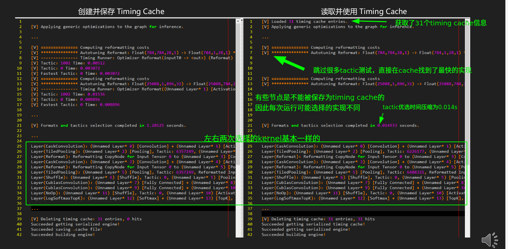

## 2.6 Algorithm Selector

TensorRT的kernel优选过程是一个黑箱，某些layer的选择可能造成较大的误差，我们需要筛选或排除某些算法。需要用到算法选择器。

* 样例代码08-Advance\AlgorithmSelector
* 要点
  * 自己实现一个 MyAlgorithmSelector 类
  * 关键是实现两个成员函数
    * 一个用来挑选特定层的算法
    * 一个用来报告所有层的挑选结果
  * 构建网络时交给 BuilderConfig
* 实际工作流程：
  * 先通过 polygraphy 等工具发现某层的个 Tactic 结果不理想
  * 构造 Algorithm Selector 屏蔽掉盖层的该 tactic
  * 构建引擎

```python
#
# Copyright (c) 2021-2023, NVIDIA CORPORATION. All rights reserved.
#
# Licensed under the Apache License, Version 2.0 (the "License");
# you may not use this file except in compliance with the License.
# You may obtain a copy of the License at
#
#     http://www.apache.org/licenses/LICENSE-2.0
#
# Unless required by applicable law or agreed to in writing, software
# distributed under the License is distributed on an "AS IS" BASIS,
# WITHOUT WARRANTIES OR CONDITIONS OF ANY KIND, either express or implied.
# See the License for the specific language governing permissions and
# limitations under the License.
#

import numpy as np
import tensorrt as trt
from cuda import cudart

shape = [1, 1, 28, 28]
np.random.seed(31193)
data = np.random.rand(np.prod(shape)).astype(np.float32).reshape(shape) * 2 - 1
np.set_printoptions(precision=3, linewidth=200, suppress=True)
cudart.cudaDeviceSynchronize()

def getSizeString(xByte):
    if xByte < (1 << 10):
        return "%5.1f  B" % xByte
    if xByte < (1 << 20):
        return "%5.1fKiB" % (xByte / (1 << 10))
    if xByte < (1 << 30):
        return "%5.1fMiB" % (xByte / (1 << 20))
    return "%5.1fGiB" % (xByte / (1 << 30))

class MyAlgorithmSelector(trt.IAlgorithmSelector):

    def __init__(self, iStrategy=0):  # initialize with a number of our customerized strategies to select algorithm
        super(MyAlgorithmSelector, self).__init__()
        self.iStrategy = iStrategy

    def select_algorithms(self, layerAlgorithmContext, layerAlgorithmList):
        # we print the alternative algorithms of each layer here
        nInput = layerAlgorithmContext.num_inputs
        nOutput = layerAlgorithmContext.num_outputs
        print("Layer %s,in=%d,out=%d" % (layerAlgorithmContext.name, nInput, nOutput))
        for i in range(nInput + nOutput):
            print("    %s    %2d: shape=%s" % ("Input " if i < nInput else "Output", i if i < nInput else i - nInput, layerAlgorithmContext.get_shape(i)))
        for i, algorithm in enumerate(layerAlgorithmList):
            print("    algorithm%3d:implementation[%10d], tactic[%20d], timing[%7.3fus], workspace[%s]" % ( \
                i,
                algorithm.algorithm_variant.implementation,
                algorithm.algorithm_variant.tactic,
                algorithm.timing_msec * 1000,
                getSizeString(algorithm.workspace_size)))

        if self.iStrategy == 0:  # choose the algorithm spending shortest time, the same as TensorRT
            timeList = [algorithm.timing_msec for algorithm in layerAlgorithmList]
            result = [np.argmin(timeList)]

        elif self.iStrategy == 1:  # choose the algorithm spending longest time to get a TensorRT engine with worst performance, just for fun :)
            timeList = [algorithm.timing_msec for algorithm in layerAlgorithmList]
            result = [np.argmax(timeList)]

        elif self.iStrategy == 2:  # choose the algorithm using smallest workspace
            workspaceSizeList = [algorithm.workspace_size for algorithm in layerAlgorithmList]
            result = [np.argmin(workspaceSizeList)]

        elif self.iStrategy == 3:  # choose one certain algorithm we have known
            # This strategy can be a workaround for building the exactly same engine for many times, but Timing Cache is more recommended to do so.
            # The reason is that function select_algorithms is called after the performance test of all algorithms of a layer is finished (you can find algorithm.timing_msec > 0),
            # so it will not save the time of the test.
            # On the contrary, performance test of the algorithms will be skiped using Timing Cache (though performance test of Reformating can not be skiped),
            # so it surely saves a lot of time comparing with Algorithm Selector.
            if layerAlgorithmContext.name == "(Unnamed Layer* 0) [Convolution] + (Unnamed Layer* 1) [Activation]":
                # the number 2147483648 is from VERBOSE log, marking the certain algorithm
                result = [index for index, algorithm in enumerate(layerAlgorithmList) if algorithm.algorithm_variant.implementation == 2147483648]
            else:  # keep all algorithms for other layers
                result = list(range(len(layerAlgorithmList)))

        else:  # default behavior: keep all algorithms
            result = list(range(len(layerAlgorithmList)))

        return result

    def report_algorithms(self, modelAlgorithmContext, modelAlgorithmList):  # report the tactic of the whole network
        # some bug in report_algorithms to make the algorithm.timing_msec and algorithm.workspace_size are always 0?
        print("[MyAlgorithmSelector::report_algorithms]")
        for i in range(len(modelAlgorithmContext)):
            context = modelAlgorithmContext[i]
            algorithm = modelAlgorithmList[i]
            nInput = context.num_inputs
            nOutput = context.num_outputs
            print("Layer %s,in=%d,out=%d" % (context.name, nInput, nOutput))
            for i in range(nInput + nOutput):
                ioInfo = algorithm.get_algorithm_io_info(i)
                print("    %s    %2d: %s stride=%s, vectorized_dim=%d, components_per_element=%d, shape=%s" % ( \
                    "Input " if i < nInput else "Output",
                    i if i < nInput else  i - nInput,
                    ioInfo.dtype,
                    ioInfo.strides,
                    ioInfo.vectorized_dim,
                    ioInfo.components_per_element,
                    context.get_shape(i)))
            print("    algorithm   :implementation[%10d], tactic[%20d], timing[%7.3fus], workspace[%s]" % ( \
                algorithm.algorithm_variant.implementation,
                algorithm.algorithm_variant.tactic,
                algorithm.timing_msec * 1000,
                getSizeString(algorithm.workspace_size)))

logger = trt.Logger(trt.Logger.INFO)
builder = trt.Builder(logger)
network = builder.create_network(1 << int(trt.NetworkDefinitionCreationFlag.EXPLICIT_BATCH))
profile = builder.create_optimization_profile()
config = builder.create_builder_config()
config.algorithm_selector = MyAlgorithmSelector(1)  # assign Algorithm Selector to BuilderConfig, number here is the index of our customerized strategies to select algorithm
config.set_flag(trt.BuilderFlag.FP16)  # add FP16 to  get more alternative algorithms

inputTensor = network.add_input("inputT0", trt.float32, [-1] + shape[1:])
profile.set_shape(inputTensor.name, [1] + shape[1:], [2] + shape[1:], [4] + shape[1:])
config.add_optimization_profile(profile)

w = np.ascontiguousarray(np.random.rand(32, 1, 5, 5).astype(np.float32))
b = np.ascontiguousarray(np.random.rand(32, 1, 1).astype(np.float32))
_0 = network.add_convolution_nd(inputTensor, 32, [5, 5], trt.Weights(w), trt.Weights(b))
_0.padding_nd = [2, 2]
_1 = network.add_activation(_0.get_output(0), trt.ActivationType.RELU)
_2 = network.add_pooling_nd(_1.get_output(0), trt.PoolingType.MAX, [2, 2])
_2.stride_nd = [2, 2]

w = np.ascontiguousarray(np.random.rand(64, 32, 5, 5).astype(np.float32))
b = np.ascontiguousarray(np.random.rand(64, 1, 1).astype(np.float32))
_3 = network.add_convolution_nd(_2.get_output(0), 64, [5, 5], trt.Weights(w), trt.Weights(b))
_3.padding_nd = [2, 2]
_4 = network.add_activation(_3.get_output(0), trt.ActivationType.RELU)
_5 = network.add_pooling_nd(_4.get_output(0), trt.PoolingType.MAX, [2, 2])
_5.stride_nd = [2, 2]

_6 = network.add_shuffle(_5.get_output(0))
_6.reshape_dims = (-1, 64 * 7 * 7)

w = np.ascontiguousarray(np.random.rand(64 * 7 * 7, 1024).astype(np.float32))
b = np.ascontiguousarray(np.random.rand(1, 1024).astype(np.float32))
_7 = network.add_constant(w.shape, trt.Weights(w))
_8 = network.add_matrix_multiply(_6.get_output(0), trt.MatrixOperation.NONE, _7.get_output(0), trt.MatrixOperation.NONE)
_9 = network.add_constant(b.shape, trt.Weights(b))
_10 = network.add_elementwise(_8.get_output(0), _9.get_output(0), trt.ElementWiseOperation.SUM)
_11 = network.add_activation(_10.get_output(0), trt.ActivationType.RELU)

w = np.ascontiguousarray(np.random.rand(1024, 10).astype(np.float32))
b = np.ascontiguousarray(np.random.rand(1, 10).astype(np.float32))
_12 = network.add_constant(w.shape, trt.Weights(w))
_13 = network.add_matrix_multiply(_11.get_output(0), trt.MatrixOperation.NONE, _12.get_output(0), trt.MatrixOperation.NONE)
_14 = network.add_constant(b.shape, trt.Weights(b))
_15 = network.add_elementwise(_13.get_output(0), _14.get_output(0), trt.ElementWiseOperation.SUM)

_16 = network.add_softmax(_15.get_output(0))
_16.axes = 1 << 1

_17 = network.add_topk(_16.get_output(0), trt.TopKOperation.MAX, 1, 1 << 1)

network.mark_output(_17.get_output(1))

engineString = builder.build_serialized_network(network, config)

```

代码中的`algorithm.algorithm_variant.implementation == 2147483648`这个数字就是手工挑选的算法，也可以使用不等号屏蔽算法。

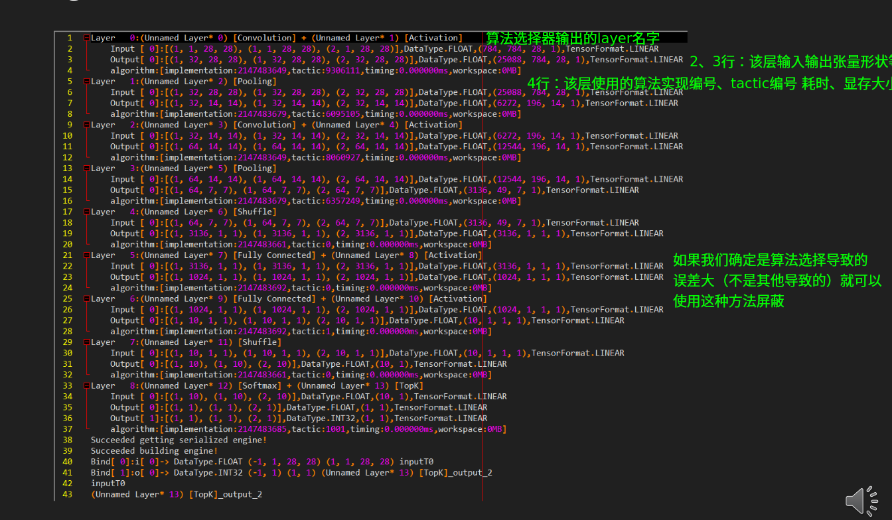

## 2.7 Refit

想更新模型的权重，但又不想重新构建 engine

适用与模型权重不停变化，的场景

* 优点

  * 节约反复构建引擎的时间

  * 强化学习必备

    

* 要点

  * BuilderConfig 中设置相应 Flag
  * 在构建好 engine 的基础上更新权重
  * 更新某层权重后，邻近层可能也需要更新（尽管其值可能不变），如 Convolution 层中的 kernel 和 bias
    [TensorRT] ERROR: 4: [refit.cpp::refitCudaEngine::1769] Error Code 4: Internal Error (missing 1 needed Weights. Call IRefitter::getMissing to get their layer names and roles or
    IRefitter::getMissingWeights to get their weights names.)
  * 注意权重的排布方式
  * Dynamic Shape 模式暂不支持（未来 TensorRT 版本将添加支持）
    [TRT] [E] 4: [network.cpp::validate::2924] Error Code 4: Internal Error (Refittable networks with dynamic shapes is not supported.)

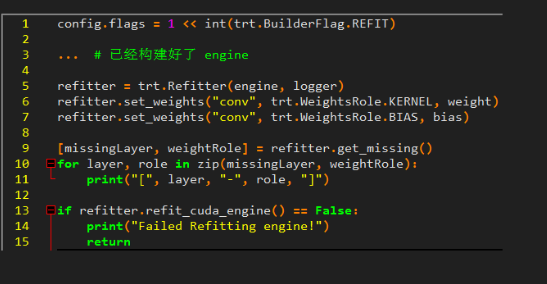

## 2.8 Tactic Source

* 要点
  * BuilderConfig 中设置相应 Flag
  * 可以开启或关闭 cuBLAS、cuBLASLt、cuDNN（默认开启），tensorrt的tactic优选会从中找最优实现。
* 优点
  * 节约部分内存、显存，减少构建时间
  * 缺点
  * 不能使用某些优化，可能导致性能下降
  * 可能导致构建失败
* 后续版本中，TensorRT 将彻底断开对外部 Library 依赖

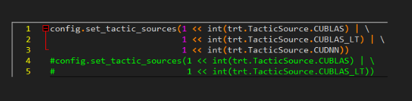

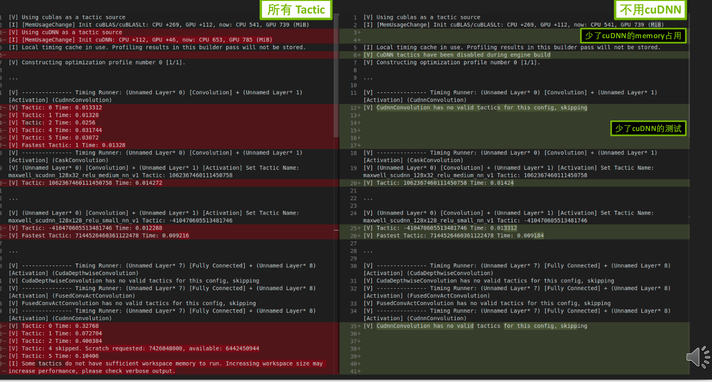

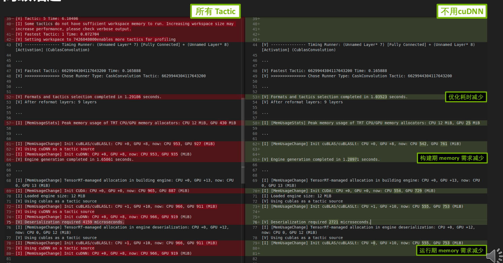

## 2.9 硬件兼容

* TensorRT 8.6 新功能

  * 硬件兼容只支持 Ampere 及更新架构的 GPU（sm ≥ 8.0），版本兼容要求 TensorRT 版本 ≥ 8.6

* 范例代码08-Advance/Hardware compatibility 和 08-Advance/ Version compatibility

* 硬件兼容

  * config.hardware_compatibility_level = trt.HardwareCompatibilityLevel.AMPERE_PLUS
  * 前向后向均可（A100 构建 A10 运行✔，A10 构建 A100 运行✔）
  * 可能会有少许性能损失

* 版本兼容

  * config.set_flag(trt.BuilderFlag.VERSION_COMPATIBLE)
  * runtime.engine_host_code_allowed = True
  * 前向后向均可（TRT8.6 构

  

# 附录

https://docs.nvidia.com/cuda/cuda-c-programming-guide/index.html#cuda-graphs
