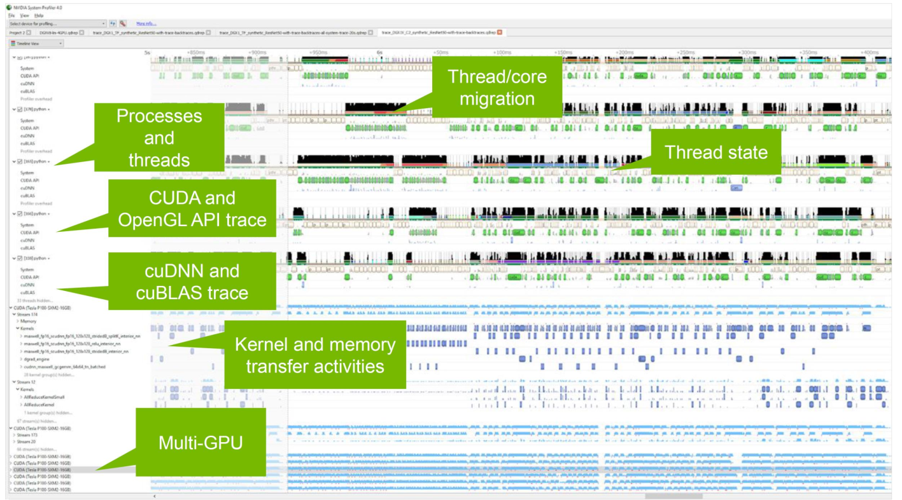
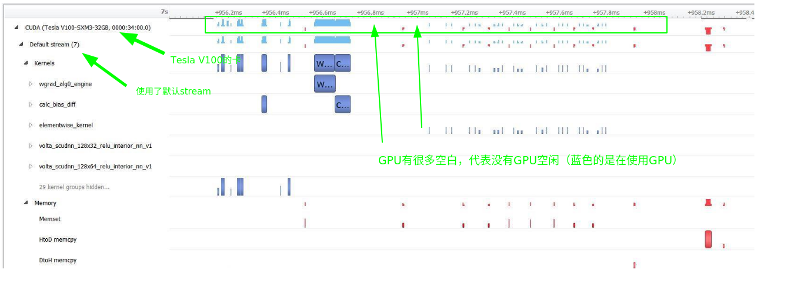
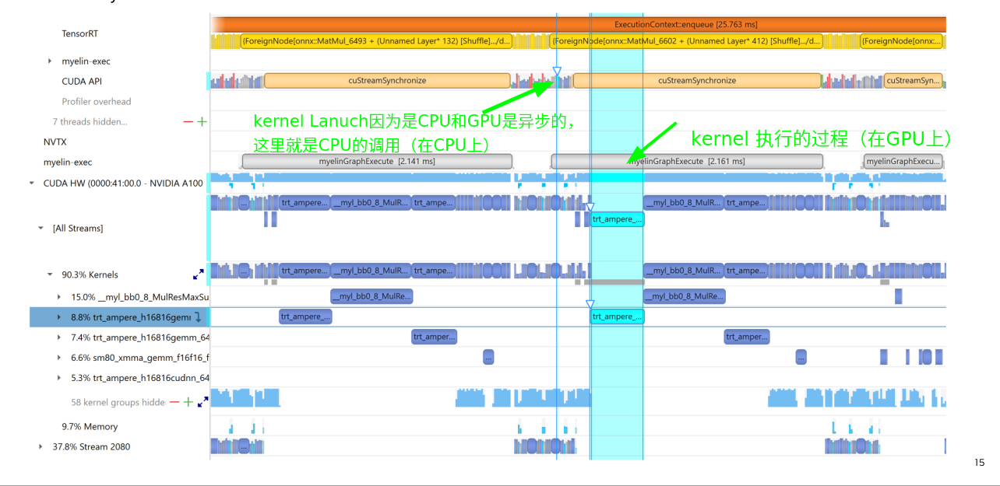
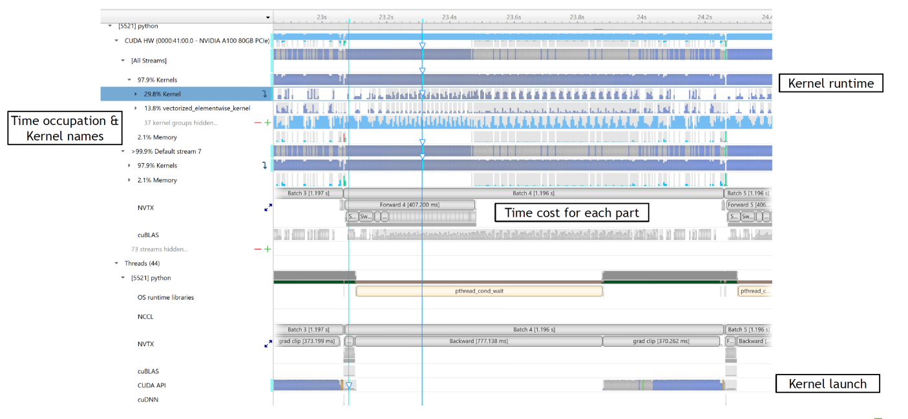
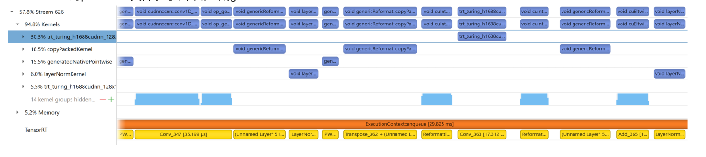
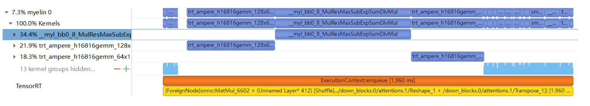
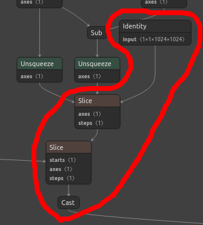
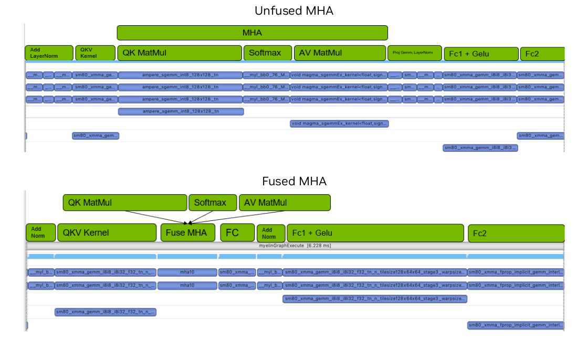
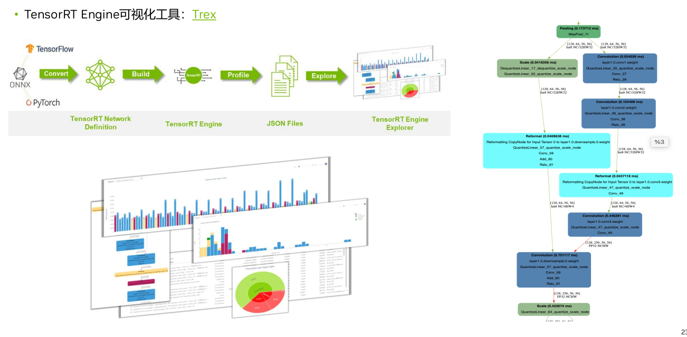
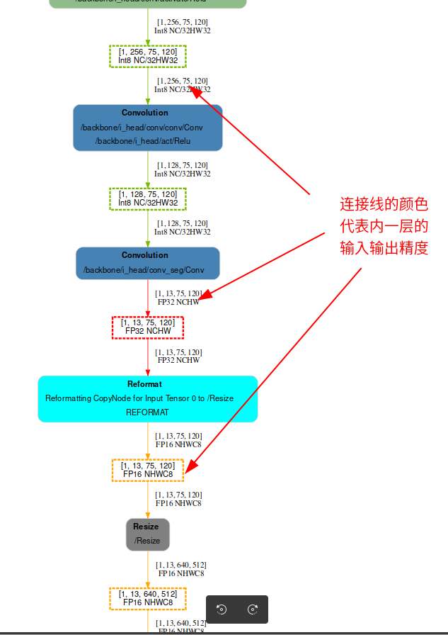

# 1 背景

本文档是记录学习Nvidia官方B站的[视频](https://www.bilibili.com/video/BV1jj411Z7wG?spm_id_from=333.788.videopod.sections&vd_source=cde2e7b9bca1a7048a13eaf0b48210b6)，参考对应的PDF文件 TensorRTTraining-TRT8.6.1-Part5-V1.1.pdf 的记录。对应的官方代码[[trt-samples-for-hackathon-cn\]](https://github.com/NVIDIA/trt-samples-for-hackathon-cn)

官方的视频教程基于TensorRT8.6.1版本。但是官方代码没有对应的tag。只有8.4、8.5和截至目前最新的8.10（master分支）。因此我这里参考的都是8.4分支的代码。

- part1 TensorRT简介
- part2 开发辅助工具
- part3 插件书写
- part4 TensorRT高级用法
- part5 常见优化策略


这一部分为第五部分，对应上面的常见优化策略

# 2 性能分析工具

## 2.1 Profiling

* Nsight system
* NVTX
* Nsight compute
* Understand nsys timeline
* trtexec
* Trex

**To find the bottleneck**

* Nsight systems（系统分析）
  * A system-wide performance analysis tool
* NVTX（）
  * User annotation API that adds marks in profiling
* Nsight compute（分析cuda  kernel）
  * An interactive kernel profiler for CUDA applications

# 3 Nsight System

## 3.1 简介

* System-wide application 系统级别的profiling
* Locate optimization opportunities
  * See gaps of unused CPU and GPU time 确定CPU与GPU的空闲时间
* Balance your workload across multiple CPUs and GPUs
  * GPU streams, kernels, memory transfers, etc. 
* Support for Linux & windows, x86-64
* Compute
  * CUDA API, kernel launch and execution
  * Libraries: cuBLAS, cuDNN, TensorRT



## 3.2 GPU Workload In nsight system

* See CUDA workloads execution time
* Locate idle GPU times



上图看出kernel直接有很大的空隙，建议使用cuda  graph，后面会讲到。

## 3.3 Correlation Ties API to GPU Workload Click and highlight

kernel执行和kernel lanuch之间的关系



## 3.4 NVTX Instrumentation



## 3.5 解读nsys timeline

How to map CUDA kernel to model layer

* 因为各种优化，nsys timeline显示的CUDA kernel和模型节点并不能一一对应，我们需要充分理解TRT的行为，进行快速匹配
* TRT自带NVTX，根据layer name匹配kernel和layer
* TRT在graph optimization过程中会进行大量的layer fusion，NVTX显示layer1 name + layer2 name + …
* TRT在build engine过程中会自动加入一些reformat layer，这些reformat layer在原模型中并不存在，NVTX显示UnnamedLayer
* TRT对pointwise类算子可以自动生成generatedNativePointwise kernel



* Myelin作为一个deep learning compiler，有独特的layer和kernel的命名规则
  * TRT 8.6之前Myelin nodes只有非常简单的NVTX tag，类似`{ForeignNode[onnx::MatMul_6493 + (Unnamed Layer* 132)[Shuffle].../down_blocks.0/attentions.0/Reshape_1 + /down_blocks.0/attentions.0/Transpose_1]}`，难以解读。这里面有。。。我们不清楚里面到底都是什么。
  * TRT 8.6开始Myelin nodes增加了更细力度的NVTX tag，比如`$$myelin$$/time_embedding/act/sigmoid`，便于匹配
  * TRT会持续优化Myelin的可理解性
* Myelin fused kernel命名规则
  * 以LayerNorm为例，`__myl_bb0_8_ResTraCasAddMeaSubMulMeaAddSqrDivMulMulAddRes_com_vec`，可以通过两个Mea(reduce_mean)识别，另外myl代表Myelin，每一个op的前三个字符代表一个op，例如Res代表reshape，Tra代表transpose。。。将多个op融合进了一个kernel。
* 寻找关键节点，比如Layernorm和MHA block的Softmax
  * Softmax对应的Myelin fused kernel一般命名为`ResNegExpResAddDivMul`
* 从8.6开始，Myelin开始支持Layernorm、batchNorm、InstanceNorm，不需要编写plugin了。



有一个讨论`Myelin`的帖子： https://github.com/NVIDIA/TensorRT/issues/2576

下面贴出部分的说明

My log (this bit is super slow, when building the engine for https://huggingface.co/EleutherAI/gpt-j-6B ):

```
[12/30/2022-15:39:09] [V] [TRT] --------------- Timing Runner: {ForeignNode[transformer.h.0.attn.bias.../Cast]} (Myelin)
[12/30/2022-15:48:29] [V] [TRT] Tactic: 0x0000000000000000 Time: 17.8375
[12/30/2022-15:48:30] [V] [TRT] Fastest Tactic: 0x0000000000000000 Time: 17.8375
[12/30/2022-15:48:30] [V] [TRT] >>>>>>>>>>>>>>> Chose Runner Type: Myelin Tactic: 0x0000000000000000
[12/30/2022-15:48:30] [V] [TRT] Formats and tactics selection completed in 567.208 seconds.
...
[12/30/2022-15:48:47] [V] [TRT] Engine generation completed in 584.689 seconds.
```

Which likely corresponds to the following part of my graph:



The user can try and guess why Myelin is used, but since there is no doc, it is hard.

> What is Myelin?

Myelin is the name of a graph compilation and execution backend which was integrated into TensorRT. Myelin provides TRT with the capability of doing aggressive pointwise op fusions and MHA fusions which are commonly used in Transformer-like models.

> Is it possible to disable Myelin? If no, why not?

No because disabling Myelin would lead to poorer performance since a lot of pointwise op fusions will be disabled.

> Which nodes are consumed by Myelin and which are not? Under which conditions?

The long-term goal is to have Myelin backend consume everything that is passed to TensorRT. Before that happens, TensorRT has some heuristics in deciding whether to enable this special backend. For example, if the MHA pattern exists in the network, TensorRT will try to offload everything to this backend.

> this bit is super slow, when building the engine for https://huggingface.co/EleutherAI/gpt-j-6B

With GPT-j-6B, we expect the entire graph (not just the layers you circled) to be consumed by the Myelin backend. In the verbose log, it appears that the autotuning is slow, but in fact that is because Myelin is doing autotuning for ALL the layers. It is just that the details are not printed to TensorRT verbose logging yet. We are still working on this part.

In summary, it is normal that building GPT-J-6B would take ~10 mins since this is a pretty large model and TensorRT (and the Myelin backend) needs to try all types of gemm kernels to select the fastest ones. In TensorRT 8.6, we will add an option for you to skip the autotuning step, but the resulting performance may degrade.




# 4 通过trtexec做性能分析

* 常用的参数
  * --verbose: Enable verbose logging.
  * --nvtxMode=verbose: Enable verbose NVTX marking so that you can see layer details in Nsys profile.
  * --dumpProfile --separateProfileRun: Gather per-layer perf profile.
  * --useCudaGraph: Enable CUDA graph to reduce enqueue time. If graph capturing fails, it will automatically fall back to non-graph path.
  * --noDataTransfers: Disable H2D/D2H data copies. Add this if you do not care about H2D/D2H transfers.
  * --warmUp=<N>: Controls how many ms to run warm-up. This part is not included in the perf metrics. 因为GPU有一些初始化，同时GPU频率从base到max也需要时间。
  * --duration=<N>: Controls how many seconds to run the inference for minimally. Set this to 0 if you only want to run a few iterations.
  * --iterations=<N>: Set the minimal number of iterations to run the inference for. If N iterations have reached but "duration" has not been reached yet, trtexec will continue to run the inference until "duration" is reached.

# 5 Trex

TensorRT Engine可视化工具：[Trex](https://github.com/NVIDIA/TensorRT/tree/main/tools/experimental/trt-engine-explorer)

下图右侧每一个方框就代表一个kernel，连接线





# 附录：

* 我的关于nsigth system的文章 

  * [Nsight Systems基础](https://zmurder.github.io/CUDA/Nsight/Nsight%20Systems%E5%9F%BA%E7%A1%80/?highlight=nsys)

  * [Nsight System经验](https://zmurder.github.io/CUDA/Nsight/Nsight%20System%E7%BB%8F%E9%AA%8C/?highlight=nsys)

* 讨论`Myelin`的帖子： https://github.com/NVIDIA/TensorRT/issues/2576

* 官方：
  * https://developer.nvidia.com/nsight-systems
  * https://developer.nvidia.com/nsight-compute
  * https://resources.nvidia.com/ent-gtccn20/gtccn20-CNS20632 《深入理解 Nsight System 与 Nsight Compute 性能分析优化工具》
  * TensorRT Engine可视化工具：[Trex](https://github.com/NVIDIA/TensorRT/tree/main/tools/experimental/trt-engine-explorer)