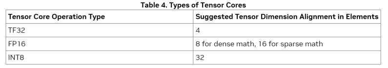
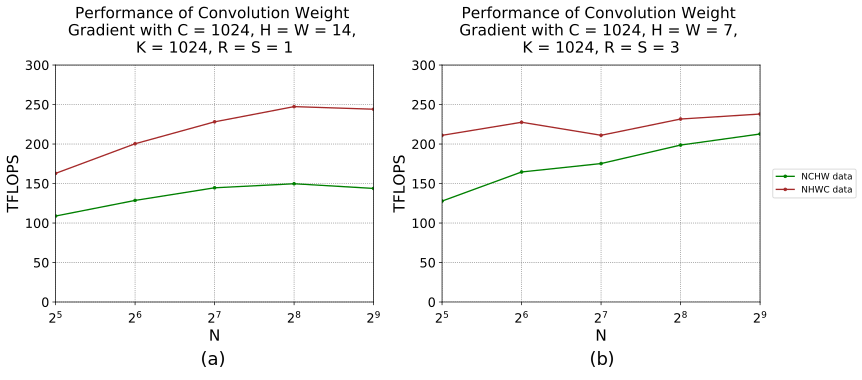
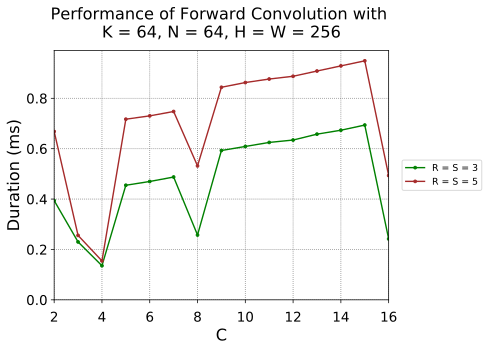
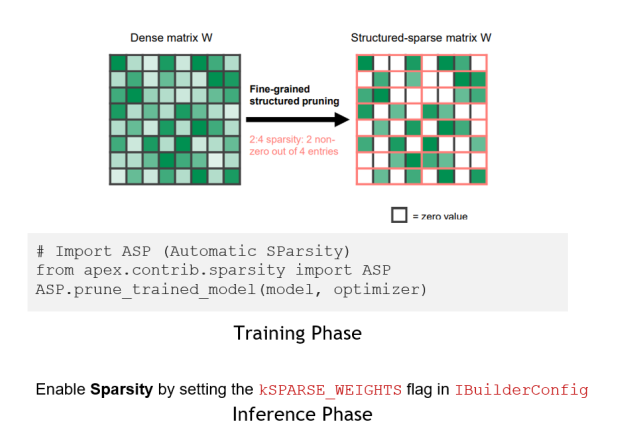

# 背景

本文档是记录学习Nvidia官方B站的[视频](https://www.bilibili.com/video/BV1jj411Z7wG?spm_id_from=333.788.videopod.sections&vd_source=cde2e7b9bca1a7048a13eaf0b48210b6)，参考对应的PDF文件 TensorRTTraining-TRT8.6.1-Part5-V1.1.pdf 的记录。对应的官方代码[[trt-samples-for-hackathon-cn\]](https://github.com/NVIDIA/trt-samples-for-hackathon-cn)

官方的视频教程基于TensorRT8.6.1版本。但是官方代码没有对应的tag。只有8.4、8.5和截至目前最新的8.10（master分支）。因此我这里参考的都是8.4分支的代码。

- part1 TensorRT简介
- part2 开发辅助工具
- part3 插件书写
- part4 TensorRT高级用法
- part5 常见优化策略


这一部分为第五部分，对应上面的常见优化策略

# 性能优化技巧

##  General Tips

参考https://docs.nvidia.com/deeplearning/tensorrt/developer-guide/index.html#optimize-performance

* Batching
  * 增大batch size可以更好的发挥GPU算力，从而达到更高吞吐
  * 如果吞吐随着batch size线性增加，一般说明GPU已打满
* Stream
  * 单个execution context内多流并行：TRT 8.6提供了IBuilderConfig::setMaxAuxStreams() API 来设置steam数量
  * 多个execution context间多流并行：设置不同stream
  * 尽量避免使用default stream，否则会引入额外的implicit sync
* CUDA Graph
  * 对于kernel launch bounded情况，可以通过CUDA graph来加速
  * 不支持dynamic shape，需要capture多个CUDA Graph
  * 设置nsys --cuda-graph-trace=node查看kernel
* [Overhead of Shape Change and Optimization Profile Switching](https://docs.nvidia.com/deeplearning/tensorrt/developer-guide/index.html#cuda-graphs)
  * 当切换execution context或者改变graph input shape后，TRT可能会有额外的开销
  * 可以尝试禁掉 kEDGE_MASK_CONVOLUTIONS tactic source，或者通过多个execution context切换使用来隐藏overhead

##  Graph Fusion 图融合

* Graph fusion是非常有效的手段，**TRT内部**支持了丰富的[fusion pattern](https://docs.nvidia.com/deeplearning/tensorrt/developer-guide/index.html#fusion-types)，比如经典的conv+bias+relu
* 如果你发现了通用而且有明显收益的pattern，但是TRT没有fuse，建议发个bug
* 我们可以通过onnx-graphsurgeon和TRT plugin来**手动**实现graph fusion，比如经典的LayerNorm plugin
* 我们可以利用TRT外部的资源，比如[Cutlass](https://github.com/NVIDIA/cutlass)，[FlashAttn](https://github.com/HazyResearch/flash-attention)， [xformer](https://github.com/facebookresearch/xformers)，将kernel implementation封装到TRT plugin


##  Optimizing Layer Performance Layer优化

参考链接：https://docs.nvidia.com/deeplearning/tensorrt/developer-guide/index.html#optimize-layer

* Reduce Layer

  * 尽量保证reduce axis在最后一维，这样能保证数据连续性，从而实现更好的性能。手动加一写Transpose来保证。

  * 如果reduce axis不在最后一维，可以通过Shuffle (transpose) 调整

  * 解释：

    **Reduce Axis 在最后一维**：如果 `reduce axis` 设置为最后一维 `W`，即 `dim=3`，那么在内存中，数据是连续的。例如，对于一个形状为 `[1, 3, 224, 224]` 的张量，`reduce axis=3` 的操作如下

    ```python
    import torch
    
    # 创建一个 4D 张量
    input_tensor = torch.randn(1, 3, 224, 224)
    
    # 在最后一维上进行 reduce sum 操作
    output_tensor = torch.sum(input_tensor, dim=3)
    
    # 输出张量的形状为 [1, 3, 224]
    print(output_tensor.shape)
    ```

    **Reduce Axis 不在最后一维**：如果 `reduce axis` 设置为其他维度，例如 `C`（即 `dim=1`），那么在内存中，数据不是连续的。例如，对于一个形状为 `[1, 3, 224, 224]` 的张量，`reduce axis=1` 的操作如下：

    ```python
    import torch
    
    # 创建一个 4D 张量
    input_tensor = torch.randn(1, 3, 224, 224)
    
    # 在第二维上进行 reduce sum 操作
    output_tensor = torch.sum(input_tensor, dim=1)
    
    # 输出张量的形状为 [1, 224, 224]
    print(output_tensor.shape)
    ```

    

* Shuffle Layer

  * 如果input和output tensor有相同的memory layout，就不会有实际的kernel

* MatMul Layer

  * 如果使用FP16，而且K不是8的倍数，为了使用tensor core ，TRT可能会引入reformat kernel，可以通过手动padding到8的倍数来规避

  * 如果input是4维，可以尝试通过reshape转化为3维或者2维，可能有更好的性能。不会有实际的keenle

  * 解释：

    在矩阵乘法（Matrix Multiplication）中，`M`、`N` 和 `K` 是三个重要的参数，它们分别表示输入矩阵的维度。具体来说，矩阵乘法的操作可以表示为：

    C=A×B

    其中：

    A是一个 M×K的矩阵。

    B是一个 K×N的矩阵。

    C是一个 M×N的矩阵。

##  Optimizing for Tensor Cores

参考链接：https://docs.nvidia.com/deeplearning/tensorrt/developer-guide/index.html#optimize-tensor-cores

* 使用Tensor Core才能发挥GPU的最大算力，TF32，FP16，INT8，FP8

* TRT的MatrixMultiply, FullyConnected, Convolution, and Deconvolution等计算密集的算子会使用Tensor Core

* Tensor Core对data alignment有要求：

  

  官网原文
  ```tex
  Tensor Core layers tend to achieve better performance if the I/O tensor dimensions are aligned to a certain minimum granularity: 
      The alignment requirement is on the I/O channel dimension in the Convolution and Deconvolution layers.
      In MatrixMultiply and FullyConnected layers, the alignment requirement is on matrix dimensions K and N in a MatrixMultiply that is M x K times K x N.
  
  ```

  例如上面讲到的Matrix Multiplication中，`M`、`N` 和 `K` 。如果是TF32时K和N最好是4的倍数。

  对于卷积操作，假设输入特征图的形状为 (N,C,H,W)，卷积核的形状为 (O,C,kH,kW)，输出特征图的形状为 (N,O,oH,oW)。TF32：输入特征图的通道数 C必须是 4 的倍数。这里我不知道对于NHWC和NCHW都是对C的要求。

* 当tensor不满足alignment条件时，TRT会隐式地做padding，比如插入reformat layer

* 可以设置nsys --gpu-metrics-device all来查看Tensor Core使用情况

## [Tensor Layouts In Memory: NCHW vs NHWC](https://docs.nvidia.com/deeplearning/performance/dl-performance-convolutional/index.html#tensor-layout)

参考[Tensor Layouts In Memory: NCHW vs NHWC](https://docs.nvidia.com/deeplearning/performance/dl-performance-convolutional/index.html#tensor-layout)

卷积通常对四维张量进行作： a batch composed of N "images" of C channels of H x W feature maps. 

深度学习框架通常在内存中使用 NCHW 和 NHWC 布局（首字母缩略词列出了内存中从最慢到最快的维度）。布局选择会影响性能，因为为 **Tensor Core 实现的卷积需要 NHWC 布局，并且在 NHWC 中布局输入张量时速度最快**。

NCHW 布局仍然可以由 Tensor Core 进行作，但由于自动转置作而包含一些开销，如图 2 所示。当输入和输出张量较大或所需的计算量较低时（例如，当滤波器大小较小时），转置开销往往更显著。为了最大限度地提高性能，我们建议使用 NHWC 张量布局。

*Figure 2. Kernels that do not  require a transpose (NHWC) perform better than kernels that require one  or more (NCHW). NVIDIA A100-SXM4-80GB, CUDA 11.2, cuDNN 8.1.*



## [Channels In And Out](https://docs.nvidia.com/deeplearning/performance/dl-performance-convolutional/index.html#channels)

参考[Channels In And Out](https://docs.nvidia.com/deeplearning/performance/dl-performance-convolutional/index.html#channels)

启用 Tensor Core 的要求取决于所使用的 cuDNN 版本。使用 cuDNN v7.6.3  及更高版本，卷积维度将在必要时自动填充以利用 Tensor Core。早期版本的 cuDNN 更严格：将 Tensor Core 与 NHWC  打包数据一起使用需要将 C 和 K 与 TF32 对齐为 4 的倍数，将 FP16 对齐为 8 的倍数，将 16 与 INT8 对齐为 16  的倍数。对于 NCHW 打包的 FP16 数据，通道将自动填充为 8 的倍数，以便启用 Tensor Core。但是，将 NCHW 数据与启用  Tensor Core 的内核一起使用会涉及一些额外的转置成本，这在内存中的 Tensor 布局：NCHW 与 NHWC 中进行了讨论。

另一方面，对于这些早期版本的 cuDNN，自动填充不会对 NHWC 打包的数据启动，因此会选择效率较低的回退内核，该内核不使用 Tensor  Core 。鉴于 C 和 K 能被 8 整除，使用 NHWC 数据的卷积确实比使用 NCHW 数据的卷积表现更好。换句话说，如果某个图层已经与  NCHW 数据一起使用，则会发生自动填充;但是，如果正在使用 NHWC 数据，则选择或填充 C 和 K 为 8 的倍数可以提高性能。

对于 cuDNN v7.6.3 及更高版本，无论数据格式如何，填充都是自动的。填充会增加一些时间，尽管与启用 Tensor Core  的性能增益相比，这种成本通常可以忽略不计。值得注意的是，对于 FP16 选择 C 和 K 是 8  的倍数，或者对于其他数据类型选择等效值，效率最高：对于这些情况，不需要填充。

在某些情况下，通道数很小且不可协商。对于网络中的第一层，通常具有非常小的 C 值（灰度和 RGB 或 YCrCb 图像分别为 1 或  3）。特殊情况的卷积实现可以满足这一需求，特别是对于 C = 4 和 stride 为 2（图 8）。此处显示的数据是使用 cuDNN 8.1  收集的，因此填充是自动的。与 7.6.3 之前的版本相比，从 C = 3 到 C = 4 的性能改进没有那么剧烈，但选择 C = 4  仍然更快，因为不会发生填充。

 图8.C = 4 的专用内核加快了卷积神经网络中的常见第一层（使用 NHWC 数据）的速度。**选择 C = 4 或 8 的倍数可提供最佳性能。**NVIDIA A100-SXM4-80GB、CUDA 11.2、cuDNN 8.1。



##  Low Precision 低精度

参考：https://www.nvidia.com/en-us/on-demand/session/gtcspring21-s31876/

* 使用低精度可以降低memory开销，其中FP16比较成熟，INT8需要PTQ或者QAT来保证精度，TRT接下来的版本会支持FP8
* INT8 QAT
  * 量化感知训练（QAT）相比于训练后量化（PTQ）有更高的精度
  * 训练阶段，TensorRT提供了基于PyTorch的INT8量化工具包，帮助生成QAT模型，并维持原有精
  * 模型转换阶段， TensorRT ONNX parser新增了对ONNX QuantizeLinear和DequantizeLinear算子的支持推理阶段，TensorRT 8.0新增了Quantize

## Sparsity 稀疏

参考

https://www.nvidia.com/en-us/on-demand/session/gtcspring21-s31876/
https://www.nvidia.com/en-us/on-demand/session/gtcspring21-s31552/
https://developer.nvidia.com/blog/accelerating-inference-with-sparsity-using-ampere-and-tensorrt/

* TRT8.0支持了结构化稀疏，它是安培架构引入的新特性
* 利用结构化稀疏(structured sparsity)加速推理
  * 通过2:4细粒度结构化稀疏减少一半参数，并利用SparseTensor Core进行加速，在Bert模型上能实现1.3倍的加速（下图针对w，4中个选最大的2个保留，剩下的作为一个mask，减少一半的参数量和一个mask）
  * 训练阶段，通过稀疏化工具ASP (Automatic SParsity)修剪参数，然后微调模型以维持原有精度
  * 推理阶段，通过设置build_config的SPARSE_WEIGHTS flag来挑选sparse kernel
* 可以通过trtexec --sparsity=enable/force来快速测试加速效果




##  Misc 其他

参考：https://docs.nvidia.com/deeplearning/tensorrt/developer-guide/index.html#performance

* Optimizing Plugins 手动写plugin
  * The performance of plugins depends on the CUDA code performing the plugin operation.
  * Support as many formats as possible in the plugin. This removes the need for internal reformat operations during the execution of the network。自己写的plugin的不同的精度支持
* Optimizing Builder Performance 优化build engine的时间
  * Timing cache
  * Tactic Selection Heuristic
* Builder Optimization Level trt8.6引入的，设置不同的等级，例如更快设置为0 更好设置为5，正常是3
  * Set the optimization

# 附录

* https://docs.nvidia.com/deeplearning/tensorrt/developer-guide/index.html#optimize-performance
* https://docs.nvidia.com/deeplearning/tensorrt/developer-guide/index.html#optimize-layer
* https://docs.nvidia.com/deeplearning/tensorrt/developer-guide/index.html#optimize-tensor-cores
* https://www.nvidia.com/en-us/on-demand/session/gtcspring21-s31876/
* https://www.nvidia.com/en-us/on-demand/session/gtcspring21-s31876/
  https://www.nvidia.com/en-us/on-demand/session/gtcspring21-s31552/
  https://developer.nvidia.com/blog/accelerating-inference-with-sparsity-using-ampere-and-tensorrt/
* https://docs.nvidia.com/deeplearning/tensorrt/developer-guide/index.html#performance
* [fusion pattern](https://docs.nvidia.com/deeplearning/tensorrt/developer-guide/index.html#fusion-types)
* [Cutlass](https://github.com/NVIDIA/cutlass)
* [FlashAttn](https://github.com/HazyResearch/flash-attention)
*  [xformer](https://github.com/facebookresearch/xformers)
