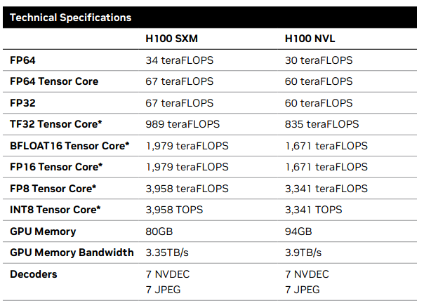
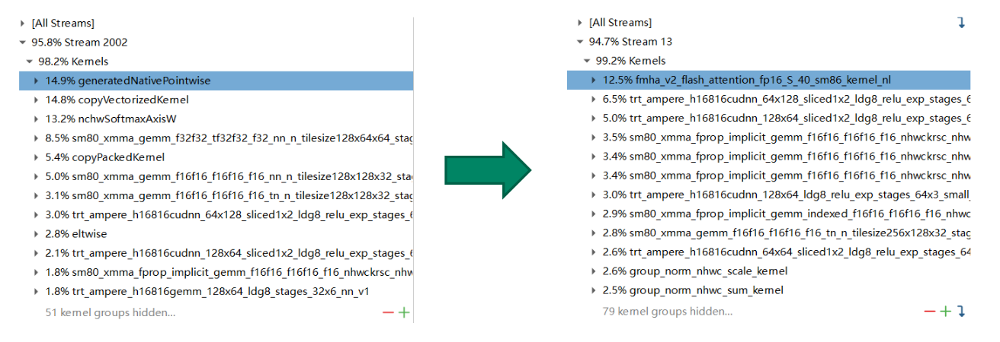
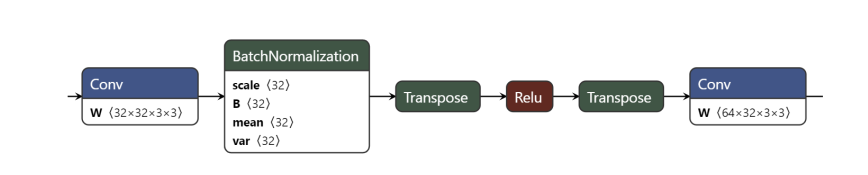
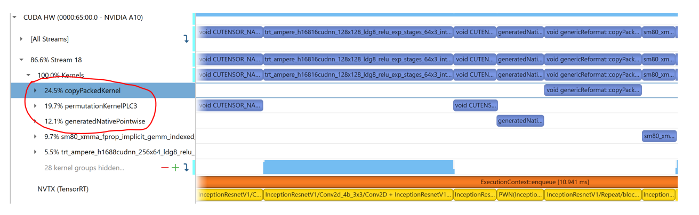
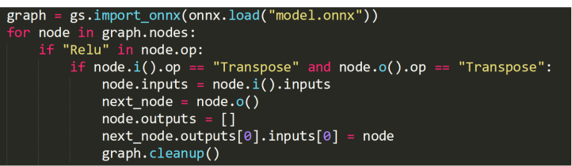
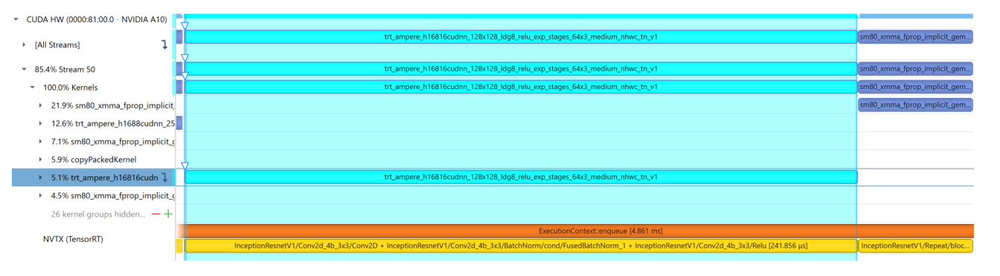
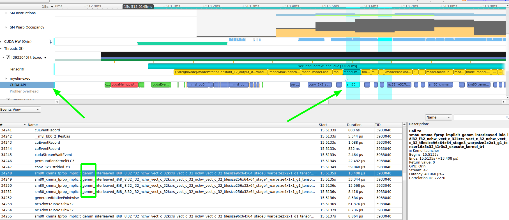

# 1 背景

本文档是记录学习Nvidia官方B站的[视频](https://www.bilibili.com/video/BV1jj411Z7wG?spm_id_from=333.788.videopod.sections&vd_source=cde2e7b9bca1a7048a13eaf0b48210b6)，参考对应的PDF文件 TensorRTTraining-TRT8.6.1-Part5-V1.1.pdf 的记录。对应的官方代码[[trt-samples-for-hackathon-cn\]](https://github.com/NVIDIA/trt-samples-for-hackathon-cn)

官方的视频教程基于TensorRT8.6.1版本。但是官方代码没有对应的tag。只有8.4、8.5和截至目前最新的8.10（master分支）。因此我这里参考的都是8.4分支的代码。

- part1 TensorRT简介
- part2 开发辅助工具
- part3 插件书写
- part4 TensorRT高级用法
- part5 常见优化策略


这一部分为第五部分，对应上面的常见优化策略

# 2 TensorRT性能优化概述

* 性能优化的核心是充分发挥GPU算力
* Nsight system是分析性能瓶颈的关键工具
* trtexec除了构建engine，也是非常实用的性能测试工具
* 计算图优化和TRT plugin是性能优化的主要手段
* 本次讲座主要基于Framework->ONNX->TRT workflow

## 2.1 GPU specifications

* 最主要的算里来自Tensor Core ,要充分发挥Tensor Core算力
* 数据类型：TF32，FP16，INT8，FP8

https://resources.nvidia.com/en-us-tensor-core/nvidia-tensor-core-gpu-datasheet



## 2.2 优化目标

* 推理框架的性能优化的目标：
  * 尽可能地把所有非GEMM kernel融合起来(不是GEMM的kernel给融合进GEMMkernel中，融合不了的尽可能将这部分融合为一个GEMM kernel)
  * GEMM kernel (Tensor Core )占比较高，例如在90%以上

GEMM kernel就是计算密集型的kernel。

**常见的 GEMM 操作包括：**

1. **全连接层（Fully Connected Layer）：**
   - 全连接层的计算可以表示为 $$Y=W×X+b$$，其中 W是权重矩阵，X是输入特征向量，b是偏置向量。
   - TensorRT 会将全连接层的计算转换为 GEMM 操作。
2. **卷积层（Convolutional Layer）**：
   - 卷积层的计算可以通过 Im2Col 或 Winograd 等技术转换为 GEMM 操作。
   - Im2Col 技术将输入特征图展开成一个矩阵，卷积核也展开成一个矩阵，然后进行矩阵乘法操作。
   - Winograd 算法通过减少卷积操作中的乘法次数，进一步提高计算效率。
3. **矩阵乘法（Matrix Multiplication）**：
   - 直接的矩阵乘法操作，如 $$C=A×B$$
4. **RNN 和 LSTM 层**：
   - RNN 和 LSTM 层中的门控计算（如输入门、遗忘门、输出门）涉及大量的矩阵乘法操作，这些操作可以转换为 GEMM 操作。

**非 GEMM 操作**

非 GEMM 操作包括各种其他类型的计算，如激活函数、池化、归一化等。常见的非 GEMM 操作包括：

1. **激活函数（Activation Functions）**：

   - ReLU（Rectified Linear Unit）
     
   - Sigmoid：
   
   - Tanh：

   - Leaky ReLU

2. **池化层（Pooling Layer）**：
   - 最大池化（Max Pooling）：在每个池化区域中选择最大值。
   - 平均池化（Average Pooling）：在每个池化区域中计算平均值。
   
3. **归一化层（Normalization Layer）**：

   - 批归一化（Batch Normalization）：对每个 mini-batch 的数据进行归一化处理。
   - 层归一化（Layer Normalization）：对每个样本的特征进行归一化处理。

4. **裁剪层（Clipping Layer）**：

   - 将输入值限制在一个指定的范围内，如 $$f(x)=min⁡(max⁡(x,min_value),max_value)$$

5. **重塑层（Reshape Layer）**：

   - 改变张量的形状，但不改变其数据。

6. **转置层（Transpose Layer）**：
   - 交换张量的维度，如将 (N,C,H,W)转换为 (N,H,W,C)。
   
7. **拼接层（Concatenation Layer）**：

   - 将多个张量沿着指定的维度拼接在一起。

8. **切片层（Slice Layer）**：

   - 从张量中提取子张量。

9. **广播层（Broadcast Layer）**：

   - 将张量广播到更大的形状。

10. **点积层（Dot Product Layer）**：

    - 计算两个张量的点积。

11. **元素-wise 操作（Element-wise Operations）**：
- 如加法、减法、乘法、除法等，这些操作在每个元素上独立进行。




## 2.3 优化流程

1. Run Framework->ONNX->TRT to get baseline
2. Profile and find perf bottleneck
3. Optimize with ONNX-graphsurgeon（图优化） and TRT plugin
4. Repeat step2 and step3 until satisfied

## 2.4 A simple optimization example

* FaceNet
  * CNN网络，人脸识别
* 性能瓶颈：
  * 重复的Transpose
  * 没有融合Conv+BatchNorm+Relu



上面有两个 Transpose，

从nsys分析timeLine 理解对应的kernel与计算图做关联，可能是一对多或者多对一的关系



上图中非GEMM kernel占比超过了50%。

其中：

* `copyPackedKernel` 是一个常见的内核，用于在不同内存布局之间复制数据。这个内核通常出现在数据预处理或后处理阶段，尤其是在数据格式转换和内存对齐操作中。要确定 `copyPackedKernel` 对应的 ONNX 操作（op），可以考虑以下几个常见的场景和操作。

  对应常见的 ONNX 操作

  1. **Reshape 操作**：
     - `Reshape` 操作用于改变张量的形状，但不改变其数据。在某些情况下，`Reshape` 操作可能需要重新排列内存中的数据，这可能会触发 `copyPackedKernel`。
  2. **Transpose 操作**：
     - `Transpose` 操作用于交换张量的维度。在某些情况下，`Transpose` 操作可能需要重新排列内存中的数据，这可能会触发 `copyPackedKernel`。
  3. **Concat 操作**：
     - `Concat` 操作用于沿指定维度拼接多个张量。在某些情况下，`Concat` 操作可能需要重新排列内存中的数据，这可能会触发 `copyPackedKernel`。
  4. **Split 操作**：
     - `Split` 操作用于将一个张量沿指定维度分割成多个子张量。在某些情况下，`Split` 操作可能需要重新排列内存中的数据，这可能会触发 `copyPackedKernel`。
  5. **Squeeze 和 Unsqueeze 操作**：
     - `Squeeze` 操作用于删除张量中大小为 1 的维度，而 `Unsqueeze` 操作用于插入大小为 1 的维度。在某些情况下，这些操作可能需要重新排列内存中的数据，这可能会触发 `copyPackedKernel`。
  6. **Pad 操作**：
     - `Pad` 操作用于在张量的边缘填充数据。在某些情况下，`Pad` 操作可能需要重新排列内存中的数据，这可能会触发 `copyPackedKernel`。
  7. **Gather 和 Scatter 操作**：
     - `Gather` 操作用于从张量中收集数据，而 `Scatter` 操作用于将数据分散到张量中。在某些情况下，这些操作可能需要重新排列内存中的数据，这可能会触发 `copyPackedKernel`。

* `permutationKernelPLC3` 是一个内核，通常用于处理张量的维度置换（Permutation）。这种内核通常对应于 ONNX 中的 `Transpose` 操作

* `generatedNativePointwise` 的 kernel 通常与 **逐元素操作（element-wise operations）** 相关。这个 kernel 名称并不是直接对应于某一个 ONNX 操作符的标准名称，而是 NVIDIA TensorRT 中内部生成的一个高效实现，用于处理一些常见的逐元素操作，比如加法、乘法、激活函数`generatedNativePointwise` 内核通常与以下几类 ONNX 操作（op）相关：

  1. **逐元素激活函数**：
     - **Relu** (`Relu`)
     - **Sigmoid** (`Sigmoid`)
     - **Tanh** (`Tanh`)
     - **LeakyRelu** (`LeakyRelu`)
     - **Softmax** (`Softmax`)
     - **Mish** (`Mish`)
  2. **逐元素数学操作**：
     - **Add** (`Add`)
     - **Sub** (`Sub`)
     - **Mul** (`Mul`)
     - **Div** (`Div`)
     - **Pow** (`Pow`)
     - **Abs** (`Abs`)
     - **Exp** (`Exp`)
     - **Sqrt** (`Sqrt`)
     - **Ceil** (`Ceil`)
     - **Floor** (`Floor`)
     - **Clip** (`Clip`)
  3. **逐元素比较操作**：
     - **Equal** (`Equal`)
     - **Greater** (`Greater`)
     - **Less** (`Less`)
     - **NotEqual** (`NotEqual`)
     - **GreaterOrEqual** (`GreaterOrEqual`)
     - **LessOrEqual** (`LessOrEqual`)

结合onnx来看就是`Transpose`和`Relu`占用了太多的时间，我们希望`Relu`融合进 Conv BN。Transpose不是必须的。因为例如NCHW到NHWC没有存在的意义。直接去掉上图中`Relu`两侧的`Transpose`

* 解决方案：

  * 通过onnx-graphsurgeon去除重复的transpose

* 代码示例：

  

* 优化效果：

  *  去除Transpose后实现两倍吞吐
  * 使用INT8和multi stream可以达到四倍吞吐



## 2.5 判断是否是GEMM kernel

**如何得知onnx的op经过tensorRT转换后的kernel是不是GEMM 的kernel呢？**

视频没有讲，我的理解可以从trtexec转换engine的日志看出一些，在日志中`Set Tactic Name`的name可以看出带有`gemm`字符的就应该是GEMM kernel了，例如：

```txt
[12/01/2023-06:45:46] [V] [TRT] >>>>>>>>>>>>>>> Chose Runner Type: CaskConvolution Tactic: 0x3d988d07a78b0918
[12/01/2023-06:45:46] [V] [TRT] *************** Autotuning format combination: Int8(614400,614400:32,960,1) -> Int8(153600,153600:32,480,1) ***************
[12/01/2023-06:45:46] [V] [TRT] --------------- Timing Runner: model.model.backbone0.conv.weight + /model/backbone0/conv/_weight_quantizer/QuantizeLinear + /model/backbone0/conv/Conv (CudaGroupConvolution)
[12/01/2023-06:45:46] [V] [TRT] CudaGroupConvolution has no valid tactics for this config, skipping
[12/01/2023-06:45:46] [V] [TRT] --------------- Timing Runner: model.model.backbone0.conv.weight + /model/backbone0/conv/_weight_quantizer/QuantizeLinear + /model/backbone0/conv/Conv (CudaDepthwiseConvolution)
[12/01/2023-06:45:46] [V] [TRT] CudaDepthwiseConvolution has no valid tactics for this config, skipping
[12/01/2023-06:45:46] [V] [TRT] --------------- Timing Runner: model.model.backbone0.conv.weight + /model/backbone0/conv/_weight_quantizer/QuantizeLinear + /model/backbone0/conv/Conv (FusedConvActConvolution)
[12/01/2023-06:45:46] [V] [TRT] FusedConvActConvolution has no valid tactics for this config, skipping
[12/01/2023-06:45:46] [V] [TRT] --------------- Timing Runner: model.model.backbone0.conv.weight + /model/backbone0/conv/_weight_quantizer/QuantizeLinear + /model/backbone0/conv/Conv (CaskConvolution)
[12/01/2023-06:45:46] [V] [TRT] model.model.backbone0.conv.weight + /model/backbone0/conv/_weight_quantizer/QuantizeLinear + /model/backbone0/conv/Conv Set Tactic Name: sm80_xmma_fprop_implicit_gemm_interleaved_i8i8_i8i32_f32_nchw_vect_c_32kcrs_vect_c_32_nchw_vect_c_32_tilesize64x96x64_stage3_warpsize2x2x1_g1_tensor16x8x32_t1r3s3 Tactic: 0x028e842ce51fbd9d
[12/01/2023-06:45:46] [V] [TRT] Tactic: 0x028e842ce51fbd9d Time: 0.323858
[12/01/2023-06:45:46] [V] [TRT] model.model.backbone0.conv.weight + /model/backbone0/conv/_weight_quantizer/QuantizeLinear + /model/backbone0/conv/Conv Set Tactic Name: sm80_xmma_fprop_implicit_gemm_interleaved_i8i8_i8i32_f32_nchw_vect_c_32kcrs_vect_c_32_nchw_vect_c_32_tilesize256x96x64_stage3_warpsize4x1x1_g1_tensor16x8x32 Tactic: 0x048dc59a1807b5bb
[12/01/2023-06:45:46] [V] [TRT] Tactic: 0x048dc59a1807b5bb Time: 0.473294
[12/01/2023-06:45:46] [V] [TRT] model.model.backbone0.conv.weight + /model/backbone0/conv/_weight_quantizer/QuantizeLinear + /model/backbone0/conv/Conv Set Tactic Name: sm80_xmma_fprop_implicit_gemm_interleaved_i8i8_i8i32_f32_nchw_vect_c_32kcrs_vect_c_32_nchw_vect_c_32_tilesize128x192x64_stage3_warpsize4x2x1_g1_tensor16x8x32 Tactic: 0x0f6ba1e5b0320393
[12/01/2023-06:45:46] [V] [TRT] Tactic: 0x0f6ba1e5b0320393 Time: 0.576841
.......

[12/01/2023-06:45:46] [V] [TRT] model.model.backbone0.conv.weight + /model/backbone0/conv/_weight_quantizer/QuantizeLinear + /model/backbone0/conv/Conv Set Tactic Name: sm80_xmma_fprop_implicit_gemm_interleaved_i8i8_i8i32_f32_nchw_vect_c_32kcrs_vect_c_32_nchw_vect_c_32_tilesize32x64x64_stage6_warpsize2x2x1_g1_tensor16x8x32 Tactic: 0x8e1e9d670448aca7
[12/01/2023-06:45:46] [V] [TRT] Tactic: 0x8e1e9d670448aca7 Time: 0.386953
[12/01/2023-06:45:46] [V] [TRT] model.model.backbone0.conv.weight + /model/backbone0/conv/_weight_quantizer/QuantizeLinear + /model/backbone0/conv/Conv Set Tactic Name: sm80_xmma_fprop_implicit_gemm_interleaved_i8i8_i8i32_f32_nchw_vect_c_32kcrs_vect_c_32_nchw_vect_c_32_tilesize96x32x64_stage4_warpsize2x1x1_g1_tensor16x8x32_t1r3s3 Tactic: 0x9262f8f95beb428d
[12/01/2023-06:45:46] [V] [TRT] Tactic: 0x9262f8f95beb428d Time: 0.181481
[12/01/2023-06:45:46] [V] [TRT] model.model.backbone0.conv.weight + /model/backbone0/conv/_weight_quantizer/QuantizeLinear + /model/backbone0/conv/Conv Set Tactic Name: sm80_xmma_fprop_implicit_gemm_interleaved_i8i8_i8i32_f32_nchw_vect_c_32kcrs_vect_c_32_nchw_vect_c_32_tilesize64x32x64_stage6_warpsize2x1x1_g1_tensor16x8x32 Tactic: 0x955d593b1135a423
[12/01/2023-06:45:46] [V] [TRT] Tactic: 0x955d593b1135a423 Time: 0.241339
.........

[12/01/2023-06:45:46] [V] [TRT] model.model.backbone0.conv.weight + /model/backbone0/conv/_weight_quantizer/QuantizeLinear + /model/backbone0/conv/Conv Set Tactic Name: sm80_xmma_fprop_implicit_gemm_interleaved_i8i8_i8i32_f32_nchw_vect_c_32kcrs_vect_c_32_nchw_vect_c_32_tilesize64x64x64_stage6_warpsize2x2x1_g1_tensor16x8x32 Tactic: 0xf56c0ac895d82363
[12/01/2023-06:45:46] [V] [TRT] Tactic: 0xf56c0ac895d82363 Time: 0.318222
[12/01/2023-06:45:46] [V] [TRT] model.model.backbone0.conv.weight + /model/backbone0/conv/_weight_quantizer/QuantizeLinear + /model/backbone0/conv/Conv Set Tactic Name: sm80_xmma_fprop_implicit_gemm_interleaved_i8i8_i8i32_f32_nchw_vect_c_32kcrs_vect_c_32_nchw_vect_c_32_tilesize256x128x64_stage4_warpsize4x2x1_g1_tensor16x8x32_t1r3s3 Tactic: 0xf8d4389f60adfa3c
[12/01/2023-06:45:46] [V] [TRT] Tactic: 0xf8d4389f60adfa3c Time: 0.381161
[12/01/2023-06:45:46] [V] [TRT] Fastest Tactic: 0x9262f8f95beb428d Time: 0.181481
[12/01/2023-06:45:46] [V] [TRT] >>>>>>>>>>>>>>> Chose Runner Type: CaskConvolution Tactic: 0x9262f8f95beb428d
[12/01/2023-06:45:46] [V] [TRT] =============== Computing costs for 
[12/01/2023-06:45:46] [V] [TRT] *************** Autotuning format combination: Int8(4915200,153600,480,1) -> Int8(2457600,38400,240,1) ***************
[12/01/2023-06:45:46] [V] [TRT] --------------- Timing Runner: model.model.backbone1.conv.weight + /model/backbone1/conv/_weight_quantizer/QuantizeLinear + /model/backbone1/conv/Conv (CaskConvolution)
[12/01/2023-06:45:46] [V] [TRT] CaskConvolution has no valid tactics for this config, skipping
[12/01/2023-06:45:46] [V] [TRT] *************** Autotuning format combination: Int8(1228800,153600:4,480,1) -> Int8(614400,38400:4,240,1) ***************
[12/01/2023-06:45:46] [V] [TRT] --------------- Timing Runner: model.model.backbone1.conv.weight + /model/backbone1/conv/_weight_quantizer/QuantizeLinear + /model/backbone1/conv/Conv (CudaDepthwiseConvolution)
[12/01/2023-06:45:46] [V] [TRT] CudaDepthwiseConvolution has no valid tactics for this config, skipping
[12/01/2023-06:45:46] [V] [TRT] --------------- Timing Runner: model.model.backbone1.conv.weight + /model/backbone1/conv/_weight_quantizer/QuantizeLinear + /model/backbone1/conv/Conv (FusedConvActConvolution)
[12/01/2023-06:45:46] [V] [TRT] FusedConvActConvolution has no valid tactics for this config, skipping
```

另外也可以从nsys的 cuda API看出来，如下图



# 附录

* https://resources.nvidia.com/en-us-tensor-core/nvidia-tensor-core-gpu-datasheet