# 1 简介

在前面三个TensorRT量化实战课YOLOv7量化的文章中，都是摘抄自CSND。感谢这个网友的无私风险和总结。这里给出CSDN的链接：https://blog.csdn.net/qq_40672115/article/details/134108526

但是这个只是一个基础的操作。只做这部分只是将模型中通用的Conv层进行量化，但是其他的层没有做其他的操作，这样会做出来的量化精度可能可以，但是模型速度一般比较慢。查看原因可以发现量化后的QDQ模型可能存在大量的reformat节点。这里就是总结一些加速QDQ的量化经验。

# 2 常见的onnx op QDQ经验

下面的经验基本上都是解决插入QDQ后速度没有明显提升的问题u。

## 2.1 类似ResNet的残差add

* **原始onnx模型结构**

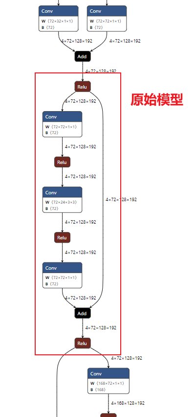


* **所有的Conv插入QDQ**

首先，按照“TensorRT量化实战课YOLOv7量化”的方法会将所有Conv层插入QDQ节点如下图

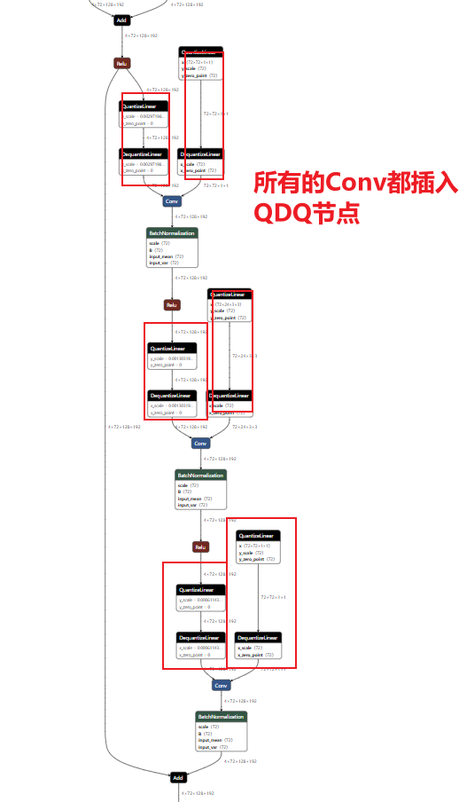

**绘制对应的engine结构图**图如下：会发现存在一些FP16的精度，是在残差的链接部分。

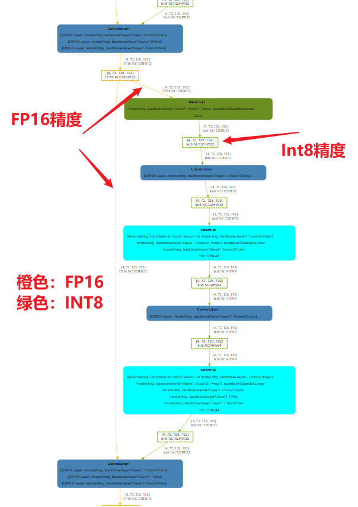

放大看一下细节

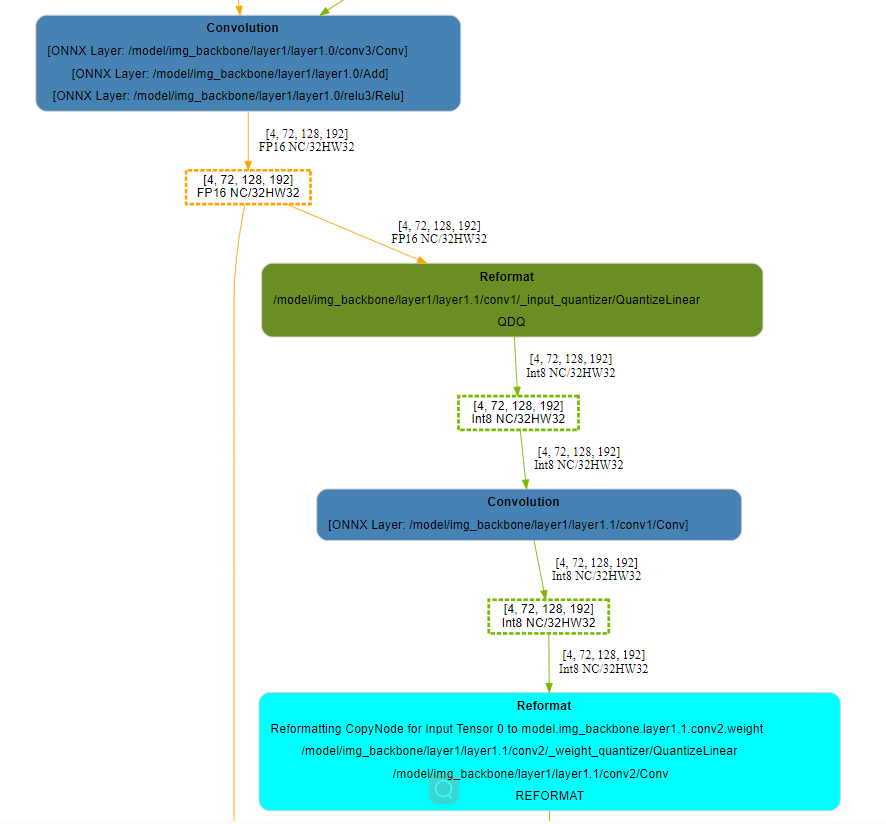

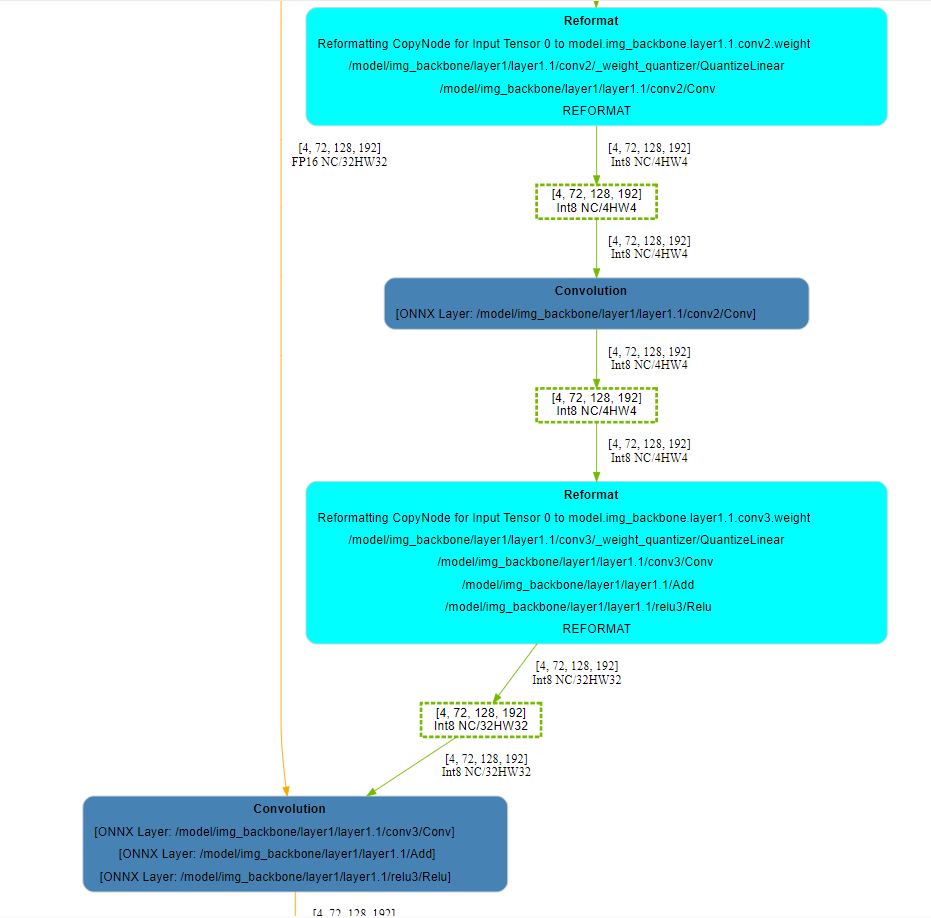

**为什么会出现残差是FP16的精度**？但是另一侧都是INT8的精度？重新看一下我们插入QDQ后的onnx结构图。

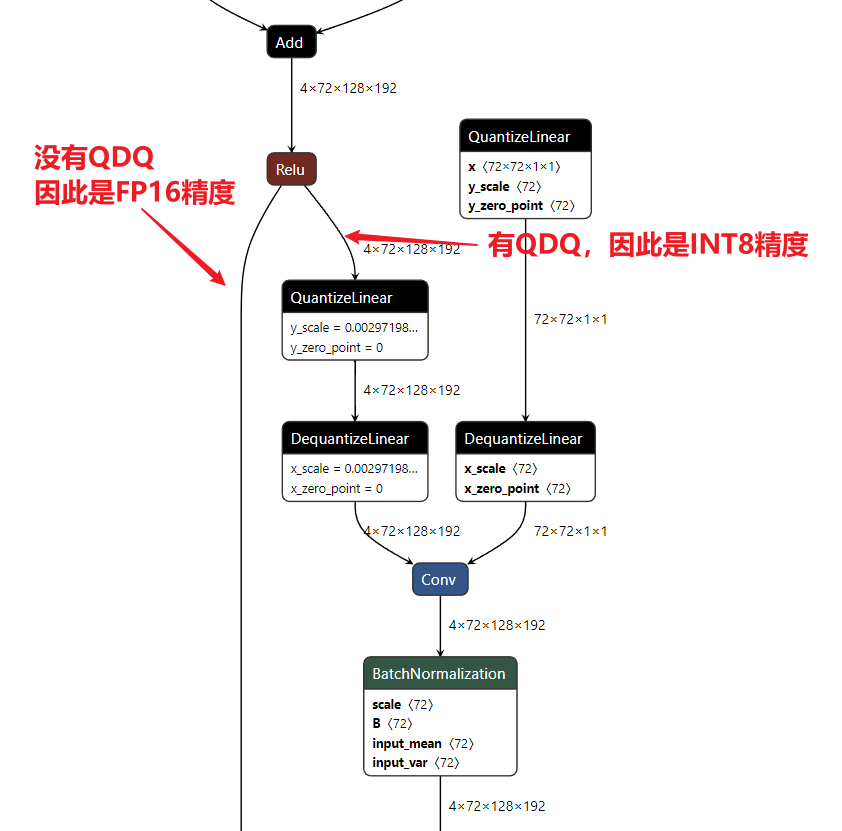

**如何解决这个问题呢？**修改Add节点的forward函数，将add的两条线中都插入QDQ节点。具体的方法可以参考NV官方代码 https://github.com/NVIDIA-AI-IOT/yolo_deepstream/blob/main/yolov7_qat/quantization/quantize.py

官方代码只是一个修改yolov7的add节点的方法，我们这里需要根据自己的模型结构修改，但是大体都是一样的，**就是修改原始的模型的add的forward函数，修改为带有QDQ的add的forward函数。这里就是找出原始模型中add的forward，复制出来修改为QDQ版本**，**除了Add节点，其他的节点修改都是类似的操作。**

这里就有两个问题，

* 我们如何定位原始的add的forward函数源码？

  如果模型不是我们设计的，那我们可以debug来定位。

* 我们如何修改原始add为量化后的add节点？

  这里就需要编写代码找到模型中的所有需要修改的add节点，如下面的代码就是通过下面的代码段找到Bottleneck中的所有add节点。如果不知道Bottleneck这个名字，我们依然可以使用debug来一步一步查看模型结构及名称，找到自己需要修改的模型部分的名称。

  ```python
  for name, bottleneck in model.named_modules():
          if bottleneck.__class__.__name__ == "Bottleneck":
  ```

  

```python
class QuantAdd(torch.nn.Module):
    def __init__(self, quantization):
        super().__init__()

        if quantization:
            self._input0_quantizer = quant_nn.TensorQuantizer(QuantDescriptor(num_bits=8, calib_method="histogram"))
            self._input1_quantizer = quant_nn.TensorQuantizer(QuantDescriptor(num_bits=8, calib_method="histogram"))
            self._input0_quantizer._calibrator._torch_hist = True
            self._input1_quantizer._calibrator._torch_hist = True
            self._fake_quant = True
        self.quantization = quantization

    def forward(self, x, y):
        if self.quantization:
            # print(f"QAdd {self._input0_quantizer}  {self._input1_quantizer}")
            return self._input0_quantizer(x) + self._input1_quantizer(y)
        return x + y
    
# For example: YoloV5 Bottleneck
def bottleneck_quant_forward(self, x):
    if hasattr(self, "addop"):
        return self.addop(x, self.cv2(self.cv1(x))) if self.add else self.cv2(self.cv1(x))
    return x + self.cv2(self.cv1(x)) if self.add else self.cv2(self.cv1(x))


# For example: YoloV5 Bottleneck
def replace_bottleneck_forward(model):
    for name, bottleneck in model.named_modules():
        if bottleneck.__class__.__name__ == "Bottleneck":
            if bottleneck.add:
                if not hasattr(bottleneck, "addop"):
                    print(f"Add QuantAdd to {name}")
                    bottleneck.addop = QuantAdd(bottleneck.add)
                bottleneck.__class__.forward = bottleneck_quant_forward
```

例如我在另一个模型的结构中就是如下代码，实际是类似的，`mmdet.models.backbones.resnext.Bottleneck`是我debug找到的名字。

```python
def replace_bottleneck_forward(module, quantization):
    for name, child in module.named_children():
        if isinstance(child, mmdet.models.backbones.resnext.Bottleneck):
            if not hasattr(child, "addop"):
                print(f"**** Add QuantAdd to {name}")
                downsample_flag = False #downsample_flag = True
                if child.downsample == None:
                    downsample_flag = False
                child.addop = QuantAdd(quantization,downsample_flag) # downsample_flag=False 残差结构的残差部分有QDQ，另一个不用。可以使conv add relu 融合
            # 将 forward 方法替换为新的 forward 方法
            child.__class__.forward = Bottleneck_quant_forward
        else:
            # 递归处理子模块
            replace_bottleneck_forward(child,quantization)
```

根据上述方法，修改我们的模型的add节点为带有QDQ的add，重新生成onnx文件并绘制engine结构图如下：

从下onnx可以看到我们的add两个分支都有了QDQ节点。

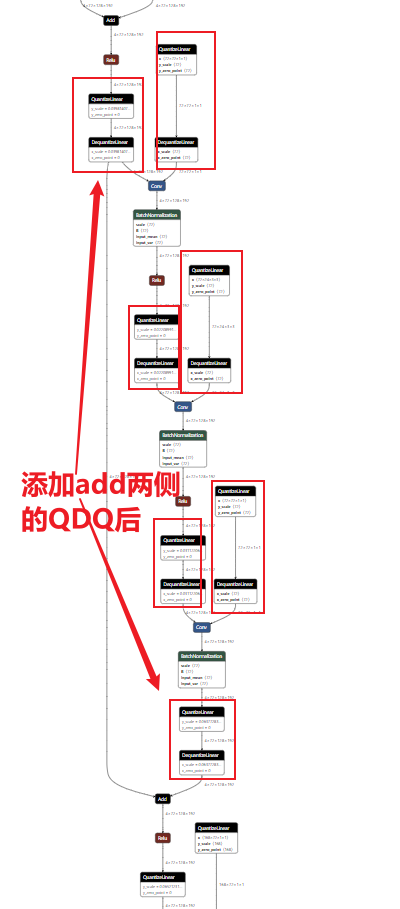

绘制对应的engine图如下，可以看出add两个分支都是INT8精度了。

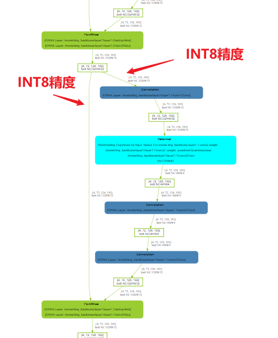

但是到这里还没有完。。。我们对比一下使用trtexec --best参数转换的engine。如下图

可以看到--best参数转换的engine的层融合和上图不同，上面的图最后一层是`PointWise`，只融合了add和relu，但是--best融合了conv、add、relu。

```txt
PointWise
[ONNX Layer: /model/img_backbone/layer1/layer1.1/addop/Add]
[ONNX Layer: /model/img_backbone/layer1/layer1.1/relu3/Relu]
```


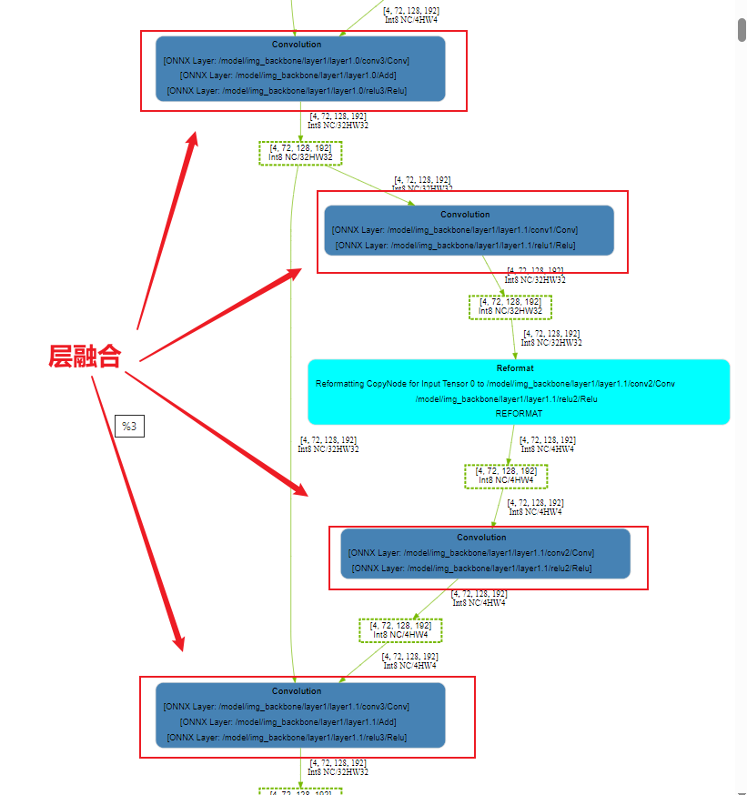

那么如何做到类似--best一样的层融合呢？

观察一下--best的融合层，在onnx中是如下图。

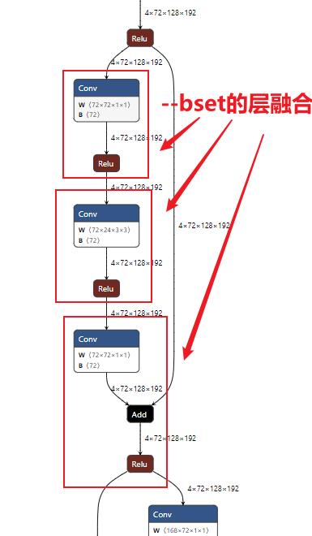

结合前面博客提到的 [7-TensorRT中的INT8 | 奔跑的IC](https://zmurder.github.io/TensorRT/TensorRT中文版开发手册/7-TensorRT中的INT8/?highlight=融合) 7.4.4. Q/DQ Layer-Placement Recommendations，官方文档[5.3.5.2. Q/DQ Layer-Placement Recommendations](https://docs.nvidia.com/deeplearning/tensorrt/archives/tensorrt-803/developer-guide/index.html#qdq-placement-recs) 都有提到融合的策略。

那我需要针对惨差的Add节点修改一下，不能共用官方代码yolov7的QuantAdd了。修改方法如下：

* **残差的Add两个分支，只有残差的分支添加QDQ，另一个分支不添加QDQ。**

修改后的代码如下

```python
class QuantAdd(torch.nn.Module):
    def __init__(self, quantization,downsample_flag):
        super().__init__()

        if quantization:
            self._input0_quantizer = quant_nn.TensorQuantizer(QuantDescriptor(num_bits=8, calib_method="max"))
            self._input1_quantizer = quant_nn.TensorQuantizer(QuantDescriptor(num_bits=8, calib_method="max"))
            self._input0_quantizer._calibrator._torch_hist = True
            self._input1_quantizer._calibrator._torch_hist = True
            self._fake_quant = True
        self.quantization = quantization
        self.downsample_flag = downsample_flag

    def forward(self, x, y):
        # if self.quantization:
        #     return self._input0_quantizer(x) + self._input1_quantizer(y)
        if self.quantization and self.downsample_flag: #zyd 优化
            # print(f"QAdd {self._input0_quantizer}  {self._input1_quantizer}")
            return self._input0_quantizer(x) + self._input1_quantizer(y)
        elif self.quantization:
            return x + self._input1_quantizer(y) #走这个分支

        return x + y
```

修改后的onnx如下

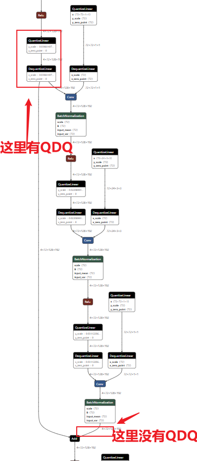

对应的engine图如下：可以看出已经和 --best的一致了。至此已经算是优化完成了。

（可以看到--best和我们下面的图是一致的，但是都有一个Reformat节点，这个节点大大影响了我们的速度，这个reformat节点本来是不应该存在的，但是因为为了利用Tensor core，Tensor对int8 的对齐要求是32 ，参考[Part5-3-TensorRT性能优化性能优化技巧 | 奔跑的IC](https://zmurder.github.io/TensorRT/TensorRT教程-基于8.6.1/Part5-3-TensorRT性能优化性能优化技巧/?highlight=tensor+core#2-4-Optimizing-for-Tensor-Cores)  从trt的日志也可以看出

```bash
Layer(Reformat): Reformatting CopyNode for Input Tensor 0 to /model/img_backbone/layer1/layer1.1/conv2/Conv + /model/img_backbone/layer1/layer1.1/relu2/Relu, Tactic: 0x0000000000000000, /model/img_backbone/layer1/layer1.1/relu1/Relu_output_0 (Int8[4,72:32,128,192]) -> Reformatted Input Tensor 0 to /model/img_backbone/layer1/layer1.1/conv2/Conv + /model/img_backbone/layer1/layer1.1/relu2/Relu (Int8[4,72:4,128,192])

```

这里就是提示就是72不是32整除的，因此有一个reformat节点，为了充分的利用tensor core（对conv来说 32字节对齐的是C，也就是NCHW中的C需要是32字节对齐）。这个问题可以通过修改网路结构来消除。

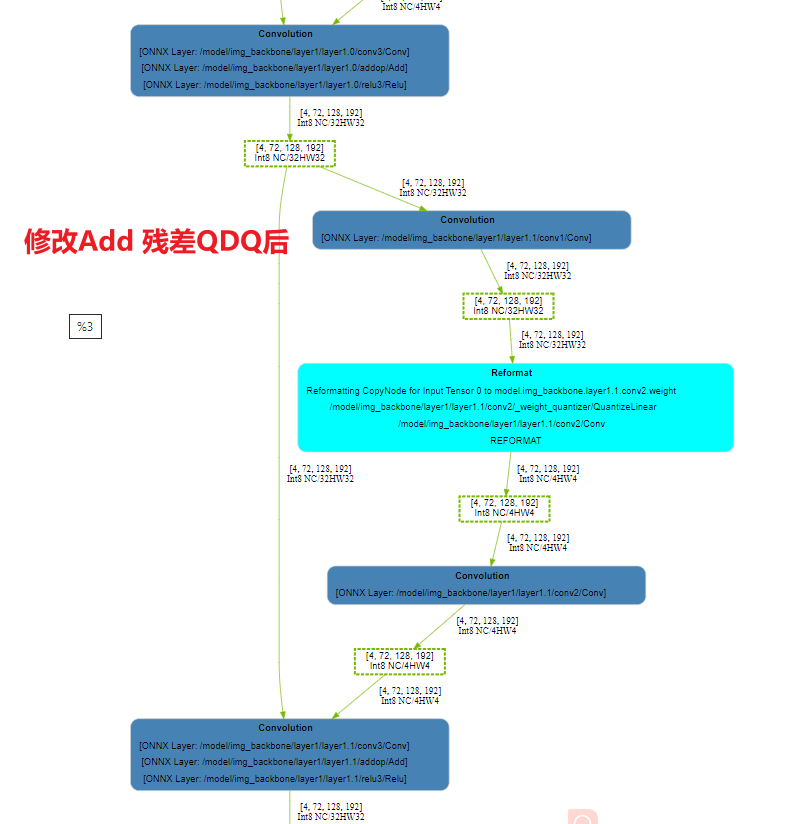

## 2.2 concat节点

在官方代码中有一个函数是`apply_custom_rules_to_quantizer`

```python
def apply_custom_rules_to_quantizer(model : torch.nn.Module, export_onnx : Callable):

    # apply rules to graph
    export_onnx(model, "quantization-custom-rules-temp.onnx")
    pairs = find_quantizer_pairs("quantization-custom-rules-temp.onnx")
    for major, sub in pairs:
        print(f"Rules: {sub} match to {major}")
        get_attr_with_path(model, sub)._input_quantizer = get_attr_with_path(model, major)._input_quantizer
    os.remove("quantization-custom-rules-temp.onnx")

    for name, bottleneck in model.named_modules():
        if bottleneck.__class__.__name__ == "Bottleneck":
            if bottleneck.add:
                print(f"Rules: {name}.add match to {name}.cv1")
                major = bottleneck.cv1.conv._input_quantizer
                bottleneck.addop._input0_quantizer = major
                bottleneck.addop._input1_quantizer = major
```

其中的函数`find_quantizer_pairs`定义如下：

```python
def find_quantizer_pairs(onnx_file):

    model = onnx.load(onnx_file)
    match_pairs = []
    for node in model.graph.node:   
        if node.op_type == "Concat":
            qnodes = find_all_with_input_node(model, node.output[0])
            major = None
            for qnode in qnodes:
                if qnode.op_type != "QuantizeLinear":
                    continue
                
                conv = find_quantizelinear_conv(model, qnode)
                if major is None:
                    major = find_quantize_conv_name(model, conv.input[1])
                else:
                    match_pairs.append([major, find_quantize_conv_name(model, conv.input[1])])

                for subnode in model.graph.node:
                    if len(subnode.input) > 0 and subnode.op_type == "QuantizeLinear" and subnode.input[0] in node.input:
                        subconv = find_quantizelinear_conv(model, subnode)
                        match_pairs.append([major, find_quantize_conv_name(model, subconv.input[1])])

        elif node.op_type == "MaxPool":
            qnode = find_with_input_node(model, node.output[0])
            if not (qnode and qnode.op_type == "QuantizeLinear"):
                continue

            major = find_quantizelinear_conv(model, qnode)
            major = find_quantize_conv_name(model, major.input[1])
            same_input_nodes = find_all_with_input_node(model, node.input[0])

            for same_input_node in same_input_nodes:
                if same_input_node.op_type == "QuantizeLinear":
                    subconv = find_quantizelinear_conv(model, same_input_node)
                    match_pairs.append([major, find_quantize_conv_name(model, subconv.input[1])])
    return match_pairs
```

这段`find_quantizer_pairs`代码就是找到一些匹配对，然后使用下面的函数让这些匹配对的QDQ是相同的，也就是scales是相同的。因为一个concat节点只是连接数据，并没有计算，所以concat连接的几个节点scales应该是相同的。可以加速。

```python
for major, sub in pairs:
        print(f"Rules: {sub} match to {major}")
        get_attr_with_path(model, sub)._input_quantizer = get_attr_with_path(model, major)._input_quantizer
```

对应如下图可以好理解一些。

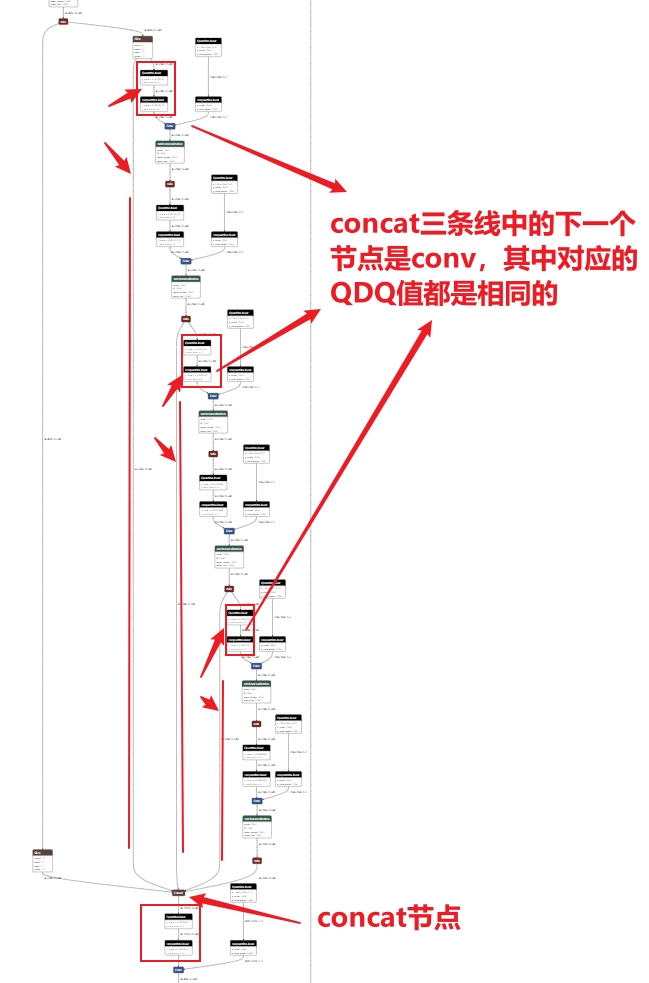

上面的图太不清晰了，画一个示意图解释一下


## 2.3 MUL节点

首先看一下第一种没有INT8的情况

对应的onnx如下，看上去插入的QDQ都是正确的。


但是绘制对应的engine结构图如下：


如何修改呢？针对上面的情况，在sigmoid前面插入一个QDQ，同时保证下图三个QDQ的值是相同的即可

修改后的如下图onnx


修改后的engine结构图如下：


## 2.4 convTranspose节点

首先看一下我们初步插入QDQ后的onnx结构图，看样子应该没有问题


对应的engine图如下


发现在relu前竟然转换为了FP32精度

如何修改呢？修改方式是删除relu层，修改后的onnx如下：


修改后的engine图对应如下：


## 3 engine结构图的绘制

上面都提到了engine结构图的绘制，之前的博客也提到了enigne结构图如何绘制，这里再重新说明一下

* 在使用trtexec转换onne为engine时添加参数

   `--exportLayerInfo=layer.json --profilingVerbosity=detailed --exportProfile=profile.json`

  例如：

  ```bash
  $ /usr/src/tensorrt/bin/trtexec --onnx=yolov7.onnx --fp16 --int8 --verbose --saveEngine=yolov7_ptq.engine --workspace=1024000 --warmUp=500 --duration=10  --useCudaGraph --useSpinWait --noDataTransfers --exportLayerInfo=yolov7_ptq_layer.json --profilingVerbosity=detailed --exportProfile=yolov7_ptq_profile.json
  ```

* we use TensorRT opensource tool: [trt-engine-explorer](https://github.com/NVIDIA/TensorRT/tree/main/tools/experimental/trt-engine-explorer) drawing the enqueue graph of TensorRT. This tool take the trtexec exported layer json information as input. Use the below code to draw the TensorRT-Engine-graph.(edit from `trt-engine-explorer/utils/draw_engine.py`)

  ```python
  import graphviz
  from trex import *
  import argparse
  import shutil
  
  
  def draw_engine(engine_json_fname: str, engine_profile_fname: str):
      graphviz_is_installed =  shutil.which("dot") is not None
      if not graphviz_is_installed:
          print("graphviz is required but it is not installed.\n")
          print("To install on Ubuntu:")
          print("sudo apt --yes install graphviz")
          exit()
  
      plan = EnginePlan(engine_json_fname, engine_profile_fname)
      formatter = layer_type_formatter
      display_regions = True
      expand_layer_details = False
  
      graph = to_dot(plan, formatter,
                  display_regions=display_regions,
                  expand_layer_details=expand_layer_details)
      render_dot(graph, engine_json_fname, 'svg')
  
  
  if __name__ == "__main__":
      parser = argparse.ArgumentParser()
      parser.add_argument('--layer', help="name of engine JSON file to draw")
      parser.add_argument('--profile', help="name of profile JSON file to draw")
      args = parser.parse_args()
      draw_engine(engine_json_fname=args.layer,engine_profile_fname=args.profile)
  ```

* draw the graph:

  ```
  $ python draw_engine.py --layer yolov7_qat_layer.json --profile yolov7_qat_profile.json
  $ python draw_engine.py --layer yolov7_ptq_layer.json --profile yolov7_ptq_profile.json
  ```

  we get `yolov7_qat_layer.json.svg` and `yolov7_ptq_layer.json.svg`


# 附录：

* NV官方yolov PTQ代码：[yolo_deepstream/yolov7_qat at main · NVIDIA-AI-IOT/yolo_deepstream](https://github.com/NVIDIA-AI-IOT/yolo_deepstream/tree/main/yolov7_qat)
* NV官方的一些建议：https://github.com/NVIDIA-AI-IOT/yolo_deepstream/blob/main/yolov7_qat/doc/Guidance_of_QAT_performance_optimization.md