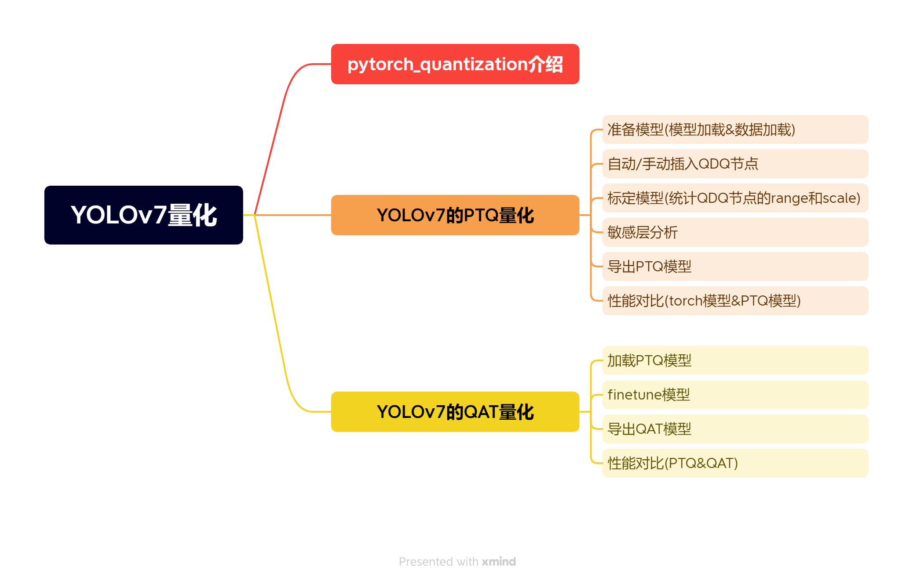
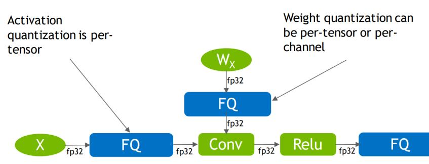
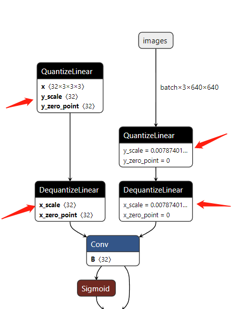
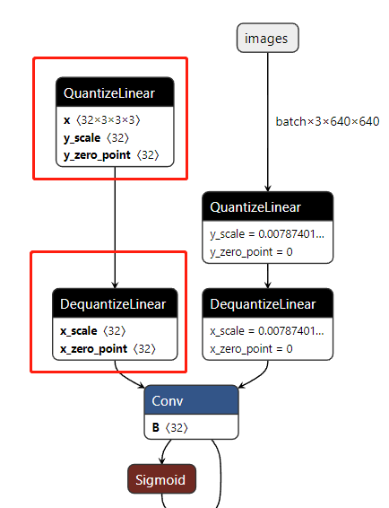
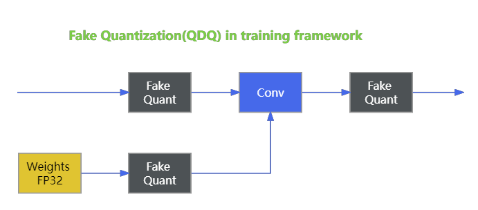
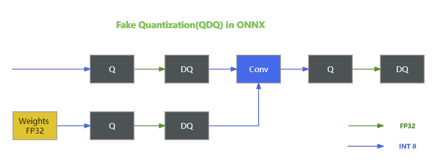

 

# 目录

*   *   [前言](#_1)
    *   [1\. 课程介绍](#1__15)
    *   [2\. pytorch\_quantization](#2_pytorch_quantization_36)
    *   *   [2.1 initialize函数](#21_initialize_54)
        *   [2.2 tensor\_quant模块](#22_tensor_quant_88)
        *   [2.3 TensorQuantizer类](#23_TensorQuantizer_132)
        *   [2.4 QuantDescriptor类](#24_QuantDescriptor_168)
        *   [2.5 calib模块](#25_calib_196)
    *   [总结](#_215)

# 前言

> 手写 AI 推出的全新 TensorRT [模型量化](https://so.csdn.net/so/search?q=%E6%A8%A1%E5%9E%8B%E9%87%8F%E5%8C%96&spm=1001.2101.3001.7020)实战课程，[链接](https://www.bilibili.com/video/BV1NN411b7HZ/?spm_id_from=333.999.0.0)。记录下个人学习笔记，仅供自己参考。
> 
> 该实战课程主要基于手写 AI 的 Latte 老师所出的 [TensorRT下的模型量化](https://www.bilibili.com/video/BV18L41197Uz/)，在其课程的基础上，所整理出的一些实战应用。
> 
> 本次课程为 YOLOv7 量化实战第一课，主要介绍 TensorRT 量化工具箱 pytorch\_quantization。
> 
> 课程大纲可看下面的思维导图



# 1\. 课程介绍

什么是模型量化呢？那我们都知道[模型训练](https://ml-summit.org/cloud-member?uid=c1041&spm=1001.2101.3001.7020)的时候是使用的 float32 或 float16 的浮点数进行运算，这样模型能保持一个比较好的效果，但浮点数在提升计算精度的同时也导致了更多的计算量以及存储空间的占用。

由于在模型推理阶段我们并不需要进行梯度反向传播，因此我们不需要那么高的计算精度，这时可以将高精度的模型参数映射到低精度上，可以降低运算量提高推理速度。

**将模型从高精度运算转换到低精度运算的过程就叫做模型量化**

量化的过程与数据的分布有关，当数据分布比较均匀的时候，高精度 float 向低精度 int 进行映射时就会将空间利用得比较充分，如果数据分布不均匀就会浪费很大的表示空间。

量化又分为饱和量化和非饱和量化，如果直接将量化阈值设置为 ∣ x max ∣ |x\_{\\text{max}}| ∣xmax​∣，此时 INT8 的表示空间没有被充分的利用，这是非饱和量化

如果选择了一个比较合适的阈值，舍弃那些超出范围的数值，再进行量化，那这种量化因为充分利用 INT8 的表示空间因此也被称为饱和量化。

模型量化及其意义可以总结为：

*   模型量化是指将神经网络的浮点转换为定点
*   模型量化主要意义就是加快模型端侧的推理速度，并降低设备功耗和减少存储空间，工业界一般只使用 INT8 量化模型。

本系列实战课程需要大家具备一些基本的量化知识，如果对模型量化知识模糊的看官的可以先观看 [TensorRT下的模型量化](https://www.bilibili.com/video/BV18L41197Uz/) 课程。

# 2\. pytorch\_quantization

我们先对 TensorRT 的量化工具箱 pytorch\_quantization 做一个简单的介绍

它的安装指令如下：

```shell
pip install pytorch-quantization --extra-index-url https://pypi.ngc.nvidia.com
```

**要求**：torch >= 1.9.1，Python >= 3.7， GCC >= 5.4

在博主之前学习的过程中，发现 pytorch 的版本和 pytorch\_quantization 的版本如果不适配可能会导致一些问题。

目前博主的[软件](https://marketing.csdn.net/p/3127db09a98e0723b83b2914d9256174?pId=2782?utm_source=glcblog&spm=1001.2101.3001.7020)版本是：**pytorch==2.0.1**，**pytorch\_quantization==2.1.3**

我们下面介绍下 pytorch\_quantization 工具库中的一些[函数](https://marketing.csdn.net/p/3127db09a98e0723b83b2914d9256174?pId=2782?utm_source=glcblog&spm=1001.2101.3001.7020)、类和模块

## 2.1 initialize函数

首先是 quant\_modules 模块中的 initialize() 函数，它的使用如下：

```python
import torchvision
from pytorch_quantization import quant_modules

quant_modules.initialize()  # quant_modules 初始化,自动为模型插入量化节点
model = torchvision.models.resnet50()   # 加载 resnet50 模型
# model 是带有量化节点的模型
```

它的作用是初始化量化相关的设置和一些参数，因此我们需要在量化之前调用它。因为不同类型的神经网络层如 Conv、Linear、Pool 等等，它们所需要的量化方法是不同的，例如某个网络层当中的校准方法可能用的是 Max，也有可能用的是直方图，那这都可以在我们量化之前通过 **initialize** 来进行一个设置。

**initialize** 还有一个作用，那就是将模型中的 torch 网络层替换为相应的 quant 量化层，如下所示：

```python
torch.nn.Conv2d     ->  quant_modules.quant_nn.Conv2d
torch.nn.Linear     ->  quant_modules.quant_nn.Linear
torch.nn.MaxPool2d  ->  quant_modules.quant_nn.MaxPool2d
```

也就是会把 torch 中对应的算子转换为相应的量化版本。

总的来说，**initialize** 用于在量化模型之前，对量化过程进行必要的配置和准备工作以确保量化操作时按照我们所需要的方式进行，这样的话有助于提高量化模型的性能。

在我们调用 **initialize** 之后，我们的模型结构会插入 FQ 节点，也就是 fake 算子，如下图所示：



那在之后的代码讲解部分我们会清晰的观察到在调用 initialize 前后模型结构的一些变化。

## 2.2 tensor\_quant模块

然后是 tensor\_quant 模块，它的使用如下：

```python
from pytorch_quantization import tensor_quant

tensor_quant.fake_tensor_quant()
tensor_quant.tensor_quant()
```

**tensor\_quant** 模块负责进行张量数据的量化操作。那在模型量化过程中我们有两种量化方式：

*   **模型 weights 的量化**：对于权重的量化我们是对权重的**每个通道**进行量化，比如一个 Conv 层的通道数是 32，这意味着 32 个通道数的每个通道都有一个对应的 scale 值去进行量化。
*   **模型 inputs/activate 的量化**：而对于输入或者激活函数数值而言，它们的量化是对**每个张量**进行量化，也就是说整个 Tensor 数据都是用同一个 scale 值进行量化

具体见下图：



在上面的图中我们可以清楚的看到右边是我们的输入量化，inputs 的量化 scale 只有一个，而左边是我们的权重量化，weights 的量化 scale 有 32 个，这是因为 Conv 的通道数是 32，它有 32 个 channel，每个 channel 对应一个 scale。

下面的代码使用了 **tensor\_quant** 模块中的函数对张量进行量化：

```python
fake_quant_x   = tensor_quant.fake_tensor_quant(x, x.abs().max) # Q 和 DQ 节点组成了 Fake 算子
quant_x, scale = tensor_quant.tensor_quant(x, x.abs().max())    # Q 节点的输出和 scale 值
```

我们先来看看 **tensor\_quant** 中的两个函数

*   **tensor\_quant.fake\_tensor\_quant**
    *   这个函数通常用于模拟量化的过程，而不是实际上执行量化，也就是我们通常说的**伪量化**
    *   **伪量化**（Fake Quantization）是一种在训练过程中模拟量化效果的技术，**但在内部仍然保持使用浮点数**。
    *   这样做的目的是使模型适应量化带来的精度损失，从而在实际进行量化时能够保持较好的性能。
*   **tensor\_quant.tensor\_quant**
    *   这个函数用于实际对张量进行量化，它将输入的浮点数张量转换为定点数的表示（比如从 floa32 转换为 int8）
    *   这个过程涉及确定量化的比例因子 scale 和零点 zero-point，然后应用这些参数将浮点数映射到量化的整数范围内。

在上面的代码中，**x** 是我们的输入数据，**x.abs().Max** 代表我们使用基于 Max 的对称量化方法进行量化，函数的输出 **fake\_quant\_x** 是经过伪量化处理的张量，它看起来像是被量化了，但实际上仍然是浮点数。

tensor\_quant 函数的输出 **quant\_x** 是我们经过实际 int 量化处理后得到的 int 类型的张量，**scale** 则是我们用于量化过程中的比例因子。

## 2.3 TensorQuantizer类

下面我们来看看将量化后的模型导出要做哪些操作，实际上我们需要使用到 **nn** 模块中的 **TensorQuantizer**，它的使用如下：

```python
from pytorch_quantization import nn as quant_nn

quant_nn.TensorQuantizer.use_fb_fake_quant = True   # 模型导出时将一个 QDQ 算子导出两个 op
```

其中 pytorch\_quantizaiton 的 **nn** 模块提供了量化相关的神经网络层和工具，大家可以类比于 pytorch 中的 nn 模块。而 **TensorQuantizer** 是一个用于张量量化的工具类，**use\_fb\_fake\_quant** 是它的一个类属性，用于控制量化过程中伪量化的行为。

我们将 **use\_fb\_fake\_quant** 设置为 True 表明我们在导出量化模型时，希望将量化和反量化操作过程作为两个单独的 op 算子来导出，如下图所示：



可以看到上图中的红色框部分，导出的量化模型中包含 QuantizeLinear 和 DequantizeLinear 两个模块，对应我们的量化和反量化两个 op。

在我们将 **use\_fb\_fake\_quant** 设置为 True 的时候，它会调用的是 pytorch 模块中的两个函数，如下：

```python
torch.fake_quantize_per_tensor_affine
torch.fake_quantize_per_channel_affine
```

这两个函数会导出我们之前量化的操作，值得注意的是，**在模型导出和模型前向阶段**的量化操作并不是使用 **tensor\_quant** 模块中的函数来实现的，而是使用 torch 中上述两个函数来实现，这样做是因为更容易转化成相应 的 tensorRT 的一个操作符，以便我们后续的部署。**在模型训练阶段**，我们则是调用 **tensor\_quant** 函数插入 fake 算子来进行量化的，大家需要了解到在模型训练和前向阶段调用的函数的不同。

在 Torch-TesorRT 内部，fake\_quantize\_per\_\*\_affine 会被转换为 QuantizeLayer 和 DequantizerLayer，也就是我们上面导出 ONNX 模型的两个 op 算子。





从上图中我们能清晰的看出在模型训练的时候和模型导出的时候 Q/DQ 节点所发生的一个变化，在模型训练的时候，我们是通过 tensor\_quant 来插入 fake 算子来实现量化的，而在模型训练完成后导出 ONNX 时，我们是需要将 use\_fb\_fake\_quant 置为 True，它会调用 torch 中的函数将 fake 算子的节点导出成 Q 和 DQ 两个模块。

## 2.4 QuantDescriptor类

接下来我们再来看下 **QuantDescriptor** 类，它的使用如下：

```python
import torch
import pytorch_quantization.nn as quant_nn
from pytorch_quantization.tensor_quant import QuantDescriptor

# 自定义层的量化
class QuantMultiAdd(torch.nn.Module):
    def __init__(self):
        super().__init__()
        self._input_quantizer  = quant_nn.TensorQuantizer(QuantDescriptor(
                                 num_bits=8, calib_method="histogram"))
        self._weight_quantizer = quant_nn.TensorQuantizer(QuantDescriptor(
                                 num_bits=8, axis=(1), calib_method="histogram"))
    def forward(self, w, x, y):
        return self._weight_quantizer(w) * self._input_quantizer(x) + self._input_quantizer(y)
```

**QuantDescriptor** 类主要是用于配置量化的描述符，包括量化的位数，量化的方法等等。在上面的代码中，我们创建了一个自定义的量化层，该层对权重和输入进行量化，并执行加权乘法和加法操作

*   我们先创建了两个 TensorQuantizer 实例，一个是 \_input\_quantizer 用于输入量化，另一个是 \_weight\_quantizer 用于权重量化
*   我们使用 QuantDescriptor 来描述量化的参数，对于这两个量化器，都使用了 8bit 量化，量化的校准方法都设置为直方图校准

也就是说，我们使用 QuantDescriptor 可以实现自定义层的量化操作，在后续代码介绍的时候会使用到这个类。

## 2.5 calib模块

我们再来看下 pytorch\_quantization 中的校准模块 **calib**，它的使用如下：

```python
from pytorch_quantization import calib

if isinstance(module._calibrator, calib.MaxCalibrator):
    module.load_calib_amax()
```

calib 校准模块包含 MaxCalibrator 和 HistogramCalibrator 两个校准类，其中 MaxCalibrator 用于执行最大值校准，在我们的量化训练中，我们通常会确定每个张量的一个动态范围，也就是它们的最大值和最小值，Max 方法通过跟踪张量的最大值来执行标定工作，以便在量化推理时能将其映射到 int 整数范围之内。

而对于 Histogram 直方图校准方法则是通过收集和分析张量值的直方图来确定我们的动态范围，这种方法可以更准确地估计张量值的一个分布，并且更好地适应不同数据分布的情况。

这两种校准方法在模型量化中都有它们各自的优势，具体选择哪种校准方法主要取决于我们具体的应用场景和数据分布的情况，我们通常是根据数据分布和量化的需求来选择合适的校准方法，以确保量化后的模型在推理时能保持一个比较好的准确性。

以上就是关于 pytorch\_quantization 中的函数、类和模块的简单介绍。

# 总结

> 本次课程介绍了 pytorch\_quantization 量化工具以及其中的一些函数、类和模块。在我们量化之前需要调用 initialize 函数来初始化量化相关的一些设置和参数。接着我们会使用 tensor\_quant 模块来对张量数据进行实际的量化，而在量化完成后导出时我们需要将 TensorQuantizer 类中的属性 usb\_fb\_fake\_quant 设置为 True，使得导出的量化模型包含 Q、DQ 两个模块。这是因为在模型训练阶段和前向、导出阶段的量化操作调用的函数是不同的，训练阶段是通过 tensor\_quant 函数插入 fake 算子来量化的，而导出阶段是 torch 中的两个函数来实现的。
> 
> 在量化过程中我们还会使用 QuantDescriptor 来配置量化的一些参数，包括量化位数、量化方法等等，最后我们简单介绍了 Calib 校准模块，它包含 Max 和 Histogram 两种校准方法。
> 
> 下节我们正式进入 YOLOv7-PTQ 量化的学习😄

本文转自 <https://blog.csdn.net/qq_40672115/article/details/134100268>，如有侵权，请联系删除。