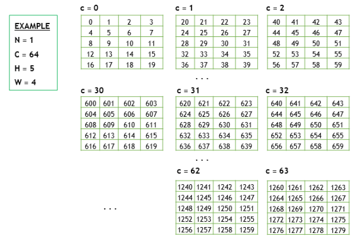
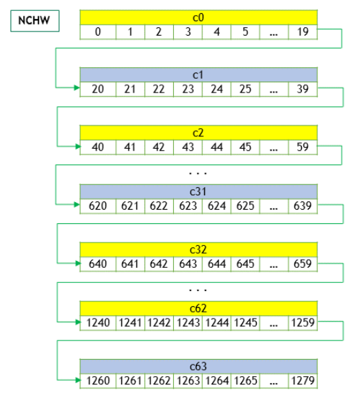
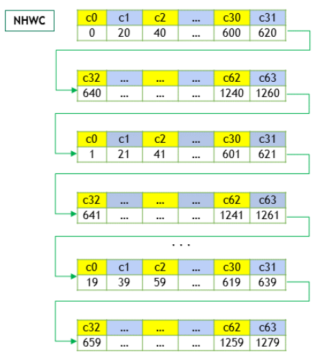
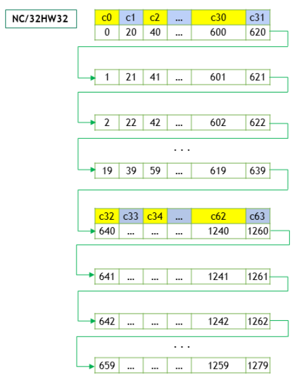

# 1 简介

关于tensor的内存排布已经有几篇文章都提到了。这里发现官网也一篇解释。直接搬过来，不翻译了，怕翻译出现异议。

## Tensors and Layouts[](https://docs.nvidia.com/deeplearning/cudnn/v9.4.0/developer/core-concepts.html#tensors-and-layouts)

Whether using the graph API or the legacy API, cuDNN operations take tensors as input and produce tensors as output.

### Tensor Descriptor[](https://docs.nvidia.com/deeplearning/cudnn/v9.4.0/developer/core-concepts.html#tensor-descriptor)

The cuDNN library describes data with a generic n-D tensor descriptor defined with the following parameters:

> - a number of dimensions from 3 to 8
> - a data type (32-bit floating-point, 64 bit-floating point, 16-bit floating-point…)
> - an integer array defining the size of each dimension
> - an integer array defining the stride of each dimension (for  example, the number of elements to add to reach the next element from  the same dimension)

This tensor definition allows, for example, to have some dimensions  overlapping each other within the same tensor by having the stride of  one dimension smaller than the product of the dimension and the stride  of the next dimension. In cuDNN, unless specified otherwise, all  routines will support tensors with overlapping dimensions for  forward-pass input tensors, however, dimensions of the output tensors  cannot overlap. Even though this tensor format supports negative strides (which can be useful for data mirroring), cuDNN routines do not support tensors with negative strides unless specified otherwise.

#### WXYZ Tensor Descriptor[](https://docs.nvidia.com/deeplearning/cudnn/v9.4.0/developer/core-concepts.html#wxyz-tensor-descriptor)

Tensor descriptor formats are identified using acronyms, with each  letter referencing a corresponding dimension. In this document, the  usage of this terminology implies:

> - all the strides are strictly positive
> - the dimensions referenced by the letters are sorted in decreasing order of their respective strides

#### 3-D Tensor Descriptor[](https://docs.nvidia.com/deeplearning/cudnn/v9.4.0/developer/core-concepts.html#d-tensor-descriptor)

A 3-D tensor is commonly used for matrix multiplications, with three  letters: B, M, and N. B represents the batch size (for batch matmul), M  represents the number of rows, and N represents the number of columns.  Refer to the [CUDNN_BACKEND_OPERATION_MATMUL_DESCRIPTOR](https://docs.nvidia.com/deeplearning/cudnn/v9.4.0/api/cudnn-graph-library.html#cudnn-backend-operation-matmul-descriptor) operation for more information.

#### 4-D Tensor Descriptor[](https://docs.nvidia.com/deeplearning/cudnn/v9.4.0/developer/core-concepts.html#four-d-tensor-descriptor)

A 4-D tensor descriptor is used to define the format for batches of  2D images with 4 letters: N,C,H,W for respectively the batch size, the  number of feature maps, the height and the width. The letters are sorted in decreasing order of the strides. The commonly used 4-D tensor  formats are:

> - NCHW
> - NHWC
> - CHWN

#### 5-D Tensor Descriptor[](https://docs.nvidia.com/deeplearning/cudnn/v9.4.0/developer/core-concepts.html#five-d-tensor-descriptor)

A 5-D tensor descriptor is used to define the format of the batch of  3D images with 5 letters: N,C,D,H,W for respectively the batch size, the number of feature maps, the depth, the height, and the width. The  letters are sorted in decreasing order of the strides. The commonly used 5-D tensor formats are called:

> - NCDHW
> - NDHWC
> - CDHWN

#### Fully-Packed Tensors[](https://docs.nvidia.com/deeplearning/cudnn/v9.4.0/developer/core-concepts.html#fully-packed-tensors)

A tensor is defined as `XYZ-fully-packed` if, and only if:

> - the number of tensor dimensions is equal to the number of letters preceding the `fully-packed` suffix
> - the stride of the i-th dimension is equal to the product of the (i+1)-th dimension by the (i+1)-th stride
> - the stride of the last dimension is 1

#### Partially-Packed Tensors[](https://docs.nvidia.com/deeplearning/cudnn/v9.4.0/developer/core-concepts.html#partially-packed-tensors)

The partially `XYZ-packed` terminology only applies in the context of a tensor format described  with a superset of the letters used to define a partially-packed tensor. A WXYZ tensor is defined as `XYZ-packed` if, and only if:

> - the strides of all dimensions NOT referenced in the `-packed` suffix are greater or equal to the product of the next dimension by the next stride.
> - the stride of each dimension referenced in the `-packed` suffix in position i is equal to the product of the (i+1)-st dimension by the (i+1)-st stride.
> - if the last tensor’s dimension is present in the `-packed` suffix, its stride is 1.

For example, an NHWC tensor `WC-packed` means that the `c_stride` is equal to 1 and `w_stride` is equal to `c_dim x c_stride`. In practice, the `-packed` suffix is usually applied to the minor dimensions of a tensor but can  be applied to only the major dimensions; for example, an NCHW tensor  that is only `N-packed`.

#### Spatially Packed Tensors[](https://docs.nvidia.com/deeplearning/cudnn/v9.4.0/developer/core-concepts.html#spatially-packed-tensors)

Spatially-packed tensors are defined as partially-packed in spatial  dimensions. For example, a spatially-packed 4D tensor would mean that  the tensor is either NCHW HW-packed or CNHW HW-packed.

#### Overlapping Tensors[](https://docs.nvidia.com/deeplearning/cudnn/v9.4.0/developer/core-concepts.html#overlapping-tensors)

A tensor is defined to be overlapping if iterating over a full range  of dimensions produces the same address more than once. In practice an  overlapped tensor will have `stride[i-1] < stride[i]*dim[i]` for some of the `i` from `[1,nbDims]` interval.

### Data Layout Formats[](https://docs.nvidia.com/deeplearning/cudnn/v9.4.0/developer/core-concepts.html#data-layout-formats)

This section describes how cuDNN tensors are arranged in memory according to several data layout formats.

The recommended way to specify the layout format of a tensor is by  setting its strides accordingly. For compatibility with the v7 API, a  subset of the layout formats can also be configured through the [cudnnTensorFormat_t](https://docs.nvidia.com/deeplearning/cudnn/v9.4.0/api/cudnn-graph-library.html#cudnntensorformat-t) enum. The enum is only supplied for legacy reasons and is deprecated.

#### Example Tensor[](https://docs.nvidia.com/deeplearning/cudnn/v9.4.0/developer/core-concepts.html#example-tensor)

Consider a batch of images with the following dimensions:

> - **N** is the batch size; 1
> - **C** is the number of feature maps (that is, number of channels); 64
> - **H** is the image height; 5
> - **W** is the image width; 4

To keep the example simple, the image pixel elements are expressed as a sequence of integers, 0, 1, 2, 3, and so on.

In the following subsections, we’ll use the above example to demonstrate the different layout formats.

#### Convolution Layouts[](https://docs.nvidia.com/deeplearning/cudnn/v9.4.0/developer/core-concepts.html#convolution-layouts)

cuDNN supports several layouts for convolution, as described in the following sections.

##### NCHW Memory Layout[](https://docs.nvidia.com/deeplearning/cudnn/v9.4.0/developer/core-concepts.html#nchw-memory-layout)

The above 4D tensor is laid out in the memory in the NCHW format)as below:

1. Beginning with the first channel (c=0), the elements are arranged contiguously in row-major order.
2. Continue with second and subsequent channels until the elements of all the channels are laid out.
3. Proceed to the next batch (if **N** is > 1).

##### NHWC Memory Layout[](https://docs.nvidia.com/deeplearning/cudnn/v9.4.0/developer/core-concepts.html#nhwc-memory-layout)

For the NHWC memory layout, the corresponding elements in all the **C** channels are laid out first, as below:

1. Begin with the first element of channel 0, then proceed to the  first element of channel 1, and so on, until the first elements of all  the **C** channels are laid out.
2. Next, select the second element of channel 0, then proceed to the second element of channel 1, and so on, until the second element of all the channels are laid out.
3. Follow the row-major order of channel 0 and complete all the elements.
4. Proceed to the next batch (if **N** is > 1).

##### NC/32HW32 Memory Layout[](https://docs.nvidia.com/deeplearning/cudnn/v9.4.0/developer/core-concepts.html#nc-32hw32-memory-layout)

The NC/32HW32 is similar to NHWC, with a key difference. For the  NC/32HW32 memory layout, the 64 channels are grouped into two groups of  32 channels each - first group consisting of channels `c0` through `c31`, and the second group consisting of channels `c32` through `c63`. Then each group is laid out using the NHWC format.

For the generalized NC/xHWx layout format, the following observations apply:

> - Only the channel dimension, `C`, is grouped into `x` channels each.
> - When `x = 1`, each group has only one channel. Hence, the elements of one channel  (that is, one group) are arranged contiguously (in the row-major order), before proceeding to the next group (that is, next channel). This is  the same as the NCHW format.
> - When `x = C`, then NC/xHWx is identical to NHWC, that is, the entire channel depth `C` is considered as a single group. The case `x = C` can be thought of as vectorizing the entire `C` dimension as one big vector, laying out all the `C`, followed by the remaining dimensions, just like NHWC.
> - The tensor format [cudnnTensorFormat_t](https://docs.nvidia.com/deeplearning/cudnn/v9.4.0/api/cudnn-graph-library.html#cudnntensorformat-t) can also be interpreted in the following way - The NCHW INT8x32 format is really `N x (C/32) x H x W x 32` (32 `C``s for every ``W`), just as the NCHW INT8x4 format is `N x (C/4) x H x W x 4` (4 `C` for every `W`). Hence the `VECT_C` name - each `W` is a vector (4 or 32) of `C`.

# 附录：

* https://zmurder.github.io/TensorRT/TensorRT%E4%B8%AD%E6%96%87%E7%89%88%E5%BC%80%E5%8F%91%E6%89%8B%E5%86%8C/16-TensorRT%E7%9A%84%E6%95%B0%E6%8D%AE%E6%A0%BC%E5%BC%8F%E5%AE%9A%E4%B9%89%E8%AF%A6%E8%A7%A3/
* https://zmurder.github.io/DeepLearning/%E5%9F%BA%E7%A1%80/NCHW%E5%92%8CNHWC/?highlight=chw
* https://docs.nvidia.com/deeplearning/cudnn/v9.4.0/developer/core-concepts.html

