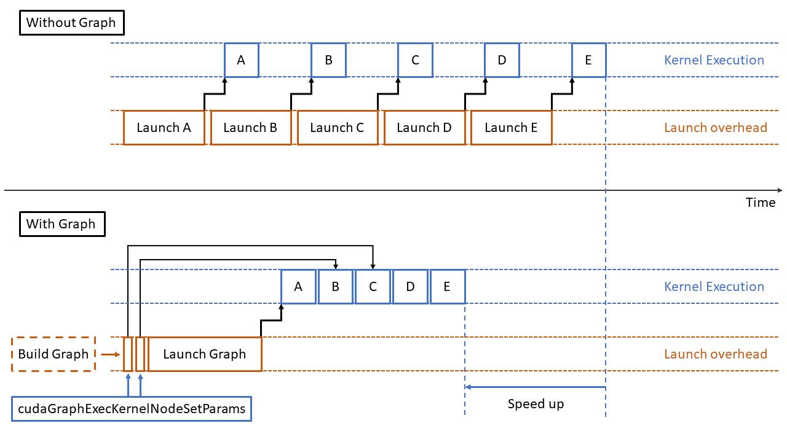
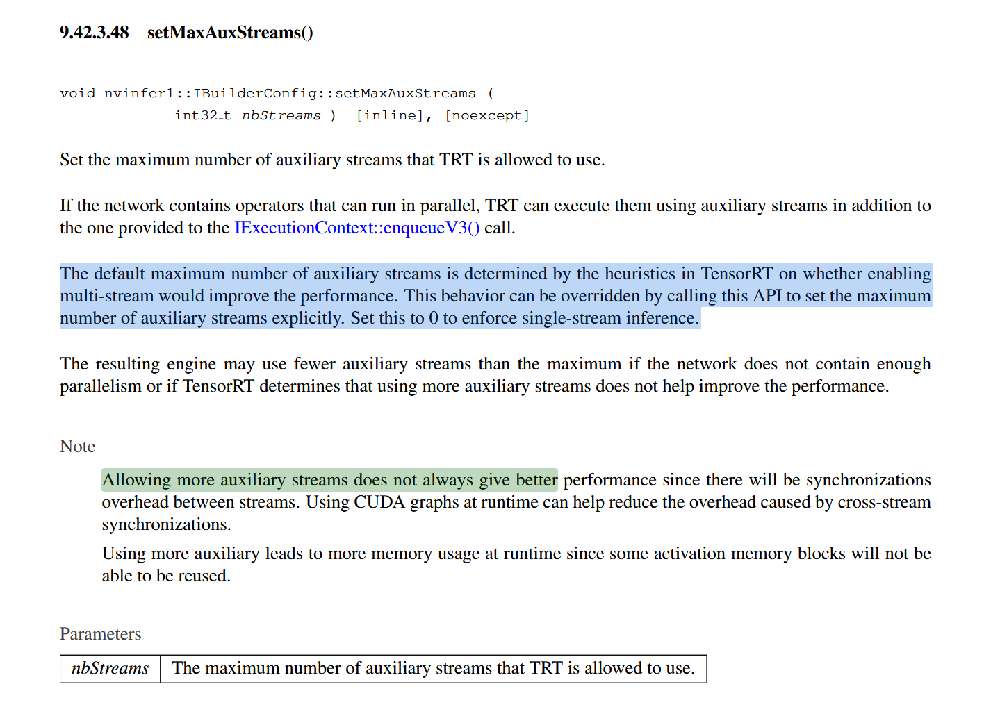

# 1 前言

根据官方文档的描述，解释一下什么是cudaGraph，其次为什么要使用cudaGraph。

## 1.1 什么是cudaGraph

官方的描述如下

```tex
CUDA Graphs present a new model for work submission in CUDA. A graph is a series of operations, such as kernel launches, connected by dependencies, which is defined separately from its execution. This allows a graph to be defined once and then launched repeatedly.
```

翻译过来就是

```tex
CUDA 图形为 CUDA 中的工作提交提供了一种新模式。图形是一系列操作（如内核启动），由依赖关系连接，与执行分开定义。这使得图形可以一次性定义，然后重复启动
```

自己的理解：

* 没有Graph：CPU端每次调用一个kernel 的Launch，多个Kernel就多次Launch。

* 将多个kernel录制为一个Graph，一次Launch Graph操作就可以支持多个kernel。然后在这一个图中进行运算。如下图，Y就是一个Graph，其中包含了多个kernel A、kernel B、kernel C、kernelD。但是我们之需要执行Y就相当与执行了ABCD。


## 1.2 为什么要使用Graph

先通俗的理解一下，在我们的实际工程中在一个Stream中会调用多个cuda的kernel，按照Lanuch进入Stream的顺序在一个Stream中执行，每一次在CPU上调用kernel都会有一次Lanuch的操作，如果我们的kernel很多并且Lanuch的时间比较长，实际执行kernel的时间比较短，那么每一次Kernel的Lanuch操作的时间就不可忽略成为影响我们程序性能的重要因素了，描述的可能不直观，来一张官方介绍的图就明白了



要实现上图的Graph加速实际上需要一些前提，我下面的测试实际上并没有体现Graph的加速。这些前提就是下面的官方描述

```tex
eparating out the definition of a graph from its execution enables a number of optimizations: first, CPU launch costs are reduced compared to streams, because much of the setup is done in advance; second, presenting the whole workflow to CUDA enables optimizations which might not be possible with the piecewise work submission mechanism of streams.

To see the optimizations possible with graphs, consider what happens in a stream: when you place a kernel into a stream, the host driver performs a sequence of operations in preparation for the execution of the kernel on the GPU. These operations, necessary for setting up and launching the kernel, are an overhead cost which must be paid for each kernel that is issued. For a GPU kernel with a short execution time, this overhead cost can be a significant fraction of the overall end-to-end execution time.
```

翻译过来就是

```tex
将图形的定义与执行分离开来可以实现一系列优化：首先，与流相比，CPU 的启动成本降低了，因为大部分设置都是提前完成的；其次，将整个工作流程呈现给 CUDA 可以实现优化，而流的分片工作提交机制可能无法实现这些优化。

要了解图形可能带来的优化，请考虑一下在流中发生的情况：当您将内核放入流中时，主机驱动程序会执行一系列操作，为在 GPU 上执行内核做准备。这些操作是设置和启动内核所必需的，也是每发布一个内核必须支付的开销。对于执行时间较短的 GPU 内核来说，这种开销成本可能占整个端到端执行时间的很大一部分。
```

我总结的使用Graph的有点如下：

* **也就是单独Lanuch没一个kernel的操作时间比较长，kernel的执行执行时间短。如果构建为一个Graph之后多个kernel的Launch就可以合并为一次Launch进而实现优化**
* **因为kernel的Launch少了，因此CPU的负载也会降低**
* 其他的cuda内部优化，不得而知。

# 2 创建并使用Graph

Graph可以通过两种机制创建：显式API和流捕获。以下是创建和执行下面图表的示例。


## 2.1 使用API创建Graph

```c
// Create the graph - it starts out empty
cudaGraphCreate(&graph, 0);

// For the purpose of this example, we'll create
// the nodes separately from the dependencies to
// demonstrate that it can be done in two stages.
// Note that dependencies can also be specified
// at node creation.
cudaGraphAddKernelNode(&a, graph, NULL, 0, &nodeParams);
cudaGraphAddKernelNode(&b, graph, NULL, 0, &nodeParams);
cudaGraphAddKernelNode(&c, graph, NULL, 0, &nodeParams);
cudaGraphAddKernelNode(&d, graph, NULL, 0, &nodeParams);

// Now set up dependencies on each node
cudaGraphAddDependencies(graph, &a, &b, 1);     // A->B
cudaGraphAddDependencies(graph, &a, &c, 1);     // A->C
cudaGraphAddDependencies(graph, &b, &d, 1);     // B->D
cudaGraphAddDependencies(graph, &c, &d, 1);     // C->D
```

## 2.2 使用Stream捕获创建Graph

流捕获提供了一种机制，可从现有的基于流的应用程序接口创建图形。在调用 `cudaStreamBeginCapture()` 和 `cudaStreamEndCapture() `时，可括弧括住向流（包括现有代码）启动工作的代码部分

具体参考[3.2.8.7.3. Creating a Graph Using Stream Capture](https://docs.nvidia.com/cuda/cuda-c-programming-guide/index.html#creating-a-graph-using-stream-capture)

```C
cudaGraph_t graph;

cudaStreamBeginCapture(stream);

kernel_A<<< ..., stream >>>(...);
kernel_B<<< ..., stream >>>(...);
libraryCall(stream);
kernel_C<<< ..., stream >>>(...);

cudaStreamEndCapture(stream, &graph);
```

## 2.3 测试例子

因为我的测试kernel都比较简单，所以kernel的Launch都比较短，看不出使用Graph的优势，但是还是可以作为一个使用的例子来参考一下的。

测试代码如下：

```C
#include "../common/common.h"
#include <cuda_runtime.h>
#include <stdio.h>

/*
 * This example implements matrix element-wise addition on the host and GPU.
 * sumMatrixOnHost iterates over the rows and columns of each matrix, adding
 * elements from A and B together and storing the results in C. The current
 * offset in each matrix is stored using pointer arithmetic. sumMatrixOnGPU2D
 * implements the same logic, but using CUDA threads to process each matrix.
 */

#define NSTEP 5
#define NKERNEL 40

void initialData(float *ip, const int size)
{
    int i;

    for (i = 0; i < size; i++)
    {
        ip[i] = (float)(rand() & 0xFF) / 10.0f;
    }
}

void sumMatrixOnHost(float *A, float *B, float *C, const int nx, const int ny)
{
    float *ia = A;
    float *ib = B;
    float *ic = C;

    for (int iy = 0; iy < ny; iy++)
    {
        for (int ix = 0; ix < nx; ix++)
        {
            ic[ix] = ia[ix] + ib[ix];
        }

        ia += nx;
        ib += nx;
        ic += nx;
    }

    return;
}

void checkResult(float *hostRef, float *gpuRef, const int N)
{
    double epsilon = 1.0E-8;

    for (int i = 0; i < N; i++)
    {
        if (abs(hostRef[i] - gpuRef[i]) > epsilon)
        {
            printf("host %f gpu %f ", hostRef[i], gpuRef[i]);
            printf("Arrays do not match.\n\n");
            break;
        }
    }
}

// grid 2D block 2D
__global__ void sumMatrixOnGPU2D(float *A, float *B, float *C, int NX, int NY)
{
    unsigned int ix = blockIdx.x * blockDim.x + threadIdx.x;
    unsigned int iy = blockIdx.y * blockDim.y + threadIdx.y;
    unsigned int idx = iy * NX + ix;

    if (ix < NX && iy < NY)
    {
        C[idx] = A[idx] + B[idx];
    }
}

int main(int argc, char **argv)
{
    float elapsed_time;

    // set up device
    int dev = 0;
    cudaDeviceProp deviceProp;
    CHECK(cudaGetDeviceProperties(&deviceProp, dev));
    CHECK(cudaSetDevice(dev));

    // set up data size of matrix
    int nx = 1 << 5;
    int ny = 1 << 5;

    int nxy = nx * ny;
    int nBytes = nxy * sizeof(float);

    // malloc host memory
    float *h_A, *h_B, *hostRef, *gpuRef;
    h_A = (float *)malloc(nBytes);
    h_B = (float *)malloc(nBytes);
    hostRef = (float *)malloc(nBytes);
    gpuRef = (float *)malloc(nBytes);

    // initialize data at host side
    double iStart = seconds();
    initialData(h_A, nxy);
    initialData(h_B, nxy);
    double iElaps = seconds() - iStart;

    memset(hostRef, 0, nBytes);
    memset(gpuRef, 0, nBytes);

    // add matrix at host side for result checks
    // iStart = seconds();
    sumMatrixOnHost(h_A, h_B, hostRef, nx, ny);
    // iElaps = seconds() - iStart;

    // malloc device global memory
    float *d_MatA, *d_MatB, *d_MatC;
    CHECK(cudaMalloc((void **)&d_MatA, nBytes));
    CHECK(cudaMalloc((void **)&d_MatB, nBytes));
    CHECK(cudaMalloc((void **)&d_MatC, nBytes));

    // transfer data from host to device
    CHECK(cudaMemcpy(d_MatA, h_A, nBytes, cudaMemcpyHostToDevice));
    CHECK(cudaMemcpy(d_MatB, h_B, nBytes, cudaMemcpyHostToDevice));

    // invoke kernel at host side
    int dimx = 32;
    int dimy = 32;

    if (argc > 2)
    {
        dimx = atoi(argv[1]);
        dimy = atoi(argv[2]);
    }

    dim3 block(dimx, dimy);
    dim3 grid((nx + block.x - 1) / block.x, (ny + block.y - 1) / block.y);

    // execute the kernel
    cudaStream_t stream;
    CHECK(cudaStreamCreate(&stream));
    // creat events
    cudaEvent_t start, stop;
    CHECK(cudaEventCreate(&start));
    CHECK(cudaEventCreate(&stop));

    // record start event
    CHECK(cudaEventRecord(start, 0));

    for (int istep = 0; istep < NSTEP; istep++)
    {
        for (int ikrnl = 0; ikrnl < NKERNEL; ikrnl++)
        {
            sumMatrixOnGPU2D<<<grid, block, 0, stream>>>(d_MatA, d_MatB, d_MatC, nx, ny);
        }
        CHECK(cudaStreamSynchronize(stream));
    }

    CHECK(cudaEventRecord(stop, 0));
    CHECK(cudaEventSynchronize(stop));

    // calculate elapsed time
    CHECK(cudaEventElapsedTime(&elapsed_time, start, stop));
    printf("Measured time for Graph execution = %fs\n",
           elapsed_time / 1000.0f);

    // cudaGraph
    bool graphCreated = false;
    cudaGraph_t graph;
    cudaGraphExec_t instance;

    // record start event
    CHECK(cudaEventRecord(start, 0));
    for (int istep = 0; istep < NSTEP; istep++)
    {
        if (!graphCreated)
        {
            cudaStreamBeginCapture(stream, cudaStreamCaptureModeGlobal);
            for (int ikrnl = 0; ikrnl < NKERNEL; ikrnl++)
            {
                sumMatrixOnGPU2D<<<grid, block, 0, stream>>>(d_MatA, d_MatB, d_MatC, nx, ny);
            }
            cudaStreamEndCapture(stream, &graph);
            cudaGraphInstantiate(&instance, graph, NULL, NULL, 0);
            graphCreated = true;
        }
        cudaGraphLaunch(instance, stream);
        CHECK(cudaStreamSynchronize(stream));
    }
    CHECK(cudaEventRecord(stop, 0));
    CHECK(cudaEventSynchronize(stop));

    // calculate elapsed time
    CHECK(cudaEventElapsedTime(&elapsed_time, start, stop));
    printf("Measured time for Graph execution = %fs\n",
           elapsed_time / 1000.0f);

    // copy kernel result back to host side
    CHECK(cudaMemcpy(gpuRef, d_MatC, nBytes, cudaMemcpyDeviceToHost));

    // check device results
    checkResult(hostRef, gpuRef, nxy);

    CHECK(cudaStreamDestroy(stream));
    // free device global memory
    CHECK(cudaFree(d_MatA));
    CHECK(cudaFree(d_MatB));
    CHECK(cudaFree(d_MatC));

    // free host memory
    free(h_A);
    free(h_B);
    free(hostRef);
    free(gpuRef);

    // reset device
    CHECK(cudaDeviceReset());

    return EXIT_SUCCESS;
}

```

测试结果如下（一次运行40个kernel，运行5次），前面的蓝色是没有使用Graph的情况，后面的橙色是使用Graph的情况（一个Graph内是40个kernel）


先看一下没有使用Graph的时候，如下图是单独一次的运行（总共运行5次，这是其中的一次），可以看出有40次kernel的Launch。


再看一下使用Graph的情况，如下图是单独一次的运行（总共运行5次，这是其中的一次），可以看出之调用一次GraphLaunch。（总共调用5次）


我这里使用Graph并没有减少总的时间，主要是因为我测的是kernel比较小，kernel的Launch比较快。实际的工程中Kernel可能比较慢，

kernel的launch会比较大，主要有以下几种情况：

- **kernel的大小比较大**：kernel的大小越大，launch的开销就越大。
- **kernel的参数比较多**：kernel的参数越多，launch的开销就越大。
- **kernel的调用频率比较高**：kernel的调用频率越高，launch的开销就越大。


# cuda graph与stream

今天使用nsight system分析时测试发现一个cudaGraphLaunch 对应了多个stream。但是我捕获cudaGraph使用的是一个stream。为什么会对应多个stream呢？

在官方文档 https://developer.nvidia.com/docs/drive/drive-os/6.0.8/public/drive-os-tensorrt/pdf/NVIDIA-TensorRT-8.6.11-API-Reference-for-DRIVE-OS.pdf中，找到一些端倪

下面的函数提到了` IExecutionContext::enqueueV3()`可能会自动的创建辅助流 `auxiliary streams`。也就是说我的模型engine如果存在一些可以并行的模块（没有互相的依赖性），那么TRT会自动的创建多个流来提高并行性。虽然我捕获cudaGraph enqueueV3() 时只是一个流，但是因为我捕获的流依赖TRT自动创建的其他多个流，因此cudaGraph会捕获所有相关的流。因此我才在nsight system中看到一个cudaGraphLaunch对应多个流。这本来就是TRT的优化部分。不用过度操心



# 附录：

* 官方文档：[3.2.8.7. CUDA Graphs](https://docs.nvidia.com/cuda/cuda-c-programming-guide/index.html#cuda-graphs)
* 官方博客：[Getting Started with CUDA Graphs](https://developer.nvidia.com/blog/cuda-graphs/)
* 官方博客：[Constructing CUDA Graphs with Dynamic Parameters](https://developer.nvidia.com/blog/constructing-cuda-graphs-with-dynamic-parameters/)

